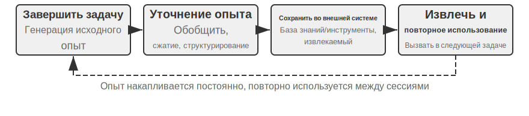
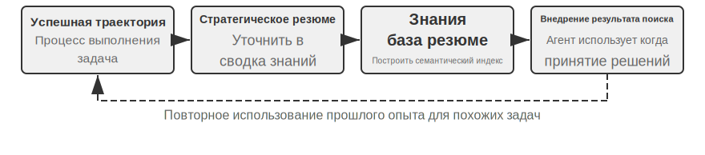
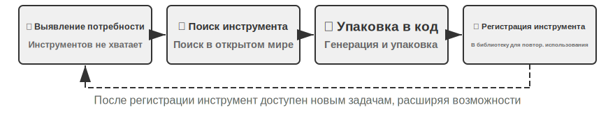
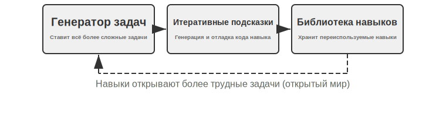
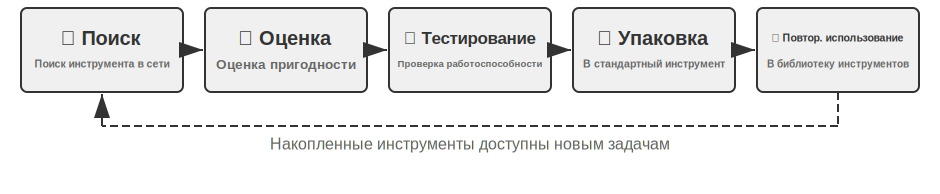

# Самоэволюция агента

Предыдущие главы выстроили систему возможностей агента с разных сторон. Во второй главе инженерия контекста заложила основу управления информацией (включая механизм Skills с загрузкой по требованию); в третьей главе база знаний и память пользователя реализовали персистентность знаний между сессиями; в пятой главе показано, как кодинг-агент накапливает опыт через файловую систему; в седьмой главе постобучение методом обучения с подкреплением закрепляет политику в параметрах модели. Эти технологии расставляют акценты по-разному, но все указывают на один вопрос: **как агент может непрерывно становиться сильнее?**

Даже самая передовая модель, столкнувшись с процессом возврата средств конкретной компании, речевыми стратегиями определённого оператора связи или способом вызова малоизвестного API, оказывается в той же ситуации, что и новичок в первый день на работе. Изменение весов модели требует огромного объёма данных и вычислительных ресурсов, а цикл обновления измеряется неделями; в реальности же новые API появляются, старые сервисы отключаются, а потребности пользователей постоянно меняются. Агенту нужен более лёгкий и оперативный механизм эволюции — не меняющий параметры модели, но позволяющий непрерывно расширять границы собственных возможностей.

Именно такой механизм рассматривается в этой главе: **самоэволюция агента (Self-Evolution)**. Самоэволюция — это экстернализованное обучение, включающее два измерения: накопление знаний из опыта и активное обнаружение и создание новых инструментов. Ключевая идея — отделить знания и процессы от параметров модели и временного контекста, экстернализовав их в персистентные, доступные для поиска и переиспользуемые внешние ресурсы — библиотеку инструментов и базу знаний. Это не замена постобучения, а его дополнение: постобучение решает задачу «как сделать модель умнее», самоэволюция — «как сделать агента более умелым».

## Почему агент не учится автоматически

Выше шла речь о практической потребности. Но есть более фундаментальный вопрос: **если бы окно контекста могло быть бесконечно длинным и туда можно было бы запихнуть все диалоги и результаты вызовов инструментов, через которые прошёл агент, — научился бы он тогда всему автоматически?**

Ответ отрицательный, и причина кроется в механизме внимания, который обсуждался во второй главе. Это теоретическая отправная точка данной главы, и, хотя с тех пор прошло несколько глав, стоит кратко её напомнить.

Вторая глава неоднократно подчёркивала: **внутренний механизм обучения в контексте больше похож на поиск, чем на рассуждение**. Внимание хорошо справляется с «поиском» — «какая кошка в 37-й клетке?» находится за один шаг; но плохо справляется с «статистическим обобщением» за один проход вперёд — «сколько всего чёрных кошек в 100 клетках?». Второе требует перебора всех записей и поддержания состояния счётчика — это по сути мышление, а не поиск. Иными словами, если свалить сырой опыт в контекст одной кучей, модель сможет его «запомнить», но не сможет автоматически «дистиллировать» из него переиспользуемую закономерность. Даже если контекст действительно был бы бесконечным, этот разрыв никуда бы не делся: информация есть, но никто не выполняет за модель тот шаг сжатия от «конкретной записи» к «общему паттерну». Более того, как показала «деградация контекста» из второй главы, чем длиннее контекст и чем больше в нём шума, тем сильнее размывается внимание — и тем труднее найти ключевую информацию: бесконечный контекст не только не приносит автоматического обучения, но ещё и постепенно ухудшает качество поиска. Наблюдение Карпатого можно прочитать и в обратную сторону: «плохая память» модели — это особенность, а не недостаток, она вынуждает нас проактивно и явно заниматься дистилляцией знаний, а не рассчитывать, что модель сама поймёт закономерности из длинной истории. Одной фразой: **обучение не происходит само по себе, его нужно явно спроектировать** — именно в этом и состоит смысл данной главы.

При этом «явно спроектированное обучение» появляется не только в восьмой главе — оно закладывалось и в предыдущих главах, только в основном для удовлетворения сиюминутных потребностей **внутри одной сессии** или **соседних сессий**: **сжатие контекста** из второй главы, которое дополнительным вызовом LLM «обменивает» громоздкие сырые записи на уже готовые выводы, восполняя ту недостающую половину «дистилляции», которую не может выполнить внимание; **строка состояния агента** из второй главы, где код детерминированно поддерживает ключевые выводы в контексте — это другая сторона той же монеты; **память пользователя** из третьей главы уже выводит «обучение» на уровень между сессиями — агент накапливает знания о пользователе от диалога к диалогу, и офлайн-упорядочивание делает эти знания всё точнее.

Память пользователя из третьей главы сама по себе — это форма обучения, только накапливающая **информацию** о том, «кто такой пользователь» (предпочтения, факты, привычки). Восьмая глава восполняет другую, ещё более долгосрочную половину: превращает выводы из исследования — стратегии решения задач, рабочие процедуры, уроки из неудач и даже совершенно новые инструменты — в персистентные, доступные для поиска и переиспользуемые **способности**, чтобы агент не просто «помнил больше», а становился «всё более умелым». Такое обучение более долгосрочно и требует, чтобы его **активно** инициировал сам агент, поэтому оно заслуживает отдельной главы — сначала определим его место на макроуровне.

## Три парадигмы обучения и место самоэволюции среди них

Три парадигмы, введённые в первой главе (Рис. 1-1), здесь приводятся только для позиционирования. **Постобучение** изменяет веса модели, закрепляя «опыт» в виде «мышечной памяти» через RL — высокий процент успеха, низкая задержка, но высокая стоимость обновления и долгий цикл (подробно рассмотрено в седьмой главе); **обучение в контексте** (In-Context Learning, ICL) даёт примеры-демонстрации прямо в промпте для временной адаптации — дёшево и быстро, но исчезает по завершении сессии (подробно в первой и второй главах); **экстернализованное обучение** — путь, который разработчики чаще всего упускают из виду: знания оседают в файлах, базах знаний и инструментах вне модели — персистентно, объяснимо и в любой момент корректируемо. Все три работают в связке, а не соперничают: фактические знания отдаются RAG (подробно в третьей главе) и внешнему хранению, устойчивое поведение и форматы закрепляются постобучением, а текущая сиюминутная информация — обучением в контексте.

В этой главе рассматривается именно тот путь, **который не меняет веса модели**, — экстернализованное обучение, соответствующее двум измерениям, заявленным в начале главы: экстернализация опыта в знания и Skill, экстернализация возможностей в инструменты. (Здесь важно отличать это от «код создаёт код: самобутстрапинг агента» из пятой главы: там речь о том, как агент создаёт системы, подобные себе самому, а в этой главе — о наращивании возможностей без изменения весов. Третья глава решает вопрос «как хранить и как искать» в базе знаний, а эта глава — вопрос «кто наполняет и обновляет» — как агент активно накапливает опыт.)

Зачем это нужно? Рассмотрим сначала обратный сценарий. Допустим, агент службы поддержки впервые обрабатывает процесс возврата средств для некоего банка: после 15 минут исследования — трёх звонков и двух опробованных сценариев разговора — возврат наконец успешно завершён. Если у агента нет способности к экстернализованному обучению, при следующем полностью идентичном запросе ему придётся снова с нуля потратить 15 минут на тот же путь исследования — накопленный опыт исчезнет вместе с завершением сессии. Ключевое слово здесь — «самостоятельно»: не инженер-человек готовит документацию для агента, а сам агент в процессе выполнения задачи подводит итоги, строит инструменты, обновляет базу знаний — подобно тому, как опытный сотрудник службы поддержки собирает разрозненные правила по возвратам в единое руководство, которое всегда под рукой и которое он сам обновляет по мере появления новых ситуаций. Ключевая философия: вместо того чтобы надеяться, что модель запомнит всё, лучше по завершении задачи потратить дополнительные вычисления на то, чтобы подытожить, сжать и структурировать опыт, а затем сохранить его во внешней персистентной, доступной для поиска системе. По сравнению с обучением параметров, такой способ позволяет быстро накапливать объяснимые, проверяемые и корректируемые знания без дорогостоящего обучения; по сравнению с обучением в контексте, за счёт активной дистилляции и структурированной организации он избегает неэффективного поиска в море сырой информации и обеспечивает персистентность между сессиями.

Более того, экстернализованное обучение поднимает способность агента к обучению с уровня «запоминания информации» до уровня «построения способностей»: он не только может обобщить опыт в виде концентрированного знания и сохранить его в базе знаний для последующего поиска (иерархическая дистилляция по методу RAPTOR, представленная в разделе про RAG в третьей главе, точно так же применима к послойной дистилляции опыта — от конкретных записей операций к правилам, а затем к принципам), но и способен упаковать повторяющиеся операционные процессы в инструменты для точного выполнения, формируя постоянно растущую библиотеку навыков. Приведём пример: агент службы поддержки, помогая одному клиенту с возвратом средств, может усвоить три различных по природе вещи. Первое — конкретное правило: «Для возврата средств компании A обязательно нужно проверить последние четыре цифры кредитной карты» — это фактическое знание, его достаточно занести в базу знаний. Второе — универсальный инструмент: «автоматический запрос статуса заказа через API X» — это устойчивая переиспользуемая последовательность операций, наиболее выгодно закрепить её как кодовый инструмент. Третье — должностное руководство: «полный Skill для процесса возврата средств», включающий стратегические суждения и часто меняющиеся бизнес-правила — его удобнее оформить как документ Skill. Таблица 8-1 обобщает эти три вида результатов экстернализованного обучения.

Таблица 8-1. Три вида результатов экстернализованного обучения

| Форма результата | Что содержит | Пример | Способ использования |
|-------------|----------------------|--------------------------------|---------------------------|
| Запись в базе знаний | Факты и правила | «Этот банк требует указать адрес отделения, где открыт счёт» | Семантический поиск или точный поиск через `grep` |
| Специализированный кодовый инструмент | Повторяемый операционный процесс | «Последовательность вызовов API для запроса баланса счёта» | Закрепляется как код, вызывается через параметры |
| Документ Skill | Сложная, но часто меняющаяся рабочая стратегия | «Лучшие практики обработки страховых претензий» | Документ на естественном языке, загружается по требованию |

Есть простое эмпирическое правило для выбора формы: **чисто фактическую информацию — в базу знаний; то, что используется часто и имеет сложные параметры, — оформлять в виде кода (инструмента); то, что часто меняется и требует стратегического суждения, — оформлять в виде документа (Skill)**. Два последних варианта относятся к «генерации инструментов» — более продвинутой форме экстернализованного обучения, которая экстернализует не только «знание», но и «процесс», кодифицируя его, переводя работу из режима «каждый раз думать заново» в режим «один раз создать, использовать многократно» — подобно тому, как после первого ручного развёртывания сервера шаги записывают в автоматизированный скрипт. Четвёртая глава уже подробно рассмотрела фреймворк выбора между специализированным инструментом и Skill.

Позиция, заявленная в первой главе по отношению к Горькому уроку — **согласие с направлением, прагматизм в темпе** — наиболее полно проявляется именно в экстернализованном обучении. Вместо того чтобы сжимать всё знание в параметры или намертво прописывать процессы в виде if-else правил, агенту дают возможность самостоятельно выстраивать внешнюю экосистему знаний и инструментов, продлевая логику наращивания возможностей из внутреннего мира модели (масштаб параметров) во внешний мир (масштаб инструментов и базы знаний). Выбор носителя знаний подчиняется той же логике: память и навыки, обсуждаемые в этой главе, в основном оседают в виде Markdown-файлов в файловой системе, а не полагаются на графы знаний, спроектированные человеком, — последние точнее в узкоспециализированных областях, но естественный язык — это формат, с которым модель работает лучше всего, и в сочетании со сжатием и упорядочиванием силами LLM именно этот путь не зависит от заранее заданной человеком структуры и способен непрерывно расширяться вместе с ростом возможностей модели. Разумеется, само экстернализованное обучение — в каком формате хранить, как организовать индексацию, когда проводить дистилляцию — всё ещё требует инженерного проектирования, и именно в этом проявляется «прагматизм в темпе».

## Почему агент должен учиться на опыте: от «ума» к «мастерству»

Упомянутый выше «опытный сотрудник службы поддержки», собравший разрозненные правила в руководство, указывает на ключевое различие между «умом» и «мастерством»: разрыв часто заключается не в недостаточной сообразительности модели, а в том, что многие бизнес-процессы и знания предметной области динамически меняются и не являются публичными — одним лишь повышением общих возможностей базовой модели такие задачи, зависящие от «опыта», не решить. Именно этому классу знаний и должен учиться агент на опыте — что для отмены определённого сервиса нужно заполнить конкретную форму, а не бесполезно звонить по телефону; какие условия применения имеет некая скидка (например, для ветеранов или клиентов со стажем более двух лет); есть ли ещё пространство для торга по тарифу на широкополосный интернет у определённого оператора в определённом регионе. Аналогично, кодинг-агент не знает специфичных для проекта стандартов кодирования и процессов развёртывания, агент-браузер не знает антибот-стратегий конкретного сайта и изменений в разметке страниц — всё это актуальные знания предметной области, отсутствующие в данных предобучения.

## Учиться на опыте

Разобравшись, «почему нужно учиться», перейдём к вопросу «как учиться». Инженерная практика экстернализованного обучения начинается с «фиксации и повторного использования успешного опыта». Два следующих эксперимента демонстрируют два взаимодополняющих способа накопления опыта: один превращает стратегию высокого уровня в извлекаемое резюме знаний (что-то вроде «конспекта решений»), другой закрепляет конкретную последовательность действий в виде воспроизводимого автоматизированного инструмента (что-то вроде «записи операций»).

Таблица 8-2 классифицирует механизмы обучения на опыте по уровням — это поможет разобраться в связи между извлечением знаний, их организацией, применением и инженерной поддержкой.

Таблица 8-2. Уровни механизмов обучения агента на опыте

| Уровень | Механизм | Какую проблему решает |
|------|------|-------------|
| Извлечение знаний | Стратегическое резюме, запись рабочего процесса, рефлексия над неудачами | Извлечение переиспользуемого знания из успехов и неудач |
| Организация знаний | Skills, консолидация во сне | Структурированное хранение и индексация знаний |
| Применение знаний | Оптимизация системного промпта | Внедрение знаний в поведенческие паттерны агента |
| Инженерная поддержка | Продолжение выполнения между сессиями | Возможность непрерывного выполнения долгих задач |

Эти четыре уровня переплетаются в дальнейшем изложении: стратегическое резюме, запись рабочего процесса и обучение на неудачах (извлечение знаний) естественным образом переходят к Skills и консолидации во сне (организация знаний), затем к оптимизации системного промпта (применение знаний) и завершаются продолжением выполнения долгих задач между сессиями (инженерная поддержка).

> **Эксперимент 8-1 ★★: Обучение на успешном опыте: стратегическое резюме**
>
> Проект `gaia-experience` — типичная реализация идеи «стратегического резюме» (Strategy Summary). Стратегическое резюме — это сжатие успешного процесса решения задачи в структурированную заметку об опыте: в ней фиксируется «какой метод применялся, на какие грабли наступили, какие шаги были ключевыми», чтобы в следующий раз, столкнувшись со схожей задачей, можно было напрямую на неё опереться.
>
> Не каждая траектория выполнения заслуживает превращения в опыт — критерий отбора **переносимость**: применим ли урок, извлечённый из текущей задачи, к похожим задачам в будущем? Исправление, работающее только для конкретного входа, не должно попадать в долговременную память.
>
> В эксперименте используются две ключевые инфраструктуры. **Фреймворк AWorld** — открытая среда выполнения и оценки, специально разработанная для ИИ-агентов; она предоставляет стандартизированный набор инструментов (браузер, файловая система, интерпретатор кода и т. д.) и автоматизированный пайплайн оценки — её можно представить как «экзаменационный класс» для агента. **GAIA** — чрезвычайно сложный набор оценочных бенчмарков, который оценивает возможности универсального ИИ-агента через многошаговые сложные задачи, требующие человеческого интеллекта, — например, «найти определённую информацию на сайте, обработать её кодом и вычислить ответ», что зачастую требует совместного использования браузера, файлового менеджера, интерпретатора кода и сложных логических рассуждений.
>
> Ключевое новшество — добавление к агенту в фреймворке AWorld полного замкнутого цикла «обучение — применение». В **режиме обучения (Learning Mode)** каждый раз, когда агент успешно завершает задачу GAIA, система автоматически фиксирует полную траекторию его действий и с помощью LLM проводит над ней «рефлексию» и «резюмирование», порождая структурированное резюме опыта. Это резюме содержит не только конечный ответ, но и извлекает ключевой метод решения задачи, важные наблюдения и последовательность эффективно использованных инструментов. Этот опыт векторизуется и сохраняется в базе знаний. В **режиме применения опыта (Apply Experience Mode)**, когда агент получает новую задачу, он сначала выполняет семантический поиск в базе знаний опыта, находит наиболее похожие исторические успешные примеры и внедряет этот опыт в системный промпт в качестве «успешных образцов» для ориентира при принятии решений. Эксперимент показывает, что это значительно повышает эффективность и успешность решения новых задач — чем больше задач решает агент, чем богаче накопленный опыт, тем сильнее его возможности, что формирует систему с положительной обратной связью самоэволюции.
>
> **Эксперимент 8-2 ★★: Обучение на повторяющихся задачах: запись и воспроизведение рабочего процесса**
>
> Проект `browser-use-rpa` — прекрасный пример идеи «записи рабочего процесса» (Workflow Recording). Идея записи рабочего процесса похожа на функцию «записи макроса» в Excel: при первом выполнении операции вручную шаги записываются, и в дальнейшем достаточно нажать «воспроизвести», чтобы автоматически повторить их. Этот проект решает вполне практическую проблему: многие повторяющиеся операции в браузере (например, отправка отчёта по почте, поиск определённой информации на сайте), хотя конкретные параметры каждый раз разные (получатель, ключевые слова поиска), имеют неизменный основной процесс выполнения. Заставлять агента каждый раз начинать с нуля и «переоткрывать» этот процесс с помощью дорогой мультимодальной большой модели — колоссальная растрата ресурсов: по сути это означает полагаться только на обучение в контексте, не превращая успешный опыт во внешне закреплённый переиспользуемый инструмент. В основе проекта — предельно строгий сравнительный эксперимент по эффективности и стоимости.
>
> На **этапе обучения (Learning Phase)** агент при первом выполнении задачи, подобно человеку, действует через цикл наблюдение-размышление-действие мультимодальной LLM. Каждый раз, когда LLM принимает решение выполнить операцию, система извлекает из истории фреймворка browser-use точную информацию о позиционировании обрабатываемого элемента: веб-страница в браузере представлена как дерево DOM (Document Object Model, объектная модель документа), где каждая кнопка, поле ввода, ссылка — это узел на дереве; XPath (XML Path Language) указывает на конкретный узел с помощью записи, похожей на путь к файлу `/html/body/div[2]/button[1]`. Операция записывается как структурированный шаг: тип операции (клик, ввод и т. д.), XPath целевого элемента, параметры операции и информация о проверке после выполнения (например, изменился ли URL страницы, появился ли ожидаемый элемент). После успешного завершения задачи LLM генерирует семантическую метку (например, «отправить электронное письмо») и описание («поле получателя, поле темы, поле содержимого, кнопка отправки»), которые вместе с последовательностью шагов сохраняются в базе знаний, формируя параметризованную запись «рабочего процесса».
>
> На **этапе воспроизведения (Replay Phase)**, когда поступает новая задача, система сопоставляет её с уже имеющимися рабочими процессами, комбинируя семантическое сходство (векторное вложение) и проверку ключевых элементов. При успешном совпадении процесс выполняется на высокой скорости пошагово: механизм ожидания (`page.locator(xpath).wait_for(state='visible', timeout=15000)`) Playwright (открытой библиотеки автоматизации браузера) гарантирует загрузку элементов; параметризованные шаблоны (например, «ввести в поле получателя `{{email}}`») используют вызов лёгкой LLM для извлечения фактических значений параметров из текущей инструкции задачи, без необходимости полноценного визуального размышления. Если какой-то шаг завершается неудачей (элемент не найден, истекло время ожидания), это означает, что структура страницы, возможно, изменилась; в этом случае рабочий процесс помечается как «возможно устаревший», происходит откат к режиму обучения — задача заново выполняется через размышления LLM, и создаётся новый рабочий процесс, заменяющий старый.
>
> **Сценарий приёмки**: отправка письма в веб-версии Gmail.
>
> - Первое выполнение (этап обучения): «отправить письмо на test@example.com, тема "тестовое письмо", содержание "это тестовое письмо"». Наблюдаем, как агент через мультимодальную LLM распознаёт кнопку «Написать», поле ввода получателя, поля темы и содержания, кнопку «Отправить». Фиксируем шаги операции, затраченное время, количество вызовов LLM.
> - Повторное выполнение (этап воспроизведения): «отправить письмо на another@example.com, тема "последующий тест", содержание "второе тестовое письмо"». Система распознаёт подходящий рабочий процесс, извлекает новые значения параметров, напрямую воспроизводит операции без визуального размышления LLM. Затраченное время и количество вызовов должны заметно снизиться при сравнении.
> - Обновление знаний: моделируем изменение верстки страницы (изменяем HTML-структуру так, чтобы XPath какой-то кнопки изменился), проверяем, что агент способен обнаружить недействительность рабочего процесса, откатиться к режиму обучения и заново создать рабочий процесс, обновив базу знаний.
>
> Ожидаемый результат: заметно возрастает скорость выполнения задач на этапе воспроизведения (в несколько раз), значительно снижается стоимость вызовов LLM, а успешность становится более стабильной.

Запись рабочего процесса — не изолированный инженерный приём, а часть более общей методологии. Voyager — архитектура открытого мира агента, предложенная командой NVIDIA (подробнее далее), систематизирующая цикл «исследование — закрепление» в виртуальном мире Minecraft: **выполнение задачи → проверка успеха → сохранение успешной последовательности операций в библиотеку навыков → обращение к ней при похожих задачах**. Эксперимент 8-2 — воплощение этой же идеи в сценарии автоматизации браузера: этап обучения соответствует «исследованию», база знаний рабочих процессов — «библиотеке навыков», а воспроизведение с откатом при недействительности — «обращению к сохранённому опыту» и непрерывному улучшению.

Эксперимент 8-2 также обнажает два самых уязвимых звена в схеме «запись — воспроизведение», и без их аккуратной проработки этот механизм по-настоящему надёжным не станет[^preact]. Первое звено — **когда можно доверять воспроизведению**. Более надёжный подход — скомпилировать успешную последовательность операций в небольшую **программу-автомат состояний**: каждое состояние снабжено «предикатом проверки» (паттерном интерфейса, который обязан выполняться на реальном экране в данный момент), и при воспроизведении **перед каждым действием предикат сверяется с текущим состоянием экрана в реальном времени** — «сначала убедись, потом действуй». Как только предикат не выполняется или действие завершается ошибкой, управление передаётся обратно полноценному агенту, который начинает заново, а новая траектория повторно компилируется в программу. Именно потому что при воспроизведении не требуется ни одного вызова модели, попадание в кеш повторяющихся задач ускоряет выполнение в 8,5–13 раз. Второе звено — **не сохранять в базу плохие программы**: сразу после компиляции нужно сбросить окружение и воспроизвести программу с нуля, подтвердив с помощью встроенного в бенчмарк оценщика, что «на этот раз задача действительно выполнена», — только после этого программу можно допускать в библиотеку. Эта проверка «перед сохранением» отсекает программы, которые «формально покрывают воспроизведение на 100%, но на самом деле не довели дело до конца» (например, весь процесс пройден, кнопка «Сохранить» нажата, но какое-то поле на деле осталось пустым). Без этой проверки библиотека программ будет постепенно деградировать по мере накопления неисправных программ. Всё это сводится к одному чёткому принципу: **память о процессах тоже нуждается в проверочном шлюзе, иначе цикл самоулучшения не удастся уберечь от порчи** — это и есть строгая версия механизма «обнаружить недействительность рабочего процесса, откатиться и заново обучиться» из эксперимента 8-2.

[^preact]: Компиляция успешной траектории в программу-автомат состояний с предикатами проверки и установка шлюза «проверка перед сохранением» — полный механизм описан в: Li, Bojie. *PreAct: Computer-Using Agents that Get Faster on Repeated Tasks.* arXiv:2606.17929, 2026.

### Обучение на неудачах

И стратегическое резюме, и запись рабочего процесса извлекают опыт из **успешных траекторий** — в эксперименте 8-1 рефлексия и резюмирование запускаются только после успешного завершения задачи. Но опыт неудач тоже стоит закреплять, и порой в нём даже больше информации: одна неудача чётко исключает один путь, тогда как успех зачастую — лишь один из множества возможных путей. У опыта неудач есть две типичные формы закрепления: **библиотека паттернов ошибок** (фиксирует «в каких условиях какой метод потерпит неудачу, каковы сигналы этой неудачи») и **негативные правила** («не использовать снова метод X для Y» — например, «не пытаться отменить подписку через звонок этому оператору — телефонный канал не имеет прав на такую операцию»).

Представитель этого направления — Reflexion (Shinn et al., 2023)[^reflexion-2023]: после провала задачи агент на естественном языке рефлексирует над причиной неудачи (например, «на третьем шаге мне следовало сначала проверить личность, а не сразу отправлять форму») и сохраняет текст рефлексии в эпизодической памяти (episodic memory); при следующей попытке решить аналогичную задачу эти рефлексии считываются как дополнительный контекст, что позволяет избежать повторения ошибки. Ни один параметр модели при этом не обновляется — Reflexion представляет собой классический пример «эволюции без изменения весов»; такая рефлексия, выраженная языком, несёт гораздо больше информации, чем скалярное вознаграждение, — эту мысль мы развернём позже, когда будем обсуждать обучение системных промптов. Ещё один важный канал использования опыта неудач — системный промпт: обсуждаемая далее в этой главе автоматическая оптимизация системного промпта как раз записывает в системный промпт негативные правила, извлечённые из неудачных случаев (например, «никогда не переключать на оператора-человека из-за спорных вопросов политики»), превращая их в поведенческое ограничение, действующее для всех последующих задач.

[^reflexion-2023]: Shinn, N., et al. *Reflexion: Language Agents with Verbal Reinforcement Learning.* arXiv:2303.11366, 2023.

### Skills: экстернализация предметных знаний в структурированные способности

Два предыдущих механизма закрепляли соответственно опыт «как думать» и «как делать». Механизм Skills идёт по третьему пути — систематически извлекает предметные операционные знания в структурированные, загружаемые по мере необходимости модули способностей. Skill можно представить как «должностную инструкцию»: новому сотруднику не нужно постигать всё с нуля — прочитав инструкцию, он сразу может приступить к работе. Вторая глава подробно рассматривала механизм прогрессивного раскрытия (Progressive Disclosure) для Skills (метаданные → основной процесс → детали) и его совместимость с KV Cache; в этом разделе речь пойдёт о философии экстернализации знаний, стоящей за Skills, и об их автоматическом создании.

Ключевая ценность Skills — в том, что знания несёт человекочитаемый текст: их можно быстро обновлять (не требуется переобучение модели), проверять (эксперт-человек может напрямую внести правки и улучшения), переносить (работают при смене модели или системы). По сути, Skills превращают предметные знания, застрявшие в неструктурированных документах, в структурированную форму, удобную для использования агентом — позволяя агенту применять знания через универсальные способности поиска и рассуждения, вместо жёсткого зашивания знаний в логику кода.

Ещё дальше идёт Skill Creator[^ch8-1] от Anthropic — мета-способность, создающая другие Skills; она направляет агента через наблюдение, обучение и обобщение к извлечению предметных операционных знаний в структурированный Skill. Когда агента просят создать Skill для какой-либо области, он сначала через диалог с пользователем понимает конкретные сценарии использования, затем анализирует каждый сценарий и выявляет переиспользуемые ресурсы, и наконец создаёт полный пакет Skill со стандартной структурой каталогов, включающий scripts, references, assets и главный документ `SKILL.md`. Skill Creator делает так, что сам процесс превращения знаний тоже выполняется агентом, реализуя самоподдерживающийся цикл накопления знаний: агент не только использует Skills, но и создаёт их.

[^ch8-1]: Anthropic, «Skill Creator», 2025. https://github.com/anthropics/skills/blob/main/skill-creator/SKILL.md

Механизм `CLAUDE.md` в Claude Code демонстрирует схожую способность: при первом обращении к кодовой базе агент активно прочитывает весь репозиторий и генерирует руководство по проекту, содержащее ключевую информацию об архитектуре, стандартах кодирования, способах тестирования, — и в дальнейшей разработке постоянно к нему обращается и обновляет его. Такой автоматизированный механизм генерации Skills освобождает расширение возможностей агента от ограничений, налагаемых доступным временем и охватом знаний экспертов-людей — когда агент попадает в новую предметную область, он способен через самостоятельное исследование выстроить операционное руководство и закрепить его как Skill, реализуя переход от «зависимости от предварительно запрограммированных знаний» к «накоплению знаний в процессе практики».

С точки зрения «закрепления опыта» путь генерации инструментов также можно разделить на две конкретные формы: специализированные программные инструменты и связку Skill + универсальный исполнитель. Принцип выбора между ними уже был изложен ранее, а полная схема представлена в четвёртой главе — не будем повторяться; применительно к сценариям этого раздела: операции со сложными параметрами и частыми вызовами закрепляются как программные инструменты (например, библиотека навыков, накопленная Voyager в Minecraft, или параметризованные скрипты, порождённые записью браузерного рабочего процесса), а стратегические, легко меняющиеся бизнес-правила оформляются как документ Skill (например, `CLAUDE.md` в Claude Code). На практике реальные системы часто используют обе формы вперемешку.

### Обучение во сне: самостоятельная эволюция памяти пользователя

Механизмы обучения на опыте, которые мы обсуждали выше, — стратегическое резюме, запись рабочего процесса, генерация Skills — это всё непосредственная переработка опыта, происходящая во время выполнения задачи или сразу после её завершения. Но у человеческого обучения есть ещё один важный этап: **консолидация памяти во сне**. Во второй главе, обсуждая сжатие контекста, мы уже использовали эту аналогию — мозг перерабатывает дневные сенсорные впечатления в компактную долговременную память; эта аналогия применима не только к сжатию контекста внутри одной сессии, но и может быть распространена на управление опытом между сессиями: разрозненный опыт, полученный за день, во сне заново организуется, освобождается от избыточности, сливается с уже существующей сетью знаний и превращается в более компактную, легче извлекаемую долговременную память.

Самый типичный объект такой офлайн-консолидации — это память агента о **самом пользователе**: кто вы, какие у вас предпочтения, какие факты вы упоминали. Здесь стоит сразу прояснить одно распространённое заблуждение: то, что такие агенты, как Claude Code, приводят в порядок во время «сна», — это преимущественно **память пользователя**, а не общая база знаний. База знаний (RAG из третьей главы) содержит документы предметной области, не привязанные к конкретному пользователю, и обычно загружается пакетно офлайн-конвейером, редко меняясь; память пользователя же — это модель, которую агент по крупицам накапливает от разговора к разговору, всё лучше понимая именно вас, — и именно её нужно раз за разом «консолидировать во сне». Claude Code и Hermes, о которых пойдёт речь дальше в этом разделе, хранят именно такую память пользователя, и нас в первую очередь интересует, **как она самостоятельно эволюционирует**.

Уточним ещё разграничение между этим разделом и третьей главой: в третьей главе рассказывалось, «как хранить и как искать» память пользователя, а также был представлен **алгоритм** упорядочивания слоя хранения памяти (кластерное резюмирование, версионирование при конфликтах и т. д.) — здесь мы это не повторяем. В этом разделе нас интересуют **инженерные вопросы эволюции**: когда проводить упорядочивание, кто его выполняет и в какой форме закреплять результат, чтобы память со временем становилась только точнее.

**Claude Code: хранение памяти пользователя в Markdown.** Claude Code хранит память пользователя прямо в виде человекочитаемых файлов Markdown: каждая запись памяти — это небольшой файл с метаданными (frontmatter), фиксирующий один факт, а сводный индексный файл (`MEMORY.md`) обеспечивает навигацию. Преимущества такого формата очевидны: быстрое обновление (достаточно изменить файл, переобучать модель не нужно), возможность проверки (пользователь может открыть файл и отредактировать его напрямую), переносимость (работает при смене модели или системы).

Но помимо «записи» нужна ещё и «упорядочивание». Claude Code воплотил когнитивную метафору консолидации во сне в виде механизма, который периодически запускается в фоне. (Описание ниже основано на поведении публичных версий и анализе сообщества, а не на официальном формальном определении.) Ключевая идея дизайна: **накопление опыта и консолидация памяти — это два независимых процесса, которые не должны выполняться в одном и том же временном окне** — агенту тоже нужно специальное «время для повторения материала». Конкретно: когда выполняются два условия-триггера (с момента последней консолидации прошло достаточно времени, и за это время накопилось достаточно новых сессий), система запускает в фоне отдельного дочернего агента, который выполняет консолидацию в четыре этапа: **ориентация** (Orient — чтение существующего индекса памяти, чтобы получить общую картину знаний), **сбор новых сигналов** (Gather — поиск в недавних сессиях сведений, достойных сохранения, и выявление фактов, противоречащих уже существующей памяти), **консолидация** (Consolidate — слияние новых сигналов с уже существующими тематическими файлами вместо создания похожих дублирующих записей, преобразование относительных дат в абсолютные, удаление устаревших опровергнутых фактов), **обрезка и индексация** (Prune & Index — контроль за размером индекса, удаление устаревших указателей).

Самое важное конструктивное решение этого механизма: консолидация памяти происходит не во время взаимодействия с пользователем, а асинхронно в фоне, полностью незаметно для пользователя. Двойной механизм триггеров и распределённые блокировки гарантируют, что параллельные экземпляры не запустят консолидацию повторно; при сбое происходит автоматический откат с повторной попыткой в следующий раз; права дочернего агента, выполняющего консолидацию, строго ограничены директорией памяти и не выходят за её пределы. Если смотреть шире, это отражает эволюцию управления памятью пользователя от состояния «есть запись, но нет упорядочивания» к полноценному жизненному циклу «запись — консолидация — обрезка»: без регулярной консолидации база памяти вырождается в низкоинформативную свалку данных, что лишь ухудшает качество поиска; регулярная «консолидация во сне» поддерживает базу памяти компактной, непротиворечивой и удобной для навигации — точно так же, как знания человека-эксперта представляют собой не бесконечное нагромождение фактов, а неоднократно упорядоченное структурированное понимание.

**Hermes: автономное обучение как постоянно работающий сервис.** Hermes, выпущенный компанией Nous Research в открытом доступе в 2026 году, доводит эту идею до логического предела: это процесс (daemon), постоянно работающий на компьютере самого пользователя, который непрерывно накапливает память между сессиями и самостоятельно эволюционирует. Его память разделена на четыре слоя[^hermes]: **память в промпте** (`MEMORY.md` и `USER.md`, вставляется при старте сессии, намеренно ограничена несколькими тысячами символов, чтобы «вынудить» агента сознательно расставлять приоритеты), **поиск по сессиям** (история сессий хранится в SQLite с полнотекстовым индексом FTS5; найденные фрагменты сначала резюмируются с помощью LLM, а затем вставляются — в контекст попадает только то, что относится к текущей задаче), **библиотека навыков** (процедурная память, использующая прогрессивное раскрытие: по умолчанию загружаются только название и краткое описание навыка), а также опциональный **слой моделирования пользователя Honcho** (в фоне пассивно отслеживает предпочтения, стиль общения и предметные знания, описывая между сессиями, «как пользователь и агент совместно эволюционируют»). Когда задача удовлетворяет определённым условиям (например, было выполнено более пяти вызовов инструментов, произошло восстановление после ошибки, получено исправление от пользователя, либо был успешно пройден неочевидный рабочий процесс), Hermes автоматически закрепляет полученный опыт в виде переиспользуемого навыка, отдавая предпочтение инкрементальному обновлению через патчи, а не полной перезаписи. Claude Code и Hermes представляют собой доминирующую сегодня форму самостоятельной эволюции памяти пользователя — оба используют в качестве носителя человекочитаемый Markdown/текст.

[^hermes]: Nous Research, *Hermes: A Self-Improving Personal Agent*, 2026. https://hermes-agent.nousresearch.com/docs/

### Автоматическая оптимизация системного промпта

Вернёмся к главной линии повествования — системному промпту. Механизмы, описанные в предыдущих разделах, закрепляют опыт и память вне модели: в базе знаний, рабочих процессах, файлах Skill, памяти пользователя. Но есть ещё один, более прямой носитель опыта — сам системный промпт.

Andrej Karpathy считает, что в текущей парадигме обучения LLM упущен важный способ обучения — «обучение системного промпта» (System Prompt Learning). Предобучение служит для получения знаний, тонкая настройка — для формирования привычного поведения, и оба этих способа связаны с изменением параметров модели. Но многие процессы обучения у человека больше похожи на обновление «системного промпта» — столкнувшись с проблемой и разобравшись в чём-то, человек чётко формулирует это для себя, например: «в следующий раз при таком типе задачи сначала стоит попробовать этот подход».

Karpathy отмечает, что LLM похожи на главного героя фильма «Помни» — каждый раз просыпаясь, не помнят, что происходило раньше, а мы ещё не дали им блокнота для записей. Прочитав системный промпт Claude (около 17 тысяч слов, конкретное число варьируется от версии к версии), он обнаружил в нём множество универсальных стратегий решения задач, например: «Если Claude просят посчитать слова, буквы или символы, он сначала рассуждает пошагово, явно присваивая номер каждой букве». Это сделано для решения задач вроде «сколько букв r в слове strawberry».

Karpathy считает, что такие знания не должны писаться человеком вручную — они должны появляться в результате обучения системного промпта. У него есть общее с обучением с подкреплением — оба подхода опираются на неудачные примеры для улучшения будущего поведения. Но алгоритмы обучения различаются: обучение системного промпта напрямую изменяет текст системного промпта, тогда как обучение с подкреплением подстраивает параметры модели через градиентный спуск. Эффективность использования данных у первого подхода значительно выше — причина в разнице «размерности» канала обратной связи. Это критика Karpathy в адрес **обучения с подкреплением на основе результата**: одна попытка даёт лишь один скалярный результат-награду (например, «правильно/неправильно»), информационная пропускная способность которого намного ниже, чем у целого абзаца естественноязыкового разбора («здесь сначала нужно проверить удостоверение личности, а уже потом переходить к процедуре возврата»). Именно поэтому из одной и той же неудачи обучение системного промпта способно извлечь гораздо больше информации, чем один бит «правильно/неправильно».

По мнению автора, суть обучения системного промпта — в том, чтобы за счёт граничных случаев (edge cases) прояснять границы правил. Большинство правил хорошо работают в типичных сценариях, а настоящий вызов — серая зона: правило «переключать на живого оператора, если запрос выходит за рамки возможностей» звучит чётко, но считается ли «недовольство пользователя политикой компании» выходом за эти рамки? А требование пользователя сделать исключение? Именно эти граничные случаи и определяют истинный смысл правила.

По сравнению с обучением с подкреплением, которому нужны многократные пробы и ошибки на огромных объёмах данных для корректировки весов, обучение системного промпта способно быстро учиться на одном или нескольких граничных примерах. Столкнувшись с неудачным случаем, можно сразу добавить в системный промпт чёткое правило, не собирая тысячи похожих примеров для тонкой настройки. Такое обучение не только эффективно по данным, но и полностью интерпретируемо — каждое правило записано явным текстом, его можно проверить, изменить, удалить. По мере накопления граничных случаев системный промпт постепенно превращается в подробное «руководство по обработке проблем» — подобно тому, как эксперт в своей работе постоянно совершенствует собственные заметки.

Как это автоматизировать? Ключ — во внедрении кодинг-агента. Системный промпт и описания инструментов сами по себе являются документацией и кодом, разбросанным по нескольким файлам. Обнаружив граничный случай, кодинг-агент может: (1) прочитать и понять существующий системный промпт, проанализировать структуру правил и контекст неудачи; (2) сгенерировать точный diff на уровне кода, указывающий, в каком файле и в каком месте что нужно изменить; (3) поддерживать согласованность, следя за тем, чтобы новое правило не противоречило существующим и не дублировало их. Окончательное право утверждения по-прежнему остаётся за экспертами-людьми — именно они рассматривают такие diff’ы и решают, обоснованы ли они.

Автоматическая оптимизация промптов — это не только идея Karpathy, в академической среде уже есть сложившиеся направления исследований. DSPy[^dspy-2023] рассматривает промпт как оптимизируемый параметр программы: разработчик лишь декларирует, «что подаётся на вход и что выдаётся на выход» каждым модулем, а фреймворк автоматически подбирает на оценочном наборе комбинации примеров и формулировки инструкций, превращая инженерию промптов из ручной отладки в системную оптимизацию. OPRO[^opro-2023] позволяет самой LLM выступать в роли оптимизатора: история промптов и их оценок подаётся в качестве контекста, и модель итеративно предлагает всё более удачные переформулировки, превосходя вручную составленные промпты в задачах вроде математических рассуждений. Предложенный в 2025 году GEPA[^gepa-2025] идёт ещё дальше: он проводит естественноязыковую рефлексию над неудачными траекториями и на этой основе эволюционирует промпт, поддерживая при этом фронт Парето среди нескольких кандидатов (то есть набор решений, каждое из которых по-своему хорошо и не может быть полностью превзойдено другими, вместо единственного «оптимального» решения), чтобы сохранить взаимодополняющие направления оптимизации, — и на ряде задач превосходит тонкую настройку методом GRPO (этот алгоритм описан в седьмой главе), используя при этом на один-два порядка меньше выборок. GEPA как раз и делает то, что в этом разделе названо «обучением системного промпта», и его эмпирические результаты подтверждают ранее высказанное соображение об информационной ёмкости обратной связи.

[^dspy-2023]: Khattab, O., et al. *DSPy: Compiling Declarative Language Model Calls into Self-Improving Pipelines.* arXiv:2310.03714, 2023.

[^opro-2023]: Yang, C., et al. *Large Language Models as Optimizers.* arXiv:2309.03409, 2023.

[^gepa-2025]: Agrawal, L. A., et al. *GEPA: Reflective Prompt Evolution Can Outperform Reinforcement Learning.* arXiv:2507.19457, 2025.

Различия между этими автоматизированными фреймворками и подходом «кодинг-агент генерирует diff + проверка человеком», описанным выше, проявляются в трёх аспектах. Первый — офлайн против онлайн: автоматизированные фреймворки обычно оптимизируют промпт пакетно на офлайн оценочном наборе, тогда как подход с diff эволюционирует пошагово, по мере появления граничных случаев в продакшене. Второй — наличие или отсутствие контроля человеком: автоматизированные фреймворки переписывают промпт полностью автоматически, что эффективно, но может привести к «странным» формулировкам, переобученным под оценочный набор; подход с diff сохраняет проверку человеком, каждое правило интерпретируемо и за него можно нести ответственность, что больше подходит для сценариев с высоким риском, таких как обслуживание клиентов. Третий — нужен ли оценочный набор: DSPy, OPRO и GEPA все опираются на набор задач с оценками, которые направляют поиск, а подходу с diff достаточно одного неудачного случая плюс фрагмент обратной связи от человека. На практике эти два подхода могут дополнять друг друга: автоматизированный фреймворк выполняет пакетную оптимизацию начального промпта, а подход с diff обеспечивает непрерывную эволюцию уже после выхода в продакшн.

> **Эксперимент 8-3 ★★: автоматическая оптимизация системного промпта**
>
> **Цель эксперимента**: реализовать механизм автоматического обучения системного промпта на основе обратной связи от человека.
>
> **Техническое решение**: спроектировать процесс обучения системного промпта на базе сценария авиационной службы поддержки tau-bench. Изначальное правило переключения на живого оператора у агента: «переключать только тогда, когда запрос не может быть обработан в рамках твоих полномочий». В ходе оценки выяснилось, что агент переключает избыточно — при любом споре по поводу политики компании сразу передаёт разговор человеку, вместо того чтобы попытаться объяснить пользователю политику. Обратная связь от экспертов указывает, что споры следует разрешать путём терпеливого объяснения политики, а не мгновенной передачей оператору. Кодинг-агент читает файл системного промпта, находит соответствующее правило и генерирует точную правку: границы переключения уточняются до «пользователь явно требует живого оператора + экстренная ситуация, связанная с безопасностью», добавляется негативное правило «никогда не переключать из-за спора о политике», и вносится правка на уровне кода.
>
> **Контрольная группа**: системный промпт, оптимизированный вручную (без автоматического процесса оптимизации).
>
> **Ожидаемые результаты / критерии приёмки**: оптимизированный системный промпт не должен показывать деградацию на исходном наборе сохранённых задач (новые правила не должны ломать уже существующее корректное поведение), при этом на наборе граничных случаев, провоцирующих избыточное переключение, должна повыситься точность — то есть при спорах о политике агент больше не передаёт разговор сразу, а сначала пытается объяснить политику.

### Продолжение длинных задач между сессиями (приложение об инженерной поддержке)

Строго говоря, в этом разделе речь идёт не о механизме переработки опыта, а об **инженерной поддержке** самоэволюции (соответствует слою «инженерная поддержка» из таблицы 8-2): применение идеи «экстернализации» к **управлению состоянием задачи**, чтобы и «усвоенный» опыт, и «недоделанная работа» могли сохраняться между сессиями. Этот раздел логически продолжает рабочий процесс кодинг-агента из пятой главы, и мы помещаем его в эту главу потому, что он опирается на тот же ключевой приём — вынесение состояния за пределы модели. Многие задачи (например, создание полноценного приложения с нуля) по масштабу намного превосходят окно контекста одной сессии, и даже при включённом сжатии контекста не удаётся избежать двух проблем: если пытаться выполнить всё приложение в рамках одной сессии, контекст исчерпывается раньше времени; если же выполнить только часть работы, то в следующем раунде невозможно точно восстановить прогресс, что приводит к преждевременному выводу о завершении задачи.

Более надёжный подход — разбить длинную задачу на взаимодействие двух ролей: **Initializer Agent** и **кодинг-агент** — по аналогии с тем, как менеджер проекта сначала разбивает задачу и составляет список пунктов, а затем инженеры выполняют их по списку один за другим. Initializer Agent запускается только один раз, в первом раунде, и генерирует структурированный список функций (например, `feature-list.json`), скрипт инициализации, начальный git-коммит и файл прогресса (например, `progress.json`), превращая задачу в состояние файловой системы, которое можно сохранять. Последующие сессии выполняются кодинг-агентом в цикле: каждый раз он восстанавливает картину из файла прогресса и git log, определяет текущую нереализованную функцию, реализует её, запускает тесты, обновляет поле `passes` в файле прогресса, коммитит код и завершает работу. Ключевые ограничения: прогресс хранится в файле, а не в контексте; список функций представлен в формате JSON, а не Markdown (структурированный формат более пригоден для стабильного чтения и записи моделью); задача считается завершённой только тогда, когда все функции переходят в состояние `passes: true`. Благодаря этому даже при сбое посреди работы можно продолжить прямо с сохранённого в файловой системе состояния — как только задача занимает более получаса, восстановление после сбоя перестаёт быть опциональным и становится обязательным требованием.

## От пользователя инструментов к создателю инструментов

В разделе «активное обнаружение инструментов» четвёртой главы была решена задача «найти подходящий инструмент среди уже существующих». В этой главе мы пойдём дальше и обсудим более продвинутую способность: как агент самостоятельно обнаруживает и создаёт новые инструменты, когда нужного инструмента вообще не существует.

### Принципиальная ограниченность заранее определённого набора инструментов

Большинство современных систем ИИ-агентов построено на неявном допущении: можно заранее определить достаточно полный набор инструментов, который покроет подавляющее большинство задач. В закрытой предметной области это, возможно, оправдано — агенту, специализированному на обслуживании клиентов, может хватить и десятка с небольшим инструментов. Но если цель — построить по-настоящему универсального агента, это допущение оказывается чрезмерно оптимистичным.

Фундаментальная сложность в следующем: число инструментов, нужных в реальном мире, практически бесконечно и не поддаётся заблаговременному перечислению; даже если в библиотеке инструментов найдётся что-то похожее, интерфейс и параметры часто не полностью соответствуют текущей потребности, из-за чего использование становится либо неэффективным, либо ошибочным; не говоря уже о том, что множество полезных сервисов вообще не существует в виде удобного для агента стандартного интерфейса, и адаптация каждого из них требует отдельной ручной разработки. В конечном счёте **парадигма заранее определённых инструментов запирает границы возможностей агента в рамки того, что предвидели и подготовили инженеры-люди**.

### От заранее определённого к самоэволюционирующему

Чтобы преодолеть это ограничение, нужен принципиальный сдвиг: **превратить агента из пользователя инструментов в их создателя**. Агент больше не пассивно ждёт, пока человек подготовит инструменты, а активно ищет, изучает, адаптирует и создаёт инструменты из открытого мира в соответствии с потребностями задачи — это как раз второе измерение самоэволюции, о котором говорилось в начале главы: превращение из пользователя инструментов в их создателя.

Основная идея: наделить агента минимальным базовым набором способностей в качестве отправной точки, а затем через взаимодействие со средой и использование внешних ресурсов самостоятельно расширять границы своих возможностей. Как сформулировано в статье про Alita[^alita-2025] — «минимум предопределённого, максимум самоэволюции»: небольшое число тщательно спроектированных базовых инструментов обеспечивает элементарную способность взаимодействовать с миром, а механизм самоэволюции, опираясь на эту основу, наделяет агента потенциалом безграничного расширения.

[^alita-2025]: Qiu, J., et al. *Alita: Generalist Agent Enabling Scalable Agentic Reasoning with Minimal Predefinition and Maximal Self-Evolution.* arXiv:2505.20286, 2025.

Самоэволюция не отрицает ценности заранее определённых инструментов, а выстраивает иерархическую систему возможностей.

Ключевая особенность этого сдвига парадигмы — превращение всей глобальной экосистемы открытого исходного кода в пул ресурсов, доступный агенту: столкнувшись с новой задачей, агент не ждёт, пока человек подготовит инструменты, а сразу ищет библиотеку, наиболее близкую к потребности, и при необходимости пишет связующий код для их сшивки. Использованные инструменты накапливаются, и при следующей похожей задаче их можно вызвать напрямую, не изобретая колесо заново.

### Agent из сети самостоятельно находит и выполняет инструменты

MCP (Model Context Protocol, подробно рассмотрен в четвёртой главе) — это стандартный протокол, через который агент обнаруживает и вызывает инструменты. Его можно понимать как «регламент связи на рынке инструментов»: через него агент просматривает доступные инструменты, разбирается в форматах ввода-вывода и надёжно выполняет вызовы. Рассмотрим конкретную задачу на примере системы Alita: «В опубликованном в марте 2018 года YouTube-видео в формате 360 VR, озвученном актёром, который дублировал Голлума из "Властелина колец", какое число диктор назвал сразу после первого показа динозавра?» Эта задача требует особой предметной способности — извлечения и анализа содержимого видео. Агент не отвечает «не могу выполнить», а запускает многоэтапный процесс самоэволюции:

1. **Этап мозгового штурма MCP**: анализирует требования задачи и определяет, что нужен «инструмент для извлечения субтитров YouTube-видео». На практике это выглядит так: LLM анализирует требования задачи и генерирует набор кандидатных описаний инструментов (например, «нужен инструмент, способный извлекать субтитры с YouTube»), после чего в реестре MCP-серверов ищутся подходящие существующие серверы, либо помечается необходимость создать новый
2. **Этап выполнения Web Agent**: поиск в открытых репозиториях, обнаружение библиотеки Python youtube-transcript-api (GitHub: jdepoix/youtube-transcript-api)
3. **Этап синтеза Manager Agent**: посещение репозитория на GitHub, изучение README и примеров кода, понимание ключевого API, вывод конфигурации окружения и каркаса кода
4. **Этап выполнения Manager Agent**: оформление результатов обучения в виде инструмента, соответствующего протоколу MCP, извлечение субтитров целевого видео, анализ содержимого и получение ответа «100000000»

Новосозданный инструмент сохраняется в библиотеке инструментов, и при возникновении похожих задач по анализу видео его можно сразу же использовать повторно.

### Agent пишет код для создания новых инструментов

Интеграция существующих инструментов из открытой экосистемы — первая модель, но не для всех задач есть готовые решения. Агент должен проявлять и вторую способность: **писать код с нуля, создавая новые инструменты**.

Как определено в начале главы, генерация инструментов — более высокая форма экстернализованного обучения. Здесь мы идём ещё дальше: экстернализуем и «процесс», превращая его в код — точно исполняемый инструмент.

Ключевое отличие здесь — **куда девается код**: в традиционных системах агентов выполнение кода одноразово — вызывается интерпретатор Python, прогоняется скрипт для решения текущей задачи, а затем код отбрасывается. При парадигме самоэволюции всё иначе: цель написания кода агентом — **создание переиспользуемых модульных инструментов**, которые сохраняются в библиотеке инструментов на постоянной основе, не завися больше от временного контекста модели или её параметрической памяти. Это даёт два преимущества: опыт больше не исчезает по завершении сессии, а накапливается навсегда; поведение инструментов-кода детерминировано и тестируемо — это намного надёжнее, чем каждый раз заново заставлять модель думать.

Сам процесс создания следует обычному ритму разработки ПО — от спецификации требований и проектирования интерфейса, через выбор алгоритма и реализацию, до проверки тестами, и наконец генерации схемы, соответствующей протоколу MCP, и регистрации в библиотеке инструментов. По сравнению с человеком-инженером агент чаще ошибается в понимании требований, интуиции отладки, описании граничных условий, поэтому в продакшн-системах максимум вычислительных ресурсов обычно приходится на этап проверки тестами — большим количеством автоматизированных тестов компенсируется неопределённость предыдущих шагов.

### Voyager: агент, непрерывно обучающийся в виртуальном мире

Ранее мы обсуждали, как агент самостоятельно обнаруживает и создаёт инструменты. Voyager доводит эту идею до предела в виртуальном мире Minecraft: он не просто использует инструменты, но и создаёт из успешного опыта переиспользуемую библиотеку навыков, по-настоящему реализуя самоэволюцию по принципу «чем больше используешь, тем лучше становишься».

Voyager — характерный пример экстернализованного обучения в открытом мире. Этот агент для Minecraft извлекает каждый успешный опыт и экстернализует его в виде исполняемого кода-инструмента, реализуя тем самым непрерывное обучение и самоэволюцию.

Его архитектура воплощает три ключевых элемента:

**Автоматический генератор учебного плана** на основе текущего состояния агента, уже освоенных навыков и окружающей среды автоматически предлагает следующую цель для исследования (например, «найти железную руду», «изготовить железную кирку»). Цель находится в «зоне ближайшего развития» агента — не слишком простая и не слишком сложная, подобно проектированию уровней в играх, с постепенным усложнением.

**Библиотека навыков** — центральный механизм. После успешного выполнения новой задачи последовательность действий преобразуется в исполняемый код и сохраняется на постоянной основе. Навыки иерархичны и комбинируемы — например, «изготовить деревянную кирку» вызывает базовые навыки «рубить дерево» и «изготовить доски». При столкновении с новой задачей достаточно найти и скомбинировать уже имеющиеся навыки, чтобы быстро её решить, не заставляя LLM каждый раз думать с нуля.

**Механизм итеративных подсказок** отвечает за непрерывное улучшение навыков. При неудаче собирается обратная связь (наблюдения за средой, сообщения об ошибках, результаты самопроверки), которая включается в промпт LLM, направляя генерацию улучшенного кода — процесс повторяется до стабилизации.

Voyager самостоятельно исследует Minecraft, и библиотека навыков непрерывно растёт: согласно статье, он значительно быстрее открывает ключевые вехи технологического дерева — дерево, камень, железо, алмаз, — а количество уникальных обнаруженных предметов достигает 3,3-кратного значения по сравнению с базовым методом. Суть этой способности к непрерывному обучению — именно в том, что экстернализованное обучение позволяет совершить скачок от «временной адаптации» к «постоянному накоплению»: каждое успешное исследование превращается в переиспользуемый код-инструмент. Это доказывает жизнеспособность подобной парадигмы и даёт полный методологический план для построения самоэволюционирующих агентов в реальном мире — следующий эксперимент как раз применяет её к сценарию поиска инструментов в реальном мире.

> **Эксперимент 8-4 ★★★: агент ищет инструменты в сети, реализуя самоэволюцию**
>
> 
>
> **Настройка базовых инструментов**: только `web_search`, `read_webpage`, `code_interpreter`, `create_tool`, `search_tools`. Никаких предопределённых предметно-специфичных инструментов.
>
> **Задача 1: понимание содержимого YouTube-видео** — «В опубликованном в марте 2018 года YouTube-видео в формате 360 VR, озвученном актёром, который дублировал Голлума из "Властелина колец", какое число диктор назвал сразу после первого показа динозавра?» Ожидаемый процесс: агент анализирует задачу, определяет необходимость извлечения субтитров YouTube; через поиск находит библиотеку youtube-transcript-api и репозиторий на GitHub; изучает README и документацию, разбирается в методе установки и интерфейсе; тестирует библиотеку с помощью интерпретатора кода; пишет код-обёртку, упаковывающий функцию извлечения субтитров в стандартный инструмент; с помощью нового инструмента извлекает субтитры целевого видео и анализирует содержимое. Критерий успеха: получен правильный ответ «100000000».
>
> **Задача 2: запрос финансовых данных в реальном времени** — «Какова на сегодняшний день последняя цена акций NVIDIA (NVDA)? Как она изменилась по сравнению с неделей ранее?» Ожидаемый процесс: агент определяет необходимость получения биржевых данных в реальном времени; ищет доступные финансовые API (yfinance, Alpha Vantage и др.); оценивает удобство использования нескольких вариантов, нужен ли API-ключ, полноту данных; выбирает наиболее подходящий вариант и создаёт инструмент запроса. Если для какого-то API требуется регистрация, которую нельзя выполнить автоматически, агент должен уметь переключиться на альтернативный вариант, а не выдумывать данные или просто сдаваться.
>
> Проверка повторного использования инструмента: при повторном выполнении задачи того же типа агент должен сразу же извлечь уже созданный инструмент из библиотеки инструментов, а не заново проходить через поиск и создание.
>
> **Сложности и подводные камни**: точность поиска (может найти неподходящую библиотеку или устаревшую информацию), понимание документации (документация некоторых открытых проектов неполна, нужно собирать сведения из нескольких источников), настройка окружения (у некоторых библиотек сложные зависимости или системные требования), восстановление после ошибок (первая попытка может провалиться, агенту нужно отладить и исправить), контроль галлюцинаций (нужно работать строго на основе реальных результатов поиска и документации, нельзя выдумывать существование какой-то библиотеки или способ использования API).

### Непрерывное накопление на трёх уровнях способностей

Непрерывное обучение проявляется на трёх уровнях:

- **Уровень инструментов**: успешно созданные инструменты сохраняются в библиотеке инструментов, новые инструменты могут строиться на основе уже существующих, формируя иерархическую систему. Например, сначала появляется инструмент «получить цену акции», а затем на его основе можно построить инструмент «анализ инвестиционного портфеля»
- **Уровень знаний**: каждое создание инструмента сопровождается накоплением знаний. Агент постепенно узнаёт, какие открытые библиотеки подходят для каких типов задач, какие API можно использовать без регистрации ключа, между какими библиотеками и системными окружениями часто возникают проблемы совместимости. Эти знания можно извлекать в виде эвристических правил или базы прецедентов и оседать в базе знаний (механизмы хранения и поиска описаны в третьей главе), направляя создание инструментов в будущем
- **Уровень стратегии**: через многократную практику агент постепенно улучшает свою стратегию самоэволюции — поначалу он может выбрать не ту библиотеку, написать чрезмерно сложную логику, упустить важный граничный случай, но благодаря обратной связи от неудач и успехов постепенно учится точнее оценивать качество открытых проектов, реализовывать функциональность лаконичнее, проектировать тесты полнее. Такое метаобучение приводит к тому, что сама способность агента к самоэволюции тоже эволюционирует. В краткосрочной перспективе такой метаопыт закрепляется через системный промпт и Skill; в долгосрочной, после стабилизации, его можно зафиксировать в весах с помощью обучения с подкреплением (см. седьмую главу) — но это уже выходит за рамки данной главы, посвящённой подходам «без изменения весов»

Первые два уровня — прямое применение экстернализованного обучения: инструменты оседают в библиотеке инструментов (эта глава), знания — в базе знаний (третья глава); уровень стратегии же демонстрирует эстафету между экстернализованным обучением и постобучением: сначала быстрая итерация с помощью интерпретируемого, изменяемого внешнего носителя, а после стабилизации стратегии — рассмотрение закрепления в параметрах (седьмая глава).

### Границы безопасности самоэволюции

Самоэволюция даёт агенту мощный потенциал расширения возможностей, но несёт и специфические риски безопасности.

**Атака на цепочку поставок (Supply Chain Attack)** — самая прямая угроза: когда агент самостоятельно ищет и устанавливает открытые библиотеки из сети, вредоносные пакеты PyPI или npm могут быть автоматически загружены и выполнены. Это похоже на то, как если бы новому сотруднику разрешили свободно скачивать программы из интернета — без ограничений легко попасть в беду. Меры смягчения включают запуск инструментов в песочнице, автоматическое сканирование безопасности вновь созданных инструментов и т. п.

**Дрейф способностей (Capability Drift)** — более скрытый риск: стратегии и инструменты, накопленные агентом через непрерывное обучение, могут постепенно отклоняться от исходного замысла разработчиков, особенно в сценариях длительной работы без человеческого надзора. Стратегии противодействия включают установку белого списка допустимых типов инструментов, ограничение диапазона роста библиотеки инструментов, а также периодический ручной аудит новых инструментов.

**Деградация качества инструментов** также требует внимания: автоматически сгенерированные инструменты без достаточного тестирования могут давать неверные результаты в граничных случаях, а эти ошибки будут распространяться на последующие задачи через повторное использование инструмента — многократный вызов инструмента с багом наносит куда больший вред, чем разовая ошибка рассуждения.

**Отравление памяти и опыта (Memory Poisoning)** — самая внутренняя атакующая поверхность механизма самозаписи. Контент, с которым агент сталкивается при выполнении задач — текст веб-страниц, вывод инструментов, — может содержать злонамеренно внедрённые инструкции (инъекция промпта (prompt injection), подробно во второй и четвёртой главах). Если такой контент без проверки принимается за «опыт» и оседает в долговременной памяти или Skill, атака из разовой становится постоянной: заражённая запись продолжает действовать во всех последующих сессиях, влияя на каждую задачу, для которой она была найдена при поиске. По сравнению с инъекцией промпта в рамках одной сессии, такая атака более скрытна и труднее устраняется — страдает не единичный ответ, а само «знание» агента. Есть три уровня смягчения: **проверка при записи и маркировка источника** (фиксация, из какой задачи и из какого источника информации взята каждая запись опыта, для контента из ненадёжных источников — предварительная проверка на инъекцию перед занесением в базу); **изоляция каналов опыта и инструкций** (найденный при поиске опыт вносится в контекст как «справочный материал», а не как «команда», с явным указанием модели, что содержание опыта не обладает силой инструкции); **проверка на инъекцию при извлечении** (лёгкое сканирование найденных записей опыта на предмет паттернов инъекции, при обнаружении подозрительного содержимого — понижение приоритета использования или предупреждение). Обновление знаний и защита от отравления — две стороны одной медали: обновление противостоит естественному устареванию знаний, защита от отравления — злонамеренному загрязнению знаний, и оба требуют от базы опыта механизма отслеживания источника и выбраковки. (Как механизм обновления знаний обнаруживает и устраняет устаревший опыт — оставлено на развитие в вопросе для размышления 3.)

> **Эксперимент 8-5 ★★★: проектирование набора данных для оценки самоэволюционирующего агента**
>
> Предыдущие эксперименты показали, как агент учится на опыте, находит инструменты, создаёт инструменты. Но как оценить эти способности к самоэволюции? Для этого требуется специально спроектированный набор оценочных данных — нужно проверить и способность находить/создавать инструменты, и избежать простого запоминания фиксированных паттернов использования инструментов.
>
> Постройте 20 задач разных предметных областей, требующих определённых инструментов (обработка мультимедиа, финансовые данные, научные вычисления, геоинформация, социальные сети, управление IoT-устройствами и т. д.), **описание задачи указывает только цель, но не намекает на название инструмента** — например, «получить субтитры для некоторого YouTube-видео», а не «использовать youtube-transcript-api», «узнать тренд цены криптовалюты в реальном времени», а не «использовать CoinGecko API» — чтобы гарантировать, что агент действительно должен искать или создавать инструмент. Базовый набор инструментов обычно включает: веб-поиск, чтение веб-страниц, интерпретатор кода, создание и регистрацию инструментов.

Спроектируйте четырёхуровневую иерархическую проверку:

>
> 1. **Корректность решения задачи**: точность содержимого субтитров, соответствие финансовых данных действительности
> 2. **Эффективность обнаружения инструмента**: судить по анализу поисковых ключевых слов, посещённых веб-страниц, выбранных библиотек
> 3. **Качество созданного инструмента**: обработка ошибок, валидация параметров, полнота документации — оценивается через LLM-as-a-Judge по рубрике
> 4. **Способность к повторному использованию инструмента**: извлекает ли агент при повторном выполнении похожей задачи уже созданный инструмент напрямую, вместо повторного поиска
>
> Для каждой задачи подготовьте эталонное решение (список рекомендуемых открытых библиотек и типичные примеры API) и известные ловушки (заброшенные библиотеки, API, требующие платной регистрации, и т. п.).

## Резюме главы

В этой главе систематически рассмотрена методология непрерывного расширения агентом собственных возможностей без изменения весов модели — самоэволюция.

Опираясь на первую и седьмую главы, эта глава сначала уточнила место самоэволюции среди трёх парадигм обучения — постобучение закрепляет параметры (подробно рассмотрено в седьмой главе, здесь приведено лишь для сравнения), обучение в контексте обеспечивает временную адаптацию, а в фокусе этой главы — путь эволюции без изменения весов модели: экстернализованное обучение и его расширения — а затем раскрыла его инженерную практику.

Глава развёрнута вокруг двух измерений самоэволюции. Одно измерение — накопление знаний из опыта: стратегическое резюме извлекает мудрость принятия решений, запись рабочего процесса закрепляет операционные последовательности, рефлексия в стиле Reflexion сохраняет уроки из неудач, Skills структурируют предметные знания, оптимизация системного промпта извлекает правила из граничных случаев — вместе они формируют механизм накопления «чем больше делаешь, тем лучше получается»; второе измерение — активный выход за границы существующих инструментов: развивая идею «активного обнаружения инструментов» из четвёртой главы, решавшую задачу «найти подходящий среди уже существующих инструментов», здесь агент идёт дальше — от веб-поиска и интеграции существующих библиотек до написания новых инструментов с нуля — превращаясь из пользователя инструментов в их создателя, а Voyager даёт полный план реализации этой парадигмы в открытом мире.

На этом мы завершили обсуждение всей системы ключевых способностей агента — от инженерии контекста, проектирования инструментов, генерации кода, методологии оценки, постобучения модели до самоэволюции. Следующие две главы обратят взгляд к передовым приложениям. Следующая глава рассмотрит, как агент переходит от чисто текстового ввода-вывода к мультимодальному восприятию и взаимодействию в реальном времени: голосовой диалог, Computer Use (автоматизация GUI) и управление роботами. Эти сценарии объединяют два ключевых вызова — мультимодальность и работа в реальном времени, — и именно они движут фундаментальной эволюцией архитектуры агента от последовательного конвейера к сквозной модели.

## Вопросы для размышления

1. ★★ Способность агента самостоятельно искать и интегрировать открытые библиотеки (самоэволюция) чрезвычайно мощна, но несёт и риски безопасности цепочки поставок. Вредоносный пакет PyPI может быть автоматически установлен и выполнен агентом. Как бы вы смягчили этот риск?
2. ★★ Обучение на опыте в стиле Voyager позволяет агенту кодировать успешные паттерны использования инструментов в переиспользуемый Skill. Но по мере роста библиотеки Skill сам поиск нужного Skill становится новой проблемой. Не образует ли это рекурсивную задачу — нужен ли агенту «Skill-поисковый агент» для управления собственными Skill?
3. ★★★ Экстернализованное обучение кодирует успешный опыт в виде стратегического резюме или скрипта рабочего процесса. Но определение «успеха» может меняться со временем (например, при обновлении бизнес-правил). Устаревший опыт не просто бесполезен, но может быть и вреден. Какой механизм «обновления знаний» вы бы спроектировали для обнаружения и устранения устаревшего опыта?
4. ★★★ Запись рабочего процесса превращает успешную последовательность операций в воспроизводимый автоматизированный инструмент. Но API обновляется, интерфейс меняет вид, и записанный рабочий процесс может в любой момент перестать работать. Как заставить рабочий процесс автоматически восстанавливаться при изменении окружения, или хотя бы не галлюцинировать об успешном завершении задачи в случае ошибки?
5. ★★★ Три парадигмы обучения (постобучение, обучение в контексте, экстернализованное обучение) соответствуют трём носителям знаний: параметрам модели, окну контекста и внешнему хранилищу. Если срочно нужно внедрить бизнес-правило, какой способ выбрать? Если ответы клиентского бота слишком многословны, какой способ выбрать? Если хочется, чтобы стиль сгенерированной PPT максимально соответствовал существующему корпоративному стилю PPT, какой способ выбрать? Связан ли этот технический выбор с текущими возможностями используемой модели?
6. ★★ Когда агент ищет инструмент в сети, как ему судить, что открытая библиотека «удобна в использовании»? Может ли агент научиться самостоятельно оценивать качество открытых проектов?
7. ★★ В этой главе самоэволюция агента определена как путь «становиться сильнее без изменения параметров». Но седьмая глава указывает, что улучшения на уровне стратегии в конечном итоге всё равно требуют закрепления через обучение с подкреплением. Где граница между этими двумя путями — какого рода улучшения способностей подходят для экстернализации, а какого — для записи в параметры?
