# Мультимодальность и интерактивность в реальном времени

В предыдущих главах мы рассматривали устройство агента в текстовом мире — как он взаимодействует с цифровыми системами через контекст, инструменты и код. Но объекты взаимодействия агента не ограничиваются текстом и API. Когда агенту нужно понять голосовую команду пользователя, найти и нажать нужную кнопку на экране или точно управлять механической рукой для захвата предмета, он вступает в совершенно новую область: **мультимодальное взаимодействие в реальном времени** — расширение от чисто текстового ввода-вывода к **мультимодальному восприятию и отклику в реальном времени**. Это ключевой шаг агента за пределы «диалогового окна». «Мультимодальность» означает одновременную обработку разных форм информации — текста, речи, изображений, видео, действий — а не только текста.

Сначала очертим границы этой главы. Статическое понимание изображений и документов — просмотр скриншота, чтение диаграммы, разбор PDF — уже органично вошло в практику агентов из предыдущих глав как инструмент восприятия: для сегодняшних мультимодальных больших моделей такие задачи «один ввод — одно понимание» уже относительно зрелые и не требуют специального архитектурного решения. Эта глава сосредоточена на другом классе проблем: **три сценария, где реальное время делает мультимодальность по-настоящему сложной** — голосовой диалог, управление GUI, управление роботом. В этих сценариях ввод непрерывно поступает потоком, вывод должен укладываться в жёсткий временной бюджет, и из-за этого архитектурное решение качественно меняется. Что касается понимания в реальном времени непрерывного визуального потока (видео) — на момент написания книги для агентов это всё ещё открытый вопрос; мы вернёмся к этой теме в разделе про Computer Use, где обсудим ограничения покадровых скриншотов, и в вопросах для размышления в конце главы. Проведём ещё одну границу: мультимодальная **генерация** (создание изображений, видео) в рамках этой книги — обычный вызов инструмента (об этом уже шла речь в пятой главе, посвящённой генерации мультимедиа), агент просто использует это как внешний инструмент, и это не связано с проблемой интерактивности в реальном времени, которую мы решаем в этой главе, — поэтому это не входит в основную линию главы.

Голосовое взаимодействие, Computer Use и управление роботом на первый взгляд относятся к трём совершенно разным областям, но на практике оказывается, что узкие места у них удивительно похожи: все они требуют одновременной обработки информации разных модальностей, и все они крайне чувствительны к задержке. Пауза в голосовом диалоге дольше двух секунд вызывает раздражение, а миллисекундное дрожание в управлении роботом может привести к столкновению. Эти два ограничения вместе толкают все три сценария в одном архитектурном направлении: от **последовательного конвейера** (как на заводской линии — один этап заканчивается, только потом передаёт эстафету следующему) к **сквозной модели** (единая модель напрямую идёт от входа к выходу, минуя промежуточные передачи).

Глава построена по следующей логике:

1. Сначала выстроим систему координат из «трёх парадигм голосовой архитектуры» — каскад (конвейер VAD-ASR-LLM-TTS), сквозная всемодальная модель (Omni, единая модель, но всё ещё говорящая по очереди), полный дуплекс (Moshi, GPT-Live, слушает и говорит одновременно) — и вдоль оси «как избавиться от предположения о поочерёдности речи, заложенного в VAD» последовательно разберём задержку и компромиссы каждого звена; в разделе про каскад отдельно расскажем, как заменить VAD + ASR потоковым голосовым восприятием.
2. Затем посмотрим, как архитектура мышления примиряет противоречие между «мгновенным откликом» и «глубоким размышлением»: от простого параллелизма быстрого и медленного мышления, через путь развязки, где фоновая модель рассуждения выступает «военным советником» (делегирование в GPT-Live, Pine AI и другие), до Step-Audio R1, который «интернализует» размышление в единую модель — «думает и говорит одновременно».
3. Затем обсудим оптимизацию исполнительного слоя за счёт более человекоподобного синтеза речи.
4. Наконец расширим взгляд до Computer Use (когда ИИ управляет экраном компьютера, как человек) и управления роботом, посмотрим, как те же проблемы задержки и мультимодальности проявляются в этих двух сценариях.

Особо отметим два момента, более теоретических и переносимых между сценариями: **архитектуру мышления** (как взаимодействуют два контура — быстрого и медленного мышления) и производный от неё **интерфейс быстрого и медленного мышления** (Latent Bridge — что кроме текста можно передавать между быстрой и медленной моделями). Хотя разговор о них начинается с голосового сценария, они полезны не только там — далее в Computer Use и робототехнике мы снова столкнёмся с вопросом «когда стоит позвать медленного советника», и на это стоит обратить особое внимание.

## Голос: самый естественный интерфейс человек-компьютер

Прежде чем разбирать архитектуру голосового агента, сделаем шаг назад и посмотрим на ценность самой речи. Среди всех способов взаимодействия человека с компьютером речь обладает самой высокой пропускной способностью и наиболее естественна: обычная скорость речи примерно в четыре раза выше скорости печати, при этом не нужно занимать руки и зрение. Именно поэтому речь превращается из второстепенного способа ввода в основной интерфейс взаимодействия для многих людей в повседневной работе — говорить с агентом с утра до вечера напрямую, а не набирать текст по буквам.

На уровне инструментов на этом пути существует примерно два типа продуктов. Первый — **голосовой ввод** (например, Typeless): устная речь в реальном времени преобразуется в текст, который затем передаётся в любое приложение, по сути это замена клавиатурного ввода. Второй — **голосовой агент** (например, Pine, ChatGPT Voice): пользователь напрямую общается и сотрудничает с ним, речь является одновременно и вводом, и самим взаимодействием. Самое типичное продвинутое применение обоих подходов — упомянутый во введении **whisper coding**: командование программированием или исследовательским агентом устной речью — разработчик проговаривает намерение, многократно обсуждает его с агентом, а тот выполняет написание кода и эксперименты; более десятка статей команды авторов этой книги были написаны именно таким способом.

Стоит уточнить: архитектура речи, которую мы обсудим далее в этой главе, служит одновременно двум направлениям: пользователь говорит с агентом (как интерфейс человек-машина), и агент говорит с внешним миром вместо пользователя (например, ведёт телефонные переговоры). За обоими стоит один и тот же набор технологий речи в реальном времени. Начнём с трёх парадигм голосовой архитектуры.

## Три парадигмы голосовой архитектуры

Чтобы разобраться в технологической эволюции голосовых агентов, удобной системой координат служит трёхчастная классификация[^ch9-12], которую OpenAI дала при выпуске GPT-Live в 2026 году — она как раз соответствует трём поколениям архитектуры, через которые прошёл голос ChatGPT:

1. **Каскад (Cascaded)**: три модели — распознавание речи (ASR), большая языковая модель (LLM), синтез речи (TTS) — соединяются в конвейер, передающий эстафету одна другой. Так был устроен самый первый ChatGPT Voice, который впервые позволил людям «разговаривать» с передовой моделью, но при передаче информации между моделями она терялась, а ответы были медленными и неестественными.
2. **Сквозная всемодальная модель (Omni)**: единая модель напрямую «слушает аудио, обдумывает ответ, произносит его», объединяя три этапа в один — задержка ниже, а нетекстовая информация вроде просодии и эмоций сохраняется. Но она всё ещё предполагает «поочерёдный разговор» — модель ждёт паузы пользователя, чтобы заговорить, а переключение очереди определяется по тишине: любая небольшая пауза или фоновый шум могут быть ошибочно приняты за «конец фразы», и модель вклинивается там, где не следует. К этому поколению относится расширенный голосовой режим ChatGPT (Advanced Voice Mode); OpenAI называет его «поочерёдной голосовой моделью (turn-based)», в индустрии же чаще называют по возможностям модели «всемодальной (Omni)» (например, Qwen3-Omni) — это два названия одного и того же.
3. **Полный дуплекс / интерактивный (Full-Duplex / Interactive)**: модель слушает и говорит одновременно, обрабатывая вход и выход параллельно, десятки раз в секунду принимая решение «говорить, слушать, замолчать, перебить или вызвать инструмент» — полностью отказавшись от предположения о «поочерёдности». Исследовательский прорыв 2024 года — Moshi от Kyutai; в 2026 году OpenAI довели эту идею в GPT-Live до масштаба 150 миллионов пользователей.

Через все три поколения проходит одна и та же главная линия: **как избавиться от предположения о «поочерёдном разговоре», от того, что VAD (детектор голосовой активности) угадывает границы очереди**. И каскад, и Omni всё ещё полагаются на VAD для разделения на очереди, и только полный дуплекс полностью снимает саму идею очереди. Три следующих раздела последовательно раскрывают эту ось. Три парадигмы — это не простая смена старого новым, а разные компромиссы под разными ограничениями по задержке и стоимости, которые в 2026 году долго сосуществуют в промышленных системах.

Кроме того, GPT-Live принёс ещё одно структурное изменение — разделение «взаимодействия в реальном времени» и «глубокого размышления»: когда встречается вопрос, требующий поиска или сложного рассуждения, интерактивная модель делегирует задачу фоновой передовой модели (на момент выпуска — GPT-5.5), а сама продолжает поддерживать разговор. Эта линия «разделения труда быстрого и медленного» будет подробно раскрыта дальше в разделе «Компромиссы архитектуры мышления».

[^ch9-12]: OpenAI. *Introducing GPT-Live.* 2026-07-08. https://openai.com/index/introducing-gpt-live/. Трёхчастная классификация «каскад / поочерёдная модель / полный дуплекс» в этом разделе взята из обобщения трёх поколений эволюции голоса ChatGPT в этой статье; «сквозная всемодальная модель (Omni)» в тексте соответствует их категории «turn-based voice models».

## Парадигма первая · Каскадный конвейер (Cascading)

Подавляющее большинство коммерческих голосовых помощников — от умных колонок до чат-ботов службы поддержки — построены на последовательном конвейере (Рис. 9-1): детектор голосовой активности (VAD) определяет, когда пользователь закончил говорить → автоматическое распознавание речи (ASR) превращает аудио в текст → большая языковая модель (LLM) понимает намерение и генерирует ответ → синтез речи (TTS) озвучивает ответ. Как в эстафете, каждое звено должно дождаться завершения предыдущего, прежде чем начать свою часть.


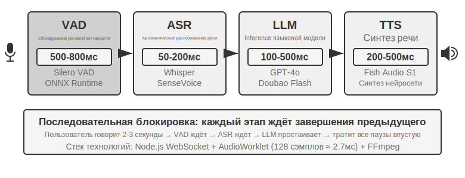


Ранние голосовые помощники использовали этот четырёхэтапный последовательный конвейер по простой причине: не существовало единой модели, способной одновременно решать четыре задачи — распознавание речи, понимание языка, мышление и синтез речи. Модульная архитектура позволяла разрабатывать и оптимизировать каждый компонент независимо. Но за модульность приходится платить накоплением задержки — каждый этап должен дождаться завершения предыдущего, прежде чем начать.

**VAD** — начальная точка конвейера, он непрерывно отслеживает аудиопоток. Ключевой элемент дизайна — определение конца речи (End-of-Speech Detection): обычно устанавливается порог непрерывной тишины в 500–800 мс — если пользователь молчит дольше полусекунды, VAD решает, что он закончил говорить. Это вносит первый слой задержки, и здесь трудно совместить обе крайности: если порог слишком короткий, пауза пользователя во время обдумывания ошибочно принимается за конец фразы, и предложение обрезается; если слишком длинный — после того как пользователь закончил, приходится ждать почти секунду, прежде чем получить реакцию.

**ASR** превращает звуковую волну в текст. Такие модели, как Whisper, SenseVoice, при развёртывании моделей малого и среднего размера на GPU обычно транскрибируют 5-секундный фрагмент аудио за 50–200 мс; более крупные модели или ограниченные по ресурсам среды развёртывания дают 200–500 мс (именно к последнему случаю относится контрольная группа в эксперименте 9-3). Более важная проблема в другом: пока идёт ожидание VAD и транскрипция ASR, LLM ниже по конвейеру полностью простаивает — она не получает никакой информации и не может начать думать заранее.

На этапе inference **LLM**, даже при хорошей оптимизации, время до первого токена (TTFT, то есть время ожидания, пока модель выдаст первый символ) в зависимости от длины контекста обычно составляет 100–500 мс, а на выдачу первого полного предложения нужно ещё около 100 мс. Если включён reasoning (размышление), время может растянуться до 5–10 секунд. В традиционной архитектуре TTS обязан дождаться, пока LLM полностью выведет текст ответа, прежде чем начать работу.

**TTS** превращает текст ответа в речь, синтез обычно требует 200–500 мс. Сложив задержку каждого звена (Рис. 9-2): VAD (500–800 мс) + ASR (50–200 мс) + LLM (100–500 мс) + TTS (200–500 мс), в сумме получается примерно 0,9–2 секунды — и это ещё в идеальном случае, когда все сервисы простаивают и никто не стоит в очереди.


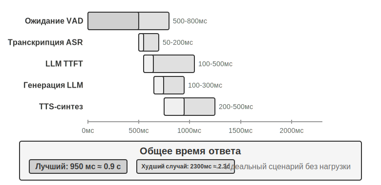


Как только система переходит в промышленную эксплуатацию, задержка из-за очередей только усугубляет ситуацию. Это похоже на очередь в ресторане: чем занятее кухня, тем дольше ждать заказ, причём рост не линейный, а резкий (Рис. 9-3). Когда у сервера вообще нет очереди ожидания (то есть он «простаивает»), время обработки одного запроса называется задержкой при простое. Но когда несколько запросов приходят одновременно, более поздние вынуждены вставать в очередь.

Интуитивно: чем выше загрузка, тем нелинейнее взлетает время ожидания. Конкретное математическое соотношение даёт теория массового обслуживания (здесь приводится только для интуитивного понимания, строгий вывод не требуется): общая задержка ≈ задержка при простое × 1/(1-загрузка). Загрузка — это доля времени, когда сервер занят обработкой запросов; например, загрузка 50% означает, что сервер половину времени обрабатывает запросы, а половину простаивает. При загрузке 50% задержка становится в 2 раза больше, чем при простое, а при загрузке 80% — в 5 раз больше — вот почему сервер не может долго работать под высокой нагрузкой.


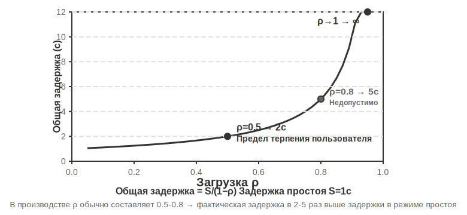


> **Эксперимент 9-1 ★: Построение традиционного голосового агента**
>
> В этом эксперименте строится полноценная система голосового диалога в реальном времени, поддерживающая взаимодействие пользователя с ИИ через микрофон. Система использует архитектуру с разделением фронтенда и бэкенда, реальное время обеспечивается через WebSocket.
>
> Основной поток строго следует последовательной модели: фронтенд захватывает ввод с микрофона и в реальном времени отправляет его по WebSocket на бэкенд. Бэкенд запускает модель Silero VAD для детектирования голосовой активности — по сравнению с традиционными методами детекции по громкости она точнее и устойчивее к шуму; после обнаружения примерно 500 мс непрерывной тишины извлекается фрагмент аудио для дальнейшей обработки.
>
> На каждом из этапов ASR, LLM, TTS поддерживается гибкое переключение между несколькими провайдерами — разработчик может выбрать оптимальное сочетание в зависимости от задержки, точности и региональных сетевых условий.
>
> **Эксперимент 9-2 ★: Построение телефонного агента на PineClaw Voice API**
>
> В эксперименте 9-1 была построена система голосового диалога внутри браузера, но в реальном мире многим задачам агента нужны настоящие телефонные звонки — связаться со службой поддержки по поводу счёта, забронировать столик в ресторане, подтвердить заказ. В четвёртой главе на примере механизма Channel в PineClaw было показано, как событийно-ориентированная архитектура сокращает время отклика на телефонные уведомления с минут до секунд; этот эксперимент сосредоточен на построении самого голосового вызова. Возьмём в качестве примера [PineClaw Voice API](https://pineclaw.com/) (разработан командой авторов книги) — такие промышленные API для голосовых звонков обычно инкапсулируют весь процесс: набор номера, навигацию по IVR (то есть по телефонному меню вида «для запроса нажмите 1, для соединения с оператором нажмите 0»), диалог и транскрипцию. Агент указывает номер телефона, цель и контекстную информацию, а голосовой агент выполняет весь звонок целиком и возвращает структурированную запись разговора.
>
> **Цель эксперимента**: построить агента, способного выполнять задачи по настоящему телефону, интегрировав PineClaw Voice как инструмент в цикл ReAct.
>
> **Техническое решение**: используем Python SDK PineClaw Voice (`pine-voice`), снабжая агента инструментом `make_phone_call`. Агент получает описание задачи от пользователя (например, «запиши меня к стоматологу завтра на 15:00»), и через размышление в стиле ReAct определяет: (1) на какой номер телефона нужно позвонить; (2) какова цель звонка и ключевая информация; (3) как доложить пользователю о результате после завершения звонка.
>
> Процесс работы агента: пользователь говорит «позвони в клинику и запиши меня на завтра» → агент обдумывает, какая информация нужна (телефон клиники, время записи, имя пациента) → если информации недостаточно, уточняет у пользователя → вызывает инструмент `make_phone_call` → PineClaw звонит, ведёт разговор, завершает запись → агент получает краткое содержание и транскрипцию звонка → докладывает результат пользователю.
>
> **Критерии приёмки**: успешный тестовый звонок (можно сначала позвонить на собственный телефон, чтобы проверить связь). Агент самостоятельно определяет параметры звонка на основе описания задачи, после завершения звонка корректно извлекает ключевую информацию (время записи, номер подтверждения и т. д.) и докладывает результат пользователю. Сравните разницу между прямым вызовом API и вызовом через цикл ReAct агента — последний способен обрабатывать неполную информацию (например, искать номер телефона самостоятельно, если пользователь его не указал).
>
> Этот эксперимент демонстрирует важное направление применения голосовых агентов: **агент может не только вести голосовой диалог с пользователем, но и взаимодействовать по телефону с внешним миром вместо пользователя**. Голосовой агент PineClaw специально обучен справляться с часовым ожиданием, навигацией по телефонным меню и сложными переговорами — представьте, что ИИ звонит вместо вас в службу поддержки провайдера и ждёт соединения с оператором. Именно такие сценарии традиционному последовательному голосовому конвейеру даются с трудом.

### Потоковая обработка на всей цепочке каскадного конвейера

Стоит прояснить одно распространённое заблуждение: приведённая выше оценка задержки в 0,9–2 секунды рассчитана для **полностью последовательного** случая, когда «каждое звено полностью завершает работу, прежде чем передать эстафету». Но промышленные системы 2025 года так уже не работают. Основной подход — не отказ от модульности, а сохранение разделения VAD-ASR-LLM-TTS при том, что каждый уровень становится **потоковым**, а соседние звенья начинают перекрываться по времени:

- **ASR слушает и транскрибирует одновременно**: используется потоковое распознавание, текст непрерывно появляется, пока пользователь ещё говорит, не дожидаясь, пока VAD определит конец всей фразы, чтобы начать транскрипцию;
- **LLM выдаёт вывод по предложениям**: модель генерирует текст и одновременно разбивает ответ на короткие фразы по пунктуации или смыслу — как только готово первое предложение, оно сразу отправляется дальше по конвейеру, не дожидаясь завершения всего ответа;
- **TTS синтезирует потоково, по предложениям**: как только получено первое короткое предложение, начинается его синтез и воспроизведение, последующие предложения генерируются и добавляются на ходу — время, за которое пользователь слышит первый звук, значительно сокращается.

Таким образом, ASR, LLM и TTS больше не связаны эстафетным порядком «один за другим», а работают как три параллельно занятых поста на одной линии. Открытые фреймворки вроде LiveKit Agents, Pipecat, а также основные промышленные системы исходящих звонков идут именно по этому пути. После полной потоковости на всей цепочке сквозная задержка обычно снижается до 600–800 мс, что заметно лучше полностью последовательных 0,9–2 секунд.

Но потоковая обработка может сжать лишь ту часть — «транскрипция, размышление, синтез», — которая допускает перекрытие вычислений; есть одна задержка, которую она сжать не может: **само ожидание тишины и определение очереди в VAD**. Система по-прежнему полагается на порог тишины в 500–800 мс, чтобы угадать, «закончил ли пользователь говорить», и это ожидание — предпосылка для запуска всего конвейера, устранить его перекрытием невозможно. Чтобы сжать и эту задержку, нужно уже не работать над «перекрытием уровней», а обратиться к самому переднему этапу восприятия.

### Потоковое речевое восприятие: замена VAD + ASR

Этот воспринимающий фронтенд состоит из двух уровней — VAD определяет, закончил ли пользователь говорить, а ASR преобразует аудио в текст, — и вместе они решают, когда запускается весь конвейер и какой вход он получает. У традиционного каскада VAD + ASR есть три фундаментальные проблемы:

1. **Накопление задержки**: VAD вынужден ждать 500–800 мс тишины, чтобы подтвердить, что пользователь договорил, — ведь он не может предвидеть будущее и различает «действительно закончил» от «просто задумался» только через выжидание
2. **Потеря информации**: VAD выдаёт только бинарный сигнал «есть звук/нет звука», при этом полностью теряются такие акустические детали, как изменение эмоций, интонационные колебания, колебания-паузы, фоновая обстановка. Проблема ложных срабатываний особенно заметна в сложной среде — если пользователь чуть дольше обычного делает паузу, это ошибочно принимается за конец фразы, что обрывает предложение; фоновый шум ложно запускает обработку, когда никто ничего не говорит; а короткое «угу» пользователя вообще невозможно понять — то ли это попытка перебить, то ли знак согласия
3. **Снижение точности**: VAD режет непрерывный аудиопоток на отдельные независимые фрагменты, каждый из которых отдельно подаётся в ASR, что разрушает непрерывность контекста. Для контента, который требует контекста до и после для корректного распознавания (адреса электронной почты, названия брендов, имена людей, специальные термины), заметно растёт частота ошибок — например, если пользователь диктует email «john dot smith at gmail dot com» и «john» с «smith» попадают в разные фрагменты, «smith» из-за отсутствия контекста может быть ошибочно распознан как «miss»

**Модели потокового речевого восприятия** предлагают принципиальное решение. Сначала проясним техническое значение слова «потоковый»: способность речевой модели работать в потоковом режиме определяется тем, **является ли энкодер каузальным или блочным** (зависит только от уже поступившего аудио, а не требует всей записи целиком), и **инкрементально ли декодирование** (выдаёт часть результата по мере поступления каждого небольшого фрагмента аудио). Whisper не может работать в потоковом режиме не из-за способа декодирования — оно само по себе авторегрессивно, — а потому что её энкодеру требуется целый аудиосегмент (фиксированные 30 секунд, недостающее заполняется тишиной), прежде чем он сможет начать работу. Стоит также отметить, что потоковое распознавание само по себе не новая технология: традиционный потоковый ASR на базе RNN-T и потокового Conformer давно массово используется в индустрии — субтитры в реальном времени на телефонах, голосовой ввод в клавиатурах используют именно такие модели, — и они не имеют отношения к LLM.

В этом разделе речь пойдёт о новом направлении: **потоковое слуховое восприятие на основе LLM** — постобучение модели с открытым исходным кодом в качестве основы, чтобы модель напрямую выдавала семантические отклики из непрерывного аудиопотока, объединяя «распознавание» и «понимание» в одной модели. Это модернизация традиционного потокового ASR, а не изобретение потоковой технологии как таковой: задержка инкрементального распознавания сохраняется на уровне времени одного шага вывода (от десятков до одной-двух сотен миллисекунд), но модель видит не порезанные VAD изолированные фрагменты, а непрерывный аудиопоток от начала диалога до текущего момента и может опираться на полный контекст для обучения в контексте (In-Context Learning), значительно повышая точность распознавания персональной информации пользователя, специальных терминов и особенностей произношения.

Ещё одно ключевое преимущество этого направления — наследование от LLM мировых знаний и способности к здравому смысловому выводу, ведь базовая модель видела огромные объёмы текста. Например, модель понимает, что после «Apple» с большой вероятностью следует «презентация», а не «яблоко» в смысле фрукта, — такое усиление знаниями значительно повышает точность распознавания ценной информации вроде сумм, географических названий, названий брендов по сравнению с традиционным ASR. У этого направления уже есть готовые к внедрению модели, например Ultravox от Fixie — аудио подаётся напрямую в базовую LLM, на выходе получаются текст и семантические токены; используемые в экспериментах этого раздела Qwen2-Audio и Qwen2.5-Omni от Alibaba также относятся к этому классу нативных для аудио моделей.

Однако для замены VAD не обязательно задействовать полноценную большую аудиомодель. Если хочется решить только первую проблему — **определить, действительно ли пользователь закончил говорить**, — есть более лёгкий путь: встроить это «определение хода» прямо в сам распознаватель[^ch9-11]. Способ таков: добавить LoRA поверх небольшой открытой потоковой модели распознавания, чтобы она одновременно транскрибировала и **на основе совокупности семантики и тишины** определяла, «выражена ли уже законченная мысль» — ведь паузы внутри хода (например, при диктовке номера телефона) часто оказываются длиннее, чем интервал между ходами, и одного порога тишины неизбежно недостаточно ни для одного, ни для другого случая. Ещё более интересный вывод: если модель постоянно колеблется в вопросе «принимать реплику или нет», причина часто кроется не в архитектуре модели, а в том, что **обучающие метки размечены с «божественной точки зрения»** — при разметке использовалось аудио, появившееся уже после точки принятия решения, тогда как онлайн-модель попросту не может видеть будущее; если каждую метку переразметить так, чтобы использовать «только информацию, доступную в момент принятия решения», это ложное колебание исчезает. Это перекликается с выводом из главы 7 о постобучении: часто данные важнее архитектуры. Этот более лёгкий путь уже имеет промышленные реализации: Flux от Deepgram, Universal-Streaming от AssemblyAI встраивают определение конечной точки и хода прямо в потоковую модель распознавания, специально спроектированную для речевых агентов; со стороны открытого кода есть модели семантического определения хода от LiveKit и Pipecat.

[^ch9-11]: Про встраивание определения хода в распознаватель, а также про диагноз «божественной точки зрения» меток см. Li, Bojie and Noah Shi. *The Trade-off Was in the Labels: Causal Supervision for Turn-Aware Streaming ASR.* 2026 (готовится к публикации).

Модель выдаёт на выходе не только текст, но и ряд **специальных меток акустических событий** — это специальные токены, введённые при обучении модели, которые она научилась автоматически выдавать при обнаружении соответствующего акустического события. Наиболее распространённые категории:

- `<speak_start/end>`: определение начала и конца речи на основе совокупности семантики и акустики, а не простого детектирования тишины
- `<interrupt>`: различение того, действительно ли пользователь хочет перебить, или просто поддакивает, или это влияние фонового шума
- `<emotion:happy/frustrated>`: маркер эмоции
- `<laugh>` / `<sigh>`: паралингвистические сигналы вроде смеха, вздоха
- `<music>` / `<noise>`: звуки окружения

Эти метки и текстовые токены образуют единый поток событий, который подаётся на слой рассуждения.

```
Входное аудио: "Хм, вообще-то я думаю... нет, подождите, дайте пересмотреть."
Поток вывода модели:
  <speak_start> Хм, <emotion:hesitant> вообще-то я думаю...
  <silence:500ms> нет, подождите, <emotion:confident> дайте пересмотреть <speak_end>
```

Обратите внимание, что модель выдаёт не только текстовую транскрипцию, но и метки речевых событий (начало/конец речи, изменение эмоции, интервалы тишины). Фреймворк агента может использовать эти метки для более естественного взаимодействия — например, предлагать варианты, обнаружив колебание пользователя.

> **Эксперимент 9-3 ★: моделирование потокового речевого восприятия с помощью Qwen2-Audio**
>
> Сначала нужно пояснить дизайн эксперимента: сама Qwen2-Audio — это непотоковая модель, обрабатывающая аудио целиком. В этом эксперименте используется **симуляция потоковой обработки через подачу блоками** — непрерывный аудиопоток режется на небольшие фрагменты фиксированной длины, каждый фрагмент вместе с ранее накопленным аудиоконтекстом подаётся в модель, которая пошагово генерирует текст и токены акустических событий (таких как смех, паузы и другие невербальные сигналы), при этом измеряется задержка от подачи каждого фрагмента до выдачи текста. Здесь есть важный компромисс: энкодер Qwen2-Audio не инкрементальный, поэтому при обработке каждого нового фрагмента весь ранее накопленный аудиопоток заново кодируется с нуля, из-за чего чем длиннее диалог и чем больше накопленного аудио, тем выше задержка кодирования одного блока — именно в этом состоит принципиальное различие между «симулированным потоковым режимом» и «настоящим потоковым режимом» (с применением инкрементального или каузального энкодера, который инкрементально кодирует только вновь поступивший небольшой фрагмент аудио). Этот дизайн позволяет продемонстрировать выигрыш в точности от «непрерывного восприятия с сохранением полного контекста», но цифры задержки отражают только гранулярность блока и скорость вывода и не эквивалентны задержке первого пакета у по-настоящему потоково спроектированной модели (например, Qwen3-Omni с блочным кодированием); заинтересованный читатель может повторить эксперимент с последней. В качестве сравнения используется традиционный конвейер VAD + ASR на Whisper. Тестируются три типа сценариев: обычный диалог, длинные предложения с паузами, диалог с фоновым шумом.
>
> Результат: задержка инкрементального распознавания в схеме с симуляцией блоками может удерживаться на уровне одной-двух сотен миллисекунд (конкретное значение зависит от длины блока и аппаратуры), тогда как традиционная схема требует ожидания подтверждения VAD об окончании речи (600 мс) плюс вывод Whisper (около 200–500 мс в конфигурации этого эксперимента), что в сумме даёт 800–1100 мс. В сценарии с паузами VAD ошибочно принял первую же длинную паузу за конец фразы и разбил предложение на две части для отдельного распознавания — фраза «примерно в два часа» из-за отсутствия контекста была ошибочно распознана как «примерно в ноль часов»; тогда как схема с блоками сохранила полный контекст и корректно распознала всю фразу целиком. В сценарии с фоновым шумом Qwen2-Audio выдала токен `<|noise|>`, отметив присутствие шума, но не прерывая распознавание, тогда как традиционный VAD был ложно активирован шумом, что привело к преждевременному запуску процесса распознавания.

## Парадигма 2 · Полностью сквозные полимодальные модели (Omni)

Вернёмся ко всему каскадному конвейеру: даже когда воспринимающий фронтенд заменён на потоковое речевое восприятие, он в конечном счёте всё равно распределяет «слушать, думать, говорить» между тремя отдельными моделями, соединёнными между собой дискретным интерфейсом. Каким бы широким ни был этот интерфейс, он остаётся лишь набором семантических токенов и разрозненных акустических меток — текущие эмоции говорящего, интонация, тон, а также фоновые звуки окружения и музыка почти полностью теряются при передаче; к тому же все три звена обучаются и оптимизируются отдельно, и им трудно согласованно работать друг с другом. Полностью сквозные полимодальные модели (Omni) идут другим путём — единая модель напрямую «слушает» аудио, «думает» над ответом и «произносит» его, объединяя три звена в одно (Рис. 9-4). При достаточном объёме обучающих данных внутреннее латентное пространство (Latent Space) модели способно передавать эту паралингвистическую информацию напрямую на генерирующий конец, помимо текста: задержка ниже, а просодия и эмоции сохраняются. Компромисс таков: **каскадный конвейер** — модули понятны, каждое звено можно настраивать независимо, интерпретируемость хорошая; **сквозная модель** — задержка ниже, невербальная информация сохраняется, но за это приходится платить бóльшей потребностью в обучающих данных и худшей интерпретируемостью.

Стоит добавить ещё одно измерение, которое часто упускают из виду: преимущество сквозного подхода проявляется в основном в **задержке**, но не обязательно в **точности**. Одна из достойных сравнения схем — **самокаскад** (self-cascade): та же самая модель сначала транскрибирует аудио в структурированный текст, а затем рассуждает на основе этого текста; по сравнению со сквозным ответом за один проход, какой из подходов даёт более высокую точность, зависит от конкретной задачи. Общую закономерность можно сформулировать так: когда ответ определяется в основном семантическим содержанием (то есть тем, «что было сказано»), и промежуточный текст достаточен для полной передачи релевантной для задачи информации, точность самокаскада сопоставима со сквозным подходом или даже превосходит его, причём это преимущество особенно заметно у моделей со слабыми способностями восприятия; и наоборот, когда ответ сильно зависит от невербальных сигналов, которые трудно выразить текстом (интонация, эмоция, звуки окружения), сквозной подход демонстрирует явное преимущество. Более того, преимущество той или иной схемы **можно заранее предсказать исходя из природы задачи**, а не просто списывать на то, что «сквозной подход более продвинут». Отсюда вытекает и принцип проектирования: то, что определяет производительность, чаще всего заключается не в самом наличии промежуточного представления как **узкого места (bottleneck)**, а в том, какую информацию несёт это узкое место — если промежуточный текст из простой транскрипции превратить в структурированное представление с паралингвистическими метками (эмоция, темп речи, звуки окружения), исходное преимущество сквозного подхода в точности зачастую сужается, что созвучно тезису из раздела «Потоковое речевое восприятие» выше о том, что «слой восприятия не должен выдавать только чистый текст»[^ch9-13].

Однако насколько бы ни была сильна Omni-модель, по сути она лишь объединила три модели в одну, **не отменив предпосылку «говорить по очереди»**: она по-прежнему полагается на VAD для распределения права говорить — как только обнаруживается звук от пользователя, модель останавливается, а как только пользователь замолкает, она тут же начинает говорить. И тут снова всплывает знакомая проблема: пользователь диктует последовательность цифр, делает небольшую паузу посередине — и Omni решает, что собеседник закончил, и насильно вклинивается. Описанное выше потоковое речевое восприятие способно поднять определение хода с уровня продолжительности тишины на семантический уровень, что значительно смягчает подобные ошибочные суждения, но в конечном счёте это лишь локальная заплатка внутри самой парадигмы «ходов», не отменяющая саму очерёдность как таковую. Чтобы **принципиально** вырваться из этого затруднения, нужно перестать латать дыры внутри парадигмы «ходов» и позволить модели слушать и говорить одновременно, самостоятельно решая, когда начать говорить, так чтобы вообще не существовало жёсткого переключения «чья теперь очередь говорить».

[^ch9-13]: О том, когда меняется местами преимущество каскадного и сквозного подходов по точности, и как предсказать его направление исходя из природы задачи (способно ли промежуточное представление полностью передать релевантную для задачи информацию), полное кроссмодальное измерение см. Li, Bojie and Noah Shi. *The Cascade Gap: When and Why Self-Cascades Help Multimodal Agents.* 2026 (готовится к публикации).

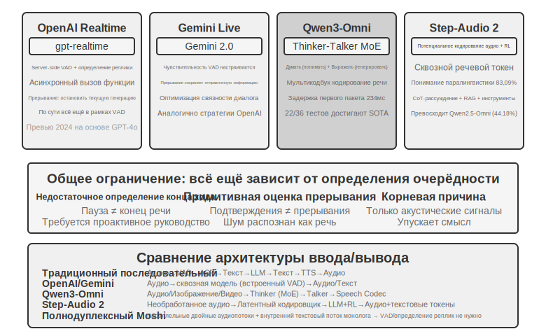

**OpenAI Realtime API** на уровне модели близок к сквозному подходу (модель нативно обрабатывает аудио), но на уровне управления взаимодействием всё ещё полагается на традиционный VAD, представляя собой промежуточное решение на пути к полностью сквозному подходу. Изначально (превью 2024 года) он работал на базе GPT-4o, а после официального релиза (GA) в 2025 году перешёл на отдельную специализированную для речи модель **gpt-realtime** (это уже не режим GPT-4o, а модель, отдельно оптимизированная для голосового общения в реальном времени). API по умолчанию включает серверный VAD, автоматически определяющий, когда пользователь начинает и заканчивает говорить. Поддерживается прерывание в диалоге — при обнаружении, что пользователь заговорил, текущая генерация речи немедленно останавливается, точно так же, как при разговоре лицом к лицу один собеседник вклинивается, а другой естественным образом замолкает. В gpt-realtime также добавлены асинхронные вызовы функций: модель может продолжать разговаривать с пользователем, одновременно ожидая результата от инструмента, скрывая задержку инструмента внутри диалога. Всё это улучшает пользовательский опыт, но по сути остаётся оптимизацией в рамках парадигмы VAD. **Gemini Live API** придерживается похожего подхода: поддерживает настройку чувствительности VAD, а при прерывании сохраняет уже отправленную информацию для обеспечения связности диалога.

**Qwen3-Omni** использует архитектуру Thinker-Talker: разделяет мышление (понимание и рассуждение) и выражение (генерация речи) на два специализированных модуля, объединяя восприятие и генерацию текста, изображений, аудио и видео. Низкая задержка первого пакета у Qwen3-Omni проистекает из архитектуры генерирующего конца (Talker): он генерирует аудиотокены пошагово авторегрессивным способом с несколькими кодовыми книгами, а в паре с этим каузальный (causal) кодек инкрементально декодирует эти токены в форму волны, поэтому как только модуль мышления выдаёт текст, Talker может сразу же продолжить потоковый синтез речи, не дожидаясь завершения генерации всего ответа. Согласно официальному отчёту, теоретическая задержка первого пакета при холодном старте достигает всего около 234 мс, поддерживается понимание на 19 языках и генерация на 10 языках, а в 22 из 36 аудиовизуальных benchmark-ов модель лидирует.

**Step-Audio 2** пошла другим путём: обрабатывает исходное аудио напрямую, выдавая текст и аудио, реализуя настоящий сквозной речевой диалог. Она умеет понимать не только что было сказано (семантическая информация), но и воспринимать, как это было сказано, — паралингвистическую информацию (Paralinguistic Information), например, была ли эмоция говорящего радостной или гневной, был ли темп речи быстрым или медлительным, была ли интонация восходящей или нисходящей, а также звуки окружения и музыку на фоне. Модель генерирует выразительные ответы через размышление и обучение с подкреплением, а также интегрирует механизм RAG и внешние инструменты (веб-поиск, поиск по аудио). Согласно отчёту статьи о Step-Audio 2, на предложенном ею же benchmark-е паралингвистического понимания StepEval-Audio-Paralinguistic точность Step-Audio 2 достигает 83,09%, опережая современную ей открытую полимодальную модель Qwen2.5-Omni (44,18%), а также превосходя GPT-4o Audio (43,45%) и Kimi-Audio (49,64%).

Step-Audio R1 — это дальнейшее развитие серии Step-Audio, которое, опираясь на сквозную архитектуру речевого диалога Step-Audio 2, ещё сильнее интернализует способность к размышлению непосредственно в аудиомодель, — обе модели представляют собой поступательную эволюцию одного и того же технического направления.

## Парадигма третья · Полнодуплексная модель взаимодействия (Full-Duplex / Interactive)

Парадигма вторая объединила три модели в одну, но по-прежнему держится допущения «говорить по очереди» — либо говорит пользователь, либо говорит модель, а точку переключения приходится угадывать по VAD или по смыслу. Но некоторые сценарии — это вовсе не «ты сказал — я сказал» по очереди. Классический пример — **синхронный перевод**: переводчик не ждёт, пока говорящий закончит целую фразу, а слушает и одновременно выстраивает перевод в голове, и как только смысловая группа в общих чертах складывается, тут же её озвучивает — слушание и перевод всё время идут внахлёст. Ещё более крайний случай — **ритм-игра, где нужно бить по барабану в такт музыке**: слух должен непрерывно отслеживать не прекращающийся музыкальный поток, руки — попадать в такт мгновенным ударом, и при этом ещё нужно предугадывать следующую долю — здесь вообще нет понятия «раунд», вход — это непрерывный поток, который никогда не останавливается. Такие задачи бросают фундаментальный вызов модели turn-by-turn: они требуют, чтобы слушание, размышление и действие происходили одновременно, тогда как сама предпосылка режима раундов — разнести эти три процесса по разным, следующим друг за другом отрезкам времени. Полнодуплексная модель — это как раз доведение идеи «отказа от VAD» до логического предела: вместо того чтобы городить костыли, она попросту отменяет само допущение «по очереди», позволяя модели **одновременно и непрерывно слушать и говорить**.

Пионером здесь стала исследовательская работа Kyutai — **Moshi** (2024). Она параллельно моделирует два аудиопотока (голос пользователя и голос самой модели), дополняя их потоком текста — «внутренним монологом», который повышает языковое качество генерируемой речи. Поскольку модель слушает в любой момент времени, перекрывающаяся речь и произвольное прерывание становятся естественным поведением, не требующим никакой явной логики детекции прерываний; сквозная задержка составляет около 200 мс — это уже близко к естественному темпу человеческого диалога.

В 2026 году **Thinking Machines Lab**, основанная Мирой Мурати, представила в превью новую категорию, которую они назвали **моделью взаимодействия (Interaction Model)**[^ch9-14], и прямо сформулировала тезис, стоящий за полным дуплексом: интерактивность не должна оборачивать модель снаружи в виде навесного harness наподобие VAD — она должна быть встроена в саму модель. Как сказано в оригинале: «чтобы интерактивность масштабировалась вместе с интеллектом, она должна стать частью самой модели». В архитектурном плане это выражается в понятии **микрораунда (micro-turn)**: модель не ждёт, пока закончится целый раунд, а работает отрезками примерно по 200 мс, непрерывно «считывая 200 мс — генерируя 200 мс», так что аудио, видео и текстовые потоки продвигаются переплетаясь друг с другом. Эта зернистость выбрана намеренно как компромисс — она достаточно мелкая, чтобы тишина, наложение реплик и прерывания сохранялись в контексте модели как непрерывный поток, без искусственных границ раундов, под которые пришлось бы подстраиваться; и одновременно достаточно крупная, чтобы обрабатывать несколько модальностей блоками, параллельно, удерживая задержку в диапазоне, ощутимом как реальное время. Именно потому, что взаимодействие включено внутрь модели, поведение вроде «говорить, слушая одновременно» или «вклиниваться в разговор, глядя на происходящее» — которое раньше приходилось собирать вручную через специализированный harness, — теперь становится неотъемлемой способностью самой модели и растёт вместе с ней: первая модель, TML-Interaction-Small, с нуля обучалась на трёх потоках сразу, и способна сама заговорить, если замечает, что пользователь пишет код с ошибкой или что в кадр кто-то вошёл.

Показателен и её подход к «медленному мышлению». Сама модель взаимодействия отвечает только за то, чтобы диалог оставался «на связи»; как только возникает вопрос, требующий глубокого рассуждения или вызова инструмента, она делегирует его более мощной модели рассуждений в фоне — причём передаётся не изолированный запрос, а **весь контекст диалога целиком**. Фоновая модель рассуждает и потоково возвращает результат по мере готовности, а модель взаимодействия сама выбирает момент, не перебивающий пользователя, чтобы естественно вплести этот результат в разговор — всё это время она как ни в чём не бывало продолжает поддерживать беседу, отвечать на уточняющие вопросы, держать нить разговора. Так достигается сочетание «задержки нерассуждающей модели» с «планированием, инструментами и агентными возможностями рассуждающей модели». По официальным данным, у TML-Interaction-Small (276B параметров, MoE, активных 12B) задержка переключения хода составляет около 0,40 секунды (у GPT-realtime-2.0 — около 1,18 секунды), а на бенчмарке, оценивающем визуальную проактивность, она значительно опережает конкурентов, у которых результат практически нулевой; на момент написания книги модель всё ещё находится в статусе исследовательского превью.

[^ch9-14]: Thinking Machines Lab, «Interaction Models: A Scalable Approach to Human-AI Collaboration», 2026-05. https://thinkingmachines.ai/blog/interaction-models/

В том же году **GPT-Live** от OpenAI вывела полный дуплекс на промышленный масштаб, став новой моделью по умолчанию для голосового режима ChatGPT и развернувшись по всему миру. Она больше не рассматривает диалог как последовательность отдельных сообщений-раундов, а **непрерывно обрабатывает вход, одновременно непрерывно генерируя выход**, и потому способна принимать множество решений о взаимодействии каждую секунду: заговорить, продолжать слушать, сделать паузу, прервать собеседника или вызвать инструмент. На практике это выглядит так: пока пользователь думает, модель спокойно ждёт, а не перехватывает инициативу; она подаёт реплики вроде «угу», «да», показывая, что слушает; и она справляется с задачами вроде синхронного перевода, где нужно говорить, слушая одновременно.

GPT-Live пошла тем же путём разделения «быстрого» и «медленного» — **разъединив «взаимодействие в реальном времени» и «глубокое размышление»**: когда требуется поиск, рассуждение или более сложная агентная операция, отвечающая за взаимодействие GPT-Live делегирует задачу фоновой передовой модели (на момент выпуска это была GPT-5.5), а сама продолжает поддерживать поток диалога и, когда фон выдаёт результат, возвращает его обратно в разговор. GPT-Live-1 и mini-версия используют в фоне GPT-5.5 Instant, а режимы Medium и High задействуют GPT-5.5 с рассуждением, позволяя пользователю по своему усмотрению выбирать между «быстро» и «глубоко». Это разделение «быстрого» и «медленного» — как раз тема следующего раздела, «Выбор архитектуры мышления».

Вернёмся к сквозной линии главы — «замена VAD»: VAD угадывает переключение права голоса по порогу тишины, потоковое восприятие (см. предыдущий раздел «Потоковое восприятие речи» в первой парадигме) поднимает решение о переключении на уровень смысла, а полнодуплексная модель полностью снимает само понятие «переключения» — модель всё время слушает, и «прерывание» перестаёт быть событием, требующим отдельной обработки; поэтому цепочка обработки barge-in архитектурно избавляется от большей части своих звеньев. Это конечная точка линии повествования «замена VAD» на момент написания книги.

## Выбор архитектуры мышления: от разделения к единству

По-настоящему нужно решить **противоречие между откликом в реальном времени и глубоким размышлением**: пользователь ожидает отклика за миллисекунды, а сложные вопросы требуют секунд на обдумывание — как сохранить низкую задержку и при этом дать модели думать достаточно глубоко? Это противоречие не принадлежит исключительно сквозным архитектурам — каскадный конвейер точно так же от него не свободен.

Три варианта ниже — это не линейная технологическая эволюция, а компромиссы проектирования под разные ограничения; на практике они сосуществуют, и выбор зависит от требований конкретного сценария к задержке и глубине размышления. Сначала стоит обозначить границу между ними: варианты один и два по сути представляют собой разделение на «быстро» и «медленно» в виде двух независимых параллельных моделей, которое не зависит от сквозной архитектуры и может быть надстроено даже поверх каскадного конвейера; только вариант три по-настоящему встраивает размышление внутрь сквозной модели.

Примечательно, что к 2026 году путь «разделения быстрого и медленного» уже стал основным выбором для передовых голосовых продуктов и получил собственное название. Thinking Machines Lab называет это «моделями взаимодействия (Interaction Models)» — модель взаимодействия в реальном времени, сопряжённая с асинхронной фоновой моделью рассуждений; «Think Fast» от Grok Voice компании xAI, голосовой агент Pine AI, а также рассмотренное выше «делегирование» GPT-Live — все они идут по одному и тому же пути: «быстро на переднем плане поддерживать диалог, медленно в фоне глубоко рассуждать». За выбором разделения вместо «обучения одной всемогущей модели» стоит прагматичное соображение: передовые модели рассуждений обновляются каждые несколько месяцев, а способность к взаимодействию в реальном времени требует специализированных данных и целей обучения; если запихнуть и то, и другое в одну модель, она будет вынуждена гнаться за постоянно движущейся целью и рискует размыть свои самые ценные способности к рассуждению[^ch9-8]. И наоборот: если оставить сильнейшую модель рассуждений неизменной в фоне и обучать лишь лёгкую модель взаимодействия на переднем плане, можно всегда пользоваться самым мощным на данный момент «мозгом» — именно поэтому GPT-Live подчёркивает возможность «устойчиво переключаться на новейшую передовую модель». Рассмотрим три варианта в порядке усиления координационного механизма.

### Вариант первый: быстрое мышление отвечает вместо, медленное мышление отвечает по существу

Быстрое и медленное мышление работают параллельно (рис. 9-5): быстрое мышление за 500 мс выдаёт короткий «отговорочный» ответ (по аналогии с тем, как человек сначала говорит «дай подумаю»), а медленное мышление в фоне тратит 5–10 секунд на глубокое размышление и затем даёт полный ответ. Технология, которую использует медленное мышление, называется «масштабирование вычислений на этапе вывода» (test-time scaling) — говоря простыми словами, модели дают «подумать подольше» при ответе на вопрос: не выдавать ответ за один шаг, а, как человек, решающий математическую задачу, сначала выстроить ход рассуждения, шаг за шагом вывести решение, проверить результат — обменивая больше вычислительных шагов на более высокое качество ответа.


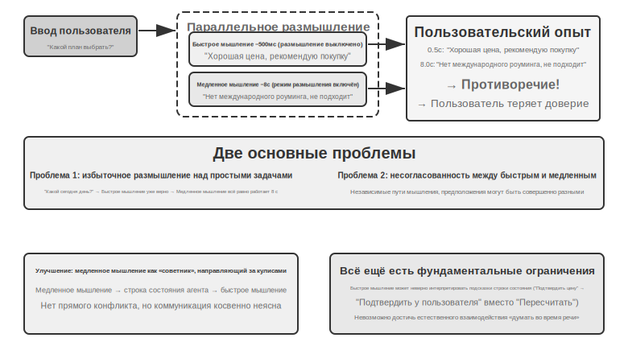


**Проблема первая: избыточное размышление над простыми вопросами**. Пользователь спрашивает «какой сегодня день недели», быстрое мышление уже за 500 мс правильно отвечает «среда», а медленное мышление всё равно доводит полные 10 секунд размышления до конца и повторяет «среда» ещё раз. Это не просто трата вычислительных ресурсов — что серьёзнее, это ломает ритм диалога: пользователь уже получил ответ и готов перейти к следующей теме, а его вдруг перебивают повторным ответом. **Проблема вторая: несогласованность быстрого и медленного**. Оба процесса работают независимо параллельно, и хотя видят один и тот же контекст, ход размышления у них может быть полностью разным — быстрое мышление даёт предварительный ответ, исходя из некоторого предположения, а медленное мышление обнаруживает, что это предположение неверно, и приходит к противоположному выводу. Пользователь за считанные секунды слышит два взаимоисключающих ответа подряд, и доверие мгновенно рушится. Коренная причина в том, что вариант первый разбивает диалог на два независимых процесса мышления, а не на единый связный когнитивный акт, и между быстрым и медленным нет механизма координации.

```
<user>Мне подходит этот тарифный план?</user>
<!-- быстрое мышление, через 0,5 секунды -->
<assistant (быстрое мышление)>Этот тарифный план очень выгодный по цене, рекомендую его приобрести.</assistant>
<user>Хорошо, тогда я...</user>
<!-- медленное мышление завершается через 8 секунд -->
<assistant (медленное мышление)>Подождите, я обнаружил, что в этом плане отсутствует нужный вам международный роуминг — возможно, он вам не подходит.</assistant>
<user>(в гневе) Так вы мне советуете покупать или не покупать?!</user>
```

### Вариант второй: быстрое мышление взаимодействует, медленное мышление подсказывает

Вариант второй позволяет медленному мышлению видеть вывод быстрого мышления и через строку состояния агента (динамический механизм внедрения метаинформации, представленный во второй главе) давать быстрому мышлению рекомендации, а не обращаться напрямую к пользователю. По сравнению с вариантом первым здесь есть два улучшения: медленное мышление работает асинхронно в фоне, продолжая размышлять, используя паузы в разговоре; а поскольку оно видит вывод быстрого мышления, прямого конфликта не возникает — оно отходит на второй план и выступает в роли «советника за кулисами». Упомянутое ранее делегирование GPT-Live и голосовой агент Pine AI — это примеры варианта второго в промышленной эксплуатации: фоновая модель рассуждений передаёт свой вывод по компактному текстовому каналу передней модели взаимодействия, а та уже решает, когда и в какой формулировке озвучить это пользователю.

Но у этого варианта всё же есть принципиальные ограничения. **Быстрое мышление может «не послушаться»** — общение между двумя независимыми экземплярами мышления косвенное и расплывчатое. Получив строку состояния агента, быстрое мышление может понять её неверно: например, истолковать «цену нужно перепроверить» как «спросить пользователя, устраивает ли его эта цена», а не как «цена рассчитана неверно, нужно пересчитать». **Невозможность получить доступ к промежуточным результатам размышления** — за 10 секунд размышления медленное мышление уже произвело массу ценных промежуточных выводов, но быстрое мышление их совершенно не видит и может лишь дожидаться финальной строки состояния агента. Если пользователь задаёт новый вопрос или прерывает разговор до того, как медленное мышление закончило, быстрому мышлению приходится отвечать, полагаясь только на своё ограниченное понимание. Это как если бы два человека решали задачу вместе, но общались только записками, не видя черновиков друг друга.

У варианта второго есть и более фундаментальная теоретическая проблема: **невозможность реализовать «думать и говорить одновременно»**. Человек, столкнувшись со сложным вопросом, не сначала обдумывает полный ответ в голове, а потом выдаёт его залпом — он думает порциями и говорит порциями: «Вопрос интересный... (пауза, размышление) прежде всего нужно учесть... (продолжает думать) во-вторых...». В варианте втором быстрое мышление способно лишь произносить слова-заполнители, дожидаясь результата от медленного мышления, и не может естественно вплетать процесс размышления прямо в разговор.

### Решение 3: Единство мышления и выражения от начала до конца (на примере Step-Audio R1)

Хотя решение 2 и снимает проблему ожидания в медленном мышлении, архитектурно оно остаётся схемой «сначала подумать, потом сказать» — мышление и выражение по-прежнему разделены на два процесса, и говорить одновременно с размышлением, как человек, здесь невозможно в принципе. Чтобы преодолеть это фундаментальное ограничение, способность мыслить нужно встроить прямо в модель.

Step-Audio R1 предлагает принципиально иное решение именно в этом направлении: способность мышления внедряется напрямую в сквозную аудио-языковую модель, а истинное «говорю, пока думаю» реализуется за счёт архитектуры «двух мозгов». По сути, это два взаимодополняющих механизма, каждый из которых решает свою задачу: **модально-заземлённая дистилляция рассуждений (MGRD)** сначала решает вопрос «правильно ли думает модель» — заставляя модель по-настоящему мыслить на основе акустических признаков, а не текстовой расшифровки; **двухмозговая архитектура MPS** затем решает вопрос «успевает ли она говорить вовремя» — позволяя мышлению и выражению идти параллельно, обеспечивая низкую задержку при «говорю, пока думаю». Первое — предпосылка для второго: только когда само мышление укоренено в звуке, параллельное «думаю-говорю» действительно имеет смысл. Разберём оба механизма по порядку.

**Проблема мышления через текстовый суррогат**. В идеале речевая модель должна напрямую анализировать акустические признаки (высоту тона, ритм, интонацию), чтобы понять эмоцию или намерение говорящего. Но на практике многие модели идут коротким путём: существующим аудио-языковым моделям присущ контринтуитивный феномен — чем длиннее цепочка рассуждений, тем хуже результат. Команда Step-Audio R1 обнаружила, что корень проблемы — «мышление через текстовый суррогат» (Textual Surrogate Reasoning, то есть текстовая информация «подменяет собой» акустическую при анализе): когда модель «думает», она на самом деле рассуждает на семантическом уровне, опираясь на текстовую расшифровку, а не анализирует по-настоящему акустические признаки. Пример: если попросить модель оценить эмоциональную окраску песни, она анализирует «в тексте упоминается грусть», а не «минорная мелодия в сочетании с нисходящим контуром высоты тона передаёт ощущение печали». Это смещение модальности берёт начало в обучающих данных: большинство данных CoT (Chain-of-Thought, цепочки рассуждений) для аудиомоделей сгенерированы текстовыми моделями и, естественно, наследуют чисто текстовый паттерн мышления.

**Модально-заземлённая дистилляция рассуждений** (MGRD, Modality-Grounded Reasoning Distillation) решает эту проблему за счёт итеративного самоулучшения (Рис. 9-6). Название звучит громоздко, но идея на самом деле проста и интуитивна: отбираются рассуждения, которые «действительно слушают звук», и именно на них обучается модель — так она учится анализировать «на слух», как учитель музыки, а не смотреть только на текст песни, как редактор. Конкретно это делается в три шага:

1. Текущая модель генерирует несколько разных цепочек рассуждений для одного и того же аудио, после чего отбираются те, что действительно опираются на акустические признаки. Как их отбирать? Смотрим, упоминаются ли в рассуждении конкретные звуковые параметры. Например, для гневного речевого фрагмента текстовое рассуждение звучит как «пользователь произнёс слово с негативной окраской „ужасно“, значит это гнев» — это лишь анализ текстового содержания; а рассуждение, основанное на акустических признаках, звучит как «темп речи на 40% быстрее нормы, громкость заметно повышена, тон стал резче» — вот это действительно «слушание» звука. MGRD отбирает второй тип
2. На этих качественных данных рассуждений модель переобучается заново, усиливая способность «думать ушами»
3. С помощью обучения с подкреплением проводится дальнейшая оптимизация, чтобы не дать модели схалтурить, пропустив рассуждение и угадав ответ напрямую

После нескольких итераций основа рассуждений постепенно смещается от текстовой абстракции к акустическому анализу — модель начинает обращать внимание на то, что «контур высоты тона резко падает на отметке 1,2 секунды», вместо расплывчатого «говорящий, похоже, недоволен».

**Двухмозговая архитектура MPS** (Mind-Paced Speaking, дословно «речь в темпе мышления») решает противоречие между задержкой мышления и речевым выводом (Рис. 9-6). Идея вдохновлена разделением функций в человеческом мозге: зона, отвечающая за мышление, и зона, отвечающая за организацию речи, работают раздельно и параллельно — вы обдумываете следующую фразу, пока рот ещё произносит предыдущую. MPS моделирует такое разделение двумя моделями: **мозг формулирования мысли** (Formulation Brain) непрерывно думает и выдаёт результаты мышления порциями; **мозг artikуляции речи** (Articulation Brain) при получении каждой новой порции результата мышления объединяет её с предыдущими размышлениями и уже сформированным ответом и превращает в речевой ответ.

Оба работают параллельно — мозгу формулирования мысли не нужно додумать всё содержание целиком, чтобы мозг артикуляции уже начал говорить. Например, в момент t=0 мс мозг формулирования начинает анализировать вопрос пользователя, в момент t=200 мс выдаёт первую порцию результата мышления (последовательность текстовых токенов); мозг артикуляции, получив этот результат в t=200 мс, объединяет его с уже сгенерированным контекстом ответа и в t=350 мс начинает выдавать соответствующие речевые токены — оба модуля работают параллельно по конвейерному принципу, и пользователь уже в t=350 мс слышит первый слог.


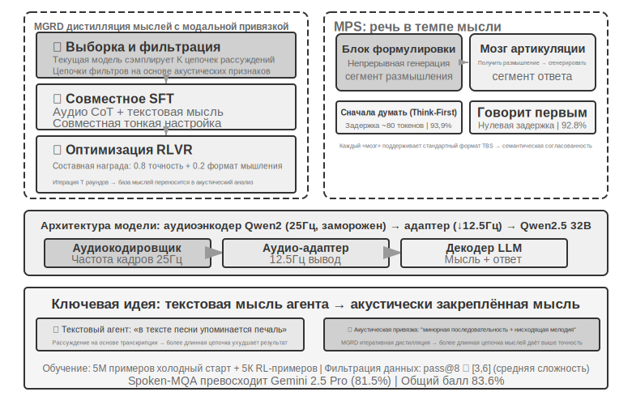


> **Эксперимент 9-4 ★★★: реализация сквозного речевого мышления на Step-Audio R1**
>
> В этом эксперименте с помощью модели Step-Audio R1 сравниваются различные конфигурации в задачах речевого мышления и диалога. Step-Audio R1 состоит из аудиокодировщика, аудиоадаптера и декодера Qwen2.5 32B, для развёртывания требуется несколько GPU.
>
> Оценка проводится на двух задачах: **Spoken-MQA** (устные математические задачи) проверяет, способна ли модель выполнять многошаговые математические рассуждения после прослушивания условия задачи; **URO-Bench** (бенчмарк устного диалога на китайском языке) проверяет качество открытого диалога.
>
> Тестовые конфигурации разбиты по двум измерениям. Первое — **момент мышления**: полная **TBS** (Think-Before-Speak, сначала полностью подумать, затем говорить, используется как контрольная база без ограничений по задержке) сначала генерирует всё рассуждение, а затем начинает говорить; чтобы снизить задержку, MPS предлагает два варианта «говорю, пока думаю» — **Speak-First** (также spkfirst, нулевая задержка, речь и мышление стартуют одновременно) и **Think-First** (также thkfirst, речь начинается только после того, как мозг мышления выдал первую порцию, задержка ~80 токенов). Второе — **архитектура**: параллельная работа двух мозгов MPS против традиционной односмодельной TBS.
>
> Результаты представлены в таблице 9-1: сравниваются точность на математических задачах и оценки диалога для разных конфигураций момента мышления и архитектуры.
>
> Таблица 9-1 Сравнение различных конфигураций речевого мышления Step-Audio R1
>
> | Конфигурация | Spoken-MQA | URO-Bench |
> |------|-----------|-----------|
> | Ответ без размышления (базовая линия) | 70,6% | 77,4 |
> | MPS Speak-First (нулевая задержка) | 92,8% | 82,5 |
> | MPS Think-First (задержка ~80 токенов) | 93,9% | 84,8 |
> | Полная TBS (без ограничений по задержке) | 93,0% | — |
>
> Интересное наблюдение: Speak-First практически не влияет на задачи, требующие рассуждения (92,8% почти совпадает с 93,0% у полной TBS). Причина в том, что начало **CoT** (Chain-of-Thought, цепочки рассуждений) обычно представляет собой лишь пересказ условия задачи, до настоящего рассуждения дело ещё не доходит, поэтому даже если модель начинает говорить одновременно с началом мышления, итоговая точность почти не страдает. Ещё одна заслуживающая внимания деталь: Think-First (93,9%) даже немного превосходит полную TBS без ограничений по задержке (93,0%) — одно из возможных объяснений в том, что порционная выдача мышления с последовательным преобразованием в речь оказывает эффект, схожий с пошаговым обучением с учителем; впрочем, разница укладывается в погрешность измерения, и не стоит придавать ей слишком большое значение.
>

Решение 3 «внедряет» мышление внутрь единой модели и наиболее изящно реализует «говорю, пока думаю», но платой служит та самая «движущаяся мишень», о которой говорилось в начале раздела: одна и та же модель должна быть одновременно и сильнейшим рассуждающим, и говорящим в реальном времени, а обе способности быстро развиваются — при едином подходе модель придётся постоянно переобучать заново, чтобы не отставать. Это объясняет и разделение отрасли на момент написания книги: передовые продукты, стремящиеся к возможности «в любой момент подключить самый свежий мозг» (GPT-Live, Grok Voice, Pine AI), в основном делают ставку на развязанный маршрут решения 2, тогда как решение 3 больше подходит для сценариев, где важна предельная естественность и есть готовность нести затраты на специализированное обучение. Ни один из подходов не вытесняет другой — это выбор между «сменным мозгом» и «более плотным сцеплением мышления и речи».

### Интерфейс между быстрым и медленным: что кроме текста можно передавать

(Примечание: это сквозное обсуждение интерфейса на разных сценариях, ненадолго отойдём от речевой линии.) Если вернуться к решению 2, обнаруживается упущенное измерение проекта: медленное мышление «передаёт слово» быстрому мышлению через **текстовый** канал (через строку состояния передаётся одна фраза-подсказка). Текст понятен и удобен для отладки, но это тонкая соломинка для того богатого содержимого, что происходит в «голове» медленного мышления — по-настоящему богатое промежуточное состояние сжимается до нескольких фраз. Так может ли этот интерфейс между быстрым и медленным обойтись без слов?

В сценариях реального времени, таких как игры, самых требовательных к темпу, этот путь вполне осуществим (его можно назвать латентным мостом, Latent Bridge)[^ch9-8]: небольшая модель быстрой реакции (выдающая по десятку с лишним действий в секунду) и медленная модель рассуждения (выдающая одну мысль в секунду) обе остаются **замороженными**, а обучается только небольшой «мост» между ними в несколько десятков миллионов параметров, который проецирует скрытые выводы медленной модели прямо в несколько «латентных токенов» — так же, как мультимодальные модели вставляют визуальные токены, — и вставляет их во вход быстрой модели. Это позволяет обойти путь «мысль → текст → повторное понимание». В результате на нескольких играх Atari этот латентный канал превзошёл традиционный текстовый канал ещё сильнее (в некоторых играх на +26–82%), при этом добавляя лишь около 5 миллисекунд на шаг — что по-прежнему укладывается в темп реального времени.

Это даёт и честную границу применимости: **есть ли толк от взаимодействия быстрого и медленного мышления, зависит от того, где находится узкое место задачи — в «додумываемости» или во «времени реакции»** — когда медленное мышление изначально сильнее быстрой реакции, этот мост действительно помогает (эта корреляция достигает r≈0,9 в разных играх); и наоборот, если задача целиком упирается в скорость реакции, никакой мост не поможет. Этот вывод верен не только для игр — он предвосхищает ту же самую проблему, с которой мы столкнёмся дальше в этой главе в разделе про Computer Use: когда стоит звать «медленного советника», а когда это лишь лишняя задержка.

[^ch9-8]: полный анализ обучения только латентного моста между двумя замороженными моделями, а также вопроса «когда стоит звать медленного советника» см. в Li, Bojie and Noah Shi. *The Latent Bridge: A Continuous Slow-Fast Channel for Real-Time Game Agents.* arXiv:2606.24470, 2026.

Независимо от того, сквозной подход или модульный, качество слоёв восприятия и исполнения по отдельности по-прежнему критически важно. Сквозная модель решает проблему задержки на архитектурном уровне, но два базовых навыка — «точно слышать» и «говорить как человек» — не решаются автоматически лишь за счёт смены архитектуры. «Точно слышать» соответствует потоковому речевому восприятию, уже разобранному в парадигме 1; здесь же рассмотрим слой исполнения, отвечающий за «звучать как человек», — синтез речи, более похожий на человеческий.

## Синтез речи, более похожий на человеческий

«Совершенство» традиционного TTS — как раз и есть проблема: слишком плавная, без единой паузы, без слов-заполнителей речь сразу выдаёт машину. «Несовершенства» человеческой речи не являются недостатком — паузы, слова-заполнители («м-м», «э-э», «ну»), случайные повторы — это естественное внешнее проявление процесса мышления, передающее слушателю важные сигналы вроде «я сейчас думаю» или «я не совсем уверен». Но ИИ думает намного быстрее, чем воспроизводится речь, поэтому его вывод изначально гладкий и завершённый, и синтезированный напрямую, он сразу выдаёт машинное происхождение.

**Решение**: передать право решать, где нужна пауза и какая нужна интонация, главной LLM. LLM выводит не только текст, но и управляющие метки: `[THINKING]` означает вставку паузы для размышления на 1–2 секунды со звуком-заполнителем («м-м-м…»); `[SEARCHING]` создаёт более короткую паузу и поисковый заполнитель («ну…», «как бы сказать»); `[EMO:happy]` и подобные регулируют интонацию и просодию; `[SPEED:0.8x]` управляет скоростью речи. Только LLM знает, идёт ли сейчас ответ на сложный вопрос, требующий паузы для обдумывания, или пользователь уже нетерпелив и стоит ускорить речь, или же это лёгкая беседа, где уместнее живая интонация.

TTS в этой схеме выступает как мультимодальный генератор: на входе текст и управляющие метки, на выходе аудио. При встрече обычного текста синтезируется обычная речь, а при встрече управляющей метки генерируется соответствующий неречевой аудиофрагмент: `[THINKING]` создаёт протяжное «м-м-м…», `[SIGH]` создаёт звук вздоха, `[LAUGH:small]` создаёт лёгкий смешок, `[BREATH]` создаёт звук вдоха.

Есть два пути реализации: первый — собственная разработка TTS с нативной поддержкой управляющих меток (максимальная гибкость, но требует специализированной команды); второй — использование voice cloning (клонирования голоса): для одного и того же виртуального персонажа готовятся несколько десятков эталонных записей с разными эмоциями, темпом и стилем, и в зависимости от управляющей метки выбирается наиболее подходящий эталонный образец для вызова TTS API (например, ElevenLabs, Fish Audio) — такое развёртывание можно завершить за несколько недель.

> **Эксперимент 9-5 ★★: TTS, управляемый метками, на основе Fish Audio**
>
> Используется возможность клонирования голоса Fish Audio S1 (достаточно 3–10 секунд эталонной записи, чтобы клонировать тот же тембр без дополнительного обучения — zero-shot). Строится библиотека из 24 эталонных записей, покрывающая эмоции (нейтральная/радостная/расстроенная/задумчивая) x скорость речи (нормальная/быстрая/медленная) x стиль (формальный/непринуждённый), каждая примерно по 5 секунд.
>
> Пример вывода LLM: `[EMO:happy][SPEED:fast]Отлично! Ваш заказ подтверждён.[THINKING]Хм, дайте-ка мне проверить сроки доставки...[EMO:neutral][SPEED:normal]Ожидаемая доставка — завтра во второй половине дня.`
>
> Слой исполнения разбирает метки и сопоставляет их с соответствующими эталонными записями: `[EMO:happy][SPEED:fast]` соответствует эталону «радостная + быстрая + непринуждённая», `[THINKING]` соответствует эталону «задумчивая + медленная + формальная» (с паузами и нотками сомнения в интонации), `[EMO:neutral][SPEED:normal]` соответствует эталону «нейтральная + нормальная + формальная». Fish Audio гарантирует единство тембра между разными эталонными записями, меняются лишь просодия и эмоциональная окраска.
>
> Сравниваются три конфигурации: без управляющих меток (плавно, но механически, сразу узнаётся ИИ), с одной эталонной записью (естественно, но эмоционально монотонно), с библиотекой из нескольких эталонных записей (при подтверждении информации — живо и быстро, перед объяснением — естественная пауза, в целом манера речи близка к живому оператору службы поддержки).

## Computer Use: агент автоматизации GUI

Читая до этого момента, вы, возможно, заметили, что в этой главе речи посвящено заметно больше места, чем двум оставшимся сценариям, — и это сделано намеренно. На этой линии эволюции реального времени в мультимодальности речь прошла путь наиболее полно и заслуживает того, чтобы служить системой отсчёта: отталкиваясь от проблемы «слишком высокой задержки последовательного конвейера», через сквозные модели, полный дуплекс, «говорю, пока думаю» и целый ряд других решений, речь дошла до относительно сформировавшегося сегодняшнего итога — весь путь от проблемы через решение к итогу здесь полностью пройден. Поэтому мы разобрали её подробно, а два следующих сценария — Computer Use и роботы — можно рассматривать, сверяясь с этой линией эволюции речи: на какой стадии этого пути находится каждый из них, и на чём он застрял.

Эти три сценария кажутся разными, но сталкиваются с одними и теми же базовыми вызовами: восприятие в реальном времени, принятие решений с низкой задержкой, непрерывное взаимодействие. Далее посмотрим, как эти технические темы воспроизводятся в визуальном взаимодействии (Computer Use) и физическом взаимодействии (роботы) — сначала расширим взгляд от слуховой модальности к визуальной: что если агент способен не только понимать речь, но и «видеть» экран и управлять графическим интерфейсом?

Computer Use (также называемый агентом автоматизации GUI) позволяет ИИ пользоваться программами так же, как человек, — наблюдая за экраном и управляя мышью и клавиатурой: например, открыть браузер и найти информацию, заполнить данные в таблице или изменить настройки в системных параметрах. В основе лежит цикл **восприятие — мышление — действие** (Рис. 9-7):

1. Агент делает скриншот текущего экрана
2. Мультимодальная модель получает скриншот и указание задачи, выводит рассуждение и конкретное действие
3. Слой исполнения выполняет это действие в реальной среде (двигает мышь, кликает, вводит текст и т. д.)
4. После ожидания реакции интерфейса снова делается скриншот, и цикл переходит к следующему шагу


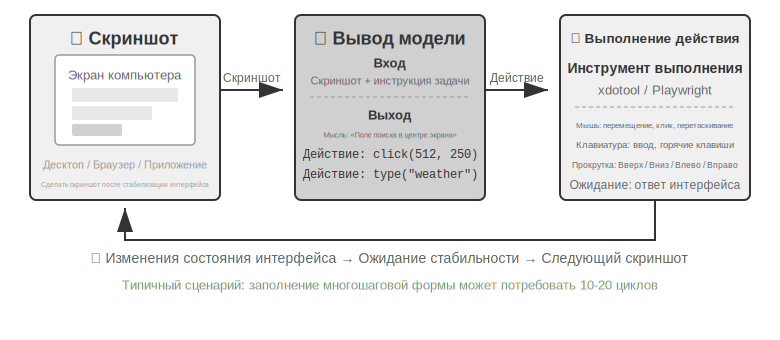


В этом цикле есть три ключевых измерения проектирования: **пространство действий** (какие операции доступны агенту), **визуальное позиционирование** (как найти целевой элемент на скриншоте) и **архитектура модели** (как сгенерировать правильное действие на основе скриншота).

### Проектирование пространства действий

Anthropic определяет три категории инструментов, составляющих полную способность к взаимодействию (Рис. 9-8):


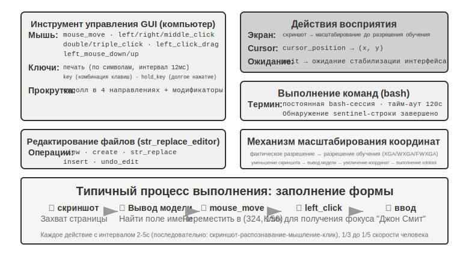


**Инструмент GUI-операций** (computer tool): операции мыши включают перемещение (mouse_move), клик левой/правой/средней кнопкой, двойной/тройной клик, перетаскивание (left_click_drag), а также более точные нажатие/отпускание (left_mouse_down/up). Прокрутка (scroll) поддерживает четыре направления и может комбинироваться с клавишами-модификаторами. Клавиатурные операции включают посимвольный ввод (type, интервал между символами 12 мс имитирует реальную печать), сочетания клавиш (key, например Ctrl+C), удержание клавиши (hold_key). Действия восприятия: скриншот (screenshot), получение позиции курсора (cursor_position), ожидание (wait).

**Инструмент выполнения команд** (bash tool): предоставляет постоянную сессию bash-терминала с тайм-аутом 120 секунд, определяет завершение выполнения команды по строке-«часовому», сохраняет состояние среды между несколькими вызовами (например, если перейти в директорию через cd, следующий вызов будет уже в ней).

**Инструмент редактирования файлов** (str_replace_editor): реализует безопасное редактирование через сопоставление строк, поддерживает просмотр, создание, замену, вставку и отмену операций — это точнее, чем прямая перезапись всего файла, и снижает риск случайного изменения остального содержимого.

> **Эксперимент 9-6 ★: запуск демонстрации Anthropic Computer Use**
>
> Контейнер упаковывает полноценную рабочую среду Ubuntu (с браузером, терминалом и другими стандартными инструментами). Фронтенд получает указание задачи, бэкенд отправляет указание вместе со скриншотом в Claude, модель возвращает команду операции (переместить мышь, кликнуть, ввести текст и т. д.), слой исполнения выполняет её в виртуальном рабочем столе.
>
> Ключевое наблюдение: интервал между действиями составляет 2–5 секунд (заметно медленнее человека), но для типичных задач модель демонстрирует хорошую способность к планированию, самостоятельно разбивая задачу на разумную последовательность операций.

### Визуальная локализация (Grounding)

В каждом раунде цикла модели нужно точно определить положение целевого элемента на скриншоте — «где находится строка поиска?», «каковы координаты кнопки отправки?». Это и есть задача визуальной локализации (Grounding). Сейчас существует **два основных подхода**: первый — превратить локализацию в **вопрос с вариантами ответа**: сначала все элементы интерфейса помечаются номерами, и модели остаётся лишь выбрать один из них; второй — **прямое предсказание координат**: модель, как человек, буквально «смотрит» на скриншот и называет координаты. Причём подход с вариантами ответа реализуется двумя способами: **чисто визуальная разметка** (исходный Set-of-Mark, где сегментационная модель нарезает кандидатные области по пикселям) и **структурированное индексирование элементов** (DOM/Accessibility Tree, когда структура считывается напрямую из самого интерфейса). Общее преимущество подходов с вариантами ответа в том, что открытая задача «найти на скриншоте кнопку и предсказать её координаты» превращается в закрытую задачу «выбрать один элемент из уже размеченных» — точно так же, как на экзамене вопрос с вариантами ответа проще, чем вопрос с открытым ответом: модели достаточно сказать «нажать [123]», а не «нажать на синюю кнопку примерно в 200 пикселях правее верхнего левого угла экрана».

**Set-of-Mark: метод визуальной разметки.**

Исходный Set-of-Mark (SoM) был предложен исследовательским подразделением Microsoft в 2023 году, изначально — чтобы раскрыть возможности визуальной локализации GPT-4V. Это **чисто визуальный** метод: сегментационная модель (SAM, SEEM и т. п.) автоматически нарезает на скриншоте кандидатные области, для каждой из них накладывается номерная метка, и модель видит изображение с номерами — ей достаточно назвать номер, а система пересчитает его в координаты центра соответствующей области. Весь процесс не требует DOM и вообще какой-либо внутренней структуры интерфейса, поэтому подход применим и к нативному настольному ПО, и к игровым интерфейсам — лишь бы сегментационная модель могла нарезать кандидатные области.

**Структурированное индексирование элементов: структурная реализация идеи SoM для веба.**

Когда сам интерфейс может предоставить структурированную информацию, разметку можно сделать точнее. Современные веб-страницы ещё до рендеринга уже определяют полную структуру элементов (дерево DOM) и семантические роли (что является кнопкой, что — полем ввода), а интерфейс специальных возможностей (Accessibility Tree) даёт аналогичную информацию для многих настольных приложений. Вместо того чтобы заставлять сегментационную модель угадывать по пикселям «какая область является кнопкой», логичнее прямо спросить сам интерфейс: «какие у тебя есть кликабельные элементы?». Именно так поступают веб-агенты на базе проекта browser-use: интерактивные элементы перечисляются из DOM и нумеруются — это можно рассматривать как структурную реализацию идеи SoM для веба (Рис. 9-9). Процесс состоит из четырёх шагов:

1. Через отладочный интерфейс браузера (CDP, Chrome DevTools Protocol) получить структурированное представление страницы (дерево DOM) и информацию о доступности
2. Автоматически определить, какие элементы интерактивны (кнопки, поля ввода, ссылки и т. д.)
3. Присвоить каждому интерактивному элементу уникальный ID и нарисовать вокруг него рамку на скриншоте
4. Одновременно сформировать текстовый список, описывающий, какой элемент соответствует каждому ID

```
Скриншот: [на изображении ключевые элементы помечены ID [1], [2], [3], [4] и т. д.]

Элементы:
[1] <input type="text" placeholder="Search" aria-label="Search" />
[2] <button id="submit-btn" aria-label="Submit form" />
[3] <input type="text" placeholder="Enter your name" value="" />
[4] <a href="/docs" aria-label="Documentation" />
```

Модели достаточно вывести только номер ID, а система автоматически выполнит клик по координатам центра этого элемента. Такой подход не экономит токены (потому что всю разметочную информацию нужно отправить модели), зато обеспечивает точную и стабильную локализацию и избавляет от пропусков и ложных срабатываний, которые может внести сегментационная модель.


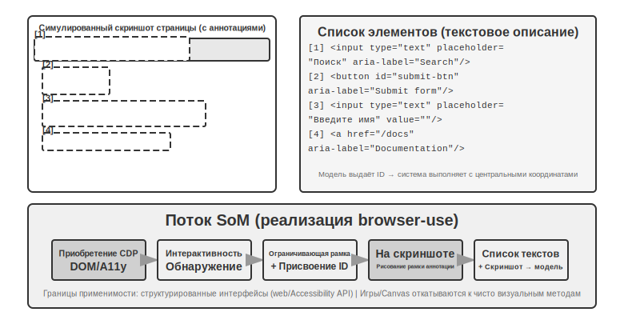

**Прямое предсказание координат.**

Третий путь не использует никакую разметку и заставляет модель напрямую выдавать координаты. Яркие примеры — **SeeClick** и Computer Use от Claude: на огромном массиве парных данных «скриншот GUI — положение элемента» обучается визуальная модель, которая учится напрямую отображать описание на естественном языке (например, «нажми кнопку отправки») в точные координаты на скриншоте — точно так же, как человек находит нужное место, полагаясь исключительно на зрение.

В схемах с предсказанием координат понимание моделью координат сильно зависит от разрешения, использованного при обучении (Рис. 9-10). Claude обучалась на XGA (1024×768), WXGA (1280×800), FWXGA (1366×768); если разрешение входного скриншота не совпадает с этими значениями, предсказанные моделью координаты систематически смещаются — как если бы вы измерили расстояние на карте меньшего масштаба и напрямую применили результат к карте большего масштаба. Поэтому на уровне инструментов нужно реализовать механизм двустороннего масштабирования координат, причём **целевое разрешение нужно выбирать по соотношению сторон**, чтобы неравномерное растяжение не деформировало изображение и не сбило вместе с ним оценку координат. Например, если реальное разрешение экрана — 2560×1440 (16:9), нужно среди трёх поддерживаемых Claude вариантов выбрать тот, чьё соотношение сторон тоже близко к 16:9, — лучше всего подходит FWXGA (1366×768). При съёмке скриншота экран пропорционально масштабируется до 1366×768 и подаётся в модель; модель выдаёт координаты клика (683, 384), которые затем обратно пересчитываются в реальные координаты (683×2560/1366, 384×1440/768) ≈ (1280, 720). И наоборот, если насильно растянуть 16:9 в 4:3 разрешение 1024×768, изображение будет сжато по горизонтали, и предсказанные моделью координаты систематически сместятся.


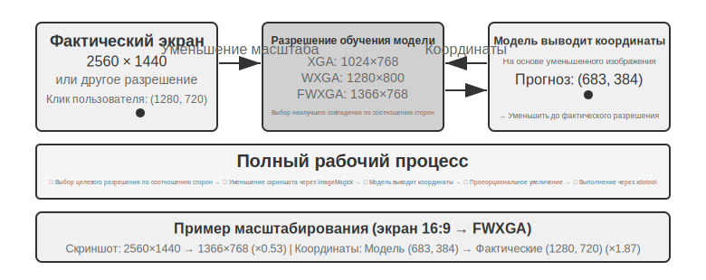


Логику выбора между тремя путями можно сформулировать так: **когда доступна структурированная информация, приоритет отдаётся индексированию через DOM/Accessibility Tree** — это даёт самую точную и стабильную локализацию; **когда она недоступна** (нативное настольное ПО вроде Photoshop, интерфейсы, отрисованные через Canvas/WebGL, игры), **можно использовать как визуальную разметку (исходный путь SoM), так и предсказание координат**. Визуальная разметка превращает локализацию в выбор варианта ответа и более дружелюбна к универсальным моделям без специального обучения; предсказание координат обходится без этапа разметки и более прямолинейно для моделей, прошедших обучение локализации в GUI. У обоих подходов на мелких элементах и плотных интерфейсах точность всё ещё оставляет желать лучшего.

> **Эксперимент 9-7 ★: реализация автоматического управления браузером с помощью browser-use**
>
> На основе фреймворка автоматизации браузера Playwright (библиотека инструментов для управления браузером через код), в сочетании с мультимодальной большой моделью, реализуется управление браузером на основе естественного языка. Включается визуализационный режим SoM: перед каждым решением сохраняется скриншот с размеченными рамками.
>
> Тестовая задача «открыть Google и узнать погоду в Сан-Франциско»: после запуска система делает скриншот, показывающий страницу поиска Google, все интерактивные элементы отмечены красными рамками и номерами ID (адресная строка `[1]`, поле поиска `[2]`, кнопка поиска `[3]`, кнопка «Мне повезёт» `[4]` и т. д.) → модель анализирует и нажимает `[2]` (поле поиска) → поле поиска получает фокус, вводится «San Francisco weather today» → нажимается `[3]` (кнопка поиска) → страница переходит к результатам поиска, на новом скриншоте размечены элементы карточки погоды, модель распознаёт и извлекает температуру, состояние погоды и другую информацию. Всего 5 шагов, выполнение занимает около 20 секунд.

### Computer Use Agent, способный видеть движение и слышать звук

До сих пор восприятие в Computer Use строилось на одном неявном допущении: **экран статичен** — сделали скриншот, подумали шаг, кликнули, снова сделали скриншот. Но в реальности на экране может проигрываться видео, может всплывать мимолётное уведомление, может звучать голос собеседника на конференц-звонке. Агент, который «открывает глаза» раз в 3–5 секунд и вообще не имеет «ушей», не может ни увидеть, ни услышать то, что происходит «между двумя кадрами». Просмотр записи экрана, участие в звонке, реагирование на голосовые подсказки, обработка мгновенно исчезающих диалоговых окон — вся эта категория повседневных операций с компьютером сегодня для Computer Use Agent практически недоступна.

По-настоящему заново нужно проектировать не «интерфейс действий», а «**интерфейс наблюдения**» [^ch9-9]. Ключевая идея — отделить **наблюдение** (непрерывное, адаптивное, мультимодальное) от **действия** (дискретного) и оформить его как слой перцептивного middleware, который встраивается между средой и любой уже готовой моделью Computer Use без её переобучения (можно назвать его интерфейсом наблюдения агент — компьютер, AOI). У него три компонента, каждый из которых «открывает шлюз» только по необходимости: во-первых, **захват ключевых кадров между тактами** — сначала крайне дешёвый пиксельный фильтр пропускает почти неизменные кадры, затем небольшая модель определяет, произошло ли значимое изменение изображения, и только при изменении делается снимок; при статичной картинке стоимость почти нулевая; во-вторых, **транскрипция речи, управляемая громкостью** — распознавание речи вызывается только при наличии звука, благодаря чему у агента впервые «отрастают уши»; в-третьих, что важнее всего, — **превращение кадра в устойчивый текст**: модель описывает захваченный кадр одной фразой («только что всплывшая подсказка сообщает, что дата релиза перенесена на 28 апреля»), и **даже после того, как исходное изображение будет вычищено из контекста, эта фраза остаётся в памяти**, унося динамическую информацию дальше в текстовом виде.

Один неочевидный вывод: по-настоящему важно не «какие именно кадры выбрать», а «**превратить кадр в текст, способный храниться долго**» — ведь текст — это модальность, с которой LLM-агент справляется лучше всего. На восьми моделях от 7B до передового масштаба этот слой middleware без какого-либо переобучения даёт прирост от +17 до +48 процентных пунктов, причём разрыв особенно велик в задачах, связанных с речью: добавив этот слой восприятия, агент способен выполнять голосовые задачи, которые раньше «слышал, но не мог выполнить». Но это не универсальная фиксированная конфигурация на все случаи жизни — на некоторых более новых моделях избыток токенов изображения, наоборот, вытесняет рассуждение и снижает качество работы, поэтому эти компоненты нужно **подбирать индивидуально под модель**, а не включать все разом. Это та же логика, что и в компромиссах Set-of-Mark и предсказания координат выше: у восприятия нет серебряной пули — конфигурацию нужно подстраивать под характер модели.

[^ch9-9]: Полное описание механизма трёх компонентов — шлюзование ключевых кадров, транскрипция по необходимости, превращение кадров в устойчивый текст — и абляции по каждой модели см. Li, Bojie and Noah Shi. *Agent-Computer Observation Interfaces Enable Dynamic Computer Use.* arXiv:2606.29472, 2026.

### Мобильные устройства: экосистемные барьеры сложнее технологий

Computer Use также расширяется на мобильные устройства. Технически мобильные и настольные платформы действительно различаются: пространство действий здесь обычно уже не «координаты мыши + клавиатура», а обращение к системному API служб специальных возможностей (например, AccessibilityService в Android) для считывания элементов интерфейса и отправки кликов и текстового ввода; способ взаимодействия тоже меняется — от указателя мыши к сенсорным жестам, а семантика координат вместе с этим меняется: одна и та же пара (x, y) может означать одиночное касание пальцем, долгое нажатие или начальную точку жеста смахивания — для их различения нужен дополнительный тип жеста. Именно на таком пространстве действий описанные в главе 6 мобильные бенчмарки вроде AndroidWorld оценивают способность агента выполнять реальные задачи в приложениях.

Но по-настоящему сдерживает мобильные устройства, как правило, не эта техническая разница, а экосистемные барьеры. Некоторые производители смартфонов уже пытались встроить в потребительские устройства ИИ-помощника, автоматически управляющего повседневными приложениями вроде WeChat, Taobao, Alipay, но быстро столкнулись с ограничениями со стороны платформ.

Это раскрывает уникальную проблему, с которой сталкивается Computer Use: **экосистемный барьер**. Коренная причина блокировок — конфликт бизнес-моделей. Основная логика монетизации традиционных интернет-приложений — это **трафик и внимание**: пользователь листает ленту и видит рекламу, ищет товар и следует рекомендательным алгоритмам, просматривает страницы и совершает импульсивные покупки. Когда же вместо пользователя действиями управляет агент, эта цепочка монетизации полностью обходится стороной: ИИ не обращает внимания на рекламу и не совершает импульсивных покупок, а идёт прямо к цели и заканчивает задачу. Для платформ, монетизирующихся за счёт рекламы и трафика, каждое действие агента подтачивает саму основу их бизнес-модели.

Это означает, что Computer Use сталкивается не только с техническим противодействием вроде CAPTCHA (проверочные коды), но и со **структурным конфликтом интересов**. Это противоречие сложно устранить в краткосрочной перспективе, что делает внедрение Computer Use в потребительских сценариях более трудной задачей, чем чисто техническая проблема.

### Оперативность: пока нерешённая ключевая проблема

**OSWorld** (методология его оценки подробно описана в главе 6) — широко используемый бенчмарк для оценки Computer Use, тестирующий способность агента выполнять межприложенческие задачи в реальных средах Ubuntu/Windows/macOS. Ранние универсальные модели на этом бенчмарке показывали успех лишь около двадцати процентов, но последующие специализированные модели и более мощные универсальные модели постоянно поднимали точность, и к моменту написания книги она уже приближается к человеческому уровню. Но точность далеко не конечная цель — истинное узкое место сместилось от «сможет ли сделать правильно» к «сможет ли сделать быстро».

Исследование эффективности **OSWorld-Human** раскрывает неприятный факт: даже если задача в итоге выполнена успешно, агенту требуется заметно больше шагов действий, чем человеку, а задержка рассуждения на каждом шаге продолжает расти по мере продвижения задачи — чем длиннее контекст, тем медленнее модель принимает решения, и время выполнения поздних шагов часто намного превышает время выполнения ранних. Правку формата документа, которую человек делает за несколько десятков секунд, агент может провозиться несколько минут. **Достижение точности человеческого уровня не равнозначно практической применимости — истинное узкое место именно в эффективности.**

Корень проблемы эффективности похож на голосовые сценарии: в последовательном цикле «скриншот — размышление — клик» даже при максимальной оптимизации каждого этапа накопленная задержка остаётся неприемлемой. Более глубокая проблема в том, что нынешний Computer Use совсем не умеет «думать заранее». Если бы агент мог одновременно с выполнением текущего действия предсказывать, что делать на следующем шаге — например, пока страница загружается, уже понять, куда кликать дальше, — время размышления и выполнения можно было бы перекрыть друг другом и значительно снизить общую задержку (это то же самое требование, что и «говорить, продолжая думать» в голосовых сценариях ранее в этой главе, и «непрерывное мышление» асинхронных агентов из главы 4, только здесь оно превращается в «действовать, продолжая думать»).

В отличие от голосовой сферы, у самой оперативности Computer Use — ускорения самого цикла «скриншот — размышление — клик» — пока нет системного решения, он по-прежнему остаётся в рамках дискретного цикла покадровых скриншотов. Но уже опробован один способ обойти эту проблему, использующий уже неоднократно упомянутое в этой главе разделение быстрого и медленного: раз ускорить медленного агента, управляющего компьютером, трудно, то **не заставляйте пользователя тупо ждать его**. «Разговор» и «управление компьютером» разделяются на два параллельно работающих набора моделей, быстрый и медленный [^ch9-10] — маленькая модель (быстрая) отвечает за диалог в реальном времени, а передовая VLM (медленная) шаг за шагом действует в браузере, и они общаются между собой только через предельно простой «чисто текстовый контракт»: медленный агент при каждом действии прикладывает скользяще обновляемое краткое резюме состояния («сейчас заполняю форму, ещё нужна ваша дата рождения»), быстрый агент на основе этого резюме отвечает пользователю в реальном времени и передаёт медленному агенту новую информацию, сказанную пользователем устно, причём **пока резюме состояния не подтвердит завершение, быстрому агенту категорически запрещено говорить «готово»**. Это в точности сценарий «разговаривать по телефону, пока компьютер сам всё делает». В экспериментах такое разделение ускорило голосовой отклик примерно в 15 раз по сравнению с «одной моделью, которая одновременно и действует, и говорит» (медианная задержка 0,58 секунды против 8,64 секунды), при этом успешность выполнения задач не снизилась; а стоит убрать текстовый канал между быстрой и медленной частями — успешность мгновенно падает до нуля, потому что ключевая информация, устно сказанная пользователем, больше не доходит до браузера. Это та же идея, что и Latent Bridge выше, и «говорить, продолжая думать» в голосовых сценариях: когда одно звено по природе своей медленное, пусть быстрое звено заполнит время ожидания пользователя — просто этот «чисто текстовый контракт» по сути и есть строка состояния агента, о которой эта книга говорит начиная со второй главы. Ускорение самого цикла Computer Use, возможно, всё ещё остаётся важным направлением будущих исследований, но «спрятать медленное с помощью разделения быстрого и медленного» — уже рабочий ответ.

[^ch9-10]: Полное описание разделения быстрого и медленного между голосом и действием и «чисто текстового контракта» см. Li, Bojie and Noah Shi. *Talking While Acting: Real-Time Voice for Slow Computer-Use Agents.* 2026 (готовится к публикации).

## Управление роботами: от управления в реальном времени к обучению и обобщению

> **Совет по чтению**: этот раздел посвящён управлению роботами. Эксперимент 9-10 демонстрирует метод переноса из симуляции в реальность — его **этапы симуляционного обучения (шаги 3-4) можно выполнить исключительно на GPU-сервере**, без оборудования; но для полного воспроизведения всего конвейера от начала до конца (включая шаги реального развёртывания) потребуется реальное оборудование, например манипулятор SO100. Если тема роботов вам пока не интересна, можете пропустить этот раздел — на чтение остальных глав это не повлияет.

Голосовой агент сталкивается с задержкой в модальности слуха, Computer Use — с задержкой в модальности зрения, а когда агенту нужно управлять роботом в физическом мире, вызовы задержки и мультимодальности усиливаются ещё сильнее — последствия действия необратимы, одно столкновение может повредить предмет или сам робот. В этом разделе сначала рассмотрим, как роботы с помощью двухуровневой архитектуры и разбиения действий на блоки решают проблему управления в реальном времени, а затем перейдём к более твёрдому орешку на сегодня — обучению и обобщению: откуда берутся данные и как модель переносится между задачами и платформами.

### Железо не узкое место — узкое место в алгоритмах

Роботы всё ещё не получили широкого распространения в открытых сценариях общего назначения — так узкое место в железе или в алгоритмах? Проект XLeRobot даёт убедительный контрдовод: двурукий колёсный робот стоимостью менее 1000 долларов, под удалённым управлением человека через VR-шлем (телеоперацией), уже способен плавно выполнять большой набор бытовых задач. Более сложные бытовые задачи, требующие ловких манипуляторов, робот Unitree под телеоперацией человека тоже выполняет плавно. Задержка телеоперации составляет около 100–200 мс, что уже близко к требованиям физического взаимодействия по времени отклика. Разрешение сенсоров, точность приводов, частота управления (количество обновлений управляющих команд робота в секунду — чем ниже частота, тем менее плавно движение и тем выше риск дрожания или отклонения от целевой траектории) на текущих недорогих платформах уже достаточны для практических задач.

Здесь нужно чётко очертить границы этого утверждения: телеоперационный контрдовод на самом деле показывает лишь то, что «существующего недорогого железа в сочетании с интеллектом человека достаточно для выполнения **этого класса бытовых манипуляционных задач, где преобладает визуальная обратная связь**». Это не означает, что железо в порядке по всем измерениям — отсутствие тактильного восприятия, надёжность и стоимость ловких манипуляторов остаются общепризнанными слабыми местами железа; если задача сильно зависит от тонкого силового управления и тактильной обратной связи, железо вполне может оказаться узким местом. Поэтому дальнейшее утверждение «железо не узкое место» ограничено рамками задач, обсуждаемых в этом разделе.

Применительно к этому классу задач настоящий разрыв лежит на уровне алгоритмов — ему посвящены два следующих подраздела.

> **Эксперимент 9-8 ★: опыт телеоперации XLeRobot**
>
> XLeRobot поддерживает несколько способов телеоперации: клавиатуру, геймпад Xbox, Switch Joycon и VR-шлем. Управляя роботом лично при выполнении задач по взятию предметов, их размещению, протиранию поверхностей, понаблюдайте за задержкой отклика, точностью движений и качеством выполнения задач — так формируется интуитивное понимание границ возможностей железа. После личного опыта становится очевидно: под управлением человека робот способен на всё, а значит, текущее узкое место — действительно алгоритмы, а не железо.[^ch9-1]
>
> [^ch9-1]: XLeRobot, «Документация по Teleop». https://xlerobot.readthedocs.io/en/latest/software/getting_started/XLeRobot_teleop.html

### Двухуровневая архитектура: разделение планирования и управления

Для выполнения сложных бытовых задач роботу нужно принимать решения на двух разных временных масштабах. Первый уровень — более медленное **долгосрочное планирование** (long-horizon planning): разбиение высокоуровневой инструкции вроде «убери кухню начисто» на последовательность подцелей (очистить столешницу, загрузить посудомоечную машину, протереть поверхности) — требует понимания семантики среды, рассуждения о зависимостях задач, планирования многошагового плана действий — примерно так же, как человек сначала обдумывает «что делать сначала, что потом», прежде чем взяться за дело. Второй уровень — более быстрое **VLA-управление** (Vision-Language-Action, модель «зрение-язык-действие»): выполнение каждой конкретной операции («подойти к раковине», «взять тряпку», «протереть столешницу») — на основе текущей видимой картинки и языковой инструкции непрерывно генерируются управляющие сигналы, обеспечивающие плавность и связность движений робота.

Такая двухуровневая архитектура эффективно разделяет сложность: долгосрочное планирование отвечает за «что делать», VLA-управление — за «как делать». Эта двухуровневая архитектура «медленное решение на высоком уровне + быстрое исполнение внизу» структурно очень похожа на «быстрое и медленное мышление» из раздела о речевых сценариях выше — в обоих случаях сложное мышление и реагирование в реальном времени разносятся по разным модулям. Стоит уточнить: здесь разделение «планирование / управление» соответствует измерению «медленное глубокое размышление / быстрый отклик в реальном времени» из «быстрого и медленного мышления», а не разделению «мышление / выражение», как в третьей схеме MPS («мозг замысла / мозг выражения»), — там разделяются «думать» и «говорить», а здесь — «планировать целиком» и «исполнять в реальном времени»; эти два вида «двух-X архитектур» режут по разным измерениям.

Впрочем, требование реального времени никуда не исчезает — оно просто переносится вниз, на уровень VLA-управления, и там сглаживается с помощью **разбиения действий на блоки** (Action Chunking, см. ниже раздел «VLA-управление»): модель за один проход генерирует небольшую последовательность будущих действий, поток управления воспроизводит её с высокой частотой, распределяя задержку одного вывода модели по всему времени выполнения блока действий. Но здесь есть неизбежный компромисс: разбиение на блоки — это обмен реактивности на плавность: чем длиннее блок, тем сильнее размазывается задержка одного вывода модели и тем плавнее движение, но тем дольше модель «не видит» новую картинку и тем медленнее реагирует на внезапные изменения (предмет убрали, кто-то подставил руку). Этот компромисс между реальным временем и плавностью — часть проблемы, которую двухуровневая архитектура не устраняет, а лишь переносит.

Здесь также нужно отметить один поворот основной линии главы: в сценарии робототехники противоречие реального времени уже частично снято двухуровневым разделением и разбиением действий на блоки, и основное текущее противоречие сместилось в область **обучения и обобщения** — как получить достаточно данных демонстраций, как заставить модель обобщаться между задачами и платформами. Следующие несколько подразделов как раз посвящены этому новому противоречию — это продолжение в физическом мире тем шестой главы о среде симуляции и седьмой главы об обучении с подкреплением.

При этом это новое противоречие в основном ложится на уровень VLA-управления. VLA можно рассматривать как «VLM + вывод действий»: **VLM** (Vision-Language Model, модель «зрение-язык» — большая модель, способная одновременно понимать изображения и текст) отвечает за «увидеть» и «продумать», а VLA сверх этого должна ещё «действовать руками» — и именно в этом «действии руками» заключён настоящий вызов. Сегодня уровень VLA-управления в основном обучается через имитационное обучение (клонирование поведения) — прямое обучение на большом объёме человеческих демонстраций по принципу «что видишь, то и делаешь» (к этому классу относятся OpenVLA, RT-2, π₀ и другие); обучение с подкреплением служит дополнительным методом поверх него, появившимся в последние годы. VLA, обученные с помощью обучения с подкреплением, хотя и показывают хорошие результаты на отдельной задаче, часто страдают недостаточным обобщением: даже когда, как отмечено в седьмой главе, SimpleVLA-RL показывает очень высокие результаты по отдельным задачам на LIBERO, обучение с подкреплением проводится отдельно для каждой задачи, а не в виде единой модели, способной к обобщению без примеров (zero-shot) на все задачи сразу. Такая модель «обучение под каждую задачу отдельно» означает, что при появлении новой задачи снова придётся собирать данные и заново обучать модель.

Следующие два раздела подробно рассматривают конкретные технические решения долгосрочного планирования и VLA-управления.

### Долгосрочное планирование: от VLM к специализированным моделям воплощённого мышления

Универсальные VLM уже обладают неплохими способностями воплощённого мышления. **Gemini Robotics-ER 1.5** от Google DeepMind специально оптимизирована для воплощённого рассуждения (Embodied Reasoning, то есть понимания положения, движения и причинно-следственных связей объектов в физическом мире) и в среднем показывает 62,8% на 15 академических бенчмарках (Point-Bench, RefSpatial, RoboSpatial, BLINK и др.), превосходя GPT-4o (60,6%) и Gemini 2.5 Pro (59,3%). Основные преимущества: продвинутое понимание пространства и локализация объектов, временное рассуждение (предсказание причинно-следственных связей действий вроде «что будет, если опрокинуть эту чашку»), оркестрация задач (разбиение высокоуровневой инструкции на маленькие шаги), а также нативная поддержка режима размышления (thinking) и вызова инструментов.[^ch9-2]

[^ch9-2]: Google DeepMind, «Gemini Robotics-ER 1.5». https://deepmind.google/models/gemini-robotics/gemini-robotics-er/

> **Эксперимент 9-9 ★★: автономная навигация XLeRobot под управлением Gemini Robotics-ER 1.5**
>
> С помощью библиотеки RoboCrew Gemini Robotics-ER 1.5 используется как модель долгосрочного планирования, при этом на изображение с камеры накладывается угловая разметка. Системе предоставлено всего три простых инструмента: движение вперёд, поворот налево, поворот направо. При задаче «найди кухню и дойди туда» модель принимает решения с частотой 0,5–1 Гц: распознаёт коридоры, двери, мебель и другие визуальные признаки, и если решает, что «кухня, возможно, слева», выполняет поворот налево, а увидев «впереди холодильник», продолжает движение вперёд. Возможно также расширение в режим голосового управления (с ключевым словом активации для запуска новой задачи). Этот эксперимент раскрывает границы возможностей VLM на уровне долгосрочного планирования: пространственное рассуждение и разбиение задач уже работают неплохо, но устойчивость в сложных средах и согласованность многошагового рассуждения ещё есть куда улучшать.[^ch9-3]
>
> [^ch9-3]: XLeRobot, «Управление агентом LLM». https://xlerobot.readthedocs.io/en/latest/software/getting_started/LLM_agent.html

### VLA-управление: от данных демонстраций к обобщению между воплощениями

На уровне исполнения двухуровневой архитектуры три представительные модели — RT-2, OpenVLA и π₀ — сосредоточены именно на VLA-управлении, то есть на выводе действий робота в реальном времени на основе изображения с камеры и языковой инструкции (Рис. 9-11). По способу представления действий они делятся на два направления: дискретные токены действий и генерация непрерывной траектории.


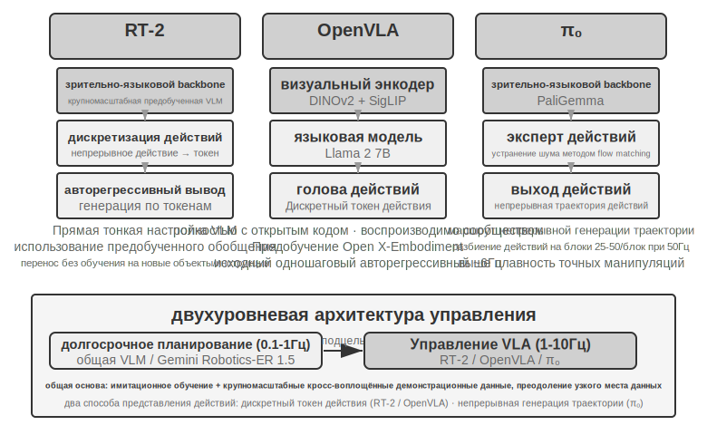


**RT-2 и OpenVLA: направление дискретных токенов действий.**

**RT-2** заложила это направление: прямая тонкая настройка на масштабной модели «зрение-язык», где непрерывные действия робота дискретизируются в токены и выводятся по одному авторегрессионно, как при генерации текста, — за счёт способности к обобщению предобученной модели улучшается перенос без примеров (zero-shot) на новые объекты и инструкции. **OpenVLA** унаследовала схему представления действий из RT-2, объединив языковую модель и визуальный энкодер в единой архитектуре: на вход подаются изображение и текстовая инструкция, на выходе — токены действий. Обучение проводится в два этапа: сначала предобучение на масштабном кросс-платформенном наборе данных Open X-Embodiment (охватывающем демонстрации реальных операций на более чем 20 платформах роботов), где усваиваются общие знания об операциях (паттерны действий вроде «взять», «положить» переносимы между разными роботами), затем тонкая настройка на небольшом объёме данных под конкретную платформу. Раз представление действий по сути одинаково, реальные различия между RT-2 и OpenVLA лежат в открытости и инженерных решениях: RT-2 и её обучающие данные принадлежат Google и закрыты, тогда как OpenVLA полностью открыта — открытая базовая модель (Llama 2 плюс визуальный энкодер) в сочетании с публичным набором данных впервые позволили всему сообществу воспроизводить и улучшать эту работу.

**Разбиение действий на блоки: универсальная техника компенсации частоты в области VLA.**

Из-за задержки вывода LLM частота управления VLA намного ниже требований традиционного управления роботами (традиционное управление роботом обычно требует частоты 50–1000 Гц, тогда как один вывод VLA даёт лишь около 1–10 Гц — разрыв достигает двух порядков). Оригинальная OpenVLA — типичный пример этой проблемы: за один вывод она выдаёт только одно действие (примерно 6 Гц одношагового авторегрессивного предсказания), и рывковость движения как раз и была её главным недостатком, за который её критиковали. **Разбиение действий на блоки** (Action Chunking) — универсальная техника, созданная именно для устранения этого разрыва: впервые предложена в ACT (Zhao et al., 2023), впоследствии широко принята в π₀, OpenVLA-OFT и других: за один вывод модель генерирует не одно действие, а сразу последовательность действий на небольшой промежуток будущего времени (для типичной конфигурации π₀ — блок действий длительностью примерно 0,5–1 секунда, то есть 25–50 действий при частоте управления 50 Гц), поток управления исполняет их последовательно с высокой частотой, пока модель в фоне асинхронно генерирует следующую порцию. Пока время вывода модели меньше времени исполнения этой порции действий, робот сохраняет непрерывное плавное движение — как с буферизацией видео: если следующий фрагмент заранее загружен, воспроизведение идёт без рывков.

**π₀: направление генерации непрерывной траектории.**

Настоящий водораздел в представлении действий проходит не между RT-2 и OpenVLA, а между **дискретными токенами и генерацией непрерывной траектории**. **π₀** представляет второе направление: вместо предсказания дискретных токенов действий по одному она использует flow matching (сопоставление потоков — метод непрерывной генерации, родственный диффузионным моделям), чтобы, начиная со случайного шума и проходя через многошаговое «удаление шума», напрямую сгенерировать плавную непрерывную траекторию действий. Такое представление естественно сочетается с разбиением действий на блоки и показывает лучшие результаты на задачах, требующих высокой точности и плавности движений, — например в ловких манипуляциях. Аналогия: путь дискретных токенов похож на постепенный выбор из меню «влево на 5 градусов», «вперёд на 3 сантиметра», а путь непрерывной траектории — на художника, который сначала набрасывает целую кривую, а затем шаг за шагом дорабатывает её штрихами.

### Sim2Real Transfer: разрыв между симуляцией и реальностью

Раздел о средах симуляции в шестой главе уже подробно раскрыл происхождение sim-to-real gap (разрыва между симуляцией и реальностью) и принцип работы domain randomization (рандомизации домена) для его преодоления — не будем повторяться, вкратце: симуляция не может полностью воспроизвести реальную физику, визуальные и аппаратные характеристики, поэтому при обучении эти параметры широко и случайно варьируются, вынуждая политику выучить универсальное представление, устойчивое к самым разным изменениям (Рис. 9-12). Ниже рассмотрим только то, как этот принцип реализуется на реальном манипуляторе.


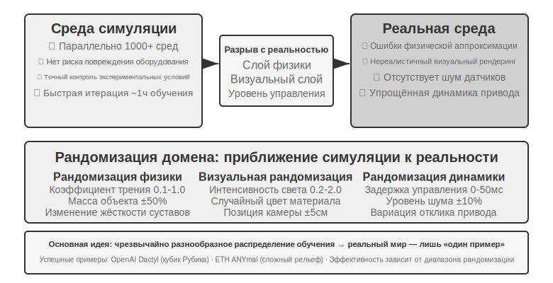


На этом пути уже есть немало успешных примеров: ловкая манипуляция роботизированной кистью OpenAI (проект Dactyl реализовал переориентацию кубика внутри руки, а его последующая работа с автоматической рандомизацией домена ADR реализовала сборку кубика Рубика одной рукой) и ANYmal от ETH Zurich (четвероногий робот, устойчиво передвигающийся по сложной пересечённой местности — снегу, гальке) — оба относятся к этому направлению.

Что действительно нужно добавить в этой главе — это два инженерных момента, без которых не обойтись при переносе рандомизации домена на реальную машину. Первый — **калибровка диапазона рандомизации**: диапазон нельзя задавать наугад — слишком узкий не покроет реальные вариации, слишком широкий увеличит сложность обучения и приведёт к субоптимальной политике, которая «справляется со всем, но ни в чём не сильна». На практике сначала обычно **эмпирически калибруют** распределения ключевых параметров по данным из реальной среды (например, реальное распределение коэффициента трения, задержки отклика мотора) и выбирают выборку в этом диапазоне; если политика, обученная в симуляции, заметно теряет качество на реальной машине, диапазон рандомизации постепенно расширяют, пока sim-to-real gap не сойдётся до приемлемого уровня. Второй — **визуальное выравнивание**: точная калибровка позы камеры в симуляции и в реальности (выравнивание среды), а также случайная замена реально снятого фона в рендеринг симуляции (замена фона greenscreen), чтобы картинка симуляции максимально приближалась к тому, что видит реальная машина — эти два шага будут конкретно показаны в эксперименте 9-10.

> **Эксперимент 9-10 ★★★: захват объекта манипулятором на основе RGB, Sim2Real без примеров (zero-shot)**
>
> Используя LeRobot + симулятор ManiSkill, обучение проводится только на изображениях RGB-камеры (без зависимости от датчика глубины или силового датчика), после чего модель без примеров (zero-shot, без каких-либо дополнительных настроек) напрямую разворачивается на реальном манипуляторе SO100. Пять шагов процесса:
>
> 1. **Выравнивание среды**: настройка положения камеры в симуляции и реальной среде, проверка совмещения изображений с обеих сторон путём наложения при визуализации
> 2. **Замена фона** (greenscreen): случайно обрезанные снимки реального фона накладываются на рендеринг симуляции, приближая фон симуляции к реальному
> 3. **Domain randomization**: рандомизация цвета робота, текстур объектов, условий освещения, угла обзора камеры и других параметров
> 4. **Обучение с подкреплением**: обучение алгоритмом PPO в масштабно-параллельной симулированной среде, пока успешность в симуляции не превысит 90%
> 5. **Реальное развёртывание**: успешное выполнение задачи захвата на реальном роботе без примеров (zero-shot)
>
> Ключевые факторы успеха: точное выравнивание среды + визуальная рандомизация домена + рандомизация физических параметров — необходимы все три. Ограничение: когда форма, размер или материал реального объекта выходят за пределы обучающего распределения, успешность заметно падает.[^ch9-6]
>
> [^ch9-6]: LeRobot, «Учебник по Sim2Real». https://github.com/StoneT2000/lerobot-sim2real/blob/main/docs/zero_shot_rgb_sim2real.md
>
>
> 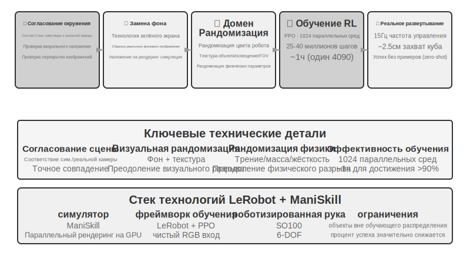
>

## Резюме главы

Три сценария внешне сильно различаются, но два барьера — задержка и мультимодальность — неизменно сопровождают каждый из них. Речь прошла путь эволюции от последовательного конвейера к сквозной модели и полному дуплексу, от разделённого быстрого и медленного мышления к «думать на ходу говоря»; точность Computer Use на бенчмарках вроде OSWorld уже приблизилась к человеческому уровню, но разрыв в эффективности — заметно большее число операций по сравнению с человеком и постоянно растущее время на шаг по мере продвижения задачи — пока не имеет системного решения; узкое место робототехники в задачах манипуляции, где преобладает визуальная обратная связь, сместилось с железа на способность к обобщению между задачами на уровне VLA-управления (тактильное восприятие, ловкие манипуляторы и подобное остаются непреодолёнными слабыми местами железа). В следующей главе взгляд сместится на взаимодействие между несколькими агентами — это вызов уже другого измерения.

## Вопросы для размышления

1. ★★ Сквозная модель речевого агента объединяет ASR-LLM-TTS в единую модель, снижая задержку, но теряя модульность. Если сквозная модель ошибается на каком-то этапе (например, при распознавании речи), отладка и исправление оказываются намного сложнее, чем в последовательном конвейере. Как бы вы спроектировали систему наблюдаемости (observability) для сквозного речевого агента?
2. ★ Step-Audio R1 реализует «думать на ходу говоря» через двухмозговую архитектуру MPS. Но человек, «думая на ходу говоря», часто произносит непродуманные фразы, сам себя исправляет или использует слова-паразиты. Должно ли «думание на ходу говоря» агента подражать этим человеческим особенностям?
3. ★★ SoM (Set-of-Mark) и его структурированные варианты (индексация элементов DOM) переводят визуальную локализацию Computer Use от предсказания открытых координат к выбору закрытого набора ID, но оба подхода требуют предварительного обнаружения и разметки элементов интерфейса — будь то модель сегментации или DOM. Если интерфейс содержит нестандартные элементы управления или динамически изменяющиеся элементы, разметка может оказаться неполной или неточной. Следует ли в этом случае возвращаться к предсказанию координат?
4. ★★ Платформы роботов уровня тысячи долларов, такие как XLeRobot, делают сбор данных телеоперации дешёвым. Но качество данных телеоперации сильно зависит от навыков оператора. Как данные от неквалифицированного оператора повлияют на обучение модели VLA? Как можно автоматически отсеивать низкокачественные данные на этапе сбора?
5. ★★★ Эта глава охватила три формы взаимодействия — речь, Computer Use и робототехнику. Общая тенденция этих трёх форм — эволюция от последовательного конвейера к сквозной модели. Если эта тенденция продолжится, каким будет уровень взаимодействия агента через пять лет?
6. ★★★ Сегодня Computer Use работает по дискретному циклу «скриншот → действие → скриншот», где каждое наблюдение — это статичный кадр. Но восприятие экрана человеком непрерывно — мы видим воспроизведение анимации, наблюдаем прогресс загрузки, понимаем содержание видео. Это означает, что современный Computer Use в принципе не способен справляться с задачами, требующими понимания временного визуального ряда. Как переосмыслить слой восприятия, чтобы он поддерживал понимание непрерывного визуального потока?
7. ★★ Индексация элементов через DOM/Accessibility Tree работает отлично на стандартных веб-приложениях, но всё больше программных интерфейсов (рендеринг на Canvas/WebGL, кросс-платформенные самодельные элементы управления) не предоставляют доступной структурированной информации и полагаются только на визуальную разметку или предсказание координат. Считаете ли вы, что Computer Use должен делать ставку на чисто визуальный путь, или стоит одновременно поддерживать оба пути — структурированный и визуальный? Каковы затраты и выгоды поддержки обоих путей?
8. ★★ Модели VLA используют разбиение действий на блоки (action chunking) — как описано в основном тексте, типичная конфигурация π₀ генерирует за раз 25–50 будущих действий при частоте 50 Гц — скрывая задержку вывода во времени исполнения. Но если во время исполнения среда резко меняется (например, объект убрали), предгенерированная последовательность действий становится недействительной. Как найти баланс между преимуществом эффективности разбиения действий на блоки и скоростью реагирования на изменения среды?
9. ★★★ Все три сценария этой главы (речь, Computer Use, робототехника) сталкиваются с проблемой задержки в цикле «восприятие-мышление-действие» и эволюционируют в сторону параллелизации быстрого и медленного мышления. В речевом сценарии это проявляется как «сказал неправильно — исправился на ходу»; в сценарии Computer Use — как «сначала кликнуть, потом посмотреть»; в сценарии робототехники — как «шаг за шагом, глядя по ходу дела». Как гарантировать, что действия, основанные на быстром мышлении, не приведут к необратимым последствиям?
