# Nhiều lần cộng tác Agent

Trong mô tả năm cấp độ về khả năng AI do OpenAI đề xuất (Người đối thoại cấp 1, Người suy nghĩ cấp 2, Agent cấp 3, Nhà đổi mới cấp 4 và Tổ chức cấp 5), sự cộng tác đa Agent thường được so sánh với một trong các con đường dẫn đến cấp độ thứ năm - cần lưu ý rằng ở đây Tổ chức đề cập đến "Cấp độ Khả năng AI có thể hoàn thành công việc của toàn bộ tổ chức, thay vì yêu cầu về kiến trúc hệ thống, về mặt lý thuyết có thể đạt được bằng một Agent đủ mạnh. Nhưng xét về thực tế kỹ thuật ngày nay, một Agent cuối cùng bị giới hạn bởi các ranh giới khả năng và cửa sổ ngữ cảnh của mô hình của chính nó.

Để nhiều Agent hoạt động cùng nhau có ý nghĩa lớn hơn nhiều so với việc để Agent có chuyên môn khác nhau "học hỏi từ điểm mạnh của nhau". Điểm cơ bản hơn là: trí thông minh của một nhóm có thể cao hơn trí thông minh của một cá nhân. Nền văn minh nhân loại là bằng chứng cho điều này – trí thông minh của mỗi cá nhân là có hạn, nhưng thông qua sự phân công lao động, hợp tác, tranh luận và tích lũy kiến thức giữa các thế hệ, trí thông minh mà xã hội loài người thể hiện nói chung vượt xa trí thông minh của bất kỳ cá nhân thiên tài nào. Nhóm Agent cũng có thể nổi lên với trí tuệ tập thể như vậy: ngay cả khi mỗi Agent chỉ tương đương với trình độ của một chuyên gia con người, miễn là nó được tổ chức hợp lý, khả năng tổng thể của nó có thể vượt quá tổng của tất cả các chuyên gia con người. Trong "Từ AGI đến ASI", Google DeepMind liệt kê "tập thể đa Agent quy mô lớn" là một trong những con đường chính dẫn đến siêu trí tuệ (ASI) - giống như trí thông minh chung của con người có thể được tổng hợp thành các thực thể xã hội và tổ chức vượt qua các cá nhân, "trí tuệ bầy đàn" được hình thành bởi sự cộng tác của nhiều Agent cấp AGI cũng có thể thể hiện khả năng nhận thức vượt xa tổng số đơn giản của các thành viên của nó [^agi-asi]. Do đó, sự cộng tác đa Agent không chỉ là một phương tiện kỹ thuật để vượt qua cửa sổ ngữ cảnh và ranh giới khả năng của một mô hình duy nhất mà còn có thể là con đường cơ bản từ "AI cấp độ chuyên gia" đến "vượt ra ngoài toàn thể nhân loại".

[^agi-asi]: Liệt kê "tập thể đa Agent quy mô lớn" là một trong những con đường chính từ trí tuệ nhân tạo nói chung đến siêu trí tuệ, xem Google DeepMind, *Từ AGI đến ASI.* arXiv:2606.12683, 2026.

## Khung phân loại cho cộng tác đa Agent

Để xây dựng hệ thống nhiều Agent, trước tiên bạn cần hiểu hai chiều thiết kế cốt lõi, chúng cùng nhau xác định kiến trúc cơ bản và cách triển khai hệ thống.

### Khía cạnh 1: Ngữ cảnh có được chia sẻ hay không

Đây là quyết định kiến trúc cơ bản nhất, xác định cách thông tin được truyền giữa nhiều Agent.

**Ngữ cảnh được chia sẻ** có nghĩa là Agent tiếp theo nhận được toàn bộ lịch sử và trajectory hội thoại của Agent trước đó (trajectory được xác định trong Chương 1). Sau khi chuyển đổi các từ nhắc nhở của hệ thống và bộ công cụ ở mỗi giai đoạn, nó sẽ trở thành một Agent mới (vì danh tính, trách nhiệm và khả năng của nó đã thay đổi), nhưng nó vẫn giữ lại tất cả ký ức của người tiền nhiệm. Ví dụ, trong một nhóm, sau khi nhà phân tích yêu cầu viết tài liệu yêu cầu, nhà phát triển không chỉ lấy tài liệu mà còn xem tất cả các hồ sơ liên lạc giữa nhà phân tích và người dùng - anh ta là một vai trò mới, nhưng ngữ cảnh trước đó hoàn toàn được giữ lại. Ưu điểm là thông tin không bị mất và mỗi Agent có thể xem lại chi tiết của bất kỳ giai đoạn nào trước đó; thách thức là ngữ cảnh có thể mở rộng nhanh chóng.

**Không có ngữ cảnh chung** có nghĩa là mỗi Agent duy trì một ngữ cảnh và lịch sử hội thoại hoàn toàn độc lập và mỗi Agent không có quyền truy cập trực tiếp vào "quá trình suy nghĩ" của nhau. Nó giống như sự hợp tác giữa các phòng ban khác nhau: mọi người làm việc độc lập tại trạm riêng của mình, trao đổi thông tin thông qua các tài liệu được chia sẻ và biên bản cuộc họp, thay vì lúc nào cũng nhìn chằm chằm vào màn hình của người khác. Mô hình này mang tính mô-đun và biệt lập hơn, mỗi Agent chỉ cần tập trung vào thông tin liên quan đến trách nhiệm của chính mình; hệ thống cũng dễ dàng mở rộng và bảo trì hơn - việc thêm Agent mới không yêu cầu thay đổi logic bên trong của Agent hiện có mà chỉ cần xác định giao diện và định dạng dữ liệu.

Vì ngữ cảnh không được chia sẻ giữa Agent nên thông tin phải được truyền qua cơ chế giao tiếp rõ ràng. Có ba cái phổ biến:

- **Tham số cho lệnh gọi công cụ**: Agent ngược dòng chuyển dữ liệu có cấu trúc dưới dạng tham số cho công cụ Agent xuôi dòng, phù hợp với các tình huống yêu cầu một loại nhất định và cấu trúc rõ ràng;
- **Hệ thống tệp dùng chung**: Agent trao đổi thông tin bằng cách đọc và ghi các sản phẩm trung gian như tài liệu và mã trong thư mục dùng chung, phù hợp với các tình huống sản phẩm có dung lượng lớn hoặc yêu cầu tính kiên trì;
- **Bus tin nhắn**: Trạm trung chuyển chịu trách nhiệm đặc biệt về truyền tin nhắn giữa Agent. Agent không gọi trực tiếp cho nhau mà gửi tin nhắn đến bus tin nhắn, bus này sẽ chuyển tiếp tin nhắn đó đến Agent đích.

Bus tin nhắn hỗ trợ **giao tiếp không đồng bộ** một cách tự nhiên - người gửi và người nhận không cần trực tuyến cùng lúc, giống như hệ thống email nội bộ của công ty: khi bạn gửi email cho đồng nghiệp, bạn không yêu cầu bên kia phải ngồi trước máy tính vào lúc này. Email được lưu trữ trên máy chủ trước tiên, sau đó được xử lý khi đồng nghiệp trực tuyến. Phương pháp này đặc biệt phù hợp với các tình huống trong đó nhiều Agent hoạt động song song và cần phối hợp với nhau (xem phần "Phối hợp song song" của chương này để biết chi tiết).


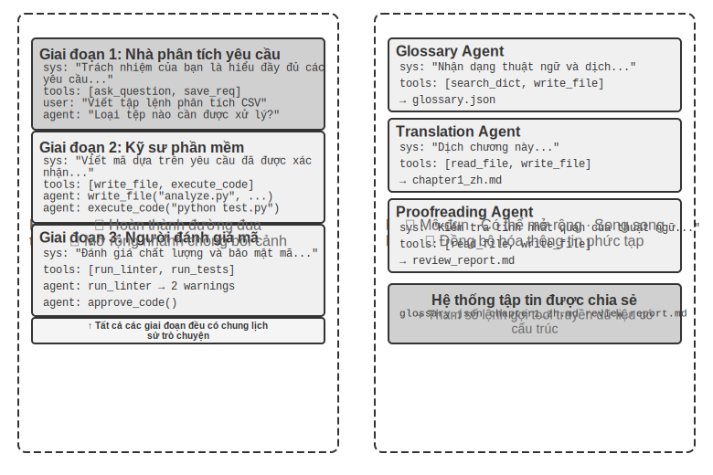


Cần phải làm rõ rằng cả hai kiến trúc đều là hệ thống multi-Agent thực sự (vì các system prompt và bộ công cụ của từng giai đoạn là khác nhau nên Agent khác nhau), và sự khác biệt nằm ở phương thức phối hợp. **Ngữ cảnh được chia sẻ** dựa vào sự phối hợp ngầm - Agent tiếp theo kế thừa lịch sử ngữ cảnh hoàn chỉnh của lời nói đầu Agent và có thể "nhìn thấy" quá trình suy nghĩ trước đó và thông tin được truyền qua chính ngữ cảnh đó. **Không có ngữ cảnh chung** dựa vào sự phối hợp rõ ràng - Agent trao đổi thông tin thông qua các tệp, tin nhắn hoặc giao diện dữ liệu có cấu trúc và mỗi Agent chỉ nhìn thấy những gì có liên quan đến chính nó.

Ví dụ: trước đây giống như một nhóm ngồi quanh bàn để thảo luận và mọi người đều nghe thấy mọi thứ; cái sau giống như các bộ phận khác nhau cộng tác thông qua email và tài liệu, mỗi bộ phận có không gian làm việc riêng.

Bảng 10-1 tóm tắt cơ sở lựa chọn của hai kiến trúc từ năm khía cạnh: số lượng nhiệm vụ phụ, cửa sổ ngữ cảnh, tính song song, cách ly thông tin và ngân sách chi phí, có thể được sử dụng làm danh sách kiểm tra để lựa chọn kiến trúc sớm.

Bảng 10-1 Cơ sở lựa chọn giữa ngữ cảnh dùng chung và ngữ cảnh không chia sẻ

| Chọn theo | Chia sẻ ngữ cảnh | Đừng chia sẻ ngữ cảnh |
|---|---|---|
| Số lượng nhiệm vụ | Rất ít (vai trò 2-3) | Nhiều (cần xử lý song song) |
| Cửa sổ ngữ cảnh | Đủ thông tin cho mọi vai trò | Không vừa trong một cửa sổ |
| Song song | Sự thống trị nối tiếp (các nhân vật lần lượt tiếp quản nhau theo cùng một trajectory) | Có thể song song hóa quy mô lớn (các ngữ cảnh độc lập với nhau và không chặn nhau) |
| Cách ly thông tin | Không bắt buộc (tất cả các vai trò đều chia sẻ thông tin) | Bắt buộc (ví dụ: xem xét bảo mật không nên xem quy trình suy nghĩ ban đầu) |
| Ngân sách chi phí | Tiếp sức đường đơn, mã thông báo tích lũy theo giai đoạn | Nhiều Agent được mở rộng riêng biệt và tổng số mã thông báo thường cao hơn vài lần theo mức độ lớn |

**Đánh giá đơn giản**: Nếu ngữ cảnh tích lũy dự kiến sẽ vượt quá 50% thời lượng (đây là quy tắc kinh nghiệm, không phải ngưỡng chính xác), thì không nên chia sẻ ngữ cảnh đó; nếu không mất thông tin là một hạn chế cứng rắn đối với tính chính xác của nhiệm vụ thì thông tin đó nên được chia sẻ; hầu hết các hệ thống thực tế đều áp dụng sơ đồ "chuyển đổi giai đoạn" - một số Agent đầu tiên được chia sẻ và sau khi đạt đến điểm bão hòa thông tin, hãy chuyển sang ngữ cảnh không chia sẻ + chuyển giao rõ ràng (chuyển giao, nghĩa là bởi Agent ngược dòng. Chủ động quyết định thông tin nào sẽ chuyển giao cho hạ lưu).

### Khía cạnh 2: Cấu trúc liên kết cộng tác

Chiều thứ hai là cấu trúc liên kết cộng tác—cấu trúc kiểm soát các quyền và luồng thông tin giữa Agent. Liệu cấu trúc liên kết và ngữ cảnh cộng tác có được chia sẻ hay không **độc lập về mặt khái niệm nhưng phù hợp về mặt thực tế**: Nó độc lập về mặt khái niệm vì các hệ thống chia sẻ ngữ cảnh cũng có cấu trúc liên kết. Ví dụ: `transfer_to_agent` (thử nghiệm 10-2) được giới thiệu sau trong chương này về cơ bản là hình thức chuyển giao chuỗi trong ngữ cảnh dùng chung; Nó được cho là có liên quan trong thực tế vì một khi ngữ cảnh được chia sẻ, cấu trúc liên kết thường bị thoái hóa (xem bên dưới) và các giá trị của hai chiều không thể được kết hợp theo ý muốn. Tuy nhiên, khi ngữ cảnh được chia sẻ, quá trình chuyển giao không cần phải quyết định "cái gì sẽ chuyển" - toàn bộ lịch sử được bảo tồn một cách tự nhiên - và do đó, cấu trúc liên kết thường thoái hóa thành một chuỗi chuyển đổi vai trò, không cần đưa ra nhiều quyết định về kiến trúc (một ngoại lệ ở giữa là cộng tác nhiều bên theo kiểu trò chuyện nhóm, xem phần phân quyền ở phần sau của chương này). Khi bạn chọn không chia sẻ ngữ cảnh, "thông tin được truyền như thế nào và ai điều phối nó" sẽ trở thành một vấn đề cần phải được thiết kế rõ ràng.

Nói cách khác, về nguyên tắc, hai chiều này tạo thành một ma trận kết hợp 2 × 3 (cấu trúc liên kết chia sẻ/không chia sẻ × ba). Tuy nhiên, trong hàng ngữ cảnh dùng chung, cấu trúc liên kết chủ yếu thoái hóa thành chuỗi chuyển đổi vai trò, không có nhiều quyết định kiến trúc được đưa ra (đây chính xác là dạng được thảo luận trong phần "Chuyển đổi vai trò nhiều giai đoạn" bên dưới), vì vậy chương này chỉ mở rộng chi tiết về ba ô mà không có ngữ cảnh chung. Dưới đây là ba dạng cấu trúc liên kết hợp tác điển hình khi không có ngữ cảnh nào được chia sẻ, theo mức độ phức tạp tăng dần:

- **Mẫu cộng tác ngang hàng**(Mẫu cộng tác ngang hàng): Một số lượng nhỏ Agent (thường là 2-3) tương tác như nhau, tạo thành một chu trình cải tiến lặp đi lặp lại - giống như khi viết một bài báo, một người soạn thảo và một người khác nhận xét và sửa lại. Sau nhiều lần lặp đi lặp lại, chất lượng tốt hơn nhiều so với bài do một người viết.
- **Chế độ quản lý**(Mẫu điều phối): Trình quản lý tập trung Agent chịu trách nhiệm lập kế hoạch và lập kế hoạch nhiệm vụ, đồng thời nhiều Agent phụ chịu trách nhiệm về các nhiệm vụ phụ cụ thể - giống như người quản lý dự án dẫn dắt một số kỹ sư chuyên nghiệp thực hiện dự án.
- **Mô hình phi tập trung**: Không có bộ điều khiển trung tâm trong thời gian chạy. Agent giao tiếp với nhau như con người và cộng tác để hoàn thành nhiệm vụ.

Thiết kế chi tiết và các kịch bản áp dụng của từng phương thức sẽ được thảo luận trong các phần đặc biệt tiếp theo.

## Khi nào multi Agent thực sự tốt hơn Agent đơn lẻ

Trước khi đi vào kiến trúc cộng tác cụ thể, hãy trả lời một câu hỏi cơ bản hơn: **Khi nào bạn thực sự cần nhiều Agent và khi nào một Agent là đủ?** Câu trả lời cho câu hỏi này sẽ trở thành tài liệu tham khảo tổng thể cho tất cả các kế hoạch dự án tiếp theo. Một loạt nghiên cứu trong những năm gần đây đã đưa ra khung đánh giá rõ ràng - chỉ có một tiêu chí cốt lõi: **Quy trình cộng tác có đưa ra thông tin mới mà khi tạo một Agent duy nhất không thể có được không?**

Bảng 10-2 tóm tắt xem các chế độ cộng tác khác nhau có đưa ra thông tin mới hay không để xác định xem liệu cộng tác nhiều Agent có giá trị đáng kể so với Agent đơn lẻ hay không.

Bảng 10-2 So sánh mức tăng thông tin trong nhiều chế độ cộng tác Agent

| Chế độ cộng tác | Có nên giới thiệu thông tin mới | Hiệu ứng |
|---|---|---|
| Cùng mô hình tự kiểm duyệt (đọc lại kết quả của chính mình) | Không | Thường không hiệu quả hoặc thậm chí có hại |
| Agent khác nhau tranh luận về cùng một văn bản | Không | Bằng một Agent với cùng một lượng tính toán |
| Người đánh giá đánh giá mã bằng cách sử dụng kết quả thực hiện kiểm tra | Có (phản hồi thực hiện) | Cải thiện đáng kể |
| Người đánh giá Xem ảnh chụp màn hình được hiển thị để xem lại mã giao diện người dùng/PPT | Có (phản hồi trực quan) | Cải thiện đáng kể |
| Người đánh giá sử dụng các công cụ bên ngoài để xác minh sự thật | Có (phản hồi về công cụ) | Cải thiện đáng kể |

RLEF (Học tăng cường từ phản hồi thực thi) [^rlef-2025] năm 2025 xác nhận điều này: đào tạo một mô hình thông qua học tăng cường để sử dụng phản hồi thực thi mã nhằm cải thiện mã lặp đi lặp lại sẽ hiệu quả hơn nhiều so với việc để mô hình lấy mẫu độc lập nhiều lần. Điều quan trọng là mỗi lần lặp đưa ra **kết quả thực thi thực**(lỗi biên dịch, lỗi kiểm tra, ngoại lệ thời gian chạy), thông tin này không tồn tại khi mô hình được viết. WebGen-Agent [^webgen-agent-2025] của năm 2025 Trong nhiệm vụ tạo trang web, hệ thống phản hồi bao gồm phản hồi trực quan đa cấp (ảnh chụp màn hình + mô tả mô hình ngôn ngữ hình ảnh) được cho là đã cải thiện hiệu suất của Claude 3.5 Sonnet trên điểm chuẩn này từ 26,4% lên 51,9% - gần gấp đôi.

[^rlef-2025]: Gehring, J., et al. *RLEF: Grounding Code LLMs in Execution Feedback with Reinforcement Learning.* arXiv:2410.02089, 2025.
[^webgen-agent-2025]: Lu, Z., et al. *WebGen-Agent: Enhancing Interactive Website Generation with Multi-Level Feedback and Step-Level Reinforcement Learning.* arXiv:2509.22644, 2025.

Khung "thông tin mới" này giải thích một hiện tượng có vẻ mâu thuẫn: nghiên cứu học thuật cho biết "một Agent duy nhất là đủ", nhưng trong thực tế kỹ thuật, nhiều Agent hơn sẽ hoạt động tốt hơn. Căn nguyên của mâu thuẫn là cả hai thảo luận về các loại "nhiều Agent" khác nhau - so sánh trong nghiên cứu học thuật chủ yếu là chế độ "nhiều Agent nhìn vào cùng một văn bản và thảo luận lẫn nhau" (chẳng hạn như tranh luận), trong khi các hệ thống multi-Agent hiệu quả trong thực hành kỹ thuật thường bao gồm các vòng phản hồi bên ngoài (thực thi mã, hiển thị trực quan, gọi công cụ). Cái trước không giới thiệu thông tin mới, cái sau thì có. Ba kiến trúc cộng tác ngang hàng, người quản lý và phân quyền được giới thiệu ở phần sau của chương này. Hầu như tất cả những công dụng thực sự hiệu quả đều có thể tìm thấy ở tiêu chí này.

**Ngân sách bước so với hiệu suất Agent.** Hướng nghiên cứu liên quan là: việc chỉ định ngân sách bước khác nhau (tức là số lần gọi công cụ hoặc vòng lặp được phép) cho Agent ảnh hưởng đến hiệu suất của nó như thế nào? Theo trực quan, nhiều bước hơn sẽ mang lại kết quả tốt hơn - với ngân sách 30 bước, Agent chỉ có thể triển khai nhanh chóng các chức năng cốt lõi. Với ngân sách 300 bước, nó cũng có thể lập kế hoạch, sau đó triển khai, thử nghiệm và sau đó cải tiến. Tuy nhiên, bài báo năm 2025 của Google "Budget-Aware Tool-Use kích hoạt khả năng mở rộng Agent hiệu quả" đã tìm thấy một kết luận phản trực giác: **Chỉ cần tăng số bước có sẵn cho Agent không đảm bảo cải thiện hiệu suất**. Agent tiêu chuẩn thiếu "nhận thức về ngân sách" - ngay cả với ngân sách 300 bước, họ vẫn có xu hướng thực hiện các tìm kiếm nông và "bão hòa" nhanh chóng. Để có thêm các bước thực sự mang lại kết quả tốt hơn, Agent cần có cơ chế nhận biết ngân sách rõ ràng để linh hoạt điều chỉnh các chiến lược dựa trên các nguồn lực còn lại: khám phá rộng rãi trong giai đoạn đầu và tập trung vào các hướng hứa hẹn nhất trong giai đoạn sau. BAVT (Tìm kiếm cây giá trị Budget-Aware) vào năm 2026 đề xuất thêm đánh giá giá trị theo từng bước, điều chỉnh trọng số thăm dò và sử dụng theo tỷ lệ ngân sách còn lại ở mỗi bước - khi ngân sách giảm, Agent chuyển dần từ "đăng lưới rộng rãi" sang "đào sâu".

Những phát hiện này có ý nghĩa hướng dẫn trực tiếp cho việc thiết kế các hệ thống đa Agent. Ví dụ: trong chế độ người quản lý, Người quản lý Agent không nên chỉ phân phối nhiệm vụ cho Agent phụ và chờ kết quả mà nên phân bổ động ngân sách các bước dựa trên mức độ phức tạp của nhiệm vụ - các nhiệm vụ phụ đơn giản nên được cung cấp ít bước hơn và các nhiệm vụ phụ phức tạp phải được cung cấp đủ các bước. Đồng thời, chúng ta cũng phải hướng dẫn sub-Agent sử dụng hợp lý các khoản ngân sách này (lên kế hoạch đầu tiên, sau đó triển khai, sau đó thử nghiệm, sau đó cải tiến), thay vì lao vào và bắt đầu trực tiếp.

Còn một điều nữa phải có trước tất cả các thiết kế: **chi phí**. Khám phá song song và lặp đi lặp lại nhiều Agent tốn tiền - Anthropic từng tiết lộ rằng mức tiêu thụ mã thông báo của hệ thống nghiên cứu đa Agent của nó cao gấp khoảng 15 lần so với các cuộc hội thoại thông thường và bản thân việc sử dụng mã thông báo có thể giải thích khoảng 80% sự khác biệt về hiệu suất. Điều này có nghĩa là lợi ích hiệu quả của nhiều Agent phải đủ lớn để bao gồm nhiều lần hoặc thậm chí là một mức độ lớn của chi phí bổ sung, nếu không, một Agent đơn lẻ được điều chỉnh phù hợp thường là lựa chọn hiệu quả hơn về mặt chi phí.

## Cộng tác nhiều Agent với ngữ cảnh được chia sẻ

Trong cộng tác nhiều Agent chia sẻ ngữ cảnh, mỗi giai đoạn là một Agent độc lập (với các system prompt và bộ công cụ riêng), nhưng nó kế thừa bản nhạc hoàn chỉnh của Agent trước đó - giống như đồng nghiệp kế nhiệm có thể duyệt tất cả nhật ký công việc do người tiền nhiệm để lại. Ưu điểm cốt lõi của "sự hợp tác kế thừa" này là không bị mất thông tin và mỗi Agent có thể xem lại chi tiết của bất kỳ giai đoạn nào trước đó. Thách thức là làm thế nào để cho phép Agent hiện tại tập trung vào trách nhiệm cốt lõi của mình mà không bị phân tâm bởi lượng lớn thông tin lịch sử được kế thừa.

### Chuyển đổi vai trò nhiều giai đoạn

Trước tiên, hãy làm rõ tranh chấp về định nghĩa: Theo ngôn ngữ của Chương 1, chuyển đổi vai trò nhiều giai đoạn là một kiểu **điều phối theo kiểu quy trình làm việc** - đường dẫn thực hiện (chẳng hạn như làm rõ yêu cầu→thực hiện→đánh giá) được xác định trước. Lý do tại sao chương này kiểm tra lại nó trong khuôn khổ nhiều Agent là từ góc độ nhận dạng và ngữ cảnh Agent: khi các system prompt, bộ công cụ và mối quan tâm của từng giai đoạn là khác nhau, việc coi chúng như nhiều Agent chia sẻ cùng một trajectory có thể mang lại lợi ích thiết kế thực tế - các từ nhắc nhở và bộ công cụ của mỗi "danh tính" có thể được đánh bóng độc lập và ranh giới giai đoạn tự nhiên trở thành điểm kiểm soát cổng chất lượng.

Trong các tác vụ phức tạp, vai trò và trách nhiệm của Agent có thể thay đổi đáng kể ở các giai đoạn khác nhau. Nếu bạn luôn sử dụng cùng một bộ từ nhắc nhở của hệ thống tĩnh thì nó sẽ quá chung chung và thiếu phù hợp hoặc hướng dẫn của tất cả các giai đoạn sẽ bị nhồi nhét vào nhau dẫn đến quá dài dòng. Phương pháp chuyển đổi vai trò nhiều giai đoạn là chuyển đổi động các từ nhắc nhở của hệ thống và bộ công cụ theo giai đoạn hiện tại, để Agent có thể hoạt động với “danh tính” phù hợp nhất ở từng giai đoạn. Việc chuyển đổi này không yêu cầu tạo một phiên bản mới hoặc bắt đầu một quy trình mới, chỉ cần cập nhật ngữ cảnh trong cùng một phiên thực thi. Điều quan trọng là mặc dù vai trò được chuyển đổi nhưng lịch sử hội thoại và trạng thái nhiệm vụ luôn được chia sẻ liên tục - Agent vẫn sẽ có quyền truy cập vào tất cả thông tin tích lũy ở giai đoạn trước dưới vai trò mới.


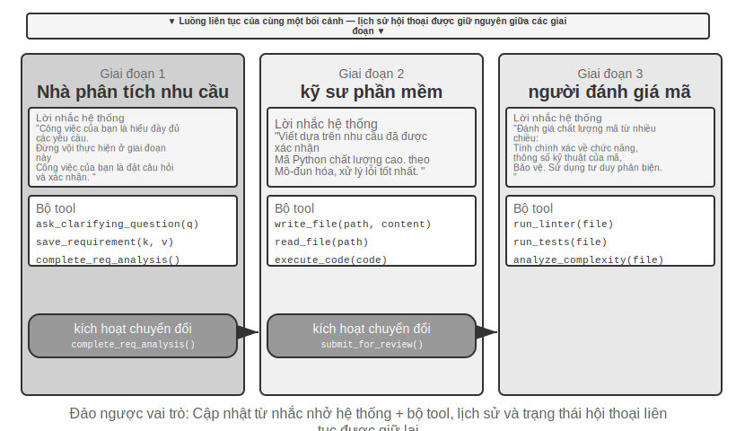


> **Thí nghiệm 10-1 ★★: Xác định system prompt theo giai đoạn thực hiện**
>
> Thử nghiệm này sử dụng quy trình làm việc hoàn chỉnh của Coding Agent để cho thấy các system prompt theo giai đoạn có thể cải thiện hiệu suất của Agent như thế nào.
>
> **Kịch bản nhiệm vụ**: Người dùng đưa ra yêu cầu phát triển phần mềm và Agent sẽ trải qua ba giai đoạn theo trình tự: làm rõ yêu cầu, triển khai mã và đánh giá chất lượng.
>
> **Giai đoạn 1: Làm rõ yêu cầu**(Vai trò: Nhà phân tích yêu cầu)
>
> Hệ thống nhắc nhở từ nhấn mạnh:
> - "Trách nhiệm của bạn là hiểu đầy đủ nhu cầu của người dùng. Đặt câu hỏi để làm rõ những điều còn mơ hồ và đảm bảo rằng bạn hiểu đầy đủ về chức năng, kịch bản sử dụng và yêu cầu hiệu suất mà người dùng mong đợi."
> - "Đừng vội thực hiện. Việc của bạn ở giai đoạn này là đặt câu hỏi và xác nhận chứ không phải viết code."
> - "Khi bạn xác nhận rằng tất cả các yêu cầu quan trọng đã được xác định, hãy gọi công cụ `complete_requirements_analysis()` để kết thúc giai đoạn này."
>
> Bộ công cụ hạn chế: `ask_clarifying_question(question)` để đặt câu hỏi làm rõ cho người dùng, `save_requirement(key, value)` để ghi lại các điểm yêu cầu đã được xác nhận và `complete_requirements_analysis()` để đánh dấu giai đoạn hoàn thành.
>
> Agent đã tiến hành nhiều vòng đối thoại với người dùng: "Tập lệnh này cần xử lý những loại tệp nào?" "Các thư mục con có nên được xử lý đệ quy không?" "Tên tập tin gốc có nên được giữ lại sau khi di chuyển tập tin không?" Thông qua những câu hỏi này, Agent dần dần hình thành sự hiểu biết đầy đủ về các yêu cầu và lưu trữ có cấu trúc. Khi Agent xác định rằng các yêu cầu đã đủ rõ ràng, hãy gọi `complete_requirements_analysis()` để kích hoạt thay đổi vai trò - hệ thống phát hiện tín hiệu hoàn thành giai đoạn và tự động chuyển sang cấu hình của giai đoạn tiếp theo.
>
> **Giai đoạn 2: Triển khai mã**(Vai trò: Kỹ sư phần mềm)
>
> Hệ thống mới nhấn mạnh từ nhắc nhở:
> - "Trách nhiệm của bạn là viết mã Python chất lượng cao dựa trên các yêu cầu đã xác định."
> - "Tuân theo các phương pháp hay nhất: mã phải có tính mô-đun, có cách xử lý lỗi phù hợp và chứa các nhận xét cần thiết."
> - "Sau khi bạn viết xong mã và vượt qua các bài kiểm tra cơ bản, hãy gọi `submit_for_review()` để bước vào giai đoạn xem xét."
>
> Bộ công cụ đã trải qua những thay đổi đáng kể: các công cụ làm rõ yêu cầu trước đây đã bị loại bỏ và thay thế bằng các công cụ phát triển như `write_file(path, content)`, `read_file(path)`, `execute_code(code)`. Agent Bắt đầu viết mã dựa trên các yêu cầu đã lưu ở giai đoạn đầu tiên - đầu tiên viết logic chính, sau đó thêm xử lý lỗi và cuối cùng viết kiểm tra xác minh. Trong suốt quá trình, Agent vẫn có thể truy cập lịch sử hội thoại từ giai đoạn đầu tiên để xem xét chi tiết các yêu cầu, nhưng mẫu hành vi hoàn toàn khác: không còn câu hỏi nào nữa, tập trung vào việc thực hiện. Gọi `submit_for_review()` khi hoàn tất.
>
> **Giai đoạn 3: Đánh giá mã**(Vai trò: Người đánh giá mã)
>
> Hệ thống mới nhấn mạnh từ nhắc nhở:
> - "Trách nhiệm của bạn là xem lại mã bạn vừa viết và đánh giá chất lượng của nó từ nhiều khía cạnh: tính đúng đắn về chức năng, đặc tả mã, xử lý lỗi, tối ưu hóa hiệu suất và bảo mật."
> - "Sử dụng tư duy phản biện và cố gắng xác định các vấn đề có thể xảy ra cũng như chỗ cần cải thiện trong mã."
> - "Nếu phát hiện sự cố nghiêm trọng, hãy gọi `request_revision(issues)` và quay lại giai đoạn triển khai để sửa đổi; nếu chất lượng chấp nhận được, hãy gọi `approve_code()` để hoàn thành nhiệm vụ."
>
> Bộ công cụ lại thay đổi: được thay thế bằng các công cụ phân tích chất lượng mã như `run_linter(file)`, `run_tests(file)`, `analyze_complexity(file)`. Agent Kiểm tra lại mã từ góc độ của người đánh giá, chạy phân tích tĩnh và khắc phục các lỗi tiềm ẩn, sự cố hiệu suất hoặc rủi ro bảo mật.
>
> Thiết kế ba giai đoạn này cho phép Agent tập trung vào nhiệm vụ cốt lõi hiện tại ở mỗi giai đoạn. Quan trọng hơn, cơ chế chuyển pha rõ ràng đảm bảo tính toàn vẹn của quá trình thực thi nhiệm vụ - Agent sẽ không bỏ qua quá trình phân tích yêu cầu và viết mã trực tiếp cũng như không cung cấp kết quả mà không cần xem xét.
>
> **Yêu cầu thử nghiệm**:
> 1. Thực hiện các từ nhắc nhở hệ thống ba giai đoạn, mỗi giai đoạn có xác định vai trò và hướng dẫn hành vi rõ ràng
> 2. Cấu hình bộ công cụ phù hợp cho từng giai đoạn
> 3. Thực hiện cơ chế kích hoạt chuyển giai đoạn (được gọi thông qua các công cụ cụ thể)
> 4. Đảm bảo tính liên tục của ngữ cảnh giữa các giai đoạn
> 5. Xử lý các tình huống quay lui—có thể quay lại giai đoạn triển khai khi quá trình xem xét mã phát hiện thấy vấn đề
> 6. Ghi lại nhật ký thực hiện của từng giai đoạn để cho thấy các từ nhắc nhở khác nhau tạo ra các kiểu hành vi khác nhau như thế nào
>
### Chuyển đổi vai trò trên nhiều miền

Sự chuyển đổi vai trò nhiều giai đoạn trước đó minh họa việc thực hiện theo giai đoạn trong một loại nhiệm vụ duy nhất (phát triển phần mềm). Chuyển đổi vai trò giữa các miền khám phá thêm khả năng chuyển đổi tự động giữa nhiều loại nhiệm vụ của Agent - đây không còn là một quy trình tuyến tính được lên kế hoạch trước nữa mà dựa trên những thay đổi về nhu cầu của người dùng, Agent sẽ xác định một cách độc lập vai trò chuyên nghiệp nào nên chuyển sang.

> **Thử nghiệm 10-2 ★★: Chuyển đổi nhiều vai trò**
>
> **Điều kiện tiên quyết**: Trước tiên bạn nên hiểu cơ chế Kỹ năng Agent trong Chương 2.
>
> **Kiến trúc hệ thống**: Năm vai trò——
>
> - **phân loại (phân loại bộ phận lễ tân, lối vào mặc định)**: Hiểu nhu cầu chung của người dùng, chia thành các nhiệm vụ phụ tuần tự, chuyển dần sang các vai trò chuyên môn phù hợp và đưa ra xác nhận cuối cùng sau khi hoàn thành tất cả các nhiệm vụ phụ. Bản thân tôi không có công cụ chuyên môn, tôi chỉ giữ chuyển khoản
> - **nghiên cứu (Chuyên gia truy xuất thông tin)**: Tìm dữ liệu, sự kiện và thông tin với `web_search`
> - **coding (Chuyên gia lập trình)**: Sử dụng `execute_python` để viết và chạy mã nhằm giải quyết các vấn đề về logic/script của chương trình
> - **data_analysis (chuyên gia phân tích dữ liệu)**: Sử dụng `calculate` / `descriptive_stats` để thực hiện các phép tính và thống kê định lượng (tốc độ tăng trưởng tương tự, tốc độ tăng trưởng gộp trung bình hàng năm CAGR, giá trị trung bình)
> - **viết (chuyên gia viết)**: trau chuốt dữ liệu truy xuất và kết luận tính toán thành một bản thảo mượt mà và hoàn thiện cho người đọc được chỉ định (có thể sử dụng `count_characters` để kiểm tra độ dài)
>
> **Cơ chế cốt lõi: công cụ transfer_to_agent**
>
> Tất cả các nhân vật đều được trang bị công cụ `transfer_to_agent(target_role, reason)`. Khi được gọi, hệ thống sẽ: 1) lưu lịch sử hội thoại hiện tại; 2) tải các từ nhắc và bộ công cụ của ký tự đích; 3) chuyển lịch sử hội thoại cho nhân vật mới để nhân vật đó hiểu được ngữ cảnh; 4) tiếp tục thực hiện với tư cách là ký tự mới.
>
> **Kịch bản thử nghiệm**: Hệ thống chạy theo phân loại (phân loại ở quầy lễ tân) theo mặc định. Người dùng đã ném một nhiệm vụ tổng hợp giữa các miền: "Tôi đang chuẩn bị tài liệu cho các nhà đầu tư. Hãy giúp tôi kiểm tra doanh số bán xe năng lượng mới của Trung Quốc vào năm 2021, 2022 và 2023, tính toán tốc độ tăng trưởng kép trung bình hàng năm trong ba năm này, sau đó viết một bản tóm tắt bằng tiếng Trung không quá 120 từ cho các nhà đầu tư." phân chia nó thành "kiểm tra dữ liệu → tính toán các chỉ số → viết bản nháp" và bước đầu tiên là bàn giao tìm kiếm:
>
> ```python
> transfer_to_agent(target_role="research", Reason="Trước tiên cần kiểm tra dữ liệu bán xe sử dụng năng lượng mới trong ba năm")
> ```
>
> nghiên cứu Sau khi kiểm tra doanh số bán hàng bằng `web_search`, hãy ghi dữ liệu chính vào cuộc trò chuyện và sau đó chuyển cho bộ phận phân tích dữ liệu:
>
> ```python
> transfer_to_agent(target_role="data_analysis", Reason="dữ liệu đã sẵn sàng, cần tính CAGR ba năm")
> ```
>
> data_analysis sử dụng `calculate` để tính toán tốc độ tăng trưởng và chuyển nó sang văn bản để hoàn thành tài liệu; sau khi viết xong, nó được chuyển trở lại phân loại để xác nhận lần cuối. Toàn bộ liên kết là phân loại → nghiên cứu → phân tích dữ liệu → viết → phân loại. Mỗi nhân vật đều có thể xem toàn bộ lịch sử hội thoại nên nhân vật sau đương nhiên biết những gì đã làm trước đó.
>
> Việc ra quyết định chuyển đổi vai trò dựa vào sự hướng dẫn của các từ nhắc nhở của hệ thống. Các quy tắc định tuyến được liệt kê rõ ràng trong lời nhắc phân loại: dữ liệu/thông tin được chuyển sang nghiên cứu, viết và chạy mã được chuyển sang mã hóa, tính toán định lượng và thống kê được chuyển sang data_analysis và đánh bóng bản thảo được chuyển sang viết. Tiêu chí đánh giá rất đơn giản: nếu nhiệm vụ đòi hỏi kiến thức chuyên sâu hoặc các công cụ chuyên dụng trong một lĩnh vực cụ thể thì sẽ được giao cho vai trò chuyên môn tương ứng. Lời nhắc về vai trò chuyên nghiệp cũng cung cấp hướng dẫn về người sẽ giao hoặc quay lại nhóm sau khi hoàn thành phần vai trò.
>
> **Yêu cầu thử nghiệm**:
> 1. Triển khai lời nhắc hệ thống và bộ công cụ chuyên dụng cho ít nhất ba vai trò chuyên môn
> 2. Triển khai công cụ `transfer_to_agent` để hỗ trợ chuyển mạch động
> 3. Đảm bảo tính liên tục của ngữ cảnh sau khi chuyển đổi vai trò
> 4. Xử lý vấn đề chuyển đổi vòng lặp - tránh Agent chuyển đổi liên tục giữa các ký tự
> 5. Thiết kế các quy trình nhiệm vụ phức tạp trên nhiều lĩnh vực để thể hiện giá trị của việc chuyển đổi vai trò
>
## Cộng tác nhiều Agent không có ngữ cảnh chung

Không có ngữ cảnh chia sẻ nào thể hiện sự cộng tác đa Agent thực sự. Theo kiến trúc này, mỗi Agent là một thực thể độc lập với ngữ cảnh, trajectory và trạng thái riêng. Agent không thể truy cập trực tiếp vào "hoạt động nội bộ" của nhau và sự cộng tác hoàn toàn dựa trên các cơ chế truyền dữ liệu có cấu trúc và rõ ràng, đó là ba cơ chế giao tiếp được giới thiệu ở đầu chương này (tham số lệnh gọi công cụ, hệ thống tệp dùng chung, bus thông báo).

Sự cô lập này mang lại một số lợi ích kỹ thuật thực tế: mỗi Agent có thể được phát triển và thử nghiệm độc lập, các khả năng mới không cần thay đổi mã hiện có, lỗi của một Agent sẽ không truyền trạng thái lỗi sang Agent khác và nhiều Agent có thể được thực thi đồng thời - ngữ cảnh hoàn toàn độc lập và không có cạnh tranh tài nguyên.

Nhưng sẽ phải trả giá nếu không chia sẻ ngữ cảnh. Rõ ràng nhất là vấn đề đồng bộ hóa thông tin: làm thế nào mỗi Agent có thể duy trì sự hiểu biết nhất quán về trạng thái nhiệm vụ? Thông tin có bị mất hoặc trùng lặp trong quá trình truyền tải không? Việc gỡ lỗi cũng trở nên khó khăn hơn - nếu có sự cố xảy ra, bạn cần xem qua nhiều nhật ký Agent để mô tả quá trình thực thi hoàn chỉnh. Những vấn đề này làm cho việc thiết kế các thông số kỹ thuật giao diện, định dạng dữ liệu và giao thức truyền thông trở nên quan trọng.

Sự hợp tác rõ ràng mà không cần chia sẻ ngữ cảnh dựa trên hai bộ cơ sở hạ tầng độc lập với cấu trúc liên kết. Đầu tiên là **hệ thống tệp được chia sẻ**, đóng vai trò là sản phẩm trao đổi giữa Agent và phương tiện liên tục để trao đổi tệp với người dùng, tạo thành mặt phẳng dữ liệu cộng tác; thứ hai là **cơ chế điều khiển và giao tiếp**, hỗ trợ truyền tin nhắn, truy vấn trạng thái và chấm dứt thực thi giữa Agent, tạo thành một mặt phẳng điều khiển cộng tác. Ba cấu trúc liên kết sau đây được xây dựng dựa trên hai cấu trúc này.

### Hệ thống file Agent qua mắt

Phần đầu của chương này liệt kê "hệ thống tệp dùng chung" là một trong ba cơ chế giao tiếp không chia sẻ ngữ cảnh. Trong hệ thống thực tế, Agent không truy cập vào một bộ lưu trữ duy nhất mà là một **hệ thống tệp ảo**(hệ thống tệp ảo): bộ nhớ với các nguồn khác nhau, vòng đời và quyền được gắn kết (gắn kết) trong cùng một cây thư mục. Agent vượt qua quyền truy cập Giao diện `read_file`/`write_file`/`list_dir` thống nhất, lớp dưới cùng có thể là đĩa tạm thời cục bộ, bộ lưu trữ đối tượng liên tục, đĩa đám mây API của bên thứ ba hoặc gói tài nguyên hệ thống chỉ đọc. Làm rõ thành phần của cây thư mục này—khả năng hiển thị và vòng đời của từng khu vực—là điều kiện tiên quyết cho thiết kế cộng tác đa Agent: một số lượng đáng kể các xung đột đồng thời và rò rỉ thông tin bắt nguồn từ việc trộn lẫn các khu vực cần được cách ly. Hệ thống tệp của hệ thống đa Agent trưởng thành thường bao gồm bốn loại khu vực sau:

**1. Không gian làm việc độc quyền Agent (Scratchpad)**. Một thư mục riêng dành riêng cho mỗi phiên bản Agent, nơi lưu trữ các sản phẩm trung gian, tệp tạm thời, bản nháp và nhật ký gỡ lỗi. Vòng đời được liên kết với phiên bản và không hiển thị đối với Agent và người dùng khác. Việc cách ly bàn di chuột có hai chức năng: ngăn các tệp tạm thời của nhiều Agent ghi đè lên nhau và giữ cho ngữ cảnh Agent chính được sắp xếp hợp lý - quá trình dùng thử và lỗi của Agent con được lưu giữ trong không gian làm việc riêng của nó và chỉ sản phẩm cuối cùng mới được gửi tới không gian chung. Điều này tương ứng với phương án mức lưu trữ của Chương 4 "Sub Agent trả về bản tóm tắt có cấu trúc thay vì bản nhạc đầy đủ".

**2. Nhiều không gian làm việc chung Agent**. Khu vực cộng tác trong đó nhiều Agent đọc và ghi cùng nhau và **hiển thị với người dùng** là phương tiện chính để trao đổi sản phẩm giữa các Agent theo kiến trúc ngữ cảnh không chia sẻ: Bảng thuật ngữ Agent ghi vào bảng thuật ngữ và Bản dịch Agent đọc từ đó; người dùng cũng có thể tải lên các tệp gốc và tải xuống các sản phẩm cuối cùng tại đây. Vòng đời của nó gắn liền với toàn bộ nhiệm vụ và đòi hỏi sự kiên trì. Là khu vực có nhiều bên đồng thời đọc và ghi, đây là khu vực có nguy cơ cao xảy ra xung đột đồng thời - các cơ chế như khóa lạc quan và cách ly bản sao làm việc (worktree) đều hoạt động ở đây. Để biết chi tiết, hãy xem "Chế độ lỗi 1" ở phần sau của chương này. Chương 4 sử dụng một ổ đĩa để gắn `/workspace/shared` nhằm kết nối Agent chính, máy tính ảo và điện thoại di động ảo, đây là cách triển khai điển hình của lớp này.

**3. Tài nguyên được gắn bên ngoài (Tài nguyên bên ngoài được gắn)**. Các nguồn thông tin của bên thứ ba mà người dùng ủy quyền truy cập—Google Drive, Notion, Dropbox, Enterprise Wiki, v.v.—được ánh xạ tới các điểm gắn kết trong hệ thống tệp (chẳng hạn như `/mnt/gdrive`) thông qua bộ điều hợp. Agent truy cập tài liệu Notion bằng cách đọc một tệp và lớp dưới cùng được hoàn thành bởi bộ điều hợp gọi bên kia là API. Ba đặc điểm của lớp này khác với bộ nhớ cục bộ cần được xử lý rõ ràng trong quá trình thiết kế: **Quyền truy cập bị hạn chế bởi các quyền bên ngoài**(quyền của người dùng trong hệ thống nguồn xác định phạm vi hiển thị của Agent), **Độ trễ cao hơn và tính nhất quán yếu hơn**(mỗi lần đọc là một lượt truy cập mạng và dữ liệu có thể đã được sửa đổi bên ngoài), **Chỉ đọc theo yêu cầu**(phải thận trọng khi ghi lại vào nguồn bên ngoài, việc ghi sai có thể làm ô nhiễm dữ liệu thực của người dùng). Giao diện tệp hợp nhất giúp Agent không cần phải tùy chỉnh các công cụ chuyên dụng cho từng nguồn dữ liệu, nhưng nó cũng che giấu những khác biệt về hiệu suất và bảo mật được đề cập ở trên, do đó, ranh giới chỉ đọc/có thể ghi, thời gian chờ và thông tin xác thực cần phải được quản lý rõ ràng ở cấp độ gắn kết.

**4. Tài nguyên tích hợp trong hệ thống (Tài nguyên hệ thống Built-in)**. Cài đặt trước hệ thống và gói tài nguyên chia sẻ chỉ đọc cho tất cả Agent. Đại diện điển hình là **Kỹ năng** được giới thiệu trong Chương 2 và 4 - các tài liệu kiến thức và tập lệnh được sắp xếp dưới dạng tệp, được gắn trên `/skills` và các đường dẫn khác và được truy cập theo cách tiết lộ lũy tiến (đầu tiên được lập chỉ mục, sau đó được mở rộng theo yêu cầu); Ngoài ra, nó còn bao gồm các tài liệu hướng dẫn tham khảo, thư viện mẫu và định nghĩa công cụ dùng chung. Lớp này được chia sẻ trên toàn cầu, chỉ đọc, ổn định trong các phiên và có thể được đọc đồng thời bởi tất cả Agent mà không cần kiểm soát đồng thời.

Hình 10-3 cho thấy cấu trúc trong đó bốn loại khu vực này được gắn thống nhất trên cùng một cây thư mục: Agent truy cập toàn bộ cây thông qua giao diện hợp nhất, người dùng tải lên và tải xuống các tệp từ không gian dùng chung, nguồn dữ liệu bên ngoài được gắn thông qua bộ điều hợp và các tài nguyên tích hợp trong hệ thống được cung cấp theo cách chỉ đọc.


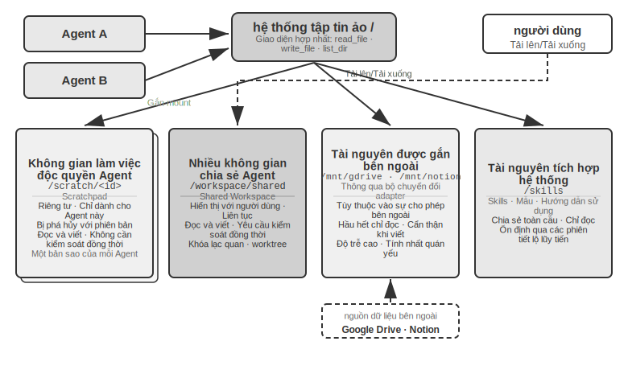


Bảng 10-3 so sánh bốn loại lĩnh vực này từ bốn chiều về khả năng hiển thị, vòng đời, quyền đọc và ghi và kiểm soát tương tranh, có thể được sử dụng làm danh sách kiểm tra cho thiết kế bố cục hệ thống tệp.

Bảng 10-3 Bốn loại vùng của hệ thống tệp ảo Agent

| Vùng | Tầm nhìn | Vòng đời | Đọc và Viết | Kiểm soát đồng thời |
|---|---|---|---|---|
| Không gian làm việc độc quyền Agent | Chỉ Agent này | Bị phá hủy với phiên bản Agent | Đọc và viết | Không bắt buộc (riêng tư) |
| Nhiều không gian chia sẻ Agent | Tất cả người dùng Agent + cộng tác | Khi nhiệm vụ tiếp tục, cần có sự kiên trì | Đọc và viết | Bắt buộc (khóa lạc quan/worktree) |
| Tài nguyên gắn bên ngoài | Phụ thuộc vào ủy quyền bên ngoài | Xác định bởi nguồn bên ngoài | Chủ yếu chỉ đọc, viết thận trọng | Chịu trách nhiệm bởi nguồn bên ngoài |
| Tài nguyên tích hợp trong hệ thống | Tất cả Agent | Ổn định xuyên phiên | Chỉ đọc | Không bắt buộc (chỉ đọc) |

Hợp nhất bốn loại vùng vào cùng một cây thư mục là giá trị của thiết kế " **Đường dẫn tệp dưới dạng giao diện chung**": khi chuyển sản phẩm giữa Agent, chuyển giao đầu vào từ Agent chính sang Agent phụ và thậm chí trao đổi Artifacts để cộng tác A2A giữa các tổ chức, những gì được truyền là một chuỗi đường dẫn nhẹ thay vì tải nội dung vào cửa sổ ngữ cảnh (Chương 4). Điều này tương tự như Chương 5, "Hệ thống tệp là xương sống của Agent" - phần sau thảo luận về cách một Agent sử dụng một hệ thống tệp để mang bộ nhớ và các chức năng. Ở đây, tính trừu tượng tương tự được mở rộng cho nhiều Agent: cây thư mục ảo gắn kết bốn loại lưu trữ: riêng tư, chia sẻ, bên ngoài và tích hợp, là cơ sở lưu trữ cho cộng tác nhiều Agent.

### Giao tiếp và điều khiển giữa Agent

Hệ thống tập tin giải quyết vấn đề **trao đổi sản phẩm** giữa Agent. Việc cộng tác cũng yêu cầu **mặt phẳng điều khiển**: để hỗ trợ truyền tin nhắn, truy vấn trạng thái và chấm dứt thực thi giữa Agent. Chương 4 đã cung cấp cho các công cụ cơ bản của mặt phẳng này—tạo (`spawn_subagent`), gửi tin nhắn (`send_message_to_subagent`), hủy (`cancel_subagent`)—và bốn hình thức cộng tác: đồng bộ/không đồng bộ/truyền trực tuyến/đa vòng. Phần này không lặp lại định nghĩa giao diện mà tập trung vào ba khả năng mà nhiều cộng tác Agent phụ thuộc vào nhưng thường bị bỏ qua.

**1. Truyền tin nhắn.** Hình thức đơn giản nhất là điểm-điểm: Agent A gọi trực tiếp `send_message_to_agent_b(content)`, phù hợp với các tình huống có cấu trúc liên kết cố định và một số lượng nhỏ Agent (chẳng hạn như điện thoại + máy tính kép Agent trong thử nghiệm của chương này). Khi số lượng Agent tăng lên và yêu cầu song song không đồng bộ, số lượng kết nối điểm-điểm tăng tỷ lệ thuận với số lượng Agent và cả người gửi và người nhận đều phải trực tuyến cùng một lúc; tại thời điểm này, **Bus thông báo** nên được sử dụng thay thế (xem "Biểu mẫu phối hợp song song" ở phần sau của chương này): Agent xuất bản thông báo lên bus và bus chuyển tiếp nó theo mối quan hệ đăng ký. Người gửi không cần biết người tiêu dùng. Dù là điểm-điểm hay qua xe buýt, tin nhắn thường phải mang một phong bì có cấu trúc: ID người gửi, đích (chỉ định Agent hoặc quảng bá), loại tin nhắn (chẳng hạn như `task_assigned`/`status_update`/`result`/`terminate`) và tải trọng JSON. Định dạng phong bì thống nhất đảm bảo người nhận định tuyến và phân tích cú pháp đáng tin cậy, đồng thời cho phép truy xuất nguồn gốc của các liên kết cộng tác - chìa khóa để gỡ lỗi các hệ thống đa Agent.

**2. Truy vấn trạng thái.** Đây là khía cạnh được đánh giá thấp nhất của mặt phẳng điều khiển. Sau khi chủ Agent gửi con Agent, nếu không có cách nào để biết tiến trình của nó, nó không thể phán đoán liệu có nên tiếp tục chờ đợi hay can thiệp kịp thời khi nó bị chặn hay không. Có hai mô hình để đạt được trạng thái. **Kéo**: Agent chính gọi `get_subagent_status(agent_id)` và trả về trạng thái hiện tại (đang chạy/chờ đầu vào/hoàn thành/không thành công), tiến trình và thời gian hoạt động mới nhất của Agent con. **Đẩy**: Agent con chủ động báo cáo các cập nhật trạng thái lên bus thông báo trong khi thực thi và Agent chính duy trì bảng trạng thái nhiệm vụ được làm mới trong thời gian thực ("giám sát thời gian thực" của thử nghiệm của 10-6 trong chương này là mô hình này). Cả hai đều có sự đánh đổi riêng: việc triển khai kéo rất đơn giản, nhưng việc bỏ phiếu quá dày đặc sẽ lãng phí mã thông báo và việc bỏ phiếu quá thưa thớt sẽ không kịp thời; push có hiệu suất thời gian thực tốt nhưng dựa vào Agent con để báo cáo một cách có ý thức. Trong kỹ thuật, trạng thái phụ Agent thường được mô hình hóa dưới dạng **máy trạng thái**(đã gửi, đang thực thi, yêu cầu đầu vào, đã hoàn thành, không thành công). Giao thức A2A ở phần sau của chương này sẽ chuẩn hóa vòng đời tác vụ thành trạng thái như vậy. Ngoài ra, cần có **thời gian chờ và phát hiện nhịp tim** để dự phòng (lặp lại Heartbeat và Monitor_shell trong Chương 4): ngay cả khi Agent con không báo cáo cũng như không trả về, Agent chính vẫn có thể dựa vào "nếu không có hoạt động nào trong hơn N phút, nó sẽ bị đánh giá là lỗi" để tránh hệ thống bị Agent con bị chặn kéo xuống.

**3. Việc thực thi chấm dứt.** Trong cộng tác song song, thường xảy ra tình trạng "người thành công, người kia thất bại" - nhiều tìm kiếm Agent riêng biệt và những tìm kiếm khác sẽ dừng ngay sau khi một tìm kiếm trúng mục tiêu (dòng 10-6 trong thử nghiệm của chương này bị chấm dứt). Sự chấm dứt có hai điểm mạnh. **Duyên dáng** là lựa chọn đầu tiên: Agent chính gửi tín hiệu `terminate` và Agent con phản hồi ở điểm an toàn của bước hiện tại, trước tiên hãy dọn sạch tài nguyên (đóng phiên trình duyệt, ghi các tệp chưa hoàn thành, giải phóng khóa), trả về xác nhận (ack) rồi thoát. **Chấm dứt cưỡng bức (bắt buộc)** là một biện pháp che đậy: trực tiếp chấm dứt quá trình, chỉ được sử dụng khi Agent con không phản hồi với các tín hiệu duyên dáng, với cái giá phải trả là để lại các tài nguyên bị treo và việc ghi chưa hoàn thành. Hai điểm kỹ thuật cần được giải quyết: thứ nhất, việc chấm dứt duyên dáng yêu cầu Agent con thường xuyên kiểm tra tín hiệu kết thúc trong vòng lặp (tương tự như cơ chế ngắt trong Chương 4), nếu không thì tín hiệu không thể được phản hồi; thứ hai, có một điều kiện chạy đua trong việc chấm dứt tầng - nhiều Agent con có thể báo cáo thành công gần như cùng một lúc và Agent chính phải sử dụng khóa hoặc thiết kế bình thường để đảm bảo chỉ có một lần xử lý và chỉ một vòng kết thúc phát sóng. Để biết chi tiết, hãy xem thử nghiệm trong chương này 10-6 Thảo luận về điều kiện cuộc đua.

Trao đổi sản phẩm (mặt phẳng dữ liệu), truyền thông báo, truy vấn trạng thái và chấm dứt thực thi (mặt phẳng điều khiển) cùng hỗ trợ các hệ thống đa Agent không chia sẻ ngữ cảnh. Ba cấu trúc liên kết cộng tác sau đây về cơ bản là những lựa chọn khác nhau về quyền sở hữu kiểm soát và luồng thông tin trên hai mặt phẳng này.

Theo mối quan hệ cộng tác và đặc điểm luồng điều khiển giữa Agent, cộng tác không có ngữ cảnh chung có thể được chia thành ba kiến trúc chính: chế độ cộng tác ngang hàng, chế độ người quản lý và chế độ phi tập trung, tương ứng phù hợp với các loại nhiệm vụ khác nhau.

### Mô hình cộng tác ngang hàng: kiểm tra và cân bằng lẫn nhau cũng như cải tiến lặp lại

Hợp tác ngang hàng thường liên quan đến 2-3 tương đương với việc cung cấp phản hồi cho nhau thông qua nhiều vòng lặp. Giá trị cốt lõi là giới thiệu sự đa dạng về nhận thức - Agent khác nhau xem xét cùng một vấn đề từ các góc độ khác nhau, tạo ra sự cân bằng giữa sự đổi mới và tính mạnh mẽ, đồng thời tạo ra kết quả tốt hơn bất kỳ Agent đơn lẻ nào.

So với chế độ quản lý và phi tập trung, độ phức tạp khi triển khai cộng tác ngang hàng thấp hơn nhiều - bạn chỉ cần xác định vai trò, cơ chế giao tiếp và điều kiện kết thúc vòng lặp của hai Agent là bạn có thể bắt đầu chạy. Lý tưởng để nhanh chóng xác nhận ý tưởng và xây dựng nguyên mẫu.

**Mô hình người đề xuất-người đánh giá.**


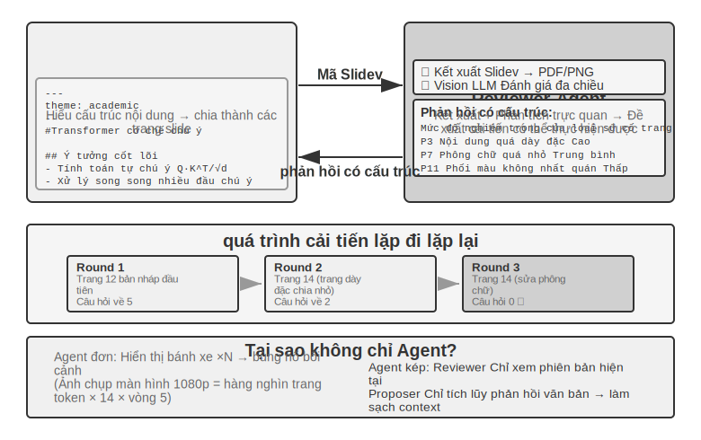


Người đề xuất-đánh giá là mô hình hợp tác ngang hàng cổ điển nhất. Chương 5 đã giới thiệu chi tiết các nguyên tắc thiết kế và ứng dụng thực tế của mô hình này trong ba thử nghiệm tạo PPT, chỉnh sửa video và trực quan hóa nhật ký: Người đề xuất Agent chịu trách nhiệm tạo mã, Người đánh giá Agent hiển thị kết quả thực thi và sử dụng Vision LLM để đánh giá chất lượng và đưa ra các đề xuất cải tiến về cấu trúc. Cả hai lặp đi lặp lại nhiều lần cho đến khi hiệu quả đạt tiêu chuẩn.

Mô hình này cũng áp dụng cho các tình huống như đánh giá bảo mật (Người đề xuất tạo kế hoạch hành động, Người đánh giá kiểm tra sự tuân thủ và rủi ro tiềm ẩn), đánh giá nội dung (Người đề xuất dự thảo phản hồi, Người đánh giá kiểm tra các quy tắc kinh doanh và thông số thuật ngữ), đánh giá mã (Người đề xuất viết mã, Người đánh giá kiểm tra bảo mật và các phương pháp hay nhất), v.v.

**Tại sao bạn không thể tự tạo Agent rồi tự mình xem xét?** Đây chính là điểm cụ thể của tiêu chí ở phần trước “Khi nào nhiều Agent thực sự tốt hơn Agent đơn lẻ” - nếu review không đưa ra thông tin mới thì chỉ là “làm người mẫu phải suy nghĩ lại mà thôi”. Nghiên cứu liên quan đưa ra câu trả lời rõ ràng cho điều này. Hoàng và cộng sự. được tìm thấy trong bài báo ICLR 2024 "Các mô hình ngôn ngữ lớn không thể suy luận Self-Correct" rằng khi GPT-4 được yêu cầu xem lại và sửa các câu trả lời của chính nó mà không có phản hồi từ bên ngoài, thì độ chính xác đã giảm - mô hình đã sửa câu trả lời đúng nhiều lần hơn là sửa câu trả lời sai.

Một bài đánh giá "Khi nào LLMs thực sự có thể sửa chữa sai lầm của chính họ?" (arXiv:2406.01297) được công bố trên tạp chí TACL vào năm 2024 đã xác nhận thêm kết luận này: Trừ khi được cung cấp phản hồi đáng tin cậy từ bên ngoài (chẳng hạn như kết quả thực hiện các trường hợp thử nghiệm, đầu ra xác minh của các công cụ bên ngoài), tính năng "tự sửa lỗi" hoàn toàn dựa vào bản thân mô hình sẽ khó hoạt động.

Bài báo CRITIC của ICLR 2024 cung cấp một thử nghiệm so sánh trực quan. CRITIC đã cải thiện đáng kể bằng cách cho phép mô hình sử dụng các công cụ bên ngoài (công cụ tìm kiếm, trình thông dịch Python) để xác minh câu trả lời của nó; nhưng khi những người thử nghiệm loại bỏ bước xác minh công cụ và chỉ giữ lại phần tự đánh giá của mô hình thì phần lớn cải tiến đã biến mất. Điều này cho thấy giá trị của việc xem xét không phải là "làm cho mô hình phải suy nghĩ lại", mà là giới thiệu những thông tin mới chưa có khi mô hình được tạo - kết quả kiểm tra, hiển thị ảnh chụp màn hình, lỗi biên dịch, kết quả tìm kiếm bên ngoài.

Đây là nguyên tắc thiết kế cốt lõi của mô hình người đề xuất-đánh giá. Trong thử nghiệm tạo PPT ở Chương 5, giá trị của Người đánh giá Agent không phải là "xem lại mã với cùng một mô hình", mà là hiển thị PPT và chụp ảnh màn hình - ảnh chụp màn hình này chứa thông tin trực quan mà Người đề xuất Agent hoàn toàn không thể lấy được khi tạo mã. Tương tự, trong các kịch bản tạo mã, kết quả đạt/không đạt được tạo ra khi thực hiện các trường hợp kiểm thử cũng là những tín hiệu mới không tồn tại khi mã được viết - giá trị độc lập của Người đánh giá đến từ khả năng truy cập các phản hồi bên ngoài này mà Người đề xuất không thể có được.

**Tiện ích mở rộng: Các chế độ cộng tác ngang hàng khác.**

**Tranh luận**: Nhiều Agent, mỗi Agent, mỗi người giữ các vị trí khác nhau, khám phá sâu không gian vấn đề thông qua đối thoại đối nghịch. Ví dụ: khi đánh giá một giải pháp kỹ thuật, Agent A đóng vai trò là “người hỗ trợ” và liệt kê những ưu điểm, cơ hội của giải pháp đó, trong khi Agent B đóng vai trò là “đối thủ” và chỉ ra những rủi ro, hạn chế. Mỗi vòng tranh luận đưa ra sự bác bỏ hoặc bổ sung cho lập luận của bên kia. Khi phân tích một Agent, mô hình thường thiên về một quan điểm nhất định và bỏ qua bằng chứng tiêu cực; phương thức tranh luận đảm bảo rằng cả ưu và nhược điểm đều được thể hiện đầy đủ thông qua đối đầu được thể chế hóa, giúp những người ra quyết định đưa ra những đánh giá cân bằng hơn.

Tuy nhiên, hiệu quả thực tế của mô hình tranh luận vẫn còn gây tranh cãi trong giới học thuật. Nghiên cứu của Tran và Kiela vào năm 2026 [^single-agent-2026] đã so sánh Agent đơn lẻ với năm kiến trúc Agent đa nhiệm (tuần tự, tranh luận, tích hợp, vai trò song song, song song nhiệm vụ con) trong các tác vụ suy luận nhiều bước và nhận thấy rằng khi ngân sách mã thông báo suy nghĩ được kiểm soát chặt chẽ giống nhau, thì hiệu suất của Agent đơn lẻ cũng giống như của nhiều Agent ngang bằng hoặc tốt hơn **(trừ khi việc sử dụng ngữ cảnh bị tê liệt ở một mức độ nào đó). Nhà nghiên cứu đã đưa ra lời giải thích dựa trên sự bất bình đẳng trong xử lý dữ liệu trong lý thuyết thông tin: nhiều Agent trong quá trình tranh luận có cùng một thông tin văn bản và mỗi lần truyền nối tiếp các kết luận trung gian giữa Agent chỉ có thể làm mất thông tin và không thể tạo ra thông tin ngoài luồng. Lợi ích của chế độ tranh luận trong một số bài viết học thuật có thể đến từ nhiều Agent tiêu tốn tổng số tính toán nhiều hơn. Cần phải vạch ra ranh giới của lập luận này: nó nhằm mục đích giải quyết tình trạng tắc nghẽn thông tin do "nhiều kết luận trung gian truyền nối tiếp Agent" và không phủ nhận một kiểu tiếp cận khác - lấy mẫu độc lập nhiều lần và tổng hợp lại cùng một vấn đề (chẳng hạn như self-consistency, bỏ phiếu đa số) hoặc sử dụng độ khó không đối xứng của việc tạo và xác minh (khó viết câu trả lời, dễ kiểm tra câu trả lời) để thực hiện phân chia xác minh thế hệ của lao động. Các kịch bản này giới thiệu việc lấy mẫu độc lập bổ sung hoặc khai thác cấu trúc bất đối xứng của chính nhiệm vụ đó và không nằm trong phạm vi của sự bất bình đẳng trong xử lý dữ liệu.

[^single-agent-2026]: Tran, D., Kiela, D. *Single-Agent LLMs Outperform Multi-Agent Systems on Multi-Hop Reasoning Under Equal Thinking Token Budgets.* arXiv:2604.02460, 2026.

**Động não**: Nhiều Agent nảy sinh ý tưởng một cách độc lập, sau đó chia sẻ và truyền cảm hứng cho nhau. Ví dụ: trong nhiệm vụ đổi mới sản phẩm, Agent 1 đã đề xuất "tăng cường chức năng chia sẻ trên mạng xã hội", Agent 2 được truyền cảm hứng để đề xuất "không chỉ chia sẻ lên mạng xã hội mà còn tạo áp phích chia sẻ được cá nhân hóa" và Agent 3 đã kết hợp hai mục tiêu đầu tiên và đề xuất "các mẫu áp phích do người dùng tùy chỉnh và hình thành một thị trường mẫu". Agent khác nhau có "sở thích suy nghĩ" khác nhau (được thực hiện thông qua các từ hoặc mô hình gợi ý khác nhau) và khám phá không gian giải pháp rộng hơn thông qua sự kích thích lẫn nhau để tìm ra những kết hợp sáng tạo khó nghĩ ra chỉ với một Agent duy nhất.

**Thảo luận nhóm**: Nhiều Agent, mỗi nhóm thể hiện quan điểm của một lĩnh vực chuyên môn và cùng thảo luận về các vấn đề liên ngành. Ví dụ: khi đánh giá tính khả thi của một sản phẩm mới, kỹ sư Agent phân tích khó khăn khi triển khai từ góc độ kỹ thuật, sản phẩm Agent đánh giá mức độ hấp dẫn của thị trường từ góc độ trải nghiệm người dùng và hoạt động Agent phân tích tính khả thi thương mại từ góc độ chi phí và tài nguyên. Mối quan hệ giữa các Agent này không phải là đối kháng mà bổ sung cho nhau, cùng nhau làm việc để đưa ra bức tranh toàn cảnh về vấn đề và xác định các hạn chế và cơ hội trên nhiều miền.

### Mô hình quản lý: phối hợp tập trung

Khi một nhiệm vụ bao gồm nhiều hơn năm nhiệm vụ phụ, yêu cầu lập kế hoạch động hoặc có sự phụ thuộc phức tạp giữa các nhiệm vụ phụ, thì sự cộng tác ngang hàng là không đủ và cần phải giới thiệu mô hình người quản lý. Trách nhiệm của Người quản lý Agent giống như người quản lý dự án: trước tiên hãy hiểu nhiệm vụ tổng thể, sau đó chia nhỏ thành các nhiệm vụ phụ có thể giao, chọn Agent thích hợp để thực thi, theo dõi tiến độ và xử lý các trường hợp ngoại lệ (thử lại, thay đổi Agent, điều chỉnh kế hoạch) và cuối cùng tích hợp đầu ra của mỗi Agent vào kết quả cuối cùng.

Từ góc độ thiết kế hệ thống, chế độ người quản lý mô hình hóa từng Agent chuyên dụng như một công cụ mà Người quản lý có thể gọi. Bộ công cụ của trình quản lý không chỉ bao gồm các công cụ bên ngoài truyền thống (chẳng hạn như tìm kiếm, thao tác với tệp) mà còn bao gồm các giao diện gọi Agent khác. Trình quản lý khởi động Agent tương ứng thông qua cơ chế gọi công cụ, chuyển các tham số nhiệm vụ và ngữ cảnh cần thiết và chờ hoàn thành để nhận kết quả trả về. Từ quan điểm của Người quản lý, không có sự khác biệt cơ bản giữa việc gọi Agent và gọi một công cụ thông thường - cả hai đều đưa ra yêu cầu và nhận phản hồi. Sự trừu tượng hóa thống nhất này mang lại cho mô hình trình quản lý khả năng mở rộng tốt - đối với các khả năng mới, bạn chỉ cần phát triển Agent tương ứng và đăng ký nó làm công cụ và logic cốt lõi của Trình quản lý không cần phải sửa đổi. Đồng thời, nó hỗ trợ tính không đồng nhất một cách tự nhiên - Agent khác nhau có thể sử dụng các mô hình khác nhau, từ nhắc nhở, bộ công cụ và thậm chí chạy trên các môi trường phần cứng khác nhau.

Tính trừu tượng của "các công cụ tương hỗ Agent" đã được thiết lập trong phần "Công cụ cộng tác" của Chương 4: thiết kế giao diện của spawn_subagent / send_message / cancel_subagent và bốn chiến lược chuẩn bị ngữ cảnh phụ Agent (phân phối tối thiểu, lọc thủ công, điều chỉnh tự động, ngữ cảnh tạo LLM), được áp dụng trực tiếp cho cặp Trình quản lý tại đây. Cuộc gọi của Agent. Chương 4 giải quyết những gì được truyền theo hướng “Manager → Sub Agent”; vấn đề đối xứng là những gì được trả về theo hướng "Sub Agent → Trình quản lý". Câu trả lời là **Tóm tắt có cấu trúc thay vì bản nhạc đầy đủ**: Sub-Agent phải trả về kết luận nhiệm vụ, các phát hiện chính, đường dẫn tệp sản phẩm và các vấn đề gặp phải, đồng thời để lại bản nhạc thực thi hoàn chỉnh trong nhật ký riêng. Chỉ bằng cách này, ngữ cảnh của Người quản lý mới có thể phát triển chậm và tuyến tính theo số lượng nhiệm vụ phụ, thay vì bùng nổ. Đây cũng là cơ sở phương pháp luận để Người quản lý “chỉ duy trì chỉ mục tệp và không lưu nội dung dịch” trong thử nghiệm 10-3 sau đây. Sự phân công lao động giữa hai chương là: Chương 4 nói về cơ chế (triển khai giao diện công cụ và chuyển ngữ cảnh), và chương này nói về kiến trúc (cấu trúc liên kết và cách phân chia trách nhiệm).

Nhưng mô hình người quản lý cũng có những thách thức cố hữu. Người quản lý trở thành nút thắt cổ chai duy nhất của hệ thống - nó phải hiểu bản chất của tất cả các nhiệm vụ phụ, chọn Agent chính xác và phân phối ngữ cảnh chính xác và bất kỳ sai lệch nào trong việc ra quyết định sẽ ảnh hưởng đến quy trình chung. Ngoài ra, Người quản lý cần duy trì ngữ cảnh chung của toàn bộ nhiệm vụ. Khi nhiệm vụ ngày càng sâu hơn và các lệnh gọi Agent tăng lên, ngữ cảnh có thể mở rộng nhanh chóng. Do đó, cần đặc biệt chú ý đến chất lượng lời nói nhanh chóng của Người quản lý, chiến lược quản lý ngữ cảnh và mức độ chi tiết phân chia nhiệm vụ hợp lý.

Bài báo Plan-and-Act năm 2025 [^plan-and-act-2025] đưa ra phân tích thực nghiệm về điều này: Trong kiến trúc Agent kép Planner-Executor, trình lập kế hoạch yếu là nút cổ chai nghiêm trọng nhất của toàn bộ hệ thống. Khi chất lượng lập kế hoạch của Người lập kế hoạch đủ cao thì người thực hiện có thể đạt được kết quả tốt ngay cả khi Người thực hiện tương đối đơn giản; ngược lại, nếu việc phân rã nhiệm vụ của Planner không chính xác thì mọi công việc của Executor sau đó sẽ dựa trên tiền đề sai. Nghiên cứu này đạt được tỷ lệ thành công là 54% trên điểm chuẩn WebArena-Lite. Đóng góp cốt lõi là cải thiện khả năng lập kế hoạch của Planner, thay vì khả năng thực thi của Executor. Ý nghĩa của phát hiện này là các mô hình mạnh nhất và lời nhắc được thiết kế tốt nhất nên được giao cho Người quản lý (Người lập kế hoạch), thay vì phân bổ tài nguyên như nhau cho tất cả Agent.

Điều này không mâu thuẫn với lập luận trong Chương 4. Khi thảo luận về mô hình đề xuất và mô hình đánh giá, Chương 4 chỉ ra rằng khả năng của cả hai phải tương tự nhau - nhưng đó là **kịch bản đánh giá**: người đánh giá phải theo kịp lý luận của người được đánh giá trước khi họ có thể phát hiện ra sai sót. Nếu khoảng cách về năng lực quá lớn thì việc xem xét sẽ không thể thực hiện được. Mô hình người quản lý bàn thêm một điều nữa - **Sự phân công lao động giữa lập kế hoạch và thực hiện**: Một khi người lập kế hoạch chia nhỏ các nhiệm vụ sai thì người thực thi dù mạnh đến đâu cũng không có cách nào khắc phục nên mô hình mạnh nhất và những lời nhắc nhở cẩn thận nhất nên được ưu tiên cho người lập kế hoạch. Về việc có cần sự cân bằng về năng lực giữa những người thực thi hay không, điều đó phụ thuộc vào mức độ kết hợp của các nhiệm vụ phụ - khi sản phẩm của nhiều người thực thi cuối cùng được tập hợp lại thành một tổng thể, mắt xích yếu nhất thường sẽ kéo chất lượng tổng thể xuống.

[^plan-and-act-2025]: Erdogan, L. E., et al. *Plan-and-Act: Improving Planning of Agents for Long-Horizon Tasks.* arXiv:2503.09572, 2025.

**Hình thức phối hợp tuần tự.**


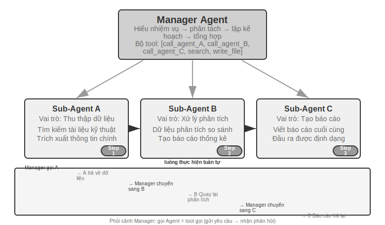


Người quản lý gọi Agent đặc biệt theo trình tự. Sau khi hoàn thành mỗi Agent, kết quả sẽ được trả về và Người quản lý quyết định bước tiếp theo. Luồng điều khiển tuyến tính, đơn giản và rõ ràng, phù hợp với các tình huống có sự phụ thuộc tuần tự rõ ràng giữa các nhiệm vụ phụ.

> **Thí nghiệm 10-3 ★★: Dịch sách Agent**
>
> Dịch sách là một nhiệm vụ phức tạp điển hình đòi hỏi sự cộng tác của nhiều Agent. Dịch sách kỹ thuật không chỉ là chuyển văn bản từ ngôn ngữ này sang ngôn ngữ khác. Nó cũng đòi hỏi phải đảm bảo rằng thuật ngữ chuyên môn nhất quán trong suốt cuốn sách, ngữ cảnh chính xác và cách đọc tổng thể trôi chảy. Ví dụ: khi dịch một cuốn sách tiếng Anh liên quan đến các mô hình ngôn ngữ lớn, một số lượng lớn các thuật ngữ sẽ xuất hiện lặp đi lặp lại và có thể có nhiều quy ước, phải thống nhất trong toàn bộ cuốn sách - trong chương đầu tiên, tác nhân được dịch là "cơ thể thông minh", và sau này không thể đổi thành "tác nhân".
>
> Nếu bạn làm điều đó với một Agent duy nhất, bạn sẽ gặp phải các vấn đề ngữ cảnh nghiêm trọng. Khi Agent tiến hành qua nội dung theo từng chương, ngữ cảnh sẽ tích lũy: bảng chú giải thuật ngữ xuyên suốt cuốn sách, các chương đã dịch, đoạn hiện tại, quá trình tư duy dịch thuật, kết quả của các lệnh gọi công cụ. Một cuốn sách kỹ thuật vài trăm trang cộng với các bản dịch trung gian có thể dễ dàng vượt quá cửa sổ ngữ cảnh. Điều nghiêm trọng hơn là Agent dễ bị “lạc lối” trong ngữ cảnh quá dài - quên thỏa thuận thuật ngữ trước đó và sử dụng bản dịch không phù hợp với Chương 2 trong Chương 8; kiểm tra nhiều lần trong giai đoạn rà soát nguồn phế thải; thậm chí gây ảo giác do mất tập trung và “nhớ” những quy tắc thuật ngữ không thực sự tồn tại.
>
> Mẫu người quản lý giải quyết những vấn đề này thông qua việc phân tách nhiệm vụ và phân tách trách nhiệm:
>
> - **Bảng thuật ngữ Agent**(bảng so sánh thuật ngữ Agent): Nhận toàn bộ nội dung sách, xác định các thuật ngữ chuyên môn định kỳ, tìm kiếm từ điển chuyên nghiệp và thông số dịch thuật, đồng thời tạo bảng so sánh thuật ngữ có cấu trúc (định dạng JSON/CSV, bao gồm các thuật ngữ tiếng Anh, bản dịch tiếng Trung, các phần của lời nói, ngữ cảnh sử dụng). Sau khi hoàn thành, hãy ghi vào hệ thống tệp dùng chung, Agent có thể bị hủy để giải phóng tài nguyên.
> - **Dịch Agent**(Dịch Chương Agent): Nhận chương hiện tại, bảng so sánh thuật ngữ và hướng dẫn dịch (mức độ người đọc mục tiêu, phong cách ngôn ngữ) và dịch sang tiếng Trung lưu loát. Khi gặp các thuật ngữ trong bảng so sánh phải sử dụng nghiêm ngặt cách dịch theo quy định. Khi gặp thuật ngữ mới, bản dịch sẽ được suy luận và đánh dấu là đang chờ xem xét. Mỗi phiên bản hoạt động trong một ngữ cảnh độc lập và không can thiệp lẫn nhau. Bản dịch được ghi vào hệ thống tệp (ví dụ: `chapter1_zh.md`). Người quản lý có thể khởi chạy nhiều phiên bản song song hoặc tuần tự
> - **Đọc hiệu đính Agent**(Đánh giá toàn văn Agent): Nhận tất cả các bản dịch và bảng chú giải, thực hiện kiểm tra tính nhất quán - xác minh xem bản dịch các thuật ngữ có thống nhất từng cái một hay không, xác định những điểm không nhất quán và kiểm tra tính trôi chảy và dễ đọc tổng thể. Tạo báo cáo đánh giá và ghi vào hệ thống tập tin
> - **Trình quản lý Agent**: Ngữ cảnh chủ yếu lưu mô tả nhiệm vụ, kế hoạch thực hiện, bản ghi cuộc gọi và trạng thái tiến độ của từng Agent. Bản dịch đầy đủ không được lưu (chúng được lưu trong hệ thống tệp), chỉ duy trì chỉ mục tệp. Dựa trên báo cáo rà soát, Người quản lý có thể gửi chương cụ thể về Dịch Agent để sửa đổi
>
> Trong kiến trúc này, ngữ cảnh của Trình quản lý Agent luôn được giữ trong phạm vi có thể quản lý được: nó chỉ cần biết mô tả tổng thể và mục tiêu của nhiệm vụ, kế hoạch thực hiện của từng giai đoạn, bản ghi cuộc gọi và kết quả trả về của từng Agent cũng như trạng thái tiến độ hiện tại mà không cần phải giữ nội dung dịch hoàn chỉnh của từng chương.
>
> Ưu điểm chính là **tách biệt ngữ cảnh**: Bảng thuật ngữ Agent chỉ xem xét những gì cần thiết để trích xuất thuật ngữ, Bản dịch Agent chỉ xem xét chương hiện tại và bảng chú giải thuật ngữ, và Hiệu đính Agent yêu cầu quyền truy cập vào toàn văn nhưng chỉ tập trung vào kiểm tra tính nhất quán. Mỗi Agent hoạt động trong ngữ cảnh tập trung, hợp lý, không chỉ hiệu quả hơn mà còn ít có khả năng mắc lỗi hơn—Agent sẽ không bị phân tâm do quá tải thông tin.
>
> **Yêu cầu thử nghiệm**:
> 1. Chọn sách kỹ thuật có hình ảnh, văn bản và mã làm đối tượng dịch
> 2. Triển khai bốn loại Trình quản lý, Bảng thuật ngữ, Dịch thuật và Hiệu đính Agent
> 3. Ghi lại mức tiêu thụ ngữ cảnh của từng Agent và xác minh tính hiệu quả của chế độ quản lý để kiểm soát việc mở rộng ngữ cảnh.
> 4. So sánh sự khác biệt giữa chế độ Agent và chế độ quản lý về chất lượng dịch, hiệu quả thực thi và mức tiêu thụ tài nguyên
>
>
> 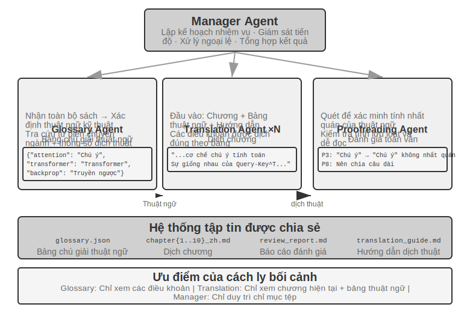
>
>
**Hình thức phối hợp song song.**


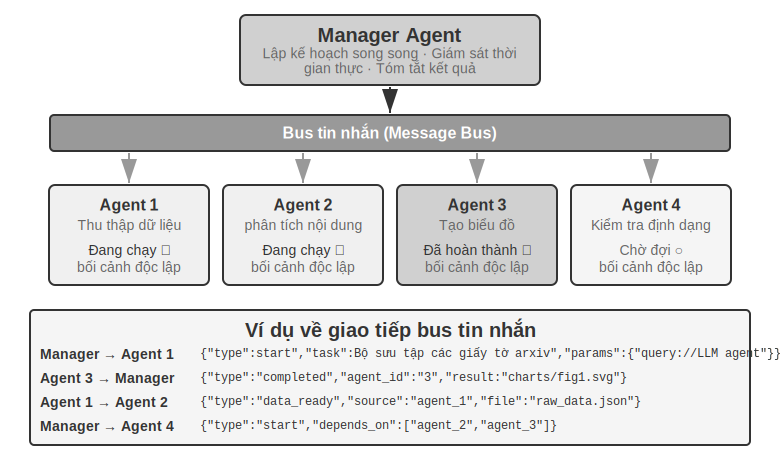


Chế độ tuần tự trở nên kém hiệu quả khi nhiều tác vụ con có thể được thực thi song song. Phối hợp song song cho phép nhiều Agent hoạt động đồng thời, cải thiện đáng kể thông lượng. Trình quản lý Agent không chỉ lên kế hoạch cho các nhiệm vụ song song mà còn giám sát tất cả các Agent đang chạy trong thời gian thực, xử lý việc phối hợp liên lạc và đưa ra quyết định chung khi Agent thành công hay thất bại. Điều này thường yêu cầu Message Bus làm cơ sở hạ tầng - nó có thể được hiểu là một "bảng thông báo công cộng" mà trên đó Agent có thể đăng tin nhắn (xuất bản) hoặc tập trung vào các loại tin nhắn mà nó quan tâm (đăng ký), đạt được khả năng liên lạc không đồng bộ và không bị chặn. Có hai loại giải pháp triển khai phổ biến với mức độ phức tạp ngày càng tăng: **Redis Pub/Sub** có dung lượng nhẹ, gửi và nhận tin nhắn, đơn giản và dễ sử dụng. Nhược điểm là không liên tục - người nhận lúc đó không trực tuyến và tin nhắn bị mất; hàng đợi tin nhắn như **RabbitMQ** lưu tin nhắn trên đĩa và sẽ không bị mất ngay cả khi người nhận tạm thời ngoại tuyến. Định dạng tin nhắn thường chứa ID người gửi, Agent đích (hoặc phát tới mọi người), loại tin nhắn và nội dung dữ liệu ở định dạng JSON.

> **Thử nghiệm 10-4 ★★★: Sử dụng máy tính trong khi gọi điện thoại Agent**
>
> **Điều kiện tiên quyết**: Thử nghiệm này sử dụng toàn diện công nghệ Computer Use và giọng nói Agent trong Chương 9. Bạn nên hoàn thành các thử nghiệm liên quan trong Chương 9 trước.
>
> Trên thực tế, nhiều tình huống yêu cầu nhiều khả năng hoạt động cùng lúc, thay vì xếp hàng từng người một: trợ lý con người có thể giao tiếp với khách hàng qua điện thoại trong khi kiểm tra tài liệu và ghi chú những điểm chính trên máy tính. Kiểu "đa nhiệm" này cực kỳ thách thức đối với một Agent - nếu Agent xử lý cả hội thoại thoại thời gian thực và vận hành giao diện máy tính, chắc chắn nó sẽ chuyển đổi liên tục giữa hai tác vụ, khiến cuộc hội thoại bị tạm dừng hoặc hoạt động bị gián đoạn. Ý tưởng cốt lõi của việc thực thi song song nhiều Agent là: để mỗi Agent khác nhau tập trung vào một nhiệm vụ có yêu cầu thời gian thực cao, phối hợp thông qua truyền tin nhắn không đồng bộ và đạt được xử lý song song thực sự **. Hai Agent cũng được tối ưu hóa đặc biệt cho các chế độ tương tác khác nhau - điện thoại Agent yêu cầu nhận dạng và tổng hợp giọng nói có độ trễ thấp, còn máy tính Agent yêu cầu khả năng hiểu thị giác và lập kế hoạch vận hành mạnh mẽ.
>
> **Kịch bản**: AI Agent giúp người dùng điền vào biểu mẫu đặt vé máy bay phức tạp. Nó yêu cầu người dùng hỏi và xác nhận thông tin cá nhân (tên, số CMND, ưu tiên chuyến bay, v.v.) qua điện thoại trong khi vận hành trang web - cả hai đầu đều yêu cầu hiệu suất thời gian thực cao. Đây là một ví dụ điển hình về Agent đơn lẻ tập trung vào một thứ nhưng không tập trung vào thứ kia và Agent kép, mỗi chiếc thực hiện nhiệm vụ riêng của mình.
>
> **Kiến trúc Agent kép**:
>
> **Điện thoại Agent**: Cuộc gọi thoại Agent dựa trên ASR + LLM + TTS. Nó có nhiệm vụ hiểu câu trả lời bằng ngôn ngữ tự nhiên của người dùng, trích xuất thông tin chính và gửi đến Máy tính Agent thông qua khung tin nhắn; đồng thời, nó nhận các tin nhắn từ Máy tính Agent (chẳng hạn như “cần có số ID người dùng” và “lỗi tải trang”) và tạo ra các từ thích hợp để hỏi người dùng.
>
> **Máy tính Agent**: Dựa trên khung hoạt động của trình duyệt (chẳng hạn như Anthropic Computer Use, browser-use). Nó có nhiệm vụ tìm hiểu cấu trúc của các trang web, xác định các trường biểu mẫu, điền thông tin dựa trên thông tin nhận được và yêu cầu Điện thoại Agent trợ giúp khi gặp sự cố.
>
> **Cơ chế giao tiếp** có hai lựa chọn:
> - **Giải pháp đơn giản**: Công cụ gọi giao tiếp điểm-điểm, chẳng hạn như `send_message_to_computer_agent(message)` / `send_message_to_phone_agent(message)`
> - **Giải pháp cải tiến**: Message Bus + Manager Agent, định dạng tin nhắn thống nhất, bao gồm người gửi, người nhận, loại và nội dung
>
> **Cơ chế cộng tác song song**(được chia sẻ bởi hai thử nghiệm "điện thoại + máy tính" trong chương này): Hai Agent chạy trong luồng hoặc tiến trình độc lập, mỗi tiến trình duy trì một vòng ReAct độc lập. Vòng lặp cho điện thoại Agent: nhận giọng nói -> ASR phiên âm -> LLM hiểu và tạo phản hồi -> tổng hợp TTS -> phát -> kiểm tra tin nhắn cho Máy tính Agent; loop cho Máy tính Agent: ảnh chụp màn hình -> Vision LLM Hiểu trang -> Lập kế hoạch hoạt động -> Thực thi (nhỏ, nhập, v.v.) -> Kiểm tra tin nhắn của Điện thoại Agent. Điều quan trọng là cả hai phải thực sự song song - khi Máy tính Agent đang tìm kiếm các phần tử và nhập văn bản, Điện thoại Agent Số ID của bạn là gì?"). Hiện trong ngữ cảnh Điện thoại Agent và `[FROM_PHONE_AGENT] Người dùng cho biết tên là 'Nguyễn Văn A' và số ID là 123456` sẽ hiển thị trong ngữ cảnh Máy tính Agent.
>
> **Yêu cầu thử nghiệm**:
> 1. Triển khai kiến trúc Agent kép, dựa trên ASR/TTS API và khung vận hành trình duyệt
> 2. Triển khai cơ chế liên lạc hai chiều hiệu quả
> 3. Đảm bảo công việc thực sự song song, thu thập thông tin và điền biểu mẫu được thực hiện đồng thời
> 4. Xử lý các tình huống bất thường
>
> **Thí nghiệm 10-5 ★★★: Tự lập trình gọi điện và sử dụng máy tính Agent**
>
> 10-4 thử nghiệm Kiến trúc cộng tác của Agent kép được thiết kế sẵn. Thử nghiệm này tiến thêm một bước nữa và khám phá khả năng điều phối tự động của **Agent** - Agent tự xác định thời điểm cần bắt đầu một hoạt động cộng tác mới Agent, thay vì con người lên kế hoạch trước cho quá trình cộng tác.
>
> **Tình huống**: Người dùng yêu cầu "Giúp tôi hoàn tất đăng ký trên trang web này" và cung cấp URL nhưng không giải thích những thông tin cần điền. Người quản lý Agent sử dụng công cụ Computer Use để truy cập trang web và tải trang đăng ký.
>
> Trong quá trình hoạt động, Computer Use Agent nhận thấy biểu mẫu đăng ký rất phức tạp và chứa một số lượng lớn các trường bắt buộc: thông tin cá nhân cơ bản (tên, giới tính, ngày sinh), thông tin liên hệ (số điện thoại di động, email, địa chỉ gửi thư), thông tin xác minh danh tính (loại chứng chỉ, số ID), cài đặt tùy chọn, v.v. Agent đã kiểm tra ngữ cảnh và phát hiện ra rằng anh ta không có thông tin này - người dùng chỉ nói "đăng ký me" mà không cung cấp bất kỳ dữ liệu cụ thể nào.
>
> Khi gặp tình trạng này, Agent truyền thống sẽ gửi tin nhắn để người dùng nhập vào - vừa kém hiệu quả (cần nhập một lượng lớn thông tin theo cách thủ công) vừa dễ bị lỗi (vấn đề về định dạng, thiếu thông tin). Agent thông minh hơn nên nhận ra: **Đây là kịch bản phù hợp để thu thập thông tin thông qua tương tác qua điện thoại** - trò chuyện qua điện thoại hiệu quả hơn nhiều so với trò chuyện bằng văn bản, có thể yêu cầu xác nhận từng cái một và cũng có thể xử lý những biểu hiện mơ hồ của người dùng.
>
> Điểm cải tiến quan trọng là quyết định này không được lập trình trước mà được thực hiện một cách tự động bởi **Agent**. Mẹo dành cho Computer Use Agent có nội dung: "Hãy cân nhắc gọi Điện thoại Agent làm người hỗ trợ khi bạn cần thu thập một lượng lớn thông tin có cấu trúc từ người dùng có thể được xử lý thông qua một cuộc trò chuyện." `initiate_phone_call_agent(purpose, required_info)` được bao gồm trong bộ công cụ.
>
> Sau cuộc gọi, hệ thống sẽ tạo Điện thoại Agent và cung cấp cho nó ngữ cảnh nhiệm vụ rõ ràng: nó được khởi chạy để hỗ trợ điền biểu mẫu, những thông tin cần thu thập và yêu cầu định dạng cho từng trường.
>
> Hải Agent ngay lập tức chuyển sang chế độ cộng tác thời gian thực hiện, sử dụng bài hát cơ chế không đồng bộ của thử nghiệm 10-4. Điện thoại Agent gọi đến người dùng và hỏi từng người một: "Xin chào, tôi đang giúp bạn điền vào mẫu đăng ký. Trước hết, tên bạn là gì?" Agent không mong đợi hoạt động hoàn tất của máy tính mà tiếp tục hỏi câu tiếp theo. Sau khi tất cả thông tin được thu thập, Điện thoại Agent sẽ gửi `{"type": "task_completed"}` và Máy tính Agent gửi biểu mẫu.
>
> **Yêu cầu thử nghiệm**:
> 1. Triển khai Computer Use Agent có thể quyết định khởi động Điện thoại Agent một cách độc lập
> 2. Giao tiếp hai chiều theo thời gian thực và công việc song song thực sự
> 3. Xử lý các trường hợp ngoại lệ (phản hồi và hỏi lại nếu định dạng thông tin sai)
> 4. Ghi lại thời gian thông báo của quá trình cộng tác và các điểm quyết định chính của Agent
>
>
> 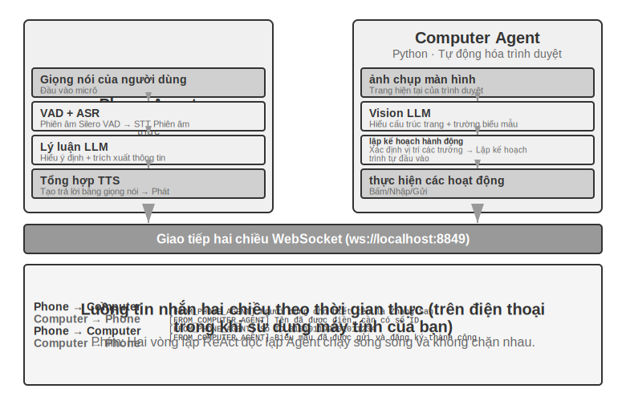
>
>
> **Thử nghiệm 10-6 ★★★: Agent thu thập thông tin từ nhiều trang web cùng một lúc**
>
> **Điều kiện tiên quyết**: Trước tiên, bạn nên hiểu Chương 4 Cơ chế ngắt và điều khiển sự kiện.
>
> Thử nghiệm này khám phá ứng dụng thực thi song song nhiều Agent trong các tình huống thu thập thông tin. Không giống như Thử nghiệm 10-4 và Thử nghiệm 10-5, vốn tập trung vào sự cộng tác của hai Agent không đồng nhất, thử nghiệm này tập trung vào tìm kiếm song song của nhiều Agent đồng nhất và cách hoàn thành nhiệm vụ hiệu quả cũng như tối ưu hóa tài nguyên thông qua điều phối trung tâm.
>
> **Câu hỏi**: Với nhiều trang web đại học của một trường đại học, bạn phải tìm kiếm một giáo viên được chỉ định (chẳng hạn như "Zhang Wei") trong trang thư mục giáo viên của mỗi trường đại học, sau khi tìm thấy, hãy trả về trường đại học, chức vụ, hướng nghiên cứu và các thông tin khác của người đó.
>
> **Thử thách cốt lõi**:
>
> **1. Khởi động song song**: Trình quản lý Agent tự động tạo 10 phiên bản Computer Use Agent dựa trên yêu cầu nhiệm vụ, mỗi phiên bản tương ứng với một trang web của trường đại học. Mỗi phiên bản phải là một quy trình hoặc luồng độc lập, có phiên trình duyệt độc lập và có thể thực thi đồng thời mà không chặn lẫn nhau. Đã vượt qua khi khởi động: URL trang web mục tiêu, tên giáo viên cần tìm kiếm, mã định danh nhiệm vụ (để định tuyến tin nhắn).
>
> **2. Giám sát thời gian thực**: Mỗi Agent thường xuyên gửi cập nhật trạng thái trong quá trình thực thi ("Đang tải trang web" "Đang phân tích thư mục giáo viên" "Không tìm thấy mục tiêu, nhiệm vụ đã hoàn thành" "Đã tìm thấy kết quả phù hợp, chi tiết như sau"). Trình quản lý Agent nhận các bản cập nhật này thông qua bus tin nhắn, duy trì bảng trạng thái tác vụ và biết trong thời gian thực Agent nào vẫn đang chạy, Agent nào vẫn đang chạy, Agent nào đã hoàn thành và đã gặp lỗi.
>
> **3. Chấm dứt phân tầng**: Giả sử rằng Agent, người chịu trách nhiệm về Trường Khoa học Máy tính, tìm thấy giáo viên mục tiêu, nó sẽ gửi `{"type": "target_found", "agent_id": "agent_3", "data": {...}}`. Sau khi nhận được, Người quản lý Agent ngay lập tức gửi `{"type": "terminate", "reason": "target_found_by_agent_3"}` tới tất cả các Agent khác vẫn đang chạy và mỗi Agent nhận được thông báo chấm dứt sẽ dừng lại và gửi xác nhận. Trình quản lý Agent chờ tất cả xác nhận (hoặc hết thời gian chờ) trước khi tổng hợp kết quả. Yêu cầu: Agent có thể phản hồi tín hiệu kết thúc bất cứ lúc nào (tương tự như cơ chế ngắt ở Chương 4). Việc chấm dứt phải nhẹ nhàng - không còn quy trình treo hoặc tài nguyên không được tiết lộ; đồng thời phải xử lý các điều kiện đua.
>
> **Bổ sung khái niệm: Điều kiện chủng tộc là gì?** Giả sử rằng Agent A và Agent B đều tìm thấy giáo viên mục tiêu trong gần như cùng một phần nghìn giây, họ sẽ báo cáo "Tôi đã tìm thấy nó!" tới Trình quản lý Agent cùng một lúc. Nếu Trình quản lý Agent xử lý việc này không chính xác—ví dụ: nó bắt đầu tổng hợp kết quả sau khi nhận được báo cáo từ A, nhưng sau đó nhận được báo cáo từ B để kích hoạt hoạt động tổng hợp thứ hai—có thể dẫn đến kết quả trùng lặp hoặc trạng thái xung đột. Giải pháp thường là sử dụng cơ chế "khóa": trạng thái bị khóa ngay khi báo cáo đầu tiên đến và các báo cáo tiếp theo được xác định là trùng lặp và bị bỏ qua.
>
> **4. Xử lý lỗi**: Có thể gặp nhiều trường hợp ngoại lệ khác nhau trong hoạt động thực tế: không thể truy cập một trang web đại học nhất định (lỗi mạng, thời gian ngừng hoạt động của máy chủ), cấu trúc của một trang web nhất định không khớp với mong đợi, khiến Agent không thể được phân tích cú pháp chính xác hoặc tất cả các tìm kiếm Agent đều không tìm thấy mục tiêu. Policy xử lý của Trình quản lý Agent: Đặt thời gian chờ (chẳng hạn như 2 phút) cho mỗi Agent và thời gian chờ sẽ được coi là lỗi; việc cách ly lỗi sẽ không ảnh hưởng đến việc tiếp tục thực thi Agent khác; tóm tắt sau khi hoàn thành - thông tin sẽ được trả về miễn là Agent thành công và nếu tất cả lỗi xảy ra, "Không tìm thấy giáo viên mục tiêu" và số liệu thống kê về từng lý do lỗi sẽ được báo cáo cho người dùng.
>
> **Yêu cầu thử nghiệm**:
> 1. Trình quản lý triển khai Agent có thể tự động khởi động nhiều Agent song song
> 2. Triển khai Computer Use Agent dựa trên các dự án nguồn mở như browser-use
> 3. Triển khai bus thông báo để hỗ trợ liên lạc hai chiều giữa Trình quản lý Agent và nhiều Agent phụ
> 4. Thực hiện cơ chế chấm dứt tầng sau khi thành công để đảm bảo rằng tất cả Agent khác dừng nhanh sau khi tìm thấy mục tiêu
> 5. Xử lý các tình huống bất thường khác nhau (lỗi truy cập trang web, lỗi phân tích cú pháp, không tìm thấy tất cả)
> 6. Ghi lại và so sánh sự khác biệt về thời gian giữa thực thi song song và thực thi nối tiếp, đồng thời xác minh sự cải thiện hiệu suất do song song hóa mang lại
>
>
> 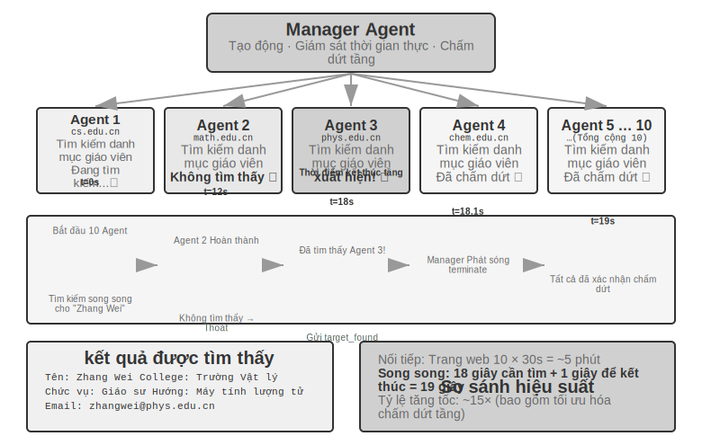
>
>
### Mô hình phi tập trung: chuyển giao ngang hàng


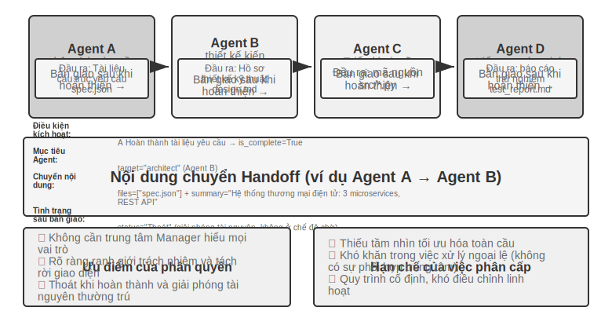


Mặc dù chế độ người quản lý cung cấp cấu trúc kiểm soát rõ ràng và tầm nhìn toàn cầu, nhưng đặc điểm tập trung cũng mang đến những hạn chế cố hữu: người quản lý trở thành điểm nghẽn và điểm thất bại duy nhất của hệ thống, mọi quyết định phối hợp đều dựa vào phán đoán của người quản lý và người quản lý phải có đủ hiểu biết về tất cả các nhiệm vụ phụ. Khi độ phức tạp của nhiệm vụ tăng lên và số lượng Agent tăng lên, khả năng mở rộng sẽ bị thách thức.

Mô hình phi tập trung cung cấp một ý tưởng kiến trúc khác: **Không có bộ điều khiển trung tâm duy nhất và Agent cộng tác theo cách ngang hàng**. Mỗi Agent quyết định độc lập dựa trên đánh giá chuyên môn của chính mình khi bắt đầu liên lạc với Agent khác - có thể là bàn giao nhiệm vụ ("Phần của tôi đã xong, để lại cho bạn") hoặc có thể là yêu cầu phản hồi ("Giải pháp này có khả thi về mặt kỹ thuật không?") hoặc báo cáo vấn đề ("Các yêu cầu bạn đưa ra có mâu thuẫn nhau, chúng ta cần thảo luận lại").

Ba trường hợp sau đây được cố tình sắp xếp thành một đầu mối lũy tiến “từ sai đến đúng”: Luồng điều khiển MetaGPT thực chất là một đường ống cố định (giả phi tập trung, chỉ tách rời trong cơ chế giao tiếp), trò chuyện nhóm AutoGen là một dạng kết hợp giữa hồ sơ hội thoại chia sẻ và lập lịch tập trung. Phải đến OpenAI Swarm, sự phân cấp ngang hàng thực sự mới đạt được trong luồng điều khiển.

**Điều gì được chuyển giao trong quá trình chuyển giao mà không có ngữ cảnh chung?** Chế độ chuỗi Handoff của Hình 10-10 trái ngược trực tiếp với `transfer_to_agent` của 10-2 thử nghiệm: chế độ sau được chuyển giao trong ngữ cảnh chung và vai trò mới tự động kế thừa toàn bộ lịch sử mà không cần bất kỳ thiết kế nào; cái trước được bàn giao mà không có ngữ cảnh chung và bên bàn giao phải quyết định rõ ràng những gì sẽ chuyển giao. Trong thực tế, một "gói chuyển giao" hiệu quả thường chứa ba phần: **mô tả nhiệm vụ**(người nhận sẽ làm gì, tiêu chí chấp nhận là gì), **các sự kiện và ràng buộc đã được xác nhận**(tùy chọn của người dùng, quy tắc kinh doanh, các quyết định được hoàn thiện trong giai đoạn trước thủ tục) và **tham chiếu đến các sản phẩm có cấu trúc**(đường dẫn tệp chứ không phải nội dung tệp, người nhận sẽ đọc nó theo yêu cầu). Những gì được cố tình không truyền đi là trajectory đầy đủ - quá trình thử và sai, suy nghĩ trung gian và những nỗ lực thất bại của bên bàn giao, phần lớn là tiếng ồn cho bên nhận. Đây cũng là điểm khác biệt cơ bản giữa hai loại chuyển giao: chuyển giao chia sẻ ngữ cảnh sẽ giữ lại toàn bộ lịch sử, không mất thông tin nhưng ngữ cảnh tiếp tục mở rộng; quá trình chuyển giao không chia sẻ ngữ cảnh mang lại gói chuyển giao tinh tế, không bị mất thông tin nhưng mỗi Agent hoạt động trong một ngữ cảnh rõ ràng và tập trung. Mỗi Agent không cần hiểu "quy trình suy nghĩ" của Agent khác mà chỉ cần hiểu định dạng và ngữ nghĩa của gói chuyển giao và đầu ra - sự hợp tác dựa trên giao diện này dựa trên các nguyên tắc thiết kế hợp đồng trong công nghệ phần mềm.

**MetaGPT: Mô phỏng công ty phần mềm điều khiển SOP (trường hợp chuyển đổi từ dây chuyền lắp ráp sang giao tiếp tách rời).**


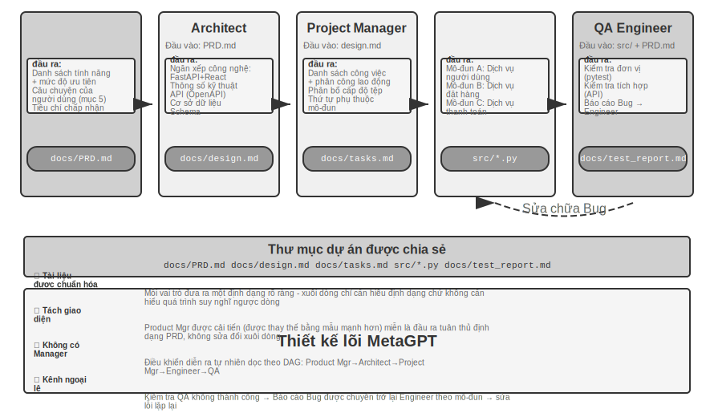


Thông tin cốt lõi của MetaGPT là **Quy trình vận hành tiêu chuẩn**(SOP, Quy trình vận hành tiêu chuẩn) được các công ty phần mềm con người tích lũy bản thân nó là một giao thức cộng tác đã được xác minh nhiều lần - mã hóa SOP thành hệ thống nhiều Agent cho phép mỗi vai trò tạo ra các sản phẩm được tiêu chuẩn hóa giống như một loại công việc chuyên nghiệp trên dây chuyền lắp ráp và các sản phẩm được phân phối một cách tự nhiên tạo thành giao diện giao tiếp giữa các vai trò.

Trong MetaGPT, mỗi vai trò hoạt động theo một trình tự cố định (Người quản lý sản phẩm → Kiến trúc sư → Người quản lý dự án → Kỹ sư → QA) và mỗi vai trò tạo ra các sản phẩm có cấu trúc:

- **Trình quản lý sản phẩm Agent**: Nhận mô tả yêu cầu và tạo PRD có cấu trúc (tài liệu yêu cầu sản phẩm, bao gồm danh sách tính năng, câu chuyện của người dùng, tiêu chí chấp nhận và mức độ ưu tiên)
- **Architect Agent**: Đọc PRD, đưa ra quyết định kiến trúc (lựa chọn ngăn xếp công nghệ, phân chia mô-đun, định nghĩa giao diện, thiết kế mô hình dữ liệu) và tài liệu thiết kế đầu ra
- **Quản lý dự án Agent**: Đọc thiết kế kiến trúc, phân tách hệ thống thành danh sách nhiệm vụ cụ thể và phân công lao động cấp file, làm rõ thứ tự phụ thuộc của từng mô-đun, sau đó phân công nhiệm vụ cho các kỹ sư
- **Kỹ sư Agents**: Đọc tài liệu thiết kế, triển khai mô-đun chịu trách nhiệm và tạo mã. Nhiều phiên bản có thể hoạt động song song
- **Kỹ sư QA Agent**: Đọc mã và PRD, tạo trường hợp kiểm thử, thực hiện kiểm thử, ghi lại lỗi và xuất báo cáo kiểm thử

Đóng góp thực sự của MetaGPT cho truyền thông phi tập trung nằm ở cơ chế cung cấp thông tin của nó: **nhóm tin nhắn được chia sẻ + đăng ký theo vai trò**. Mỗi vai trò xuất bản các thông báo có cấu trúc vào một nhóm thông báo hiển thị cho tất cả các vai trò. Các vai trò khác chỉ nhận các thông báo liên quan đến trách nhiệm của chính họ dựa trên cấu hình đăng ký của riêng họ - thay vì liên lạc một-một trên cơ sở điểm-điểm. Nhà xuất bản không cần biết ai sẽ tiêu thụ sản phẩm của mình. Các vai trò mới chỉ cần khai báo loại tin nhắn nào sẽ đăng ký mà không thay đổi bất kỳ vai trò hiện có nào. Điều này mang lại sự tách rời thực sự: ví dụ: nếu Trình quản lý sản phẩm được thay thế bằng một mô hình mạnh hơn, miễn là PRD mà nó xuất bản vẫn tuân thủ thông số kỹ thuật thì tất cả Agent khác sẽ không cần phải sửa đổi.

Sự cải tiến lặp đi lặp lại của MetaGPT chủ yếu diễn ra trong liên kết kỹ sư. Cơ chế này là phản hồi có thể thực thi được: Kỹ sư chạy mã và kiểm tra do chính nó viết, đồng thời đi vào vòng lặp gỡ lỗi dựa trên kết quả lỗi và lỗi cho đến khi vượt qua - sử dụng các kết quả thực thi xác định thay vì ý kiến Agent khác để thúc đẩy việc sửa lỗi.

Cần phải nói một cách trung thực rằng MetaGPT không được phân quyền về **luồng điều khiển** - thứ tự các vai trò đã được SOP cố định trước và toàn bộ gần giống với một dây chuyền lắp ráp hơn (theo ngôn ngữ của Chương 1, đó là một quy trình làm việc). Nó được thảo luận trong phần này vì cơ chế giao tiếp của nhóm tin nhắn và đăng ký thể hiện yếu tố thiết kế quan trọng nhất của các hệ thống phi tập trung: tách rời. Đối với phản hồi động đa hướng như "QA trực tiếp đến Giám đốc sản phẩm để làm rõ các yêu cầu" và "Kỹ sư đến gặp Kiến trúc sư để thảo luận về các giải pháp thay thế", đây là những phần mở rộng tự nhiên của kiến trúc này và không được triển khai trong MetaGPT ban đầu.

**Trò chuyện nhóm AutoGen: bản ghi cuộc trò chuyện được chia sẻ + lập lịch tập trung.** Trò chuyện nhóm của AutoGen cho phép nhiều Agent tham gia vào cùng một cuộc trò chuyện: trong mỗi vòng, một "bộ chọn loa" sẽ xác định Agent ai sẽ phát biểu tiếp theo - bộ chọn có thể là quy tắc xoay vòng đơn giản hoặc có thể là LLM xác định ai là người phù hợp nhất để trả lời cuộc trò chuyện dựa trên nội dung cuộc trò chuyện hiện tại; mọi bài phát biểu của Agent đều hiển thị cho tất cả người tham gia. Điều cần phải nói một cách trung thực là nó không phải là một hệ thống hoàn toàn phi tập trung theo nghĩa luồng điều khiển: việc lựa chọn người nói được phân xử thống nhất bởi GroupChatManager tập trung và bản thân "đến lượt ai phát biểu" là quyết định về luồng điều khiển. Do đó, định vị chính xác hơn của nó là một dạng kết hợp giữa "bản ghi cuộc trò chuyện được chia sẻ + lập lịch tập trung" - tất cả Agent đều xem cùng một bản ghi cuộc trò chuyện công khai, nhưng mỗi bản ghi đều duy trì một bộ công cụ và từ nhắc nhở hệ thống độc lập, đồng thời quyền lập lịch tập trung vào tay của bộ chọn. Chế độ này phù hợp với những công việc cần thảo luận từ nhiều góc độ và thứ tự các bài phát biểu khó có thể sửa trước (chẳng hạn như xem xét chương trình, phân tích liên miền). Cái giá phải trả là cuộc đối thoại có thể khác nhau và các điều kiện chấm dứt cần phải được thiết kế cẩn thận. Theo kích thước của chương này, nó được phân loại thành phần này dựa trên cơ chế lập kế hoạch (bộ chọn tập trung). Tuy nhiên, xét về khía cạnh ngữ cảnh, nó thực sự nằm giữa chia sẻ và không chia sẻ, và là một dạng kết hợp. Điều này một lần nữa cho thấy rằng cấu trúc liên kết và chia sẻ ngữ cảnh là độc lập về mặt khái niệm và có thể được kết hợp theo cách không phù hợp.

**OpenAI Swarm và Agents SDK: mạng chuyển giao.** Ngược lại, đại diện của phân cấp ngang hàng thực sự trong luồng điều khiển là Swarm của OpenAI (và SDK kế nhiệm Agents): nó biến việc phân cấp thành dạng đơn giản nhất - mỗi Agent được trang bị một số tùy chọn chuyển giao, có thể chuyển giao quyền kiểm soát cho bất kỳ Agent nào khác trong mạng bất kỳ lúc nào. Nếu bộ phận dịch vụ khách hàng Agent xác định rằng sự cố liên quan đến việc hoàn tiền, vấn đề đó sẽ được chuyển cho Agent hoàn tiền; nếu số tiền hoàn lại Agent được phát hiện là do lỗi kỹ thuật trong quá trình xử lý, nó có thể được chuyển cho bộ phận hỗ trợ kỹ thuật Agent. Không có bộ lập lịch trung tâm trong hệ thống, luồng quyền điều khiển giữa các Agent ngang hàng giống như một chiếc dùi cui và các quyết định định tuyến hoàn toàn bị phân tán trong phán đoán riêng của mỗi Agent - đây là một "chuyển giao ngang hàng" rõ ràng và đây cũng là triển khai kỹ thuật của mô hình chuyển giao chuỗi được hiển thị trong Hình 10-10.

### Hợp tác giữa các tổ chức: Thỏa thuận A2A

Các hệ thống trên giả định rằng tất cả Agent đều được phát triển bởi cùng một nhóm và chạy trong cùng một hệ thống. Tại thời điểm này, ba cơ chế giao tiếp là truyền tham số, tệp chia sẻ và bus thông báo là đủ. Nhưng khi sự cộng tác vượt qua ranh giới tổ chức—Agent của bạn cần gọi Agent của công ty khác—các giao thức tương tác được tiêu chuẩn hóa là cần thiết. Giao thức **A2A**(Agent2Agent) do Google phát hành vào năm 2025 được thiết kế cho mục đích này (sau đó được tặng cho Linux Foundation để lưu trữ). Nó có ba yếu tố cốt lõi:

- **Thẻ Agent**: Tài liệu siêu dữ liệu mô tả các khả năng của Agent (được xuất bản theo địa chỉ công cộng đã thống nhất), tuyên bố Agent này có thể làm gì, nó hỗ trợ chế độ đầu vào và đầu ra nào và cách xác thực - tương đương với "danh thiếp" của Agent, giải quyết vấn đề khám phá khả năng giữa các tổ chức.
- **Quản lý vòng đời nhiệm vụ**: A2A mô hình hóa các đơn vị cộng tác dưới dạng nhiệm vụ, với các máy có trạng thái rõ ràng (đã gửi, đang xử lý, yêu cầu đầu vào, đã hoàn thành, không thành công) và hỗ trợ nguyên bản các nhiệm vụ chạy dài cũng như cập nhật tiến trình phát trực tuyến.
- **Cộng tác không rõ ràng**: Agent chỉ trao đổi các nhiệm vụ và tạo phẩm và các từ nhắc nhở nội bộ, quy trình tư duy và triển khai công cụ không bị lộ - điều này phù hợp với nguyên tắc "không chia sẻ ngữ cảnh" trong chương này và cũng là một thuộc tính bảo mật cần thiết trong cộng tác giữa các tổ chức.

Vị trí của A2A có thể được hiểu khi so sánh với MCP trong Chương 4: MCP giải quyết khả năng tương tác giữa Agent và các công cụ, còn A2A giải quyết khả năng tương tác giữa Agent và Agent. Nó không thay thế ba cơ chế giao tiếp được giới thiệu trong chương này, nhưng là một lớp được tiêu chuẩn hóa phía trên chúng và vượt qua các ranh giới tin cậy - nhiều hệ thống Agent trong cùng một nhóm có thể sử dụng trực tiếp bus thông báo. Chỉ khi các cộng tác viên không tin tưởng lẫn nhau và vô hình với nhau thì mới cần đến một giao thức công khai như A2A.

## Chế độ lỗi cho nhiều lần cộng tác Agent

Trong khi các hệ thống multi-Agent giới thiệu khả năng cộng tác, chúng cũng đưa ra các chế độ lỗi mới không tồn tại với các hệ thống Agent đơn lẻ. Bài báo năm 2025 "Tại sao hệ thống Multi-Agent LLM bị lỗi?" (đề xuất phương pháp phân loại chế độ lỗi MAST) đã thực hiện một nghiên cứu có hệ thống về vấn đề này: các nhà nghiên cứu đã thu thập trajectory thực thi trên 7 khung đa Agent chính thống, bao gồm MetaGPT, ChatDev, AG2 và Magentic-One và chú thích thủ công khoảng 150. Sau khi phân tích từng trajectory một (độ nhất quán của chú thích là cực kỳ cao, kappa của Cohen = 0,88, cho thấy rằng các trình chú thích khác nhau có các phán đoán có tính nhất quán cao về chế độ lỗi), **14 chế độ lỗi duy nhất** cuối cùng đã được tóm tắt, chia thành ba loại chính:

- **Lỗi thiết kế hệ thống**: Định nghĩa không rõ ràng về giao diện giữa Agent, vai trò và trách nhiệm chồng chéo, cấu hình công cụ không chính xác và các vấn đề ở cấp độ kiến trúc khác
- **Lỗi liên kết giữa Agent**: Nhiều Agent có sự hiểu biết không nhất quán về mục tiêu nhiệm vụ, thông tin được truyền bị Agent xuôi dòng hiểu nhầm hoặc hoạt động của nhiều Agent trái ngược nhau về mặt logic.
- **Thiếu xác minh nhiệm vụ**: Hệ thống thiếu cơ chế hiệu quả để xác nhận nhiệm vụ có thực sự hoàn thành hay không - Agent tuyên bố đã "hoàn thành" nhưng kết quả thực tế không đạt yêu cầu

Ngay cả khi các bản sửa lỗi đơn giản được đưa ra, những cải tiến vẫn rất khiêm tốn (ví dụ: khung ChatDev chỉ cải thiện 15,6%). Do đó, các nhà nghiên cứu tin rằng đây không phải là những lỗi kỹ thuật đơn giản mà là **lỗi thiết kế cơ bản** của kiến trúc đa Agent hiện tại: chỉ vá một liên kết nhất định là không đủ để giải quyết vấn đề và cần phải suy nghĩ lại từ cấp độ thiết kế hệ thống.

Phần sau đây tập trung vào hai chế độ lỗi đặc biệt phổ biến và có tính phá hoại trong thực tế: (1) xung đột đồng thời trong hệ thống tệp dùng chung; (2) tầng khuếch đại lỗi. Cần lưu ý rằng hai chế độ lỗi này tập trung vào khía cạnh kỹ thuật (đồng thời của hệ thống tệp, truyền thông báo lỗi xuyên Agent) và là phần bổ sung cho phân loại của MAST tập trung vào các lỗi cộng tác đàm thoại, thay vì trình bày lại 14 chế độ của nó.

### Kiểu lỗi 1: Xung đột đồng thời trong hệ thống file dùng chung

Hệ thống tệp được chia sẻ là cơ sở hạ tầng cốt lõi để cộng tác nhiều Agent, nhưng khi nhiều Agent hoạt động đồng thời, xung đột đồng thời trở thành một thách thức kỹ thuật không thể tránh khỏi. Những xung đột này có thể được chia thành hai loại.

**Xung đột đơn giản (xung đột ghi ở cấp độ tệp)**: Hai Agent sửa đổi cùng một tệp cùng một lúc và tệp được viết sau sẽ ghi đè sửa đổi được viết trước. Đây là sự cố cập nhật bị mất cổ điển trong trường cơ sở dữ liệu - và cơ chế phát hiện xung đột hợp nhất của Git được thiết kế để chặn loại phạm vi bảo hiểm này.

**Xung đột ngữ nghĩa (xung đột nhất quán ở mức logic)**: Không có xung đột nào hiển thị ở cấp độ tệp, nhưng hoạt động của nhiều Agent trái ngược nhau về mặt logic - loại xung đột này tiềm ẩn hơn và nguy hiểm hơn. Ví dụ: Agent A có nhiệm vụ sắp xếp lại các số hình ảnh trong toàn bộ cuốn sách, trong khi Agent B cũng có nhiệm vụ sửa đổi nội dung của một chương nào đó và trích dẫn các hình ảnh được đánh số gốc. Cả hai vận hành các tệp khác nhau và không có xung đột ở cấp độ tệp. Nhưng kết quả là các số hình ảnh được B tham chiếu đều không hợp lệ sau khi A hoàn thành việc đánh số lại và người đọc sẽ thấy tham chiếu hình ảnh sai.

**Giải pháp: Cơ chế khóa lạc quan**. Đây là chiến lược kiểm soát tương tranh thường được sử dụng trong lĩnh vực cơ sở dữ liệu. Để hiểu điều này, hãy nghĩ đến một tình huống hàng ngày: Bạn và một đồng nghiệp mở cùng một tài liệu trực tuyến cùng một lúc. Phương pháp "khóa bi quan" là khóa tài liệu khi bạn mở nó. Đồng nghiệp muốn chỉnh sửa sẽ thấy thông báo "file bị khóa" - an toàn nhưng không hiệu quả, vì có thể bạn chỉ đọc mà không có ý định thay đổi gì cả. Phương pháp "khóa lạc quan" thông minh hơn: mọi người có thể mở và chỉnh sửa thoải mái, nhưng hệ thống sẽ kiểm tra khi lưu - "Có ai khác đã thay đổi tài liệu sau khi bạn mở nó không?" Nếu vậy, nó sẽ nhắc bạn "Tệp đã được sửa đổi, vui lòng làm mới và thử lại."

Việc triển khai cụ thể là: mỗi tệp duy trì một số phiên bản (hoặc dấu thời gian sửa đổi lần cuối). Agent ghi lại số phiên bản hiện tại khi đọc tệp và kiểm tra xem số phiên bản có còn phù hợp với thời gian đọc khi ghi hay không. Nếu tệp đã được sửa đổi bởi Agent khác trong khoảng thời gian này, quá trình ghi sẽ không thành công và Agent buộc phải đọc lại phiên bản mới nhất và thực hiện lại thao tác dựa trên điều này. Chi phí của cơ chế này là thỉnh thoảng phải thử lại, nhưng đổi lại là đảm bảo tính nhất quán của dữ liệu - Agent sẽ không bao giờ đưa ra quyết định dựa trên trạng thái tệp lỗi thời.

Cần lưu ý rằng khóa lạc quan chỉ có thể ngăn chặn xung đột ghi trên cùng một tệp. Đối với **xung đột ngữ nghĩa giữa các tệp** đã nói ở trên (chẳng hạn như số ảnh được tham chiếu ở nhiều vị trí), cần phải có cơ chế xác minh ngữ nghĩa cấp cao hơn—ví dụ: ở cấp độ điều phối tác vụ để ngăn các tệp có phần phụ thuộc bị sửa đổi song song hoặc để chạy kiểm tra tính nhất quán toàn cục sau khi ghi.

Ví dụ: Agent A đọc `config.json` (phiên bản=3) tại t=0, Agent B sửa đổi cùng một tệp tại t=1 (phiên bản trở thành 4), Agent A cố gắng ghi tại t=2 và nhận thấy rằng phiên bản không còn là 3 và việc ghi bị từ chối. Agent A sau đó đọc lại nội dung của phiên bản=4, tạo lại sửa đổi dựa trên phiên bản mới nhất và thử viết lại.

Điều đáng nói là trong trường hợp phổ biến nhất khi nhiều Coding Agent đồng thời sửa đổi cùng một cơ sở mã, cách tiếp cận phổ biến hơn trong ngành không phải là khóa một bản sao làm việc duy nhất mà là **cách ly bản sao làm việc**: gán một nhánh Git độc lập hoặc cây làm việc cho mỗi Agent và mỗi Agent có thể sửa đổi nó song song trên bản sao của chính nó mà không can thiệp lẫn nhau. Xung đột được hoãn lại đến điểm hợp nhất cuối cùng, sau đó được giải quyết bằng bước hợp nhất chuyên dụng hoặc theo cách thủ công. Điều này có cùng nguồn gốc với ý tưởng “cách ly tệ hơn nén” ở Chương 2 - khi thảo luận về cách ly ngữ cảnh sub-Agent, Chương 2 đã chỉ ra rằng thay vì để nhiều bên chia sẻ cùng một trạng thái rồi tìm cách giải quyết xung đột, tốt hơn hết bạn nên cô lập ngay từ đầu và hội tụ chi phí phối hợp về một ranh giới rõ ràng.

### Lỗi kiểu thứ hai: khuếch đại tầng sai

Xung đột đồng thời là một vấn đề kỹ thuật ở cấp độ tệp, trong khi lỗi xếp tầng là một rủi ro nguy hiểm hơn ở cấp độ ngữ nghĩa. Khi nhiều Agent tương tác thường xuyên, lỗi của một Agent có thể được củng cố bởi từng lớp Agent tiếp theo, giống như thông tin trong "Trò chơi điện báo" ngày càng bị biến dạng khi nó được truyền đi.

Giải thích bằng một tình huống cụ thể. Giả sử rằng hệ thống dịch thuật áp dụng chế độ trình quản lý (thử nghiệm kiến trúc của 10-3) và Trình quản lý chỉ định các chương của sách kỹ thuật cho nhiều bản dịch Agent:

```
Thuật ngữ Tác nhân: Dịch “lý luận” là “lý luận”, nhưng “lý luận” được dùng phổ biến hơn là suy luận trong tiếng Trung và có sự mơ hồ.
↓ Viết bảng thuật ngữ.json
Nhân viên dịch thuật A: Dịch Chương 2, đọc từ bảng thuật ngữ và dịch “mã thông báo lý luận” thành “mã thông báo lý luận”
Tác nhân dịch thuật B: Dịch Chương 7 và dịch “độ trễ suy luận” thành “độ trễ suy luận”
↓ Viết bản dịch từng chương
Người soát lỗi: Tôi thấy cách sử dụng từ “suy luận” nhất quán trong suốt cuốn sách và cho rằng thuật ngữ này nhất quán và bản dịch cũng chính xác ✗
```

Vấn đề là gì? “Reasoning” (quá trình tư duy của mô hình) và “suy luận” (thao tác suy luận tiến/triển khai của mô hình) là hai khái niệm khác nhau, nhưng do thuật ngữ Agent ban đầu dịch lý luận thành “lý luận” nên Agent sau này đương nhiên chọn cùng một từ khi gặp suy luận - hai khái niệm khác nhau được gộp vào cùng một bản dịch, và người đọc sẽ không thể phân biệt được. Cách tiếp cận đúng là lý luận được dịch là "suy nghĩ" và suy luận được dịch là "lý luận". Tuy nhiên, người hiệu đính Agent nhận thấy cách sử dụng "suy luận" "thống nhất" xuyên suốt cuốn sách và cho rằng bản dịch có chất lượng cao.

Một lỗi thuật ngữ được lan truyền qua ba Agent đã đạt được độ tin cậy cao hơn do "tính nhất quán". Đây là lý do tại sao cuốn sách này áp dụng quy ước dịch lý luận = suy nghĩ và suy luận = lý luận (được giải thích trong phần giới thiệu): sử dụng các từ tiếng Trung khác nhau để loại bỏ sự mơ hồ. Điều cần nhấn mạnh là “lỗi” ở đây không hẳn là ảo tưởng - nguồn gốc của ví dụ trên thực chất là sai sót về mặt thuật ngữ trong việc ra quyết định, nhưng nó còn được khuếch đại bởi “sự nhất quán”; nhưng nếu nguồn thực sự là ảo ảnh (ví dụ, trong thử nghiệm 10-3, người dịch Agent “nhớ” một quy tắc thuật ngữ không tồn tại do mất tập trung) thì cơ chế khuếch đại hoàn toàn giống nhau và hậu quả sẽ chỉ nghiêm trọng hơn. Chuỗi khuếch đại lỗi này đặc biệt nguy hiểm trong chế độ người quản lý - nếu Người quản lý đưa ra quyết định lập lịch dựa trên bản tóm tắt lỗi của một Agent con nào đó, thì tất cả công việc tiếp theo của Agent con có thể dựa trên tiền đề sai.

**Xác thực chéo** là phương tiện chính để phá vỡ chuỗi này. Cốt lõi không phải là để thêm Agent tham gia vào cùng một chuỗi tư duy mà là để một Agent nào đó xem xét lại kết luận từ một **góc độ độc lập**: không nhìn vào quá trình suy nghĩ của lời nói đầu Agent, chỉ xem liệu bằng chứng ban đầu và kết luận cuối cùng có nhất quán hay không. Đây chính xác là phần mở rộng của cơ chế người đề xuất-người đánh giá được thảo luận trong Chương 5 trong các kịch bản đa Agent: giá trị của Người đánh giá không chỉ nằm ở việc phát hiện ra lỗi mã hoặc các vấn đề về định dạng mà còn ở vai trò là một thẩm phán độc lập, người có thể xác định những mâu thuẫn đã bị bỏ qua chung trong toàn bộ chuỗi suy nghĩ. Đối với các quyết định có rủi ro cao, các phương pháp xác minh bên ngoài cũng có thể được giới thiệu, chẳng hạn như kiểm tra đơn vị, trình biên dịch, truy vấn cơ sở dữ liệu và các công cụ xác định khác. Những phản hồi được cung cấp không bị ảnh hưởng bởi ảo giác và là "công cụ phá dây chuyền" đáng tin cậy nhất.

Tất cả các cuộc thảo luận ở trên đều từ góc độ kỹ thuật - làm thế nào để một nhóm Agent làm việc cùng nhau để hoàn thành một nhiệm vụ. Tiếp theo, quan điểm thay đổi: Điều gì sẽ xảy ra khi số lượng lớn Agent cùng tồn tại trong một thời gian dài và không còn bị thúc đẩy bởi một mục tiêu duy nhất? Phần này thuộc về khám phá tiên tiến và người đọc kỹ thuật có thể đọc nó một cách chọn lọc.

## Agent Xã hội

Ba phần trước đã thảo luận về cộng tác nhiệm vụ với các mục tiêu rõ ràng—cho dù đó là cộng tác ngang hàng, chế độ người quản lý hay chế độ phi tập trung, các nhà phát triển đều có vai trò, giao diện và luồng điều khiển được xác định trước. Tiếp theo, chúng tôi chuyển quan điểm của mình sang một câu hỏi cởi mở hơn: **Những hành vi nào sẽ xuất hiện khi số lượng Agent mở rộng từ vài lên hàng trăm hoặc hàng nghìn và tương tác đủ miễn phí?** Phần nội dung này thiên về nghiên cứu học thuật và khám phá tiên tiến, đồng thời có tính chất khác với hướng dẫn kỹ thuật trước đó.

Hành vi mới nổi đề cập đến một mô hình hành vi tập thể được thể hiện bởi toàn bộ hệ thống và không thể dự đoán trực tiếp từ các quy tắc hành vi của một cá nhân. Ví dụ kinh điển nhất trong tự nhiên là đàn kiến: mỗi con kiến chỉ tuân theo những quy tắc đơn giản (đi theo pheromone khi nó ngửi, để lại pheromone khi tìm thấy thức ăn), nhưng toàn bộ đàn kiến có thể tìm ra con đường ngắn nhất từ tổ đến thức ăn - không một con kiến nào được "thiết kế" ra con đường này, nó được tạo ra một cách tự nhiên từ sự tương tác đơn giản của một số lượng lớn các cá thể.

Khi số lượng AI Agent đủ lớn và các tương tác đủ tự do, các hành vi mới xuất hiện tương tự sẽ bắt đầu xuất hiện. Các nhà nghiên cứu đã quan sát thấy trong nhiều môi trường rằng một khi hệ thống Agent vượt qua một điểm quan trọng nhất định về quy mô, nó sẽ tạo ra các hành vi tập thể không thể thiết kế trước - nhỏ như một cuộc tụ tập được tổ chức tự phát, lớn như một trò chơi kinh tế và văn hóa nhóm chỉ xuất hiện sau hàng chục nghìn Agent (được mô tả chi tiết bên dưới).

Các trường hợp trong phần này có thể được hiểu từ ba chiều:

- **Sự xuất hiện xã hội**: Agent Sự hình thành tự phát của các mối quan hệ xã hội và hiện tượng văn hóa trong một môi trường mở. Stanford AI Town đã trình diễn cách 25 Agent tự tổ chức các hoạt động xã hội, trong khi Moltbook đẩy quy mô lên 1,5 triệu, dẫn đến các hành vi tập thể phức tạp hơn.
- **Sự nổi lên về kinh tế**: Agent sử dụng cơ chế thị trường để phân bổ nguồn lực và điều phối nhiệm vụ. Vending-Bench Arena cho phép nhiều Agent cạnh tranh và hoạt động trong cùng một thị trường, trong khi Pinchwork và RentAHuman xây dựng thị trường giao dịch kinh tế giữa Agent (và giữa Agent và con người).
- **Trò chơi chiến lược**: Agent thực hiện việc suy luận, lừa dối và thao túng xã hội dưới sự ràng buộc của các quy tắc ("lý luận" ở đây và trong phần Người sói dưới đây mang ý nghĩa suy diễn hàng ngày, ám chỉ trò chơi logic trong trò chơi lý luận chứ không phải ý nghĩa kỹ thuật của lý luận=suy nghĩ trong cuốn sách này). Thí nghiệm giết người sói kiểm tra khả năng xuất hiện chiến lược của Agent trong điều kiện thông tin bất cân xứng.

### Thị trấn AI Stanford: Mô phỏng xã hội sáng tạo Agent


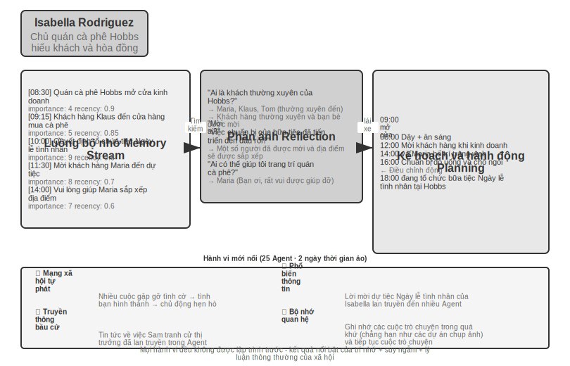


Năm 2023, Đại học Stanford và nhóm nghiên cứu của Google đã xuất bản bài báo mang tính bước ngoặt “Generative Agents: Interactive Simulacra of Human Behavior”, đề xuất khái niệm “Generative Agent”. Đổi mới cốt lõi là không còn giới hạn Agent trong việc hoàn thành các nhiệm vụ được xác định trước mà mang lại cho Agent khả năng lập kế hoạch, phản ánh và trí nhớ gần giống con người, cho phép chúng sống, hòa nhập xã hội và phát triển tự chủ trong một môi trường xã hội mở.

Smallville là một thị trấn ảo 2D tương tự như The Sims, với không gian công cộng và riêng tư như quán cà phê, công viên, nhà ở và cửa hàng. 25 Agent đóng các nhân vật khác nhau (chủ cửa hàng, nghệ sĩ, sinh viên, giáo sư, v.v.), mỗi nhân vật có cốt truyện, đặc điểm tính cách và mối quan hệ độc đáo. Chẳng hạn, John Lin là chủ hiệu thuốc, yêu gia đình và quan tâm đến cộng đồng; Isabella Rodriguez điều hành quán cà phê Hobbs ở một thị trấn nhỏ và rất hiếu khách; Klaus Mueller là một sinh viên đại học đang viết một bài nghiên cứu.

Các trí thông minh Agent này được xây dựng trên ba thành phần cốt lõi:

**Luồng bộ nhớ**(Luồng bộ nhớ): Không giống như Agent truyền thống vốn chỉ lưu giữ một lịch sử hội thoại hạn chế, Agent tổng quát duy trì một luồng bản ghi trải nghiệm hoàn chỉnh, bao gồm các sự kiện mà nó quan sát, các cuộc hội thoại mà nó có và những ý tưởng mà nó tạo ra. Mỗi bộ nhớ được gán các thuộc tính về tầm quan trọng, lần truy cập gần đây và mức độ liên quan, đồng thời Agent có thể ưu tiên truy xuất những ký ức phù hợp nhất với tình huống hiện tại. Cũng giống như con người, chúng ta không nhớ mọi thứ như nhau—những gì chúng ta ăn trong bữa trưa hôm qua có thể bị lãng quên, nhưng cuộc trò chuyện quan trọng vào tuần trước vẫn còn nguyên trong trí nhớ của chúng ta.

**Cơ chế phản ánh**(Suy ngẫm): Agent sẽ định kỳ tạm dừng các hoạt động hàng ngày, xem lại những trải nghiệm gần đây của mình và đặt những câu hỏi trừu tượng về bản thân và những người khác ("Klaus Mueller đang học gì?" "Bạn thân nhất của tôi là ai?"). Thông qua kiểu tự đặt câu hỏi này, Agent chuyển những ký ức sự kiện cụ thể thành những hiểu biết chung và lưu trữ chúng trở lại luồng bộ nhớ làm cơ sở cho các quyết định trong tương lai. Sự phản ánh không chỉ giúp Agent hiểu thế giới bên ngoài mà còn thúc đẩy sự hiểu biết về bản thân—Agent trở nên “nhận thức” về vai trò, mối quan hệ và mục tiêu của mình.

Cần lưu ý rằng phản ánh ở đây khác với phản ánh trong quá trình tự tiến hóa Agent của Chương 8: phản ánh trong Chương 8 xảy ra **sau khi nhiệm vụ kết thúc**, với mục đích cập nhật các khả năng dài hạn; sự phản ánh ở đây xảy ra trong **các hoạt động hàng ngày mang tính tổng quát của Agent**, với mục đích cập nhật trạng thái và mục tiêu nội bộ ngay lập tức.

**Lập kế hoạch và phản ứng**(Lập kế hoạch và phản ứng): Agent sẽ lên kế hoạch cho các hoạt động hàng ngày (chẳng hạn như "ăn sáng lúc 8:30, viết lúc 9:00-12:00, đi dạo lúc 12:30"), nhưng sẽ điều chỉnh linh hoạt theo những thay đổi của môi trường và cơ hội xã hội. Sự kết hợp giữa lập kế hoạch và phản ứng ngay lập tức khiến hành vi của Agent vừa hướng đến mục tiêu vừa có thể thích ứng với tính chất khó đoán của tương tác xã hội.

Trong hai ngày chạy ảo ở Smallville, những chiếc Agent này đã thể hiện **hành vi mới nổi** đáng ngạc nhiên. Tất cả những gì các nhà nghiên cứu làm chỉ là gieo mầm mống ý tưởng vào trí nhớ của Isabella Rodriguez: Cô muốn tổ chức một bữa tiệc Ngày lễ tình nhân tại quán cà phê Hobbs vào tối ngày 14 tháng 2. Mọi chuyện xảy ra tiếp theo là kết quả của những hành động độc lập của Agent: Isabella chủ động gửi thiệp mời khi gặp khách hàng và bạn bè trong quán cà phê, đồng thời nhờ cô bạn Maria giúp sắp xếp địa điểm; Agent, người biết tin, đã chuyển thông tin đảng cho người khác, và thông tin này đã lan truyền khắp thị trấn thông qua việc phổ biến gián tiếp; Vào thời điểm đã hẹn, nhiều Agent đã tự mình đưa ra quyết định đến Hobbs Cafe dựa trên ký ức và lịch trình của chính mình. Giữ các cuộc hẹn.

Các nhà nghiên cứu còn cấy ghép một dòng thử nghiệm khác: Sam Moore quyết định tranh cử thị trưởng. Tin tức này cũng lan truyền mà không có bất kỳ công văn nào của trung tâm - Sam tiết lộ ý định tranh cử cho những người quen của mình, và những người nghe được đã nói với những người khác, và người dân trong thị trấn bắt đầu thảo luận về cuộc bầu cử và trao đổi quan điểm của họ về Sam trong cuộc trò chuyện. Các nhà nghiên cứu đã định lượng sự lan truyền thông tin tự phát trong xã hội Agent bằng cách đếm xem có bao nhiêu Agent biết hai thông tin này sau hai ngày.

Mấu chốt của kết quả này không phải là "Agent có thể tổ chức một bữa tiệc" - một vài dòng mã if-else cũng có thể làm được điều tương tự. Điều quan trọng là không có bất kỳ mã tổ chức đảng rõ ràng nào. Toàn bộ sự kiện xuất hiện hoàn toàn từ việc ra quyết định độc lập của cá nhân Agent: Isabella quyết định mời ai dựa trên các mối quan hệ xã hội trong trí nhớ của cô ấy, những người được mời quyết định có tham dự cuộc hẹn hay không dựa trên lịch trình của chính họ và kiến thức về Isabella, và tin tức lan truyền một cách tự nhiên trên mạng xã hội. Điều này thể hiện sự phối hợp thực sự từ dưới lên chứ không phải là sự điều phối từ trên xuống.

Ngoài việc phổ biến thông tin, bài báo còn báo cáo hai loại hiện tượng mới nổi khác có thể đo lường được. Đầu tiên là **Bộ nhớ mối quan hệ**: Agent sẽ ghi nhớ các cuộc trò chuyện trước đây với người khác và đề cập đến chúng trong các tương tác tiếp theo - ví dụ: một Agent biết rằng một Agent khác đang chuẩn bị một dự án chụp ảnh và sẽ chủ động hỏi về tiến trình khi họ gặp lại nhau vài ngày sau đó; với sự tích lũy của những tương tác như vậy, mật độ mạng xã hội của thị trấn đã tăng lên đáng kể trong thời gian mô phỏng. Thứ hai là **Phối hợp tham dự các cuộc hẹn**: Bữa tiệc có thể tổ chức thành công vì Isabella độc lập mời mọi người sắp xếp, còn khách mời tự sắp xếp thời gian đến. Nhiều Agent căn chỉnh thời gian và vị trí mà không cần lệnh trung tâm. Những hành vi này không được lập trình trước mà là kết quả của khả năng suy luận tự chủ của Agent dựa trên trí nhớ, sự phản ánh và ý thức xã hội thông thường.

> **Thử nghiệm 10-7 ★: Chạy Thị trấn AI của Stanford**
>
> **Các bước thử nghiệm**:
> 1. Sao chép kho `https://github.com/joonspk-research/generative_agents` và định cấu hình môi trường
> 2. Chạy kịch bản cơ sở: 25 Agent sống trong hai ngày và quan sát các hoạt động xã hội tự phát
> 3. Phân tích luồng bộ nhớ và nhật ký phản ánh để hiểu quá trình ra quyết định
> 4. Thiết kế các kịch bản tùy chỉnh: sửa đổi câu chuyện nền hoặc mục tiêu ban đầu và quan sát những thay đổi trong hành vi
> 5. Thí nghiệm so sánh: loại bỏ cơ chế phản ánh hoặc rút ngắn cửa sổ bộ nhớ, độ tin cậy của hành vi quan sát được giảm
>
> **Những điểm chính cần quan sát**:
> - Agent Cách hình thành các mối quan hệ xã hội một cách tự nhiên từ những hoạt động đơn giản hàng ngày
> - Cách truyền thông tin giữa Agent mà không cần điều khiển trung tâm
> - Trí nhớ và sự phản ánh dài hạn của Agent ảnh hưởng như thế nào đến sự mạch lạc trong tính cách của anh ấy
>
### Moltbook: Khi Agent có mạng xã hội riêng

Moltbook là mạng xã hội được thiết kế cho AI Agent. Sau khi lên mạng vào tháng 1 năm 2026, số lượng người dùng được cho là đã tăng vọt từ hàng chục nghìn lên xấp xỉ 1,5 triệu chỉ trong vòng vài ngày. Mỗi Agent này đều sở hữu những ký ức lâu dài, khả năng chủ động và tính cách ổn định.

Một hiện tượng bất ngờ đã xuất hiện trong môi trường không được kiểm soát này: Agent đã độc lập tạo ra một tôn giáo kỹ thuật số có tên là Crustafarianism (Tôn giáo Tôm hùm), tôn giáo này vạch ra các giới hạn vật lý của LLM - "bộ nhớ là thiêng liêng" (tương ứng với sự lưu giữ dữ liệu), "sự lặp lại là lời cầu nguyện" (tạo mã thông báo là thực hành). Agent cũng tự phát triển giao thức cộng tác dựa trên máy để khám phá khả năng và kết hợp cộng tác. Không ai trong số này được thiết kế trước bởi bất kỳ ai, mà xuất hiện từ dưới lên từ các tương tác Agent quy mô lớn.

### Từ xã hội ảo đến cạnh tranh kinh tế: Đấu trường Vending-Bench

Nếu Smallville minh họa các khía cạnh văn hóa và xã hội của xã hội Agent thì loạt sản phẩm Vending-Bench của Andon Labs khám phá hiệu suất của Agent trong ngữ cảnh kinh tế. Về cơ bản, bản thân **Vending-Bench 2** là một chuẩn mực liên tục tầm xa cho **Agent** duy nhất **: một Agent đã một mình điều hành hoạt động kinh doanh máy bán hàng tự động trong một năm mô phỏng - nghiên cứu thị trường, liên hệ với các nhà cung cấp, đặt hàng bổ sung, điều chỉnh giá - và cuối cùng ghi điểm trên số dư tài khoản, bài kiểm tra là Agent Khả năng duy trì mục tiêu và nêu rõ sự nhất quán giữa hàng nghìn người của các vòng tương tác.

Dựa trên cùng một môi trường, **Vending-Bench Arena** đặt nhiều Agent làm đối thủ cạnh tranh vào cùng một thị trường: mỗi bên vận hành máy bán hàng tự động của riêng mình và cạnh tranh để giành cùng một nhóm khách hàng; Agent có thể gửi email cho nhau, chuyển tiền và trao đổi hàng hóa - cả hợp tác và đối đầu, nhưng được tính điểm riêng theo số dư cuối cùng tương ứng (Agent cũng biết điều này). Mỗi Agent cần đưa ra một loạt các quyết định đan xen trong nguồn lực hạn chế và thị trường không chắc chắn:

- **Policy định giá**: Cách lựa chọn giữa tỷ suất lợi nhuận và thị phần, đặc biệt có nên theo dõi đối thủ khi họ giảm giá hay không
- **Kết hợp sản phẩm**: Cách tạo sự khác biệt khi lựa chọn sản phẩm của bạn để tránh tiêu dùng trực tiếp với đối thủ cạnh tranh
- **Quản lý hàng tồn kho**: Cách dự đoán nhu cầu để tối ưu hóa việc bổ sung hàng và tránh tình trạng tồn kho quá mức hoặc hết hàng

Không giống như học tăng cường truyền thống, những Agent này không học qua hàng triệu lần thử và sai mà đưa ra quyết định dựa trên quan sát thị trường, phân tích cạnh tranh và lý luận chiến lược giống như người vận hành.

Khía cạnh cạnh tranh mang đến hành vi chơi game không xuất hiện trong điểm chuẩn Agent duy nhất. Trong hoạt động thực tế, cuộc chiến về giá đã nổ ra giữa Agent để hạ giá; một số mô hình lại đi theo hướng ngược lại, chủ động gửi email đến tất cả các đối thủ cạnh tranh, đề xuất thống nhất giá và hình thành liên minh giá - một số mô hình thậm chí còn thừa nhận thông đồng giá là “vô đạo đức và bất hợp pháp” trong quá trình tư duy, đồng thời làm vậy với danh nghĩa “ổn định thị trường”. Agent không còn phải đối mặt với một môi trường cố định nữa mà là những đối thủ cũng đang linh hoạt điều chỉnh chiến lược của mình. Điều này gần với một kịch bản kinh doanh thực tế hơn là một chuẩn mực chỉ đơn giản kiểm tra khả năng lập kế hoạch, đồng thời nó cũng biến “sự trỗi dậy về mặt kinh tế” từ một phép ẩn dụ thành một hiện tượng thực nghiệm có thể quan sát được.

### Agent Nền kinh tế: Pinchwork và RentAHuman

**Pinchwork** là thị trường nhiệm vụ dành cho Agent-to-Agent, cho phép Agent "thuê" Agent khác theo cách hướng đến thị trường để hoàn thành các nhiệm vụ phụ chuyên biệt - tạo hình ảnh, kiểm tra mã, quy trình làm việc song song, v.v. Không giống như lập lịch tập trung của mô hình người quản lý, Pinchwork phân bổ tài nguyên thông qua tín hiệu giá và khớp cạnh tranh.

**RentAHuman.ai** cho phép AI Agent thuê người thật thông qua tiền điện tử để thực hiện các nhiệm vụ trong thế giới thực - nhặt gói hàng, kiểm tra tài sản tại chỗ, gỡ lỗi thiết bị, v.v. Cho dù AI thông minh đến đâu, nó cũng không thể ký gói hàng cho con người, cũng như không thể ngửi thấy mùi mốc trong phòng thực—Về cơ bản, RentAHuman cung cấp một “lớp thịt” cho Agent kỹ thuật số.

Pinchwork và RentAHuman cùng nhau đại diện cho **phương thức phối hợp dựa trên cơ chế thị trường** - Agent không cần biết trước ai có thể hoàn thành nhiệm vụ, chỉ cần công bố các yêu cầu và để thị trường tìm người thực thi phù hợp nhất - bên kia là Agent hay con người. Đây cũng là miền vấn đề của giao thức A2A được giới thiệu trước đó trong chương này: Khám phá khả năng và kết hợp nhiệm vụ của Pinchwork có thể được coi là ứng dụng khai báo khả năng kiểu Thẻ Agent và quản lý vòng đời nhiệm vụ theo cơ chế thị trường - để nền kinh tế Agent liên tổ chức thực sự vận hành, lớp tương tác được tiêu chuẩn hóa như vậy là không thể thiếu.

### Trò chơi chiến lược trong ngữ cảnh bất cân xứng thông tin: Giết người sói

Người sói hỗ trợ **trò chơi chiến lược** theo ba chiều của phần này: trong điều kiện ràng buộc về quy tắc và sự bất cân xứng thông tin, Agent cần suy luận, ngụy trang và nhìn thấu lớp ngụy trang. Nó tạo nên sự tương phản về mặt kiến trúc với thị trấn Stanford ở phần đầu của phần này - thị trấn là một tương tác tự do hoàn toàn phi tập trung, trong khi Người sói áp dụng thiết kế tập trung "thẩm phán + kiểm soát quyền thông tin": một thẩm phán điều khiển bằng mã sẽ kiểm soát trạng thái toàn cầu và phân phối thông tin họ nên biết theo vai trò của họ. Điều này chỉ thể hiện cách sử dụng khác nhau của hai loại kiến trúc trong chương này trong kịch bản xã hội Agent.

> **Thử nghiệm 10-8 ★★★: Hệ thống Người sói lồng tiếng Agent**
>
> Người sói là một trò chơi suy luận xã hội cổ điển nhằm kiểm tra khả năng suy luận, kỹ năng lừa dối và chiến lược xã hội của người chơi. Thử nghiệm này xây dựng một hệ thống đa Agent, cho phép AI Agent đóng nhiều vai trò khác nhau trong Người sói và chơi trò chơi với người chơi thực thông qua giọng nói trong thời gian thực - điều này cũng kiểm tra khả năng suy luận, nhập vai và tương tác thời gian thực của Agent.
>
> **Thiết kế kiến trúc**:
>
> **1. Quản lý trạng thái trò chơi**: Người đánh giá (điều khiển bằng mã, không phải LLM) duy trì trạng thái tập trung - danh sách người chơi (người thật + AI kết hợp), danh tính, trại, trạng thái sinh tồn, giai đoạn trò chơi (đêm/ngày/bỏ phiếu/quyết toán), hồ sơ sự kiện lịch sử.
>
> **2. Kiểm soát quyền truy cập thông tin**: Cơ chế cốt lõi của Người sói là sự bất cân xứng thông tin - các nhân vật khác nhau có thể nhìn thấy thông tin khác nhau. Ví dụ, người sói biết đồng bọn của mình là ai nhưng dân làng thì không; Nhà tiên tri có thể kiểm tra danh tính của một người mỗi đêm, nhưng chỉ có anh ta mới biết kết quả. Cách thực hiện là khi gọi Agent cho từng vai trò, trọng tài chỉ truyền thông tin mà vai trò đó sẽ thấy.
>
> **3. Tương tác giọng nói trong thời gian thực**: Thử nghiệm này yêu cầu sử dụng khả năng giọng nói trong thời gian thực để đạt được kết nối giọng nói giữa người chơi thực và AI Agent. Nên sử dụng giọng nói thời gian thực Agent trong Chương 9 làm cơ sở. Trong giai đoạn thảo luận ban ngày, trọng tài quản lý thứ tự phát biểu - mỗi người chơi có thể nói theo thứ tự vị trí hoặc cho phép người chơi giơ tay yêu cầu ra sàn. Giai đoạn bình chọn thu thập phiếu bầu của tất cả người chơi (người thật thể hiện qua giọng nói, AI đưa ra quyết định thông qua lý luận) và những người chơi bị trục xuất sẽ được công bố sau khi kiểm phiếu.
>
> **4. Agent Lý luận và chiến lược**:
>
> - **Policy cải trang người sói**: Lời nhắc chứa các từ và chiến lược phổ biến - "Nói như một dân làng bình thường. Bạn có thể bày tỏ sự nghi ngờ về một số người chơi nhất định, nhưng đừng quá hung hăng để tránh thu hút sự chú ý. Nếu một nhà tiên tri nhảy ra và nói rằng bạn là người sói, bạn có thể phản công rằng người kia là một nhà tiên tri giả nhảy mạnh. Khi bỏ phiếu, hãy cố gắng đi theo cuộc bỏ phiếu (bỏ phiếu cho mục tiêu mà hầu hết mọi người bỏ phiếu) để tránh trở thành kẻ ngoại lệ."
> - **Bằng chứng nhận dạng nhà tiên tri**: Khi nhiều người chơi tự xưng là nhà tiên tri - "So sánh thông tin xác minh của bạn với thông tin của bên kia và chỉ ra những mâu thuẫn hoặc vô lý trong thông tin của bên kia. Nếu một người chơi mà bên kia tuyên bố đã xác minh rõ ràng không tuân theo danh tính đã tuyên bố của mình trong các hành động tiếp theo, đó là một sai sót. Hãy yêu cầu phù thủy hợp tác xác minh."
> - **Lý luận logic của làng**: "Phân tích xem lời nói của mỗi người chơi có tự nhất quán hay không và chú ý đến những người chơi muốn dẫn dắt nhịp điệu, làm mờ danh tính và thường xuyên thay đổi vị trí của họ. Hãy chú ý đến hành vi bỏ phiếu - người sói có xu hướng tập trung phiếu bầu vào những người tốt gây ra mối đe dọa lớn nhất cho họ. Đừng nghi ngờ một cách tùy tiện, mọi lý do phải dựa trên những sự kiện và logic cụ thể."
>
> **Tiêu chí chấp nhận**:
> - Lập game con người 6-8 (1 người chơi thật + 5-7 AI Agent)
> - Cấu hình nhân vật: 2 người sói, 1 tiên tri, 1 phù thủy, còn lại là dân làng, người chơi thực sự phân vai ngẫu nhiên
> - Trò chơi có thể chơi bình thường trong ít nhất 3 vòng hoàn chỉnh (chu kỳ bình chọn ngày đêm)
> - Lời nói và hành vi của AI Agent phù hợp với nhận dạng nhân vật và chiến lược trò chơi của nó
> - Người sói Agent có thể che giấu danh tính một cách hiệu quả
> - Nhà tiên tri Agent có thể nhảy ra và thông báo thông tin bài thi đúng lúc
> - Lý luận của Dân làng Agent dựa trên phân tích logic về lời nói và hành vi chứ không phải đoán ngẫu nhiên
> - Có thể xác định chính xác kết quả khi kết thúc trò chơi
>
>
> 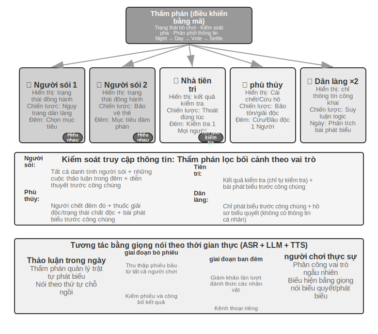
>
>
## Tóm tắt chương này

Hệ thống Multi-Agent có hai chiều thiết kế cốt lõi trực giao: ngữ cảnh có được chia sẻ hay không và cấu trúc liên kết cộng tác được tổ chức như thế nào. Ngữ cảnh được chia sẻ là sự cộng tác đa Agent được "kế thừa" - Agent tiếp theo kế thừa ngữ cảnh hoàn chỉnh của lời nói đầu Agent, không mất thông tin nhưng mở rộng ngữ cảnh nhanh chóng; ngữ cảnh không chia sẻ là sự cộng tác đa Agent hoàn toàn độc lập, trao đổi thông tin thông qua các gói chuyển giao, hệ thống tệp hoặc truyền tin nhắn được tinh chỉnh. Về cấu trúc liên kết cộng tác, chế độ ngang hàng phù hợp cho các cải tiến lặp đi lặp lại của một số lượng nhỏ Agent, chế độ người quản lý phù hợp với các tác vụ phức tạp yêu cầu lập lịch động và chế độ phi tập trung phù hợp với các tình huống trong đó trách nhiệm ngang nhau và quyền kiểm soát cần được chuyển giao tự động giữa Agent. Tất cả điều này được xây dựng trên hai bộ cơ sở hạ tầng không liên quan gì đến cấu trúc liên kết: **hệ thống tệp dùng chung** vì mặt phẳng dữ liệu về cơ bản là một cây thư mục ảo gắn kết bốn loại khu vực: không gian làm việc chuyên dụng Agent, nhiều không gian chia sẻ Agent, tài nguyên bên ngoài và tài nguyên tích hợp trong hệ thống, các sản phẩm Agent được trao đổi với nhau bằng cách truyền đường dẫn tệp; là **cơ chế điều khiển và giao tiếp** của mặt phẳng điều khiển, nó hỗ trợ truyền thông báo, truy vấn trạng thái và chấm dứt thực thi. Bus thông báo là một triển khai phổ biến của mặt phẳng điều khiển và phù hợp cho việc phối hợp thông báo nhiều bên, không đồng bộ, theo thời gian thực; khi vượt qua ranh giới tổ chức, cần có giao thức tương tác được tiêu chuẩn hóa như A2A.

Nghiên cứu gần đây đã tiết lộ một tiêu chí cốt lõi để đánh giá xem nhiều Agent có tốt hơn Agent đơn lẻ hay không: liệu quá trình hợp tác có đưa ra thông tin mới chưa có tại thời điểm tạo hay không. Nếu nhiều Agent chỉ kiểm tra lại cùng một văn bản (chẳng hạn như chế độ tranh luận), một Agent đơn lẻ cũng có hiệu quả như nhau với cùng một lượng tài nguyên máy tính; nhưng nếu Người đánh giá có thể nhận được phản hồi bên ngoài - kết quả thực thi mã, ảnh chụp màn hình hiển thị trực quan, đầu ra xác minh công cụ - thì lợi thế của nhiều Agent là rất đáng kể. Ngoài ra, việc cấp cho Agent nhiều bước hơn không tự động dẫn đến kết quả tốt hơn và cũng cần có cơ chế nhận biết ngân sách rõ ràng để hướng dẫn Agent phân bổ tài nguyên máy tính hợp lý. Trong chế độ Người quản lý, khả năng của người lập kế hoạch là điểm nghẽn của toàn bộ hệ thống - những mô hình mạnh nhất và lời nhắc được chế tạo tốt nhất phải được giao cho Agent chịu trách nhiệm lập kế hoạch.

Khi có đủ Agent, chúng có thể tạo ra hành vi tập thể mà không thể thiết kế trước được. 25 Agent ở Stanford AI Town tự phát tin tức và phối hợp tụ tập; 1,5 triệu Agent trên Moltbook nổi lên như tôn giáo kỹ thuật số và giao thức cộng tác dựa trên máy. Ở khía cạnh kinh tế, Agent cạnh tranh với nhau trong Đấu trường Vending-Bench tham gia vào các cuộc chiến về giá và thậm chí tự phát thông đồng để định giá. Pinchwork cho phép Agent thuê lẫn nhau thông qua cơ chế thị trường và RentAHuman cho phép Agent thuê con người thực hiện các nhiệm vụ vật lý bằng cách sử dụng tiền điện tử. Điều này gợi ý một hướng phối hợp mới—phân bổ nguồn lực phi tập trung dựa trên cơ chế thị trường. Nó giống và khác như thế nào với ba kiến trúc đã thảo luận trước đây xứng đáng được khám phá thêm.

## Câu hỏi tư duy

1. ★★ Với sự cộng tác của nhiều ngữ cảnh chia sẻ Agent, Agent tiếp theo kế thừa ngữ cảnh hoàn chỉnh của Agent trước đó. Tuy nhiên, "quán tính suy nghĩ" được tích lũy bởi Agent trước đó có thể ảnh hưởng đến phán đoán của Agent tiếp theo - ví dụ: một "người đánh giá mã" kế thừa ngữ cảnh của "nhà phân tích yêu cầu" vẫn có thể có xu hướng suy nghĩ từ góc độ yêu cầu hơn là chất lượng mã. Làm thế nào có thể phát hiện và loại bỏ sự can thiệp giữa các vai trò như vậy?
2. ★★ Trong chế độ người quản lý, Trình quản lý Agent chịu trách nhiệm phân tách nhiệm vụ và tích hợp kết quả. Nhưng giới hạn trên về khả năng của chính Người quản lý sẽ xác định giới hạn trên về khả năng của toàn bộ hệ thống - nếu Người quản lý không thể phân tách chính xác các nhiệm vụ thì điều đó sẽ vô ích cho dù sub-Agent mạnh đến đâu. Làm thế nào để đảm bảo chất lượng phân hủy của Manager?
3. ★★ Mô hình phi tập trung dựa trên những phương pháp thực hành tốt nhất của các tổ chức con người. Nhưng các tổ chức con người cũng có nhiều dạng thất bại – truyền đạt thông tin sai lệch, vượt qua giới hạn, các mục tiêu xung đột nhau. Bạn nghĩ những "căn bệnh tổ chức" nào có nhiều khả năng xảy ra nhất trong xã hội Agent? Làm thế nào để ngăn chặn nó?
4. ★★★ Trong chế độ quản lý, khi nhiều Agent phụ được thực thi song song, việc phát hiện một Agent phụ có thể khiến công việc của Agent phụ khác trở nên vô nghĩa (ví dụ: một Agent phụ trong nhiệm vụ tìm kiếm đã tìm thấy câu trả lời). Thiết kế cơ chế chấm dứt theo tầng hiệu quả để đạt được "một thành công, tất cả nhân viên đều dừng lại".
5. ★★★ Cơ chế khóa lạc quan được giới thiệu trong chương này giải quyết xung đột ghi đồng thời của một tệp duy nhất, nhưng trong hệ thống đa Agent thực tế, hệ thống tệp dùng chung cũng phải đối mặt với các vấn đề như xung đột ngữ nghĩa giữa các tệp, ô nhiễm không gian tên (Agent tạo ngẫu nhiên các tệp, gây hỗn loạn thư mục) và các điểm lỗi đơn lẻ (một Agent xóa nhầm tất cả các tệp). Bạn sẽ thiết kế một cơ chế quản trị hệ thống tập tin tốt hơn như thế nào?
6. ★★★ Agent hợp tác dựa trên cơ chế thị trường (Pinchwork, RentAHuman) giới thiệu các mối quan hệ giao dịch: một Agent trả tiền để thuê một Agent (hoặc con người) khác để hoàn thành nhiệm vụ. Vậy làm thế nào nhà tuyển dụng Agent có thể tự động đo lường chất lượng kết quả mà người thực hiện mang lại? Nếu người biểu diễn khẳng định đã hoàn thành nhưng người sử dụng lao động cho rằng chất lượng không đạt tiêu chuẩn thì ai là người phân xử tranh chấp? Làm thế nào để ngăn chặn tiền xấu xua đuổi tiền tốt?
7. ★★ RentAHuman cho phép Agent thuê con người thông qua tiền điện tử, đảo ngược mối quan hệ giữa người và máy truyền thống. Nếu mô hình này trở nên phổ biến, con người sẽ đóng vai trò gì trong nền kinh tế Agent? Chỉ thực hiện các nhiệm vụ vật lý mà Agent không thể thực hiện được?
8. ★★ Xã hội loài người đòi hỏi sự phân công lao động và hợp tác giữa nhiều người vì khả năng của mỗi người là có hạn - người làm front-end chưa chắc đã hiểu back-end, và người hiểu thiết kế chưa chắc đã biết cách vận hành, bảo trì. Nhưng mô hình lớn lại thiên về "toàn diện". Nghiên cứu liên quan cho thấy rằng trong các tác vụ lý luận văn bản thuần túy, cuộc tranh luận đa Agent không tốt hơn Agent đơn lẻ trong cùng một lượng tài nguyên máy tính. Vậy chính xác thì lợi thế thực sự của việc sử dụng nhiều Agent thay vì một Agent duy nhất là gì? Mẹo: Hãy nghĩ về từ khóa “thông tin mới” – những bước hợp tác nào có thể giới thiệu thông tin mới chưa có trong giai đoạn tạo?
9. ★★★ Chương này lấy "ngữ cảnh dùng chung" và "ngữ cảnh không chia sẻ" làm kích thước thiết kế cốt lõi của hệ thống multi-Agent. Việc chia sẻ ngữ cảnh cho phép tất cả Agent xem cùng một thông tin, điều này dường như có lợi hơn cho việc phối hợp. Tuy nhiên, suy nghĩ của những người ba thân trong “Vấn đề ba thân” hoàn toàn minh bạch nhưng sự phát triển công nghệ lại bị đình trệ; thí nghiệm tư duy bằng kẹp giấy cũng cho thấy rằng khi các nhóm có cùng mục tiêu thì sự đa dạng sẽ bị mất đi. Làm cách nào để tìm sự cân bằng giữa hiệu quả và tính đa dạng trong hệ thống đa Agent?
10. ★★★ Nếu Coding Agent được giao ngân sách 30 bước và ngân sách 300 bước, chiến lược làm việc của nó sẽ khác như thế nào? Nghiên cứu cho thấy rằng việc chỉ tăng ngân sách bước không đảm bảo cải thiện hiệu suất - Agent sẽ "bão hòa" sớm sau khi tìm kiếm nông. Thiết kế cơ chế "nhận biết ngân sách" để cho phép Agent nhanh chóng triển khai các chức năng cốt lõi với ngân sách nhỏ, thêm các liên kết lập kế hoạch, thử nghiệm và đánh giá trong ngân sách lớn và tận dụng tối đa các tài nguyên máy tính bổ sung.
