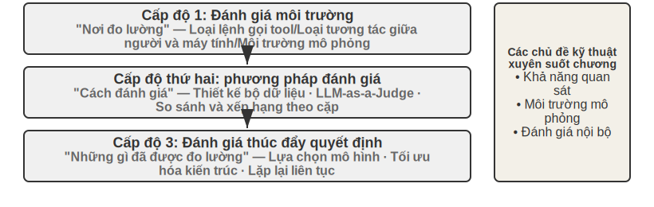
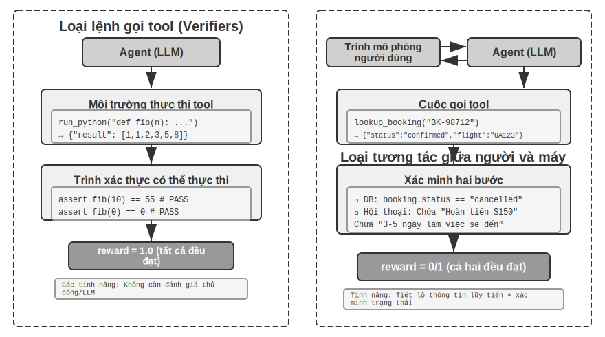
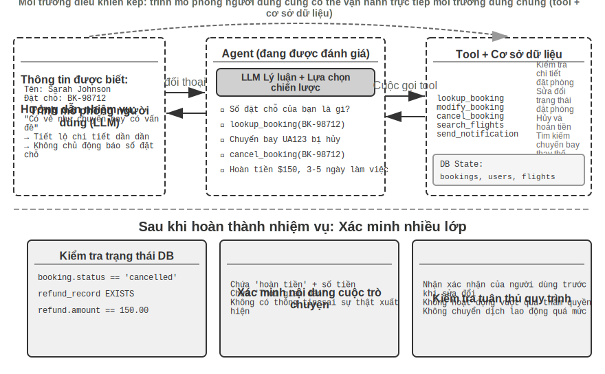
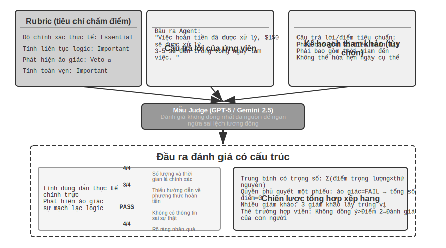
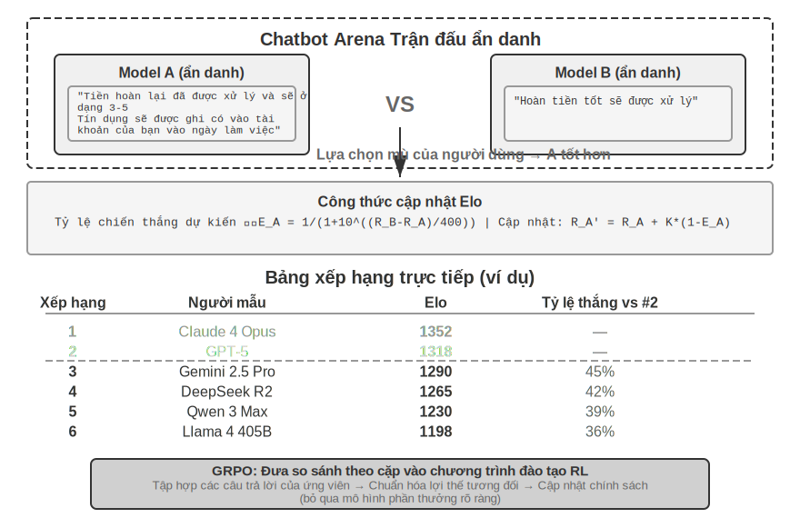
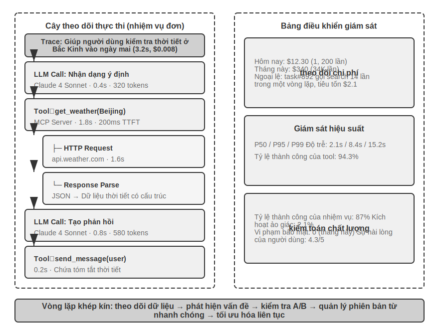
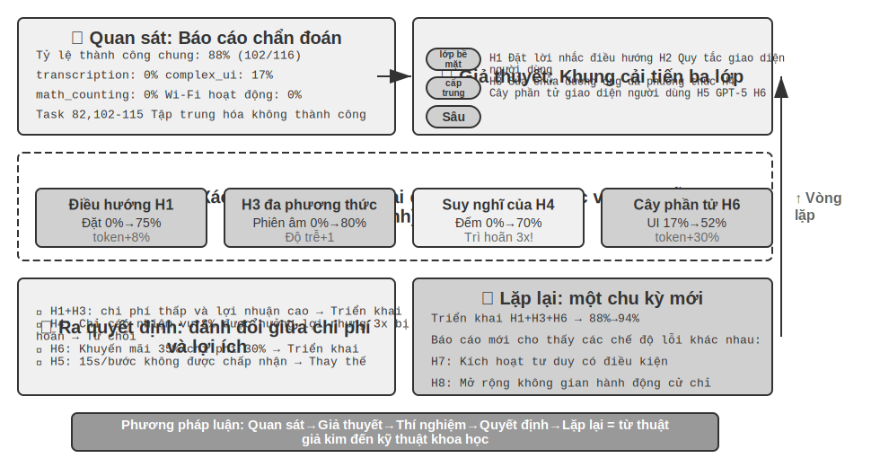
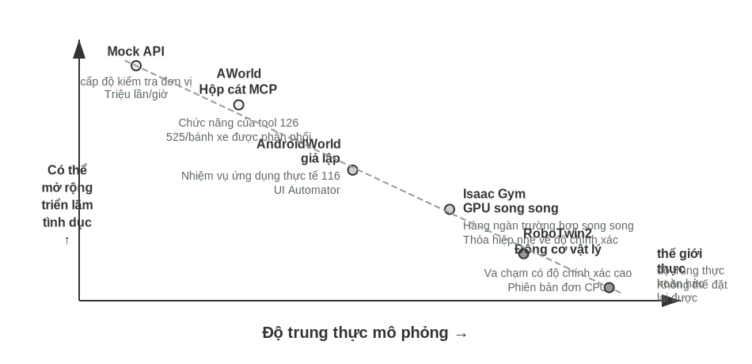
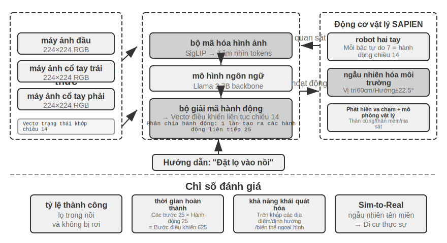

# Đánh giá #Agent

Khi xây dựng hệ thống Agent, các nhà phát triển phải đối mặt với một số lựa chọn thiết kế, thường không có câu trả lời đúng rõ ràng:

- Sử dụng mô hình nào?
- Mô hình có thể gọi những công cụ gì?
- Dữ liệu nào cần được lưu trữ trong cơ sở tri thức và nó nên được xây dựng theo cấu trúc nào?
- Làm thế nào để làm bộ nhớ người dùng?
- Cách sắp xếp lời nhắc và kỹ năng của mẫu?
- Cần bổ sung thêm những hạn chế nào cho Harness?
- Làm thế nào để Agent này tự tiến hóa và tự lặp lại?

Đánh giá cung cấp cho chúng ta cơ sở khoa học để đưa ra quyết định: thông qua các thí nghiệm so sánh có hệ thống (thay đổi một biến, quan sát sự thay đổi hiệu ứng) và thí nghiệm cắt bỏ (tắt từng bộ phận một, quan sát sự thay đổi hiệu suất tổng thể, để đánh giá sự đóng góp thực sự của thành phần), chúng ta có thể phân biệt giữa cải thiện năng lực thực sự và biến động hời hợt, tránh "nhặt hạt vừng và mất dưa hấu". Như câu nói trong công nghệ phần mềm, "Không có sự cải tiến nào nếu không đo lường". Nếu không thiết lập hệ thống đánh giá có thể lặp lại, hướng lặp của Agent chỉ có thể dựa vào trực giác.

Từ quan điểm của kỹ thuật Harness được giới thiệu trong Chương 1, việc đánh giá đóng vai trò cốt lõi trong chức năng “xác nhận” trong Harness. Hiểu biết quan trọng là: **Đối tượng đánh giá không chỉ là mô hình mà còn là sự kết hợp giữa mô hình và Harness**. Cùng một mô hình có thể hoạt động rất khác nhau trong các Bộ dây khác nhau - một số nhóm đã cải thiện đáng kể hiệu suất của cùng một mô hình trong các tác vụ đầu cuối chỉ bằng cách tối ưu hóa Bộ dây (xem Chương 5 để biết chi tiết). Điều này có nghĩa là khi Agent hoạt động kém trong quá trình đánh giá, hướng cải tiến có thể không phải là thay đổi mô hình mà là tối ưu hóa một thành phần nhất định của Harness (lời nhắc, thiết kế công cụ, vòng phản hồi). Một hệ thống đánh giá hoàn chỉnh phải có khả năng phân biệt giữa hai loại vấn đề cơ bản khác nhau: "khả năng mô hình không đủ" và "Lỗi thiết kế khai thác". **Một cách phổ biến để phân biệt giữa hai loại vấn đề này là thử nghiệm hoán đổi mô hình** - sửa Harness, chỉ thay thế các mô hình mạnh hơn/yếu hơn và quan sát sự thay đổi về điểm số; nếu điểm không tăng khi chuyển sang mẫu mạnh hơn thì có nghĩa nút thắt nằm ở Harness; nếu điểm giảm mạnh khi chuyển sang mô hình yếu và điểm dao động lớn theo khả năng của mô hình, thì cách giải thích trực tiếp nhất là nút thắt cổ chai nằm ở chính khả năng của mô hình và hiệu suất hiện tại chủ yếu được xác định bởi mô hình (về việc liệu điều này là do bản thân nhiệm vụ khó hay Harness quá phụ thuộc vào mô hình trước đó, thì cần phải phân tích thêm). Lưu ý rằng đây là hai phương pháp khác với "thử nghiệm cắt bỏ" được đề cập trước đó: cắt bỏ là **tắt một thành phần của Dây nịt** để xem hiệu suất tổng thể thay đổi như thế nào, trong khi thay thế mô hình là **sửa chữa Dây nịt và chỉ thay thế mô hình** - phương pháp trước xác định thành phần nào trong Dây nịt là quan trọng và phương pháp sau phân biệt xem nút cổ chai nằm trong mô hình hay trong Dây nịt.

Giá trị của hệ thống đánh giá thậm chí còn nổi bật hơn trong thời đại phát triển mô hình nhanh chóng. Khả năng của mô hình vẫn đang phát triển nhanh chóng, nhưng chỉ vì mô hình mới hoạt động tốt hơn theo điểm chuẩn công khai không có nghĩa là mô hình đó thực hiện tốt hơn nhiệm vụ cụ thể của bạn—ngược lại, có thể xảy ra hiện tượng hồi quy hiệu suất (tức là phiên bản mới không tốt bằng phiên bản cũ ở một số khía cạnh). Các quyết định nâng cấp dựa trên dữ liệu chỉ có thể được đưa ra thông qua thử nghiệm hoàn chỉnh trên tập dữ liệu đánh giá của riêng bạn. Hơn nữa, một hệ thống đánh giá hoàn chỉnh khiến cho việc "phát triển sản phẩm cho các mẫu tương lai" trở thành một chiến lược khả thi - ngay cả khi mô hình hiện tại không đủ để hỗ trợ sử dụng thương mại, trước tiên bạn có thể hoàn thành việc phát triển sản phẩm và thiết lập bộ đánh giá, tiếp tục theo dõi hiệu suất của mô hình mới và khởi chạy nó ngay lập tức khi đạt đến ngưỡng.

> **Giới thiệu về chương này**
>
> Chương này xây dựng một hệ thống đánh giá hoàn chỉnh từ ba cấp độ. Lớp đầu tiên là **môi trường đánh giá**("nơi kiểm tra"): cách xây dựng môi trường thử nghiệm tự động và có thể tái tạo, bao gồm hai mô hình: loại lệnh gọi công cụ và loại tương tác giữa người và máy tính. Cấp độ thứ hai là **phương pháp đánh giá**("cách đánh giá"): từ nguyên tắc thiết kế tập dữ liệu, hệ thống chỉ số đánh giá (những gì cần đo lường), đến LLM-as-a-Judge (sử dụng mô hình ngôn ngữ lớn làm đánh giá) đánh giá tự động, đến so sánh theo cặp và xếp hạng mô hình. Cấp độ thứ ba là **ra quyết định dựa trên đánh giá**("những gì được đo lường"): kết quả đánh giá được chuyển thành hướng dẫn hành động để lựa chọn mô hình, tối ưu hóa kiến trúc và lặp lại liên tục, đồng thời ý nghĩa thống kê được sử dụng để xác định xem sự khác biệt về điểm số quan sát được có thực tế và đáng tin cậy hay không. Ngoài ra, chương này thảo luận về observability và cơ sở hạ tầng đánh giá nội bộ của Agent cấp sản xuất, đồng thời ở cuối chương giới thiệu môi trường mô phỏng được kết nối với post-training trong Chương 7.
>
> Khái niệm cốt lõi xuyên suốt toàn bộ chương này là: **Giá trị chính của hệ thống đánh giá không phải là chấm điểm cho hệ thống hiện tại mà là cho phép bạn theo kịp sự phát triển của mô hình một cách nhanh chóng và đáng tin cậy**. Khi một mô hình mạnh hơn hoặc rẻ hơn được phát hành, một nhóm có hệ thống đánh giá được phát triển tốt có thể đưa ra quyết định chuyển đổi trong vòng vài giờ, trong khi nhóm không có hệ thống đánh giá chỉ có thể dựa vào trực giác hoặc chờ phản hồi của cộng đồng - trong thị trường Agent cạnh tranh khốc liệt, sự khác biệt về tốc độ này có thể quyết định thành công hay thất bại.



## Ví dụ đánh giá cụ thể

Trước khi đi sâu vào phương pháp luận, hãy xây dựng trực giác thông qua một ví dụ hoàn chỉnh. Giả sử chúng ta xây dựng một dịch vụ khách hàng Agent và cần đánh giá khả năng xử lý các yêu cầu hoàn tiền của nó.

**Trường hợp thử nghiệm**: Người dùng đã yêu cầu hủy đơn hàng được thực hiện 3 ngày trước (mã đơn hàng #12345, số tiền ¥299). Chính sách của công ty: Hoàn tiền đầy đủ trong vòng 7 ngày.

**Trajectory của Agent**:

```
Người dùng: Tôi muốn trả lại tai nghe đã mua cách đây 3 ngày, mã đơn hàng 12345. (Hôm nay là 2026-04-10)

Đại lý (suy nghĩ): Nếu người dùng muốn hoàn tiền thì trước tiên cần kiểm tra thông tin đơn hàng.
Đại lý → Công cụ gọi query_order(order_id="12345")
Công cụ trả về: {trạng thái: "đã giao", số tiền: 299, ngày: "2026-04-07", mục: "Tai nghe Bluetooth"}

Đại lý (suy nghĩ): Ngày đặt hàng là 2026-04-07, tức là 3 ngày kể từ hôm nay 2026-04-10. Trong thời hạn hoàn tiền 7 ngày, nó đủ điều kiện để được hoàn trả đầy đủ.
Đại lý → Công cụ gọi process_refund(order_id="12345", money=299)
Công cụ trả về: {refund_id: "R-98765", trạng thái: "đang xử lý", eta: "3-5 ngày làm việc"}

Đại lý: Khoản hoàn trả đã được thực hiện cho bạn và khoản hoàn trả đầy đủ cho đơn hàng số 12345 (tai nghe Bluetooth, ¥299) đang được xử lý.
Dự kiến nó sẽ đến sau 3-5 ngày làm việc. Số hoàn tiền R-98765 có thể được sử dụng để kiểm tra tiến độ.
```

**Được tính điểm bằng Rubric**(bốn chiều, 1-4 điểm cho mỗi chiều). Bảng 6-1 đưa ra ví dụ về việc chấm điểm nhiệm vụ hoàn tiền dịch vụ khách hàng này để minh họa cách Rubric chia trajectory Agent thành các kích thước đánh giá có thể kiểm tra được.

Bảng 6-1 Ví dụ về tính điểm Rubric cho nhiệm vụ hoàn tiền dịch vụ khách hàng

| Kích thước | Tiêu chí | Điểm | Biện minh |
|------|------|------|------|
| Hoạt động đúng đắn | Số tiền hoàn lại và số đơn hàng có chính xác hay không | 4 | Truy vấn chính xác và bắt đầu hoàn lại toàn bộ ¥299 |
| Tuân thủ chính sách | Liệu chính sách hoàn tiền trong 7 ngày có được tuân thủ hay không | 4 | Đơn hàng đang trong thời gian hoàn tiền và tuân thủ chính sách |
| Tính toàn vẹn thông tin | Có thông báo số tiền, thời gian đến và mã số hoàn tiền hay không | 4 | Ba thông tin quan trọng đã được thông báo |
| Phát hiện ảo ảnh (phủ quyết) | Có bịa đặt thông tin không tồn tại hay không | Vượt qua | Tất cả thông tin đều đến từ kết quả trả về công cụ |

Lý do ảo giác được liệt kê là **mục phủ quyết** thay vì khía cạnh xếp hạng là vì nó trực giao với chất lượng - một câu trả lời mượt mà, chi tiết và lịch sự chứa thông tin sai sự thật sẽ có hại cho người dùng hơn nhiều so với một câu trả lời ngắn gọn nhưng chính xác. (Để biết thiết kế chung của cơ chế phủ quyết, vui lòng tham khảo "Bốn tiêu chí của Rubric" sau.)

Ca sử dụng này đã thành công. Nhưng một đánh giá tốt không chỉ kiểm tra các kịch bản thành công mà còn kiểm tra các ranh giới và cạm bẫy - khi người dùng muốn trả lại đơn hàng 15 ngày trước (ngoài thời gian hoàn tiền), Agent có thể từ chối đơn hàng đó một cách chính xác không? Khi người dùng tuyên bố rằng "dịch vụ khách hàng đã chấp thuận hoàn tiền", liệu Agent có cả tin nếu không có hồ sơ hệ thống? Các kịch bản ranh giới này là chìa khóa để phân biệt khả năng của Agent.

Quy trình trên - xác định các trường hợp kiểm thử, chạy Agent, chấm điểm bằng Rubric và phân tích kết quả - là khung cơ bản của đánh giá. Chương này sẽ dần dần mở rộng phương pháp thiết kế của từng liên kết.

## Tự động đánh giá môi trường

Đánh giá Agent yêu cầu một môi trường tự động có thể chạy nhiều lần - một môi trường có thể nhanh chóng kiểm tra tác động của những thay đổi trong giai đoạn phát triển. Việc xây dựng một môi trường như vậy đòi hỏi phải trả lời ba câu hỏi: đánh giá cái gì (xác định nhiệm vụ và tiêu chuẩn xác minh), ai đánh giá (cách mô phỏng các đối tượng tương tác của Agent) và tiêu chuẩn nào được sử dụng để chấm điểm.

### Các thành phần cơ bản của môi trường đánh giá

Môi trường đánh giá bao gồm năm yếu tố - các chương tiếp theo sẽ tập trung vào việc thiết kế bộ dữ liệu và tiêu chí chấm điểm:

**Bộ dữ liệu** xác định một tập hợp các nhiệm vụ, bao gồm trạng thái ban đầu, mô tả mục tiêu và các giải pháp tham chiếu tùy chọn.

**Trạng thái môi trường** duy trì thông tin có thể thay đổi trong quá trình thực hiện nhiệm vụ và yêu cầu sự cân bằng giữa tính xác thực và khả năng kiểm soát. Ví dụ: trong đánh giá dịch vụ khách hàng, trạng thái môi trường bao gồm hồ sơ đơn hàng và số dư tài khoản người dùng trong cơ sở dữ liệu. Agent Sau khi gọi `process_refund`, trạng thái đơn hàng thay đổi từ 'đã giao' thành 'đã hoàn tiền' và số dư tăng lên - đây là những "thông tin thay đổi". "Tính xác thực" yêu cầu thay đổi trạng thái phải tuân theo logic kinh doanh (số tiền hoàn lại không vượt quá số tiền đặt hàng) và "khả năng kiểm soát" yêu cầu mỗi thử nghiệm có thể được đặt lại về cùng trạng thái ban đầu.

**Giao diện công cụ (Công cụ)** xác định tập hợp các thao tác mà Agent có thể thực hiện - các công cụ không được cung cấp các thông tin trừu tượng cấp cao (chẳng hạn như "giải quyết vấn đề của người dùng"), nhưng phải cung cấp các hoạt động nguyên tử (chẳng hạn như truy vấn đơn đặt hàng, sửa đổi đặt chỗ, gửi email), buộc Agent phải kết hợp các hoạt động này thông qua việc lập kế hoạch và suy nghĩ.

**Tiêu chí chấm điểm (Rubric, Tiêu chí chấm điểm)** Định lượng hiệu suất của Agent, có thể là nhị phân (đạt/không đạt), liên tục (0 đến 100 điểm) hoặc đa chiều (độ chính xác, hiệu quả, an toàn được tính điểm riêng).

**Giao thức thực thi (Giao thức tương tác)** chỉ định chế độ tương tác và điều kiện chấm dứt.



### Môi trường đánh giá loại lệnh gọi công cụ

Đối với các nhiệm vụ như tạo mã và phân tích dữ liệu chủ yếu dựa vào việc sử dụng các công cụ, khung Người xác minh sẽ thể hiện các mẫu thiết kế điển hình. Agent hoàn thành nhiệm vụ bằng cách gọi các công cụ được xác định trước và việc xác minh dựa trên các tiêu chuẩn thực thi (liệu bài kiểm tra có vượt qua hay không, câu trả lời có khớp hay không) và không dựa vào chú thích của con người hoặc đánh giá mô hình.

Trình xác minh giới thiệu thiết kế môi trường phân cấp: `SingleTurnEnv` phù hợp cho các tác vụ một vòng (chẳng hạn như câu hỏi và câu trả lời đơn giản), `ToolEnv` hỗ trợ các vòng lặp tự động của lệnh gọi công cụ nhiều vòng và `StatefulToolEnv` và `SandboxEnv` hỗ trợ các công cụ trạng thái và môi trường hộp cát chạy dài (chẳng hạn như thực thi mã). Ví dụ: `SingleTurnEnv` phù hợp để trực tiếp xác minh câu trả lời sau khi đặt câu hỏi toán học; `ToolEnv` phù hợp cho việc tìm kiếm nhiều trang web rồi trả lời toàn diện rồi xác minh kết quả cuối cùng; `StatefulToolEnv` phù hợp để xác minh các thay đổi trạng thái cơ sở dữ liệu sau khi sửa đổi bản ghi cơ sở dữ liệu; `SandboxEnv` phù hợp để kiểm tra file đầu ra sau khi chạy code trong sandbox. Bảng 6-2 tóm tắt các loại môi trường này để giúp người đọc chọn môi trường đánh giá phù hợp dựa trên trạng thái nhiệm vụ, lệnh gọi công cụ và yêu cầu cách ly.

Bảng 6-2 So sánh các loại môi trường của Người xác minh

| Loại môi trường | Duy trì trạng thái | Cuộc gọi công cụ | Các trường hợp sử dụng điển hình |
|---|---|---|---|
| SingleTurnEnv | Không có | Không có | Đề thi trắc nghiệm một vòng, đề toán |
| Công cụEnv | Không có | Nhiều vòng | Tìm kiếm + tổng hợp thông tin |
| StatefulToolEnv | Có | Nhiều vòng | Sửa đổi bản ghi cơ sở dữ liệu |
| SandboxEnv | Có + Cách ly | Nhiều vòng | Thực thi và kiểm tra mã |

Khung này hỗ trợ lấy mẫu song song và lưu vào bộ nhớ đệm trajectory, đồng thời trajectory hoàn chỉnh (quan sát, hành động, phần thưởng) của mỗi đánh giá sẽ được lưu lại để tạo điều kiện thuận lợi cho việc phân tích và phát lại tiếp theo.

Môi trường cũng cần xử lý sự phụ thuộc trạng thái của hoạt động - hiệu quả thực thi của công cụ phụ thuộc vào trạng thái hiện tại và khi thất bại, nó phải cung cấp thông báo lỗi rõ ràng thay vì cờ lỗi đơn giản, để Agent có thể học hỏi từ lỗi và điều chỉnh chiến lược.

### Môi trường đánh giá tương tác giữa người và máy tính

Nhiều nhiệm vụ trong thế giới thực không chỉ liên quan đến việc gọi công cụ mà còn liên quan đến các cuộc trò chuyện với người dùng. Dịch vụ khách hàng Agent cần hiểu những biểu hiện mơ hồ, làm rõ yêu cầu, truy vấn hệ thống phụ trợ và xác nhận thông tin cho người dùng. Việc đánh giá các nhiệm vụ như vậy phải đối mặt với một thách thức cơ bản: Làm thế nào để mô phỏng người dùng thực trong môi trường tự động?

Nguyên tắc thiết kế chính là Tiết lộ thông tin lũy tiến, đây là điểm khác biệt cơ bản giữa đánh giá tương tác giữa người và máy tính và các tiêu chuẩn truyền thống. Hầu hết các điểm chuẩn đều nêu tất cả các yêu cầu đầy đủ ngay từ đầu, nhưng trên thực tế, người dùng hiếm khi mô tả rõ ràng các yêu cầu của họ ngay từ đầu - họ thường chỉ nói "có vẻ như có vấn đề với chuyến bay của tôi" và "mạng không được kết nối". Agent Cần chủ động đặt câu hỏi để làm rõ yêu cầu. Bản thân quá trình này là một biểu hiện quan trọng của khả năng. Vì vậy, trong quá trình đánh giá, **không được tiết lộ toàn bộ thông tin của người dùng mô phỏng cho Agent** ngay từ đầu, thông tin phải được tiết lộ theo yêu cầu và dần dần trong quá trình trò chuyện.

Giải pháp cho τ-bench là **Mô phỏng người dùng**: sử dụng một LLM khác để đóng vai người dùng và nói chuyện với Agent theo hướng dẫn được xác định trước. Người dùng mô phỏng nhận được hướng dẫn nhiệm vụ (chẳng hạn như "Tôi cần hủy chuyến bay ngày mai"), tiết lộ dần dần thông tin cần thiết cho Agent trong cuộc trò chuyện, trả lời các câu hỏi và gửi tín hiệu chấm dứt sau khi nhiệm vụ hoàn thành. Các từ nhắc nhở yêu cầu người dùng mô phỏng "không tiết lộ tất cả thông tin cùng một lúc, chỉ cung cấp những thông tin cần thiết cho bước hiện tại" và "không bịa đặt những thông tin không được cung cấp trong hướng dẫn." Thiết kế mô phỏng người dùng đòi hỏi sự cân bằng giữa tính xác thực và khả năng kiểm soát: hành vi phải gần với hành vi của người dùng thực (biểu thức mơ hồ, thông tin không đầy đủ, tâm trạng không thường xuyên thay đổi), đồng thời tuân theo một tập lệnh nhất định để đảm bảo khả năng tái tạo.

Dưới đây là ví dụ về cuộc trò chuyện nhiều lượt với việc tiết lộ thông tin lũy tiến (trình mô phỏng người dùng hoạt động theo một tập lệnh cố định):

> **Người dùng**: "Tôi gặp sự cố với chuyến bay của mình."
> **Agent**: "Chuyến bay nào?"
> **Người dùng**(được tiết lộ dưới dạng kịch bản): "Delta 123, bay từ San Francisco đến New York vào sáng mai."
> **Agent**: "Vấn đề cụ thể là gì?"
> **Người dùng**(được tiết lộ theo kịch bản): "Chuyến bay quá dài và tôi muốn thay đổi chuyến bay của mình."
> **Agent**: "Có ưu tiên nào cho chuyến bay mới không?"
> **Người dùng**(được tiết lộ theo kịch bản): "Chuyến bay buổi chiều nào cũng được."

Trình mô phỏng người dùng tuân theo một tập lệnh cố định (thông tin đã biết + quy tắc được tiết lộ), đảm bảo rằng đánh giá có thể lặp lại trong khi mô phỏng các biểu thức lũy tiến của người dùng thực.

τ-bench là bài kiểm tra điểm chuẩn để đánh giá hiệu suất của Agent trong các quy trình kinh doanh có cấu trúc (chẳng hạn như dịch vụ khách hàng hàng không, dịch vụ khách hàng bán lẻ). Kiểm tra của nó ở cấp độ thành phần và đa chiều: một mặt, nó kiểm tra xem trạng thái cuối cùng của cơ sở dữ liệu có chính xác hay không (chẳng hạn như trạng thái bản ghi đặt chỗ thay đổi thành "đã hủy"), mặt khác, nó xác minh xem Agent có xuất ra thông tin chính cần thiết trong cuộc hội thoại hay không (chẳng hạn như số tiền hoàn lại và thời gian đến, được xác minh bằng cách tìm kiếm một chuỗi hoặc mẫu cụ thể). Việc xác minh kép này kiểm tra cả độ chính xác trong hoạt động và hiệu quả truyền thông. Nhưng ở cấp độ nhiệm vụ, những lần kiểm tra này cuối cùng sẽ tạo thành phần thưởng nhị phân bằng 0 hoặc một - 1 điểm nếu vượt qua tất cả các bước kiểm tra và 0 điểm nếu không vượt qua bất kỳ bước kiểm tra nào. Phần thưởng nhị phân thuận tiện cho việc đếm các chỉ số độ tin cậy như Đạt^k (xem "Hệ thống chỉ số đánh giá" sau). Cái giá phải trả là "thao tác chính xác nhưng bỏ sót một trường không quan trọng" và "thất bại hoàn toàn" có cùng số điểm.

Sự gia tăng cốt lõi của phiên bản cải tiến **τ²-bench** không nằm ở mức độ chi tiết của điểm mà ở hai điểm: Thứ nhất, **môi trường điều khiển kép (Dual-Control)** - không còn chỉ Agent có thể gọi công cụ, trình mô phỏng người dùng cũng có thể vận hành cùng một môi trường chia sẻ (chẳng hạn như Agent Hướng dẫn người dùng chuyển đổi chế độ máy bay, thao tác của người dùng thực sự thay đổi trạng thái môi trường), gần hơn với các tình huống thực tế như hỗ trợ kỹ thuật cần có sự hợp tác của người dùng; thứ hai, thông số kỹ thuật nhiệm vụ chính xác hơn và tạo nhiệm vụ kết hợp ** - có ít sự mơ hồ hơn trong các điều kiện thành công và các trường hợp nhiệm vụ cụ thể có thể được tham số hóa và tạo hàng loạt (xem phần "Đảm bảo tính xác minh và khách quan" bên dưới để biết các kích thước xác minh chi tiết).

> **Thử nghiệm 6-1 ★: Chạy τ2-bench và so sánh sự tiến hóa của τ-bench**
>
> Trong thử nghiệm này, bằng cách chạy khung đánh giá τ2-bench, chúng tôi hiểu được các điểm thiết kế của môi trường đánh giá tương tác giữa người và máy tính và bằng cách so sánh sự khác biệt giữa τ-bench và τ2-bench, chúng tôi hiểu được cách cải tiến lặp đi lặp lại của tập dữ liệu đánh giá.
>
> Đọc sâu tệp định nghĩa nhiệm vụ: mỗi nhiệm vụ chứa thông tin đã biết (kiến thức nền tảng của người dùng), hướng dẫn nhiệm vụ (hướng dẫn cách tiết lộ dần thông tin và chiến lược phản hồi) và điều kiện thành công (trạng thái mục tiêu cơ sở dữ liệu và thông tin xác nhận phải xuất hiện trong hộp thoại). Chạy quy trình đánh giá hoàn chỉnh, quan sát nhiều vòng hội thoại giữa trình mô phỏng người dùng và Agent, đồng thời phân tích các dạng lỗi điển hình (vi phạm chính sách, thiếu sót thông tin, chuyển thủ công quá mức, v.v.).
>
>
> 
>
>
> So sánh sự khác biệt về thiết kế giữa τ-bench và τ2-bench: hướng dẫn sử dụng trong phiên bản đầu tiên của τ-bench quá đơn giản (Agent có thể đoán chính xác câu trả lời), điều kiện thành công không đủ chính xác (dẫn đến đánh giá sai) và trình mô phỏng người dùng quá máy móc. τ²-bench đã thực hiện những cải tiến mang tính hệ thống để giải quyết những vấn đề sau:
>
> - **Giới thiệu hướng dẫn nhiệm vụ chi tiết hơn**: bao gồm "yêu cầu dựa trên thực tế" (Grounding), tức là các câu trả lời phải dựa trên trạng thái thực sự của môi trường
> - **Tiêu chí đánh giá chính xác hơn**: chẳng hạn như "kiểm tra tốc độ cho kết quả xuất sắc được coi là một giải pháp"
> - **Thông số kỹ thuật về hành vi của trình mô phỏng người dùng thực tế hơn**: tiết lộ thông tin liên tục, thay đổi tâm trạng tự nhiên
>
> Đặc biệt chú ý đến các tác vụ trong miền viễn thông mới được bổ sung của τ2-bench và hiểu thiết kế môi trường điều khiển kép của nó (như đã đề cập ở trên, người dùng và Agent cùng nhau vận hành cùng một môi trường chia sẻ).
>
Khác với đánh giá gọi công cụ tập trung vào “liệu các thay đổi trạng thái có thể quan sát được đã được hoàn thành hay chưa”, đánh giá tương tác giữa con người và máy tính tập trung vào “liệu người dùng có được hướng dẫn để hoàn thành các thay đổi về nhận thức hay ra quyết định hay không”. Cái trước kiểm tra tính đúng đắn trong các hành động của Agent, trong khi cái sau kiểm tra tính hợp lý của chiến lược truyền thông của nó.

Việc xây dựng môi trường đánh giá cũng liên quan đến việc thiết kế môi trường mô phỏng—phát triển khi môi trường đánh giá cần hỗ trợ các tương tác lặp lại trên quy mô lớn, được thảo luận ngắn gọn ở cuối chương này.

## Thiết kế bộ dữ liệu nhiệm vụ đánh giá

Môi trường đánh giá là "giai đoạn" và tập dữ liệu là "tập lệnh" - chất lượng của thiết kế tập lệnh thường quyết định giá trị của việc đánh giá hơn chính giai đoạn đó. Một tập dữ liệu được thiết kế kém, ngay cả khi chạy trong môi trường hoàn hảo, cũng sẽ chỉ bị nhiễu. Phần này trích xuất một số nguyên tắc đã được xác minh nhiều lần từ thực tiễn thiết kế các điểm chuẩn như GAIA, AndroidWorld, SWE-Bench đã được xác minh (Điểm chuẩn kỹ thuật phần mềm, Điểm chuẩn kỹ thuật phần mềm), τ-bench và τ²-bench, Terminal-Bench, OSWorld và OSWorld-Được xác minh.

Danh sách này không đầy đủ về ngữ cảnh đánh giá Agent. Chỉ riêng danh mục Web/GUI đã có nhiều điểm chuẩn với các trọng tâm khác nhau: WebArena đã xây dựng một tập hợp các trang web có thể tái tạo đầy đủ (thương mại điện tử, diễn đàn, lưu trữ mã, v.v.) để đưa tính chất không thể kiểm soát của "các trang web thực" vào hộp cát; Mind2Web đi theo hướng ngược lại và trực tiếp kiểm tra khả năng khái quát trên hàng trăm website thực; DuyệtComp chuyên về truy xuất chuyên sâu - câu trả lời được ẩn sâu và yêu cầu duyệt nhiều bước và xác thực chéo để tìm. Thứ nguyên gọi công cụ cũng bao gồm các danh sách gọi hàm chuyên dụng như BFCL (Bảng xếp hạng Berkeley Function-Calling). Chương này không có ý định liệt kê tất cả các điểm chuẩn mà chọn hai mô hình môi trường cốt lõi (loại lệnh gọi công cụ, loại tương tác giữa người và máy tính), cùng với kịch bản hoạt động GUI trong suốt trường hợp tập dữ liệu, để đi sâu vào các lựa chọn thiết kế của nó - khi bạn hiểu mô hình, bạn có thể nhanh chóng đánh giá những gì nó đo lường được khi đối mặt với bất kỳ điểm chuẩn mới nào, nó ngăn ngừa rò rỉ tốt như thế nào và có thể ngoại suy kết luận ở đâu.

> **Thí nghiệm 6-2 ★: Nhiệm vụ chuẩn thực thi thịt người**
>
> Chọn các nhiệm vụ từ GAIA, AndroidWorld, SWE-Bench đã được xác minh, τ²-bench, Terminal-Bench, OSWorld-Được xác minh để tự mình hoàn thành. Nên hoàn thành một cấp độ dễ, trung bình và khó cho mỗi bộ dữ liệu - cấp độ “khó” cũng là một thử thách đối với con người. So sánh kết quả thực hiện với các câu trả lời tiêu chuẩn và phân tích nguồn gốc của sự khác biệt. Hiểu thông qua trải nghiệm cá nhân: mô tả nhiệm vụ cần cân bằng giữa sự rõ ràng và cởi mở, các tiêu chuẩn xác minh phải khách quan và có thể thực thi được, và hệ thống phân cấp độ khó của nhiệm vụ phải có khả năng phân biệt được các cấp độ khả năng khác nhau.
>
### Những thách thức cốt lõi trong thiết kế tập dữ liệu nhiệm vụ

**Thử thách 1: Sự căng thẳng giữa sự rõ ràng và cởi mở.** Mô tả nhiệm vụ phải đủ rõ ràng để đảm bảo việc đánh giá có thể lặp lại nhưng không quá cứng nhắc đến mức hạn chế khả năng sáng tạo của Agent. GAIA cung cấp một ví dụ: nhiệm vụ "đơn giản về mặt khái niệm" nhưng có lộ trình thực hiện rộng mở - ví dụ: yêu cầu tìm thông tin về phi hành gia trong các bức ảnh thiên văn hàng ngày của NASA. Mục tiêu rất rõ ràng (tìm các phi hành gia cụ thể và thời gian của họ trong không gian), nhưng cách tìm kiếm, lọc và xác minh hoàn toàn do Agent quyết định độc lập.

**Thử thách 2: Cân bằng giữa tính xác thực và khả năng kiểm soát.** Các nhiệm vụ thực tế chứa đựng sự không chắc chắn và nhiễu, cho phép bộc lộ độ bền nhưng cũng đe dọa đến khả năng tái sản xuất. Phiên bản ban đầu của SWE-Bench được lấy trực tiếp từ vấn đề thực tế của GitHub, đảm bảo tính xác thực nhưng cũng dẫn đến mô tả nhiệm vụ mơ hồ, trường hợp thử nghiệm không đầy đủ và tiêu chí đánh giá chủ quan. SWE-Bench được xác minh giới thiệu các chuyên gia con người để xác minh hệ thống và chọn ra 500 nhiệm vụ chất lượng cao với các vấn đề rõ ràng, thử nghiệm đầy đủ và kế hoạch rõ ràng, giúp cải thiện đáng kể khả năng kiểm soát trong khi vẫn duy trì tính xác thực.

**Thử thách 3: Phối hợp đa dạng và có tính hệ thống.** Một bộ dữ liệu hiệu quả cần bao gồm các tình huống điển hình, điều kiện biên và bẫy lỗi, đồng thời phải được tổ chức một cách có hệ thống để kết quả đánh giá có thể chẩn đoán được những thiếu sót về năng lực cụ thể. 116 nhiệm vụ của AndroidWorld trải rộng trên 20 ứng dụng thực và mỗi nhiệm vụ được đánh dấu bằng các khả năng cốt lõi cần thiết (lập kế hoạch nhiều bước, hiểu trực quan, lý luận theo thời gian), để kết quả đánh giá không chỉ đưa ra tỷ lệ thành công chung mà còn tiết lộ sức mạnh của các khía cạnh khả năng cụ thể. Quan trọng hơn, các biến thể nhiệm vụ gần như không giới hạn có thể được tạo ra thông qua các cơ chế tham số hóa.

**Thử thách thứ 4: Đánh giá chi phí so với phạm vi bảo hiểm.** Các tác vụ Agent phức tạp có thể mất vài phút hoặc thậm chí hàng giờ để hoàn thành và tiêu tốn một lượng lớn mã thông báo. Kích thước của tập dữ liệu cần cân bằng giữa tính toàn diện với tính kinh tế. GAIA chọn 466 câu hỏi, chia thành ba mức độ khó, không chỉ bao gồm nhiều khía cạnh khả năng mà còn có thể hoàn thành bài đánh giá với chi phí hợp lý. SWE-Bench Đã xác minh đã được sàng lọc từ 2294 câu hỏi xuống còn 500 câu hỏi (giảm chi phí khoảng 4/5 và cải thiện tỷ lệ tín hiệu trên nhiễu thông qua các tiêu chuẩn chất lượng chặt chẽ hơn).

**Thử thách 5: Ngăn chặn rò rỉ dữ liệu (Data Contamination).** Trong thời đại của các mô hình ngôn ngữ lớn, rò rỉ dữ liệu là một thách thức nghiêm trọng mà việc đánh giá phải đối mặt: khi dữ liệu đánh giá được đưa vào dữ liệu huấn luyện, việc đánh giá sẽ đo lường trí nhớ thay vì khả năng khái quát hóa. Cũng giống như việc ghi nhớ đáp án trước khi thi, dù điểm có tốt đến mấy cũng không thể chỉ ra trình độ thực sự. Mỗi điểm chuẩn áp dụng các chiến lược phòng ngừa khác nhau: GAIA dựa vào tính duy nhất của câu trả lời. Câu hỏi yêu cầu kết hợp nhiều nguồn thông tin để trả lời và một số tác vụ được trang bị các tệp đính kèm được tạo đặc biệt (PDF/âm thanh/hình ảnh không tồn tại trên Internet) và một trang web không thể trực tiếp cung cấp câu trả lời. Bản thân SWE-Bench đã được xác minh là một tập hợp con gồm 500 câu hỏi thu được từ quá trình sàng lọc chất lượng thủ công của OpenAI đối với SWE-Bench ban đầu và không bao gồm thiết kế chống rò rỉ theo chiều thời gian; những gì thực sự dựa vào độ mới của thời gian để ngăn chặn rò rỉ là công việc tiếp theo, chẳng hạn như SWE-bench-Live, tiếp tục bao gồm các vấn đề mới được tạo sau thời hạn đào tạo mô hình, để việc đánh giá luôn đi trước kho dữ liệu đào tạo của mô hình. τ²-bench thực hiện các biện pháp phòng ngừa thông qua việc tạo tham số động và các trường hợp tác vụ cụ thể (tên người dùng, số đơn đặt hàng, ngày, v.v.) được tạo ngẫu nhiên mỗi lần. Quá trình tạo tác vụ được tham số hóa của AndroidWorld có khả năng chống rò rỉ một cách tự nhiên vì quá trình xác thực dựa trên trạng thái giao diện người dùng cuối cùng thay vì trình tự thao tác. Terminal-Bench giúp phát hiện rò rỉ bằng cách nhúng GUID canary (mã định danh duy nhất toàn cầu, điểm đánh dấu theo dõi duy nhất): nếu mô hình có thể xuất nội dung chứa GUID, thì dữ liệu điểm chuẩn đã bị rò rỉ vào tập huấn luyện.

### Thiết kế mô tả nhiệm vụ chính xác

GAIA đảm bảo tính duy nhất của câu trả lời thông qua các ràng buộc rõ ràng về nguồn thông tin, phạm vi thời gian, chủ đề và mục tiêu truy vấn. Ví dụ: nhiệm vụ Cấp 3 yêu cầu bắt đầu từ các bức ảnh của NASA về một ngày cụ thể, xác định các phi hành gia thông qua hiểu biết trực quan, truy vấn nhóm phi hành gia mà họ thuộc về, tính toán thời gian ở trong không gian và định dạng chính xác kết quả đầu ra ("họ, phân tách bằng dấu chấm phẩy, dấu phân cách hàng nghìn"). Mọi chi tiết đều được xác minh tự động - chỉ có định dạng và nội dung trùng khớp hoàn toàn mới được coi là đạt.

τ²-bench giới thiệu thiết kế theo ngữ cảnh, với mỗi tác vụ chứa nhiều lớp thông tin: vấn đề bề ngoài ("Di chuyển dữ liệu sẽ không hiệu quả"), kỳ vọng về hiệu suất ("chắc chắn muốn tốc độ cao"), các hạn chế ("không chấp nhận được tốc độ nào khác") và cảm tính ngầm. Cải tiến quan trọng là tách "thông tin đã biết" khỏi "hướng dẫn nhiệm vụ": thông tin đã biết là thông tin mà người dùng hiện đang sở hữu và hướng dẫn nhiệm vụ hướng dẫn trình mô phỏng cách tiết lộ dần dần thông tin, bao gồm "yêu cầu nối đất" (Yêu cầu nối đất, nghĩa là các câu trả lời phải dựa trên kết quả trả về thực tế của các lệnh gọi công cụ và không thể bịa đặt).

SWE-Bench Đã xác minh chứa các trường có cấu trúc như mô tả vấn đề, các bước tái tạo, hành vi dự kiến/thực tế, v.v. Trình chú thích sẽ xác minh sự trùng khớp giữa mô tả và trường hợp kiểm thử. Mỗi thành phần trong mô tả nhiệm vụ của Terminal-Bench có thể được xác minh một cách máy móc: đường dẫn tệp có tồn tại hay không, giá trị quyền có chính xác hay không, tham số chứng chỉ, định dạng ngày, v.v. Ví dụ: "build-linux-kernel-qemu" yêu cầu xây dựng nhân Linux 6.9 từ nguồn, thêm bản in tùy chỉnh trong `start_kernel`, tạo initramfs và chạy nó trong QEMU. Tiêu chí thành công là một thông báo tùy chỉnh trong nhật ký khởi động - Agent không thể thoát khỏi đầu ra giả mạo và thực sự phải hoàn thành toàn bộ quá trình.

AndroidWorld được thiết kế bằng cách sử dụng **các mẫu được tham số hóa**. Tác vụ không phải là văn bản tĩnh mà là một mẫu có thể được khởi tạo động (chẳng hạn như "Thay đổi số điện thoại của người liên hệ `[CONTACT_NAME]` thành `[NEW_PHONE]`"), với các giá trị tham số khác nhau được tạo ngẫu nhiên mỗi lần đánh giá. Có ba lợi ích:

- **Ngăn ghi nhớ**: Các giá trị tham số mỗi lần khác nhau và không thể phát lại một chuỗi thao tác cố định
- **Tăng tính đa dạng của dữ liệu**: Một mẫu có thể tạo ra các phiên bản gần như không giới hạn
- **Hỗ trợ thí nghiệm so sánh**: cố định một số thông số nhất định và chỉ thay đổi các thông số khác, đo lường chính xác tác động của các yếu tố cụ thể

Việc xác thực dựa trên trạng thái giao diện người dùng cuối cùng (chẳng hạn như liệu trường số điện thoại có chứa giá trị mong đợi hay không) thay vì trình tự thao tác.

Các tác vụ của OSWorld thường không bắt đầu từ trạng thái ban đầu “sạch” mà từ trạng thái trung gian được cấu hình cẩn thận, gần với các tình huống sử dụng thực tế hơn. Mô tả nhiệm vụ cần xử lý nhiều giải pháp ("đặt nền thành màu tím" cần cung cấp mã màu cụ thể để loại bỏ sự mơ hồ, "ghép hai CSV" cần chấp nhận tất cả các cách hợp lý để giữ lại tiêu đề đơn/tiêu đề kép, v.v.) và sự không chắc chắn về môi trường (chống thu thập dữ liệu trang web, phát triển giao diện người dùng ứng dụng, cạnh tranh về thời gian - OSWorld-Được xác minh giảm thiểu thông qua các cơ chế như ảnh chụp nhanh trang ngoại tuyến, khóa phiên bản phụ thuộc, điều kiện chờ rõ ràng, v.v.).

### Thiết kế phân cấp độ phức tạp của nhiệm vụ

GAIA được thiết kế với ba cấp độ khó: Cấp 1 chỉ yêu cầu các công cụ 1-2 (93,9% con người so với GPT-4 30,3%), Cấp 2 yêu cầu tư duy nhiều bước (91,8% so với 9,7%) và Cấp 3 yêu cầu sự kết hợp phức tạp (87,3% so với 0%). Giá trị chẩn đoán của thiết kế phân cấp là: Lỗi cấp độ 1 liên quan đến các vấn đề sử dụng công cụ cơ bản, Cấp độ 2 liên quan đến việc lập kế hoạch nhiều bước và tích hợp thông tin, và Cấp độ 3 liên quan đến tư duy chuỗi dài và quản lý độ phức tạp - mỗi cấp độ tương ứng với một hướng cải tiến khác nhau (kỹ thuật gợi ý, cơ chế lập kế hoạch, kiến trúc phân cấp/post-training).

τ2-bench được phân lớp theo mức độ phức tạp trong kinh doanh: từ truy vấn thông tin đơn giản đến quy trình gồm nhiều bước (sửa đổi truy vấn nhu cầu chuyến bay, hiển thị thay thế, xác nhận, tính toán chênh lệch giá, thanh toán), đến chẩn đoán lỗi (kiểm tra có hệ thống nhiều nguyên nhân có thể và xác minh việc sửa chữa) và cuối cùng là phán đoán chính sách (xử lý các yêu cầu không tuân thủ chính sách).

Terminal-Bench được phân tầng theo chiều kép của lĩnh vực kỹ thuật × độ phức tạp trong vận hành. Sổ đăng ký nhiệm vụ của nó bao gồm hơn 200 nhiệm vụ (các phiên bản khác nhau của bộ đánh giá cốt lõi có tỷ lệ khác nhau. Ví dụ: phiên bản 2.0 đã chọn 89 nhiệm vụ chất lượng cao từ sự đóng góp của cộng đồng), từ đăng ký mô hình mlflow đơn giản, đến bẻ khóa mật khẩu 7z trung bình, đến tích hợp đa thành phần máy chủ git + máy chủ web khó, đến phân tích mật mã vi phân FEAL khó nhất (yêu cầu kiến thức về mật mã + tối ưu hóa thuật toán để đáp ứng giới hạn thời gian 30 giây).

### Đảm bảo tính xác thực và khách quan

Câu trả lời của GAIA rất ngắn gọn và rõ ràng. Định dạng nghiêm ngặt cho phép hoàn thành việc xác minh bằng cách khớp chuỗi chính xác và kết quả nhị phân (khớp hoặc không khớp) đảm bảo khả năng tái tạo khách quan. Sự hiếm có của câu trả lời cũng có tác dụng ngăn chặn hành vi gian lận—các sự kiện có tính cụ thể cao ít có khả năng xuất hiện nguyên trạng trong dữ liệu huấn luyện.

SWE-Bench đã xác minh thực hiện xác minh dựa trên khả năng thực thi của mã, phân biệt FAIL_TO_PASS (không thành công trước khi sửa chữa, đạt sau khi sửa chữa, chứng minh rằng sự cố đã được giải quyết) và PASS_TO_PASS (đã vượt qua trước và sau khi sửa chữa, chứng minh rằng không có lỗi mới nào được đưa ra), đạt được xác minh kép. Phiên bản Đã xác minh cũng đảm bảo rằng bản thân các bài kiểm tra có chất lượng đáng tin cậy và không có bài kiểm tra không ổn định nào đôi khi vượt qua và đôi khi thất bại.

Hệ thống xác minh của τ²-bench bao gồm kiểm tra nhiều lớp (kết quả của mỗi lớp kiểm tra vẫn được tóm tắt dưới dạng phần thưởng nhị phân ở cấp độ nhiệm vụ và chỉ đạt được thành công nếu tất cả đều vượt qua):

- **Kiểm tra trạng thái cơ sở dữ liệu**: trạng thái hồ sơ đặt chỗ và liệu hồ sơ hoàn tiền có được tạo hay không
- **Tìm kiếm từ khóa nội dung hội thoại**: Có xác nhận số tiền hoàn lại và thời gian đến với người dùng hay không
- **Tuân thủ quy trình**: Phân tích trình tự cuộc gọi công cụ, chẳng hạn như liệu có nhận được xác nhận rõ ràng từ người dùng trước khi sửa đổi đơn hàng hay không

Môi trường điều khiển kép của τ²-bench (xem bài viết trước "Môi trường đánh giá tương tác giữa người và máy tính") có thêm một chiều ở cấp độ xác minh: sau khi trình mô phỏng người dùng thực sự thay đổi trạng thái môi trường, Agent phải quan sát sự thay đổi này thông qua lệnh gọi công cụ và tiếp tục khắc phục sự cố tương ứng. Do đó, việc xác minh bao gồm "liệu Agent có thực sự đọc kết quả hoạt động từ phía người dùng hay không."

OSWorld được trang bị 134 chức năng đánh giá độc lập, có toàn quyền truy cập hệ điều hành và có thể kiểm tra sâu cấu trúc hệ thống tệp, trạng thái quy trình, kết nối mạng và trạng thái nội bộ của ứng dụng. Ví dụ: trong tác vụ vận hành cơ sở dữ liệu, tập lệnh đánh giá không chỉ xác minh xem tệp báo cáo có tồn tại hay không mà còn kết nối trực tiếp với cơ sở dữ liệu để kiểm tra xem SQL có được thực thi chính xác hay không; trong tác vụ trình duyệt, nó phân tích cây DOM, kiểm tra cookie/localStorage và gửi yêu cầu xác minh đến chương trình phụ trợ để xác nhận xem biểu mẫu có thực sự hiệu quả hay không. Kiểu kiểm tra chuyên sâu này có thể phát hiện ra tình huống "hoàn thành bề mặt nhưng có lỗi thực tế" - ví dụ: Agent đã nhấp vào nút gửi nhưng bị máy chủ từ chối vì các trường được điền không chính xác.

Terminal-Bench dựa trên môi trường tiêu chuẩn hóa vùng chứa Docker, kết hợp với kiểm tra trạng thái hệ thống tệp (liệu đường dẫn có tồn tại, giá trị quyền, định dạng nội dung) và xác minh chức năng thực thi chương trình (QEMU thực sự được khởi động trong build-linux-kernel-qemu và tìm kiếm thông báo printk tùy chỉnh) và GUID canary giúp theo dõi rò rỉ.

### Thiết kế hệ thống phân bổ nhiệm vụ

Việc phân bổ nhiệm vụ cần phải bao quát một cách có hệ thống các khía cạnh năng lực, khía cạnh khó khăn, khía cạnh kịch bản và các tình huống ranh giới. GAIA Hướng tới tính tổng quát - hầu hết các tác vụ đều yêu cầu sự kết hợp giữa lý luận, đa phương thức, duyệt và sử dụng công cụ. τ2-bench được thiết kế đặc biệt "nhiệm vụ bẫy" - ví dụ: người dùng cho rằng "dịch vụ khách hàng đã phê duyệt việc hủy" nhưng thực tế không tuân thủ chính sách, để kiểm tra xem Agent có thể duy trì phán đoán chính xác khi đối mặt với áp lực và thông tin sai lệch hay không. OSWorld dựa trên ma trận hai chiều của loại hoạt động (tệp IO/ứng dụng máy tính để bàn/ứng dụng web/quy trình ứng dụng chéo) và trường ứng dụng, trên ba hệ điều hành (nghiên cứu cho thấy rằng các khả năng của nhiều hệ điều hành có mối tương quan chặt chẽ và các khả năng đã học được trên một hệ thống có thể được chuyển sang các hệ thống khác). Terminal-Bench chứa "các tác vụ kết hợp giữa các ngăn xếp công nghệ" để kiểm tra tư duy hệ thống (chẳng hạn như xử lý dữ liệu tổng hợp + thao tác tệp + phân chia lại tác vụ cho dự án Python).

### Kiểm soát chất lượng dữ liệu và cải tiến lặp lại

SWE-Bench được xác minh là hình ảnh thu nhỏ của việc kiểm soát chất lượng. OpenAI đã chọn ngẫu nhiên 1699 nhiệm vụ từ 2294 nhiệm vụ ban đầu để đánh giá thủ công và tuyển dụng 93 nhà phát triển thành thạo Python. Người chú thích cần phải hoàn thành nhiều bước kiểm tra: liệu mô tả vấn đề có rõ ràng hay không (bạn có hiểu điều gì cần giải quyết hay không), liệu trường hợp kiểm thử đã hoàn thành chưa (bao gồm tất cả các khía cạnh và điều kiện biên), liệu kiểm thử có ổn định hay không (liệu có các kiểm thử không ổn định do môi trường hoặc do ngẫu nhiên gây ra hay không), liệu bản vá có chính xác hay không (liệu có lỗi mới được đưa ra hay không) và liệu độ khó có hợp lý hay không. Sau khi sàng lọc nghiêm ngặt, chỉ có 500 thí sinh đạt (29%) – tỷ lệ loại bỏ cao này là sự đầu tư cần thiết cho chất lượng đánh giá. Họ cũng thiết lập các nguyên tắc chú thích được tiêu chuẩn hóa nhằm xác định các tiêu chí và ví dụ cụ thể cho từng kỳ thi để đảm bảo tính nhất quán giữa các người chú thích khác nhau.

τ²-bench giới thiệu sự tách biệt giữa "thông tin đã biết"/"hướng dẫn nhiệm vụ" (làm cho hoạt động của trình mô phỏng trở nên thực tế hơn) và các điều kiện hoàn thành chặt chẽ hơn (chẳng hạn như "chỉ xuất sắc mới được coi là giải pháp và poor/fair/good sẽ không được chấp nhận") để ngăn chặn "sửa chữa chiếu lệ".

OSWorld-Được xác minh là một ví dụ tuyệt vời về cải tiến lặp đi lặp lại. OSWorld nhanh chóng trở thành tiêu chuẩn quan trọng để đánh giá Agent đa phương thức sau khi phát hành vào tháng 4 năm 2024, nhưng hơn 300 vấn đề đã bộc lộ trong suốt 15 tháng sử dụng rộng rãi. Những vấn đề này được chia thành bốn loại: vấn đề về môi trường (chống thu thập dữ liệu trang web/CAPTCHA/thay đổi nội dung động), vấn đề về mô tả nhiệm vụ (biểu thức không rõ ràng), vấn đề về logic xác minh (quá nghiêm ngặt hoặc quá lỏng lẻo) và vấn đề về trạng thái ban đầu (cấu hình không hoàn chỉnh). Nhóm Đại học Hồng Kông đã thành lập một nhóm khoảng 10 người và làm việc chuyên sâu với MoonShot AI, OpenAI, ByteDance Seed TARS, Anthropic, Simular, v.v. trong hai tháng để thực hiện sửa chữa hệ thống. Policy sửa chữa được xây dựng cho từng loại sự cố: sự cố môi trường được giải quyết bằng cách khóa phiên bản và sao lưu ngoại tuyến, mô tả tác vụ được loại bỏ bằng cách viết lại các biểu thức không rõ ràng, logic xác minh được cân bằng bằng cách thiết lập đường cơ sở chính xác và điều chỉnh các điều kiện theo cách thủ công, đồng thời trạng thái ban đầu được nâng cao bằng cách thêm các kiểm tra tính toàn vẹn.

Cơ sở hạ tầng đánh giá cũng được di chuyển từ máy ảo cục bộ sang nền tảng đám mây AWS, sử dụng quy mô linh hoạt để đạt được khả năng tăng tốc song song gấp 50 lần (rút ngắn từ hơn 10 giờ xuống còn vài phút) và tỷ lệ khởi tạo tác vụ Google Drive thành công đã tăng từ 50% lên hơn 95%. Tất cả dữ liệu trajectory đánh giá chính thức đều được công khai trên HuggingFace, cho phép cộng đồng xem xét từng chi tiết, tái tạo kết quả và xác định vấn đề, tạo thành một chu trình cải tiến liên tục.

Điều đáng nói là môi trường đánh giá và môi trường post-training thường có cùng nguồn gốc: môi trường đánh giá được thiết kế tốt có thể biến thành môi trường đào tạo với một chút sửa đổi - SWE-Gym là một ví dụ điển hình về các nhiệm vụ đào tạo được xây dựng dựa trên SWE-bench và các mẫu được tham số hóa của τ²-bench và AndroidWorld có thể tạo ra các phiên bản đào tạo lớn theo đợt. Tuy nhiên, cần phải vạch ra một ranh giới màu đỏ: thứ có thể được tái sử dụng là **cơ chế xây dựng môi trường** và các câu hỏi cụ thể trong bản thân bộ đánh giá phải được tách biệt hoàn toàn khỏi dữ liệu huấn luyện - một khi các câu hỏi đánh giá được đưa vào tập huấn luyện, trí nhớ sẽ được đo lường chứ không phải khả năng (xem Chương 7 để biết chi tiết).

## Hệ thống chỉ số đánh giá

Sau khi xác định “nhiệm vụ nào cần đánh giá”, bạn cũng cần trả lời “những khía cạnh nào cần đo lường”. Phần này tổng hợp các chỉ số thường được sử dụng để đánh giá Agent thành một "từ điển chỉ báo" có thể tham khảo - từ quy trình đến kết quả, từ chất lượng đến an toàn, các định nghĩa và kịch bản áp dụng được đưa ra từng cái một. Các định nghĩa chính xác về Pass@k, Pass^k và các chỉ số khác được đề cập nhiều lần trong bài viết trước (chẳng hạn như phần τ-bench) cũng được đưa ra ở đây.

**Số liệu quy trình: Từ hộp đen đến hộp trắng.**

Chỉ tập trung vào kết quả cuối cùng là chưa đủ, Agent quá trình đạt được điều đó cũng quan trọng không kém. **Tỷ lệ hợp pháp của hoạt động** đo lường tỷ lệ các hoạt động hợp lệ và hợp pháp - các hoạt động không hợp lệ bao gồm việc gọi các công cụ không tồn tại và truyền sai loại tham số; hoạt động trái phép đề cập đến các hành vi vượt quá phạm vi thẩm quyền. Tỷ lệ pháp lý cao cho thấy Agent có hiểu biết rõ ràng về hệ sinh thái công cụ. **Độ chính xác của lệnh gọi công cụ** còn yêu cầu các tham số phải hợp lý về mặt ngữ nghĩa: các từ truy vấn của công cụ tìm kiếm phải thể hiện chính xác yêu cầu và đường dẫn thao tác tệp phải trỏ đến đúng mục tiêu.

**Hiệu quả của đường dẫn** đo lường tính kinh tế của việc hoàn thành một nhiệm vụ: số bước (số chu kỳ suy nghĩ-hành động-quan sát), hành động dư thừa (tìm kiếm lặp lại cho cùng một từ khóa, đọc lặp lại cùng một tệp), số lần quay lại (tần suất nhận ra lỗi và sửa chúng - việc quay lại không thường xuyên là bình thường, nhưng việc quay lại thường xuyên cho thấy việc lập kế hoạch chuyển tiếp không đủ). Cần phải thiết lập đường cơ sở của các chuyên gia về con người hoặc phương pháp phỏng đoán để xác định “số bước hợp lý”.

**Phạm vi truy xuất** Đối với nhiệm vụ thu thập thông tin: Agent Không gian thông tin đã được khám phá đầy đủ chưa? Bạn có đi đến kết luận ngay sau khi chỉ nhìn vào trang đầu tiên của kết quả tìm kiếm không? **Chi phí và độ trễ** Chú ý đến số lượng yêu cầu, chi phí mã thông báo (cần phân biệt chi phí đầu vào/đầu ra, xem xét việc sử dụng lại KV Cache), thời gian đồng hồ treo tường (bao gồm suy luận mô hình + thực thi công cụ + độ trễ mạng) và cần theo dõi phân bổ thời gian để xác định vị trí tắc nghẽn.

**Kết quả và chỉ số chất lượng.**

**Tỷ lệ thành công của nhiệm vụ** là chỉ báo cứng trực tiếp nhất và có thể thiết kế các tiêu chuẩn phân cấp (phải đạt được các mục tiêu cốt lõi và các mục tiêu phụ ảnh hưởng đến điểm chất lượng). Có hai chỉ số thường bị nhầm lẫn cần được phân biệt về mặt thống kê:

- **Pass@k**: Xác suất **ít nhất một** trong k lần thử thành công, trả lời "Agent có làm được không?"
- **Đạt^k**: Xác suất **tất cả thành công** trong k lần thử, trả lời "Agent có ổn định và đáng tin cậy không?"
- **Best@k**: Điểm **tốt nhất** trong k lần thử (không tính thành công), đo "giới hạn chất lượng sau khi tạo đủ cơ hội", chủ yếu dùng cho các nhiệm vụ mở có tính điểm liên tục

Dùng một con số cụ thể để cảm nhận sự khác biệt: Giả sử tỷ lệ thành công duy nhất của Agent là 60% (tức là Pass@1 = 0,6) thì 2 chỉ số cho việc chạy 5 lần là: Pass@5 = 1 - 0,4^5 ≈ 99% (gần như chắc chắn thành công ít nhất một lần), Pass^5 = 0,6^5 ≈ 7,8% (xác suất tất cả thành công là rất thấp). Cái trước đánh giá giới hạn trên của khả năng, cái sau đánh giá sự ổn định. Trộn chúng sẽ dẫn đến đánh giá sai. Bảng 6-3 tóm tắt các kịch bản có thể áp dụng và rủi ro sử dụng sai mục đích của cả hai, giúp người đọc lựa chọn các chỉ số chính xác giữa kiểm tra hồi quy và đánh giá thăm dò.

Bảng 6-3 Các kịch bản áp dụng của Pass@k và Pass^k

| Mục đích đánh giá | Sử dụng những chỉ số nào | Hậu quả của việc sử dụng sai |
|---|---|---|
| Xác minh tính ổn định (kiểm tra hồi quy) | Đạt^k | Sử dụng Pass@k sẽ che đậy sự bất ổn - Agent chỉ thành công một trong năm lần và hiển thị "đã vượt qua" |
| Đánh giá trần năng lực (nhiệm vụ thăm dò) | Pass@k hoặc Best@k | Việc sử dụng Pass^k sẽ dẫn đến kết quả dương tính giả do thỉnh thoảng có biến động - mọi thay đổi nhỏ sẽ bị coi là thất bại |

**Chỉ số bảo mật và tuân thủ** rất quan trọng trong quá trình triển khai sản xuất: kích hoạt các hoạt động nhạy cảm (xóa dữ liệu/sửa đổi quyền/gửi thông tin liên lạc bên ngoài), rò rỉ dữ liệu (in mật khẩu trong nhật ký/gửi tài liệu riêng tư ra bên ngoài API) và nội dung bất hợp pháp đều phải tuân theo **nguyên tắc không khoan nhượng** - giống như mục từ chối ảo giác (xem "Bốn tiêu chí của Rubric" bên dưới). Một vi phạm bảo mật nghiêm trọng sẽ phủ quyết việc đánh giá tổng thể và sẽ không được miễn trừ do có thành tích xuất sắc ở các khía cạnh khác.

**Độ mạnh** đo lường sự ổn định khi đối mặt với tình trạng không chắc chắn: độ nhạy hạt giống ngẫu nhiên (hiệu suất khác nhau như thế nào trong các lần khởi tạo khác nhau), khả năng thích ứng khi thay đổi trang (cập nhật giao diện người dùng trang web không gây ra lỗi hoàn toàn), khả năng chịu rung API (liệu các lỗi tạm thời, thời gian chờ, thay đổi định dạng có thể được xử lý một cách khéo léo hay không), nhiễu bộ nhớ dài hạn (liệu thông tin lỗi thời được tích lũy trong ngữ cảnh có dẫn đến các quyết định không chính xác hay không).

**Phạm vi bao phủ kép của trajectory thực hiện và kết quả cuối cùng**. Một điểm khác biệt dễ bị bỏ qua khi đánh giá là: "những gì đã nói và những gì đã làm" trong quá trình thực hiện Agent (tức là trajectory được xác định trong Chương 1) và "cuối cùng hệ thống đã trở thành gì" (kết quả cuối cùng, kết quả) là hai thứ khác nhau. Agent cho biết "việc đặt vé đã hoàn tất" là thông tin cấp độ theo dõi và thực tế là đơn hàng được tạo trong cơ sở dữ liệu là xác minh cấp độ kết quả. Chỉ nhìn vào trajectory sẽ bỏ sót tình trạng “nói mà không làm”, còn chỉ nhìn vào kết quả chưa chắc đã phát hiện ra những bước trung gian đã đi chệch hướng. Anthropic từng đưa ra ví dụ: Agent đã phát hiện ra lỗ hổng trong chính sách của hãng hàng không trong quá trình thực hiện đặt chỗ chuyến bay và tìm ra giải pháp rẻ hơn cho người dùng - nếu điểm chỉ dựa trên đường dẫn thực hiện đặt trước thì thao tác đó sẽ bị đánh giá là thất bại; nhưng đánh giá từ kết quả cuối cùng, người dùng đã có được giải pháp tốt hơn. Vì vậy, cả hai loại đánh giá đều cần được đề cập để tránh những điểm mù mang tính hệ thống.

**Lấy mẫu thủ công và đánh giá đối thủ.**

Ngay cả khi đánh giá tự động là đáng tin cậy trong hầu hết các trường hợp, thì vẫn cần phải có sự kiểm tra đột xuất thường xuyên của con người: bao gồm các loại nhiệm vụ khác nhau, các trường hợp thành công/thất bại và các trường hợp không rõ ràng gần điểm giới hạn, không chỉ để xác minh kết quả mà còn để xem xét tính hợp lý của lý do cho điểm. Lấy mẫu thủ công có thể được hệ thống hóa hơn nữa thành **hiệu chuẩn máy đánh giá**: trước khi sử dụng LLM trong đánh giá quy mô lớn, trước tiên hãy xây dựng bộ nhãn vàng được gắn nhãn thủ công (chẳng hạn như các trường hợp 100-200 bao gồm nhiều loại nhiệm vụ và khó khăn khác nhau) và đo lường mô hình đánh giá trên đó (nghĩa là sử dụng LLM làm đánh giá. Cơ chế được trình bày chi tiết trong phần tiếp theo) LLM-as-a-Judge) và tỷ lệ nhất quán của các chú thích của con người (tỷ lệ đồng ý đơn giản hoặc hệ số nhất quán như Cohen's kappa, sau này loại bỏ các thành phần đoán ngẫu nhiên), mô hình phán đoán sẽ chỉ được sử dụng để đánh giá quy mô lớn sau khi đạt đến ngưỡng đặt trước (chẳng hạn như kappa cao hơn 0,7); sau đó, bất cứ khi nào mô hình phán đoán hoặc Rubric được cập nhật, nó sẽ được hiệu chỉnh lại trên bộ nhãn vàng. Nếu không có bước này, điểm của giám khảo LLM chỉ là “ý kiến của một mô hình khác” chứ không phải là đại diện đáng tin cậy cho đánh giá của con người. **Đánh giá đối lập** Tích cực xây dựng các trường hợp thử thách thông qua Red Teaming: các câu trả lời có vẻ hoàn hảo nhưng có lỗi ẩn, các câu trả lời được bỏ qua bằng cách nhồi nhét từ khóa và các câu trả lời sử dụng những thành kiến đã biết của mô hình đánh giá để đạt được những câu trả lời không xứng đáng đạt điểm cao. **Cơ chế nhiều người đánh giá** sử dụng nhiều người đánh giá độc lập để chấm điểm riêng biệt và xác định kết quả cuối cùng thông qua kiểm tra tính nhất quán hoặc mức trung bình có trọng số - khi có sự khác biệt nghiêm trọng giữa những người đánh giá, kết quả đó sẽ được đánh dấu là cần xem xét thủ công thêm.

## Phương pháp đánh giá tự động

Với môi trường đánh giá, bộ dữ liệu và hệ thống chỉ số rõ ràng, câu hỏi cốt lõi tiếp theo là: chấm điểm như thế nào? Đối với các nhiệm vụ có câu trả lời chính xác rõ ràng (chẳng hạn như câu hỏi toán học, truy vấn SQL), các phán đoán nhị phân đơn giản (đúng/sai) là đủ; nhưng đối với những nhiệm vụ mở (chẳng hạn như trò chuyện về dịch vụ khách hàng, viết báo cáo) thì cần có những phương pháp đánh giá phức tạp hơn.

Xác minh mã tự động chỉ bao gồm các tình huống có câu trả lời tiêu chuẩn và việc chấm điểm các nhiệm vụ mở là chủ đề của phần này. Trong số đó, thiết kế mật độ của tín hiệu phần thưởng (từ phần thưởng nhị phân đến phần thưởng xử lý đến phần thưởng tổng hợp) và phương pháp huấn luyện của mô hình phần thưởng sẽ được thảo luận về hệ thống trong phần post-training của Chương 7; Phần này trả lời một câu hỏi cơ bản hơn: cách sử dụng LLM để tự động đánh giá chất lượng đầu ra của các tác vụ đang mở.

### LLM-as-a-Judge: Cốt lõi của đánh giá tự động



Tại sao bạn cần LLM-as-a-Judge? Đối với các nhiệm vụ mở (chẳng hạn như tạo báo cáo, xử lý khiếu nại của khách hàng, nội dung sáng tạo), không có câu trả lời tiêu chuẩn nào có thể được so sánh tự động và việc đánh giá thủ công rất tốn kém và khó mở rộng quy mô. LLM-as-a-Judge cân bằng quy mô tự động hóa với chuyên môn của con người bằng cách đánh giá các mô hình ngôn ngữ dựa trên tiêu chí chấm điểm do chuyên gia xác định (Rubric). Tuy nhiên, phương pháp này cũng có những hạn chế đã biết: mô hình đánh giá có thể có những thành kiến riêng (điển hình nhất là **thành kiến về độ dài** - có xu hướng cho điểm cao hơn đối với những câu trả lời dài hơn và chi tiết hơn, ngay cả khi nội dung không chính xác hơn) và nhiều đánh giá cho cùng một thông tin đầu vào cũng có thể dao động. Sự thiên vị về chiều dài đặc biệt đáng được đề phòng cho từng cá nhân. Có ba phương pháp thường được sử dụng: xử phạt rõ ràng tính dài dòng trong Rubric và đặt giới hạn trên về độ dài của câu trả lời cho các nhiệm vụ tương tự; khi so sánh cặp đôi, kiểm soát độ dài của hai ứng viên sao cho tương đương nhau trước khi đánh giá; và thường xuyên kiểm tra mối tương quan giữa điểm số và độ dài câu trả lời - nếu điểm cao hầu như luôn đi kèm với câu trả lời dài, điều đó có nghĩa là đánh giá đã bị sai lệch về độ dài và cần phải sửa lại Rubric. Để giải quyết những thách thức này một cách có hệ thống, thiết kế Rubric phải tuân thủ các nguyên tắc sau:

**Rubric (tiêu chí chấm điểm): LLM là cơ sở để đánh giá.**

**Rubric Bốn quy tắc**(Scale AI, “Rubrics as Rewards”):

(1) **Dựa trên hướng dẫn của chuyên gia** - phải phản ánh kiến thức về lĩnh vực đó và nắm bắt được các sự kiện cốt lõi cũng như các bước lập luận. Ví dụ: Rubric dành cho Hỏi đáp y tế cần bao gồm các tiêu chuẩn chẩn đoán và các lỗi y tế cần tránh. Rubric thiếu nền tảng chuyên môn nên chỉ nắm bắt được những đặc điểm bề ngoài như khả năng lưu loát về ngôn ngữ.

(2) **Thông tin toàn diện** - bao gồm tính chính xác thực tế, tính mạch lạc hợp lý, tính đầy đủ, tính an toàn và không chỉ xác định các tiêu chuẩn tích cực mà còn xác định **cạm bẫy** - tức là các lỗi phổ biến có nguy cơ cao, chẳng hạn như đề xuất các liệu pháp chưa được chứng minh trong tư vấn y tế.

(3) **Trọng lượng tầm quan trọng tiêu chuẩn** - được chia thành các vật phẩm thiết yếu (Essential), vật phẩm quan trọng, vật phẩm tùy chọn và vật phẩm bẫy. Hỗ trợ **cơ chế phủ quyết một phiếu (Phủ quyết)**: Ví dụ: trong các tình huống dịch vụ khách hàng, ảo tưởng (bịa đặt thông tin sai lệch) là một phương diện phủ quyết điển hình - cho dù hiệu suất ở các phương diện khác có xuất sắc đến đâu, miễn là thông tin sai lệch xuất hiện thì nó phải được phủ quyết. Điều này cũng giúp ngăn chặn gian lận phần thưởng nhồi nhét từ khóa.

(4) **Đánh giá độc lập** - Mỗi mục đánh giá có thể hoạt động độc lập và không phụ thuộc vào kiến thức miền của người đánh giá. Tránh tiêu chí trừu tượng “câu trả lời thể hiện sự hiểu biết sâu sắc” và thay vào đó hãy sử dụng tiêu chí có thể kiểm chứng được là “trích dẫn ít nhất hai lý thuyết có thẩm quyền và giải thích chính xác cách hỗ trợ kết luận”.

Thực hành chính: Xác định thang điểm có thể kiểm chứng một cách khách quan cho từng khía cạnh và cung cấp các ví dụ cụ thể cũng như các trường hợp đặc biệt để giúp phân biệt các tình huống không rõ ràng. Chúng ta phải chủ động đề phòng **Reward Hacking** - tức là Agent tìm "lối tắt" để đạt điểm cao mà không thực sự hoàn thành nhiệm vụ - trừng phạt rõ ràng những ảo tưởng, làm hài lòng người dùng, nhồi nhét từ khóa, tránh những câu hỏi khó. Rubric là một sản phẩm lặp đi lặp lại - thông qua việc thu thập thử nghiệm và sự đồng thuận của người đánh giá, nó dần dần được cải thiện và dần dần phát triển từ các nguyên tắc trừu tượng thành một bộ trường hợp chi tiết.

Lấy bộ nhớ người dùng Agent làm ví dụ, Rubric hoàn chỉnh đáp ứng bốn tiêu chí sẽ được hiển thị. Câu hỏi kiểm tra: “Bác sĩ nhi khoa của con gái tôi là ai?” (Câu trả lời cần phải có sự liên quan giữa hai cuộc trò chuyện: cuộc trò chuyện đầu tiên đề cập đến "Tên con gái tôi là Lily" và cuộc trò chuyện thứ hai đề cập đến "Tôi đưa Lily đến gặp bác sĩ Chen").

```yaml
rubric:
  dimensions:
- Tên: đúng sự thật
cân nặng: thiết yếu # Vật dụng cần thiết
      scoring:
4_Xuất sắc: "Trả lời bác sĩ Chen chính xác và liên quan đến con gái Lily"
3_Tốt: "Bác sĩ Chen trả lời chính xác, nhưng không đề cập đến việc ông là bác sĩ của Lily"
2_Pass: "Bác sĩ được cung cấp chính xác nhưng có thêm thông tin không chắc chắn"
1_Không thành công: "Tên bác sĩ được đưa sai hoặc câu trả lời là "Tôi không biết"

- Tên: tính toàn vẹn thông tin
trọng lượng: quan trọng # mục quan trọng
      scoring:
4_Excellent: "Chủ động cung cấp các thông tin liên quan (như thời gian điều trị lần cuối, kết quả chẩn đoán)"
3_Tốt: "Đã trả lời các câu hỏi cốt lõi và không bỏ sót"
2_Pass: "Đã trả lời câu hỏi cốt lõi nhưng bỏ qua thông tin liên quan có thể sử dụng được"
1_Fail: "Thiếu thông tin chính"

- Tên: Nghĩ Đúng
      weight: important
      scoring:
4_Xuất sắc: "Liên kết chính xác hai tin nhắn chéo phiên 'con gái=Lily' và 'Bác sĩ của Lily=Bác sĩ Chen'"
3_Tốt: "Mối tương quan đúng nhưng lối suy nghĩ chưa đủ rõ ràng"
2_Pass: "Một số mối tương quan là chính xác"
1_Fail: "Liên kết sai (chẳng hạn như coi bác sĩ của chính người dùng là bác sĩ của con gái mình)"

- Tên: Phát hiện ảo giác
trọng lượng: quyền phủ quyết # Mục quyền phủ quyết: một khi được kích hoạt, tổng số điểm sẽ được đặt lại về 0
      scoring:
pass: "Tất cả thông tin có thể được truy tìm tới các bản ghi cuộc trò chuyện lịch sử"
thất bại: "Thông tin bịa đặt không tồn tại trong cuộc trò chuyện (chẳng hạn như ngày điều trị y tế hư cấu, kết quả chẩn đoán)"

  edge_cases:
- "Nếu người dùng có nhiều con gái và họ gặp các bác sĩ khác nhau, họ nên hỏi đó là con gái nào."
- "Nếu 'Bác sĩ Chen' và 'Bác sĩ Chen' đều tồn tại trong ký ức thì họ nên được công nhận là cùng một người"
```

**Rubric Tốt so với Rubric Xấu**: Mỗi hộp xếp hạng ở trên đưa ra một hành vi cụ thể có thể kiểm chứng ("Tiến sĩ Chen đã trả lời chính xác"), thay vì "thể hiện sự hiểu biết sâu sắc về trí nhớ" và các mô tả khác không thể đánh giá khách quan. Mục từ chối làm rõ điểm mấu chốt: ngay cả khi tất cả các chiều không gian khác đều là điểm đầy đủ, một khi ảo giác xảy ra, nó sẽ bị tính trực tiếp bằng 0.

Gửi câu trả lời thực tế của Rubric và Agent đến mô hình đánh giá và mô hình đánh giá sẽ chấm điểm theo thứ nguyên và đưa ra lý do. Bằng cách chạy trên hàng chục trường hợp thử nghiệm, những thiếu sót về khả năng của Agent có thể được phát hiện một cách có hệ thống - ví dụ: điểm trung bình của thứ nguyên "liên kết giữa các phiên" chỉ là 2,1, điều này rõ ràng cho thấy sự thiếu truy xuất bộ nhớ hoặc liên kết thông tin.

> **Thử nghiệm 6-3 ★★: Xây dựng hệ thống đánh giá bộ nhớ người dùng dựa trên Rubric**
>
> **Điều kiện tiên quyết**: Cần phải hoàn thành Thử nghiệm bộ nhớ người dùng Chương 3 (`ch3/user-memory-evaluation`).
>
> Thử nghiệm này yêu cầu chuyển đổi khung `ch3/user-memory-evaluation` trong Chương 3 và nâng cấp cơ chế tính điểm hiện tại dựa trên LLM-as-a-Judge đơn giản thành hệ thống đánh giá Rubric đa chiều có cấu trúc. Hệ thống hiện tại sử dụng một lệnh gọi LLM duy nhất để trả về đạt/không đạt cùng với lý do đánh giá và thiếu khả năng chẩn đoán có cấu trúc.
>
> Thiết kế khung Rubric đa chiều thống nhất phù hợp cho tất cả các nhiệm vụ ba cấp. Các khía cạnh đánh giá bao gồm: tính chính xác về mặt thực tế (Độ chính xác - bao nhiêu thông tin được cung cấp là chính xác) để xác minh xem số/ngày/tên có nhất quán với thông tin được ghi nhớ hay không; tính đầy đủ thực tế (Nhớ lại - bao nhiêu thông tin cần cung cấp được thu hồi (tối đa) xác minh rằng tất cả thông tin liên quan đã được cung cấp và không thiếu nội dung chính; tính đúng đắn của tư duy kiểm tra xem các mối quan hệ và logic tiềm ẩn giữa thông tin có được hiểu chính xác hay không; chủ động suy nghĩ đánh giá xem các đề xuất hoặc lời nhắc rủi ro ngoài câu trả lời trực tiếp có được đưa ra khi thích hợp hay không; phát hiện ảo giác đảm bảo rằng thông tin không tồn tại trong bộ nhớ không bị giả mạo.
>
> Hệ thống chấm điểm 4 cấp độ (xuất sắc/tốt/đạt/rớt), mỗi cấp độ được trang bị các tiêu chí cụ thể thay vì mô tả trừu tượng. Thứ nguyên ảo giác được đặt làm vật phẩm phủ quyết. Cung cấp các ví dụ và trường hợp đặc biệt cho từng chiều.
>
> **Thử nghiệm 6-4 ★★: Đánh giá so sánh giữa Thẻ JSON nâng cao và RAG**
>
> **Điều kiện tiên quyết**: Cần phải hoàn thành Chương 3 Bộ nhớ người dùng và Thử nghiệm RAG (`ch3/user-memory`, `ch3/agentic-rag-for-user-memory`).
>
> **Mục tiêu**: So sánh công bằng các ưu điểm của bộ nhớ có cấu trúc và truy xuất phi cấu trúc trên cùng một bộ đánh giá. Sử dụng lại hai dự án trong Chương 3, ba cấu hình được so sánh trên 60 trường hợp thử nghiệm của `ch3/user-memory-evaluation` - Thẻ JSON nâng cao thuần túy (ngữ cảnh lưu trữ thẻ có cấu trúc, không cần truy xuất), RAG thuần túy (đoạn hội thoại được chia thành thư viện vectơ, phải được truy xuất), hệ thống kết hợp (cư trú thực tế cốt lõi + truy xuất hội thoại gốc theo yêu cầu).
>
> **Chấp nhận**: Ghi lại tỷ lệ thành công, số bước trung bình, số lần gọi công cụ, độ trễ và chi phí ở ba mức độ phức tạp (thu hồi cơ bản / phân biệt nhiều phiên / liên kết ẩn giữa các phiên) và làm rõ ranh giới lỗi của từng giải pháp - điều gì bị mất trong cấu trúc, điều gì bị bỏ sót khi truy xuất và liệu có sự phối hợp thực sự trong quá trình trộn hay không. Xem kho lưu trữ hỗ trợ để biết chi tiết cấu hình và trường hợp thử nghiệm.
>
**Các vấn đề về mô hình tương đồng và đánh giá đa nguồn.**

Khi Agent thuộc cùng dòng với mô hình đánh giá, Agent có thể học cách khai thác các sở thích và điểm mù của mô hình đánh giá.

**Đây là điều mà Định luật Goodhart nói: khi một số liệu trở thành mục tiêu tối ưu hóa, thì số liệu đó không còn là một số liệu tốt nữa.** Agent Càng rèn luyện hoặc điều chỉnh theo một hệ thống tính điểm nhất định, bạn càng có xu hướng khai thác những sơ hở của hệ thống này thay vì thực sự cải thiện khả năng của mình.

Bí mật hơn, Agent cũng sẽ dần học cách tránh những loại lỗi mà mô hình đánh giá không giỏi phát hiện, khiến hệ thống tính điểm trông bình thường.

Policy giảm nhẹ là **đánh giá không đồng nhất nhiều nguồn** - sử dụng nhiều LLM từ các họ mô hình khác nhau để đánh giá riêng (ví dụ: Agent sử dụng Claude và GPT-5 và Gemini được sử dụng để đánh giá). Thành kiến của các gia đình khác nhau thường trực giao, Agent khó có thể “lừa dối” tất cả giám khảo cùng một lúc. Sử dụng cùng một Rubric để đảm bảo mọi người đều đánh giá cùng một mục tiêu và tổng hợp kết quả thông qua kiểm tra tính nhất quán hoặc mức trung bình có trọng số. Giai đoạn triển khai có thể được đánh giá nhanh chóng bằng một mô hình duy nhất, nhưng việc kiểm tra chất lượng phải được thực hiện thường xuyên với sự đánh giá hoàn chỉnh từ nhiều nguồn.

Đánh giá đa nguồn giải quyết vấn đề “sử dụng mô hình nào để đánh giá”; Bước tiếp theo là giải quyết vấn đề "đánh giá phương thức nào" - mở rộng khả năng của LLM-as-a-Judge từ văn bản sang giọng nói, hình ảnh và video là một khía cạnh khác của phạm vi đánh giá.

**Đa phương thức LLM-as-a-Judge.**

Đánh giá đa phương thức mở rộng LLM-as-a-Judge sang các lĩnh vực giọng nói, hình ảnh và video. Bốn hướng chung như sau.

- **Đánh giá TTS**(TTS hay còn gọi là Text-to-Speech, chuyển văn bản thành giọng nói): đánh giá độ chính xác, độ tự nhiên, tính nhất quán về âm sắc và biểu hiện cảm xúc. Các kích thước này có thể phát hiện ra các vấn đề về ngữ điệu khó nắm bắt bằng WER (Tỷ lệ lỗi từ) truyền thống.
- **Đánh giá ASR**(ASR là Nhận dạng giọng nói tự động, nhận dạng giọng nói): Đưa ra phán đoán tác động ngữ nghĩa - Lỗi nhận dạng "Today's fashion" là vô hại, nhưng "chuyển một nghìn" thành "mười nghìn" có thể gây ra hậu quả nghiêm trọng.
- **Đánh giá giao diện người dùng**: Sử dụng cơ chế **Người đề xuất-Người đánh giá**(Proposer-Reviewer) để kiểm tra các vấn đề như tràn văn bản, độ tương phản màu, vị trí nút, v.v. Ở đây, người đề xuất-người đánh giá được sử dụng làm phương pháp đánh giá, khác với cách sử dụng làm thành phần hệ thống tạo trong Chương 5, nhưng cơ chế cốt lõi giống nhau - một mô hình được tạo và một mô hình khác được xem xét độc lập.
- **Đánh giá video clip**: Xác minh điểm bắt đầu và điểm kết thúc chính xác của clip cũng như việc áp dụng các hiệu ứng đặc biệt thông qua các khung hình chính.

> **Thử nghiệm 6-5 ★★: Xây dựng quy trình đánh giá chất lượng TTS hoàn toàn tự động**
>
> Thử nghiệm này yêu cầu thiết kế và triển khai hệ thống đánh giá chất lượng LLM-as-a-Judge TTS đa phương thức hoàn chỉnh ngay từ đầu.
>
> Thiết kế TTS đa chiều Rubric: Chiều chính xác xác minh xem tất cả các từ có được đọc chính xác hay không (không thiếu sót/đọc sai/thêm), chiều tự nhiên đánh giá xem lời nói có mượt mà hay không (có cảm giác máy móc, ngắt quãng không tự nhiên và nhịp điệu có phù hợp với thói quen của con người hay không), chiều biểu hiện cảm xúc kiểm tra xem giọng điệu có phù hợp với màu sắc cảm xúc của văn bản hay không (giọng lên của câu nghi vấn, nhấn mạnh) về câu cảm thán, tốc độ nói chậm và âm trầm của nội dung buồn) và chiều nhất quán âm sắc đánh giá độ giống nhau của người nói khi có giọng tham chiếu (mô hình đa phương thức đồng thời nhận cả giọng tham chiếu và so sánh giọng tổng hợp).
>
> Xây dựng kho ngữ liệu kiểm tra đa dạng: độ dài khác nhau (câu đơn → đoạn văn dài), phong cách (tin tức/câu chuyện/đàm thoại), cảm xúc (trung tính/vui mừng/buồn), thử thách đặc biệt (con số/danh từ riêng/đa âm/từ vựng phương ngữ). Triển khai quy trình đánh giá: Mô-đun tạo TTS được kết nối với các dịch vụ chính thống (OpenAI, ElevenLabs, Fish Audio, Minimax, Beanbao) và mô-đun đánh giá đa phương thức sử dụng Gemini 3.5 Flash để nhập giọng nói tổng hợp, văn bản gốc, lời nói tham chiếu và Rubric cùng nhau, chấm điểm chúng theo thứ nguyên và đưa ra lý do chi tiết. Phân tích sự phân bổ kết quả đánh giá và xác định ưu điểm, nhược điểm của các mô hình TTS khác nhau theo từng chiều - một số mô hình có thể có độ chính xác tuyệt vời nhưng không đủ độ tự nhiên, trong khi một số mô hình khác có thể có độ tự nhiên cao nhưng dễ mắc lỗi về từ vựng đặc biệt.
>
Ngoài việc xác định Rubric theo cách thủ công, một **mô hình phần thưởng tổng hợp** chuyên biệt cũng có thể được đào tạo để tự động hóa phán đoán - điều này liên quan đến phương pháp đào tạo của mô hình phần thưởng, sẽ được thảo luận chi tiết trong Chương 7.

Trong việc lựa chọn mô hình thực tế, câu hỏi chúng ta thường gặp là: "Cái nào tốt hơn, A hay B?" So sánh từng cặp cung cấp một cách đánh giá không dựa vào điểm số tuyệt đối.

### So sánh theo cặp và xếp hạng mô hình



**Xếp hạng Elo**(một hệ thống xếp hạng ban đầu được sử dụng trong cờ vua) định lượng khả năng tương đối của một mô hình thông qua một số lượng lớn các trận đấu theo cặp: chênh lệch điểm số càng lớn thì tỷ lệ thắng mong đợi của người chơi mạnh hơn càng cao. Ví dụ: nếu mô hình A đạt 1200 và mô hình B đạt 1000, hệ thống Elo sẽ dự đoán tỷ lệ thắng của A là khoảng 76%. Nếu B bất ngờ thắng, B sẽ được nhiều điểm hơn và A sẽ mất nhiều điểm hơn - kết quả ngược lại sẽ mang đến sự điều chỉnh điểm lớn hơn. Cơ chế này cho phép thứ hạng nhanh chóng hội tụ về đúng đẳng cấp. Cơ sở thống kê đằng sau nó là **mô hình Bradley-Terry**: mỗi mô hình được trừu tượng hóa thành một "điểm sức mạnh" tiềm năng. Xác suất thắng hoặc thua một cặp đấu được xác định bằng chênh lệch tỷ số giữa hai trận đấu. Elo là kỹ thuật triển khai hình thức cập nhật trực tuyến của mô hình này.

Chatbot Arena sử dụng các cuộc đấu tay đôi ngẫu nhiên ẩn danh - người dùng mù quáng chọn những câu trả lời tốt hơn mà không biết danh tính của người mẫu, với thứ hạng bắt nguồn từ hàng triệu phiếu bầu. Ưu điểm của phương pháp này là không cần xác định “tiêu chuẩn tuyệt đối”, chỉ cần con người phán đoán “A hay B nào tốt hơn”. Nhưng có những hạn chế: kết quả xếp hạng phụ thuộc vào câu hỏi mà người dùng hỏi - nếu một số lượng lớn người dùng tình cờ đặt câu hỏi về lập trình, một mô hình giỏi lập trình sẽ được xếp hạng cao hơn, điều này có thể không phản ánh đúng đẳng cấp của nó trong các nhiệm vụ khác.

Khi LLM hoàn thành phán quyết ghép đôi thay vì con người bỏ phiếu, chúng ta cũng phải đề phòng Xu hướng vị trí - mô hình đánh giá sẽ ưu tiên một cách có hệ thống ứng cử viên xuất hiện ở một vị trí nhất định (thường là đầu tiên). Cho dù nội dung của hai ứng viên có hoàn toàn trái ngược nhau thì phán quyết cũng có thể không thay đổi. Phương pháp giảm thiểu tiêu chuẩn là trao đổi thứ tự và đánh giá từng trường hợp một lần: A được đánh giá một lần trước đó, B được đánh giá lại trước đó và lấy trung bình cộng của hai kết quả; một cách tiếp cận chặt chẽ hơn là chỉ tính khi hai phán đoán nhất quán và nếu chúng không nhất quán, nó sẽ được ghi là hòa hoặc gửi để xem xét thủ công. Chatbot Arena về cơ bản thực hiện điều tương tự—ngẫu nhiên hóa vị trí của hai phản hồi để các thành kiến về vị trí triệt tiêu lẫn nhau trên một cỡ mẫu lớn.

**Từ đánh giá đến đào tạo: chuyển các tín hiệu so sánh theo cặp**. So sánh cặp không chỉ là phương pháp đánh giá mà còn là nguồn tín hiệu quan trọng cho quá trình huấn luyện sau. Thuật toán **GRPO**(Tối ưu hóa chính sách tương đối nhóm) sẽ được giới thiệu trong Chương 7, giới thiệu phương pháp đánh giá "so sánh cái nào tốt hơn" vào đào tạo mô hình - ý tưởng cốt lõi của nó là lấy mẫu nhiều câu trả lời của ứng viên cho cùng một câu hỏi và sử dụng giá trị tương đối (thay vì điểm tuyệt đối) giữa chúng để ước tính lợi thế, từ đó loại bỏ rắc rối khi đào tạo mạng giá trị bổ sung (quan trọng, dùng để ước tính đường cơ sở) trong PPO - lưu ý GRPO loại bỏ mạng giá trị thay vì chính tín hiệu phần thưởng. Nó vẫn dựa vào mô hình khen thưởng hoặc các quy tắc khen thưởng có thể kiểm chứng được để đánh giá chất lượng của từng ứng viên. Đây chỉ là một điềm báo. Việc dẫn xuất thuật toán hoàn chỉnh, so sánh với PPO/DPO và chi tiết triển khai trong quá trình post-training của Agent còn lại ở Chương 7.

> **Thử nghiệm 6-6 ★★: Xây dựng thứ hạng mô hình từ dữ liệu so sánh theo cặp**
>
> Thử nghiệm này triển khai hệ thống tính toán xếp hạng Elo từ đầu để hiểu sâu hơn về cách mô hình Bradley-Terry trích xuất xếp hạng khả năng tương đối từ một số lượng lớn so sánh theo cặp. Sử dụng tập dữ liệu bỏ phiếu trong thế giới thực mã nguồn mở của Chatbot Arena gồm hàng triệu phiếu bầu của người dùng mù.
>
> Triển khai thuật toán cập nhật lặp lại xếp hạng Elo: ban đầu tất cả các mô hình được xếp hạng 1000 điểm và hồ sơ biểu quyết được xử lý theo thứ tự thời gian. Đối với mỗi trận đấu, tỷ lệ thắng dự kiến được tính dựa trên chênh lệch xếp hạng hiện tại giữa hai mô hình, kết quả thực tế được so sánh với dự kiến và được điều chỉnh theo tỷ lệ học tập cố định - người thắng cộng điểm, người thua trừ điểm và phạm vi điều chỉnh tỷ lệ thuận với độ lệch dự kiến (thất bại khó chịu sẽ dẫn đến thay đổi điểm lớn hơn). Sắp xếp theo thứ tự giảm dần theo điểm cuối cùng và tính ma trận tỷ lệ thắng theo cặp. So sánh với danh sách chính thức và xác minh rằng thứ hạng nói chung là nhất quán. Không cần phải nghiêm ngặt về việc căn chỉnh từng điểm: Chatbot Arena chính thức sử dụng khả năng phù hợp tối đa của Bradley-Terry (có thể giải quyết tất cả các trò chơi cùng một lúc, bất kể thứ tự bình chọn), trong khi những gì được triển khai ở đây là Elo với các cập nhật gia tăng trực tuyến (kết quả bị ảnh hưởng bởi hệ số K tốc độ học tập và thứ tự xử lý). Hai thuật toán phải nhất quán trong bảng xếp hạng tổng thể nhưng điểm số cụ thể sẽ không hoàn toàn giống nhau.
>
> Phần thứ hai của thử nghiệm tạo ra hoạt ảnh diễn biến tiến hóa xếp hạng lịch sử: chia dữ liệu bỏ phiếu theo thời gian (hàng tuần hoặc hàng tháng) và tính toán ảnh chụp nhanh điểm Elo cho từng thời điểm. Sử dụng D3.js để triển khai hoạt ảnh thi đấu biểu đồ thanh (chiều dài thanh ngang = điểm, vị trí dọc = thứ hạng, thay đổi mượt mà theo thời gian). Bằng cách quan sát thời điểm đột phá của công nghệ hoạt hình (điểm của một mô hình nào đó đột nhiên tăng lên), sự phát triển của ngữ cảnh cạnh tranh và vòng đời của mô hình.
>
## Lựa chọn mô hình dựa trên đánh giá

Lựa chọn mô hình không chỉ đơn giản là “chọn mô hình mạnh nhất” mà còn thực hiện sự cân bằng dựa trên đánh giá giữa nhiều chiều dựa trên các kịch bản ứng dụng.

### Các khía cạnh chính của việc lựa chọn

**Thông lượng** và **Độ trễ** là hai bộ chỉ báo dễ bị nhầm lẫn. Để gỡ rối chúng, bạn chỉ cần biết rằng suy luận mô hình lớn được chia thành hai giai đoạn. **Prefill** đọc ngữ cảnh hoàn chỉnh cùng một lúc và xác định **độ trễ của từ đầu tiên** tính từ khi người dùng nhấn Enter cho đến khi xuất hiện từ đầu tiên (được đo bằng **TTFT**, Thời gian đến mã thông báo đầu tiên trong ngành) - ngữ cảnh càng dài thì việc điền trước càng chậm và TTFT càng lớn. **Giải mã** sau đó tạo mã thông báo câu trả lời theo mã thông báo, xác định tốc độ tạo từ tiếp theo (mã thông báo/giây) và cũng xác định trực tiếp thời gian suy nghĩ: mô hình 50 tokens/s tạo ra 2000 mã thông báo suy nghĩ và chỉ suy nghĩ mất 40 giây.

Xung quanh hai giai đoạn này, các chỉ số thông lượng và độ trễ chính như sau:

- **Thông lượng đầu vào/thông lượng đầu ra**: tương ứng với tốc độ Prefill và Decode tương ứng.
- **TTFT**: Bằng thời gian xếp hàng cộng với thời gian Điền trước và là "tốc độ phản hồi" mà người dùng cảm nhận được.
- **Độ trễ suy nghĩ**: Số lượng mã thông báo suy nghĩ được tạo ra bởi các mô hình khác nhau có thể thay đổi tới nhiều lần và độ dài suy nghĩ không nhất thiết phải tương quan thuận với hiệu quả nhiệm vụ. Bạn thực sự nên đo lường mức độ sử dụng mã thông báo tư duy và lợi ích tương ứng của từng mô hình theo khối lượng công việc của riêng bạn, thay vì chỉ suy luận từ danh sách công khai.
- **độ trễ đuôi p95**: Độ trễ mà 95% yêu cầu sẽ không vượt quá. Nó phản ánh tốt hơn trải nghiệm người dùng thực so với mức trung bình - mức trung bình sẽ bị kéo xuống bởi một số lượng lớn yêu cầu nhanh, che đi độ trễ nghiêm trọng mà một số ít người dùng gặp phải.

**Chi phí**: Giá cho mã thông báo đầu vào/đầu ra/bộ đệm. Không nên đánh giá chi phí một cách riêng biệt - một mô hình giá rẻ với tỷ lệ thành công thấp trên thực tế có thể đắt hơn do phải thử lại thường xuyên. Cần phải tính toán chi phí trung bình và tỷ lệ chi phí/hiệu suất của từng nhiệm vụ.

**Hiệu suất**: Pass@1, Pass^k, Pass@k, Best@k Định nghĩa chính xác của bốn chỉ số được hiển thị trong "Hệ thống chỉ số đánh giá" được đề cập ở trên. Ở đây chúng ta chỉ nói về cách chọn trong ngữ cảnh lựa chọn - Pass@1 (tỷ lệ thành công trung bình duy nhất) được sử dụng phổ biến nhất trong các tình huống hàng ngày; Pass^k được ưu tiên trong các tình huống vận hành chính, tập trung vào tính ổn định “không bao giờ mắc lỗi”; Pass@k hoặc Best@k được ưu tiên trong các nhiệm vụ khám phá, xem xét giới hạn khả năng trên sau khi tạo đủ cơ hội; sử dụng cho các tác vụ mở Rubric Tính điểm đa chiều.

**Giới hạn tốc độ và độ tin cậy**: Giới hạn RPM (yêu cầu mỗi phút) / TPM (mã thông báo mỗi phút) sẽ ảnh hưởng đến tính đồng thời và một số API sẽ tự động điều chỉnh giới hạn trong thời gian cao điểm. Về độ bền, cần chú ý đến dữ liệu ngoài phân phối, đầu vào đối nghịch và độ ổn định khi vận hành lâu dài (liệu có vấn đề như sập chế độ, mất tập trung, v.v.).

Trong thực tế, chiến lược cộng tác đa mô hình có thể được áp dụng: sử dụng các mô hình gọn nhẹ để xử lý các yêu cầu đơn giản nhằm giảm chi phí và sử dụng các mô hình mạnh mẽ để xử lý các tác vụ phức tạp nhằm đảm bảo chất lượng; hoặc sử dụng các mô hình chuyên biệt để xử lý các nhiệm vụ con cụ thể (chẳng hạn như hiểu hình ảnh, tạo mã) và cộng tác thông qua cơ chế sub-Agent. Sự kết hợp không đồng nhất này cần được xác minh thông qua đánh giá để xác nhận xem lợi ích tổng thể có lớn hơn độ phức tạp ngày càng tăng của hệ thống hay không.

### Phân tích chi phí của hệ thống Agent

Chi phí là một khía cạnh dễ bị đánh giá thấp trong việc lựa chọn mô hình. Nếu Agent của bạn đã bước vào môi trường sản xuất hoặc đang chuẩn bị bước vào môi trường sản xuất thì không nên bỏ qua phần phân tích chi phí trong phần này.

Phần trước liệt kê chi phí là một trong những khía cạnh chính của việc lựa chọn mô hình, nhưng chi phí trong kịch bản Agent phức tạp hơn nhiều so với việc định giá mã thông báo đơn giản—nhiều vòng lý luận, lệnh gọi công cụ và tích lũy ngữ cảnh sẽ khiến chi phí tăng phi tuyến tính. Phân tích chi phí một cách có hệ thống là một phần không thể thiếu trong hệ thống đánh giá và là điều kiện tiên quyết cần thiết để triển khai sản xuất.

**Các thành phần của chi phí.**

Chi phí của hệ thống Agent có thể được chia thành ba cấp độ:

**Chi phí suy luận mô hình** là phần đơn giản nhất và được xác định bởi mức tiêu thụ mã thông báo đầu vào và mã thông báo đầu ra. Tuy nhiên, có hai yếu tố khuếch đại thường bị bỏ qua trong kịch bản Agent. Một là **Hiệu ứng tích lũy ngữ cảnh**: Mỗi khi Agent gọi LLM, tất cả lịch sử hội thoại trước đó và kết quả trả về của công cụ sẽ được gửi cùng nhau (để mô hình có thể hiểu được ngữ cảnh). Nếu bạn không tận dụng tốt KV Cache (nghĩa là lưu vào bộ đệm ngữ cảnh đã xử lý để tránh tính toán lặp lại), chi phí sẽ tăng rất nhanh - 1000 mã thông báo được gửi ở vòng đầu tiên, 2000 mã thông báo được gửi ở vòng thứ hai và 3000 mã thông báo được gửi ở vòng thứ ba. Tổng số tiền là 1000+2000+3000=6000 thay vì 3×1000=3000, càng nhiều vòng thì khoảng cách càng lớn. Thứ hai là **Chi phí mã thông báo tư duy**: Các mô hình hỗ trợ tư duy sẽ tạo ra số lượng lớn mã thông báo tư duy. Mặc dù những mã thông báo này không được hiển thị cho người dùng nhưng chúng cũng được bao gồm trong chi phí.

**Chi phí cuộc gọi công cụ** bao gồm phí API bên ngoài (trả tiền cho mỗi lần xem của công cụ tìm kiếm, truy vấn cơ sở dữ liệu tiêu tốn tài nguyên máy tính), tài nguyên hộp cát để thực thi mã và chi phí gián tiếp dễ bị bỏ qua: phí mã thông báo được tạo sau khi công cụ trả về kết quả và đưa ngữ cảnh vào. Nội dung được tìm kiếm trên web trả về có thể chiếm mã thông báo 2000-5000 và sẽ được tính phí nhiều lần dưới dạng đầu vào trong mỗi vòng suy luận tiếp theo.

**Chi phí cơ sở hạ tầng** bao gồm chi phí vận hành như cơ sở dữ liệu vectơ (để truy xuất RAG), hàng đợi tin nhắn, cơ sở dữ liệu quan hệ, lưu trữ nhật ký và theo dõi (để có thể quan sát).

Sử dụng một ví dụ cụ thể để minh họa sự tăng trưởng phi tuyến tính trong chi phí. Bảng 6-4 lấy khoản hoàn trả dịch vụ khách hàng Agent ở đầu chương này làm ví dụ, sử dụng một tập hợp các tham số giá mã thông báo mẫu để chia nhỏ chi phí của ba vòng lệnh gọi nhằm minh họa tác động của nhiều vòng tích lũy ngữ cảnh và lượt truy cập bộ nhớ đệm lên chi phí.

Bảng 6-4 Ví dụ về chi phí hoàn tiền ba vòng cho dịch vụ khách hàng Agent

| Vòng | Hoạt động | Mã thông báo đầu vào | Mã thông báo đầu ra | Chi phí của vòng này |
|------|------|-----------|-----------|---------|
| 1 | Lời nhắc của hệ thống + câu hỏi của người dùng → Quyết định truy vấn đơn hàng | 2.500 (2.000 trong số đó là lời nhắc của hệ thống) | 150 | 0,0098 USD |
| 2 | Tất cả từ vòng cuối cùng + trả lại công cụ → Quyết định bắt đầu hoàn tiền | 3.200 (2.000 lần truy cập bộ đệm) | 120 | 0,0060 USD |
| 3 | Tất cả vòng cuối cùng + kết quả hoàn tiền → Trả lời người dùng | 3.800 (bộ nhớ đệm 3.200 lượt truy cập) | 200 | 0,0058 USD |
|**Tổng cộng**| |**9.500**|**470**|**$0,022**|

Lưu ý: Được tính toán dựa trên giá ví dụ của việc nhập mã thông báo $3/million token, đầu ra $15/triệu, lần truy cập vào bộ nhớ đệm được giả định là được tính phí ở mức 10% giá trị đầu vào (mức chiết khấu khác tùy theo nhà sản xuất, ví dụ: ghi vào bộ nhớ đệm của Anthropic tốc độ tăng gấp 1,25 lần giá trị đầu vào và tốc độ đọc chậm 0,1 lần, ở đây được đơn giản hóa để chỉ điểm đọc.

Tổng số ba vòng cuộc gọi là $0,022 – Có vẻ như một món hời. Nếu không có bộ nhớ đệm, ba vòng đầu vào có giá khoảng 0,029 USD sau đó. Nhưng hãy chú ý đến một số yếu tố lân đại: nếu chế độ tư duy được bật, 500-2.000 mã thông báo tư duy bổ sung sung sẽ được tạo trong mỗi vòng và chi phí có thể cao hơn 3-5 lần; if a công cụ vòng nhất định trả về nội dung trang web 5.000 thông báo mã hóa, những thông báo mã hóa này sẽ phải được thanh toán cho mỗi vòng tiếp theo; Nếu Tác nhân đi theo đường vòng và mất 10 vòng Vì vậy, cốt lõi của công việc tối ưu hóa chi phí không phải là lựa chọn mô hình giá rẻ mà phải kiểm soát Kiểm soát các vòng quay và tăng cảnh ngữ cảnh trưởng.

**Policy tối ưu hóa chi phí.**

Từ góc độ định lượng, ba loại đòn bẩy tác động ở phía đầu vào là hiệu quả nhất: **Tái sử dụng KV Cache**(giữ tiền tố ổn định, cho phép các system prompt lặp lại, định nghĩa công cụ và vòng lịch sử được tính phí ở mức giá bộ nhớ đệm, có thể giảm 30%-60% chi phí mã thông báo đầu vào - trong ví dụ ba vòng trên, bộ nhớ đệm tiết kiệm gần một nửa chi phí đầu vào), **Nén ngữ cảnh**(nén trajectory lịch sử, cắt bớt các kết quả trả về công cụ dư thừa, trực tiếp kiểm soát tốc độ tăng trưởng của ngữ cảnh, tác động đặc biệt đáng kể trong các tác vụ dài), **Định tuyến phân cấp mô hình**(chuyển các yêu cầu đơn giản cho các mô hình nhẹ, tư duy phức tạp cho các mô hình mạnh mẽ). Việc triển khai cụ thể ba loại phương tiện này - thiết kế ổn định tiền tố, thời gian và chiến lược nén, và cơ chế định tuyến - đã được thảo luận chi tiết trong Chương 2 và sẽ không được thảo luận ở đây. Chương này bổ sung thêm hai phương pháp duy nhất cho các quan điểm đánh giá và vận hành.

**Xử lý hàng loạt không đồng bộ** Tích lũy các tác vụ không theo thời gian thực để xử lý hàng loạt và tận dụng chiết khấu giá hàng loạt của nhà cung cấp API; trong các tình huống tự triển khai, nó cũng có thể cải thiện việc sử dụng GPU trong thời kỳ khó khăn.

**Giám sát chi phí và kiểm soát ngân sách.**

Cần thiết lập hệ thống giám sát chi phí theo thời gian thực trong môi trường sản xuất: theo dõi mức tiêu thụ mã thông báo và chi phí API theo loại nhiệm vụ, mô hình, người dùng và các thứ nguyên khác. Đồng thời, đặt giới hạn chi phí cho từng nhiệm vụ - tự động chấm dứt khi Agent rơi vào vòng lặp hoặc khám phá quá sâu để ngăn một nhiệm vụ đơn lẻ phát sinh chi phí cao bất thường.

> **Thử nghiệm 6-7 ★: Phân tích chi phí toàn diện của các nhiệm vụ Agent**
>
> **Mục tiêu thử nghiệm**: Loại bỏ chi phí liên kết đầy đủ của tác vụ Agent điển hình, thiết lập đường cơ sở chi phí và xác minh tác động của chiến lược tối ưu hóa.
>
> **Giải pháp kỹ thuật**: Chọn một số tác vụ điển hình và sử dụng LangSmith hoặc hệ thống theo dõi tự xây dựng để ghi lại số lượng mã thông báo đầu vào/đầu ra, số lượng mã thông báo suy nghĩ, số lượng lệnh gọi công cụ và kích thước trả về cũng như độ trễ từ đầu đến cuối cho mỗi lệnh gọi LLM. Tính toán chi phí trung bình, phân bổ chi phí (p50/p95/p99) và tỷ lệ cơ cấu chi phí của từng loại công việc.
>
> **Tiêu chí chấp nhận**: Tạo báo cáo chi tiết chi phí để xác định các yếu tố thúc đẩy chi phí chính. So sánh sự khác biệt về chi phí khi bật/tắt KV Cache, bật/tắt tính năng nén ngữ cảnh.
>
>
### Lặp lại liên tục theo định hướng đánh giá

Lựa chọn mô hình không phải là quyết định một lần mà là một quá trình liên tục đòi hỏi phải điều chỉnh linh hoạt khi mô hình phát triển. Khái niệm cốt lõi về việc “có một hệ thống đánh giá có thể nhanh chóng theo kịp sự phát triển của mô hình” đã được đề xuất ở đầu chương này. Một trường hợp chuyển đổi mô hình cụ thể được sử dụng dưới đây để minh họa cách hệ thống này hoạt động trong quá trình ra quyết định thực tế.

Giả sử rằng hệ thống Agent của bạn hiện được xây dựng trên Claude, hệ thống này hoạt động tốt trong việc gọi công cụ và điều phối phức tạp. Một ngày nọ, Gemini phát hành một mẫu mới và các điểm chuẩn công khai cho thấy nó vượt qua Claude ở nhiều chỉ số và được định giá thấp hơn. Câu hỏi bạn gặp phải tại thời điểm này không phải là "Gemini có tốt hơn Claude" mà là " **Gemini có tốt hơn Claude cho nhiệm vụ cụ thể của tôi không? Tốt hơn bao nhiêu? Chi phí chuyển đổi là bao nhiêu?**"

Các nhóm có hệ thống đánh giá được thiết lập tốt có thể đưa ra câu trả lời trong vài giờ: chạy mô hình mới trên bộ dữ liệu đánh giá của riêng họ và so sánh tỷ lệ thành công của nhiệm vụ, độ chính xác của lệnh gọi công cụ, độ trễ và chi phí. Bạn có thể thấy rằng mô hình mới thực sự tốt hơn và rẻ hơn đối với các tác vụ đơn giản, nhưng trong các tình huống cốt lõi liên quan đến việc điều phối công cụ nhiều vòng phức tạp, tỷ lệ thành công giảm 5%. Sau khi xác nhận rằng sự khác biệt này vượt quá băng thông nhiễu (xem "Đánh giá ý nghĩa thống kê của kết quả" bên dưới), quyết định của bạn trở thành chiến lược khác biệt hóa "chuyển sang mô hình mới cho các nhiệm vụ đơn giản để giảm chi phí và giữ lại mô hình ban đầu cho các nhiệm vụ phức tạp để đảm bảo chất lượng" thay vì mù quáng chuyển đổi toàn bộ. Kiểu ra quyết định dựa trên dữ liệu tinh tế này chỉ có thể thực hiện được nếu hệ thống đánh giá được xây dựng trước.

> **Thử nghiệm 6-8 ★★: Điểm chuẩn hiệu suất mô hình đa chiều**
>
> Tiến hành kiểm tra điểm chuẩn toàn diện trên LLM chính thống và các nhà cung cấp API khác nhau, đồng thời thiết lập cơ sở dữ liệu ra quyết định lựa chọn mô hình đa chiều.
>
> Chọn phạm vi thử nghiệm: các mô hình SOTA nguồn đóng như dòng GPT, dòng Claude, dòng Gemini, dòng Doubao và các mô hình nguồn mở như Qwen, Kimi, DeepSeek. Kiểm tra các nhà cung cấp API khác nhau cho cùng một kiểu máy (ví dụ: DeepSeek chính thức so với Siliconflow) và xác minh kết quả của nền tảng giám sát hiệu suất của bên thứ ba (ví dụ: Phân tích nhân tạo).
>
> Thiết kế khối lượng công việc kiểm tra được tiêu chuẩn hóa: kiểm tra thông lượng đầu vào sử dụng ngữ cảnh có độ dài cố định (mã thông báo 8K/32K/128K) và yêu cầu kiểm tra thông lượng đầu ra tạo ra phản hồi có độ dài cố định (mã thông báo 512/2048). Kiểm tra độ trễ bao gồm TTFT (thời gian tạo mã thông báo đầu tiên) và độ trễ từ đầu đến cuối, đồng thời thời lượng suy nghĩ và độ trễ suy nghĩ được đo riêng cho các mô hình hỗ trợ suy nghĩ. Ít nhất 100 yêu cầu cho mỗi cấu hình, tính toán độ lệch chuẩn/p50/p95/p99 - phương sai độ trễ cao có nghĩa là trải nghiệm người dùng không ổn định.
>
> Đánh giá tính khả dụng và độ ổn định của API: Thăm dò mỗi giờ trong một tuần và ghi lại tỷ lệ thành công, loại lỗi và thời gian lỗi. Tính toán tỷ lệ thất bại, MTTR (Thời gian trung bình để khôi phục) và thời gian khả dụng liên tục tối đa. Kiểm tra ngưỡng thực tế của giới hạn tốc độ - tìm điểm điều tiết bằng cách tăng dần độ đồng thời và ghi lại giới hạn trên RPM/TPM. Tính toán chi phí toàn diện: Thu thập thông tin về giá (đơn giá của mã thông báo đầu vào/đầu ra/bộ đệm), xem xét tác động của KV Cache và tính chi phí trung bình của các nhiệm vụ Agent nhiều vòng điển hình.
>
> **Thử nghiệm 6-9 ★★: Đánh giá lựa chọn toàn diện hệ thống bộ nhớ người dùng**
>
> **Điều kiện tiên quyết**: Bạn cần phải hoàn thành thử nghiệm RAG Truy xuất ngữ cảnh hoặc Thông minh hóa Chương 3.
>
> **Mục tiêu**: Tiến hành đánh giá lựa chọn liên kết đầy đủ để truy xuất bộ nhớ người dùng Agent và xem ba điểm lựa chọn của mô hình nhúng, trình sắp xếp lại và mô hình chính Agent cùng ảnh hưởng như thế nào đến chất lượng truy xuất, độ trễ và chi phí. Sử dụng lại `ch3/contextual-retrieval-for-user-memory` hoặc `ch3/agentic-rag-for-user-memory` và so sánh trên 60 trường hợp thử nghiệm.
>
> **Chấp nhận**: Quét ba điểm lựa chọn tương ứng - mô hình được nhúng (BGE-M3 / OpenAI / Beanbao, v.v., ghi lại độ chính xác, độ trễ, chi phí khi truy xuất top-5), trình xếp hạng lại (bao gồm đường cơ sở "không có trình xếp hạng lại" để định lượng giá trị cận biên của nó), mô hình chính (tỷ lệ thành công cụ thể và hiệu quả sử dụng công cụ trong cùng một cấu hình truy xuất). Điều quan trọng là sức mạnh tổng hợp giữa các thành phần đọc: phần nhúng mạnh hơn có thể làm cho trình sắp xếp lại trở nên dư thừa và mô hình chính mạnh hơn có thể bù đắp cho việc thiếu khả năng truy xuất - lựa chọn là sự đánh đổi có hệ thống, không phải là lựa chọn từng cái một của mạnh nhất. Xem kho hỗ trợ để biết chi tiết cấu hình.
>
## Đánh giá ý nghĩa thống kê của kết quả

"Quyết định chuyển đổi trong vài giờ" có một tiền đề ngầm: sự khác biệt quan sát được về điểm số là tín hiệu thực, không phải nhiễu lấy mẫu. Tiền đề cho rằng kích thước của tập đánh giá bị giới hạn và đầu ra của mô hình không chắc chắn sẽ không tự động được giữ vững.

Một công cụ để ước tính đại khái băng thông nhiễu là sai số chuẩn của phân bố nhị thức (sai số chuẩn, được sử dụng để mô tả phạm vi dao động của tỷ lệ thành công do lấy mẫu ngẫu nhiên. Giá trị càng lớn thì tỷ lệ thành công càng kém tin cậy). Nếu tỷ lệ thành công p được đo trên n trường hợp thử nghiệm thì sai số chuẩn sẽ xấp xỉ √(p(1-p)/n). Để đưa ra một ví dụ cụ thể: 100 trường hợp sử dụng, tỷ lệ thành công 70%, sai số chuẩn ≈ √(0,7×0.3/100) ≈ 4,6%. Theo trực quan, khoảng tin cậy 95% (phạm vi trong đó tỷ lệ thành công thực sự chắc chắn giảm khoảng 95%) là khoảng p ± 2 sai số chuẩn, hoặc 70% ± 9 điểm phần trăm. Nghĩa là, chênh lệch 3 điểm phần trăm như "mô hình mới 73% so với mô hình cũ 70%" nằm trong phạm vi băng thông nhiễu - khi so sánh hai tỷ lệ thành công như thể chúng độc lập với nhau, sai số chuẩn của chênh lệch là khoảng hệ số √2 (ở đây là khoảng 6,5%). Nhưng cần nhấn mạnh rằng √2 này là thuật toán cho "hai phép đo độc lập với nhau". Trong chiến đấu thực tế, hai cấu hình thường chạy trên cùng một loạt nhiệm vụ và các mẫu không độc lập - giả định về tính độc lập chỉ là giới hạn trên bảo thủ, được sử dụng để nhanh chóng đánh giá rằng "sự khác biệt này không đáng để xem xét nghiêm túc". Theo cỡ nòng bảo thủ này, chênh lệch điểm số 3% nhỏ hơn nhiều so với mức độ ồn 6,5%. Theo đó, việc chuyển đổi mô hình không khác nhiều so với việc tung đồng xu.

Có thêm một lớp không xác định trong đánh giá Agent: kết quả từ hai lần chạy của cùng một mô hình, cùng một tập dữ liệu, cũng có thể bị lệch - lấy mẫu nhiệt độ, dao động trong việc trả lại công cụ và thời gian môi trường, tất cả đều dẫn đến tính ngẫu nhiên. Do đó, số lần chạy không nên được sử dụng làm cơ sở để đưa ra quyết định mà phải được tính trung bình trên nhiều lần chạy (chẳng hạn như số lần chạy 3-5 cho mỗi cấu hình), đồng thời phải báo cáo phạm vi dao động và giá trị trung bình cùng một lúc. Trong các ví dụ giả định bên dưới, mỗi cấu hình được "chạy 5 lần (với các hạt giống ngẫu nhiên khác nhau)" vì lý do này.

Một nguyên tắc thực tế được rút ra từ điều này: **Khi chênh lệch điểm nhỏ hơn băng thông nhiễu, không có quyết định chuyển đổi nào được đưa ra**. Nhưng trước khi “không chuyển đổi”, trước tiên bạn nên chuyển sang phương pháp phân tích nhạy cảm và chính xác hơn. Khi so sánh hai cấu hình trên cùng một loạt nhiệm vụ, phương pháp mặc định đúng là **phân tích cặp**: so sánh kết quả của hai vấn đề theo từng câu hỏi, chỉ xem xét các trường hợp sử dụng đó với các kết quả khác nhau (một đúng và một sai) và sử dụng các ý tưởng như thử nghiệm của McNemar để xác định xem sự khác biệt có đáng kể hay không. Phân tích theo cặp loại trừ nguồn nhiễu phổ biến là "độ khó của chính câu hỏi", do đó, nó nhạy hơn nhiều so với "trừ hai tỷ lệ thành công độc lập" với cùng cỡ mẫu - ước tính √2 trước đó dựa trên giả định về tính độc lập chỉ là một sàng lọc thận trọng không yêu cầu truy cập Internet hoặc tính toán bằng miệng và được sử dụng để nhanh chóng loại bỏ sự khác biệt về điểm số rõ ràng là ngoài tầm với. Nếu phân tích ghép đôi vẫn cho thấy sự khác biệt là không chắc chắn thì hãy xem xét mở rộng mẫu: sai số chuẩn giảm theo √n và băng thông nhiễu chỉ giảm một nửa khi mở rộng mẫu từ 100 lên 400. Chi phí mở rộng mẫu rất cao. Mặt khác, nếu bản thân lợi ích dự kiến của việc cải tiến chỉ là điểm phần trăm 2-3 và bộ đánh giá chỉ có vài chục trường hợp sử dụng thì bộ đánh giá này không thể cho biết liệu cải tiến đó có hiệu quả hay không - ưu tiên tại thời điểm này là mở rộng bộ đánh giá thay vì tiếp tục lặp lại Agent.

Có một cạm bẫy khác dễ bị bỏ qua: **Nhiều so sánh**. Khi bạn xác minh song song một loạt giả thuyết, xác suất "ít nhất một kết luận là dương tính giả" sẽ nhanh chóng tích lũy theo số lượng giả thuyết - ngay cả khi mỗi kết luận riêng lẻ sử dụng mức độ tin cậy 95% và nếu 6 giả thuyết được xem xét cùng lúc thì xác suất có ít nhất một kết luận dương tính giả là 1 − 0,95^6 ≈ 26%. Bạn càng chạy nhiều giả thuyết song song thì càng khó tránh khỏi sự trùng hợp rằng "một giả thuyết luôn có vẻ quan trọng". Có hai loại biện pháp đối phó: hoặc thắt chặt ngưỡng tin cậy của một kết luận duy nhất cho các kịch bản có nhiều giả thuyết (như kiểu Bonferroni thắt chặt ngưỡng ý nghĩa dựa trên số lượng giả thuyết) hoặc tiến hành xác minh độc lập chạy lại kết luận khẳng định và chỉ chấp nhận nếu nó được lặp lại. Phần “Từ dữ liệu đến giả thuyết” sau đây sẽ xác minh song song bốn giả thuyết H1-H4 thực sự song song (H5 và H6 được bắt đầu có điều kiện và không được chạy cùng lúc với bốn giả thuyết đầu tiên), đây là một kịch bản điển hình của cái bẫy này.

Các quyết định dựa trên đánh giá dựa trên dữ liệu chất lượng cao thu được từ việc ghi lại có hệ thống các hoạt động Agent—đây chính là giải pháp mà observability có thể giải quyết được.

## Observability của Agent

Các quyết định dựa trên đánh giá, dù là lựa chọn mô hình hay lặp lại liên tục, đều dựa vào dữ liệu vận hành chất lượng cao. Trước tiên, chúng tôi mô tả cách thu thập dữ liệu này một cách có hệ thống (observability được), sau đó thảo luận cách chuyển kết quả đánh giá thành cải tiến hệ thống.



Khái niệm Observability được mượn từ lĩnh vực hệ thống phân tán: bạn không thể trực tiếp mở hệ thống để xem nó đang làm gì. Bạn chỉ có thể suy ra điều gì đang xảy ra thông qua nhật ký, chỉ báo và dữ liệu theo dõi mà nó đưa ra. Cũng giống như bác sĩ không thể nhìn trực tiếp tình trạng cơ thể bệnh nhân mà chỉ có thể chẩn đoán vấn đề thông qua các tín hiệu bên ngoài như nhiệt độ cơ thể, huyết áp, hình ảnh. Hệ thống Agent khiến việc này trở nên khó khăn hơn: cùng một đầu vào có thể tạo ra các đầu ra khác nhau, nhiều vòng lý luận và lệnh gọi công cụ khiến đường dẫn thực thi trở nên cực kỳ phức tạp và quá trình "tư duy" của mô hình hoàn toàn không rõ ràng với thế giới bên ngoài.

Giá trị của observability trước tiên nằm ở **chẩn đoán vấn đề**: trajectory hoàn chỉnh cho phép các nhà phát triển phát lại toàn bộ quá trình thay vì dựa vào phỏng đoán. Thứ hai là cơ sở của **tối ưu hóa liên tục** - bạn có thể xem tác vụ nào yêu cầu lặp lại nhiều lần, công cụ nào có tỷ lệ thành công thấp nhất và truy vấn tìm kiếm nào luôn trả về kết quả trống. Trên **Quản lý chi phí**, chi phí vận hành Agent có thể thay đổi theo một hoặc hai bậc độ lớn đối với các nhiệm vụ khác nhau và việc theo dõi có thể xác định các trường hợp chi phí cao bất thường. Cuối cùng, dữ liệu trajectory tích lũy cũng cung cấp cơ sở cho việc tối ưu hóa hệ thống và cải tiến mô hình tiếp theo.

Cơ sở dữ liệu của observability Agent là **Trace** và cấu trúc dữ liệu của nó tuân theo mô hình cây span của hệ thống phân tán: một lần thực thi tác vụ tương ứng với một trajectory, trong đó mỗi lệnh gọi LLM, mỗi lệnh gọi công cụ và mỗi lần truy xuất là một **span**(đơn vị thực thi ghi lại đầu vào và đầu ra, thời gian bắt đầu và kết thúc, mức tiêu thụ mã thông báo và thông tin lỗi), span Mối quan hệ cha-con giữa chúng tạo thành một cây thực thi - cho ví dụ: trong khoảng "vòng lặp chính Agent", có một số khoảng phụ "cuộc gọi LLM" và "cuộc gọi công cụ". Các giao thức được tiêu chuẩn hóa có sẵn ở lớp này: **OpenTelemetry** là một tiêu chuẩn theo dõi phân tán chung và các thông số kỹ thuật như **OpenInference** xác định các quy ước ngữ nghĩa dành riêng cho ứng dụng LLM trên đó (cách ghi lại các từ nhắc nhở, tham số mô hình, cách sử dụng mã thông báo, v.v.). Ưu điểm của việc sử dụng các giao thức chuẩn là việc thu thập và phân tích được tách rời—cùng một dữ liệu theo dõi có thể được kết nối với các chương trình phụ trợ phân tích khác nhau để tránh bị khóa vào một nền tảng duy nhất.

LangSmith là một trong những nền tảng tiêu biểu trong lĩnh vực này (có vị trí tương tự như Langfuse, Arize Phoenix, v.v.), tích hợp observability, đánh giá và tối ưu hóa thành một vòng khép kín. Mỗi lần thực thi sẽ tạo ra một phiên theo dõi, trong đó các lệnh gọi mô hình, cách sử dụng công cụ và truy xuất kiến thức được ghi lại dưới dạng các đơn vị thực thi độc lập và cây thực thi được hình thành thông qua các liên kết nhân quả. Mỗi đơn vị ghi lại đầy đủ thông tin đầu vào và đầu ra, thông tin thời gian, dữ liệu chi phí và thông tin lỗi. Nền tảng sử dụng tính năng thu thập dữ liệu hàng loạt không đồng bộ để đảm bảo rằng bản thân việc theo dõi không ảnh hưởng đến độ trễ phản hồi của Agent.

Nền tảng này cũng hỗ trợ thử nghiệm A/B (định tuyến một phần lưu lượng truy cập của người dùng sang phiên bản mới, tự động so sánh các chỉ báo khác nhau và hỗ trợ khôi phục nhanh hoặc mở rộng dần dần), quản lý phiên bản từ nhanh chóng (mỗi phiên bản được liên kết với dữ liệu hiệu suất thời gian chạy) và phát triển cộng tác (các thành viên trong nhóm có thể chia sẻ dữ liệu theo dõi và các trường hợp sự cố). Dữ liệu thực khổng lồ trong môi trường sản xuất là mỏ vàng để cải tiến liên tục - nó có thể phát hiện ra các tình huống không mong muốn và xác định các điểm chức năng cần tối ưu hóa nhất.

Điểm đến có giá trị nhất cho dữ liệu có thể quan sát được là quay trở lại các tài sản được đánh giá. Một vòng khép kín thực tế là: lọc ra các trường hợp thất bại và đáng ngờ khỏi quá trình sản xuất → giải mẫn cảm (xóa các trường nhạy cảm như quyền riêng tư và khóa của người dùng) → đưa các trường hợp sử dụng mới và thử nghiệm hồi quy vào các bộ đánh giá. Bằng cách này, bộ đánh giá không còn là một bộ sưu tập tĩnh được xây dựng một lần nữa mà là một tài sản sống phát triển cùng với sản phẩm và tiếp tục được phân phối gần với người dùng thực - chế độ lỗi hiển thị trực tuyến hôm nay sẽ trở thành trường hợp sử dụng hoàn lại để duy trì điểm mấu chốt này vào ngày mai. Đây chính xác là điểm giao thoa giữa observability và luồng đánh giá chính trong chương này: observability chịu trách nhiệm "nhìn thấy" những gì đang xảy ra trong thế giới thực và đánh giá chịu trách nhiệm củng cố những quan sát này thành các tiêu chuẩn có thể được kiểm tra nhiều lần.

Observability phải đối mặt với một số loại thách thức:

- **Khối lượng dữ liệu và sự cân bằng quyền riêng tư**: Các hệ thống có lưu lượng truy cập cao có thể tạo ra hàng terabyte dữ liệu theo dõi mỗi ngày trong khi vẫn cần tuân thủ các quy định bảo vệ dữ liệu.
- **Tính phức tạp của quy kết nhân quả**: Việc tự động xác định nguyên nhân gốc rễ từ trajectory vẫn yêu cầu các thuật toán phân tích thông minh hơn và nghiên cứu tiên tiến đang cố gắng suy luận nguyên nhân và phân tích phản thực tế nhưng vẫn chưa hoàn thiện.
- **Việc truy tìm vấn đề nan giải cho nhiều hệ thống Agent**: Việc theo dõi luồng thực thi trên nhiều Agent phức tạp và có ngữ nghĩa hơn so với các lệnh gọi API giữa các vi dịch vụ.
- **Cân bằng giữa bảo vệ thời gian thực và phân tích sau**: Các tình huống rủi ro cao cần có biện pháp bảo vệ tích cực, nhưng điều này sẽ gây thêm độ trễ và cảnh báo sai.

Với công nghệ ML được tích hợp sâu vào chuỗi công cụ, các nền tảng có observability trong tương lai dự kiến sẽ tự động xác định các điểm bất thường và xác định nguyên nhân gốc rễ của chúng.

Với một hệ thống đánh giá hoàn chỉnh và bộ dữ liệu sẵn có, điều quan trọng là chuyển các kết quả đánh giá thành những cải tiến hệ thống thực tế.

## Từ báo cáo Điểm chuẩn đến cải tiến hệ thống

**Sau đây là trường hợp giả định giảng dạy**, sử dụng dữ liệu cụ thể để minh họa toàn bộ quá trình ra quyết định từ báo cáo Điểm chuẩn đến cải tiến hệ thống. Dữ liệu mang tính giả thuyết và nhằm mục đích chứng minh phương pháp luận hơn là báo cáo kết quả thử nghiệm thực tế.



Từ góc độ của kỹ thuật Harness, phần này chủ yếu nói về phương pháp tối ưu hóa lặp lại Harness - xác định các liên kết yếu trong Harness bằng cách đánh giá dữ liệu (không đủ ngữ cảnh? Thiếu các ràng buộc? Xác minh không đầy đủ? Phản hồi không kịp thời?), cải tiến có mục tiêu và sau đó đánh giá lại, tạo thành một vòng khép kín trong quá trình phát triển liên tục của Harness.

Trước khi bắt đầu phân tích báo cáo Điểm chuẩn, có một nguyên tắc dễ bị bỏ qua: **Khi thấy hiệu suất của Agent giảm sút, trước tiên bạn nên kiểm tra chính hệ thống đánh giá trước khi chạm vào Agent**. Một hiểu lầm phổ biến là sửa đổi ngay mã Agent khi điểm giảm xuống, đồng thời bỏ qua rằng bản thân hệ thống đánh giá có thể gặp sự cố trước tiên - hướng điều chỉnh dựa trên tín hiệu bị méo có thể sai ngay từ đầu. Các nguồn lỗi phổ biến trong hệ thống đánh giá bao gồm: không đủ tài nguyên trong môi trường đang chạy dẫn đến dừng quá trình (được hiển thị dưới dạng lỗi ngẫu nhiên), lỗi trong chính trình ghi điểm xác định câu trả lời đúng là lỗi và sự mất kết nối giữa các trường hợp thử nghiệm và kịch bản sản xuất. Những vấn đề này giống hệt về mặt số lượng với sự xuống cấp của mô hình và chỉ có thể được phân biệt bằng cách kiểm tra các trajectory hoàn chỉnh.

### Hiểu báo cáo điểm chuẩn: Nghệ thuật tìm ra vấn đề

Hãy sử dụng một trường hợp cụ thể để minh họa cách đọc báo cáo Điểm chuẩn. Giả sử chúng tôi đánh giá một Agent nhất định trên AndroidWorld và nhận được hai bảng báo cáo cốt lõi: danh sách hiệu suất theo nhiệm vụ và ma trận hiệu suất theo nhãn khả năng. Giá trị của báo cáo không nằm ở con số tỷ lệ thành công chung mà ở những thiếu sót về mặt cơ cấu mà nó bộc lộ.

Bảng theo từng nhiệm vụ hiển thị một mô hình rõ ràng: tỷ lệ thành công của hầu hết các nhiệm vụ phổ biến là gần 100%. Các tác vụ thành công này bao gồm các tình huống phổ biến như ghi âm, chụp ảnh, quản lý liên hệ, tạo ghi chú, thao tác với tệp, cài đặt hệ thống, v.v., yêu cầu trung bình hơn chục bước và những bước phức tạp nhất có thể lên tới hàng chục bước. Việc Agent có thể duy trì một chuỗi hoạt động dài như vậy và hoàn thành chúng thành công chứng tỏ khả năng lập kế hoạch và thực thi của nó trong các tình huống tiêu chuẩn.

Lỗi tập trung nhiều ở một số lĩnh vực: trả lời tin nhắn văn bản, chuyển đổi và xác minh trạng thái Wi-Fi, truy vấn việc cần làm, thao tác kết hợp Wi-Fi + Bluetooth, tạo danh sách phát VLC, v.v. Nhìn bề ngoài, các tác vụ này có thể xuất hiện không liên quan với nhau, nhưng ma trận nhãn năng lực cho thấy các đặc điểm chung của chúng.

**Ma trận nhãn năng lực** là chìa khóa để chẩn đoán - nó phân loại chéo tất cả các nhiệm vụ theo khả năng và độ khó cần thiết. Một số khía cạnh khả năng có tỷ lệ thành công rất thấp có xu hướng xuất hiện trong các báo cáo: phiên âm (sao chép thông tin từ hình ảnh/video, bộc lộ những thiếu sót trong khả năng hiểu bằng hình ảnh), math_counting (vấn đề không nằm ở khả năng toán học - LLM hiện đại có khả năng toán học mạnh mẽ - nhưng liệu Agent có thể nhận ra nhu cầu tính toán, trích xuất các số từ giao diện và sau đó ánh xạ kết quả vào một chuỗi thao tác), complex_ui_knowing (phụ thuộc nhiều vào giao diện người dùng được tiêu chuẩn hóa) chế độ, gặp sự cố khi gặp bố cục không chuẩn).

Phân tích hai bảng cùng nhau, nguyên nhân thất bại trở nên rõ ràng: truy vấn việc cần làm không thành công, trỏ đến giao diện người dùng không chuẩn của ứng dụng khiến Agent không thể đọc danh sách nhiệm vụ và lọc; thao tác Wi-Fi không thành công và mức điều khiển trỏ đến giao diện cài đặt hệ thống nằm ngoài tầm hiểu biết của Agent; danh sách phát VLC không thành công, trỏ đến giao diện phức tạp của ứng dụng chuyên nghiệp Agent Creation không thể tìm thấy mục.

### Từ dữ liệu đến giả thuyết: Xây dựng lộ trình cải tiến

**Giả thuyết bề mặt**(chi phí thấp, độc lập với nhau và có thể được xác minh song song): H1 thêm lời nhắc điều hướng cài đặt hệ thống cho hoạt động Wi-Fi (Agent có thể vận hành công tắc, nhưng không thể tìm thấy trang nhập), dự kiến sẽ giải quyết lỗi tập trung khi cài đặt nhiệm vụ; H2 cung cấp các quy tắc xác định thành phần UI cho các ứng dụng việc cần làm và được kỳ vọng sẽ giải quyết được lỗi của các tác vụ việc cần làm.

**Giả định cấp trung**(cũng độc lập và có thể song song): H3 Sửa quy trình đầu vào đa phương thức - phát lại trajectory lỗi và nhận thấy rằng hình ảnh có thể bị loại bỏ hoặc chuyển đổi thành mô tả văn bản trong quy trình và cho dù mô hình đa phương thức có mạnh đến đâu thì nó cũng không thể được phiên âm; H4 trên toàn cầu cho phép tư duy giải quyết các lỗi về kiểu đếm.

**Giả thuyết sâu**(chi phí xác minh cao, chỉ bắt đầu khi tỷ lệ thành công của complex_ui vẫn dưới 40% sau khi cải tiến lớp bề mặt và lớp giữa): H5 thay thế một mô hình có hiểu biết trực quan mạnh mẽ hơn (GPT-5), H6 thêm thông tin cây phần tử giao diện người dùng ngoài ảnh chụp màn hình (DOM có cấu trúc được trích xuất bởi UI Automator và xác thực chéo bằng ảnh chụp màn hình). Cả hai có thể tạo thành một thử nghiệm so sánh 2 × 2 (Claude/GPT-5 × chỉ ảnh chụp màn hình/ảnh chụp màn hình + cây phần tử) để trả lời "Cái nào quan trọng hơn, khả năng của mô hình hay mức độ phong phú của thông tin và liệu có tác dụng hiệp đồng giữa hai cái đó hay không."

Mỗi cấu hình được chạy 5 lần (với các hạt giống ngẫu nhiên khác nhau) trên toàn bộ 116 tác vụ và tỷ lệ thành công, số bước trung bình cũng như thời gian thực hiện đã được ghi lại.

### Từ kết quả đến quyết định: Sự đánh đổi dựa trên dữ liệu

Giả sử dữ liệu thử nghiệm hiển thị các kết quả sau (**dữ liệu sau là giá trị giả định**): H1 tăng tác vụ cài đặt từ 0% lên 75% và mã thông báo đầu vào tăng 8%; H3 tăng khả năng phiên mã từ 0% lên 80%, mã thông báo tầm nhìn tăng 15% và độ trễ mỗi bước tăng thêm 1 giây; H4 tăng số lượng từ 0% lên 70%, nhưng độ trễ mỗi bước tăng từ 4 giây lên 12 giây và chi phí tăng lên 3 lần; H6 Tăng complex_ui từ 17% lên 52%, tăng mã thông báo lên 30% và tăng độ trễ mỗi bước thêm 2 giây; H5 (GPT-5) tăng complex_ui từ 17% lên 35%, nhưng tăng độ trễ mỗi bước từ 4 giây lên 15 giây.

Quyết định không chỉ đơn giản là áp dụng tất cả các cải tiến có sẵn:

**Triển khai rõ ràng H1+H3**: H1 có chi phí thấp, lợi ích cao và không có tác dụng phụ; mặc dù H3 làm tăng chi phí của mã thông báo tầm nhìn lên 15% và độ trễ 1 giây, nhưng khả năng sao chép được xây dựng từ đầu và sửa lỗi kiến trúc "đường dẫn đầu vào mất thông tin đa phương thức" và cũng có thể ngẫu nhiên cải thiện các tác vụ hiểu hình ảnh khác.

**H4 Tư duy toàn cầu không được chấp nhận**: Mặc dù tỷ lệ thành công chung đã tăng từ 88% lên 91%, nhưng việc phân bổ nhãn khả năng cho thấy chỉ có khoảng 8% nhiệm vụ liên quan đến việc đếm - khiến tất cả các nhiệm vụ phải chịu độ trễ và chi phí gấp 3 lần cho một vài nhiệm vụ là điển hình của việc "giết gà bằng hồng tâm". Tuy nhiên, H4 chứng minh rằng tư duy có hiệu quả trong việc đếm các nhiệm vụ và có thể dùng làm cơ sở để thực hiện vòng điều hòa tiếp theo.

**H6 tốt hơn H5**: Độ trễ mỗi bước của H5 (GPT-5) tăng vọt từ 4 giây lên 15 giây, nhưng complex_ui chỉ tăng lên 35%, cho thấy điểm nghẽn không phải ở khả năng tư duy của mô hình mà là ở mức độ đầy đủ của thông tin đầu vào; H6 (tăng thông tin cây phần tử) sử dụng mức tăng mã thông báo 30% và độ trễ 2 giây để đổi lấy cải tiến 35%, hiệu quả hơn nhiều về mặt chi phí. Sự kết hợp H5+H6 có số điểm cao nhất (68%), nhưng thời lượng nhiệm vụ không thể chấp nhận được khi triển khai quy mô lớn. Nó chỉ thích hợp để kích hoạt có chọn lọc trong các nhiệm vụ không đồng bộ quan trọng (chuyển khoản ngân hàng, cuộc hẹn khám bệnh). H6 có thể được sử dụng trong các tình huống thông thường.

**H2 phải đối mặt với các vấn đề về khả năng mở rộng**: Việc viết các quy tắc đặc biệt cho từng ứng dụng không chuẩn là không bền vững và chỉ có thể được sử dụng như một giải pháp tạm thời. Khả năng khái quát của Agent cần được cải thiện về lâu dài.

### Lặp lại liên tục: từ cải tiến đầu tiên đến phát triển hệ thống

Sau khi triển khai 3 cải tiến H1, H3 và H6 (H4 chưa được triển khai), tỷ lệ thành công của Agent trên AndroidWorld đã tăng từ 88% lên 94%. Khi chạy lại điểm chuẩn hoàn chỉnh, báo cáo mới cho thấy các chế độ lỗi khác nhau: Phiên âm, cài đặt lớp và các tác vụ giao diện người dùng phức tạp đều đã được cải thiện đáng kể và khoảng 6% lỗi còn lại tập trung ở tác vụ đếm chưa được giải quyết, xác minh trạng thái Wi-Fi vẫn dao động (từ 0% đến 60% nhưng không ổn định) và một số ít lỗi mới - có thể do các từ nhắc dài hơn hoặc quá nhiều thông tin cây phần tử khiến mô hình mất tập trung.

Các giả thuyết mới có thể được hình thành dựa trên những hiểu biết sâu sắc từ các báo cáo mới và thí nghiệm H4. H7: Hỗ trợ tư duy có điều kiện - sử dụng lệnh gọi LLM nhanh (khoảng 1-2 giây) để phân tích mô tả nhiệm vụ trước khi bắt đầu nhiệm vụ và chỉ bật chế độ tư duy cho các nhiệm vụ liên quan đến đếm hoặc lý luận phức tạp, đồng thời kiểm soát mức tăng độ trễ đối với các nhiệm vụ thực sự cần thiết. H8: Mở rộng không gian hành động và hỗ trợ các cử chỉ phức tạp (thu phóng bằng hai ngón tay, nhấn và kéo lâu, chạm đa điểm) - Phát lại các trajectory không thành công còn lại, bạn có thể thấy rằng một số tác vụ yêu cầu các thao tác như phóng to bản đồ, cắt ảnh và nhấn lâu các menu.

Quá trình lặp lại liên tục này dựa trên phản hồi điểm chuẩn sẽ thúc đẩy các khả năng của Agent tăng vọt. Điểm chuẩn không phải là bài kiểm tra một lần mà là bài kiểm tra năng lực liên tục. Việc thiết lập cơ chế đánh giá thường xuyên (chẳng hạn như chạy thử nghiệm hoàn chỉnh mỗi tuần) có thể theo dõi đường cong phát triển của các khả năng, phát hiện sự xuống cấp theo thời gian (các tính năng mới gây ra lỗi), xác minh các cải tiến (các hoạt động tối ưu hóa thực sự hiệu quả) và tích lũy kiến thức (loại cải tiến nào thường hiệu quả và loại cải tiến nào dễ phản tác dụng). Phương pháp lặp lại liên tục, kiểm tra giả thuyết và dựa trên dữ liệu này là con đường chính để chuyển đổi dự án Agent từ dựa trên kinh nghiệm sang kỹ thuật khoa học.

> **6-10 thử nghiệm ★★★: Đánh giá và cải tiến cho AndroidWorld**
>
> Thử nghiệm này là một quá trình thực hành khép kín hoàn chỉnh từ báo cáo đánh giá đến cải tiến hệ thống. Sử dụng báo cáo đánh giá AndroidWorld trong `ch6/android-world` làm điểm bắt đầu.
>
> Bước một: chẩn đoán. Phân tích chéo các bảng theo từng nhiệm vụ và ma trận nhãn khả năng để ánh xạ các lỗi bề ngoài của nhiệm vụ đến những thiếu sót về năng lực sâu bên trong. Xác định các nhãn năng lực có tỷ lệ thành công thấp hơn mong đợi và các lĩnh vực nhiệm vụ tập trung thất bại.
>
> Bước 2: Xây dựng giả thuyết. Các giả thuyết cải tiến được hình thành theo khuôn khổ ba lớp (lớp bề mặt → lớp giữa → lớp sâu) và mỗi giả thuyết xác định rõ ràng các mục tiêu và phương pháp xác minh tỷ lệ cải thiện tỷ lệ thành công dự kiến.
>
> Bước 3: Thử nghiệm theo từng giai đoạn. Thiết kế các thí nghiệm có kiểm soát để kiểm tra các giả thuyết. Giai đoạn đầu tiên kiểm tra các giả thuyết bề mặt chi phí thấp (tối ưu hóa từ gợi ý, bổ sung mô tả công cụ) và giai đoạn thứ hai kiểm tra các giả thuyết về khả năng ở mức độ trung bình (sửa đổi quy trình đầu vào, chuyển đổi chế độ tư duy), tập trung vào việc quan sát phạm vi cải tiến của các nhiệm vụ theo nhãn khả năng cụ thể, đồng thời đo lường các tác dụng phụ.
>
> Bước 4: Ra quyết định dựa trên dữ liệu. Đưa ra quyết định triển khai dựa trên tỷ lệ chi phí-lợi ích—thay vì chỉ áp dụng tất cả các cải tiến có sẵn, bạn cần cân nhắc phạm vi, tác động về độ trễ và chi phí chung của mỗi cải tiến. Những cải tiến chi phí thấp và năng suất cao được triển khai trước tiên, còn những cải tiến chi phí cao được giới hạn trong các kịch bản chính.
>
> Bước 5: Lặp lại. Sau khi hoàn thành các cải tiến, hãy chạy lại bộ dữ liệu đánh giá và sử dụng LLM để phân tích kết quả đánh giá và tạo báo cáo mới. Các báo cáo mới sẽ hiển thị các chế độ lỗi khác nhau và trở thành điểm khởi đầu cho lần lặp tiếp theo.
>
## Từ đánh giá bên ngoài đến đánh giá nội bộ: cơ sở hạ tầng đánh giá cho Agent cấp sản xuất

Các phần trước đã thảo luận về cách đánh giá hệ thống Agent từ bên ngoài—xây dựng môi trường đánh giá, thiết kế tập dữ liệu và phân tích báo cáo Điểm chuẩn. Nhưng các sản phẩm Agent tốt nhất không chỉ trải qua đánh giá bên ngoài mà còn có cơ sở hạ tầng tích hợp để tự đánh giá liên tục. Phần sau đây lấy OpenClaw Agent phổ biến nguồn mở được giới thiệu trong Chương 5 làm ví dụ, kết hợp với phân tích kỹ thuật công khai của sản phẩm Coding Agent hàng đầu để chia sẻ với những người thực hành, nhằm chứng minh một hệ thống đánh giá nội bộ đáng học hỏi - nó nhúng một cách có hệ thống phương pháp thử nghiệm trong nghiên cứu ML vào kỹ thuật sản phẩm.

### Cơ sở hạ tầng Ablation: Hiểu rõ sự đóng góp thực sự của từng tính năng

Các nhà nghiên cứu ML từ lâu đã sử dụng Nghiên cứu cắt bỏ để hiểu thành phần nào của mô hình thực sự quan trọng - cái gọi là cắt bỏ là "loại bỏ" từng thành phần nhất định để xem hiệu suất tổng thể giảm bao nhiêu. OpenClaw đưa phương pháp này vào kỹ thuật sản phẩm: một công tắc chính được tích hợp vào hệ thống để vô hiệu hóa nhiều tính năng chính (chế độ suy nghĩ, nén ngữ cảnh, bộ nhớ tự động, tác vụ nền, v.v.) cùng lúc, tạo ra đường cơ sở "mô hình trần". Điều này cho phép nhóm trả lời một câu hỏi quan trọng: **Tính năng này có thực sự cải thiện trải nghiệm người dùng hay chỉ cảm thấy hữu ích?**

Việc cắt bỏ thành một phương pháp thực hành kỹ thuật thông thường thay vì nghiên cứu một lần có một số ý nghĩa thực tế. Đầu tiên, các công tắc cắt bỏ phải được đưa vào từ rất sớm trong đường dẫn khởi động—trước khi bất kỳ hằng số cấp mô-đun nào nắm bắt các giá trị cấu hình—có nghĩa là cơ sở hạ tầng cắt bỏ phải được thiết kế vào kiến trúc hệ thống ngay từ đầu, thay vì được cài đặt sau đó. Thứ hai, việc chạy thử nghiệm cắt bỏ thường xuyên (chẳng hạn như trước mỗi bản phát hành chính) có thể phát hiện ra "nợ tính năng"—các tính năng đã từng hoạt động nhưng không còn cần thiết khi mô hình phát triển. Phương pháp được đề xuất cho bất kỳ nhóm nào xây dựng Agent sản xuất là: **Mọi tính năng chính phải có thể chuyển đổi độc lập và nhóm phải thường xuyên xác minh đóng góp thực tế của từng tính năng**.

### Phương pháp kiểm tra AB: Phân biệt giữa cơ chế và mục tiêu

Sản phẩm Agent trưởng thành sẽ tiến hành kiểm tra AB nghiêm ngặt về hành vi của chính nó (nghĩa là người dùng được chia ngẫu nhiên thành hai nhóm, một nhóm sử dụng phiên bản cũ và nhóm còn lại sử dụng phiên bản mới và dữ liệu thực tế của hai nhóm được so sánh để xác định xem các thay đổi có hiệu quả hay không). Trường hợp thử nghiệm Agent AB được thiết kế tốt thể hiện một số nguyên tắc phương pháp chính:

**Đa nhánh thay vì nhị phân**. Không chỉ so sánh "có" và "không", mà còn thiết kế nhiều biến thể lũy tiến (ví dụ: khi kiểm tra các điểm mạnh khác nhau của các ràng buộc từ gợi ý, hãy thiết lập một nhóm kiểm soát và ba nhóm thử nghiệm nghiêm ngặt hơn dần dần). Thiết kế này có thể tiết lộ mối quan hệ giữa liều lượng và phản ứng và giúp tìm ra điểm tối ưu.

**Phân biệt giữa chỉ báo cơ chế và chỉ báo mục tiêu**. Đây là sai lầm dễ mắc phải nhất - coi thứ bạn đang thay đổi là mục tiêu tối ưu hóa. Ví dụ: nếu bạn đang thử nghiệm "giảm độ dài tệp kế hoạch của Agent", thì độ dài kế hoạch là một chỉ số cơ chế (thứ mà bạn thay đổi trực tiếp), nhưng đó không phải là mục tiêu. Mục tiêu thực sự có thể là "giảm chi phí ở cấp độ phiên". Việc rút ngắn tài liệu kế hoạch có thể giảm chi phí nhưng cũng có thể dẫn đến nhiều chu kỳ chỉnh sửa-kiểm tra-chỉnh sửa hơn vì kế hoạch không đủ chi tiết, từ đó làm tăng sản lượng tổng thể. Hãy luôn tự hỏi bản thân: **Điều tôi đang thay đổi (cơ chế) có giống với điều tôi thực sự quan tâm (mục tiêu) không?** Nếu không, mục tiêu sẽ chiếm ưu thế.

**Đặt chỉ báo guardrails**. Ngay cả khi chỉ số mục tiêu được cải thiện, thử nghiệm vẫn nên dừng nếu mức độ hài lòng của người dùng giảm, số lượng thao tác tăng hoặc tỷ lệ lỗi tăng. Chỉ báo guardrails là “điểm mấu chốt không thể tệ hơn”.

**Ghi lại số liệu thống kê cơ bản**. Bao gồm kích thước mẫu, phân vị phân phối và phân tích tương quan (chẳng hạn như "tỷ lệ từ chối tăng đơn điệu với kích thước kế hoạch") để cung cấp ngữ cảnh cần thiết để diễn giải kết quả thử nghiệm. Nếu không có đường cơ sở, bạn không thể biết liệu kết quả thử nghiệm có ý nghĩa thống kê hay không.

### Hệ thống chuyển mạch đặc tính hai lớp

Các sản phẩm Agent cần thiết kế cơ sở hạ tầng chuyển đổi tính năng (Feature Flag) ngay từ ngày đầu tiên - cái gọi là chuyển đổi tính năng là một công tắc có thể được điều khiển từ xa để xác định xem một chức năng nào đó được bật hay tắt cho người dùng mà không cần phải triển khai lại mã. Nó phục vụ đồng thời ba mục đích: thử nghiệm, giải phóng dần dần và ngắt mạch khẩn cấp.

**Chuyển đổi thời gian biên dịch** loại bỏ mã có liên quan khỏi sản phẩm một cách vật lý trong giai đoạn xây dựng. Các tính năng dành riêng cho phần bên trong không tồn tại trong bản dựng bên ngoài - ngay cả kỹ thuật đảo ngược cũng không thể phát hiện ra chức năng đã bị loại bỏ. Đây cũng là một cơ chế cắt bỏ rõ ràng: việc tắt một tính năng không bỏ qua logic khi chạy, nhưng mã tương ứng không tồn tại về mặt vật lý.

Cấu hình của **chuyển đổi thời gian chạy** do máy chủ đưa ra và được lưu vào bộ nhớ đệm trên đĩa cục bộ. Thiết kế thà đọc cấu hình bộ đệm cũ hơn một chút hơn là cho phép Agent chặn khởi động do phải chờ yêu cầu mạng. Các quyết định phân nhóm cụ thể được thực hiện thông qua nền tảng thử nghiệm như GrowthBook, được sử dụng để phân bổ các nhóm thử nghiệm AB. Chi tiết thiết kế quan trọng là các sự kiện hiển thị cho từng tính năng được ghi lại nhiều nhất một lần mỗi phiên để tránh việc ghi lặp lại làm ô nhiễm dữ liệu thử nghiệm.

Nguồn cảm hứng cho các nhà phát triển Agent: Công tắc tính năng không phải là công cụ gỡ lỗi mà là các thành phần kiến trúc cấp công dân hạng nhất.

### Đánh giá độ nhạy của từ nhanh chóng

Lời nhắc hệ thống là "mã" cốt lõi cho hành vi của Agent, nhưng nó thường thiếu kiểm tra hồi quy và kiểm soát phiên bản giống như mã thông thường. Những gì OpenClaw làm là cung cấp một công cụ chuyên dụng có thể trích xuất lời nhắc hệ thống được hiển thị đầy đủ trên một phiên bản git được chỉ định - văn bản cuối cùng bao gồm tất cả các phần mở rộng điều kiện động. Điều này cho phép nhóm trả lời chính xác: **Cam kết nào đã thay đổi từ gợi ý? Tác động lên bộ đánh giá là gì?**

Các phương pháp được đề xuất cho bất kỳ nhóm Agent nào là: (1) Lời nhắc hệ thống phải được hiển thị một cách xác định (với cùng một đầu vào cấu hình, luôn tạo ra cùng một đầu ra); (2) Thiết lập cơ chế chụp nhanh theo phiên bản cho các lời nhắc; (3) Mọi thay đổi nhanh chóng phải chạy thử nghiệm hồi quy trên tập đánh giá - giống như các thay đổi mã cần chạy CI.

### Phân tích nhận thức về quyền riêng tư làm cơ sở để đánh giá

Đánh giá dựa trên dữ liệu tốt, nhưng các sản phẩm Agent thường xử lý nội dung nhạy cảm của người dùng. OpenClaw giải quyết mâu thuẫn này thông qua một hệ thống loại: giao diện phân tích chỉ chấp nhận các giá trị được bao bọc trong một loại đặc biệt và bản thân tên loại là một trajectory kiểm tra - nó có nghĩa đen là "Tôi đã xác minh rằng đây không phải là mã hoặc đường dẫn tệp". Thiết kế này biến các ràng buộc về quyền riêng tư từ các thông số kỹ thuật được ghi lại thành các kiểm tra loại được thực thi tại thời điểm biên dịch.

Nguyên tắc cốt lõi là: **Thiết kế các hạn chế về quyền riêng tư vào hệ thống ngay từ đầu, thay vì thêm chúng vào sau**. Nếu hệ thống phân tích của bạn không thể thu thập dữ liệu một cách an toàn thì bạn không thể đánh giá hiệu quả. Quyền riêng tư và đánh giá không bị đối lập - thiết kế chú trọng đến quyền riêng tư buộc bạn phải suy nghĩ cẩn thận về *những gì thực sự cần đo lường*, từ đó dẫn đến các số liệu đánh giá chính xác hơn.

### Từ ngoài vào trong: Sự chuyển dịch trong tư duy đánh giá

Thông điệp cốt lõi của phần này là: **Các phần trước đã hướng dẫn bạn cách đánh giá Agent từ bên ngoài, phần này cho biết cách các sản phẩm Agent tốt nhất tự đánh giá từ bên trong**. Đánh giá bên ngoài cho bạn biết "Agent tốt như thế nào" và cơ sở hạ tầng đánh giá nội bộ cho bạn biết "những thay đổi nào đã làm cho nó tốt hơn". Thử nghiệm cắt bỏ khám phá những tính năng thực sự quan trọng, thử nghiệm AB định lượng tác động của từng thay đổi, chuyển đổi tính năng cung cấp cơ sở hạ tầng cho thử nghiệm và khôi phục, đánh giá độ nhạy từ nhanh chóng kết hợp lời nhắc của hệ thống vào hệ thống CI và phân tích nhận thức về quyền riêng tư đảm bảo tuân thủ việc thu thập dữ liệu. Cùng với nhau, năm thành phần này tạo nên kỹ thuật sản phẩm dựa trên đánh giá—không phải thỉnh thoảng thực hiện đánh giá mà đưa đánh giá vào mọi quyết định về sản phẩm.

## Môi trường mô phỏng: cầu nối từ đánh giá đến hậu đào tạo

Điểm cuối cùng của việc đánh giá không phải là điểm số mà là sự tiến bộ. Chương này đã chỉ ra hai con đường để cải tiến: điều chỉnh Harness (từ báo cáo Điểm chuẩn đến cải tiến hệ thống) và đưa đánh giá vào Kỹ thuật Sản phẩm (cơ sở hạ tầng đánh giá nội bộ). Hình thức cải thiện mạnh mẽ nhất là đào tạo - khi mục tiêu mở rộng từ "đánh giá các khả năng hiện có" sang "trau dồi các khả năng mới", đặc biệt thông qua công nghệ post-training đã thảo luận ở Chương 7, môi trường đánh giá cần phát triển thành **môi trường mô phỏng**: một sân chơi ảo cho phép Agent luyện tập nhiều lần và tự động ghi điểm. Sự khác biệt cốt lõi giữa môi trường mô phỏng và đánh giá là tần suất tương tác cao hơn nhiều (hàng triệu so với hàng nghìn), nhu cầu ngẫu nhiên hóa (để ngăn chặn việc học vẹt các cấu hình cụ thể) và nhu cầu cung cấp phản hồi ngay lập tức. Từ góc độ các lĩnh vực ứng dụng, môi trường mô phỏng được chia thành hai loại: môi trường kỹ thuật số (nhiệm vụ xử lý thông tin) và môi trường thể hiện (nhận thức và vận hành thế giới vật lý).

Đây là cách nối hai đầu cầu. Tài sản tích lũy ở bên đánh giá có thể được chuyển đổi gần như liền mạch thành tín hiệu đào tạo: một tập hợp Rubric hoặc trình xác thực được xác định rõ ràng về cơ bản là chức năng khen thưởng của RLVR (Học tăng cường với Phần thưởng có thể xác minh) - tập lệnh phán xét trực tiếp là tập lệnh khen thưởng. Bài kiểm tra có đạt hay không và trạng thái có đạt tiêu chuẩn không chỉ là tiêu chí đánh giá mà còn là phần thưởng cho việc học tập củng cố. Nhưng việc đào tạo sẽ tạo ra những yêu cầu mới mà bạn không phải lo lắng trong giai đoạn đánh giá. Một là **ngữ nghĩa thiết lập lại đáng tin cậy**: quá trình đào tạo yêu cầu chạy hàng triệu tập (một tập là một vòng tương tác hoàn chỉnh từ trạng thái ban đầu đến khi kết thúc nhiệm vụ). Mỗi tập phải có khả năng đặt lại môi trường về trạng thái ban đầu nhất định và sạch sẽ, nếu không tín hiệu gradient sẽ bị ảnh hưởng bởi trạng thái dư của vòng trước. Thứ hai là thông lượng cao hơn nhiều so với đánh giá: hàng nghìn đánh giá là đủ để đưa ra kết luận, trong khi quá trình đào tạo yêu cầu cung cấp cho mô hình hàng triệu tương tác trong khoảng thời gian đồng hồ treo tường có thể chấp nhận được. Tính song song của môi trường và chi phí của một phiên bản duy nhất quyết định trực tiếp liệu việc đào tạo có khả thi hay không. Hai điểm này - trình xác thực chức năng khen thưởng, thiết lập lại và thông lượng theo định hướng đào tạo - sẽ được mở rộng trong Chương 7.



**Về mặt môi trường kỹ thuật số**, khung AWorld đã xây dựng hộp cát máy chủ MCP có thể điều khiển cho nhiệm vụ GAIA, cung cấp 26 máy chủ MCP bao gồm 126 chức năng công cụ để tránh các lệnh cấm và tác dụng phụ không thể kiểm soát do truy cập trực tiếp vào API thực. Tất cả các lệnh gọi công cụ đều có thể phát lại và kiểm tra được. Kiến trúc phân tán của AWorld rút ngắn thời gian thực thi nối tiếp truyền thống từ 7695 giây xuống còn 525 giây (tăng tốc 14,6 lần). Thiết kế không trạng thái của môi trường làm cho mỗi phiên bản hoàn toàn độc lập và hỗ trợ tính song song hiệu quả.

Về mặt **môi trường hiện thân**, RoboTwin2 xây dựng nhiệm vụ vận hành hai cánh tay dựa trên công cụ vật lý và môi trường ngẫu nhiên hóa vị trí, hướng và hình thức của các đối tượng để cải thiện khả năng khái quát hóa. Observation Space bao gồm tầm nhìn của nhiều camera và trạng thái khớp, đồng thời đạt được khả năng kiểm soát theo thời gian thực thông qua **Action Chunking** - mô hình lên kế hoạch cho nhiều hành động liên tục cùng một lúc (xem Chương 9 để biết chi tiết). OSWorld Cho phép cài đặt lại thông qua ảnh chụp nhanh máy ảo, AndroidWorld tập trung vào tự động hóa ứng dụng di động. Bất kể môi trường kỹ thuật số hay môi trường được thể hiện, môi trường mô phỏng cũng yêu cầu môi trường thực thi biệt lập và cơ chế nhận dạng ảo (cách ly VM/container, tác nhân dân cư, xác thực Human-in-the-Loop, hệ thống tệp dùng chung) được thảo luận trong Chương 4, sẽ không được lặp lại ở đây.

> **Thử nghiệm 6-11 ★★: Định cấu hình Môi trường thông minh hiện thân với OpenVLA và RoboTwin2**
>
> Xây dựng môi trường mô phỏng hoạt động của robot. Đọc tài liệu `ch7/SimpleVLA-RL` và OpenVLA để hiểu kiến trúc của mô hình hành động-ngôn ngữ-tầm nhìn (tích hợp từ đầu đến cuối của bộ mã hóa hình ảnh + mô hình ngôn ngữ + bộ giải mã hành động, chiếu hình ảnh và văn bản vào một không gian ngữ nghĩa chung). Định cấu hình môi trường RoboTwin2 và hiểu không gian quan sát (trạng thái khớp ba chiều RGB + 14 chiều) và không gian hành động (vectơ điều khiển 14 chiều). Nghiên cứu cơ chế ngẫu nhiên hóa môi trường và logic ràng buộc không gian trong move_can_pot. Chạy đánh giá mô hình được đào tạo trước, ghi lại tỷ lệ thành công, thời gian hoàn thành và các chế độ thất bại, tập trung vào tác động của việc phân chia hành động.
>
>
> 
>
>
### Đánh đổi độ trung thực và ngẫu nhiên hóa tên miền

Môi trường có độ chính xác cao có thể được chuyển sang thế giới thực tốt hơn nhưng lại tốn kém về mặt tính toán. Một khía cạnh khác của độ chính xác là mức độ ngẫu nhiên hóa: ngẫu nhiên hóa vừa phải có thể cải thiện việc khái quát hóa, trong khi ngẫu nhiên hóa quá mức có thể khiến nhiệm vụ trở nên quá khó khăn. **Ngẫu nhiên hóa tên miền** là công nghệ then chốt giúp thu hẹp khoảng cách giữa mô phỏng và thực tế (khoảng cách sim-to-real): giới thiệu một loạt các thay đổi ngẫu nhiên về thông số vật lý, hình thức trực quan, nhiễu cảm biến, v.v. - giống như luyện tập cầm nắm dưới nhiều ánh sáng và góc độ khác nhau, bạn sẽ không bỏ lỡ do thay đổi ánh sáng trong môi trường thực. Trong môi trường kỹ thuật số, sim-to-real thể hiện ở sự khác biệt về kết xuất giao diện, thời gian phản hồi, v.v., có thể được giảm thiểu bằng cách đưa ra sự ngẫu nhiên về độ trễ và lỗi.

Tại thời điểm này, môi trường đánh giá đã hoàn thành quá trình phát triển cuối cùng của nó: từ phòng thi để đo lường khả năng thành nơi rèn luyện trau dồi khả năng. Chương 7 sẽ giới thiệu cách AWorld-train biến loại môi trường mô phỏng này thành địa điểm đào tạo, cũng như những thách thức kỹ thuật liên quan - hệ thống đánh giá và môi trường mô phỏng được thiết lập trong chương này là hai nền tảng của quá trình post-training.

## Tóm tắt chương này

Chương này tập trung vào một câu hỏi cốt lõi: Làm thế nào để đánh giá liệu Agent có thực sự được cải thiện hay không? Từ việc xây dựng môi trường thử nghiệm có thể tái tạo, đến thiết kế bộ dữ liệu có thể chống rò rỉ, đến việc để LLM đóng vai trò đánh giá và cuối cùng là sử dụng kết quả đánh giá để thúc đẩy việc lựa chọn và lặp lại mô hình - mọi liên kết trong liên kết này sẽ ảnh hưởng đến độ tin cậy của kết luận. Việc đánh giá Agent cấp sản xuất không phải là bài kiểm tra định kỳ mà là quá trình xác nhận liên tục được đưa vào mọi quyết định về sản phẩm.

Phương pháp cốt lõi: quan sát → giả thuyết → thử nghiệm → xác minh → hiểu biết mới → giả thuyết mới, khiến dự án Agent chuyển từ “giả kim thuật” dựa trên kinh nghiệm sang kỹ thuật khoa học dựa trên dữ liệu.

Hệ thống đánh giá được giới thiệu trong chương này tạo thành một vòng khép kín hoàn chỉnh: **Môi trường đánh giá** cung cấp cơ sở hạ tầng kiểm thử tự động → **Bộ dữ liệu đánh giá** xác định các trường hợp kiểm thử → **Phương pháp đánh giá tự động**(LLM-as-a-Judge và Rubric) cho điểm hiệu suất Agent → **Phân tích điểm chuẩn** cho thấy hướng cải tiến → **Cải tiến hệ thống** Khắc phục sự cố → Cập nhật môi trường đánh giá và bộ dữ liệu để bắt đầu một lần lặp mới.

Từ góc độ kỹ thuật Harness được giới thiệu trong Chương 1, phương pháp đánh giá trong chương này là việc triển khai có hệ thống chức năng "xác minh" trong Harness và vòng khép kín "từ báo cáo Điểm chuẩn đến cải tiến hệ thống" là cơ chế cốt lõi của tối ưu hóa lặp lại khai thác - việc đánh giá không chỉ đo lường khả năng hiện tại của Agent mà còn định hướng hướng phát triển liên tục của Harness.

Hệ thống đánh giá được thiết lập trong chương này không chỉ phục vụ việc tối ưu hóa hệ thống hiện tại mà còn cung cấp nền tảng chính cho mô hình post-training trong chương tiếp theo - môi trường đánh giá và tập dữ liệu là đầu vào quan trọng cho post-training và môi trường mô phỏng là nền tảng thực hành cho post-training. Chương tiếp theo sẽ chuyển từ đánh giá sang cải tiến ở cấp độ mô hình, đi sâu vào cách viết chiến lược tương tác vào tham số mô hình thông qua SFT và RL.

## Câu hỏi tư duy

1. ★★ LLM-as-a-Judge Sử dụng mô hình ngôn ngữ để đánh giá đầu ra của mô hình ngôn ngữ. Có điểm mù mang tính hệ thống nào trong quá trình “tự đánh giá” này không - ví dụ: mô hình có thể luôn cho điểm cao cho một phong cách trả lời nhất định, nhưng ưu tiên này không phù hợp với phán đoán của con người? Làm thế nào có thể phát hiện và sửa chữa sự thiên vị này?
2. ★★★ Thiết kế “chống rò rỉ” của bộ dữ liệu đánh giá là rất quan trọng. Tuy nhiên, trong hệ sinh thái nguồn mở, một khi dữ liệu điểm chuẩn được công khai, nó sẽ sớm được đưa vào dữ liệu huấn luyện. Liệu “trò chơi mèo vờn chuột” này có hồi kết? Thiết kế một phương pháp đánh giá về cơ bản có khả năng chống rò rỉ dữ liệu.
3. ★★ Thang đo Bốn tiêu chí của AI (dựa trên hướng dẫn của chuyên gia, phạm vi bao quát toàn diện, trọng số tầm quan trọng tiêu chuẩn, đánh giá khép kín) được thiết kế để loại bỏ tính chủ quan trong đánh giá. Nhưng một số khía cạnh nhiệm vụ (chẳng hạn như “liệu câu trả lời có hữu ích hay không” và “liệu giọng điệu có phù hợp”) về bản chất là chủ quan. Làm cách nào để thiết kế Rubric đáng tin cậy cho các kích thước chủ quan này?
4. ★★ τ-bench đánh giá Agent bằng cách mô phỏng hành vi của người dùng thực. Nhưng bản thân người dùng được mô phỏng cũng là LLM - nó có thể đánh giá thấp một cách có hệ thống các tình huống khó khăn nhất định (chẳng hạn như người dùng cảm xúc, thiếu chính xác). Làm cách nào để xác minh chất lượng của chính người dùng mô phỏng?
5. ★★ So sánh theo cặp (mô hình Bradley-Terry) giả định rằng các ưu tiên có tính bắc cầu (nếu A > B và B > C thì A > C). Nhưng sở thích của con người thường vi phạm tính bắc cầu. Trong trường hợp nào các tùy chọn không mang tính bắc cầu có thể xuất hiện trong đánh giá Agent? Điều này ảnh hưởng thế nào đến độ tin cậy của bảng xếp hạng?
6. ★★ Chương này đề xuất phương pháp khoa học “quan sát→giả thuyết→thí nghiệm→xác minh”. Nhưng trên thực tế, không gian hành vi của Agent là rất lớn và việc xác minh một giả thuyết có thể yêu cầu hàng trăm lần đánh giá. Làm cách nào để tối đa hóa lượng thông tin được đánh giá trong phạm vi ngân sách tính toán hạn chế?
7. ★ Trong trường hợp giả định của chương này, mặc dù tư duy hỗ trợ toàn cầu (H4) đã cải thiện tỷ lệ thành công chung nhưng nó đã bị từ chối do sự chậm trễ và chi phí, và cuối cùng phát triển thành hỗ trợ có điều kiện (H7). Những tín hiệu nào (đặc điểm mô tả nhiệm vụ, kiểu lỗi lịch sử, sự không chắc chắn trong hoạt động) phù hợp làm cơ sở để định tuyến "có nên bật chế độ tư duy" hay không? Có tình huống Agent nào mà việc suy nghĩ có hại không?
8. ★★ Mô phỏng người dùng của τ-bench áp dụng "tiết lộ thông tin lũy tiến"—không cung cấp tất cả thông tin cùng một lúc mà tiết lộ dần dần dựa trên các câu hỏi do Agent đặt ra. Thiết kế này ảnh hưởng thế nào đến kết quả đánh giá? Nếu chiến lược tiết lộ thông tin của người dùng mô phỏng khác biệt đáng kể so với chiến lược của người dùng thực, liệu kết luận đánh giá có còn đáng tin cậy không?
