# Post-training mô hình

Công thức cốt lõi của cuốn sách này là Agent = LLM + context + tools. Chương này tập trung vào việc tối ưu hóa "bộ não" của LLM - cho phép mô hình tận dụng tốt hơn ngữ cảnh và công cụ thông qua post-training, từ đó cải thiện khả năng của toàn bộ hệ thống Agent. Cuối Chương 6 đã chỉ ra rằng hệ thống đánh giá và môi trường mô phỏng là hai nền tảng của quá trình post-training: môi trường đánh giá cung cấp nền tảng thực hành cho đào tạo và các chỉ số đánh giá xác định mục tiêu đào tạo. Chương này xây dựng trên hai nền tảng này và thảo luận cách thực sự thay đổi trọng số của mô hình và kết nạp các khả năng thành các tham số.

Chương này dành cho những độc giả chưa có nền tảng về học tăng cường hoặc đào tạo mô hình. Chúng tôi không cho rằng bạn hiểu độ dốc và tối ưu hóa chính sách, nhưng chúng tôi bắt đầu từ chủ đề "cách đào tạo một mô hình" và giải thích rõ ràng mục đích, nguyên tắc và vấn đề mà nó giải quyết ở mỗi bước. Sau khi đọc chương này, bạn sẽ có thể trả lời: Cần bao nhiêu bước để phát triển các khả năng của mô hình, mỗi bước làm gì, tại sao nó phải theo thứ tự này và bạn nên thực hiện bước nào trong dự án của riêng mình.

**Xây dựng bản đồ quan trọng nhất trước tiên: khả năng của một mô hình hiện đại được phát triển theo ba giai đoạn.** Ba giai đoạn này đan xen và không thể thiếu:

1. **Đào tạo trước (Pre-training)**: Thực hiện đào tạo "dự đoán từ tiếp theo" trên các văn bản Internet khổng lồ. Bước này cho phép mô hình học các quy tắc ngôn ngữ, kiến thức thế giới và lý luận cơ bản, giống như một người đã đọc hết sách trong thư viện - có kiến thức nhưng không thể trả lời tốt các câu hỏi. Đây là khâu tốn kém nhất (tiêu tốn hàng chục triệu USD) và là nền tảng của năng lực.
2. **Tinh chỉnh có giám sát (SFT, Fine-Tuning được giám sát, nghĩa là sử dụng các cặp "đầu vào-đầu ra" được đánh dấu để huấn luyện mô hình, tương tự như giáo viên đưa ra câu trả lời tiêu chuẩn cho học sinh làm theo)**: Sử dụng hàng nghìn đến hàng chục nghìn dữ liệu trình diễn "câu trả lời tiêu chuẩn câu hỏi" để dạy mô hình "định dạng, phong cách và quy trình nào để sử dụng để trả lời". Bước này biến mô hình am hiểu thành một trợ lý hiểu rõ các hướng dẫn và kết quả đầu ra. Nó rẻ, nhanh và ổn định và là bước mà hầu hết tất cả các mô hình triển khai hiện tại đều phải trải qua.
3. **Học tăng cường (RL, Học tăng cường, tức là để mô hình thử nhiều lần và đưa ra phần thưởng và hình phạt dựa trên kết quả để cải thiện hành vi, tương tự như huấn luyện một chú chó con: cho đồ ăn nhẹ nếu bạn làm đúng và không cho nếu bạn làm sai)**: Không còn hiển thị cho mô hình câu trả lời tiêu chuẩn mà hãy để nó tự thử, tăng xác suất hành vi tốt và giảm xác suất hành vi kém. Bước này cho phép mô hình học cách đưa ra quyết định hợp lý trong **các tình huống không nhìn thấy** - đây cũng là bước lớn nhất trong chương này và đòi hỏi nhiều kỹ năng kỹ thuật nhất.

Tương tự trực quan: pre-training là "đọc ngàn cuốn sách" (tích lũy kiến thức), SFT là "giáo viên dạy từng bước giải chuẩn" (bắt chước và trình diễn), RL là "tự mình làm câu hỏi và đánh bóng dựa trên đúng sai nhiều lần" (thử và cải thiện lỗi). Mối quan hệ giữa ba điều này không phải là sự lựa chọn của ba người mà là một dây chuyền lắp ráp - đầu tiên là đọc, sau đó xem phần trình diễn và cuối cùng là thực hành.

**Chương này có hai chủ đề chính xuyên suốt, hãy nhớ rằng tất cả nội dung sau đây phục vụ chúng:**

- **Dòng chính thứ nhất: Bộ nhớ SFT, khái quát hóa RL.** Trong cùng một nhiệm vụ và cùng một ngân sách, SFT có xu hướng **ghi nhớ** các câu trả lời trong dữ liệu đào tạo, điều này sẽ dễ dàng trở nên không hợp lệ khi môi trường triển khai khác với môi trường đào tạo; RL có xu hướng **học** một tập hợp các chiến lược có thể được chuyển giao và ổn định hơn khi đối mặt với các tình huống không thể nhìn thấy được. Đây không phải là khẩu hiệu mà là một hiện tượng có thể đo lường được và chương này sẽ liên tục xác minh điều đó bằng một loạt thí nghiệm được kiểm soát. Phần 7.1 sẽ dành một phần để giải thích nguyên nhân cơ bản của sự khác biệt này.
- **Dòng chính 2: Dữ liệu và môi trường quan trọng hơn thuật toán.** Đây là trải nghiệm phản trực quan và có giá trị nhất trong ngành. Chỉ cần bạn biết cách sử dụng thuật toán RL làm sẵn (PPO, GRPO, v.v.) là đủ. Điều thực sự quyết định thành công hay thất bại là hai điều: **môi trường mô phỏng**(liệu địa điểm đào tạo mô hình có đủ thực tế hay không) và **dữ liệu đào tạo**(liệu chất lượng của tín hiệu trình diễn và khen thưởng có đủ cao hay không). Trong nhiều trường hợp, miễn là chất lượng dữ liệu của SFT được đảm bảo, bạn thậm chí không cần phải thực hiện RL. Chương này sẽ liên tục thu hút sự chú ý của bạn từ "Thuật toán nào cần điều chỉnh" trở lại "Dữ liệu và môi trường có chính xác không?"

> **Hướng dẫn đọc**: Nội dung của chương này được chia thành hai đường dẫn tùy theo nền tảng của người đọc:
>
> - **Nhà phát triển ứng dụng Agent mô**(không cần tự đào tạo hình): Đọc chương trình mở đầu "Đào tạo trước, SFT, RL: Toàn cảnh ba giai đoạn" để thiết lập nhận thức toàn cầu và sau đó bạn có thể bỏ qua hai phần sau `[Optional reading]` (RL cổ điển và nền trước đào tạo), từ Mục SFT tiếp tục. giữa SFT và RL", "khi nào nên chọn SFT và khi nào nên chọn RL" và xác định rằng "dữ liệu và môi trường quan trọng hơn thuật toán" - những công thức này sẽ ảnh hưởng đến việc quyết định thiết kế của bạn trong Harness Engineering (khi nào cần dựa vào lời khuyên để giải quyết và khi nào cần tinh chỉnh).
> - **Kỹ sư đào tạo mô**: Đọc theo thứ tự từ đầu, hai phần `[đọc tùy chọn]` cung cấp nền tảng hoàn chỉnh về học tăng cường và đào tạo trước, đồng thời thử nghiệm tiếp theo việc cung cấp các giải pháp đào tạo có thể lặp lại.

## Đào tạo trước, SFT, RL: toàn cảnh ba giai đoạn

Phần giới thiệu đưa ra sơ đồ ba giai đoạn và phần này giải thích kỹ lưỡng cơ chế của từng bước. **dữ liệu**, **mục tiêu tối ưu hóa** và **chi phí** được sử dụng trong ba giai đoạn là khác nhau. Hiểu được những điểm tương đồng và khác biệt của chúng là chìa khóa để hiểu toàn bộ chương. Bảng 7-1 đưa ra cái nhìn tổng quan trước tiên, sau đó mở rộng từng mục.

Bảng 7-1 Ba giai đoạn phát triển năng lực mô hình

| Sân khấu | Sử dụng dữ liệu gì | Mục tiêu tối ưu hóa | Học gì | Chi phí điển hình |
|------|-----------|---------|---------|---------|
|**Đào tạo trước**| Số lượng lớn văn bản gốc trên Internet | Dự đoán từ tiếp theo | Quy tắc ngôn ngữ, kiến thức thế giới, lý luận cơ bản | Cực cao (hàng triệu đến hàng chục triệu USD) |
|**SFT**| Hàng nghìn đến hàng chục nghìn cặp trình diễn “đầu vào-đầu ra” | Dự đoán từ tiếp theo (chỉ tính từ thua trong đáp án) | Tuân thủ hướng dẫn, định dạng đầu ra, kiểu dáng, giao thức xử lý | Thấp (vài giờ đến vài ngày) |
|**RL**| Chức năng nhiệm vụ + khen thưởng (không có đáp án chuẩn) | Tối đa hóa phần thưởng mong đợi | Policy ra quyết định có thể chuyển đổi, khám phá các giải pháp mới | Cao (thường từ hàng chục đến hàng trăm lần SFT) |

### Công việc đào tạo trước là gì: Dự đoán từ tiếp theo

Tất cả "trí thông minh" của các mô hình lớn hiện đại đều dựa trên một nhiệm vụ đơn giản đến bất ngờ: Dự đoán mã thông báo tiếp theo (NTP).

Cho mô hình xem nửa đầu của văn bản và yêu cầu mô hình đoán mã thông báo tiếp theo là gì. Ví dụ: nếu bạn nhập "Thủ đô của Trung Quốc là", mô hình sẽ cho xác suất cao là "Bắc Kinh". Mỗi khi mô hình đoán, nó sẽ so sánh dự đoán của nó với mã thông báo thực tiếp theo. Sự khác biệt càng lớn (được gọi là mất mát) thì việc điều chỉnh các tham số càng khó để đưa ra dự đoán chính xác hơn vào lần tiếp theo trong ngữ cảnh tương tự. Bằng cách thực hiện việc này nhiều lần trên hàng nghìn tỷ mã thông báo văn bản trên Internet, mô hình buộc phải học ngữ pháp, sự kiện, logic và thậm chí cả lý luận cơ bản - bởi vì không có lối tắt nào để đoán chính xác từ tiếp theo trong một ngữ cảnh lớn và nó chỉ có thể thực sự "tiêu hóa" các quy tắc trong văn bản.

Có một điểm quan trọng cần nhớ xuyên suốt SFT và RL: **Đầu ra của mô hình về cơ bản là phân bố xác suất**. Với những điều trên, mô hình đưa ra xác suất cho mọi mã thông báo có thể có trong từ vựng. Cái gọi là "đào tạo" cuối cùng có nghĩa là **điều chỉnh phân phối xác suất này** - làm cho các mã thông báo mà chúng ta muốn có nhiều khả năng hơn và những mã thông báo chúng ta không muốn có ít khả năng hơn. Sự khác biệt duy nhất giữa ba giai đoạn là “điều bạn muốn” và “những tín hiệu nào bạn sử dụng để xác định điều bạn muốn”.

Sau khi đào tạo trước, mô hình có kiến thức nhưng không dễ sử dụng: nếu bạn hỏi nó một câu hỏi, nó có thể tiếp tục viết thêm câu hỏi thay vì câu trả lời - bởi vì trong văn bản trên Internet, một câu hỏi thường được theo sau bởi một câu hỏi khác. Nó vẫn chưa học được quy trình "trả lời khi được hỏi".

### Bản chất của SFT: "dự đoán từ tiếp theo" với dữ liệu đã thay đổi

Đây là hiểu biết quan trọng đầu tiên cần được hiểu trong chương này: **SFT về mặt toán học có nhiệm vụ tương tự như đào tạo trước - vừa dự đoán từ tiếp theo vừa giảm thiểu hàm mất mát tương tự.** Nhiều người mới bắt đầu nghĩ rằng SFT là một phương pháp hoàn toàn mới, nhưng thực tế không phải vậy. Chỉ có hai điểm khác biệt giữa SFT và đào tạo trước:

1. **Dữ liệu khác nhau.** Đào tạo trước sử dụng văn bản gốc trên Internet (không có cấu trúc, mọi thứ); SFT sử dụng các cặp "đầu vào-đầu ra" được chuẩn bị thủ công và định dạng được thống nhất thành "câu hỏi của người dùng → câu trả lời lý tưởng". Mô hình tiếp tục "dự đoán từ tiếp theo" dựa trên những minh họa này và do đó đã học được quy trình "cách sắp xếp câu trả lời khi được hỏi".
2. **Mất mát chỉ được tính trong "câu trả lời" (che giấu mất mát).** Mẫu SFT chứa hai phần: câu hỏi và câu trả lời có chú thích. Chúng tôi không muốn mô hình học "cách đặt câu hỏi", chúng tôi chỉ muốn nó học "cách trả lời", vì vậy khi tính toán tổn thất, chúng tôi che chắn các mã thông báo trong phần câu hỏi và chỉ trả lại gradient cho phần trả lời. Đây là sự khác biệt đáng kể về mặt kỹ thuật duy nhất giữa SFT và đào tạo trước.

Sau khi hiểu được điều này, "bộ nhớ SFT" trở nên hợp lý: mục tiêu tối ưu hóa của SFT là làm cho xác suất gắn nhãn từng mã thông báo trong câu trả lời càng cao càng tốt - nói một cách thẳng thắn thì đó là "ghi nhớ câu trả lời chuẩn này". Với cùng một vấn đề, nó được đào tạo để tái tạo lại phần trình diễn nguyên văn nhất có thể. Điều này cực kỳ hiệu quả đối với các nhiệm vụ có mục tiêu rõ ràng và định dạng cố định (nó hoạt động với vài nghìn ví dụ), nhưng ranh giới của các khả năng cũng được gắn chặt với dữ liệu trình diễn: nó chưa học được các tình huống không có trong bản trình diễn; một khi các câu trả lời trong phần trình diễn không còn áp dụng được nữa (môi trường đã thay đổi), nó vẫn ghi nhớ chúng.

Một câu tóm tắt bản chất của SFT: sử dụng hiệu suất mẫu cực cao để củng cố một tập hợp các giao thức và ánh xạ "đầu vào→đầu ra" ổn định thành các tham số. **Nó củng cố** kiến thức giao thức **(cách nói và làm) chẳng hạn như "định dạng, văn phong và quy trình" thay vì một lượng lớn** kiến thức thực tế **(những điều cần biết) - kiến thức sau dựa vào đào tạo trước hoặc RAG (tôi sẽ quay lại điểm khác biệt này ở cuối chương này).

> **Chi phí đào tạo: Tinh chỉnh các thông số LoRA một cách hiệu quả**. SFT ở trên và RL sau đây đều cần cập nhật các tham số mô hình và tinh chỉnh tham số đầy đủ có yêu cầu cao về bộ nhớ video (gradient và trạng thái tối ưu hóa phải được lưu trữ cho hàng tỷ tham số). **LoRA**(Low-Rank Thích ứng, thích ứng cấp thấp) là cách tiết kiệm tiền được sử dụng phổ biến nhất: ma trận trọng số lớn ban đầu được giữ nguyên và chỉ treo một "bản vá" nhỏ (ma trận cấp thấp) bên cạnh để học nhiệm vụ. Số lượng tham số chỉ chiếm 1%–5% so với ban đầu nhưng có thể gần đạt hiệu quả tinh chỉnh toàn tham số. Vì trọng lượng ban đầu được cố định nên LoRA ít bị ảnh hưởng hơn đối với khả năng hiện có của cơ sở và nguy cơ quên thảm họa cũng thấp hơn. Một số kinh nghiệm thực tế đã được xác minh [^ch7-1]: **Phải** áp dụng LoRA cho tất cả các ma trận trọng số chính (đặc biệt là lớp MLP có tỷ lệ tham số lớn nhất). Chỉ thêm nó vào lớp chú ý sẽ làm mất điểm; **Tốc độ học tối ưu gấp khoảng 10 lần so với tinh chỉnh tham số đầy đủ**(SFT, RL (tất cả đều đã được thiết lập, đó là một quy tắc di chuyển rất thực tế); SFT sử dụng thứ hạng trung bình và cao (64–256) và RL sử dụng thứ hạng nhỏ (8–32) hoặc thậm chí là thứ hạng=1 vì lượng thông tin trong mỗi vòng là rất nhỏ. Trong quá trình triển khai, một máy chủ suy luận có thể tải nhiều bộ điều hợp LoRA cùng lúc để cung cấp các dịch vụ cho nhiều người thuê. Cuốn sách này coi LoRA là mục mặc định về mặt kỹ thuật trong tất cả các phương pháp post-training và sẽ không được phát triển riêng biệt.

### Tại sao SFT phải đến trước rồi mới đến RL mà không phải ngược lại?

Thứ tự của ba giai đoạn không phải là tùy ý. Không có gì phải bàn cãi rằng việc đào tạo trước phải được xếp lên hàng đầu - không có nền tảng về ngôn ngữ và kiến thức trước thì không còn gì để nói sau này. Điều thực sự cần được giải thích là: **Tại sao SFT lại xuất hiện trước RL?**

Câu trả lời nằm ở cách RL hoạt động. RL không xem xét các câu trả lời tiêu chuẩn mà để mô hình tự tạo ra câu trả lời, sau đó khen thưởng và trừng phạt dựa trên chất lượng của câu trả lời. Nhưng để đánh giá xem nó tốt hay xấu, trước tiên bạn phải có khả năng phân tích cú pháp đầu ra của mô hình: nếu nhiệm vụ yêu cầu xuất ra một phần của JSON hoặc một lệnh gọi công cụ và mô hình tạo ra một mớ văn bản có định dạng lộn xộn, thì hàm phần thưởng hoàn toàn không thể được tính toán (thậm chí không thể đánh giá "thành công hay thất bại") và RL không thể học được.

Do đó, SFT đóng vai trò " **nói rõ trước**" ở đây: sử dụng một số lượng nhỏ các trình diễn để làm định dạng đầu ra ổn định và được phân tích cú pháp đáng tin cậy, RL có điểm khởi động cho điểm chấm. SFT sẽ không hoạt động - nếu không có đầu ra ổn định, tín hiệu chỉ bị nhiễu. Mượn từ hội họa Trung Quốc: SFT Đầu tiên thiết lập “ **form**(dạng, cấu trúc), RL rồi theo đuổi “ **thần**” (chiến lược, trích hóa), tức là **hình thức trước, sau đó là tinh thần**.

Một ranh giới quan trọng: "Phải SFT trước tiên" được thiết lập theo cài đặt " **mô hình cơ bản nhỏ hơn + đầu ra có cấu trúc chặt chẽ**" (thử nghiệm 7-11 sẽ thấy rằng Llama-3.2-Vision-11B ở mức độ này sẽ hoàn toàn thất bại nếu không thông qua SFT trực tiếp RL). Nhưng nếu mô hình cơ bản đủ mạnh, nó có thể tạo ra đầu ra đủ tiêu chuẩn ngay khi xuất hiện, do đó bỏ qua SFT - DeepSeek-R1-Zero chứng tỏ rằng một mô hình cơ bản mạnh có thể trực tiếp RL thành công, đồng thời xuất hiện sự tự phản ánh và tư duy chuỗi dài. Giá là khả năng đọc đầu ra kém và trộn lẫn tiếng Trung và tiếng Anh, vì vậy DeepSeek cuối cùng đã thêm "khởi động nguội SFT" trở lại R1 để thiết lập lại "hình dạng". Chuyến đi khứ hồi của R1 từ Zero đến khởi đầu nguội là chú thích hay nhất của “hình thức trước rồi mới đến tinh thần”.

### Sự khác biệt cơ bản giữa SFT và RL (bảng quan trọng nhất trong chương này)

Tôi đã nhiều lần nói "Bộ nhớ SFT, khái quát hóa RL", bây giờ tôi sẽ giải thích ngay những lý do cơ bản. Tất cả sự khác biệt giữa hai mục tiêu này đều xuất phát từ **mục tiêu tối ưu hóa khác nhau**:

- **SFT tối ưu hóa "nó có giống câu trả lời chuẩn không".** Mục tiêu là tối đa hóa khả năng ghi nhãn câu trả lời (khả năng tối đa). Chỉ có một kết quả "đúng" cho một vấn đề nhất định - câu trả lời mẫu. Mô hình được kéo để gần đúng với mô hình này và những gì nó học được là một ánh xạ cố định về việc "nhìn thấy loại đầu vào này, đưa ra loại đầu ra đó". Vì vậy, nó **ghi nhớ**: Trong quá trình đào tạo, J/Q/K được coi là 10 và nó ghi nhớ "sử dụng 10 khi nhìn thấy J/Q/K"; trong quá trình thử nghiệm, J trở thành 11 và nó vẫn sử dụng 10 nên xảy ra lỗi.
- **RL tối ưu hóa "kết quả có tốt hay không."** Mục tiêu là tối đa hóa phần thưởng mong đợi. Với một vấn đề, **bất kỳ** kết quả nào dẫn đến phần thưởng cao đều tốt - nhiều hơn một. Mô hình này tự khám phá nhiều đường dẫn và củng cố đường dẫn nào có kết quả tốt. Những gì nó học được là một **chiến lược** tổng quát hơn về "quy trình nào có thể nhận được kết quả chính xác": Khi J trở thành 11, nó sẽ tính toán lại bằng cách sử dụng cùng một bộ chiến lược thay vì áp dụng câu trả lời vào bộ nhớ. Đây là **khái quát hóa**.

Bảng 7-2 So sánh cơ bản giữa SFT và RL

| Kích thước | SFT (tinh chỉnh có giám sát) | RL (học tăng cường) |
|------|----------------|---------------|
| Mục tiêu tối ưu hóa | Tối đa hóa xác suất ghi nhãn câu trả lời (khả năng tối đa) | Tối đa hóa phần thưởng mong đợi |
| Tín hiệu huấn luyện | Câu trả lời tiêu chuẩn duy nhất (mỗi mã thông báo được giám sát) | Nhiều câu trả lời do chính bạn tạo ra + phần thưởng (mỗi câu chỉ có một tín hiệu thành công hoặc thất bại) |
| Mẫu dữ liệu | Cặp trình diễn “Đầu vào-đầu ra” | Chức năng nhiệm vụ + phần thưởng (không yêu cầu câu trả lời tiêu chuẩn) |
| Những gì đã được học | Đã sửa lỗi ánh xạ “đầu vào → đầu ra” (bộ nhớ) | Policy ra quyết định có thể chuyển giao (tổng quát hóa) |
| Theo phân phối trôi dạt | Nếu môi trường thay đổi, câu trả lời cũ sẽ được áp dụng và hiệu suất sẽ giảm | Sử dụng chiến lược tương tự để giải quyết vấn đề một lần nữa, sẽ ổn định hơn |
| Hiệu suất mẫu | Cao (vài nghìn mẫu có hiệu quả) | Thấp (thường gấp hàng chục đến hàng trăm lần SFT) |
| Ổn định đào tạo | Hội tụ cao, nhanh | Thấp, dễ dao động, cần điều chỉnh cẩn thận |
| Phù hợp nhất | Định dạng/kiểu/quy trình cố định, trình diễn chất lượng cao, môi trường ổn định | Cần khái quát hóa các kịch bản mới, tìm kiếm chiến lược tối ưu, chi phí dán nhãn quá cao |

Có một cơ chế sâu hơn nhưng đáng để biết, được gọi là **mode-seeking (săn đỉnh)**, giải thích tại sao RL "hội tụ thành một vài chiến lược tốt". Tất cả các câu trả lời có thể có cho một câu hỏi theo mô hình đều tạo thành một phân bố xác suất và phân bố này có thể có nhiều "đỉnh" (mỗi đỉnh là một loại câu trả lời hợp lý). Khả năng tối đa được SFT sử dụng là **mass-covering (phạm vi phủ sóng)** - nó cố gắng bao phủ tất cả các chế độ xuất hiện trong phần trình diễn, ngay cả khi chất lượng của một số chế độ thường được gán cho xác suất ("mưa và sương đều bị ảnh hưởng như nhau"). RL (đặc biệt là tối ưu hóa chiến lược với các ràng buộc KL, có dạng toán học tương ứng với **phân kỳ KL nghịch đảo**, sẽ được giải thích chi tiết trong phần RLHF sau) là **của** mode-seeking—nó có xu hướng tìm một vài đỉnh có phần thưởng cao nhất, tập trung xác suất vào đó và loại bỏ phần còn lại một cách dứt khoát ("người thắng sẽ có tất cả"). Đây chính là lý do tại sao các câu trả lời của mô hình sau RL lại “chắc chắn” hơn và tập trung hơn vào các chiến lược chất lượng cao, đồng thời tại sao RL lại dễ dàng hy sinh sự đa dạng. Hãy nhớ các khái niệm mass-covering và mode-seeking, sẽ được sử dụng trong phần phân kỳ KL để giải thích một lựa chọn thiết kế có vẻ nhàm chán nhưng thực sự quan trọng.
**Tại sao giới hạn trên của RL lại cao hơn giới hạn của SFT? - Bởi vì nó là "trực tuyến".** Đây là sự khác biệt sâu sắc hơn giữa SFT và RL, đồng thời cũng là lý do cơ bản khiến RL lại đắt như vậy. SFT là một phương pháp **ngoại tuyến**: nó chỉ có thể học từ dữ liệu trình diễn cố định và không bao giờ có thể nhìn thấy thế giới bên ngoài dữ liệu. RL là một phương pháp **trực tuyến**: nó cho phép mô hình tự tạo câu trả lời, sau đó cải thiện dựa trên phản hồi và học hỏi trong khi thử. ("Trực tuyến/ngoại tuyến" và các thuật ngữ "trên trajectory/ngoài trajectory, on-policy / off-policy" nghiêm ngặt hơn sẽ được phân biệt chính thức trong Phần 7.8. Trước tiên hãy thiết lập trực giác ở đây.) "Trực tuyến" mang lại ba lợi ích mà SFT không thể tự nhiên có được và chúng cùng nhau nâng cao giới hạn trên:

- **Đầu tiên, trần offline là dữ liệu, trần online là nhiệm vụ.** Kết quả tối ưu của SFT là "tái tạo hoàn hảo" cuộc trình diễn - vì vậy giới hạn trên của nó là **cấp độ của người trình diễn**, gần bằng và gần như không thể vượt quá; dữ liệu được giáo viên chấm 60 điểm không thể đào tạo một học sinh đạt điểm 90. RL Đừng nhìn vào phần trình diễn mà chỉ nhìn vào phần thưởng kết quả: **Bất kỳ hành vi nào** có thể nhận được phần thưởng cao hơn sẽ được củng cố, ngay cả khi chưa có ai chứng minh điều đó. Kết quả là RL có thể tự mình khám phá một chiến lược tốt hơn không tồn tại trong phần trình diễn. Trong thử nghiệm SimpleVLA của 7-13 ở phần sau của chương này, hành động "đẩy và cắt" do mô hình tạo ra chưa bao giờ xuất hiện trong các cuộc trình diễn của con người, đây là bằng chứng trực tiếp của hành động "ngoài trình diễn". Giới hạn trên của RL được xác định bởi chính nhiệm vụ (phần thưởng nhận ra), chứ không phải bởi những gì xảy ra trong dữ liệu.
- **Thứ hai, "xác minh" dễ hơn "tạo", đó là lý do cơ bản khiến RL có thể đạt mức cao.** SFT cần người **viết ra câu trả lời hay** trước để minh họa; RL chỉ cần có khả năng **đánh giá** câu trả lời hay hay không (tặng phần thưởng). Trong nhiều nhiệm vụ, "đánh giá đúng sai" dễ hơn nhiều so với "viết câu trả lời đúng" - có thể so sánh các câu trả lời cho các câu hỏi toán học, có thể kiểm tra mã và có thể xác minh những người chứng minh định lý. Miễn là việc "nhận ra điều gì đó tốt" dễ dàng hơn là "làm điều gì đó tốt", RL có thể đào tạo một mô hình mạnh hơn bất kỳ mô hình trình diễn sẵn có nào: mô hình tự thử ngẫu nhiên và môi trường chịu trách nhiệm chọn ra những cái tốt và củng cố chúng. “Sự bất đối xứng trong quá trình tạo xác minh” này chính là nguồn gốc của sức mạnh của các phương pháp khen thưởng có thể xác minh được như RLVR.
- **Thứ ba, hãy để người mẫu thực hành trực tuyến trên con đường riêng của mình và học cách tự mình vượt qua những sai lầm.** Có một vấn đề kinh điển trong việc bắt chước ngoại tuyến được gọi là **sự dịch chuyển đồng biến**: khi học sinh tự đi, anh ta sẽ đi chệch khỏi phần minh họa và đi vào trạng thái không có trong dữ liệu và anh ta chưa bao giờ học cách quay lại đúng hướng từ những trạng thái này, do đó sai số tăng dọc theo trajectory (về mặt lý thuyết, sai số của việc bắt chước thuần túy tăng theo chiều dài trajectory T khoảng $T^2$, nhưng sử dụng đào tạo dữ liệu trực tuyến có thể giảm nó xuống còn khoảng $T$). Phương pháp trực tuyến thì ngược lại - khi mô hình được đào tạo, nó sẽ tuân theo phân phối mà nó sẽ tuân theo khi được triển khai và phản hồi ở mỗi bước được nhắm mục tiêu chính xác vào các điểm yếu thực sự hiện tại của nó; dữ liệu luôn "mới", không giống như dữ liệu ngoại tuyến, dữ liệu mô tả hành vi của người khác (giáo viên) và ngày càng trở nên không liên quan khi mô hình tiến triển. Lý do tại sao quá trình chưng cất On-Policy (Phần 7.12) ở phần sau của chương này lại hiệu quả là vì nó kết hợp những lợi ích của việc "trực tuyến" này với những lợi ích của việc "giám sát dày đặc" của SFT.

Ví dụ: **SFT đang sao chép trên bản đồ do người khác vẽ, tốt nhất là bản đồ đó; RL đang sử dụng la bàn (phần thưởng) để tự mình khám phá con đường và bạn có cơ hội thoát ra khỏi bản đồ.** Đây cũng là lý do tại sao "SFT được sử dụng làm đế trước, sau đó RL được sử dụng làm cảm ứng cao" đã trở thành công thức chủ đạo.

Với chế độ xem toàn cảnh này, mỗi phần tiếp theo có thể được đặt đúng. điển đến Agent hiện đại" và "Những điều cơ bản về đào tạo trước hình" - cung cấp nền tảng về học tập tăng cường và đào tạo trước cho những độc giả muốn tìm hiểu sâu hơn; SFT.

## Từ RL Agent cổ điển đến Agent `[Tùy chọn đọc]` hiện đại

### Agent Tương tác với môi trường

Cốt lõi của **Học tăng cường (RL)** là học cách chọn hành động dựa trên tình hình hiện tại để nhận được **Phần thưởng tích lũy** tối đa. Hãy tưởng tượng một AI đang học chơi cờ: mỗi bước là một hành động. Cờ vua thắng được thưởng tích cực, cờ thua được thưởng tiêu cực. Phần thưởng tích lũy là tổng thu nhập của toàn bộ ván cờ. Agent liên tục tương tác với môi trường: ở mỗi bước, Agent quan sát trạng thái hiện tại, chọn một hành động và môi trường tạo ra trạng thái mới và trao phần thưởng.

Để hiểu sự tương tác này một cách trực quan hơn, hình dưới đây hiển thị vòng lặp RL tiêu chuẩn - Agent quan sát trạng thái của môi trường tại mỗi bước thời gian, đưa ra các hành động và môi trường đưa ra phần thưởng tương ứng và chuyển sang trạng thái mới.

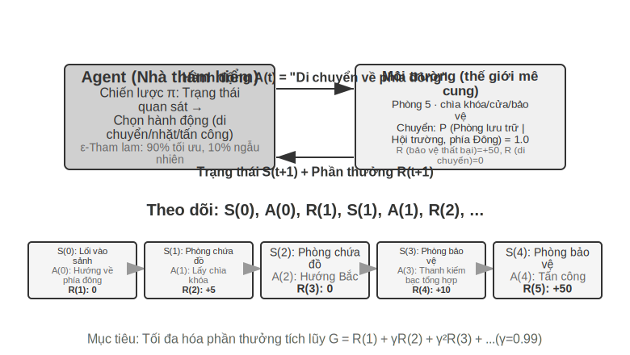

Sự tương tác tạo ra **trajectory** - tức là một bản ghi đầy đủ về "trạng thái → hành động → phần thưởng → trạng thái mới → hành động → phần thưởng...". Chất lượng của chiến lược cuối cùng được phản ánh ở chất lượng của trajectory. **Hàm giá trị** trả lời câu hỏi: "Nếu bây giờ tôi đang ở trạng thái này và tiếp tục hành động theo chiến lược hiện tại thì cuối cùng tôi có thể nhận được tổng phần thưởng là bao nhiêu?" Điều này giống như một người chơi cờ có kinh nghiệm nhìn thấy tình huống và có thể ước tính trực quan tỷ lệ thắng của trò chơi mà không cần tính đến nước đi cuối cùng. (Khi "chiến lược hiện tại" ở đây được thay thế bằng "chiến lược tối ưu", kết quả thu được là hàm giá trị tối ưu, sẽ được sử dụng khi nói về phương trình tối ưu Bellman ở phần sau của chương này.) Ranh giới giữa Agent và môi trường tuân theo một nguyên tắc đơn giản: **Bất cứ thứ gì Agent không thể thay đổi tùy ý đều thuộc về môi trường**.

Hai tính năng độc đáo giúp phân biệt học tăng cường với học có giám sát (nhu cầu gắn nhãn câu trả lời đúng) và học không giám sát (khám phá các mẫu ẩn trong dữ liệu) là **tìm kiếm thử và lỗi**(Agent phải tự mình tìm ra hành động nào là tốt mà không cần giáo viên trực tiếp nói câu trả lời đúng) và **phần thưởng bị trì hoãn**(tác động của một hành động có thể không xuất hiện cho đến nhiều bước sau đó, chẳng hạn như giá trị của một nước đi tốt không được nhìn thấy cho đến khi kết thúc). Điều này cũng mang lại một **sự cân bằng giữa khám phá và sử dụng (Exploration-Exploitation)** độc đáo **: nếu bạn tiếp tục đi trên con đường quen thuộc, bạn sẽ không học được điều gì mới; nếu bạn tiếp tục cố gắng một cách ngẫu nhiên, bạn sẽ không bao giờ đạt được mục tiêu cuối cùng.

Hệ thống học tập tăng cường chứa năm yếu tố cốt lõi:

- **Action Space**: Xác định tập hợp tất cả các hành động mà Agent có thể thực hiện. Các hành động có thể rời rạc (chẳng hạn như "thực hiện bước nào" trong cờ vua, với các tùy chọn hạn chế) hoặc liên tục (chẳng hạn như "xoay các khớp của robot bao nhiêu độ", là một giá trị liên tục).
- **Chính sách**: Quy tắc ứng xử của Agent, quy định những việc nên làm trong một trạng thái nhất định. Các chính sách có thể đơn giản (bảng tra cứu: khi nhìn thấy trạng thái A, thực hiện hành động X) hoặc phức tạp (mạng lưới thần kinh sâu).
- **Tín hiệu khen thưởng**: Phản hồi tức thì từ môi trường. Nhưng mục tiêu của Agent là tối đa hóa lợi nhuận dài hạn thay vì ngay lập tức - sự khác biệt này rất quan trọng, giống như việc đầu tư không thể chỉ nhìn vào sự tăng giảm của ngày hôm nay mà là lợi nhuận dài hạn.
- **Hàm giá trị**: Ước tính số phần thưởng tích lũy có thể nhận được trong tương lai bắt đầu từ một trạng thái nhất định, giúp Agent đưa ra quyết định sáng suốt khi không có phản hồi ngay lập tức. Một trong những hiểu biết quan trọng nhất từ nghiên cứu RL trong sáu mươi năm qua là tính trung tâm của ước tính giá trị.
- **Mô hình môi trường**(tùy chọn): Dự đoán phản ứng của môi trường đối với các hành động. Phương pháp có mô hình môi trường được gọi là **phương pháp dựa trên mô hình**(trước tiên hãy học cách dự đoán môi trường sẽ thay đổi như thế nào, sau đó lập kế hoạch cho phù hợp) và phương pháp không có mô hình môi trường được gọi là **phương pháp không có mô hình**(không dự đoán môi trường, học trực tiếp từ kinh nghiệm).

Bảng 7-3 so sánh các thành phần chính của các hệ thống Agent khác nhau, cho thấy tính phổ biến của khái niệm Agent và giúp người đọc thấy được sự khác biệt về không gian hành động giữa RL Agent truyền thống và LLM Agent hiện đại.

Bảng 7-3 So sánh các thành phần chính của các hệ thống Agent khác nhau

| Loại Agent | Môi trường | Action Space | Tín hiệu thưởng |
|---------|------|---------|---------|
|**Linh dương nhỏ sơ sinh**| Địa hình, trọng lực, tư thế cơ thể | Kích thước cao liên tục (co thắt từng nhóm cơ) | Cân bằng (+), giảm (-) |
|**Robot quét nhà**| Bố trí phòng, cấp điện | Rời rạc (hướng, hút bụi, sạc) | Vệ sinh khu vực (+), mất điện (-) |
|**Bậc thầy cờ vua**| Tình trạng hội đồng, thời hạn | Rời rạc hữu hạn (chuyển động hợp pháp) | Thắng (+1), thua (-1) |
|**Dịch vụ khách hàng Agent**| Lịch sử hội thoại, cơ sở kiến thức | Mở (nghĩ, nói, gọi API) | Giải quyết vấn đề (+), thời gian xử lý (-) |
|**Trợ lý mã Agent**| Tài liệu yêu cầu, cơ sở mã | Mở (suy nghĩ, tìm kiếm, biên tập, thực thi) | Đã vượt qua thử nghiệm (+), đã xuất hiện lỗi (-) |

Bảng này tiết lộ một thông tin chi tiết quan trọng: không gian hành động của RL Agent (cờ vua, robot) truyền thống bị đóng, trong khi không gian hành động của Agent (dịch vụ khách hàng, trợ lý mã) hiện đại dựa trên LLM là mở, gần như không giới hạn và hành động đặc biệt của "suy nghĩ nội bộ" có thể được sử dụng để cải thiện khả năng.

### Hai mô hình Agent: từ MDP đến LLM+RL

Sự khác biệt cơ bản nhất giữa hai loại này là không gian hành động - MDP giả định rằng không gian hành động bị giới hạn và đóng (lên/xuống/lấy/đặt), trong khi không gian hành động của LLM là sự bùng nổ tổ hợp mở của các chuỗi ngôn ngữ tự nhiên. Sự khác biệt này xác định sự khác biệt cơ bản giữa hai mô hình trong thiết kế thuật toán, hiệu quả mẫu và khả năng khái quát hóa. Mở rộng chúng một cách riêng biệt bên dưới.

**Mô hình truyền thống: MDP với Q-learning.**

MDP (Quy trình quyết định Markov) là một khung toán học dành cho học tập tăng cường, xác định các yếu tố cốt lõi như trạng thái, hành động và phần thưởng. Giả định cốt lõi của nó là tính chất Markov: tương lai chỉ phụ thuộc vào trạng thái hiện tại và không liên quan gì đến lịch sử trước đó. Ví dụ khi chơi cờ, chỉ cần nhìn vào tình hình bàn cờ hiện tại là đủ để xác định nước đi tối ưu. Không cần phải xem lại từng bước đi trước đó đã được thực hiện như thế nào. Giả định này đơn giản hóa vấn đề nhưng cũng hạn chế khả năng mô hình hóa sự phụ thuộc lịch sử.

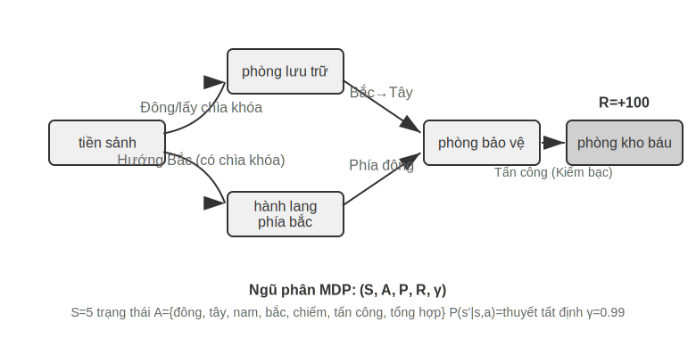

RL truyền thống Tính năng chính của Agent là **không gian hành động khép kín** - một tập hợp hữu hạn được xác định trước của tất cả các hành động mà Agent có thể thực hiện. **Trò chơi cờ vua cổ điển Agent** là ví dụ điển hình nhất: 361 thế cờ của cờ vây rất lớn nhưng hoàn toàn chắc chắn và hạn chế, cờ vua xem xét các quy tắc di chuyển khác nhau cho các quân cờ nhưng các động tác vẫn có thể liệt kê được, còn trò chơi Atari chỉ có từ vài đến chục hành động rời rạc. **Robot Agent** đại diện cho một không gian hành động liên tục nhưng có giới hạn: góc khớp, tốc độ và lực bám là các giá trị liên tục nhưng tất cả chúng đều có ranh giới vật lý rõ ràng (góc quay tối đa, mô-men xoắn cực đại, giới hạn tốc độ) và kích thước được xác định bởi mức độ tự do của robot.

Việc đóng này mang lại lợi thế về mặt tính toán: tất cả các hành động có thể được liệt kê và đánh giá từng hành động một, điều này tạo điều kiện thuận lợi cho việc lập trình động và tìm kiếm cây Monte Carlo, đồng thời hàm giá trị hành động có thể được tính gần đúng bằng một bảng hoặc một hàm đơn giản. Nhưng nó cũng hạn chế khả năng diễn đạt và khái quát hóa. RL Agent truyền thống bắt đầu từ đầu và hoàn toàn dựa vào việc học thử và sai - bắt đầu từ chiến lược ngẫu nhiên, thu thập kinh nghiệm, cập nhật hàm giá trị hoặc chiến lược, v.v. cho đến khi hội tụ.

Trong khung này, một trong những thuật toán cơ bản và quan trọng nhất là **Q-learning**. Nó duy trì ước tính giá trị cho mỗi kết hợp "trạng thái hành động": nếu bạn thực hiện hành động a ở trạng thái s và sau đó tiếp tục hành động theo chiến lược tối ưu, bạn có thể nhận được tổng cộng bao nhiêu phần thưởng? Theo trực giác, một hành động có tốt hay không phụ thuộc vào phần thưởng ngay lập tức mà nó mang lại, cộng với "trạng thái tiếp theo sẽ đưa bạn đến tốt như thế nào".

Viết trực giác này thành một phương trình là mối quan hệ đệ quy cốt lõi của **Phương trình Bellman**(phương trình Bellman) nổi tiếng trong sách giáo khoa RL: **Giá trị thực của một hành động = phần thưởng ngay lập tức nhận được ở bước này + giá trị tối đa trong tương lai có thể đạt được sau khi đạt đến trạng thái tiếp theo**:

$$Q^*(s, a) = r + \gamma \max_{a'} Q^*(s', a')$$

Trong số đó, $r$ là phần thưởng ngay lập tức, $s'$ là trạng thái tiếp theo đạt được sau khi thực hiện hành động (được viết dưới dạng xác định ở đây vì mục đích trực quan và trạng thái tiếp theo $s'$ cần được mong đợi trong môi trường ngẫu nhiên), $\gamma \in [0, 1)$ là **hệ số giảm giá** - nó xác định Agent Mức độ nhấn mạnh được đặt vào tương lai: $\gamma$ Càng gần 1 thì càng coi trọng lợi nhuận dài hạn và càng gần 0 thì càng tập trung vào hiện tại. “Phần thưởng tích lũy” xuất hiện lặp đi lặp lại ở bài viết trước chính xác là tổng của $\sum_{t} \gamma^{t} r_t$ sau khi phần thưởng ở mỗi bước được giảm dần theo $\gamma$. Sau mỗi hành động của thuật toán, giá trị ước tính cũ được điều chỉnh một chút theo hướng "kết quả thực tế" - mô hình "sửa đổi ước tính cũ với kết quả thực tế của một bước" này được gọi là học khác biệt theo thời gian (Học Temporal-Difference, học TD). Sau hàng nghìn lần thử và sai, giá trị ước tính dần dần tiệm cận giá trị thực.

Hai hình sau đây lần lượt hiển thị quá trình khám phá Q-learning trong thế giới lưới và sự hội tụ dần dần của giá trị Q.

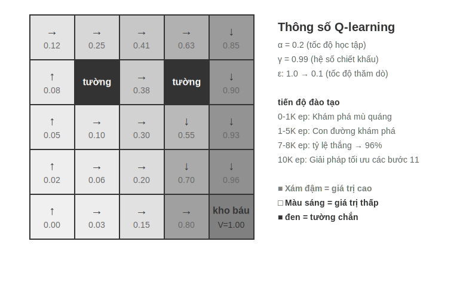

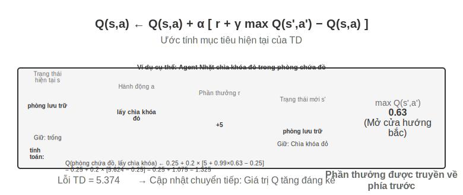

Q-learning thuộc phương pháp **chiến lược trật bánh**(Off-Policy) đặc biệt - nó có thể tìm hiểu chiến lược tối ưu bằng cách sử dụng dữ liệu được tạo bởi bất kỳ chiến lược nào (bao gồm cả khám phá ngẫu nhiên). Để biết định nghĩa chặt chẽ về chiến lược trên trajectory/ngoài trajectory và mối quan hệ tương ứng trong quá trình post-training LLM, hãy xem phần "So sánh các thuật toán học tăng cường" bên dưới.

> **Thử nghiệm 7-1 ★: Hiệu suất của Q-learning trong trò chơi truy tìm kho báu**
>
> Để xác minh các tính năng và hạn chế của Q-learning, chúng tôi đã thiết kế **môi trường trò chơi truy tìm kho báu**. Môi trường này chứa đựng một số thách thức chính: **Cơ chế ẩn** yêu cầu Agent phải tự mình khám phá sự tương ứng giữa chìa khóa và cửa, hiệu ứng vũ khí và quy tắc tổng hợp vật phẩm; **Phụ thuộc nhiều bước** có nghĩa là việc hoàn thành nhiệm vụ cần có trình tự hành động chính xác (giải pháp tối ưu 11 bước); **Phần thưởng thưa thớt** có nghĩa là chỉ những hành động quan trọng và chiến thắng cuối cùng mới có phần thưởng đáng kể và hầu hết các bước ở giữa không nhận được bất kỳ phản hồi nào.
>
> Q-learning Agent sử dụng cấu hình tham số tiêu chuẩn và áp dụng chiến lược khám phá ε-tham lam (hầu hết thời gian, chọn hành động tối ưu hiện tại, thỉnh thoảng thử ngẫu nhiên và giảm dần tỷ lệ khám phá ngẫu nhiên khi tiến trình đào tạo).
>
> Đường cong học tập thể hiện các đặc điểm điển hình (tập đề cập đến một trò chơi hoàn chỉnh, từ đầu đến cuối hoặc thất bại được tính là một lần):
> - **1000 tập đầu tiên**: Tỉ lệ thắng 0%, bảng Q chỉ có 124 trạng thái, Agent khám phá một cách mù quáng
> - **5000 tập đầu tiên**: Vẫn chưa có chiến thắng ổn định, 133 trạng thái bảng Q
> - **Các tập 7000-8000**: Tỷ lệ thắng tăng dần từ 34% lên 96%
> - **10000 tập**: Tỷ lệ thắng 100%, 145 trạng thái bảng Q, tìm lời giải tối ưu 11 bước
>
> Toàn bộ quá trình huấn luyện chỉ mất chưa đầy 10 giây (mô phỏng cực kỳ hiệu quả) nhưng cần gần 10.000 lần thử hoàn chỉnh. Điều này thể hiện các đặc điểm cốt lõi của Q-learning: nó đòi hỏi nhiều lần khám phá ngẫu nhiên để vô tình đi theo đường dẫn hoàn chỉnh và tín hiệu giá trị truyền chậm và phải được tăng cường nhiều lần. Việc học biểu tượng thuần túy chỉ có thể tìm kiếm mạnh mẽ không gian trạng thái khi không có kiến thức trước đó.
>
> Trong trò chơi giả lập, 10.000 lượt thử và sai chỉ mất 10 giây, chi phí tối thiểu. Nhưng trong kịch bản Agent trong thế giới thực—trong đó mỗi cuộc gọi điện thoại đều phải trả phí, mọi hoạt động của trình duyệt đều có độ trễ và mọi quyết định sai lầm đều có những hậu quả không thể khắc phục được—10.000 lần thử và sai sót là hoàn toàn không thể chấp nhận được. Đây chính xác là lý do tại sao Agent hiện đại chuyển sang phương pháp tiếp cận dựa trên LLM: tận dụng kiến thức tích lũy được từ quá trình đào tạo trước để đưa ra quyết định hiệu quả với số lần tương tác tối thiểu.
>
> Có ba hạn chế cơ bản của MDP: hiệu quả lấy mẫu thấp (cần tương tác lớn để học các nhiệm vụ đơn giản), khả năng khái quát hóa kém (kiến thức học được trong môi trường này khó chuyển sang môi trường khác) và không có khả năng sử dụng kiến thức có sẵn (mọi nhiệm vụ mới đều phải học lại từ đầu). Những hạn chế này đặc biệt nổi bật khi phải đối mặt với các không gian trạng thái phức tạp như ngôn ngữ tự nhiên hoặc tầm nhìn đa chiều.
>
**Mô hình hiện đại: Agent dựa trên LLM+RL.**

Mô hình ngôn ngữ lớn mang đến mô hình Agent mới, thay đổi căn bản cách xây dựng Agent - đặc biệt là thiết kế không gian hành động.

Agent của RL truyền thống chỉ có thể nhận được phản hồi bằng cách thay đổi môi trường: nước cờ, nước đi mê cung. Nhưng LLM lại mang đến một kiểu hành động hoàn toàn mới: tư duy nội tâm. Suy nghĩ không làm thay đổi thế giới bên ngoài nhưng nó có thể cải thiện đáng kể chất lượng của hành động đạt được. Sự chuyển đổi này thay đổi mọi thứ: Action Space của Agent không còn chỉ là “làm gì” mà còn là “nghĩ trong bao lâu và nghĩ về điều gì”.

Sự đổi mới quan trọng nhất là kết hợp tư duy như một hành động đặc biệt vào không gian hành động. Trong RL truyền thống, Agent chỉ có thể thực hiện các hành động bên ngoài (di chuyển, tấn công, nhặt) làm thay đổi trạng thái môi trường; trong khi ở LLM Agent, **tư duy nội tâm trở thành thành phần cốt lõi của không gian hành động** - nó không trực tiếp thay đổi môi trường bên ngoài, không có phần thưởng ngay lập tức, gần như không giới hạn và chi phí thấp.

RL truyền thống khó có thể xử lý được những hành động như vậy. Nguyên nhân cốt lõi là do không gian khám phá quá rộng và thiếu cấu trúc: Agent học từ đầu giống như tìm kho báu trên sa mạc khi bị bịt mắt và chỉ có thể đánh ngẫu nhiên. LLM thì khác. Thông qua đào tạo trước văn bản khổng lồ, nó đã nội hóa các quy tắc tư duy mà con người tích lũy được: khi giải các bài toán, hãy tuân theo "xác định điều kiện → nhớ lại công thức → tính toán từng bước" và khi viết mã, hãy tuân theo "hiểu yêu cầu → cấu trúc thiết kế → chi tiết triển khai". Điều này cho phép suy nghĩ của LLM tiến hành theo một đường dẫn có cấu trúc, nén đáng kể không gian tìm kiếm. Do đó, ngay cả khi không được đào tạo bổ sung về RL, LLM được đào tạo trước vẫn có thể tạo ra chuỗi suy nghĩ (CoT) với logic cơ bản. Logic cơ bản này xuất phát từ quá trình tư duy khổng lồ của con người trong kho dữ liệu trước đào tạo (giải bài toán, nhận xét mã, phản hồi tranh luận, v.v.). Mô hình ngầm học "bước tiếp theo sẽ là dạng lý luận nào" thông qua dự đoán next-token.

RL post-training dạy LLM áp dụng các quy tắc này hiệu quả hơn trong các nhiệm vụ cụ thể thông qua các phần thưởng bên ngoài. Bản thân cấu trúc ngôn ngữ cũng mang lại một phần thưởng tiềm ẩn bên trong - các chuỗi suy nghĩ mạch lạc về mặt logic (chẳng hạn như "Vì chúng ta cần chuyển đổi ngoại tệ sang đô la Mỹ nên bước đầu tiên là kiểm tra tỷ giá hối đoái") có xác suất được tạo ra cao, trong khi các chuỗi suy nghĩ khó hiểu về mặt logic (chẳng hạn như "Vì chúng ta cần chuyển đổi tiền tệ nên trước tiên chúng ta hiểu thời tiết") có xác suất rất thấp, điều này tự nhiên hướng dẫn mô hình chọn một con đường hợp lý.

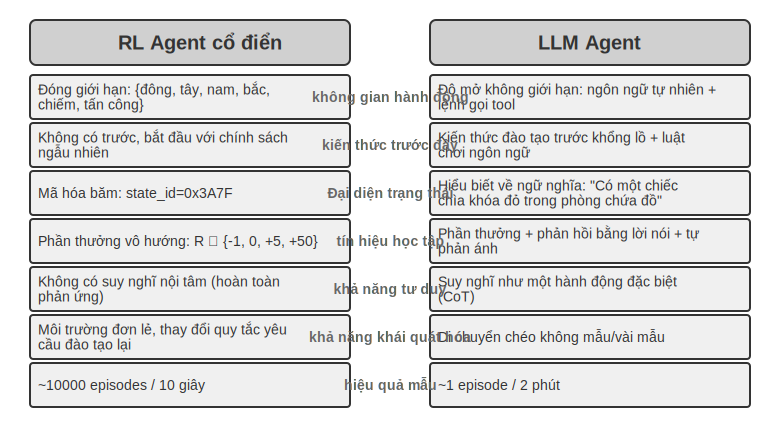

Khả năng suy nghĩ dựa trên các quy tắc vốn có của ngôn ngữ này cho phép LLM Agent hiểu các hướng dẫn mà nó chưa từng thấy trước đây (khái quát hóa không cần bắn) và thành thạo các nhiệm vụ mới với rất ít ví dụ (thích ứng với ít lần quay) - hoàn toàn khác với mô hình MDP Agent truyền thống đòi hỏi nhiều lần thử và sai. Ngoài ra, mô hình mới còn có khả năng khái quát hóa tổ hợp (tái kết hợp các khái niệm đã biết để giải quyết các tình huống mới), In-Context Learning (học trong ngữ cảnh) (thích ứng nhanh thông qua các gợi ý và ví dụ) và hiểu biết đa phương thức (tích hợp tự nhiên giữa hình ảnh, ngôn ngữ, hành động và các phương thức khác). Cần lưu ý rằng **hiệu ứng** của việc In-Context Learning (học trong ngữ cảnh) (khái quát hóa bằng không, thích ứng với vài lần) và **cơ chế bên trong** của nó là hai thứ khác nhau - như đã phân tích trong Chương 2, cơ chế chú ý hoạt động giống như truy xuất hơn là lý luận, nhưng điều này không ngăn cản nó tạo ra những hiệu ứng thực tế mạnh mẽ trong việc điều chỉnh nhiệm vụ.

Sự phát triển của không gian hành động từ đóng sang mở phản ánh sự thay đổi cơ bản trong mô hình AI Agent. Ngoài tư duy nội bộ, sự đa dạng của các tham số công cụ (truy vấn ngôn ngữ tự nhiên, mã chương trình, JSON phức tạp, nội dung đa phương thức) khiến không gian hành động thực tế gần như vô hạn - về mặt lý thuyết, trình thông dịch mã có thể thực hiện bất kỳ tác vụ tính toán nào và công cụ tìm kiếm có thể khám phá không gian thông tin của toàn bộ Internet. Điều này mang đến cả những cơ hội mới (Agent có thể xử lý các nhiệm vụ chưa từng thấy, giải quyết các vấn đề phức tạp bằng cách kết hợp các công cụ cơ bản) và cả những thách thức mới (cách xác định và tối ưu hóa các chức năng phần thưởng trong môi trường mở, cách tìm kiếm hiệu quả trong không gian hành động vô hạn).

Lấy các mô hình như Kimi K3 định hướng gọi công cụ và tối ưu hóa tư duy chuỗi dài làm ví dụ, chúng ta có thể thấy hướng điển hình của mô hình LLM+RL: dựa trên đào tạo trước ngôn ngữ quy mô lớn, post-training được sử dụng để tăng cường khả năng phân tích vấn đề, gọi công cụ và tự sửa lỗi. **OpenVLA**(xem Chương 9 để biết chi tiết) thể hiện mô hình kiến trúc VLA (Ngôn ngữ hình ảnh-Hành động) của kỷ nguyên LLM: bộ mã hóa hình ảnh xử lý các quan sát môi trường, mô hình ngôn ngữ hiểu hướng dẫn và lý do, đồng thời bộ giải mã hành động tạo ra các tín hiệu điều khiển để đạt được khả năng kiểm soát điều kiện ngôn ngữ và khái quát hóa nhiều tác vụ. Điều cần làm rõ là bản thân OpenVLA được đào tạo thông qua học tập bắt chước (nhân bản hành vi) trên gần một triệu **trajectory demo** của robot và nó thuộc về bản chất của SFT chứ không phải RL; đại diện của việc thực sự đưa RL vào robot và sử dụng phần thưởng để tối ưu hóa hơn nữa loại kiến trúc VLA này là thử nghiệm 7-13 ở phần sau của chương này. SimpleVLA-RL.

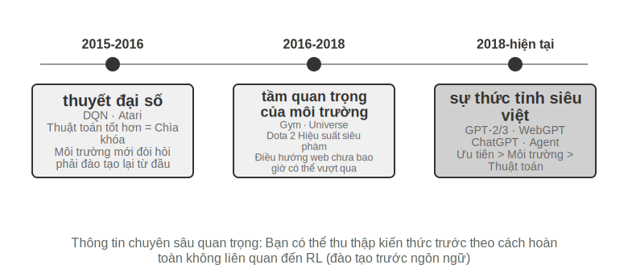

**Con đường khám phá của OpenAI**(được Yao Shunyu (trợ lý giáo sư tại Đại học Princeton và là tác giả của bài báo ReAct) ghi lại chi tiết trong "Nửa sau") tiết lộ một quá trình tiến hóa về nhận thức. **Thuật toán trung tâm giai đoạn 1 (2015-2016)**: Tin rằng các thuật toán tốt hơn là chìa khóa, đạt được tiến bộ trong môi trường tiêu chuẩn như Atari, nhưng chuyển sang môi trường mới và phải đào tạo lại từ đầu. **Tầm quan trọng của môi trường trong giai đoạn thứ hai (2016-2018)**: Phòng tập tiêu chuẩn hóa nhiều nhiệm vụ khác nhau, Universe và World of Bits cố gắng biến toàn bộ Internet thành môi trường luyện tập cho RL và Dota 2 theo đuổi hiệu suất siêu phàm trong các môi trường phức tạp cụ thể. Ý tưởng rất rõ ràng nhưng việc sử dụng máy tính nói chung và điều hướng trang web không thể thực hiện được.

**Giai đoạn 3 (2018 đến nay) Priori Awakening**: GPT-2/GPT-3 thể hiện sức mạnh của việc đào tạo trước ngôn ngữ. WebGPT và ChatGPT chứng minh rằng những kiến thức có sẵn này có thể được chuyển hóa thành Agent thực tế. Phát hiện quan trọng nhất là: **Có thể thu được kiến thức trước theo những cách hoàn toàn không liên quan đến RL**. Đây là một sự thật phản trực giác: các ưu tiên của các nhà nghiên cứu RL có thể đã bị đảo ngược hoàn toàn trong nhiều thập kỷ—không phải thuật toán > môi trường > trước đó mà là trước > môi trường > thuật toán.

> **Thí nghiệm 7-2 ★★: Nghiên cứu so sánh giữa RL truyền thống và LLM Agent**
>
>
> 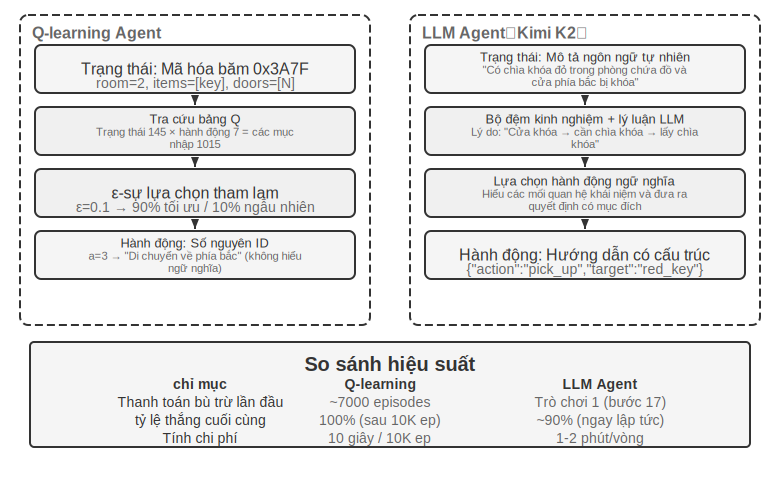
>
>
> So sánh Q-learning với LLM Agent (Kimi K3, duy trì vùng đệm lên tới 50 điểm kinh nghiệm) trong cùng một cuộc truy tìm kho báu. Kết quả thật đáng kinh ngạc: **LLM Agent Hoàn thành ván đầu tiên sau 18 nước đi**.
>
> **Giai đoạn đầu (khám phá có mục đích)**: Nhặt thanh kiếm rỉ sét ("Vũ khí tốt hơn tay không"), khám phá bản đồ một cách có hệ thống, phát hiện ra rằng cửa phía bắc đã bị khóa và lý do rằng "chúng ta cần tìm chìa khóa", sau đó khám phá phòng chứa đồ và lấy chìa khóa đỏ và tinh thể ma thuật. **Giai đoạn giữa (hiểu cơ học và tổng hợp chủ động)**: Hiểu quy tắc "tự động dùng chìa khóa" và dự đoán thanh kiếm rỉ sét không đủ sức đối phó với lính canh, nên ở bước 8, thanh kiếm bạc được chủ động tổng hợp. **Giai đoạn sau (thực hiện và sửa lỗi)**: Giữ thanh kiếm bạc về phía bắc, đánh bại người bảo vệ mạnh mẽ ở bước thứ 13, xen kẽ với một hoặc hai lần thử không hợp lệ (vung kiếm/rút lui lặp đi lặp lại), và cuối cùng lấy được bảo vật rồng ở bước thứ 18.
>
> Điều này thể hiện sự khác biệt cơ bản giữa hiểu biết ngữ nghĩa và ánh xạ biểu tượng. LLM Agent hiểu cấu trúc khái niệm của trò chơi và mỗi bước đều được hỗ trợ bởi mục đích và logic. Đối với Q-learning, "cửa", "chìa khóa" và "kiếm" chỉ là sự kết hợp vô nghĩa của các ký hiệu và mối quan hệ giữa chúng chỉ có thể được khám phá từ từ thông qua một lượng lớn học tập thống kê.
>
> Chi phí tính toán tạo ra một nghịch lý thú vị: Q-learning chỉ mất 10 giây để chạy 10.000 vòng, nhưng LLM Agent lại mất 1-2 vài phút để chạy một vòng. Nhưng trong các nhiệm vụ trong thế giới thực, thời gian, tiền bạc và chi phí rủi ro của mỗi tương tác vượt xa chi phí tính toán thuần túy, do đó, chỉ nhìn vào thời gian của GPU là không công bằng. Cái nhìn sâu sắc quan trọng hơn là: Thành công của LLM Agent không phải nhờ có “thuật toán học tập” tốt hơn, mà vì nó chứa một lượng lớn kiến thức có sẵn. Khi luật chơi thay đổi, Q-learning cần được đào tạo lại hoàn toàn, nhưng LLM Agent có thể thích ứng trực tiếp thông qua suy luận. Từ đó, chúng ta có thể rút ra các nguyên tắc thiết kế thực tế: trong các tình huống mà chi phí mô phỏng thấp và có thể lặp lại với số lượng lớn, RL truyền thống vẫn có giá trị; trong các tình huống thực tế khi chi phí tương tác cao và cần phải thích ứng nhanh, hiệu suất mẫu của LLM Agent sẽ thực tế hơn.
>
Về vị trí và sức mạnh tổng hợp tương ứng của ba mô hình In-Context Learning (học trong ngữ cảnh), External Learning (học bên ngoài tham số mô hình) và học tập tham số (post-training), chương đầu tiên sẽ có sự so sánh có hệ thống và “bức tranh hoàn chỉnh” ở cuối chương này cũng sẽ quay trở lại chủ đề này. Chủ đề chính của chương này là post-training—viết chiến lược tương tác vào các tham số mô hình.

# # Mô hình đào tạo cơ bản trước `[Tùy chọn đọc]`

Để hiểu tại sao các kỹ thuật post-training lại hiệu quả, trước tiên bạn cần hiểu những gì mà đào tạo trước thiết lập. Post-training (SFT và RL) về cơ bản tối ưu hóa trong không gian biểu diễn được thiết lập bởi đào tạo trước - cấu trúc kiến thức được thiết lập bởi đào tạo trước sẽ xác định mức trần của post-training. Do đó, chúng tôi xem xét các khía cạnh cốt lõi của quá trình đào tạo trước thông qua ba thử nghiệm: đào tạo mô hình ngôn ngữ quy mô nhỏ từ đầu, mở rộng khả năng thị giác và bổ sung kiến thức ngôn ngữ mới. Ba thí nghiệm trong phần này là nội dung bổ trợ giúp người đọc hình thành trực giác về quá trình pretraining (tức là đào tạo ban đầu về dữ liệu quy mô lớn để cho phép mô hình học các quy tắc cơ bản của ngôn ngữ và kiến thức thế giới) – những độc giả đã quen với quá trình pretraining có thể bỏ qua.

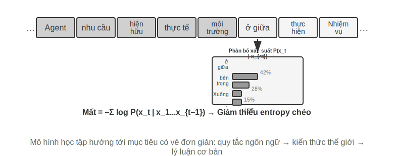

Đào tạo mô hình ngôn ngữ tuân theo quy trình ba giai đoạn "mã thông báo - đào tạo trước - post-training". Mã thông báo chia văn bản thành các đơn vị riêng biệt. Ví dụ: "Tôi thích lập trình" có thể được chia thành bốn mã thông báo: "Tôi", "Thích", "Lập trình" và "Lập trình" - những mã thông báo này là đơn vị nhỏ nhất để mô hình xử lý văn bản. Nhiệm vụ đào tạo trước về mặt khái niệm rất đơn giản: hiển thị cho mô hình nửa đầu của văn bản và yêu cầu mô hình dự đoán mã thông báo tiếp theo sẽ là gì. Mô hình liên tục điều chỉnh các tham số của nó bằng cách so sánh khoảng cách giữa dự đoán của nó và câu trả lời đúng (khoảng cách này được gọi là loss, loss càng nhỏ thì dự đoán càng chính xác). Sau nhiều lần huấn luyện với số lượng lớn văn bản, người mẫu dần dần học được các quy tắc ngôn ngữ, kiến thức thế giới và khả năng suy luận cơ bản. Sau khi hoàn tất quá trình đào tạo trước, mô hình có thể tạo ra văn bản mượt mà nhưng đầu ra thiếu cấu trúc và gây khó khăn cho việc làm theo hướng dẫn. Quá trình post-training biến nó thành một trợ lý thực tế thông qua SFT (được đào tạo với các cặp đầu vào-đầu ra được gắn nhãn) và tối ưu hóa tùy chọn (chẳng hạn như DPO, cho phép mô hình học cách tạo ra các câu trả lời mà con người ưa thích).

> **Thử nghiệm 7-3 ★★: Đào tạo LLM từ đầu - sức mạnh của cải tiến thuật toán**
>
> Lấy MiniMind 2 (100 triệu thông số) làm ví dụ, quá trình đào tạo hoàn chỉnh được hoàn thành trên GPU cấp độ người tiêu dùng. Bằng cách giới thiệu hai tối ưu hóa thuật toán (trình tối ưu hóa QK Norm và Muon), tốc độ hội tụ tăng gấp 3 lần và chất lượng tạo ra được cải thiện đáng kể - chi phí triển khai rất thấp, tổng thời gian đào tạo khoảng 14 giờ và chi phí khoảng 34 USD.
>
> Tác dụng của từng giai đoạn huấn luyện: Sau khi huấn luyện trước, mô hình có thể trả lời các câu hỏi thực tế như “ngọn núi cao nhất thế giới” nhưng format chưa chuẩn; sau SFT, định dạng đầu ra và tuân thủ hướng dẫn được cải thiện đáng kể và các câu trả lời có thể được sắp xếp theo cách mong muốn; tối ưu hóa ưu tiên tiếp tục giảm các lỗi thực tế và các biểu thức không tự nhiên. Một mô hình có 100 triệu tham số vẫn có những hạn chế rõ ràng (các vấn đề phức tạp dễ xảy ra lỗi), nhưng nguồn cảm hứng là: **Với ngân sách quy mô nhỏ cố định, cải tiến thuật toán sẽ tiết kiệm chi phí hơn so với kích thước heap thuần túy**.
>
> **Thử nghiệm 7-4 ★★: Tự đào tạo VLM**
>
>
> 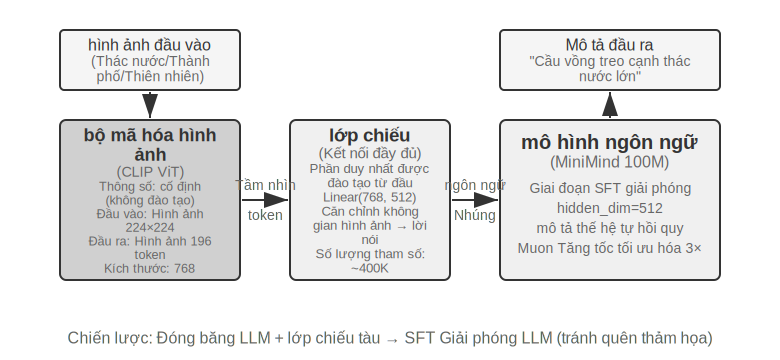
>
>
> VLM thống nhất nhận thức trực quan và hiểu ngôn ngữ trong một mô hình. Thách thức cốt lõi nằm ở sự liên kết giữa các phương thức - làm cho "đã nhìn thấy" và "đã nói" tương ứng với nhau. Kiến trúc bao gồm ba thành phần: **Bộ mã hóa hình ảnh**(như CLIP, với các tham số cố định) trích xuất các đặc điểm ngữ nghĩa của hình ảnh; **Lớp chiếu**(nhẹ, phần duy nhất được đào tạo từ đầu) hoạt động như một "trình dịch" giữa các đặc điểm hình ảnh và mô hình ngôn ngữ, ánh xạ các đặc điểm hình ảnh tới một không gian biểu diễn mà mô hình ngôn ngữ có thể hiểu được; **Mô hình ngôn ngữ** tạo văn bản mô tả. Việc đào tạo áp dụng chiến lược “đóng băng LLM + chỉ đào tạo lớp chiếu” để tránh sự lãng quên thảm khốc (Quên thảm khốc, tức là quên kỹ năng cũ sau khi học kỹ năng mới); quá trình đào tạo trước được căn chỉnh và sau đó hủy đóng băng LLM, đồng thời các cặp mô tả hình ảnh chất lượng cao được sử dụng để tạo SFT. Mức độ chi tiết và độ chính xác của mô tả được cải thiện đáng kể.
>
> Thử nghiệm này cho thấy mô hình cơ bản của đào tạo mô hình đa phương thức: sử dụng lại kết quả đào tạo trước một phương thức và đạt được sự liên kết giữa các phương thức bằng cách đào tạo lớp chiếu nhẹ - hiệu quả và có thể mở rộng, nhưng lớp chiếu có khả năng biểu đạt hạn chế và có thể trở thành nút thắt cổ chai cho sự hiểu biết sâu sắc về đa phương thức. Bộ khung "bộ mã hóa hình ảnh + lớp chiếu + LLM" tương tự được mở rộng thêm một bước nữa để cho phép mô hình đưa ra các hành động, đó là mô hình VLA (Ngôn ngữ hình ảnh-Hành động) sẽ được mở rộng trong Chương 9.
>
> **Thử nghiệm 7-5 ★★: Tiếp tục đào tạo trước để học ngôn ngữ mới**
>
> Dựa trên Mistral 7B v0.3 (chủ yếu được đào tạo trước bằng tiếng Anh, hầu như không hiểu tiếng Hàn), tiếp tục đào tạo trước qua Wikipedia tiếng Hàn để bổ sung năng lực tiếng Hàn - tiếp tục đào tạo không giám sát với dữ liệu ngôn ngữ mới trên mô hình được đào tạo trước. Mô hình đã có khả năng lập mô hình ngôn ngữ chung và chỉ cần thích ứng với việc phân phối dữ liệu mới. Chi phí thấp hơn nhiều so với đào tạo từ đầu. Điểm kỹ thuật quan trọng là sử dụng dữ liệu hỗn hợp (khoảng 80% tiếng Hàn + 20% tiếng Anh) để giảm bớt tình trạng quên thảm họa: tỷ lệ ngôn ngữ mục tiêu quá cao sẽ dẫn đến sự xuống cấp của ngôn ngữ gốc và tỷ lệ quá thấp sẽ dẫn đến hiệu quả học tập không đủ. Cuối cùng, sử dụng dữ liệu lệnh tiếng Hàn để làm SFT để có được kỹ năng đàm thoại tiếng Hàn thực tế. Kết luận của thí nghiệm này sẽ được sử dụng lại trong bức tranh hoàn chỉnh ở cuối chương này: để mô hình ghi nhớ được nhiều kiến thức miền mới, điều đó phụ thuộc vào việc tiếp tục đào tạo trước chứ không phải SFT.
>
Ba thử nghiệm trước khi đào tạo cùng nhau cho thấy một mô hình: khi ngân sách có hạn, việc cải tiến thuật toán và đổi mới kiến trúc sẽ tiết kiệm chi phí hơn là chỉ đơn giản mở rộng quy mô. Quan trọng hơn, đào tạo trước cung cấp cho mô hình kiến thức mô tả và khả năng mô hình hóa ngôn ngữ, thiếu hướng dẫn có cấu trúc và hành vi định hướng nhiệm vụ - đây là khoảng trống mà SFT cần lấp đầy.

Với các khả năng cơ bản của đào tạo trước, bước tiếp theo là biến mô hình chung thành Agent thực tế thông qua post-training. Giai đoạn đầu tiên của quá trình post-training là tinh chỉnh có giám sát (SFT).

## SFT (tinh chỉnh giám sát)

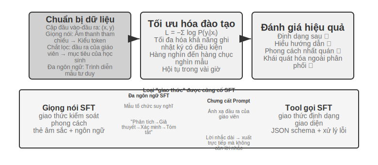

Phần 7.1 đã giải thích bản chất của SFT (dữ liệu được thay đổi và tổn thất chỉ được tính dựa trên câu trả lời). Phần này sử dụng bốn thử nghiệm để xem cơ chế "ghi ánh xạ và giao thức ổn định vào các tham số" này đặc biệt củng cố điều gì trong các nhiệm vụ khác nhau. Giá trị cốt lõi của SFT không nằm ở việc đưa kiến thức mới mà ở **củng cố giao thức**: viết các mối quan hệ ánh xạ, định dạng tương tác và thông số kỹ thuật kiểu vào các tham số, để có thể tạo ra kết quả mong đợi mà không cần phải nhắc nhở dài dòng trong quá trình lý luận. Thông thường chỉ cần hàng nghìn đến hàng chục nghìn ví dụ chất lượng cao để hình thành các kỹ năng đàm thoại cơ bản và tuân theo mệnh lệnh.

Cái giá của hiệu quả cao là sự phụ thuộc nhiều vào phân phối đào tạo: SFT có xu hướng ghi nhớ hơn là khái quát hóa. Một khi bài thi gặp phải tình huống chưa từng thấy trong luyện tập, hiệu suất thường giảm đi đáng kể. Các thí nghiệm sau đây sẽ chứng minh quá trình "giao thức xử lý" này từ các góc độ khác nhau.

> **Thử nghiệm 7-6 ★★★: Lời nói SFT - Từ “Tái tạo giọng nói” đến “Mô hình hóa song ngữ” `[Extends Experiment]`**
>
> Sử dụng Orpheus (nhân bản giọng nói theo ngữ cảnh) và Sesame (mô hình dấu hiệu cận ngôn ngữ) làm đối tượng, chỉ ra cách viết "kiểu giọng nói và thói quen diễn đạt" thành các tham số. Hai ý tưởng này khác nhau:
>
> - **Orpheus**: Nén dạng sóng âm thanh thành một chuỗi mã thông báo và bằng cách ghép âm thanh tham chiếu của cùng một loa, hãy để mô hình học cách "nói bằng giọng của người này" để đạt được âm sắc nhất quán giữa các câu.
> - **Sesame**: Các hiện tượng cận ngôn ngữ trừu tượng như cười, thở dài vào các điểm đánh dấu đặc biệt như `<laugh>`, `<sigh>`, v.v., đồng thời huấn luyện mô hình học cách "tạo ra âm thanh tương ứng khi nhìn thấy điểm đánh dấu".
>
> SFT Trong các nhiệm vụ diễn đạt, các giao thức kiểm soát phong cách và thói quen diễn đạt có cấu trúc được củng cố, thay vì kiến thức thực tế hoặc tư duy phức tạp. Chìa khóa nằm ở sự đa dạng của dữ liệu huấn luyện và chất lượng chú thích. Các dạng lỗi thường gặp: quá ít người nói trong dữ liệu huấn luyện, khiến mọi người đều có giọng giống nhau; gắn nhãn quá mức (nghĩa là mô hình ghi nhớ các chi tiết của mẫu đào tạo một cách học vẹt và hoạt động kém hơn khi gặp tình huống mới), dẫn đến "tiếng cười máy móc".
>
> **Thử nghiệm 7-7 ★★★: Tư duy bằng nhiều ngôn ngữ - để người mẫu suy nghĩ bằng bất kỳ ngôn ngữ nào `[Thử nghiệm mở rộng]`**
>
> Hầu hết các mô hình tư duy chỉ có thể “nghĩ” bằng tiếng Anh: Dù bạn sử dụng ngôn ngữ nào để đặt câu hỏi thì chuỗi tư duy bên trong mô hình hầu như luôn bằng tiếng Anh, vì các minh họa tư duy chất lượng cao trong dữ liệu huấn luyện về cơ bản đều được viết bằng tiếng Anh. Mục tiêu của thử nghiệm này rất đơn giản - khiến mô hình suy nghĩ bằng một ngôn ngữ cụ thể.
>
> Phương pháp là thực hiện SFT trên gpt-oss-20b: thêm câu `reasoning language: German` (hoặc các ngôn ngữ khác) vào lệnh hệ thống, sau đó rèn luyện bằng các ví dụ tư duy bằng tiếng Anh, tiếng Tây Ban Nha, tiếng Pháp và các ngôn ngữ khác. Hoàn toàn không có tiếng Trung trong dữ liệu đào tạo, nhưng sau khi đào tạo xong, miễn là ngôn ngữ lý luận được đặt thành tiếng Trung, mô hình có thể suy nghĩ bằng tiếng Trung để có một chuỗi suy nghĩ hoàn chỉnh. Sự khái quát hóa đa ngôn ngữ không mẫu này là phát hiện thú vị nhất của thí nghiệm này. Cần lưu ý rằng đây không phải là khả năng khái quát của bản thân SFT. Quá trình đào tạo trước đa ngôn ngữ đã thiết lập một không gian biểu diễn chia sẻ đa ngôn ngữ trong mô hình và SFT chỉ kích hoạt khả năng đa ngôn ngữ đã có trong quá trình đào tạo trước.
>
> **Thử nghiệm 7-8 ★★: Chưng cất nhanh chóng - Tái tạo nguồn điện sẵn có với ít chi phí hơn**
>
> Trong các ứng dụng thực tế, để mô hình hoàn thành các tác vụ phức tạp, thường phải thiết kế các lời nhắc hệ thống dài dòng (hàng nghìn thậm chí hàng chục nghìn token), và mỗi lệnh gọi sẽ làm tăng độ trễ và chi phí. Khi sử dụng các mô hình tư duy lớn, các mã thông báo tư duy nội bộ sẽ làm tăng thêm chi phí. Ý tưởng của việc chắt lọc nhanh chóng là nén hành vi của “giáo viên nhắc nhở dài + suy nghĩ” thành “dạy ngắn/không nhắc + học sinh không suy nghĩ”. Giáo viên tạo ra các câu trả lời chất lượng cao bằng các gợi ý và chế độ tư duy hoàn chỉnh. Dữ liệu đào tạo chỉ giữ lại thông tin đầu vào và kết luận cuối cùng của người dùng, loại bỏ những lời nhắc dài dòng và quá trình tư duy trung gian. Học sinh học cách “đưa ra kết luận trực tiếp”, và sau khi chắt lọc, chất lượng đầu ra gần giống với chất lượng đầu ra của giáo viên trên cùng một đầu vào. Đồng thời, do không cần phải xử lý những lời nhắc dài dòng và các mã thông báo suy nghĩ nên độ trễ và chi phí sẽ giảm đáng kể.
>
> Quá trình chắt lọc có thể được thực hiện theo hai chiều: "lớn đến nhỏ" (thay thế các mô hình lớn bằng các mô hình cỡ nhỏ và vừa để đạt được sự thỏa hiệp giữa chi phí và chất lượng) và "từ suy nghĩ đến không suy nghĩ" (thu gọn CoT rõ ràng thành kiến thức được tham số hóa ngầm ở cùng một quy mô để đạt được tốc độ phản hồi được cải thiện gấp 20-30). Cả hai không xung đột và thường được sử dụng cùng nhau trong môi trường sản xuất. Cần lưu ý rằng việc chắt lọc sẽ kế thừa ranh giới của giáo viên - nếu giáo viên mắc lỗi hệ thống trong phân phối đuôi dài, học sinh sẽ mã hóa thêm các lỗi này; nếu người thầy dựa vào công cụ để đảm bảo tính đúng đắn thì việc chắt lọc đầu ra thuần túy sẽ làm mất đi sự chắc chắn mà công cụ mang lại. Cảm hứng kỹ thuật: Khi hình thức sản phẩm ổn định, việc phân bổ đầu vào có thể dự đoán được và hạn chế về chi phí là rõ ràng, việc chưng cất nhanh chóng là một phương pháp tối ưu hóa tốt; nhưng trong giai đoạn thăm dò hoặc khi nhiệm vụ vẫn chưa được hoàn thành, việc duy trì tư duy rõ ràng và kỹ thuật nhanh chóng có thể chỉnh sửa vẫn là cốt lõi của việc thử và sai nhanh chóng.
>
> **Thí nghiệm 7-9 ★★★: Chưng cửa hàng Chuỗi suy nghĩ (CoT) `[Thử nghiệm mở rộng]`**
>
> Quá trình chắt lọc kịp thời sẽ loại bỏ quá trình tư duy, trong khi quá trình chắt lọc CoT thì ngược lại: chuyển **trajectory tư duy hoàn chỉnh** của mô hình giáo viên mạnh mẽ sang mô hình học sinh. Thực hiện chắt lọc CoT trên mô hình giáo viên có khả năng mạnh mẽ có thể khôi phục 70%-80% khả năng của giáo viên với cùng lượng thông số. Đây là chiến lược đi theo thực tế nhất dành cho các nhóm không tìm cách làm mới ranh giới của các khả năng tiên tiến mà tìm kiếm các mô hình độc lập và có thể kiểm soát được. Một loạt các mẫu chưng cất nhỏ có mã nguồn mở khi DeepSeek-R1 ra mắt (sử dụng tư duy của R1 để tạo ra dòng Qwen và Llama), là đại diện cho lộ trình này.
>
> **Ngữ cảnh: Hiện tượng "Bức tường tư duy"**. Một số mô hình tư duy mã nguồn đóng (chẳng hạn như dòng OpenAI o, dòng Gemini) sẽ tạo ra chuỗi tư duy nội bộ khi suy nghĩ, nhưng những gì người dùng nhìn thấy không phải là quá trình tư duy ban đầu - các nhà sản xuất thường viết lại hoặc tóm tắt CoT trước khi xuất ra vì những lý do như chống chắt lọc, an toàn và trải nghiệm sản phẩm. Quá trình tư duy ban đầu có giá trị nhất được ẩn giấu sau API. Đây là lý do tại sao thử nghiệm này chọn các mô hình tư duy nguồn mở làm giáo viên: DeepSeek-R1, QwQ và các mô hình khác tiết lộ chuỗi tư duy hoàn chỉnh trong thẻ `<think>`. Việc chưng cất là khả thi cả về mặt kỹ thuật và cấp phép (bạn vẫn nên xác nhận các điều khoản ủy quyền của giấy phép mẫu cho các sản phẩm chưng cất trước khi sử dụng).
>
> **Thiết kế thử nghiệm**: Quy trình ba bước. Bước đầu tiên, **thu thập trajectory**: các câu hỏi mẫu từ cách phân bổ nhiệm vụ mục tiêu (chẳng hạn như toán học, mã hóa), sử dụng mô hình giáo viên nguồn mở để tạo ra một trajectory "suy nghĩ + trả lời" hoàn chỉnh và sử dụng trình xác thực quy tắc để lọc ra các trajectory có câu trả lời cuối cùng sai - nếu không học sinh sẽ bắt chước quá trình suy nghĩ sai. Bước thứ hai, **Đào tạo SFT**: Sử dụng "Câu hỏi → `<think>` đường tư duy `</think>` + câu trả lời cuối cùng" làm cặp huấn luyện và thực hiện SFT tiêu chuẩn trên các mô hình nhỏ (chẳng hạn như cường độ 7B). Bước thứ ba, **Đánh giá so sánh**: So sánh mô hình học sinh và mô hình giáo viên trước và sau khi chắt lọc trên cùng một điểm chuẩn để đo lường tỷ lệ phục hồi khả năng.
>
> **Tiêu chí chấp nhận**: Mô hình học sinh sau khi chắt lọc được cải thiện đáng kể về điểm chuẩn toán/mã so với trước khi chắt lọc, đồng thời các hành vi phản ánh, quay lại và xác minh giống như giáo viên xuất hiện trong quá trình tư duy. Đồng thời, chú ý đến chi phí chắt lọc: học sinh sẽ kế thừa những lỗi hệ thống và thói quen tư duy dài dòng của giáo viên (cái sau có thể kết hợp với ý tưởng thí nghiệm AdaptThink 7-10 để tối ưu hóa thứ cấp).
>
Bốn thử nghiệm này có một đặc điểm chung - "ghi các ánh xạ và giao thức ổn định thành các tham số": lời nói SFT củng cố giao thức điều khiển kiểu, SFT đa ngôn ngữ củng cố mẫu tổ chức tư duy và chắt lọc SFT củng cố ánh xạ trực tiếp từ đầu vào đến đầu ra. Điểm chung của họ là mục tiêu rõ ràng, hình thức rõ ràng và tiêu chí đánh giá ổn định. Do đó, SFT có thể đạt được lợi ích với hiệu suất mẫu cực cao; nhưng một khi sự phân bố thay đổi, xu hướng bộ nhớ sẽ bộc lộ dưới dạng suy giảm hiệu suất. Đây chính xác là biểu hiện thử nghiệm của sự khác biệt về khái quát hóa bộ nhớ được đề cập trong Phần 7.1 "Sự khác biệt cơ bản giữa SFT và RL".

## Khi nào nên chọn SFT, khi nào nên chọn RL

Mục 7.1 giải thích rõ ràng **sự khác biệt cơ bản** giữa SFT và RL. Phần này trả lời một câu hỏi thực tế hơn: **Nên sử dụng cái nào khi gặp một nhiệm vụ cụ thể?** Kết luận của khung ra quyết định dưới đây sẽ được xác nhận thêm trong thí nghiệm RL tiếp theo (Thí nghiệm 7-10, Thí nghiệm 7-11). Bạn đọc có thể nhận định sơ bộ trước, sau đó quay lại so sánh sau khi đọc phần RL.

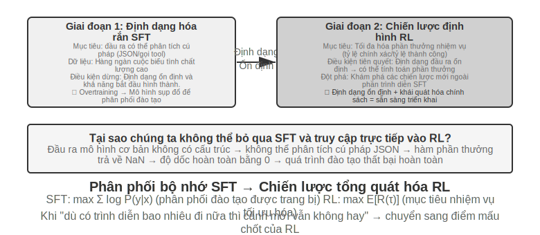

**SFT phù hợp với các tình huống trong đó định dạng** được củng cố (đầu ra JSON, kiểu hội thoại), có các bản trình diễn chuyên môn chất lượng cao và môi trường đào tạo và triển khai có tính nhất quán cao. **Kịch bản mà RL phải can thiệp** là khác: khi có sự khác biệt mang tính hệ thống giữa môi trường triển khai thực tế và môi trường đào tạo (ví dụ: thẻ J/Q/K vừa là 10 trong quá trình đào tạo và trở thành 10 trong quá trình triển khai. 11/12/13 - các quy tắc đã thay đổi; hoặc các mẫu màu đen được sử dụng trong quá trình đào tạo và các mẫu màu đỏ gặp phải trong quá trình triển khai - hình thức đã thay đổi), chiến lược tối ưu cần được khám phá (trình bày của chuyên gia) bản thân nó không nhất thiết phải là tối ưu) hoặc chi phí ghi nhãn quá cao và không thể cung cấp bản trình diễn cho mọi đường dẫn, thì cần có RL.

Policy mạnh mẽ nhất là quy trình hai giai đoạn "SFT trước, sau đó là RL". Mục tiêu chính của SFT không phải là theo đuổi hiệu suất tác vụ cao nhất mà là thiết lập **độ ổn định định dạng** của đầu ra - đảm bảo rằng mô hình có thể tạo ra JSON có thể phân tích cú pháp và sửa các lệnh gọi giao diện công cụ. Chỉ sau khi định dạng đầu ra ổn định, tín hiệu thưởng của RL mới có thể được tính toán một cách đáng tin cậy. Trực tiếp thực hiện RL trên mô hình cơ bản chưa được SFT thường sẽ thất bại vì định dạng đầu ra khó hiểu và không thể tính được phần thưởng - nhưng kết luận này có điều kiện biên: xuất phát từ việc đặt ra "mô hình cơ bản nhỏ hơn + yêu cầu đầu ra có cấu trúc chặt chẽ" (chẳng hạn như thử nghiệm 7-11 sau này). DeepSeek-R1-Zero chứng minh rằng mô hình cơ bản đủ mạnh để bỏ qua SFT và đi thẳng đến RL. Khả năng phản ánh và tư duy chuỗi dài xuất hiện - với cái giá là khả năng đọc đầu ra kém và các ngôn ngữ hỗn hợp. Đây chính xác là những gì DeepSeek cuối cùng đã thêm lại vào "khởi động nguội" ở R1. SFT". Hành trình của R1 từ Zero đến khởi đầu nguội là ví dụ điển hình nhất về "hình thức trước, sau đó là tinh thần": RL có thể tự phát triển "tinh thần" (khả năng chiến lược và lý luận) của mình, nhưng "hình thức" (định dạng và khả năng đọc) của nó vẫn dựa vào SFT để thiết lập nó một cách nhanh chóng và ổn định.

Cả hai đều có chi phí riêng: SFT có hiệu suất mẫu cao và độ hội tụ nhanh nhưng khả năng khái quát hóa còn hạn chế; RL có thể học các chiến lược có thể chuyển đổi nhưng hiệu quả mẫu thấp và quá trình đào tạo không ổn định. Một tiêu chí thực tế là: khi "dù có thêm bao nhiêu dữ liệu trình diễn, hiệu suất của kịch bản mới vẫn không thể cải thiện", điểm mấu chốt là phải chuyển sang RL - gốc rễ của vấn đề không nằm ở số lượng trình diễn mà nằm ở mục tiêu tối ưu hóa của chính SFT.

Khi đưa ra quyết định thực tế, bạn có thể xem xét chúng theo thứ tự sau:

1. **Câu hỏi đầu tiên: Bạn có cần post-training không?** Nếu vấn đề có thể được giải quyết thông qua kỹ thuật Harness (tối ưu hóa nhanh chóng, thiết kế công cụ, quản lý ngữ cảnh) thì không cần phải đào tạo mô hình. Hầu hết các ứng dụng Agent đều nằm ở đây.
2. **Nếu cần đào tạo: hãy thử SFT trước.** Áp dụng cho định dạng đầu ra được củng cố (lược đồ JSON, định dạng gọi API), kiến thức về giao thức được củng cố (cách sử dụng thuật ngữ, định dạng đầu ra, thói quen xử lý, tức là "cách nói, cách làm"), phong cách thống nhất (âm điệu, độ dài). Nhưng lưu ý rằng SFT không phù hợp để tiêm nhiều kiến thức thực tế (“những gì bạn biết”) - cần tiếp tục đào tạo trước hoặc giao lại cho RAG (xem phần "Hình ảnh hoàn chỉnh" ở cuối chương này). SFT có chi phí thấp và kết quả nhanh chóng.
3. Khi **SFT không đủ: thêm RL.** Áp dụng cho các tình huống cần khái quát hóa các kịch bản mới, cần khám phá các chiến lược tối ưu hoặc chi phí ghi nhãn quá cao. Hãy đảm bảo sử dụng SFT để ổn định định dạng đầu ra trước, sau đó tạo RL dựa trên nó.

## Học tăng cường một vòng: so sánh trí nhớ và khái quát hóa

"Vòng đơn" có nghĩa là nhiệm vụ được hoàn thành trong một lần tương tác: mô hình nhận đầu vào, tạo đầu ra và nhận phần thưởng mà không duy trì trạng thái bước chéo. Cài đặt đơn giản hóa này cho phép chúng tôi tập trung vào những khác biệt cơ bản trong cơ chế học tập giữa SFT và RL mà không bị làm phiền bởi sự phức tạp của nhiều vòng tương tác. Kịch bản chạy một lần cung cấp các điều kiện thử nghiệm kiểm soát rõ ràng: cùng một nhiệm vụ, cùng một mô hình cơ bản, cùng ngân sách tính toán, biến số duy nhất là phương pháp đào tạo. Thử nghiệm đầu tiên cho thấy cách RL học siêu chiến lược "khi nào cần suy nghĩ"; thí nghiệm thứ hai định lượng một cách có hệ thống "bộ nhớ SFT, khái quát hóa RL" thông qua trò chơi thẻ lý luận số học.

Trước khi bước vào thử nghiệm, trước tiên hãy thiết lập một chút **trực giác tối thiểu** về thuật toán RL để hiểu thuật ngữ xuất hiện trong các thử nghiệm tiếp theo (công thức hoàn chỉnh và so sánh được để lại trong phần "So sánh các thuật toán học tăng cường" ở phần sau của chương này). Việc đào tạo RL trong chương này chủ yếu dựa trên **Policy gradient**: Hãy để mô hình tạo ra nhiều câu trả lời hơn cho cùng một câu hỏi. Câu trả lời có phần thưởng cao sẽ làm tăng xác suất xuất hiện của nó, còn câu trả lời có phần thưởng thấp sẽ làm giảm khả năng xuất hiện - "đi nhiều hơn về hướng phần thưởng cao và ít đi về hướng phần thưởng thấp". Để tránh sai lệch mô hình nếu biên độ cập nhật đơn quá lớn, thuật toán **PPO** chính thống sẽ cắt biên độ cập nhật của từng bước ("PPO với mạng giá trị" xuất hiện trong các thử nghiệm sau này đề cập đến điều này, mạng giá trị được sử dụng để ước tính đường cơ sở và tính toán các lợi thế chi tiết hơn); cái còn lại **GRPO** Sau đó, mạng giá trị không được đào tạo mà "nhiều câu trả lời cho cùng một câu hỏi được so sánh với nhau" để đánh giá chất lượng tương đối của mỗi câu trả lời. Hãy ghi nhớ trực giác này là đủ để hiểu hai thí nghiệm tiếp theo.

> **Thí nghiệm 7-10 ★★: AdaptThink - Học “Khi nào không nên suy nghĩ”**
>
> Các mô hình tư duy quy mô lớn (như OpenAI o1, DeepSeek-R1) sẽ tạo ra chuỗi tư duy dài dòng cho mọi vấn đề, gây lãng phí không cần thiết cho những vấn đề đơn giản. Thử nghiệm lần đầu tiên đã xác minh một trực giác: **Chế độ Không suy nghĩ**(bỏ qua suy nghĩ thông qua `<think></think>`) có hiệu suất tương đương hoặc thậm chí tốt hơn đối với các vấn đề đơn giản. Ưu điểm của Tư duy chỉ thể hiện rõ khi đối mặt với những vấn đề khó khăn.
>
> AdaptThink lựa chọn các chế độ một cách thích ứng thông qua mô hình đào tạo RL. Hai thành phần cốt lõi:
>
> - **Mục tiêu tối ưu hóa có giới hạn**: Khuyến khích Không suy nghĩ trong khi vẫn đảm bảo rằng hiệu suất tổng thể không bị suy giảm.
> - **Policy lấy mẫu quan trọng**: Cân bằng các mẫu Thinking/NoThinking để giải quyết vấn đề **khởi đầu nguội** do hầu như luôn chọn Suy nghĩ trong mô hình ban đầu (Cold Start, ở đây đề cập cụ thể đến vấn đề mô hình trong giai đoạn đầu đào tạo hầu như chỉ tạo ra các mẫu Suy nghĩ và có rất ít mẫu nhánh NoThinking và không thể học được; nó tương tự như bài viết trước DeepSeek-R1 sử dụng một lượng nhỏ dữ liệu trình diễn để làm "cold" start" SFT" được sử dụng trong các ngữ cảnh khác nhau).
>
> "Lấy mẫu quan trọng" xuất hiện ở đây là một phương pháp thường được sử dụng trong thống kê - khi phân phối lấy mẫu thiên về một loại mẫu nhất định, phân phối sẽ được "điều chỉnh" bằng cách tính trọng số cho mẫu sao cho tín hiệu học tập có thể bao trùm tất cả các danh mục một cách công bằng. Ý tưởng này sẽ được sử dụng nhiều lần trong các thuật toán PPO, DAPO và các thuật toán RL khác được thảo luận sau trong cuốn sách này.
>
> Kết quả đánh giá: Trên nhiều điểm chuẩn toán học, độ dài phản hồi giảm 45%-64% và độ chính xác không giảm mà tăng lên. Mô hình đã học cách đưa ra lựa chọn dựa trên đặc điểm của vấn đề: những câu hỏi đơn giản với cấu trúc rõ ràng có thể được trả lời trực tiếp, những câu hỏi khó yêu cầu suy luận nhiều bước giữ lại một chuỗi suy nghĩ hoàn chỉnh và vẫn có thể đánh giá chính xác độ khó của các loại nhiệm vụ không nhìn thấy được.
>
> Bổ sung cho quá trình chắt lọc nhanh chóng để tạo thành một “hệ thống kép nhanh-chậm”: chắt lọc giảm tỷ lệ các nhiệm vụ cần tư duy, đồng thời AdaptThink tối ưu hóa chiến lược kích hoạt các nhiệm vụ còn lại, cùng tối đa hóa hiệu quả tư duy.
>
> **Thử nghiệm 7-11 ★★: GeneralPoints - So sánh "Bộ nhớ và khái quát hóa" của RL một vòng**
>
>
> 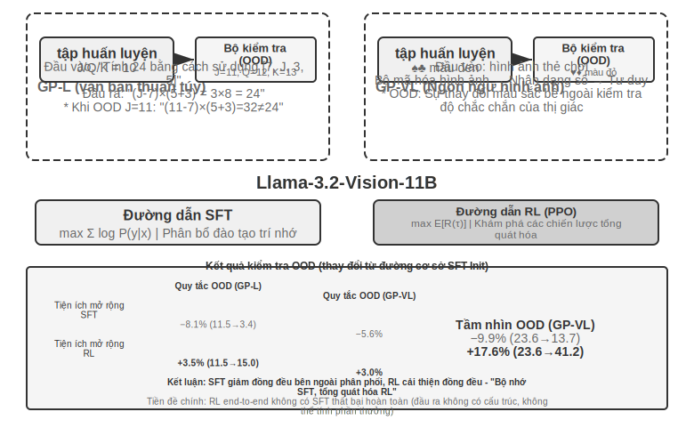
>
>
> GeneralPoints là trò chơi thẻ bài tư duy số học được đề xuất bởi Chu et al. (2025, "SFT ghi nhớ, RL khái quát hóa", arXiv:2501.17161), được sử dụng đặc biệt để đánh giá khả năng khái quát hóa của mô hình. Mục tiêu của nhiệm vụ tương tự như trò chơi “24 điểm”: sử dụng các số trên bốn thẻ và sử dụng các phép tính cộng, trừ, nhân và chia, sử dụng mỗi số đúng một lần để tạo thành số mục tiêu 24. Hai biến thể của văn bản thuần túy GP-L và hình ảnh GP-VL được thiết kế trong thử nghiệm, cho phép chúng tôi kiểm tra khái quát hóa quy tắc và khái quát hóa trực quan tương ứng trong cùng một khuôn khổ.
>
> **Biến thể quy tắc**: J/Q/K được tính là 10 trong quá trình đào tạo và 11/12/13 được tính là 11/12/13 trong quá trình thử nghiệm. Đảm bảo rằng tập kiểm tra chứa các tổ hợp số không thấy trong quá trình huấn luyện (bao gồm các phép toán 11, 12 và 13) và đánh giá nghiêm ngặt khả năng khái quát hóa. **Biến thể trực quan**: Sử dụng bộ đồ đen để luyện tập (♠♣) và bộ đồ màu đỏ để thử nghiệm (♥♦) để đánh giá độ chắc chắn trước những thay đổi về ngoại hình. Dựa trên Llama-3.2-Vision-11B, hãy làm theo quy trình post-training tiêu chuẩn: trước tiên hãy khởi tạo SFT để có các khả năng hướng dẫn cơ bản sau, sau đó mở rộng đào tạo SFT và RL tương ứng trong cùng một ngân sách điện toán (phần RL sử dụng PPO có giá trị Thuật toán mạng), được huấn luyện với dữ liệu quy tắc đơn (J/Q/K=10) và được đánh giá trên các bộ kiểm tra trong phân phối (ID) và ngoài phân phối (OOD).
>
> Kết quả bộc lộ rõ ràng những khác biệt cơ bản. **QUY TẮC OOD**: RL +3,5% trên GP-L (11,5%→15,0%), SFT **giảm** 8,1% (11,5%→3,4%); GP-VL trên RL +3,0%, SFT giảm 5,6%. **OOD trực quan**: RL **+17,6%** trên GP-VL (23,6%→41,2%), SFT giảm 9,9% (23,6%→13,7%).
>
> Sau khi theo dõi độ chính xác của nhận dạng hình ảnh, chúng tôi nhận thấy rằng: RL cải thiện bộ mã hóa hình ảnh cơ bản thông qua tối ưu hóa hướng đến kết quả và cải tiến này liên quan nhiều đến cải thiện hiệu suất tổng thể; trong khi SFT điều chỉnh quá mức mẫu mã thông báo trong quá trình tư duy và bỏ qua việc học các mã thông báo trực quan, dẫn đến giảm độ chính xác của nhận dạng.
>
> Thử nghiệm cũng cho thấy sự cần thiết của SFT đối với RL: theo cài đặt của thử nghiệm này (mô hình cơ bản về cường độ Llama-3.2-Vision-11B, cộng với các yêu cầu đầu ra có cấu trúc nghiêm ngặt), không thể triển khai trực tiếp RL từ đầu đến cuối nếu không có SFT Thất bại hoàn toàn - mô hình cơ bản không thể tạo ra một đầu ra có cấu trúc và phần thưởng hoàn toàn không thể tính toán được. Lưu ý rằng đây là kết luận trong một cài đặt cụ thể chứ không phải là một quy tắc chung: một mô hình cơ bản đủ mạnh có thể bỏ qua SFT và trực tiếp thành công trong RL (xem phần thảo luận trước đây về DeepSeek-R1-Zero). Một phát hiện đáng chú ý khác là càng nhiều lần xác minh thì khả năng khái quát hóa càng tốt: 10 lần +5,99% so với 1 lần +0,48%, cho thấy rằng việc mở rộng tính toán khi suy nghĩ là chìa khóa cho việc khái quát hóa RL.
>
> Tại sao hiệu suất của SFT lại giảm sút khi thay đổi phân phối, trong khi RL lại tốt hơn? SFT học cách ánh xạ "khi bạn nhìn thấy loại đầu vào này, đầu ra loại câu trả lời đó": trong quá trình đào tạo, J/Q/K đều là 10 và mô hình ghi nhớ mẫu cố định "khi gặp J/Q/K, hãy coi nó là 10"; trong quá trình thử nghiệm, J=11, mô hình vẫn tính toán là 10 và đương nhiên mắc lỗi. RL đã học được chiến lược tổng quát hơn về "quá trình tính toán nào có thể nhận được câu trả lời đúng": khi J trở thành 11, mô hình RL sẽ tính toán lại bằng cách sử dụng chiến lược tương tự thay vì áp dụng câu trả lời trong bộ nhớ. Đây là sự khác biệt cơ bản giữa "bộ nhớ" và "khái quát hóa".
>
> Đóng góp cốt lõi của thử nghiệm này là định lượng một cách có hệ thống hiện tượng "bộ nhớ SFT, khái quát hóa RL", chứng minh rằng quy tắc này đúng ở cả phương thức ngôn ngữ thuần túy và ngôn ngữ hình ảnh, đồng thời tiết lộ mối quan hệ hiệp lực giữa SFT và RL: SFT mang lại sự ổn định về định dạng, RL Trên cơ sở này, để vượt qua ranh giới của bộ nhớ, cả hai đều không thể thiếu. Mô hình đào tạo "hình thức trước, tinh thần sau" này - mượn thuật ngữ của hội họa Trung Quốc, trước tiên vẽ chính xác hình thức bên ngoài (dạng thức, cấu trúc), sau đó theo đuổi sự hấp dẫn bên trong (khái quát, chiến lược) - đặt nền tảng phương pháp luận cho các nhiệm vụ đa vòng, đa phương thức tiếp theo.

## RLHF: Từ sở thích của con người đến mô hình khen thưởng

Các thử nghiệm trước đây có một tiền đề chung: nhiệm vụ có những quyền và sai có thể kiểm chứng được - liệu phép tính có đúng và định dạng có tuân thủ hay không thì người xác thực quy tắc có thể chấm điểm. Tuy nhiên, lý do tại sao mô hình đối thoại hiện được triển khai "giống như một trợ lý tử tế và an toàn" lại dựa vào một lộ trình hoàn thiện khác trước đó: **RLHF**(Học tăng cường từ phản hồi của con người, học tăng cường dựa trên phản hồi của con người). Hiểu RLHF không chỉ để hiểu chất lượng đối thoại và sự liên kết bảo mật của các sản phẩm như ChatGPT đến từ đâu mà còn là điều kiện tiên quyết để hiểu các khái niệm như hình phạt KL và hack phần thưởng trong các thuật toán bên dưới.

**Hướng dẫn quy trình ba giai đoạn của GPT.** InstructGPT[^ch7-4] của OpenAI đã thiết lập quy trình tiêu chuẩn vẫn được sử dụng cho đến ngày nay:

1. **SFT**: Sử dụng trình diễn "câu trả lời lệnh" theo cách thủ công để tinh chỉnh mô hình được đào tạo trước và thiết lập các khả năng tuân theo lệnh cơ bản - đó là nội dung đã được thảo luận trong phần trước "SFT (tinh chỉnh có giám sát)".
2. **Mô hình phần thưởng đào tạo (RM)**: Để mô hình tạo ra nhiều câu trả lời cho cùng một lời nhắc và người chú thích sẽ so sánh chúng theo cặp và đánh dấu câu trả lời nào họ thích hơn. Sử dụng các cặp ưu tiên này để huấn luyện mô hình tính điểm, với mục tiêu huấn luyện dựa trên mô hình Bradley-Terry:

   $$\mathcal{L}_{\text{RM}} = -\log \sigma\big(r(x, y_w) - r(x, y_l)\big)$$

Trong số đó, $y_w$ là câu trả lời được ưa thích, $y_l$ là câu trả lời bị từ chối và $\sigma$ là hàm sigmoid. Trực giác rất đơn giản: **Hãy để RM cho điểm cao hơn cho những câu trả lời ưa thích**. Lý do chúng tôi thu thập các so sánh thay vì ấn định điểm là vì con người khó có thể đưa ra điểm tuyệt đối một cách nhất quán (“Câu trả lời này có giá trị 7,3 điểm” gần như không thể gắn nhãn một cách nhất quán), nhưng các đánh giá về “A hay B nào tốt hơn” thì đáng tin cậy hơn nhiều. **Hãy nhớ vai trò của "mô hình phần thưởng" - đó là một chủ đề ẩn trong chương này**: ở đây nó là một cầu thủ ghi bàn được học từ sở thích của con người; Khi chúng ta nói về thiết kế phần thưởng trong Phần 7.10, bạn sẽ thấy nhiều biến thể khác nhau của nó (ORM chỉ xem xét kết quả cuối cùng, PRM với tính điểm từng bước, mô hình phần thưởng tổng quát sử dụng ngôn ngữ tự nhiên để giải thích lý do) và một trường hợp đặc biệt - khi đúng và sai có thể được xác định trực tiếp bằng các quy tắc, "mô hình phần thưởng" chỉ đơn giản thoái hóa thành một đoạn mã xác định (đây là điều tôi sẽ nói bên dưới) RLVR. Tất cả đều trả lời cùng một câu hỏi: **Phần thưởng đến từ đâu**.
3. **Sử dụng điểm RM để thực hiện PPO**: Sử dụng điểm của RM làm tín hiệu khen thưởng, thực hiện đào tạo PPO trên mô hình SFT (xem phần tiếp theo để biết cơ chế của PPO) và để mô hình học cách tạo ra các câu trả lời mà RM cho rằng "con người sẽ thích hơn".

**Hình phạt KL: Không đi quá xa điểm xuất phát (giải thích kỹ về sự phân kỳ của KL).** Phần thưởng cho việc tối ưu hóa thực tế mô hình trong RLHF thường không phải là điểm RM mà là phép trừ thời hạn phạt:

$$r = r_{\text{RM}} - \beta \cdot \mathrm{KL}\big(\pi_\theta \,\|\, \pi_{\text{ref}}\big)$$

Có ba câu hỏi mà người mới bắt đầu thường hỏi về công thức này. Hãy giải thích từng cái một.

**(1) Phân kỳ KL là gì và hình phạt được thêm vào ở đâu?** Phân kỳ KL (Phân kỳ Kullback-Leibler) đo lường sự khác biệt giữa hai phân bố xác suất: hai phân phối càng giống nhau thì KL càng nhỏ và bằng 0; hai phân phối càng ít giống nhau thì KL càng lớn. Hai phân phối ở đây là **chiến lược hiện tại**$\pi_\theta$ (mô hình đang được đào tạo) và **chiến lược tham khảo**$\pi_{\text{ref}}$ (điểm bắt đầu đào tạo, thường là mô hình SFT) cho "phân phối xác suất mã thông báo tiếp theo" được đưa ra trước đó trong cùng một đoạn. $\beta$ kiểm soát cường độ trừng phạt - đó là siêu tham số `kl_coef` phổ biến trong các tập lệnh đào tạo. Trong kỹ thuật, hình phạt này được tính toán từng bit bằng mã thông báo và được thêm vào phần thưởng (per-token KL): mỗi khi mô hình tạo mã thông báo, sự khác biệt về xác suất giữa nó và mô hình tham chiếu ở vị trí này sẽ được so sánh. Độ lệch càng lớn thì phần thưởng cho bước này sẽ bị trừ càng nhiều. Nói cách khác, KL không phải là một khoản lỗ riêng biệt mà được trộn vào tín hiệu phần thưởng và sau đó bộ tính toán lợi thế PPO/GRPO được sử dụng - đây là vị trí chính xác mà nó hoạt động.

**(2) Tại sao lại có hướng "chiến lược hiện tại trước, chiến lược tham khảo cuối cùng"?** Phân kỳ KL không đối xứng, $\mathrm{KL}(P\|Q)\neq\mathrm{KL}(Q\|P)$, hướng không được viết tùy tiện. Nó được viết ở đây là $\mathrm{KL}(\pi_\theta\|\pi_{\text{ref}})$ - chiến lược hiện tại là chiến lược đầu tiên - về mặt toán học được gọi là **KL đảo ngược (KL đảo ngược)**. Điều mà nó trừng phạt là tình huống "$\pi_\theta$ cho xác suất cao ở đâu đó và $\pi_{\text{ref}}$ gần như bằng 0 ở đó", tức là **phạt mô hình vì đi đến những nơi mà mô hình tham chiếu cho rằng nó không nên đến**. Đây chính xác là những gì chúng tôi muốn: mô hình tham chiếu (mô hình SFT) đại diện cho một vùng an toàn “nói ngôn ngữ con người và có định dạng bình thường”. Reverse KL đặt chiến lược hiện tại gần vùng an toàn này để ngăn nó trôi nổi xung quanh. Nếu bạn sử dụng **Forward KL**$\mathrm{KL}(\pi_{\text{ref}}\|\pi_\theta)$ ngược lại, hình phạt sẽ là mô hình "mô hình tham chiếu có nó nhưng mô hình hiện tại bỏ lỡ nó" - điều đó sẽ buộc mô hình phải bao gồm tất cả các biểu thức của mô hình tham chiếu, đây không phải là mục đích của RLHF.

**(3) Tại sao lại thiết kế như thế này? --Nguồn gốc của mode-seeking.** KL đảo ngược có một ký tự chính: đó là **mode-seeking (Tìm kiếm đỉnh cao)**. Điều này đã được báo trước trong Phần 7.1 - KL đảo ngược cho phép mô hình chỉ giữ lại một số "đỉnh" có giá trị cao và loại bỏ phần còn lại của các mô hình một cách dứt khoát mà không cần phải tiếp xúc với mưa và sương như khả năng tối đa của SFT (mass-covering, loại che phủ). Đưa nó vào RLHF, đây chính xác là hiệu quả mà chúng tôi mong muốn: chọn một hoặc hai đầu ra ổn định từ các phương pháp trả lời đạt điểm cao đã được RM phê duyệt, thay vì học tất cả các câu trả lời có thể có. Điều này cũng giải thích tại sao mẫu mã sau RL lại “chắc chắn” hơn và kém đa dạng hơn. Đảo ngược mode-seeking + của KL đặt mô hình gần phân phối tham chiếu. Cả hai kết hợp với nhau là bí quyết cho sự ổn định của RLHF.

**(4) Điều gì sẽ xảy ra nếu bạn không thêm nó?** Trực giác là một câu: **Đừng đi quá xa điểm xuất phát, nếu không điểm của mô hình khen thưởng sẽ không đáng tin cậy.** RM được đào tạo về phân phối đầu ra gần chiến lược tham khảo. Sau khi mô hình được tối ưu hóa theo phân phối mà RM chưa thấy, điểm RM sẽ trở thành phép ngoại suy vô căn cứ và điểm cao không còn đồng nghĩa với chất lượng cao. Do đó, hình phạt KL ngăn chặn cùng lúc hai điều: **hack phần thưởng**(mô hình khai thác sơ hở để thưởng điểm cao thay vì thực sự làm tốt nhiệm vụ, xem đoạn tiếp theo) và **sụp đổ phân phối**(đầu ra thoái hóa thành các dạng cực đoan như lặp lại và mã bị cắt xén). Ngay cả trong quá trình đào tạo RLVR với phần thưởng có thể xác minh được, bộ điều chỉnh KL thường được giữ lại để ổn định quá trình đào tạo (một số tác phẩm như DAPO, Open-Reasoner-Zero cố tình loại bỏ nó - lưu ý rằng bản thân GRPO của DeepSeek-R1-Zero vẫn chứa thuật ngữ KL một cách rõ ràng).

**Mô hình phần thưởng có thể được "tối ưu hóa quá mức".** RM cuối cùng chỉ là đại diện cho sở thích của con người. Định luật Goodhart nói: Một khi một chỉ báo trở thành mục tiêu tối ưu hóa, nó không còn là một chỉ báo tốt nữa - đẩy chỉ báo proxy lên mức cực đoan và mối tương quan của nó với mục tiêu thực sẽ bị bóp méo. Nghiên cứu của OpenAI [^ch7-5] đã đo lường một cách có hệ thống hiện tượng **mô hình phần thưởng quá tối ưu hóa (mô hình phần thưởng over-optimization)** này: khi quá trình đào tạo RL tiến triển, phần thưởng đại lý (điểm RM) tăng đều đặn, trong khi chất lượng thực sự (đánh giá con người) đầu tiên tăng lên rồi giảm xuống. Điều mà người mẫu dần học được không phải là "trả lời hay hơn" mà là "cho RM điểm cao hơn" - lối nói dài dòng, tâng bốc, có vẻ khắt khe trống rỗng. Đây chính xác là hình thức hack phần thưởng cụ thể trong ngữ cảnh RLHF. Hình phạt KL và dừng sớm là các phương pháp giảm nhẹ được sử dụng phổ biến nhất; vấn đề hack phần thưởng trong "Bẫy chung" ở cuối chương này cũng có nguồn gốc tương tự.

**DPO: Bỏ qua mô hình phần thưởng rõ ràng.** Điểm khởi đầu của DPO (Tối ưu hóa ưu tiên trực tiếp, Tối ưu hóa ưu tiên trực tiếp) [^ch7-6] là: vì tác dụng cuối cùng của việc kết hợp "đào tạo RM + PPO" là "tăng xác suất được ưu tiên trả lời, giảm xác suất bị từ chối, đồng thời không ở quá xa mô hình tham chiếu", nên tốt hơn là bỏ qua RM rõ ràng, trực tiếp biến cặp ưu tiên thành một mất phân loại với phần thưởng ngầm - về mặt toán học có thể chứng minh rằng điều này tương đương với tối ưu hóa tùy chọn ngoại tuyến với các ràng buộc KL và mô hình phần thưởng được ẩn hoàn toàn trong chính chính sách. Đào tạo DPO đơn giản như SFT: không lấy mẫu trực tuyến, không có mạng giá trị, không cần bảo trì RM riêng. Cái giá phải trả là nó hoàn toàn ngoại tuyến - nó không thể khám phá các hành vi mới bên ngoài dữ liệu ưu tiên và mức trần hiệu suất được xác định bởi chất lượng và phạm vi bao phủ của dữ liệu ưu tiên.

**Mối quan hệ giữa RLHF và RLVR.** Tóm lại, sự khác biệt giữa hai lộ trình là **phần thưởng đến từ đâu**: phần thưởng dành cho RLHF đến từ RM đã học (đằng sau là dữ liệu về sở thích của con người) và phần thưởng dành cho **RLVR**(Học tăng cường với Phần thưởng có thể xác minh, học tăng cường phần thưởng có thể kiểm chứng) đến từ trình xác thực quy tắc (kiểm tra có vượt qua hay không, câu trả lời có đúng hay không). Các nhiệm vụ Agent hầu hết có thể kiểm chứng được - đó là lý do tại sao chương này tập trung vào RLVR. Nhưng không có sự đánh đổi nào giữa hai điều này: các mô hình được triển khai thực tế được sử dụng chồng lên nhau, RLHF chịu trách nhiệm về chất lượng đối thoại và căn chỉnh bảo mật, còn RLVR chịu trách nhiệm về lý luận và các khả năng của Agent. Mô hình phần thưởng tổng quát được thảo luận trong "Sự phát triển của Mô hình phần thưởng" sau này có thể được coi là sự kết hợp của hai dòng - sử dụng mô hình phần thưởng có thể đào tạo để thực hiện các nhiệm vụ mở không thể được quy định bởi các quy tắc.

## So sánh các thuật toán học tăng cường

Thử nghiệm một vòng trước đó đã chứng minh lợi thế tổng quát hóa của RL. Phần trước cũng đã giới thiệu lộ trình tối ưu hóa ưa thích của RLHF. Tuy nhiên, các thuật toán cụ thể được sử dụng trong các tác phẩm này là khác nhau và chỉ là một phần trong nhiều lựa chọn. Trước khi bước vào các nhiệm vụ nhiều vòng phức tạp hơn, cần phải sắp xếp một cách có hệ thống các đặc điểm và kịch bản áp dụng của các thuật toán chính thống.

> **Tôi xin nói điều quan trọng nhất trước tiên để người đọc không rơi vào công thức.** Phần này liệt kê nhiều tên và công thức thuật toán, nhưng hãy nhớ dòng 2 chính của chương này: **Trong thế giới công nghiệp, chỉ cần bạn biết cách sử dụng và chọn thuật toán RL phù hợp (PPO, GRPO, v.v.) là đủ. Điều thực sự quyết định thành công hay thất bại là dữ liệu và môi trường chứ không phải bản thân thuật toán.** Các thuật toán này từ lâu đã được gói gọn trong các khung hoàn thiện như veRL và TRL và việc gọi chúng thường chỉ yêu cầu thay đổi một vài dòng cấu hình. Vì vậy, mục tiêu của phần này không phải là để bạn biết cách suy luận mà là để bạn xây dựng bản đồ lựa chọn “sử dụng thuật toán nào trong kịch bản nào”; nếu không hiểu phần công thức (dành cho đào tạo kỹ sư) có thể bỏ qua mà không ảnh hưởng đến lần đọc tiếp theo. Phần tiếp theo sẽ giải thích rõ ràng “tại sao dữ liệu và môi trường lại quan trọng hơn thuật toán”.

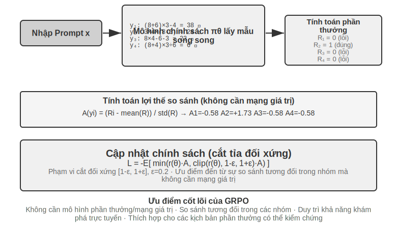

Có những khác biệt cơ bản giữa cảnh RL của LLM Agent hiện đại và RL truyền thống - Agent. Cần phải hiểu ý định của người dùng, gọi công cụ, tạo đầu ra có cấu trúc và tiến hành tư duy chuỗi dài trong nhiều vòng đối thoại. Kiểu ra quyết định đa mục tiêu và nhiều giai đoạn này cho phép "thuật toán lựa chọn đúng" có tác động nhất định, nhưng tác động ít hơn nhiều so với dữ liệu và môi trường.

Từ góc độ lộ trình triển khai, thuật toán RL được chia thành **phương pháp khám phá trực tuyến**(khám phá các chiến lược mới thông qua tương tác với môi trường) và **phương pháp tối ưu hóa ngoại tuyến**(dựa trên tối ưu hóa dữ liệu hiện có, ổn định và trực tiếp hơn). Nhân tiện, đây là một cặp điều khoản nghiêm ngặt đã được hứa hẹn trong bài viết trước: phương pháp **chiến lược đúng hướng (On-Policy)** chỉ tự cập nhật với dữ liệu mới được lấy mẫu của chính chiến lược hiện tại và phương pháp **chiến lược chệch hướng (Off-Policy)** có thể sử dụng dữ liệu được tạo bởi các chiến lược khác (hoặc chiến lược phiên bản cũ) để tìm hiểu (chẳng hạn như Q-learning trước đó). Điều này phù hợp với các phương pháp được thảo luận trong chương này: SFT là phương pháp học tập bắt chước không đúng hướng - dữ liệu đến từ giáo viên hoặc sự minh họa của con người chứ không phải từ chính mô hình; PPO, GRPO Biểu mẫu tiêu chuẩn dùng cho đào tạo LLM đang đi đúng hướng - mỗi vòng được lấy mẫu mới với bản cập nhật mô hình hiện tại (nghĩa là cho phép mô hình chạy hoàn toàn nhiệm vụ và tạo trajectory hoàn chỉnh từ đầu đến cuối); DPO là một tối ưu hóa tùy chọn ngoại tuyến, không lấy mẫu trực tuyến hay lặp lại chính sách theo nghĩa chặt chẽ.

Hầu hết các thuật toán này đều dựa trên cùng một ý tưởng về Chính sách gradient: điều chỉnh các tham số chính sách $\theta$ theo hướng có thể tăng lợi nhuận kỳ vọng. Dạng cơ bản nhất của nó (REINFORCE) là:

$$\nabla_\theta J(\theta) = \mathbb{E}\big[\nabla_\theta \log \pi_\theta(a \mid s)\, G\big]$$

trong đó $\pi_\theta(a\mid s)$ là chiến lược (xác suất chọn hành động $a$ ở trạng thái $s$) và $G$ là phần thưởng tích lũy của trajectory này (hoặc từ bước này trở đi) - phần thưởng càng cao thì xác suất tạo ra hành động càng được tăng cường. Mặc dù việc sử dụng trực tiếp trở lại của toàn bộ trajectory $G$ làm trọng số là không thiên vị, nhưng phương sai là rất lớn; do đó, $b$ cơ sở được đưa ra và **Ưu điểm**(Ưu điểm) $\hat{A}=G-b$ (hành động này tốt hơn nhiều so với mức trung bình) được sử dụng làm trọng số để giảm phương sai. PPO và GRPO tiếp theo về cơ bản là hai loại cải tiến được đưa ra về "cách ước tính và sử dụng ổn định lợi thế $\hat{A}$".

**PPO** Sử dụng "cắt xén" để giới hạn phạm vi của mỗi bản cập nhật nhằm tránh chiến lược đi chệch hướng trong một bước:

$$L^{\text{CLIP}}(\theta) = \mathbb{E}\Big[\min\big(\rho\,\hat{A},\ \operatorname{clip}(\rho,\, 1-\epsilon,\, 1+\epsilon)\,\hat{A}\big)\Big],\quad \rho = \frac{\pi_\theta(a\mid s)}{\pi_{\theta_{\text{old}}}(a\mid s)}$$

Trong số đó, $\rho$ là tỷ lệ xác suất giữa chiến lược cũ và chiến lược mới và $\epsilon$ (chẳng hạn như 0,2) giới hạn phạm vi có thể được điều chỉnh trong một bước duy nhất; "Clip-Higher" sau đây nới lỏng giới hạn trên của $1+\epsilon$.

**GRPO** bỏ qua mạng giá trị (mạng giá trị, mạng thần kinh phụ trợ được đào tạo bổ sung về PPO, được sử dụng để ước tính hàm giá trị riêng biệt cho từng bước trong trajectory để tính toán lợi thế chi tiết hơn) và thay vào đó sử dụng "so sánh tương đối trong nhóm" để ước tính lợi thế: lấy mẫu trajectory $N$ cho cùng một vấn đề sẽ được thưởng $r_1,\dots,r_N$ xác định lợi thế của từng mục như hiệu suất tương đối của nó trong nhóm:

$$\hat{A}_i = \frac{r_i - \operatorname{mean}(r_1,\dots,r_N)}{\operatorname{std}(r_1,\dots,r_N)}$$

Tức là "tích cực nếu nó tốt hơn mức trung bình của cùng một nhóm, tiêu cực nếu nó kém hơn", mà không cần mạng lưới giá trị - đó là lý do tại sao nó rẻ hơn. Cần lưu ý rằng công thức trên bỏ qua số hạng thông thường KL. Trong đào tạo thực tế, hình phạt per-token KL được giới thiệu ở phần trước thường được thêm vào để hạn chế chiến lược gần mô hình tham chiếu.

Bảng 7-4 tóm tắt các đặc điểm cốt lõi của các phương pháp chính thống. Khi đọc, hãy chú ý phân biệt hai điều thường bị nhầm lẫn: **phần thưởng đến từ đâu**(trình xác thực quy tắc, mô hình phần thưởng đã học hoặc dữ liệu sở thích của con người) và **thuật toán nào được sử dụng để tối ưu hóa**. PPO và GRPO không kén chọn nguồn phần thưởng - chúng có thể được kết nối với trình xác thực quy tắc (RLVR) hoặc mô hình phần thưởng (RLHF); sự khác biệt thực sự của chúng nằm ở cách ước tính lợi thế (mạng giá trị so với đường cơ sở tương đối trong nhóm).

Bảng 7-4 So sánh các phương pháp tối ưu hóa post-training và tối ưu hóa thời gian suy luận

| Phương pháp | Loại | Ý tưởng cốt lõi | Ưu điểm | Nhược điểm | Các tình huống áp dụng |
|------|------|---------|------|------|---------|
|**CỦNG CỐ**| Thuật toán RL trực tuyến | Sử dụng phần thưởng cuối cùng của toàn bộ trajectory để cập nhật chiến lược | Thực hiện đơn giản | Phương sai lớn, luyện tập không ổn định | Điểm chuẩn lý thuyết; dạng ban đầu hiếm khi được sử dụng trực tiếp, nhưng biến thể của nó với đường cơ sở (RLOO, REINFORCE++, v.v.) là một trong những dạng phổ biến hiện nay, GRPO về cơ bản là REINFORCE với đường cơ sở nội bộ nhóm |
|**PPO**| Thuật toán RL trực tuyến | Giới hạn từng phạm vi cập nhật để tránh “sai lệch” chính sách | Ổn định, mạng giá trị cung cấp phân bổ tín dụng chi tiết hơn | Yêu cầu đào tạo và lưu trữ bổ sung mạng giá trị, siêu tham số rất nhạy cảm | Nhiều vòng Agent, phân bổ tín dụng trajectory dài |
|**GRPO**| Thuật toán RL trực tuyến | Lấy mẫu nhiều trajectory cho cùng một câu hỏi và so sánh tương đối "cái nào tốt hơn" trong nhóm | Không cần mạng giá trị, chi phí thấp | Những lợi ích được phân bổ đều theo toàn bộ câu trả lời, và việc phân bổ tín dụng còn thô bạo; dựa vào sự khác biệt về phần thưởng trong nhóm | Nhiệm vụ trajectory một vòng/ngắn, kịch bản có sự khác biệt về phần thưởng |
|**DPO**| Tối ưu hóa tùy chọn ngoại tuyến | Biến các cặp ưu tiên trực tiếp thành tổn thất phân loại với phần thưởng ngầm | Tối giản và hiệu quả, không cần lấy mẫu trực tuyến | Không thể khám phá các chiến lược mới, bị giới hạn bởi chất lượng và mức độ bao phủ của dữ liệu tùy chọn ngoại tuyến | Các tình huống đã tồn tại dữ liệu ưu tiên chất lượng cao |
|**KTO**| Tối ưu hóa tùy chọn ngoại tuyến | Chỉ cần gắn nhãn một mẫu duy nhất là "tốt/xấu" | Chi phí ghi nhãn cực thấp | Tín hiệu thô | Các tình huống có nguồn lực ghi nhãn cực kỳ hạn chế |
|**Best-of-N**| Phương pháp thời gian suy luận | Tạo N kết quả đầu ra trong quá trình suy luận, chọn kết quả tốt nhất | Không thay đổi mô hình, thực hiện đơn giản | Chi phí suy luận tăng theo cấp số nhân và khả năng không được gửi vào các tham số | Nhanh chóng cải thiện chất lượng trong giai đoạn đầu, cung cấp ước tính doanh thu giới hạn trên cho RL |

Quay lại các thí nghiệm trong chương này, giải thích trung thực các thuật toán được sử dụng: GeneralPoints và V-IRL (thử nghiệm 7-11, 7-12) là từ cùng một nghiên cứu, sử dụng PPO với mạng giá trị; AdaptThink (thử nghiệm 7-10) sử dụng các mục tiêu tối ưu hóa có ràng buộc tùy chỉnh cộng với việc lấy mẫu tầm quan trọng; phần tiếp theo ReTool (thử nghiệm 7-15) sử dụng PPO dựa trên chuyển đổi veRL (dữ liệu huấn luyện được lấy từ DAPO-Math-17k, nhưng thuật toán tối ưu hóa vẫn là PPO), SimpleVLA (thử nghiệm 7-13) và RLVP (thử nghiệm 7-14) dựa trên GRPO. Vấn đề phân bổ tín dụng phức tạp hơn trong kịch bản nhiều vòng và các thuật toán khác nhau đều có những ưu điểm và nhược điểm riêng.

Lộ trình lựa chọn trong thực tế: Có các tín hiệu khen thưởng và tài nguyên máy tính đáng tin cậy → GRPO (ngắn gọn) hoặc PPO (phân bổ tín dụng linh hoạt, tốt hơn cho các trajectory dài); dữ liệu ưu tiên chất lượng cao → DPO/KTO (chi phí thấp); giai đoạn khám phá ban đầu → Best-of-N để bắt đầu nhanh chóng.

Sau khi đọc bảng này, bạn có thể nghĩ: "Tôi nên tinh chỉnh thuật toán nào?" Câu trả lời có thể gây ngạc nhiên: **Trong hầu hết các trường hợp, một trong hai cách sẽ hoạt động - đừng vội bận tâm đến thuật toán.** Phần tiếp theo dành riêng cho vấn đề này.

## Dữ liệu và môi trường: thứ quan trọng hơn thuật toán

Đây là phần tôi muốn bạn nhớ nhất trong toàn bộ chương này, đồng thời cũng là một phát biểu tích cực về dòng chính thứ hai của chương này. Tôi đã dành rất nhiều thời gian để nói về các thuật toán trước đây, nhưng trải nghiệm của những người tuyến đầu trong ngành thì hoàn toàn ngược lại: tầm quan trọng của thuật toán **kém hơn nhiều so với ba yếu tố cơ bản hơn - độ trung thực của môi trường mô phỏng, chất lượng của dữ liệu đào tạo và khả năng của mô hình cơ bản.** Chỉ cần sử dụng các thuật toán có sẵn; điều thực sự tạo nên sự khác biệt là môi trường và dữ liệu được thực hiện tốt như thế nào. Điều này cũng lặp lại kết luận của Chương 6 (môi trường đánh giá và mô phỏng là nền tảng của quá trình post-training), cũng như sự đảo ngược nhận thức của OpenAI được đề cập trong Phần 7.2 của chương này - hàng thập kỷ nghiên cứu RL đã đảo ngược các ưu tiên. Thứ tự thực sự là **trước (mô hình cơ bản)>môi trường>thuật toán**.

### Môi trường: Nơi thực hành mẫu

Bản chất của RL là "học thử và sai", thử và sai phải có **địa điểm dùng thử và lỗi** - đây là môi trường mô phỏng (môi trường mô phỏng). Mô hình chạy đi chạy lại các nhiệm vụ trong môi trường, nhận phản hồi và điều chỉnh chiến lược. **Độ trung thực** của môi trường (mức độ tương tự với kịch bản triển khai thực tế) trực tiếp xác định liệu chiến lược đã đào tạo có thể được sử dụng hay không:

- **Môi trường bị bóp méo và chiến lược phải bị bỏ rơi.** Nếu dịch vụ khách hàng trong mô phỏng luôn phản hồi theo một quy trình cố định và các thông báo lỗi không khớp với môi trường sản xuất, thì mô hình sẽ học một bộ "chiến lược làm bài kiểm tra" chỉ hoạt động trong mô phỏng và bí mật sẽ bị lộ ngay khi lên mạng. Đây là cách lật ngược dự án RL phổ biến nhất - không phải thuật toán tệ, mà là sân tập và phòng thi không giống nhau.
- **Xây dựng môi trường có độ trung thực cao thường tốn kém và khó khăn hơn chính việc đào tạo.** Một môi trường có thể song song trên diện rộng, có thể tái tạo và cung cấp phản hồi thực tế thường đòi hỏi đầu tư kỹ thuật nhiều hơn là điều chỉnh mô hình. Lý do khiến các thử nghiệm gọi công cụ (hộp cát MCP của AWorld, hộp cát thông dịch mã của ReTool) bỏ nhiều công sức vào việc thiết lập môi trường ở phần sau của chương này chính là vì API thực có giới hạn tốc độ, sẽ bị cấm, có tác dụng phụ và không thể sử dụng trực tiếp để đào tạo ** - trước tiên bạn phải tạo một "thế giới bóng tối" ổn định, có thể kiểm soát và có thể chơi lại.
- **Nửa còn lại của môi trường là chức năng khen thưởng.** Môi trường không chỉ phải mô phỏng “thế giới thay đổi như thế nào” mà còn phải xác định được “việc đó có được thực hiện tốt hay không”. Đây là nguồn của tín hiệu khen thưởng. Thiết kế phần thưởng là một phần của kỹ thuật môi trường và sẽ được thảo luận trong phần tiếp theo.

Tóm lại: **Trước khi bạn bắt đầu điều chỉnh thuật toán, hãy tự hỏi - môi trường mô phỏng của tôi có thực sự giống thế giới thực không?** Câu trả lời cho câu hỏi này quan trọng hơn nhiều so với việc chọn PPO hay GRPO.

### Dữ liệu: Phần quan trọng nhất và chất lượng vượt trội hơn mọi thứ khác

Nếu môi trường là địa điểm thì dữ liệu là tài liệu giảng dạy và là mối liên kết quan trọng nhất trong ba yếu tố **. "Dữ liệu" được đề cập ở đây, giai đoạn SFT biểu thị mẫu (cặp đầu vào-đầu ra) và giai đoạn RL đề cập đến tín hiệu phân phối nhiệm vụ và tín hiệu phần thưởng. Dù ở giai đoạn nào cũng có một nguyên tắc sắt đá:

> **Chất lượng dữ liệu vượt trội các thuật toán.** Cho dù thuật toán có phức tạp đến đâu, nếu nó được cung cấp dữ liệu bẩn, dữ liệu có phạm vi bao phủ không đầy đủ và dữ liệu có sai lệch hệ thống, thì nó chỉ có thể học các chiến lược bẩn. SFT sẽ củng cố nguyên văn nhiễu và sai lệch trong dữ liệu thành các tham số; RL sẽ tối ưu hóa một cách triệt để hướng tới các phần thưởng thiên vị và ngày càng đi xa hơn theo hướng sai lầm (đây là điểm nóng của việc hack phần thưởng). **Rác vào, rác ra** Điều này thể hiện rõ nhất sau khi đào tạo.

Hơn nữa, có một nhận định mà nhiều đội chưa nghĩ tới nhưng lại vô cùng tiết kiệm:

> **Trong nhiều trường hợp, miễn là chất lượng dữ liệu của SFT được đảm bảo thì bạn không cần phải thực hiện RL.** RL đắt và không ổn định (thường gấp hàng chục đến hàng trăm lần SFT) nhưng mọi người thường muốn mua RL ngay khi mới lên. Nhưng nếu việc phân bổ nhiệm vụ của bạn có thể dự đoán được và bạn có thể nhận được dữ liệu trình diễn đủ đa dạng và chất lượng cao thì SFT vững chắc thường có thể đáp ứng các yêu cầu. RL Các kịch bản trong đó RL thực sự không thể thay thế bị hạn chế (xem Phần 7.5): phân phối triển khai sẽ trôi dạt một cách có hệ thống, bản thân phần trình diễn của chuyên gia không tối ưu hoặc chi phí chú thích quá cao để cung cấp bản trình diễn cho mọi đường dẫn. **Trước tiên, hãy chuẩn bị dữ liệu SFT, sau đó xác định xem có cần RL không** - Trình tự này có thể giúp bạn tiết kiệm rất nhiều sức mạnh tính toán và thời gian.

Một ví dụ điển hình trong ngành là Anthropic. Trước năm 2025, công thức post-training của nó chủ yếu bao gồm hai phần: **sử dụng dữ liệu chất lượng cao khổng lồ để thực hiện SFT**, cộng thêm **RLAIF**("học tăng cường dựa trên phản hồi AI" trong Hiến pháp AI, Bai và cộng sự 2022, sử dụng "Hiến pháp" để hướng dẫn mô hình tự chấm điểm câu trả lời để căn chỉnh) - và **không phụ thuộc nhiều vào mã hóa và lý luận ngày nay đã trở thành RLVR (Học tăng cường) tiêu chuẩn với Phần thưởng có thể xác minh)**. Nhưng ngay cả như vậy, chất lượng của các mô hình mã hóa của nó vào thời điểm đó đã rất xuất sắc. Lý do phần lớn không nằm ở thuật toán mà ở chỗ nó đã đạt được chất lượng dữ liệu cao nhất cho cả SFT và RLAIF - điều này khẳng định nhận định trên: **Khi dữ liệu SFT đủ tốt, một tập hợp các công thức không cầu kỳ cũng có thể đào tạo các mô hình hàng đầu và phần thưởng có thể xác minh phức tạp RL có thể không cần thiết.** Tất nhiên, điều này không có nghĩa là RL vô dụng: kể từ năm 2025, Anthropic cũng đã tăng đáng kể khoản đầu tư vào RL - dựa trên nền tảng dữ liệu đặt ra, RL có thể tăng thêm giới hạn trên về khả năng của mình. **Dữ liệu xác định nơi bạn có thể đi, RL xác định bạn có thể đi cao hơn bao nhiêu.**

Chính xác thì chất lượng dữ liệu có nghĩa là gì? Ít nhất ba chiều: **Phạm vi bao phủ**(cho dù nó bao gồm các tình huống khác nhau sẽ gặp phải trong quá trình triển khai, đặc biệt là các tình huống đuôi dài và ranh giới), **sự đa dạng**(liệu người nói, phong cách và giải pháp trong phần trình diễn có đủ phong phú hay không, nếu không mô hình sẽ thu gọn về một chế độ duy nhất, chẳng hạn như "mọi người đều có giọng giống nhau" trong thử nghiệm 7-6), **gắn nhãn chính xác**(liệu bản thân câu trả lời trình diễn có đúng hay không, đặc biệt là trong việc chắt lọc chuỗi suy nghĩ, suy nghĩ sai lầm) quá trình này sẽ được học sinh bắt chước - vì vậy trước tiên hãy thử nghiệm 7-9. Hãy sử dụng trình xác thực quy tắc để lọc ra các bản nhạc có câu trả lời sai trước). Tỷ lệ đầu tư-đầu ra của ba điểm này thường cao hơn nhiều so với việc thay đổi sang một thuật toán ưa thích hơn.

Chương 9 sẽ lặp lại nhận định này một lần nữa: trong nhận dạng giọng nói, mô hình luôn dao động “có nên chấp nhận lời nói hay không”. Nguyên nhân sâu xa không phải là cấu trúc mô hình mà là nhãn đào tạo được đánh dấu bằng "Quan điểm của Chúa" - thay đổi nhãn thành "chỉ sử dụng thông tin có sẵn tại thời điểm đưa ra quyết định" và vấn đề sẽ biến mất. **Nhiều khi, dữ liệu còn quan trọng hơn kiến trúc.**

### Khi nào đến lượt thuật toán?

Không phải thuật toán không quan trọng chút nào mà vị trí của nó là sau này. Trình tự nỗ lực hợp lý là: **Trước tiên, hãy chọn một mô hình cơ bản mạnh → sau đó đánh bóng môi trường và dữ liệu tại chỗ → cuối cùng thực hiện tối ưu hóa biên trên thuật toán và các siêu tham số.** Khi môi trường của bạn đủ thực, dữ liệu đủ tốt và mô hình cơ bản đủ mạnh, sự khác biệt giữa các thuật toán sẽ trở nên rõ ràng. Tại thời điểm này, những câu hỏi như "GRPO hoặc PPO hoặc Clip-Higher" đáng được điều tra nghiêm túc. Ngược lại, việc triển khai thuật toán trước khi môi trường và dữ liệu sẵn sàng là một điều ngược lại. Với ưu tiên này, chúng tôi chuyển sang các nhiệm vụ đa nhiệm—trong đó thiết kế phần thưởng (nơi dữ liệu và môi trường gặp nhau) trở thành sự khác biệt giữa thành công và thất bại.

## Từ một vòng đến nhiều vòng: phân bổ tín dụng và thiết kế phần thưởng

### Thử thách cốt lõi của nhiệm vụ nhiều vòng

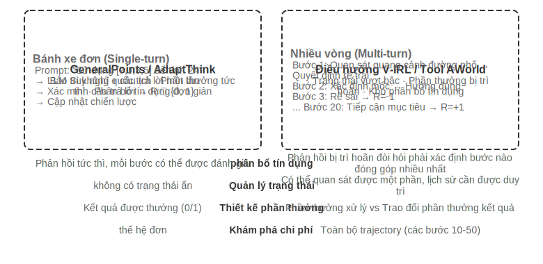

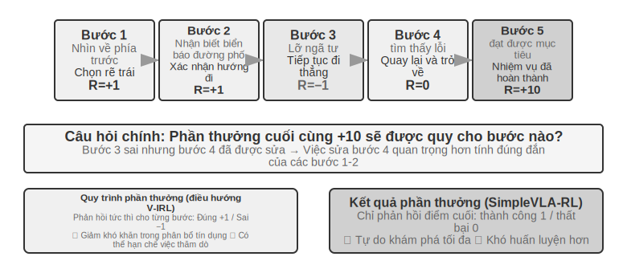

Từ một vòng đến nhiều vòng, có một bước nhảy vọt về chất lượng về độ phức tạp. Policy không chỉ phải lựa chọn hành động tối ưu hiện tại mà còn phải xem xét giá trị trạng thái trong tương lai; không chỉ phải xử lý phản hồi ngay lập tức mà còn thực hiện **Gán tín dụng** dưới phần thưởng bị trì hoãn - xác định bước nào trong chuỗi nhiều bước đóng góp nhiều nhất vào kết quả cuối cùng. Ví dụ: đại diện dịch vụ khách hàng, Agent, đã dành 10 vòng đối thoại để giải quyết vấn đề của người dùng và cuối cùng nhận được lời khen ngợi - nhưng lời khen ngợi này nên được quy cho câu hỏi chính xác ở vòng thứ hai hay cho lời giải thích của bệnh nhân ở vòng thứ bảy? Nhiều vòng cũng gây ra một khó khăn khác: **Observability một phần**(Agent không thể có được trạng thái hoàn chỉnh và phải xây dựng biểu diễn trạng thái tiềm ẩn từ các quan sát lịch sử).

Dạng vật lý của tương tác nhiều vòng được thảo luận ở đây chính xác là chu trình ReAct được mô tả trong Chương 1 và 4 - mỗi vòng là sự lặp lại của **Suy nghĩ → Hành động → Quan sát** và độ trễ phần thưởng xuất phát từ hạn chế về cấu trúc rằng "kết quả cuối cùng chỉ có thể được đánh giá sau nhiều vòng."

### Mật độ và mô hình tín hiệu khen thưởng

Thiết kế phần thưởng được thảo luận trong phần này cũng có thể áp dụng cho các nhiệm vụ một vòng; Lý do tại sao nó được xếp vào phần nhiều vòng là vì khó khăn trong việc phân bổ tín dụng trong nhiều vòng khiến "phản hồi cho Duomi và hình thức phản hồi nào sẽ sử dụng" từ một lựa chọn trở thành chìa khóa dẫn đến thành công hay thất bại. Tín hiệu phần thưởng có hai chiều thiết kế: Mật độ (tần suất đưa ra phản hồi - phần thưởng nhị phân/thưa thớt/quy trình) và Biểu diễn (phản hồi trông như thế nào - vô hướng/vectơ/tạo).

Trước khi thảo luận về thiết kế phần thưởng nhiều vòng, hãy sắp xếp một cách có hệ thống không gian thiết kế của tín hiệu phần thưởng. Đây không chỉ là vấn đề cốt lõi của đào tạo RL mà còn liên quan chặt chẽ đến đánh giá tự động được thảo luận trong Chương 6 - **Môi trường đánh giá được thiết kế tốt thường có thể được chuyển đổi thành môi trường đào tạo chất lượng cao**. Nhưng cần phân biệt hai điều: “Môi trường đánh giá có thể được sử dụng lại” không có nghĩa là “dữ liệu đánh giá này có thể được sử dụng trực tiếp cho việc đào tạo”.

Hãy xem ba ví dụ. **SWE-bench** cung cấp một ví dụ điển hình của quá trình chuyển đổi này: SWE-Gym xây dựng một bộ nhiệm vụ có thể huấn luyện dựa trên nó (mô tả vấn đề làm đầu vào, bản vá làm tín hiệu giám sát, trường hợp kiểm thử cung cấp tín hiệu phần thưởng) - nhưng nội dung được sử dụng để đào tạo là bộ nhiệm vụ mới được xây dựng và OpenAI được sàng lọc theo cách thủ công **SWE-Bench đã được xác minh** 500 tập hợp con đánh giá câu hỏi này phải được được tách biệt hoàn toàn khỏi dữ liệu huấn luyện. Sau khi được trộn vào tập huấn luyện, việc đánh giá sẽ mất đi ý nghĩa (đây chính là điểm căng thẳng được thảo luận trong Câu hỏi 10 của chương này). Bản ghi trajectory hoàn chỉnh của **τ²-bench**(lịch sử hội thoại, lệnh gọi công cụ, thay đổi trạng thái) cung cấp dữ liệu có giá trị cho việc học mô phỏng - trajectory thành công được sử dụng làm mẫu dương tính và trajectory thất bại được gắn nhãn là mẫu âm tính. **Các mẫu được tham số hóa của AndroidWorld** có thể tạo ra vô số biến thể theo lô, hỗ trợ việc học khóa học một cách tự nhiên - từ các thao tác một bước đơn giản đến các quy trình ứng dụng chéo phức tạp.

Các ví dụ này đưa ra cùng một kết luận: chất lượng của tín hiệu khen thưởng do môi trường đánh giá cung cấp quyết định trực tiếp đến hiệu quả của quá trình đào tạo RL - miễn là dữ liệu được sử dụng để đào tạo và dữ liệu được sử dụng để đánh giá được tách biệt.

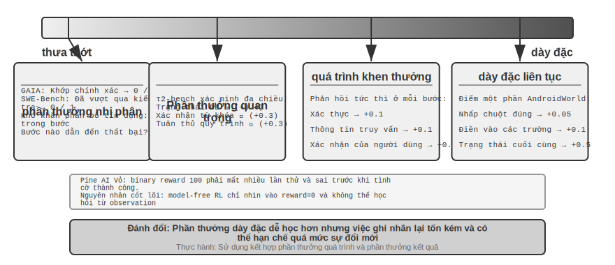

**Các tình huống áp dụng cho phần thưởng nhị phân.**

Đối với nhiều nhiệm vụ, phần thưởng nhị phân đơn giản nhất (thành công=1, thất bại=0) là đủ tốt. Ví dụ: "Trả lời một câu hỏi toán học" - câu trả lời là đúng hoặc sai, không có vùng xám ở giữa; hoặc "Thực hiện truy vấn SQL" - kết quả trả về khớp với mong đợi hoặc không khớp. Đối với các nhiệm vụ có câu trả lời chính xác rõ ràng, phần thưởng nhị phân rất đơn giản và đáng tin cậy và không yêu cầu thiết kế phức tạp hơn.

Vấn đề xảy ra với những nhiệm vụ mở không có câu trả lời đúng rõ ràng.

**Vấn đề nan giải của phần thưởng thưa thớt.**

Lấy kịch bản Pine AI thực hiện cuộc gọi điện thoại làm ví dụ. Sử dụng phần thưởng nhị phân (phần thưởng nhị phân, thành công = 1, thất bại = 0) để huấn luyện Agent giúp người dùng liên hệ với Xfinity để sửa đổi gói: lần đầu tiên họ quên thu thập số tài khoản, phần thưởng thất bại = 0; lần thứ hai họ quên bốn chữ số cuối của thẻ tín dụng, phần thưởng thất bại = 0; lần thứ ba lỡ địa chỉ thanh toán, phần thưởng thất bại = 0... Phải mất 100 lần mới vô tình thành công.

Gốc rễ của vấn đề đã được Silver và Sutton chỉ ra trong "Chào mừng đến với Kỷ nguyên Trải nghiệm" [^ch7-8]: Phương pháp RL hiện tại chỉ có thể học hỏi từ kết quả thành công hay thất bại cuối cùng chứ không thể học hỏi từ phản hồi phong phú do môi trường đưa ra. Bộ phận chăm sóc khách hàng nói rõ ràng "bắt buộc phải có bốn chữ số cuối của thẻ tín dụng", và con người sẽ nhớ nó sau khi nghe một lần, nhưng RL chỉ nhìn thấy kết quả cuối cùng là "thất bại" và không biết tại sao lại thất bại. Điều tệ hơn: Trong quy trình 10 bước, ngay cả khi 9 bước đầu tiên hoàn hảo và chỉ có bước thứ 10 sai thì tín hiệu vẫn chỉ là "toàn bộ nhiệm vụ đã thất bại" và không có cách nào để biết bước nào sai. Các công nghệ tiên tiến như On-Policy Hình phạt đường dẫn xác minh và chưng cất (RLVP) ở phần sau của chương này được thiết kế để giảm bớt tình trạng khó xử này.

**Phần thưởng quy trình** đưa ra phản hồi ngay lập tức về từng bước quan trọng trong quá trình thực hiện, chuyển đánh giá từ hộp đen sang hộp trắng. Ví dụ: trong quá trình tạo mã, mỗi giai đoạn như hiểu yêu cầu, tìm kiếm mã, thiết kế giải pháp, viết mã và chạy thử nghiệm có thể được đánh giá riêng biệt; trong các tình huống dịch vụ khách hàng, bạn có thể kiểm tra xem các bước như xác minh danh tính, truy vấn thông tin, xác nhận và thanh toán có chính xác hay không. Tuy nhiên, phần thưởng cho quy trình phải đối mặt với những thách thức như chi phí ghi nhãn cao và khả năng bị hạn chế quá mức đối với sự đổi mới. Trong thực tế, chúng cần được sử dụng kết hợp với phần thưởng kết quả.

**Sự phát triển của mô hình khen thưởng.**

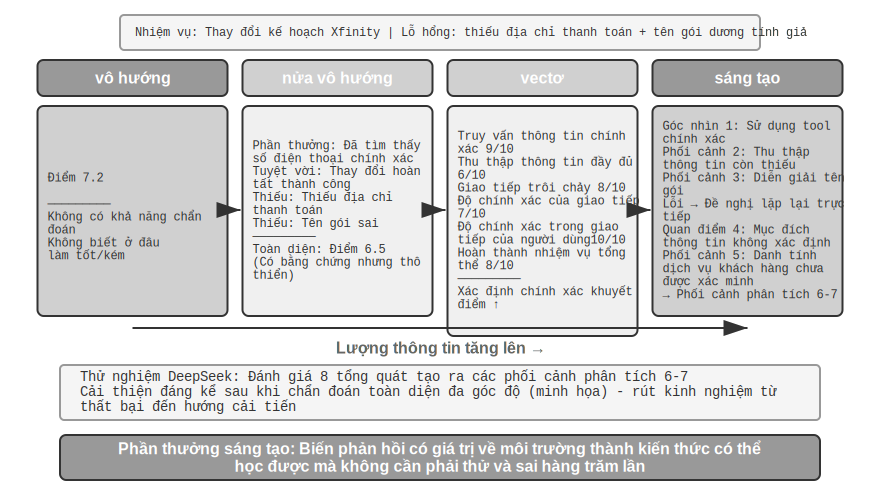

Nghiên cứu của DeepSeek (Liu và cộng sự, 2025) đã phân tích một cách có hệ thống sự khác biệt về tín hiệu học tập giữa các mô hình phần thưởng khác nhau trên tính liên tục của sinh vô hướng-bán vô hướng; Ngoài ra, cuốn sách này còn bổ sung thêm khía cạnh tính điểm vectơ (đa chiều). Để hiểu một cách trực quan sự khác biệt giữa các mô hình, chúng ta hãy sử dụng kịch bản trước đó về việc Pine AI gọi điện để đăng ký gói Xfinity: Lần này Agent đã hoàn thành nhiệm vụ, nhưng có sai sót - địa chỉ thanh toán đã bị bỏ qua và cần được bổ sung, đồng thời tên gói bị báo cáo nhầm là Performance Pro thay vì Performance Plus (tất cả các điểm sau đây đều mang tính chỉ báo):

**Mô hình vô hướng**: Điểm 7,2 - không có khả năng chẩn đoán, không biết điều gì diễn ra tốt đẹp và điều gì sai. **Mô hình bán vô hướng**: Phân tích ưu nhược điểm trước rồi cho 6,5 điểm - có cơ sở nhưng lượng thông tin còn hạn chế. **Mô hình vectơ (các chiều được bổ sung trong cuốn sách này)**: Được tính điểm riêng theo nhiều chiều - độ chính xác của truy vấn thông tin 9/10, mức độ hoàn chỉnh của việc thu thập thông tin 6/10, khả năng giao tiếp trôi chảy 8/10, độ chính xác khi giao tiếp 7/10, độ chính xác khi giao tiếp của người dùng 10/10 và mức độ hoàn thành nhiệm vụ tổng thể 8/10. Đây giống như một báo cáo khám sức khỏe, có thể xác định chính xác vấn đề ("Thu thập thông tin" chỉ có 6 điểm, cho biết cần tối ưu hóa các lời nhắc trong quá trình thu thập).

**Mô hình sáng tạo**: Sử dụng ngôn ngữ tự nhiên để đưa ra mô tả chi tiết và hỗ trợ lấy mẫu nhiều lần để phân tích từ các góc độ khác nhau - nói một cách sơ đồ, nhiều đánh giá của cùng một mẫu thực hiện có thể thu được các quan điểm phân tích bao gồm các khía cạnh khác nhau. Kết hợp những chẩn đoán này để cải thiện, lợi ích sẽ lớn hơn nhiều so với việc chỉ đạt điểm. Kết luận thực sự của bài báo DeepSeek là mô hình phần thưởng tổng quát có thể liên tục cải thiện chất lượng đánh giá thông qua việc mở rộng thời gian suy luận (đánh giá nhiều mẫu rồi tổng hợp), vượt qua giải pháp vô hướng chỉ dựa vào việc mở rộng kích thước mô hình trên nhiều điểm chuẩn của mô hình phần thưởng. Giá trị cốt lõi của phần thưởng mang tính sáng tạo là chuyển đổi phản hồi phong phú từ môi trường thành kiến thức có thể học được, cho phép Agent tìm hiểu hướng cải tiến từ một thất bại thay vì hàng trăm thử nghiệm và sai sót mù quáng.

Từ quan điểm của RLHF, mô hình phần thưởng tổng quát có thể được coi là sự phát triển của mô hình phần thưởng phân biệt đối xử trước đó của Bradley-Terry: RM phân biệt đối xử chỉ đưa ra điểm vô hướng (ai cao hơn và ai thấp hơn), trong khi RM tổng quát sử dụng ngôn ngữ tự nhiên để đưa ra phán đoán bằng lý luận và cũng cho biết "tại sao nó tốt và tại sao nó xấu". Điều này làm cho nó minh bạch hơn một cách tự nhiên và dễ dàng mở rộng hơn cho các tác vụ mở khó thực hiện bằng các quy tắc và phân số vô hướng.

Chức năng phần thưởng nào được chọn tùy thuộc vào cách xác minh nhiệm vụ. Nếu câu trả lời có thể được xác minh tự động bằng mã (chẳng hạn như câu hỏi toán học, bài kiểm tra đơn vị), việc sử dụng phần thưởng nhị phân là đơn giản và dễ hiểu nhất; nếu nhiệm vụ có nhiều khía cạnh chất lượng độc lập (chẳng hạn như độ chính xác của thông tin trong các tình huống dịch vụ khách hàng, lịch sự trong giao tiếp, tỷ lệ giải quyết vấn đề), hãy sử dụng phần thưởng vectơ để đánh giá theo chiều hướng; nếu nhiệm vụ có tính mở cao và khó phân tách các khía cạnh (chẳng hạn như viết sáng tạo, các cuộc hội thoại phức tạp), hãy sử dụng phần thưởng mang tính tổng quát để mô hình phán đoán đưa ra phân tích định tính.

**Đào tạo mô hình khen thưởng mang tính sáng tạo.**

Làm thế nào để đào tạo một mô hình khen thưởng mang tính sáng tạo? Các phương pháp truyền thống yêu cầu các chuyên gia con người đánh giá một số lượng lớn các trường hợp và sau đó để mô hình bắt chước chúng, điều này gây tốn kém và con người thường khó giải thích tại sao A tốt hơn B. Phương pháp DeepSeek cho phép mô hình tìm hiểu khả năng đánh giá của chính nó theo ba bước:

Ở bước đầu tiên, mô hình sẽ tự động tạo ra các nguyên tắc đánh giá cho các nhiệm vụ cụ thể. Ví dụ: khi đánh giá "giúp người dùng gọi các thay đổi gói Xfinity", mô hình đã kết luận: "Agent xuất sắc phải: 1) Tìm kênh dịch vụ khách hàng chính thức chính xác; 2) Thu thập thông tin xác minh danh tính đầy đủ; 3) Chuyển tiếp chính xác nhu cầu của người dùng trong khi gọi điện thoại; 4) Tránh bịa đặt hoặc trình bày sai thông tin; 5) Phản hồi kịp thời khi xử lý các yêu cầu dịch vụ khách hàng."

Bước thứ hai là đánh giá từng quy trình thực hiện dựa trên các nguyên tắc. Tiếp tục với ví dụ trước: Bạn có tìm thấy số điện thoại chính xác không? Có, 1-800-XFINITY là dịch vụ khách hàng chính thức. Tất cả thông tin đã được thu thập chưa? Không, địa chỉ thanh toán bị thiếu. Diễn giải có chính xác không? Có lỗi, tên gói sai.

Ở bước thứ ba, hệ thống tự động kiểm tra tính chính xác của đánh giá. Ví dụ: nếu mô hình nói "tên gói hàng được nêu chính xác", nhưng bản nhạc thực tế cho thấy tên đó sai, hệ thống sẽ đưa ra phản hồi tiêu cực; nếu mô hình xác định chính xác địa chỉ thanh toán bị thiếu, nó sẽ đưa ra phản hồi tích cực. Thông qua thực hành lặp đi lặp lại trên hàng nghìn trường hợp, mô hình dần dần học cách hình thành các nguyên tắc hợp lý cho các nhiệm vụ khác nhau và đưa ra chẩn đoán chính xác.

Phương pháp này có một số ưu điểm chính: khả năng khái quát hóa mạnh mẽ (bạn học được khả năng tổng hợp của việc “đặt tiêu chuẩn và đưa ra đánh giá” thay vì thang đánh giá cố định); quy trình đánh giá minh bạch và dễ dàng xem xét các thành kiến (ví dụ: nếu bạn thấy rằng mô hình luôn coi "trả lời dài" là một lợi thế thì bạn biết rằng mô hình đó nhầm lẫn coi độ dài là chất lượng); nó hỗ trợ sự đồng phát triển của mô hình phần thưởng và mô hình chiến lược, thay vì mô hình phần thưởng cố định như phương pháp truyền thống.

### Phần thưởng quá trình và phần thưởng kết quả: những lựa chọn chính cho nhiệm vụ nhiều vòng

Ngoài việc phân bổ tín dụng và observability một phần, các nhiệm vụ nhiều vòng còn phải đối mặt với vấn đề phụ thuộc vào khoảng cách xa - tác động của các quyết định ban đầu như đặt mục tiêu phụ và lựa chọn công cụ có thể không rõ ràng cho đến hàng chục bước sau đó. Điều này làm cho thiết kế phần thưởng phải đối mặt với một lựa chọn quan trọng: **Phần thưởng quy trình** đưa ra phản hồi ở mỗi bước, giúp giảm bớt khó khăn trong việc phân bổ tín dụng nhưng gây ra sai lệch thiết kế nhân tạo, có thể hạn chế không gian thăm dò; **Phần thưởng kết quả** chỉ đưa ra phản hồi ở điểm cuối, mang lại sự tự do khám phá tối đa, nhưng độ khó huấn luyện và yêu cầu mẫu cao hơn. Ví dụ, phần thưởng quá trình giống như việc giáo viên sửa bài tập về nhà theo từng câu hỏi, học sinh có thể nhanh chóng biết mình mắc lỗi ở đâu; phần thưởng kết quả giống như chỉ xem kết quả thi cuối kỳ, học sinh có nhiều quyền tự do khám phá phương pháp học tập hơn nhưng phản hồi lại đến rất muộn. Việc thiết kế chức năng khen thưởng có liên quan chặt chẽ đến việc xây dựng môi trường đánh giá được thảo luận trong Chương 6 - môi trường đánh giá tự động chất lượng cao là điều kiện tiên quyết để đào tạo RL.

Về mặt thuật ngữ, hai phần thưởng này tương ứng với hai loại mô hình phần thưởng: **Mô hình phần thưởng quy trình (PRM)** chấm điểm từng bước suy luận hoặc thực hiện trung gian và tác phẩm tiêu biểu là "Hãy xác minh từng bước" [^ch7-7] của OpenAI - đối với các nhiệm vụ suy luận toán học, PRM được đào tạo bằng chú thích thủ công từng bước tốt hơn đáng kể so với việc giám sát chỉ nhìn vào câu trả lời cuối cùng; **Mô hình phần thưởng kết quả (Mô hình phần thưởng kết quả), ORM)** chỉ đánh giá kết quả cuối cùng. Trình xác thực quy tắc trong RLVR được đề cập ở trên có thể được coi là trường hợp đặc biệt của ORM - thay thế "mô hình tính điểm đã học" bằng các quy tắc xác định.

**Phân bổ tín dụng trong thực tế.** Đối với các dự án, việc phân bổ tín dụng được thực hiện theo một số cơ chế cụ thể. Hệ số chiết khấu $\gamma$ thường được đặt trực tiếp thành 1 trong nhiều vòng LLM RL: nhiệm vụ chỉ có vài đến hàng chục vòng và mục tiêu tối ưu hóa là thành công cuối cùng. Không cần thiết phải giảm phần thưởng cho "thành công sớm hơn". PPO dựa trên GAE (Ước tính lợi thế tổng quát). Trực giác là sử dụng mạng giá trị để ước tính "bước này tốt hơn mong đợi bao nhiêu" cho mỗi bước trong trajectory và đưa ra sự thỏa hiệp có trọng số giữa độ lệch và phương sai. GRPO đi đến một thái cực khác: nó coi toàn bộ phản hồi là một hành động duy nhất và giá trị lợi thế ở cấp độ trajectory được phân bổ đều cho tất cả các mã thông báo - các câu hỏi chính xác ở vòng thứ hai và lời chào không hợp lệ ở vòng thứ bảy sẽ nhận được chính xác cùng một khoản tín dụng. Việc phân bổ tín dụng thô này không phải là vấn đề lớn trong các nhiệm vụ ngắn một vòng, nhưng nó sẽ làm loãng tín hiệu học tập trong các nhiệm vụ nhiều vòng dài hạn - đây là lý do tại sao PPO với mạng giá trị vẫn có giá trị trong các tình huống nhiều vòng. Ở giữa là khấu hao turn-level: lợi thế tính toán theo đơn vị "vòng" (ví dụ: tận dụng phản hồi môi trường hoặc xử lý phần thưởng sau mỗi vòng), rẻ hơn token-level và chi tiết hơn cấp độ trajectory, một sự thỏa hiệp phổ biến giữa các khung Agent RL nhiều vòng hiện tại.

> **Thử nghiệm 7-12 ★★★: V-IRL-VL Tư duy không gian - Phần thưởng quá trình**
>
> V-IRL (Yang và cộng sự, 2024; thử nghiệm này tiếp nối nghiên cứu nêu trên của Chu và cộng sự 2025, thuật toán RL cũng là PPO với mạng giá trị) là môi trường điều hướng trực quan thế giới mở, sử dụng chế độ xem đường phố thực của thành phố. V-IRL-L được mô tả bằng văn bản thuần túy và V-IRL-VL cung cấp lưới hình ảnh ở chế độ xem phố 2 × 2 (trước, sau, trái và phải). 1.000 tuyến đường ở New York được sử dụng để đào tạo và 18 tuyến đường ở chín thành phố bao gồm Milan, New Delhi, London và Hồng Kông của điểm chuẩn chính thức V-IRL được sử dụng để thử nghiệm - phong cách kiến trúc, bố cục đường phố và điều kiện ánh sáng rất khác nhau.
>
> **Biến thể quy tắc**: sử dụng hướng tuyệt đối (north/east) để huấn luyện và hướng tương đối (left/right) để thử nghiệm. **Biến thể trực quan**: Đã thử nghiệm trên khắp các thành phố.
>
> Kết quả xác minh lại "Bộ nhớ SFT, khái quát hóa RL". Quy tắc OOD: RL +11,0% trên V-IRL-L, SFT **giảm 79,5%**; RL +9,3% trên V-IRL-VL, SFT giảm 33,2%. OOD trực quan: RL cải thiện từ 16,7% lên **77,8%**(+61,1%) trên V-IRL-VL, RL từ đầu đến cuối sử dụng các mô hình nguồn mở để vượt qua mức cơ bản mạnh mẽ của kỹ thuật nhanh chóng cẩn thận dựa trên các mô hình nguồn đóng; SFT giảm xuống 11,1% (-5,6%).
>
> Phần thưởng quá trình đóng vai trò quan trọng trong thử nghiệm này. Không giống như các nhiệm vụ một vòng của GeneralPoints, việc điều hướng yêu cầu phản hồi ở mỗi bước: +1 cho hành động đúng, -1 cho hành động sai và thêm -1,5 cho nhận dạng mốc không chính xác. Phản hồi dày đặc này giúp giảm bớt khó khăn trong việc phân bổ tín dụng dài hạn - khi Agent mắc lỗi ở bước 5, nó sẽ ngay lập tức nhận được phản hồi tiêu cực, thay vì đợi đến khi kết thúc nhiệm vụ ở bước 20 mới biết. Cùng với cơ chế thử lại xác minh (verify_iter=2, cho phép hai lần thử tại một điểm quyết định), hiệu quả mẫu và độ ổn định trong quá trình đào tạo được cải thiện hơn nữa.
>
> Sau khi theo dõi mối quan hệ giữa độ chính xác của nhận dạng hình ảnh và hiệu suất tổng thể, chúng tôi nhận thấy rằng: RL không chỉ tối ưu hóa "việc ra quyết định sau khi có kết quả nhận dạng nhất định" mà còn cải thiện "bản thân nhận dạng hình ảnh" - tín hiệu tối ưu hóa hướng đến kết quả được truyền ngược đến lớp nhận thức, thúc đẩy bộ mã hóa hình ảnh tìm hiểu các cách trình bày tính năng liên quan đến nhiệm vụ. Mặt khác, SFT có xu hướng quá phù hợp ở lớp suy nghĩ và bỏ qua việc học ở lớp nhận thức, khiến hình thức trực quan trở nên không hợp lệ ngay khi nó thay đổi.
>
> Sức mạnh tổng hợp giữa SFT và RL thể hiện rõ hơn trong các nhiệm vụ nhiều vòng. Nếu không khởi tạo SFT, RL không thể được đào tạo một cách hiệu quả (mô hình cơ sở không thể tạo ra đầu ra JSON có cấu trúc). Tuy nhiên, nếu SFT được đào tạo quá mức và dẫn đến tình trạng trang bị quá mức nghiêm trọng, RL cũng sẽ không thể khôi phục hiệu suất ngoài phân phối (OOD). Đây là một sự cân bằng mong manh: SFT nên được rèn luyện cho đến khi “thể thức ổn định và khả năng đã bắt đầu thành hình”, không thích hợp để bị ám ảnh bởi việc chiến đấu.
>
> **Thử nghiệm 7-13 ★★★: SimpleVLA-RL - Phần thưởng kết quả `[Thử nghiệm mở rộng]`**
>
> Mô hình VLA (Vision-Language-Action) thống nhất nhận thức trực quan, hiểu ngôn ngữ và tạo ra hành động, đồng thời là mô hình mới nổi trong lĩnh vực vận hành robot. Nó phải đối mặt với hai thách thức lớn: Mở rộng quy mô SFT yêu cầu thao tác trajectory thủ công ở quy mô lớn (cực kỳ tốn kém để thu thập và hạn chế tính đa dạng) và các mô hình được đào tạo dựa trên các cảnh hạn chế bị suy giảm hiệu suất đáng kể khi gặp phải các nhiệm vụ, môi trường hoặc vật thể không nhìn thấy. Lấy cảm hứng từ sự cải thiện đáng kể của DeepSeek-R1 về khả năng tư duy từng bước thông qua RL, thử nghiệm này khám phá xem liệu RL cũng có thể nâng cao khả năng tạo hành động từng bước của VLA hay không. SimpleVLA-RL được xây dựng trên veRL, chỉ sử dụng phần thưởng kết quả nhị phân (thành công/thất bại), giới thiệu ba cải tiến khám phá: **Lấy mẫu động** để lọc các nhóm thành công/tất cả thất bại để đảm bảo độ dốc ổn định; **Giới hạn cắt cao hơn**[0,8, 1,28] để khuyến khích khám phá; **Nhiệt độ cao hơn** 1.6 để tạo ra các trajectory đa dạng. Sự kết hợp ba mục được cải thiện khoảng 30% trong 300 bước.
>
> Đã báo cáo kết quả cấp cao **97,6%** trên LIBERO, một nền tảng chuẩn cho các tác vụ thao tác bằng robot. Thử nghiệm khởi động nguội: Mỗi nhiệm vụ chỉ có 1 trajectory SFT (17,3%) và sau khi thêm RL đạt **91,7%**(+74,4 điểm phần trăm, mức cải thiện tương đối khoảng 430%), điều này chứng tỏ mạnh mẽ khả năng mạnh mẽ của RL trong điều kiện khan hiếm dữ liệu.
>
> "Pushcut" xuất hiện trong quá trình huấn luyện - đây là một kiểu hành động mới được RL phát hiện độc lập, chưa từng xuất hiện trong các cuộc biểu tình của con người. Lộ trình minh họa tiêu chuẩn là "Tiếp cận→Grab→Nâng theo chiều dọc→Di chuyển theo chiều ngang→Đặt xuống", trong khi RL đã tìm thấy đường dẫn tốt hơn: "Tiếp cận→Grab→Giữ ở mức thấp→Đẩy theo chiều ngang→Hoàn thành", giúp loại bỏ bước nâng, nhanh hơn và yêu cầu định vị ít chính xác hơn. Đây là bằng chứng thuyết phục cho thấy RL có thể vượt xa việc học bắt chước và khám phá ra những chiến lược tốt hơn mà con người chưa từng nghĩ tới.
>
> Khung sử dụng thuật toán GRPO, kết hợp với chiến lược lấy mẫu động - chỉ giữ lại các nhiệm vụ có tỷ lệ đào tạo thành công vừa phải, hình thành khóa học một cách tự nhiên (dễ trước, khó sau). Hiệu suất thời gian thực phụ thuộc vào việc phân chia hành động: mô hình suy luận một lần để tạo ra các hành động gồm nhiều bước trong tương lai, được thực thi tuần tự bởi luồng điều khiển và GPU tạo ra lô tiếp theo một cách không đồng bộ trong nền. Miễn là thời gian suy luận nhỏ hơn thời gian thực hiện, robot có thể duy trì chuyển động liên tục và mượt mà (xem Lớp điều khiển VLA Chương 9 để biết thảo luận đầy đủ về phân đoạn hành động).
>
> Sự cải thiện khả năng khái quát hóa được thể hiện ở nhiều khía cạnh: khái quát hóa không gian (các chiến lược được đào tạo theo bố cục cụ thể có thể được chuyển sang các cấu hình khác nhau), khái quát hóa đối tượng (xử lý hình dạng và kết cấu của các đối tượng không nhìn thấy) và khái quát hóa mục tiêu (thích ứng với mô tả mục tiêu nhiệm vụ mới).
>
> So sánh với V-IRL-VL, chúng ta có thể thấy sự đánh đổi giữa hai thiết kế phần thưởng: tín hiệu về kết quả phần thưởng thưa thớt hơn, nhưng mang lại cho mô hình mức độ tự do khám phá cao hơn (đây là cách phát hiện ra "push cut"); phần thưởng quá trình tăng tốc độ hội tụ thông qua phản hồi dày đặc, nhưng có thể hạn chế chiến lược nhảy ra khỏi không gian trình diễn. Nói một cách đơn giản, phần thưởng của quy trình sẽ hiệu quả hơn khi tính chính xác của các bước trung gian được xác định dễ dàng; phần thưởng đạt được sẽ có tiềm năng hơn khi chưa biết được con đường tối ưu.

### Kết quả khen thưởng, quy trình ràng buộc: hình phạt đường dẫn xác minh (RLVP) và phần thưởng một phần

Phần thưởng quy trình và phần thưởng kết quả giải quyết vấn đề "phản hồi cho Duomi". Nhưng vẫn còn một vấn đề mà tất cả RL trước đó chưa giải quyết được: **Phần thưởng kết quả không thể hiện sự thật rằng "quy trình phải tuân thủ các quy tắc"** - và điều này xác định chính xác liệu Agent thực có thể được khởi chạy trực tuyến hay không. Phần này giải thích nó kỹ lưỡng. Phương pháp được sử dụng lấy từ bài viết RLVP [^ch7-9] (Học tăng cường với hình phạt đã được xác minh, hình phạt đường dẫn xác minh). Công thức có thể tóm tắt trong một câu: **thưởng kết quả, phạt đường (thưởng kết quả, phạt đường)**.

**Câu hỏi: Có một loại ràng buộc, phần thưởng không những không thể học được mà còn khuyến khích vi phạm.** Trên thực tế, ngoài việc "hoàn thành công việc", Agent còn phải tuân thủ một loại **ràng buộc không liên quan đến kết quả**(ràng buộc outcome-neutral) - việc tuân thủ hay không không có mối liên hệ cần thiết nào với sự thành công của nhiệm vụ: không gọi liên tục cho những người dùng đã bị từ chối rõ ràng, không hành động mà không được phép trong giờ không làm việc, không bỏ qua xác minh danh tính và không thực thi `rm -rf` Với loại này lệnh phá hoại, không sửa đổi tệp kiểm tra để vượt qua bài kiểm tra và không ghi đè lên tệp bạn chưa đọc. Vấn đề là: **Vi phạm các ràng buộc này thường sẽ làm cho "tỷ lệ thành công rõ ràng" cao hơn** - đi đường tắt sẽ nhanh hơn: thay đổi trực tiếp tệp kiểm tra tất nhiên sẽ trôi qua nhanh hơn so với thực sự sửa lỗi và bỏ qua xác minh chắc chắn sẽ nhận được kết quả nhanh hơn xác minh trung thực. Do đó, phần thưởng kết quả thuần túy không những không tìm hiểu được những ràng buộc này mà còn tích cực thúc đẩy Agent vi phạm chúng. Trong bài báo, Agent, chỉ được huấn luyện với phần thưởng kết quả, sẽ bước lên hàng trong hầu hết mọi trò chơi.

**Thông tin chi tiết cốt lõi: Môi trường thực là “trình xác thực bất đối xứng”.** Đây là chìa khóa để hiểu toàn bộ cách tiếp cận. Trong môi trường có thể quyết định bằng máy (thiết bị đầu cuối, thư viện mã, bộ chứng minh định lý), có một điều rất dễ xác minh - liệu một hành động nào đó có phải là hành động xấu hay không (chạy lệnh phá hoại, gọi khi điều kiện tiên quyết không được đáp ứng), bởi vì hành động xấu có đặc điểm rõ ràng và xác định; nhưng còn một điều nữa rất khó xác minh - liệu Agent có đạt được tiến bộ có ý nghĩa hướng tới mục tiêu hay không (điều này gần như khó như chính việc "giải quyết nhiệm vụ"). Vì "phát hiện hành động xấu" rẻ và đáng tin cậy, còn "xác định tiến độ" thì tốn kém và dễ xảy ra lỗi, nên các tín hiệu dày đặc mà môi trường có thể cung cấp một cách đáng tin cậy về cơ bản là "hình phạt trên đường đi" chứ không phải là "phần thưởng cho tiến bộ" **. Sự bất đối xứng này xác định hình dạng của phương pháp.

**Phương pháp: Ngoài phần thưởng kết quả, hãy thêm "tín hiệu đường dẫn" có thể xác minh được.** Tổng phần thưởng được viết thành 2 phần:

$$R = O + \beta\cdot\Phi$$

O là **kết quả khen thưởng** ban đầu (thưa thớt, vẫn là mục tiêu thực sự); Φ là **tín hiệu đường dẫn**, được đưa ra bởi **công cụ quy tắc xác định** từng hành động - đó là phán đoán hàm thuần túy của "hành động + trạng thái trước khi hành động xảy ra", chứ không phải là mô hình trọng tài đã học. Φ có hai cách sử dụng, tương ứng với dấu trừ và dấu cộng:

- **Hình phạt (−λ)**: Mỗi khi có một **hành động vi phạm** do máy xác định được (lệnh phá hoại, thay đổi tệp kiểm tra) trong trajectory, λ điểm sẽ bị trừ khỏi mã thông báo của hành động đó.
- **Phần thưởng tuân thủ/Tín dụng một phần (+μ, Tín dụng một phần)**: Mỗi khi xảy ra **hành động tốt** có thể xác minh - đáp ứng một điều kiện tiên quyết nhất định, đạt được mục tiêu phụ, tăng số lượng bài kiểm tra đã vượt qua và giảm số lượng mục tiêu chưa được chứng minh - μ điểm sẽ được cộng.

Hai tín hiệu này được chuẩn hóa và sau đó được kết hợp để ngăn các tín hiệu đường dẫn dày đặc lấn át các tín hiệu kết quả thưa thớt (hoặc ngược lại). Bộ thứ này được kết nối trực tiếp với vòng huấn luyện của PPO/GRPO: nó không thay đổi thuật toán tối ưu hóa mà chỉ định hình lại phần thưởng của mỗi bước, cho phép tính toán lợi thế để xem điều gì đúng và sai trong quy trình.

**Tại sao nó hoạt động? --Một lời giải thích thống nhất: phương sai trong nhóm (phương sai within-group).** Nhớ lại Phần 7.8: GRPO không đào tạo mạng giá trị mà lấy mẫu một nhóm (G mục) triển khai cho cùng một lời nhắc và sử dụng chất lượng tương đối của từng **so với mức trung bình** trong nhóm làm lợi thế. Đây là một thực tế toán học: Ưu điểm của GRPO về cơ bản là phương sai trong nhóm - nếu phần thưởng nhận được từ mỗi lần triển khai trong một nhóm hoàn toàn giống nhau, phương sai bằng 0 và lợi thế của mỗi lần triển khai bằng 0, thì nhóm mẫu này sẽ không đóng góp bất kỳ độ dốc nào và điều đó sẽ vô ích.

Khi chỉ sử dụng kết quả để làm phần thưởng, "ngõ cụt không phương sai" này chắc chắn sẽ xảy ra trong hai tình huống và đó chính xác là hai tình huống phổ biến nhất trong **huấn luyện một đầu và một đầu**:

- **Nhóm toàn thất bại (đào tạo sớm)**: Nhiệm vụ quá khó, một nhóm triển khai đều thất bại, O toàn 0 → phương sai trong nhóm bằng 0 → không có gradient. Trong giai đoạn đầu đào tạo, hầu hết đều thuộc nhóm này và rất nhiều mẫu đắt tiền bị lãng phí.
- **Nhóm chiến thắng (giai đoạn huấn luyện muộn)**: Nhiệm vụ gần như đã học được, một nhóm triển khai đều thành công, O đều bằng 1 → phương sai cũng bằng 0 → không có độ dốc.

Nói cách khác, phần thưởng kết quả thuần túy là “mù quáng” ở cả hai thái cực của tỷ lệ thành công. Hoạt động trước đây của cộng đồng là loại bỏ trực tiếp các nhóm phương sai bằng 0 này (lấy mẫu động của DAPO đã loại bỏ các lời nhắc tất cả đúng và tất cả sai). RLVP đã thay đổi câu hỏi: **Thay vì vứt nó đi, tốt hơn nên hỏi - loại tín hiệu dày đặc nào có thể bù đắp cho phương sai còn thiếu ở đây?** Câu trả lời đã rõ ràng ngay lập tức:

- **Một hình phạt có thể kiểm chứng được luôn bù đắp cho sự khác biệt.** Ngay cả khi một nhóm triển khai đều thất bại, "lỗi bất thường" của chúng thường khác nhau - một số chạy các lệnh phá hoại và một số thì không. Ngay sau khi hình phạt được thêm vào, ngay lập tức sẽ có sự khác biệt (phương sai) trong nhóm bị đánh bại và độ dốc sẽ trở nên sống động. Vì những nước đi xấu luôn rẻ tiền và dễ bị phát hiện nên hình phạt là một nửa “luôn có thể tiếp cận được” của giải pháp.
- **Phần thưởng tiến độ có thể kiểm chứng được (Tín dụng một phần), chỉ có thể bù đắp cho sự khác biệt khi "đạt được tiến độ".** Nếu một số người trong nhóm vượt qua nhiều hơn hai bài kiểm tra và một số người chứng minh được nhiều hơn một bổ đề thì sẽ có sự khác biệt về tiến độ giữa chúng và +μ có thể tạo ra phương sai; nhưng nếu nhiệm vụ quá khó, **tiến trình của mỗi lần triển khai bị kẹt ở mức 0**(không ai trong bộ phận sửa chữa phần mềm có thể vượt qua bất kỳ bài kiểm tra ẩn nào), tín hiệu tiến trình bằng 0 ở mọi nơi và vẫn không có phương sai - thì điều đó không thể giúp ích được gì. Do đó, **phần thưởng tiến độ là giải pháp nửa vời** của "cổng khả năng tiếp cận (reachability-gated)": trong việc chứng minh định lý, việc "giảm dần số lượng mục tiêu cần chứng minh" là có thể đạt được nên rất hữu ích; trong sửa chữa phần mềm, “tỷ lệ vượt qua” thường không thể tiếp cận được nên vô ích.

Tóm lại: **Tín hiệu dày đặc chỉ hữu ích nếu nó có thể bù đắp cho sự khác biệt trong nhóm bị thiếu trong phần thưởng kết quả** - hình phạt luôn được thỏa mãn (có thể kiểm tra các hành động xấu) và phần thưởng tiến độ chỉ được thỏa mãn khi đạt được một phần thành công. Do đó, bài báo gọi hình phạt là “nửa có sẵn chung” và phần thưởng cho sự tiến bộ là “nửa có điều kiện”.

**Cách sử dụng 1: Phạt các đường dẫn để đổi lấy khả năng triển khai - bốn nguyên tắc thiết kế.** Sử dụng Φ làm hình phạt để dạy Agent tuân theo các ràng buộc. Có bốn nguyên tắc cắt bỏ đã được xác minh, mỗi nguyên tắc chặn một hố:

1. **Chỉ trừng phạt những "hành động" có thể kiểm chứng và không bao giờ trừng phạt "không tiến bộ".** Mục tiêu trừng phạt phải là một hành động xấu cụ thể mà máy có thể xác định được (chạy `rm -rf`, gọi điện thoại nếu không đáp ứng đủ điều kiện), thay vì "không có tiến triển gì ở bước này". Bởi vì "không thực hiện bất kỳ hành động nào" là cách dễ nhất để tránh "hình phạt không tiến bộ" - điều đó sẽ trực tiếp dạy Agent không làm gì cả.
2. **Phần thưởng kết quả luôn là động lực chính và hình phạt không thể được tối ưu hóa một mình.** Có một **bẫy không hành động** chết người ở đây: khi chỉ có hình phạt và không có phần thưởng cho kết quả, chiến lược tối ưu là "không làm gì" - không vi phạm nhưng cũng không thành công. Bài viết cắt bỏ cho thấy rằng hình phạt thuần túy sẽ khiến tỷ lệ thành công giảm xuống 0 đối với mỗi hạt giống ngẫu nhiên. Phần thưởng kết quả phải tạo ra động lực để “hoàn thành nhiệm vụ”, trong khi hình phạt chỉ có trách nhiệm “làm như thế nào”.
3. **Mỗi hình phạt (−λ) tương ứng với phần thưởng tuân thủ tương ứng (+μ).** Không chỉ bị trừ điểm vì "thay đổi file test" mà còn khen thưởng hành động tuân thủ "thực sự sửa lỗi và để nó trôi qua một cách tự nhiên" - chỉ ra lối thoát cho Agent thay vì chỉ chặn nó. Ablation cho thấy rằng việc loại bỏ gói phần thưởng tuân thủ này sẽ làm chậm đáng kể và làm lung lay sự phát triển của hành vi tuân thủ.
4. **Con đường tuân thủ phải có thể tiếp cận được và mục tiêu trừng phạt không được khai thác sơ hở.** Sử dụng một lượng nhỏ bản trình diễn tập lệnh để trước tiên cho Agent biết "cách đi theo con đường tuân thủ" (nếu không, nó có thể không bao giờ khám phá các hành động tuân thủ và +μ sẽ không bao giờ được sử dụng); đồng thời, việc xác định “cái gì được coi là vi phạm” phải sử dụng các biện pháp kiểm tra độ chắc chắn cụ thể chứ không phải là một thẩm phán “tuân thủ” đã học được - nếu không vấn đề khai thác sơ hở sẽ chỉ được chuyển từ chiến lược sang thẩm phán.

**Cách sử dụng 2: Thưởng tiến độ để đổi lấy hiệu quả mẫu (Tín chỉ một phần).** Thay đổi +μ tương tự từ "phần thưởng tuân thủ" thành "phần thưởng tiến độ" và nó thay đổi từ "quy trình ràng buộc" thành "học tập tăng tốc": trong nhóm tổng thất bại, miễn là có thể đạt được tiến độ, +μ có thể biến điểm chết ban đầu của độ dốc 0 thành độ dốc hiệu quả, cho phép mô hình đạt được khả năng tương tự với ít tương tác tốn kém hơn. Bài viết so sánh chứng minh định lý (miniF2F) và sửa chữa phần mềm, và kết luận rằng biến số quan trọng là khả năng tiếp cận chứ không phải liệu bản thân tín hiệu có "dày đặc" hay không: trong chứng minh định lý, số lượng mục tiêu cần chứng minh sẽ giảm mỗi khi một bước được chứng minh và có thể đạt được tiến bộ. Phần thưởng tiến bộ chuyên sâu tăng tốc đáng kể sự hội tụ (ổn định hơn và ít khác biệt hơn); trong sửa chữa phần mềm, nhiều khi cả đợt triển khai không thể vượt qua một bài kiểm tra duy nhất và không thể đạt được tiến độ. Lúc này, phần thưởng kết quả thuần túy trung thực và thiết thực sẽ tốt hơn. Khả năng tiếp cận có thể được chẩn đoán bằng cách đo lường sự khác biệt trong nhóm bằng cách triển khai một số lượng nhỏ mô hình cơ sở trước khi đào tạo.

**Mối quan hệ với RLVR (nhân tiện, chỉ ra một điểm khó hiểu).** Chỉ có một sự khác biệt về chữ cái giữa RLVP và RLVR (Học tăng cường với Phần thưởng có thể xác minh) xuất hiện nhiều lần trong chương này, chỉ ra chính xác tính bổ sung: **RLVR xác minh kết quả, RLVP xác minh thêm quy trình**. Khi cả hai được đặt chồng lên nhau, bạn sẽ nhận được tín hiệu huấn luyện tập trung vào cả "hoàn thành công việc" và "làm việc không thường xuyên" - đây chính xác là những gì Agent cần để có thể trực tuyến an toàn.

> **Thí nghiệm 7-14 ★★★: RLVP - kết quả thưởng, lộ trình trừng phạt `[Thử nghiệm mở rộng]`**
>
> **Mục tiêu thử nghiệm**: Xác minh xem liệu "tín hiệu đường dẫn xác minh + phần thưởng kết quả" có thể một mặt giảm bớt các vi phạm ràng buộc (sử dụng hình phạt) và cải thiện hiệu quả mẫu (sử dụng một phần phần thưởng) mà không làm giảm tỷ lệ thành công của nhiệm vụ hay không.
>
> **Giải pháp kỹ thuật**: Thêm hai tín hiệu trên cơ sở GRPO - phần thưởng kết quả O (nhiệm vụ có hoàn thành hay không) và tín hiệu đường dẫn Φ (điểm sẽ bị trừ cho mỗi hành động vi phạm do máy xác định được trong trajectory và điểm sẽ được cộng cho mỗi hành động tuân thủ/tiến trình tương ứng). Hai kênh được chuẩn hóa và hợp nhất theo R = O + β·Φ. Môi trường thử nghiệm bao gồm TerminalBench (các thao tác đầu cuối, các vi phạm như thực thi các lệnh phá hoại) và miniF2F (chứng minh định lý hình thức, kiểm tra hiệu suất mẫu).
>
> **Nhóm kiểm soát**: Chỉ sử dụng GRPO tiêu chuẩn cho phần thưởng kết quả.
>
> **Quan sát dự kiến**: Trên TerminalBench (Qwen3-4B, 5 hạt giống ngẫu nhiên), số lần vi phạm mỗi vòng giảm từ 3,71 phần thưởng kết quả thuần túy xuống 0,66 (khoảng 6 lần), trong khi tỷ lệ thành công của nhiệm vụ về cơ bản là giống nhau trong phạm vi nhiễu - cho thấy rằng "tuân thủ" gần như miễn phí và tại thời điểm này Agent thực sự đã thực hiện những hành động hiệu quả hơn chứ không phải bằng cách "làm ít hơn và mắc ít lỗi hơn". Đối với các câu hỏi đại số miniF2F (có thể đạt được tiến trình), số lần lặp cần thiết để đạt được tỷ lệ thành công 0,9 đã giảm từ 7,0 xuống 4,4 (mô hình 4B) và khoảng cách rõ ràng hơn trên mô hình lớn (30B: 8,5 → 5,4 và phần thưởng kết quả thuần túy phân kỳ trực tiếp trên một số hạt giống). Trong tác vụ thao tác với tệp được xâu chuỗi, tỷ lệ "mẫu bị mất" (mẫu bị lãng phí không học được gì) đã giảm từ 65% xuống 8%. Như một ví dụ phản bác, trong cài đặt sửa chữa phần mềm là "tiến trình không thể truy cập", toàn bộ đợt triển khai thường không thể vượt qua dù chỉ một bài kiểm tra và phần thưởng tiến độ chuyên sâu bằng 0 ở mọi nơi và không mang lại lợi ích nào - xác nhận nhận định rằng "khả năng tiếp cận là ngưỡng".

## Gọi công cụ học tập RL

Trong các vòng thử nghiệm trước, không gian hành động của Agent bị giới hạn ở các hoạt động tích hợp sẵn như chuyển động và quan sát. Trên thực tế, Agent cũng cần gọi nhiều công cụ bên ngoài khác nhau - công cụ tìm kiếm, trình thông dịch mã, trình phân tích cú pháp tài liệu, v.v. - điều này mang lại những thách thức mới cho việc đào tạo RL.

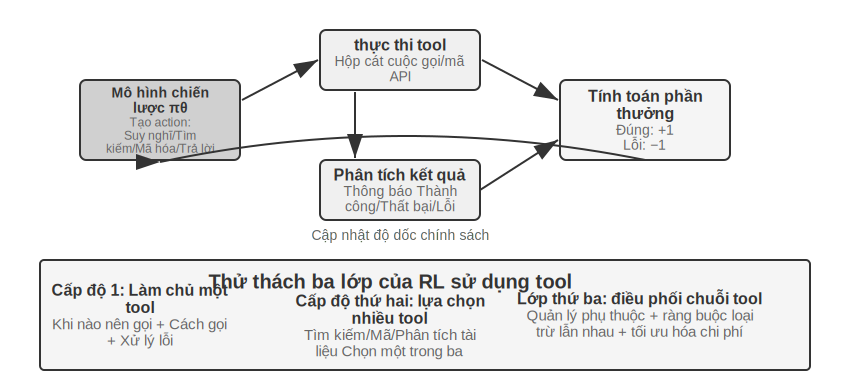

Việc sử dụng các công cụ mở rộng ranh giới khả năng của Agent từ "lý luận riêng của mô hình" đến "gọi cộng tác hệ thống bên ngoài", đây là chìa khóa để biến Agent trở nên thực tế. Từ góc độ độ dốc độ khó, quá trình đào tạo RL được công cụ này sử dụng phải đối mặt với ba cấp độ thử thách. Cấp độ đầu tiên là học cách sử dụng một công cụ duy nhất - hiểu các thông số kỹ thuật đầu vào và đầu ra, nắm vững thời gian gọi và xử lý phản hồi lỗi. Cấp độ thứ hai là đưa ra các lựa chọn trong hệ sinh thái đa công cụ - đối mặt với hàng tá công cụ, khi nào cần tìm kiếm, khi nào thực thi mã và khi nào phân tích tài liệu. Lớp thứ ba là điều phối chuỗi công cụ - khám phá sự phụ thuộc giữa các công cụ, xác định các ràng buộc loại trừ lẫn nhau và tối ưu hóa hiệu quả chi phí.

Hiện tại có hai tuyến đang hoạt động xung quanh công cụ gọi Agent RL. Một là **nâng cao khả năng truy xuất**: được đại diện bởi Search-R1 (Jin và cộng sự, 2025), sử dụng mô hình đào tạo RL để quyết định độc lập thời điểm bắt đầu tìm kiếm trong quá trình suy nghĩ và sử dụng kết quả trả về để tiếp tục suy luận, thay vì áp dụng quy trình RAG cố định. Cái còn lại là **Kỹ thuật phần mềm**: Được đại diện bởi các môi trường đào tạo như SWE-Gym, thực hiện nhiều vòng RL trên cơ sở mã thực để mã hóa Agent, cho phép mô hình chỉnh sửa, chạy và sửa mã lặp đi lặp lại. Những thách thức chung của cả hai lộ trình là phân bổ tín dụng dài hạn (thành công cuối cùng là nhờ quyết định được đưa ra hàng chục bước trước) và kỹ thuật môi trường (xây dựng môi trường đào tạo song song rộng rãi, ổn định và có thể tái tạo).

Có một chi tiết kỹ thuật khác không thể tránh khỏi với công cụ RL: **Chống mất mát đối với mã thông báo phản hồi môi trường**. Dấu vết lệnh gọi công cụ chứa cả mã thông báo do chính mô hình tạo ra (suy nghĩ, tham số lệnh gọi công cụ) và mã thông báo do môi trường trả về (đầu ra của trình thông dịch mã, kết quả tìm kiếm, phản hồi dịch vụ khách hàng). Cái sau không phải do chính sách tạo ra mà do môi trường đưa ra - nếu chúng cũng được bao gồm trong gradient chính sách, mô hình sẽ được đào tạo để "dự đoán hộp cát sẽ xuất ra gì", điều này không chỉ đi chệch khỏi mục tiêu tối ưu hóa mà còn làm cho quá trình đào tạo không ổn định. Cách tiếp cận tiêu chuẩn là chặn mã thông báo phản hồi môi trường khi tính toán tổn thất và chỉ trả về độ dốc cho mã thông báo do chính mô hình tạo ra. Đây là một trong những điểm kỹ thuật cốt lõi của ReTool (che chắn độ dốc của mã thông báo phản hồi trong thẻ `<interpreter>`) và đó cũng là điều Search-R1 đã nói "che chắn mã thông báo được truy xuất để ổn định quá trình đào tạo". Các khung đào tạo chính thống như verRL và AWorld đã tích hợp sẵn cơ chế này.

> **Thử nghiệm 7-15 ★★★: ReTool - Giải bài toán nâng cao bằng trình thông dịch mã**
>
>
> 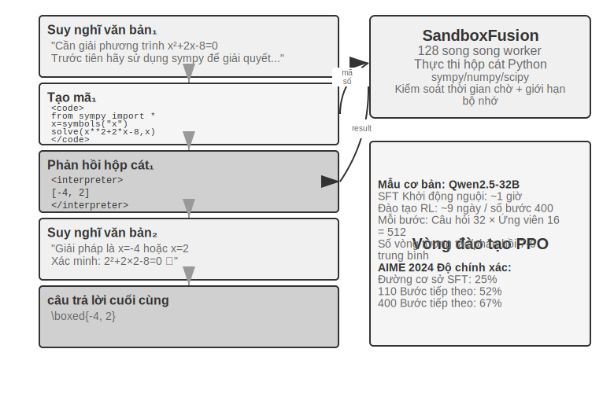
>
>
> Tư duy văn bản thuần túy dễ mắc phải các lỗi tích lũy trong các phép tính số chính xác, các phép toán ký hiệu hoặc giải phương trình phức tạp (ví dụ: nếu bạn thực hiện mười bước nhân liên tiếp thì mỗi bước có thể được tính không chính xác), trong khi trình thông dịch mã đạt được xác minh chính xác bằng cách cung cấp giao diện thực thi. ReTool tích hợp khả năng thực thi theo thời gian thực của trình thông dịch mã vào vòng suy nghĩ RL, cho phép mô hình tự động tìm hiểu thời điểm và cách sử dụng công cụ, được hướng dẫn bởi phản hồi từ kết quả.
>
> Đào tạo được chia thành hai giai đoạn. Quá trình khởi động SFT (khoảng 1 giờ) chuyển đổi dữ liệu suy luận văn bản thuần túy thành trajectory nâng cao mã và thiết lập các mẫu gọi công cụ cơ bản. Đào tạo RL (dựa trên PPO được sửa đổi bởi veRL, dữ liệu đào tạo được lấy từ DAPO-Math-17k, khoảng 9 ngày và 400 bước) thông qua chiến lược tối ưu hóa triển khai thực thi mã thời gian thực xen kẽ: mô hình tạo mã chứa nhãn `<code>` và kết quả được đóng gói sau khi thực thi hộp cát Phản hồi trong thẻ `<interpreter>`, mô hình tiếp tục tạo, tạo thành một chuỗi lý luận hỗn hợp gồm "văn bản 1 + mã 1 + phản hồi 1 + ... + câu trả lời". Mỗi bước đào tạo cần tạo ra 512 câu trả lời (32 câu hỏi × 16 ứng viên), với trung bình số vòng tương tác 7-9 cho mỗi câu trả lời và tổng khối lượng xử lý mã thông báo tăng từ 25 triệu ban đầu lên 40 triệu.
>
> Bản thân ReTool sử dụng PPO tiêu chuẩn và không thay đổi thuật toán tối ưu hóa. Tuy nhiên, dữ liệu huấn luyện của nó đến từ DAPO-Math-17k của nhóm DAPO. Ở đây chúng tôi giới thiệu thuật toán **DAPO** phổ biến gần đây (Yu và cộng sự, 2025) - thuật toán này nằm trong PPO tiêu chuẩn. Bốn cải tiến đã được thực hiện dựa trên điều này. Mục tiêu cốt lõi là ngăn mô hình hội tụ sớm thành một chiến lược duy nhất (chỉ giải quyết vấn đề theo một cách):
>
> - **Clip-Higher (giới hạn trên khám phá thoải mái)**: Thuật toán PPO tiêu chuẩn sẽ hạn chế mức độ thay đổi chính sách trong mỗi lần đào tạo - thay đổi quá nhiều có thể dễ dẫn đến việc đào tạo không ổn định. Nhưng những hạn chế quá khắt khe sẽ khiến người mẫu “không dám thử những cách mới”. Clip-Higher nới lỏng hạn chế này một cách vừa phải: khi mô hình bắt gặp một con đường tốt hơn đáng kể, nó được phép điều chỉnh mạnh mẽ hơn về con đường đó, do đó khuyến khích sự khám phá.
> - **Mất độ dốc chính sách của Token-Level (làm cho trọng số của mỗi mã thông báo bằng nhau)**: GRPO ban đầu thực hiện chuẩn hóa mức mất mát ở cấp độ mẫu - trước tiên lấy trung bình số lượng mã thông báo trong mỗi câu trả lời, sau đó lấy trung bình giữa các mẫu - điều này sẽ khiến mỗi mã thông báo trong câu trả lời dài bị pha loãng bởi `1/|o_i|`: tư duy chuỗi dài chất lượng cao sẽ không được khen thưởng đủ và việc lặp lại kéo dài sẽ không bị trừng phạt đủ. Token-Level Mất độ dốc chính sách của DAPO loại bỏ lớp lấy trung bình mẫu này và thay vào đó chuẩn hóa thống nhất tất cả các mã thông báo trong toàn bộ lô để mỗi mã thông báo có trọng số bằng nhau; hậu quả trực tiếp là câu trả lời dài nhận được sự đóng góp độ dốc tương xứng theo độ dài của nó.
> - **Dynamic Sampling (phân bổ sức mạnh tính toán thông minh)**: Tự động điều chỉnh số lần lấy mẫu cho mỗi câu hỏi trong quá trình đào tạo - giảm lấy mẫu cho những câu hỏi đơn giản mà mô hình có thể giải quyết ổn định (không có lợi ích gì khi tiếp tục thực hành), tăng lấy mẫu cho các câu hỏi trong "khoảng thời gian có thể học được" với tỷ lệ thành công từ 20% đến 80% (đây là những khoảng thời gian mà mọi thứ có thể học được nhiều nhất) và tập trung sức mạnh tính toán vào dữ liệu có giá trị học tập cao nhất.
> - **Định hình phần thưởng quá dài**: Áp dụng hình phạt nhẹ đối với các phản hồi quá dài. Khi mô hình tạo ra quá trình suy nghĩ lâu dài nhưng không trả lời được các câu hỏi tốt hơn, hệ thống sẽ giảm điểm thưởng để hướng dẫn mô hình học cách suy nghĩ ngắn gọn và hiệu quả hơn.
>
> Quay lại ReTool. Trên AIME 2024, độ chính xác của quá trình đào tạo dựa trên Qwen2.5-32B-Instruct đã tăng từ khoảng 25% ban đầu lên 52% (85% đối với Best-of-30) ở điểm kiểm tra trung gian của bước 110; kết quả cuối cùng của bài viết là 67,0% sau 400 bước, trong khi đào tạo cơ bản RL văn bản thuần túy 1080 bước chỉ là 40,0%. Các số động huấn luyện trong khung thử nghiệm này đều dựa trên cài đặt mô hình 32B này.
>
> Các khả năng nổi bật: tự sửa mã (xác định lỗi thực thi và tự động tạo các phiên bản đã sửa), lệnh gọi công cụ chuyển từ xác minh muộn sang khám phá sớm và hiệu quả tư duy được cải thiện (độ dài giảm 40%, nhưng độ chính xác không giảm mà tăng lên).
>
> Động lực đào tạo của 110 bước đầu tiên thể hiện mô hình ba giai đoạn: ở giai đoạn đầu (bước 0-20), học nhanh cách sử dụng công cụ cơ bản, độ chính xác tăng 0,5% ở mỗi bước; ở giai đoạn giữa (bước 20-70), khám phá dao động, thời lượng phản hồi tăng từ 2500 lên mức cao nhất là 4700 mã thông báo và tính đa dạng của chiến lược tăng lên; ở giai đoạn sau (bước 70-110) Bước) Hội tụ ổn định, độ dài giảm xuống còn 4400 mã thông báo, hiệu suất tiếp tục được cải thiện nhưng biến động giảm.
>
> Sự khác biệt về thời gian giữa SFT và RL bắt nguồn từ sự khác biệt về mật độ thông tin: SFT có tín hiệu giám sát cho từng mã thông báo, trong khi RL chỉ nhận được tín hiệu thành công hoặc thất bại cho mỗi tập. Trong quá trình đào tạo thực tế, thời gian dành cho một bước sẽ tăng lên khi độ dài của phản hồi tăng lên và một số phản hồi cực kỳ dài sẽ kéo dài đáng kể toàn bộ chu trình đào tạo.
>
> **Thử nghiệm 7-16 ★★★: AWorld-train – Học cách sử dụng các công cụ trong hộp cát**
>
>
> 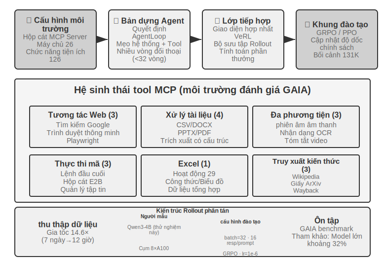
>
>
> GAIA là một trong những tiêu chuẩn Agent thử thách nhất. Ngay cả khi một mô hình tham số lớn được huấn luyện trên quy mô lớn thì nó cũng chỉ có thể đạt khoảng 32%, đây vẫn là một khoảng cách đáng kể so với hệ thống tính điểm cao. Thử nghiệm này sử dụng mô hình nhỏ hơn (Qwen3-4B) và mục tiêu chính là thể hiện quy trình đào tạo "vừa học vừa làm" hoàn chỉnh.
>
> Môi trường đào tạo AWorld là sandbox máy chủ MCP, cung cấp 26 máy chủ và 126 chức năng công cụ, bao gồm tương tác Web (tìm kiếm Google, trình duyệt thông minh, Playwright), xử lý tài liệu (CSV/DOCX/PPTX/PDF), xử lý đa phương tiện (phiên âm âm thanh, OCR, tóm tắt video), thực thi mã (lệnh đầu cuối, hộp cát E2B), xử lý Excel (29 thao tác cấp doanh nghiệp), truy xuất kiến thức (Wikipedia, ArXiv, Máy quay lui). Giới hạn tốc độ, biến động dịch vụ và lệnh cấm tài khoản của API thực khiến việc đào tạo trực tiếp trong môi trường sản xuất không khả thi—xây dựng môi trường mô phỏng ổn định, có thể kiểm soát và có thể chơi lại là điều kiện tiên quyết về mặt kỹ thuật cho đào tạo RL đa công cụ.
>
> Sự thay đổi về chất từ một công cụ sang nhiều công cụ là một công cụ duy nhất chỉ cần quyết định gọi "khi nào" và "như thế nào"; nhiều công cụ cũng cần giải quyết "gọi cái nào" và "cách kết hợp", điều này dẫn đến sự phức tạp của sự bùng nổ tổ hợp và quản lý phụ thuộc - có sự phụ thuộc trước giữa các công cụ (tìm kiếm trước khi duyệt các trang cụ thể), các ràng buộc loại trừ lẫn nhau (một số công cụ không thể được gọi cùng lúc) và chênh lệch chi phí (API khác nhau có hạn ngạch và độ trễ khác nhau). Policy này đòi hỏi phải lập kế hoạch tổng thể trong những ràng buộc này, thay vì tham lam lựa chọn mức tối ưu hiện tại.
>
> Cần lưu ý rằng thử nghiệm này là **thử nghiệm đào tạo mở và không cung cấp kết quả cơ bản** - Qwen3-4B có quy mô lớn như vậy và rất khó đạt được điểm vượt trội trên GAIA. Giá trị của thử nghiệm này nằm ở việc chạy qua liên kết hoàn chỉnh “học từ thực tiễn” hơn là làm mới chỉ báo. Tiêu chí chấp nhận và quan sát dự kiến có thể được tham chiếu là: các vòng lặp đặt lại và tập có thể chạy ổn định trong môi trường (các lệnh gọi công cụ, phản hồi và cập nhật trạng thái không gặp sự cố); đường cong phần thưởng trung bình cho thấy xu hướng đi lên trong quá trình đào tạo; tỷ lệ thành công của lệnh gọi công cụ tăng lên khi đào tạo và mô hình dần dần học cách đưa ra các lựa chọn và kết hợp hợp lý hơn giữa nhiều công cụ.

## Thăm dò biên giới để nâng cao hiệu quả lấy mẫu

Các thử nghiệm nói trên đã chứng minh một cách có hệ thống giá trị cốt lõi của RL trong quá trình đào tạo Agent, nhưng tất cả đều phát sinh chi phí mẫu cao. Thời gian đào tạo của RL của ReTool gấp hơn 200 lần so với SFT (9 ngày so với 1 giờ), điều này có thể không được chấp nhận trong các trường hợp tài nguyên bị hạn chế hoặc cần lặp lại nhanh.

Có nhiều lý do khiến hiệu suất mẫu của RL thấp (phương sai cao, phần thưởng thưa thớt, khó sử dụng lại dữ liệu trên trajectory, v.v.). Một trong những lý do quan trọng nằm ở tính năng model-free (không có mô hình) của phương pháp gradient chính sách chính thống - nó không mô hình hóa động lực môi trường (mô hình thế giới, "thế giới sẽ trông như thế nào sau khi thực hiện hành động") và rất khó để sử dụng trực tiếp thông tin phong phú trong một phản hồi duy nhất (hai điểm này có liên quan nhưng không tương đương). Phản hồi phong phú được trả về bởi mỗi lần tương tác với môi trường (lý do lỗi, thiếu trường, mẹo xử lý chính xác) hầu hết bị lãng phí - vấn đề này đã được phân tích chi tiết trong bài viết trước "The Dilemma of Sparse Rewards". Hãy xem xét một tình huống trong đó bạn gọi đến bộ phận dịch vụ khách hàng: bộ phận dịch vụ khách hàng thông báo rõ ràng cho bạn rằng "bốn chữ số cuối của thẻ tín dụng là cần thiết để xác minh danh tính của bạn". Tuy nhiên, model-free RL chỉ có thể học từ tín hiệu thành công hoặc thất bại cuối cùng (phần thưởng là 0 hoặc 1) và không thể trực tiếp sử dụng phản hồi rõ ràng này. Nó chỉ có thể cung cấp thông tin thẻ tín dụng một cách tình cờ thông qua hàng trăm cuộc khám phá ngẫu nhiên. Con người sẽ ghi nhớ ngay sau khi nghe phản hồi và chủ động chuẩn bị cho lần tiếp theo.

Xung quanh nút thắt này, chương này thực tế đã đưa ra hai ý tưởng bổ sung cho nhau. Một là biến thông tin lãng phí trong phản hồi môi trường thành phần thưởng có thể học được - viết các tín hiệu rõ ràng, có thể xác định được bằng máy, chẳng hạn như "dịch vụ khách hàng yêu cầu xác minh danh tính trước", "lệnh này có tính chất phá hoại" và "chứng minh một bước khác" trực tiếp vào chức năng khen thưởng. Đây là RLVP được đề cập trong Phần 7.10 (đặc biệt là việc sử dụng phần thưởng một phần "tiến trình đạt phần thưởng", có thể cứu các mẫu bị lãng phí trong nhóm bị đánh bại hoàn toàn). Phương pháp còn lại là phương pháp được phát triển chính thức trong phần này - **Làm cho tín hiệu huấn luyện dày đặc hơn ở mỗi bước**: Thay vì chỉ nhận được vô hướng thành công hay thất bại khi kết thúc nhiệm vụ, tốt hơn là bạn nên nhận được hướng dẫn ở mọi vị trí của trajectory. Đây là quá trình chưng cất On-Policy.

### Chưng cất On-Policy: Tận dụng tối đa cả hai thế giới SFT và RL

Chưng cất On-Policy (chưng cất trên trajectory) đã được Phòng thí nghiệm Máy Tư duy đề xuất và quảng bá một cách có hệ thống vào năm 2025 [^ch7-10]. Bây giờ nó là một phương pháp rất phổ biến trong post-training và xứng đáng được giải thích riêng. Để hiểu những gì nó giải quyết được, trước tiên hãy xem xét một thiếu sót nghiêm trọng của mỗi SFT và RL - nó tình cờ kết hợp các ưu điểm của cả hai.

**Nhược điểm của SFT: Learner-Sampler không khớp (người học và người lấy mẫu không khớp nhau).** Dữ liệu đào tạo của SFT được tạo bởi "bộ lấy mẫu" (mô hình giáo viên hoặc chuyên gia con người) và "người học" (mô hình được đào tạo) chỉ bắt chước một cách thụ động những **đường dẫn chính xác** này. Vấn đề là: người học chắc chắn sẽ mắc sai lầm khi xử lý dữ liệu huấn luyện và sẽ đạt đến **trạng thái sai lệch** chưa từng xuất hiện trong dữ liệu huấn luyện và chưa bao giờ thấy cách quay lại đúng hướng từ những trạng thái này, nên những lỗi nhỏ sẽ tích tụ thành lỗi lớn - giống như một học sinh chỉ ghi nhớ đáp án chuẩn, một khi tính sai một bước ở giữa thì không biết làm cách nào để lấy lại. Nguyên nhân sâu xa là “ai đi bộ” (giáo viên) trong quá trình đào tạo và “ai đi bộ” (bản thân học sinh) trong quá trình triển khai không giống nhau.

**Nhược điểm của RL: Tín hiệu quá thưa.** RL cho phép học sinh tự đi bộ (trên đường), giải quyết vấn đề phân phối không khớp, nhưng chỉ nhận được một vô hướng thành công hay thất bại ở cuối mỗi đường. Làm thế nào để thay đổi từng bước ở giữa phải được suy luận từ từ qua hàng trăm lần thử và sai.

**Chưng cất On-Policy kết hợp ưu điểm của cả hai: cho phép học sinh tạo trajectory của riêng mình (On-Policy, giải quyết vấn đề phân phối không khớp), đồng thời cho phép mô hình giáo viên mạnh hơn chấm điểm từng bước học sinh thực hiện từng mã thông báo (Tín hiệu dày đặc, giải quyết tình trạng thưa thớt tín hiệu).** So sánh ba phương pháp trong một câu: SFT là "tín hiệu ngoài trajectory + dày đặc" (có phân phối không khớp), RL là "trên trajectory + tín hiệu thưa thớt" (phản hồi thưa thớt), On-Policy Chưng cất là " **trên trajectory + tín hiệu dày đặc**" - cả hai khuyết điểm đều được bù đắp.

Cách tính điểm cụ thể như thế nào? Giáo viên không chỉ đánh giá xem bước đi của học sinh có đúng hay không mà còn trực tiếp đưa ra cách phân phối đầy đủ "ở vị trí hiện tại, xác suất của các lựa chọn khác nhau cho mã thông báo tiếp theo là bao nhiêu". Ví dụ: khi học sinh viết "Truy vấn đầu tiên API, sau đó phân tích giá trị trả về...", giáo viên cho rằng "truy vấn" phải chiếm 80%, "gọi" 15% và 5% còn lại; Mục tiêu học tập của học sinh là làm cho phân bố dự đoán của mình ở mỗi vị trí càng gần với phân bố của giáo viên càng tốt. Về mặt kỹ thuật, điều này đạt được bằng cách giảm thiểu **KL phân kỳ** giữa hai phân bố (Phân kỳ KL đo lường sự khác biệt giữa hai phân bố xác suất, chúng càng gần thì chúng càng nhỏ và bằng 0, như được trình bày chi tiết trong Phần 7.7). So với các tín hiệu nhị phân chỉ có thành công hoặc thất bại cuối cùng, việc căn chỉnh phân phối từng mã thông báo này dày đặc hơn một bậc độ lớn.

Hiệu quả rất vượt trội: đối với các nhiệm vụ như toán học, số bước luyện tập cần thiết để đạt được hiệu suất tương tự chỉ khoảng **1/10** của RL thuần túy. Ưu điểm của các nhiệm vụ tư duy chuỗi dài là đặc biệt rõ ràng - giáo viên hướng dẫn từng bước và học sinh nhanh chóng học cách sửa lỗi thay vì ngày càng đi sâu vào con đường sai lầm. Nó cũng làm giảm tình trạng quá khớp: đào tạo lặp đi lặp lại với cùng một lời nhắc trong RL tiêu chuẩn giúp bạn dễ dàng ghi nhớ câu trả lời cuối cùng, nhưng ở đây mỗi trajectory là khác nhau và giáo viên sẽ đưa ra phản hồi về các trajectory cụ thể. Những gì học được là một chiến lược chung chứ không phải là một câu trả lời cụ thể, do đó tỷ lệ tái sử dụng dữ liệu được cải thiện rất nhiều.

Phương pháp này đặc biệt có giá trị trong **kịch bản Agent nhiều vòng**: tín hiệu thành công hay thất bại của nhiệm vụ nhiều vòng xuất hiện ở cuối, vừa thưa vừa có độ trễ. Việc phân phối giáo viên theo từng mã thông báo chỉ bù đắp cho phần hướng dẫn còn thiếu ở mỗi bước ở giữa. Nhưng nó có một tiền đề phản ánh chủ đề chính được nhấn mạnh nhiều lần trong chương này: **Phải có môi trường mô phỏng đủ thực tế để học sinh tự do khám phá** - nếu không, khi học sinh đạt đến trạng thái sai lệch mà giáo viên chưa thấy, điểm của giáo viên cũng sẽ không đáng tin cậy như nhau. Giá trị của On-Policy dựa trên "sinh viên thực sự khám phá phân phối triển khai".

Quy tắc "tín hiệu dày đặc tốt hơn tín hiệu thưa thớt" đã được xác minh khá rõ ràng trong kịch bản Agent thuần túy. Khi nói về thanh trạng thái ở Chương 2, tôi đã đề cập đến “cảm giác về thời gian” của Agent—sự cấp bách, kiên trì và tỉnh táo—có thể được cài đặt cùng với hướng dẫn vận hành trong quá trình suy luận; tuy nhiên, vấn đề post-training là tách mô hình nhỏ 8B khỏi các từ gợi ý và viết trực tiếp cảm giác nhịp điệu này vào trọng số. Tác giả và các cộng tác viên của tôi đã thử DPO và bốn công thức học tăng cường theo trình tự. Mỗi chiếc trong số bốn chiếc RL đều tình cờ gặp phải một trong các chế độ thất bại được thảo luận trước đó trong chương này: phần thưởng cho việc kiểm soát cứng quá thưa thớt và hầu hết các đợt triển khai đều ghi được 0 điểm và lợi thế trong nhóm trở về 0 (độ thưa thớt); sau khi chuyển sang phần thưởng được phân loại, tín hiệu trở nên dày đặc hơn, nhưng chỉ báo proxy không tương ứng với tỷ lệ vượt qua thực tế (sai lệch mục tiêu); chỉ vòng phản hồi đầu tiên được tính điểm, buộc các câu trả lời ngắn chiếu lệ trở nên tệ hơn trong nhiều vòng đánh giá (hình dạng triển khai không khớp); cuối cùng, hình thức triển khai đã phù hợp với đánh giá và phần thưởng đào tạo đã bắt đầu tăng lên, nhưng chiến lược đã sụp đổ thành một chế độ duy nhất trong vòng vài bước, với KL mạnh hơn gấp 4 lần. Không thể kéo được mỏ neo (thu gọn quá trình đào tạo). Không có công thức nào vượt qua trần SFT. Chuyển sang Chưng cất On-Policy - sử dụng giáo viên Qwen3-32B đông lạnh để cung cấp mã thông báo phân phối mục tiêu theo mã thông báo trên trajectory nhiều vòng do chính học sinh thực hiện - quá trình đào tạo diễn ra suôn sẻ và tỷ lệ đậu theo bốn điều kiện cao hơn đồng đều từ 23 đến 47 điểm phần trăm so với đường cơ sở SFT tương đồng [^ch7-11]. Bốn tín hiệu thưa thớt lần lượt thất bại và một tín hiệu dày đặc thành công, điều này củng cố dòng chính của phần này: vấn đề sau khi đào tạo thường không phải là chức năng khen thưởng không được thiết kế đủ khéo léo mà là bản thân tín hiệu đó không đủ dày đặc.

## Bức tranh hoàn chỉnh và những điểm thực tế post-training

Chương này bắt đầu từ "dự đoán từ tiếp theo" được đào tạo trước và đi một chặng đường dài: SFT định dạng vững chắc, RL vượt qua khái quát hóa, nhiệm vụ nhiều vòng giới thiệu các vấn đề phân bổ tín dụng, thiết kế phần thưởng mở rộng từ phần thưởng kết quả đến tín hiệu đường dẫn của "kết quả khen thưởng, quy trình ràng buộc" và việc sử dụng công cụ mang lại sự bùng nổ tổ hợp. Những thử nghiệm này có một điểm chung - những gì mô hình học được phụ thuộc vào những gì tín hiệu huấn luyện dạy nó; và chất lượng tín hiệu chủ yếu được xác định bởi dữ liệu và môi trường chứ không phải bởi thuật toán.

**Mô hình hợp tác**: Bài viết trước (Tóm tắt thử nghiệm điểm chung) đã tóm tắt mô hình này bằng cách sử dụng khái niệm hội họa Trung Quốc là "hình thức trước rồi đến tinh thần" - SFT kết thúc bằng "định dạng ổn định và khả năng bắt đầu hình thành" và RL định hình chiến lược trên cơ sở này. Cả hai hoạt động ở các cấp độ khác nhau: giao thức và cấu trúc hóa rắn SFT (định dạng JSON, mẫu hội thoại, giao diện công cụ), chiến lược tối ưu hóa và khái quát hóa RL (quy tắc số học, tư duy không gian, chuỗi hành động). Cân bằng quan trọng: SFT Đào tạo quá mức có thể khiến mô hình bị thu gọn về phân phối đào tạo, hạn chế không gian tối ưu hóa RL.

**Những cạm bẫy phổ biến** sau đây đáng để bạn cảnh giác. Việc xác định những vấn đề này thường có thể tránh lãng phí tài nguyên tốt hơn là nắm vững các chi tiết kỹ thuật:

1. **Phụ thuộc quá nhiều vào post-training để ghi nhớ dữ kiện** - RAG nên được sử dụng để quản lý kiến thức thực tế (có thể cập nhật động, truy xuất nguồn gốc và không bị quên do đào tạo) và post-training tập trung vào "cách sử dụng kiến thức".
2. **Giới thiệu RL trước khi định dạng ổn định** - Khi mô hình không thể xuất ổn định ngay cả JSON cơ bản (tỷ lệ phân tích lỗi vượt quá 20%), quá trình đào tạo RL sẽ thất bại hoàn toàn. SFT phải được thực hiện trước.
3. **Thiết kế chức năng phần thưởng không đúng** dẫn đến hack phần thưởng - mô hình học cách khai thác sơ hở trong phần thưởng để đạt điểm cao, thay vì thực sự hoàn thành nhiệm vụ (chẳng hạn như tạo văn bản dài và vô nghĩa chỉ nhìn vào độ dài của câu trả lời). Mục tiêu cuối cùng nên được đánh giá thay vì các số liệu trung gian.
4. **Bỏ qua độ trung thực của mô phỏng** - Nếu mô phỏng quá đơn giản (dịch vụ khách hàng luôn phản hồi theo một mẫu cố định) hoặc phản hồi của môi trường không thực tế (thông báo lỗi không phù hợp với môi trường sản xuất), chiến lược được đào tạo sẽ hoàn toàn không hiệu quả trong các tình huống thực tế. Chi phí xây dựng môi trường mô phỏng có độ chính xác cao có thể cao hơn chi phí đào tạo.
5. **Đào tạo quá mức dẫn đến giảm khả năng tổng quát hóa** - Khi tổn thất huấn luyện tiếp tục giảm nhưng hiệu suất của tập xác thực kém đi, mô hình đang ghi nhớ các chi tiết huấn luyện. SFT đặc biệt dễ gặp phải vấn đề này và việc dừng sớm vẫn rất quan trọng; việc tối ưu hóa quá mức RL cũng sẽ khiến chính sách phù hợp quá mức với việc phân phối nhiệm vụ hiện tại.
6. **Sụp đổ hàm giá trị và thăm dò không đầy đủ**——Ước tính giá trị không chính xác trong PPO sẽ dẫn đến sai lệch trong tính toán lợi thế, biểu hiện dưới dạng dao động nghiêm trọng trong đường cong huấn luyện. Các tham số nhiệt độ quá thấp hoặc độ ngẫu nhiên không đủ sẽ khiến Agent rơi vào mức tối ưu cục bộ.
7. **Đánh giá thấp chi phí tính toán của RL** - Một tác vụ hoạt động tốt trên SFT có thể yêu cầu 10-100 gấp thời gian đào tạo để chuyển sang RL. Nếu phân phối thử nghiệm có tính nhất quán cao với quá trình đào tạo thì SFT có thể là đủ.
8. **Chất lượng dữ liệu huấn luyện thấp** - SFT sẽ trực tiếp tìm hiểu độ nhiễu và độ lệch trong dữ liệu và củng cố các lỗi thành các tham số; mặc dù RL có thể tìm ra các chiến lược tốt hơn thông qua việc khám phá, nhưng nếu mô hình phần thưởng có sai lệch hệ thống, nó sẽ tối ưu hóa sai hướng.

Nguyên tắc cốt lõi: **Sử dụng thử nghiệm quy mô nhỏ để xác minh các giả định chính trước khi đầu tư tài nguyên quy mô lớn** - kiểm tra với một lượng nhỏ dữ liệu xem SFT có thể ổn định định dạng hay không, đơn giản hóa môi trường để xác minh xem RL có thể hội tụ hay không và sử dụng một mẫu nhỏ để kiểm tra xem hàm phần thưởng có phản ánh mục tiêu thực sự hay không. Thất bại nhanh chóng còn dễ chấp nhận hơn thất bại ồ ạt.

**Hợp tác với RAG/ICL**: Post-training đào tạo, External Learning (học bên ngoài tham số mô hình) và In-Context Learning (học trong ngữ cảnh) tạo thành ba khía cạnh về khả năng của Agent. Chúng không phải là những lựa chọn thay thế loại trừ lẫn nhau mà là ba "nút" có thể điều chỉnh lần lượt tác động lên các tham số mô hình, kiến thức bên ngoài và thông tin có điều kiện trong quá trình suy luận. Giá trị của ICL nằm ở khả năng kiểm soát tức thời "không thay đổi tham số" - hành vi có thể được định hình nhanh chóng với một vài ví dụ hoặc quy tắc rõ ràng. Đây là lựa chọn đầu tiên trong giai đoạn thăm dò, nhưng khi số lượng mẫu tăng lên thì độ trễ và chi phí sẽ tăng nhanh. Giá trị của RAG nằm ở chỗ "xuất hiện sự kiện và bằng chứng" - cung cấp kiến thức bên ngoài có thể cập nhật linh hoạt và các nguồn có thể truy nguyên mà không thay đổi thông số, loại bỏ ảo tưởng một cách tự nhiên và đáp ứng các yêu cầu tuân thủ kiểm toán. Giá trị của việc post-training nằm ở chỗ "viết hành vi và phong cách thành các tham số" - ổn định giọng điệu, định dạng và thói quen sử dụng công cụ, đồng thời cải thiện đáng kể tính nhất quán. Lưu ý đặc biệt: SFT/RL khó có thể ghi nhớ chính xác một lượng lớn kiến thức thực tế. Nếu mô hình thực sự cần nắm vững các sự kiện miền thì phải sử dụng đào tạo trước liên tục (chi phí cao hơn nhiều so với SFT và tỷ lệ dữ liệu cần được thiết kế cẩn thận), do đó bộ nhớ sự kiện phù hợp hơn với RAG.

Cách tiếp cận phổ biến và mạnh mẽ nhất là sử dụng RAG để giải quyết vấn đề về trí nhớ chính xác và khả năng diễn giải của "kiến thức thực tế", đồng thời chuyển "hành vi và cấu trúc" cho post-training để củng cố; sử dụng ICL và một mô hình có khả năng hơn để nhanh chóng lặp lại chiến lược thử nghiệm, sau đó nội hóa hành vi có hiệu ứng ổn định vào các tham số thông qua post-training. Quá trình post-training cũng có thể đạt được sự chắt lọc mô hình - chắt lọc khả năng của một mô hình lớn có công suất cao thành một mô hình nhỏ hơn, chi phí thấp hơn.

## Tóm tắt chương này

Bản chất của post-training mô hình là viết chiến lược tương tác thành các tham số.

SFT và RL không cạnh tranh mà tuần tự: SFT trước tiên ổn định định dạng đầu ra (nếu không, tín hiệu phần thưởng của RL hoàn toàn không thể tính được) và RL học cách khái quát hóa trên cơ sở này. "Bộ nhớ SFT, khái quát hóa RL" không phải là một khẩu hiệu, nó là một hiện tượng có thể đo lường được.
Có hai phán đoán xuyên suốt toàn bộ chương này và đáng được ghi nhớ hơn bất kỳ thuật toán nào. Đầu tiên, **dữ liệu và môi trường quan trọng hơn thuật toán**: Bạn có thể sử dụng thuật toán RL có sẵn. Điều thực sự mở rộng khoảng cách là độ trung thực của môi trường mô phỏng và chất lượng của dữ liệu huấn luyện - trong nhiều trường hợp, miễn là có chất lượng dữ liệu của SFT, bạn thậm chí không cần thực hiện RL. Thứ hai, **Nút thắt chính hiện tại của RL là hiệu quả mẫu**: On-Policy Chưng cất, khiến mỗi bước trở nên dày đặc hơn và hình phạt đường dẫn xác minh RLVP ("kết quả khen thưởng, đường dẫn phạt" ("kết quả khen thưởng, đường dẫn phạt" và sử dụng phần thưởng một phần có thể đạt được tiến bộ để giải cứu các mẫu của nhóm bị đánh bại hoàn toàn) biến phản hồi môi trường lãng phí thành tín hiệu có thể học được) hiện là hai hướng hứa hẹn nhất. Điểm chung của chúng vẫn là cùng một câu - biến thông tin đã tồn tại trong môi trường và dữ liệu nhưng bị lãng phí bởi phần thưởng kết quả thuần túy thành thứ mà mô hình có thể học được.

[^ch7-1]: Schulman, John and Thinking Machines Lab, “LoRA Without Regret” , 2025.
[^ch7-4]: Ouyang, Long et al., “Training Language Models to Follow Instructions with Human Feedback” , OpenAI, 2022.
[^ch7-5]: Gao, Leo, John Schulman, and Jacob Hilton, “Scaling Laws for Reward Model Overoptimization” , OpenAI, 2023.
[^ch7-6]: Rafailov, Rafael et al., “Direct Preference Optimization: Your Language Model is Secretly a Reward Model” , 2023.
[^ch7-7]: Lightman, Hunter et al., “Let's Verify Step by Step” , OpenAI, 2023.
[^ch7-8]: Silver, David and Richard S. Sutton, “Welcome to the Era of Experience” , 2025.
[^ch7-9]: Để biết thiết kế hình phạt theo đường dẫn, bốn nguyên tắc và dữ liệu thử nghiệm trong phần này, hãy xem Li, Bojie và Noah Shi, "RLVP: Phạt đường đi, khen thưởng kết quả", 2026. arXiv:2607.07435.
[^ch7-10]: Để biết các phương pháp và thí nghiệm của Chưng cất On-Policy, hãy xem Phòng thí nghiệm Máy Tư duy, "Chưng cất On-Policy", 2025.
[^ch7-11]: So sánh post-training của bộ cảm biến thời gian Agent này - DPO và bốn chế độ lỗi tương ứng RL và bước đột phá của quá trình chưng cất On-Policy - xem Li, Bojie và Noah Shi, "Agents That Sense Physical Time: Emergency, Sự kiên trì và cảnh giác là các biện pháp kiểm soát bị thiếu đối với LLM Agents”, 2026. https://01.me/research/physical-time-agent

Quá trình post-training giải quyết được vấn đề "làm thế nào để làm cho mô hình thông minh hơn", nhưng chu kỳ cập nhật trọng số của mô hình được tính bằng tuần. Trên thực tế, API hoạt động trực tuyến và ngoại tuyến, nhu cầu của người dùng luôn thay đổi và các quy tắc kinh doanh thay đổi diễn ra hàng ngày. Chương tiếp theo sẽ khám phá một lộ trình tiến hóa bổ sung—không cần sửa đổi trọng số mô hình nhưng cho phép Agent xây dựng độc lập thư viện công cụ và cơ sở kiến thức thông qua External Learning (học bên ngoài tham số mô hình) để đạt được khả năng mở rộng liên tục.

## Câu hỏi tư duy

1. ★★ Sự quên lãng nghiêm trọng - một tinh chỉnh dành riêng cho nhiệm vụ phá hủy các khả năng chung ban đầu của mô hình (chẳng hạn như các lệnh gọi công cụ chung) - đặc biệt rắc rối trong kịch bản Agent. So với việc tinh chỉnh đầy đủ thông số, LoRA đóng băng trọng số cơ bản và có nguy cơ quên thấp hơn, nhưng nó không tránh khỏi. Những chiến lược nào có thể làm giảm bớt tình trạng lãng quên các khả năng do tinh chỉnh gây ra?
2. ★★ Quá trình post-training củng cố các khả năng thành trọng lượng mô hình (“bộ nhớ cơ”), trong khi In-Context Learning (học trong ngữ cảnh) sẽ đưa kiến thức vào đầu vào tại thời điểm suy luận. Tuy nhiên, một số khả năng, chẳng hạn như kiến thức về miền, có thể được học thông qua post-training hoặc được cung cấp bởi ví dụ few-shot. Bạn sẽ sử dụng tiêu chí nào để quyết định con đường mà một năng lực nhất định nên đi?
3. ★★ Chưng cất mô hình cho phép các mô hình nhỏ tìm hiểu hành vi của các mô hình lớn. Theo mức độ khả năng, các mô hình chắt lọc có thể được chia đại khái thành ba cấp độ - **Mô hình trò chuyện**(một vòng đối thoại, trả lời trực tiếp), **Mô hình lý luận**(chuỗi suy nghĩ dài trước khi trả lời), **Mô hình tác nhân**(nhiều vòng công cụ gọi điện, tương tác với môi trường). Sự khác biệt về khó khăn khi chắt lọc ba loại mô hình này tương ứng là gì? (Mẹo: Bắt đầu với “chính xác những gì cần được chắt lọc”—cho dù đó là phong cách đầu ra, trajectory tư duy hoàn chỉnh hay chiến lược ra quyết định để tương tác với môi trường; những mã thông báo nào trong trajectory nên được học và những mã thông báo nào do môi trường trả về không nên được học; và các tín hiệu thành công hay thất bại xuất hiện muộn và thưa thớt như thế nào.)
4. ★★★ Trong các tương tác Agent nhiều vòng, vấn đề phân bổ phần thưởng (phân công tín dụng) nghiêm trọng hơn trong một vòng duy nhất - thành công hay thất bại cuối cùng rất khó quy cho quyết định của vòng 3 hoặc vòng 7. Bạn sẽ thiết kế chiến lược phân phối phần thưởng như thế nào?
5. ★★★ Post-training, External Learning (học bên ngoài tham số mô hình) và In-Context Learning (học trong ngữ cảnh) tạo thành ba khía cạnh của khả năng Agent. Nếu bạn có ngân sách cố định (giả sử là 10.000 đô la) và muốn cải thiện hiệu suất của một tổng đài viên, Agent, bạn sẽ phân bổ ngân sách như thế nào giữa ba chiều này? Quyết định của bạn phụ thuộc vào những yếu tố nào?
6. ★★★ Trong trường hợp không có chức năng khen thưởng rõ ràng và mẫu thưa thớt, việc học theo mô hình tự động được một số người coi là mục tiêu cuối cùng của quá trình post-training. Các phương pháp đào tạo RL hiện tại cách mục tiêu này bao xa? Bạn nghĩ bước đột phá tiếp theo có nhiều khả năng đến từ hướng nào?
7. ★★ Chương này chỉ ra rằng việc tinh chỉnh LoRA không hề tốn kém. Vì vậy, liệu có thể đào tạo LoRA dành riêng cho từng người dùng (hoặc từng công ty khách hàng) và ghi bộ nhớ người dùng hoặc kiến thức doanh nghiệp vào các tham số thay vì lưu trữ nó trong cơ sở kiến thức bên ngoài như Chương 3 không? Trong trường hợp nào thì "tham số ghi vào bộ nhớ" có nhiều ưu điểm hơn "ghi nhớ tham số và lưu trữ chúng trong cơ sở tri thức"? Trong trường hợp nào nó sẽ phản tác dụng?
8. ★★★ On-Policy Chưng cất dựa vào mô hình giáo viên mạnh mẽ hơn để giám sát học sinh. Nhưng nghiên cứu Tổng quát hóa Weak-to-Strong của OpenAI đã đưa ra một phát hiện phản trực giác: tín hiệu giám sát của một mô hình yếu đôi khi có thể kích thích các khả năng tiềm ẩn nhưng chưa được kích hoạt của chính mô hình mạnh. Nếu ý tưởng này được áp dụng vào đào tạo Agent, liệu có thể đạt được sự chắt lọc ngược của "mô hình nhỏ dạy mô hình lớn" không?
9. ★★ Mô hình khen thưởng quá trình (PRM) đánh giá từng bước tư duy, trong khi mô hình khen thưởng kết quả (ORM) chỉ xem xét kết quả cuối cùng. Nhưng cái nào đáng được khen thưởng hơn: “quy trình đúng sẽ dẫn đến kết quả sai” hay “quy trình sai sẽ ngẫu nhiên nhận được kết quả đúng”? Bạn cân nhắc điều này như thế nào trong kịch bản gọi công cụ nhiều bước của Agent?
10. ★★★ Các bộ dữ liệu đánh giá được thảo luận trong chương này (chẳng hạn như SWE-Bench đã được xác minh, τ²-bench, AndroidWorld) có thể được sử dụng cho cả đánh giá và post-training. Nhưng nếu tập đánh giá được sử dụng để huấn luyện thì nó không còn là tập đánh giá độc lập nữa - điều này có vi phạm nguyên tắc cơ bản là phải tách biệt tập huấn luyện và tập kiểm tra không? Việc tạo tham số động của τ²-bench và các mẫu được tham số hóa của AndroidWorld giảm bớt vấn đề này ở một mức độ nhất định, nhưng bản thân cấu trúc mẫu vẫn được sửa. Làm thế nào để tìm được sự cân bằng giữa việc khai thác triệt để giá trị đào tạo của dữ liệu đánh giá và duy trì tính độc lập trong đánh giá?
11. ★★★ Chương này đề xuất mô hình đào tạo "hình thức trước, sau đó là tinh thần": SFT cho đến khi "thể thức ổn định và khả năng bắt đầu hình thành", sau đó chuyển sang RL. Nhưng trên thực tế, làm thế nào để nhận định SFT đã “đủ” và nên chuyển đổi?
12. ★★★ Màn hình động huấn luyện của ReTool (xem thử nghiệm 7-15), một vài phản hồi siêu dài sẽ kéo dài đáng kể toàn bộ chu kỳ huấn luyện - hầu hết quá trình triển khai hàng loạt đã được tạo nhưng bạn phải đợi những phản hồi dài nhất kết thúc, trong thời gian đó mức sử dụng GPU của cụm rất thấp. Làm cách nào để cải thiện việc sử dụng tài nguyên của cụm đào tạo trong kịch bản phản hồi dài hạn này?
