# Tương tác đa phương thức và thời gian thực

Các chương trước khám phá thiết kế của Agent trong thế giới văn bản—tương tác với các hệ thống kỹ thuật số thông qua ngữ cảnh, công cụ và mã. Tuy nhiên, đối tượng tương tác của Agent không chỉ là văn bản và API. Khi Agent cần hiểu hướng dẫn bằng giọng nói của người dùng, tìm và nhấp vào nút chính xác trên màn hình hoặc điều khiển cánh tay robot để nắm bắt chính xác các đối tượng, nó sẽ chuyển sang một trường mới: **Tương tác thời gian thực đa phương thức** - từ đầu vào và đầu ra văn bản đơn giản đến **nhận thức đa phương thức và phản hồi theo thời gian thực**, đây là bước quan trọng để Agent thoát ra khỏi "hộp thoại". Cái gọi là "đa phương thức" có nghĩa là xử lý nhiều dạng thông tin cùng một lúc - văn bản, giọng nói, hình ảnh, video, hành động - không chỉ văn bản.

Đầu tiên hãy xác định ranh giới của chương này. Hiểu tài liệu và hình ảnh tĩnh - xem ảnh chụp màn hình, đọc biểu đồ, phân tích cú pháp PDF - đã được tích hợp một cách tự nhiên vào thực hành Agent trong các chương trước dưới dạng công cụ nhận thức: Đối với các mô hình lớn đa phương thức ngày nay, loại nhiệm vụ "một lần nhập, một lần hiểu" này tương đối hoàn thiện và không yêu cầu thiết kế kiến trúc đặc biệt. Chương này tập trung vào một loại vấn đề khác: ba tình huống trong đó **thời gian thực khiến các vấn đề đa phương thức trở nên khó khăn**—đối thoại bằng giọng nói, hoạt động GUI và điều khiển robot. Trong những tình huống này, đầu vào được luân chuyển liên tục và đầu ra phải được phân phối trong phạm vi ngân sách thời gian nghiêm ngặt, dẫn đến sự thay đổi về chất trong thiết kế kiến trúc. Đối với việc hiểu theo thời gian thực về các luồng hình ảnh liên tục (video), đây vẫn là một vấn đề mở đối với Agent tại thời điểm viết bài - những hạn chế của ảnh chụp màn hình theo từng khung hình được thảo luận trong phần Computer Use của chương này và các câu hỏi cuối chương sẽ quay lại chủ đề này. Một ranh giới khác cần được rút ra: **thế hệ** đa phương thức (tạo hình ảnh và video) chỉ là một lệnh gọi công cụ thông thường trong khuôn khổ cuốn sách này (Chương 5 Tạo đa phương tiện đã được đề cập). Agent có thể sử dụng nó như một công cụ bên ngoài. Nó không liên quan đến vấn đề tương tác thời gian thực sẽ được giải quyết trong chương này, vì vậy nó không nằm trong nội dung chính của chương này.

Tương tác bằng giọng nói, Computer Use và hoạt động của robot dường như trải rộng trên ba lĩnh vực hoàn toàn khác nhau, nhưng khi thực hiện, bạn sẽ thấy rằng các khu vực bị kẹt rất giống nhau: chúng đều xử lý nhiều thông tin phương thức cùng một lúc và chúng đều cực kỳ nhạy cảm với độ trễ. Việc tạm dừng lời nói hơn hai giây có thể khiến mọi người lo lắng và cảm giác bồn chồn ở mức một phần nghìn giây trong quá trình điều khiển robot có thể dẫn đến va chạm. Cùng với nhau, hai ràng buộc này đẩy ba kịch bản theo cùng một hướng kiến trúc: từ **dây chuyền lắp ráp nối tiếp**(giống như dây chuyền lắp ráp tại nhà máy, một liên kết được hoàn thành trước khi được bàn giao cho dây chuyền tiếp theo) đến **mô hình đầu cuối**(một mô hình thống nhất đi trực tiếp từ đầu vào đến đầu ra, loại bỏ sự cần thiết của các liên kết chuyển giao trung gian).

Chương này diễn ra trong ngữ cảnh sau:

1. Trước tiên, hãy sử dụng "ba mô hình kiến trúc giọng nói" để thiết lập hệ tọa độ - phân tầng (VAD-ASR-LLM-TTS Pipeline), full-modal (Omni, một mô hình nhưng vẫn thay phiên nhau nói), song công hoàn toàn (Moshi, GPT-Live, nghe và nói), và dọc theo trục “làm thế nào để loại bỏ giả định lần lượt của VAD” để tháo gỡ sự chậm trễ và đánh đổi của mỗi liên kết; phần phân tầng cũng sẽ nói về cách sử dụng nhận thức giọng nói truyền phát để thay thế VAD + ASR.
2. Hãy xem cách kiến trúc tư duy dung hòa mâu thuẫn giữa “phản ứng thời gian thực” và “suy nghĩ sâu”: từ sự song song đơn giản về tốc độ và tốc độ, đến lộ trình tách rời trong đó mô hình lý luận nền tảng đóng vai trò là “nhà chiến lược” (phái đoàn GPT-Live, Pine AI, v.v.), đến “tư duy và nói” của Step-Audio R1 “nội hóa” suy nghĩ thành một mô hình duy nhất.
3. Sau đó thảo luận về việc tối ưu hóa lớp thực thi để tổng hợp giọng nói giống con người hơn.
4. Cuối cùng, mở rộng góc nhìn sang Computer Use (cho phép AI vận hành màn hình máy tính giống như con người) và vận hành robot để xem các vấn đề về độ trễ và đa phương thức giống nhau biểu hiện như thế nào trong hai tình huống này.

Có hai điểm chính đặc biệt mang tính lý thuyết và có thể được chuyển qua các tình huống: **Kiến trúc tư duy**(cách tư duy nhanh và chậm phối hợp với nhau) và **Giao diện nhanh và chậm** bắt nguồn từ nó (Cầu tiềm ẩn, những gì khác có thể được truyền giữa các mô hình nhanh và chậm ngoài văn bản). Mặc dù bắt đầu từ cảnh lồng tiếng nhưng họ không chỉ phục vụ giọng nói - Computer Use sau đây và robot cũng sẽ gặp phải vấn đề “khi nào nên thuê chuyên gia tư vấn chậm”, điều này đáng được độc giả đặc biệt quan tâm.

## Giọng nói: giao diện người-máy tính tự nhiên nhất

Trước khi phá bỏ kiến trúc của giọng nói Agent, hãy lùi lại một bước và xem xét giá trị của chính giọng nói. Trong số các cách tương tác khác nhau giữa con người và máy tính, lời nói có băng thông cao nhất và tự nhiên nhất: tốc độ nói bình thường gấp khoảng bốn lần so với đánh máy và không cần sử dụng tay và thị lực. Chính vì điều này, giọng nói đang dần thay đổi từ phương thức nhập liệu phụ sang giao diện tương tác chính cho công việc hàng ngày của nhiều người - nói trực tiếp với Agent từ sáng đến tối thay vì gõ từng chữ trên bàn phím.

Ở cấp độ công cụ, có khoảng hai loại sản phẩm dọc theo tuyến đường này. Một loại là **phương thức nhập bằng giọng nói**(chẳng hạn như Typeless): chép chính tả thành văn bản trong thời gian thực và sau đó gửi nó đến bất kỳ ứng dụng nào, về cơ bản là một sự thay thế cho đầu vào bàn phím; loại còn lại là **voice Agent**(chẳng hạn như Pine, ChatGPT Voice): người dùng có thể giao tiếp và cộng tác trực tiếp với nó, và giọng nói vừa là đầu vào vừa là tương tác. Cách sử dụng nâng cao điển hình nhất của cả hai là **vibe coding** được đề cập trong phần giới thiệu - lập trình chỉ huy hoặc nghiên cứu Agent bằng miệng: nhà phát triển nêu ý định, thảo luận nhiều lần với Agent, sau đó cho phép nó thực hiện mã hóa và thử nghiệm; hơn mười bài viết của nhóm tác giả cuốn sách này đã được hoàn thành theo cách này.

Cần lưu ý rằng kiến trúc giọng nói được thảo luận tiếp theo trong chương này phục vụ hai hướng cùng một lúc: người dùng nói chuyện với Agent (như giao diện người-máy tính) và Agent thay mặt người dùng nói chuyện với thế giới bên ngoài (chẳng hạn như gọi điện thoại để đàm phán). Đằng sau cả hai đều là bộ công nghệ giọng nói thời gian thực giống nhau. Hãy bắt đầu với ba mô hình cấu trúc giọng nói.

## Ba mô hình cấu trúc lời nói

Để làm rõ sự phát triển công nghệ của giọng nói Agent, một hệ tọa độ rõ ràng là quy tắc ba điểm [^ch9-12] do OpenAI đưa ra khi GPT-Live được phát hành vào năm 2026 - nó hoàn toàn tương ứng với kiến trúc ba thế hệ mà chính giọng nói ChatGPT đã trải qua:

1. **Xếp tầng**: Lần lượt xâu chuỗi ba mô hình nhận dạng giọng nói (ASR), mô hình ngôn ngữ lớn (LLM) và tổng hợp giọng nói (TTS) vào một dây chuyền lắp ráp. Đây là trường hợp của ChatGPT Voice sớm nhất, lần đầu tiên cho phép mọi người "nói chuyện" với các mô hình tiên tiến, nhưng thông tin bị mất khi chuyển giữa các mô hình và phản hồi chậm và cứng.
2. **Chế độ đầy đủ từ đầu đến cuối (Omni)**: Sử dụng một mô hình duy nhất để trực tiếp "nghe âm thanh, muốn trả lời và nói ra", tích hợp ba phân đoạn thành một, giảm độ trễ và giữ lại thông tin phi văn bản như nhịp điệu và cảm xúc. Nhưng nó vẫn giả định "nói lần lượt" - mô hình phải đợi người dùng tạm dừng trước khi nói và việc chuyển đổi lần lượt được đánh giá bằng sự im lặng. Một khoảng dừng nhẹ hoặc tiếng ồn xung quanh có thể bị đánh giá sai là "đã kết thúc" và bị gián đoạn khi đáng ra không nên. Chế độ giọng nói nâng cao của ChatGPT thuộc thế hệ này; OpenAI gọi nó là "mô hình giọng nói theo lượt (turn-based)" và ngành thường gọi nó là mô hình "omni" (chẳng hạn như Qwen3-Omni) dựa trên khả năng của mô hình. Hai cái tên đề cập đến cùng một điều.
3. **Full-duplex / Interactive (Full-Duplex / Interactive)**: Mô hình nghe và nói cùng lúc, xử lý đầu vào và đầu ra cùng lúc, đưa ra nhiều quyết định mỗi giây về "nên nói, nghe, dừng, ngắt hoặc gọi các công cụ", loại bỏ hoàn toàn giả định "quay đầu". Moshi của Kyutai vào năm 2024 là công ty tiên phong trong nghiên cứu và GPT-Live của OpenAI vào năm 2026 đã đưa nó lên quy mô 150 triệu người dùng.

Cùng một chủ đề xuyên suốt ba thế hệ này: **Cách loại bỏ giả định "lần lượt nói" và loại bỏ VAD (Phát hiện hoạt động giọng nói) đoán về lượt**. Cả Cascade và Omni vẫn dựa vào VAD để phân chia các vòng, chỉ có chế độ song công hoàn toàn mới loại bỏ hoàn toàn chính vòng đó. Ba phần sau đây sẽ diễn ra dọc theo trục này. Ba mô hình này không phải là sự thay thế đơn giản giữa cái cũ và cái mới, mà là sự đánh đổi trong thiết kế dưới những hạn chế về độ trễ và chi phí khác nhau, đồng thời sẽ cùng tồn tại trong một thời gian dài trong hệ thống sản xuất của năm 2026.

Ngoài ra, GPT-Live còn mang đến sự thay đổi cấu trúc thứ hai - tách "tương tác thời gian thực" khỏi "suy nghĩ sâu": khi gặp một vấn đề cần tìm kiếm hoặc lý luận phức tạp, mô hình tương tác sẽ giao nhiệm vụ cho mô hình front-end ở chế độ nền (được sử dụng như GPT-5.5 tại thời điểm phát hành) và tiếp tục tự duy trì đối thoại. Manh mối “phân công lao động giữa tốc độ và chậm” này sẽ được bàn cụ thể ở phần “Suy nghĩ lựa chọn kiến trúc” sau.

[^ch9-12]: OpenAI. *Giới thiệu GPT-Live.* 2026-07-08. https://openai.com/index/introducing-gpt-live/. Sự phân chia ba chiều "tầng/tròn/song công hoàn toàn" trong phần này xuất phát từ phần tóm tắt của bài viết về ba thế hệ tiến hóa giọng nói ChatGPT; "Chế độ đầy đủ từ đầu đến cuối (Omni)" trong bài viết tương ứng với danh mục "Mẫu giọng nói turn-based".

## Mô hình 1·Đường ống xếp tầng (Cascading)

Phần lớn trợ lý giọng nói thương mại—từ loa thông minh đến rô-bốt dịch vụ khách hàng—dựa trên quy trình nối tiếp (Hình 9-1): Phát hiện hoạt động giọng nói (VAD) xác định khi nào người dùng nói xong → Nhận dạng giọng nói tự động (ASR) chuyển âm thanh thành văn bản → Mô hình ngôn ngữ lớn (LLM) hiểu ý định và tạo phản hồi → Chuyển văn bản thành giọng nói (TTS) đọc câu trả lời. Cũng giống như một cuộc đua tiếp sức, mỗi liên kết phải đợi một chặng kết thúc trước khi bắt đầu.


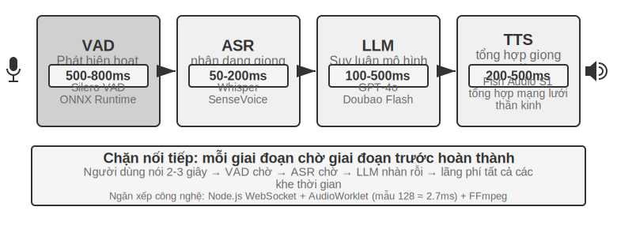


Các trợ lý giọng nói ban đầu đã áp dụng quy trình nối tiếp bốn giai đoạn này vì một lý do đơn giản: không có mô hình đơn lẻ nào có thể xử lý đồng thời bốn nhiệm vụ nhận dạng giọng nói, hiểu ngôn ngữ, suy nghĩ và tổng hợp giọng nói. Kiến trúc mô-đun cho phép mỗi thành phần được phát triển và tối ưu hóa độc lập. Nhưng cái giá của tính mô-đun là độ trễ tích lũy - mỗi giai đoạn phải đợi giai đoạn trước hoàn thành trước khi có thể bắt đầu.

**VAD** là điểm bắt đầu của đường dẫn và liên tục giám sát luồng âm thanh. Thiết kế quan trọng nhất là phát hiện điểm cuối (Phát hiện End-of-Speech): thường đặt ngưỡng im lặng liên tục là 500-800ms - nếu người dùng ngừng nói trong hơn nửa giây, VAD sẽ coi như người dùng đã nói xong. Điều này đưa đến lớp độ trễ đầu tiên và khó có cả hai bên: nếu đặt ngưỡng quá ngắn, người dùng sẽ bị đánh giá nhầm là đã nói xong sau khi chỉ dừng lại để suy nghĩ và câu sẽ bị cắt ngắn; nếu đặt quá lâu, người dùng sẽ phải đợi hơn nửa giây sau khi nói xong mới phản hồi.

**ASR** Chuyển đổi dạng sóng âm thanh thành văn bản. Các mô hình như Whisper và SenseVoice phiên âm âm thanh trong 5 giây. Khi triển khai các mô hình cỡ vừa và nhỏ trên GPU, 50-200ms thường được yêu cầu; các mô hình lớn hơn hoặc môi trường triển khai hạn chế về tài nguyên sẽ đạt tới 200-500ms (nhóm kiểm soát trong thử nghiệm 9-3 là nhóm sau). Vấn đề nghiêm trọng hơn là: trong toàn bộ quá trình chờ đợi và phiên mã ASR, LLM sau đây hoàn toàn không hoạt động, không nhận được bất kỳ thông tin nào và không thể bắt đầu suy nghĩ trước.

**LLM** Trong giai đoạn suy luận, ngay cả khi được tối ưu hóa đúng cách, tùy thuộc vào độ dài ngữ cảnh, độ trễ của mã thông báo đầu tiên (TTFT, thời gian chờ để mô hình phun ra từ đầu tiên) thường yêu cầu 100-500ms và mất khoảng 100 mili giây để xuất ra câu đầu tiên. Nếu lý luận được bật, thời gian có thể kéo dài đến 5-10 giây. Trong kiến trúc truyền thống, TTS phải đợi LLM xuất ra văn bản trả lời hoàn chỉnh trước khi có thể bắt đầu hoạt động.

**TTS** Chuyển đổi văn bản trả lời thành giọng nói, quá trình tổng hợp thường yêu cầu 200-500ms. Cộng độ trễ của mỗi vòng (Hình 9-2): VAD (500-800ms) + ASR (50-200ms) + LLM (100-500ms) + TTS (200-500ms), tổng cộng là khoảng 0.9-2 giây - đây là tình huống lý tưởng khi tất cả các dịch vụ đều không hoạt động và không có ai xếp hàng.


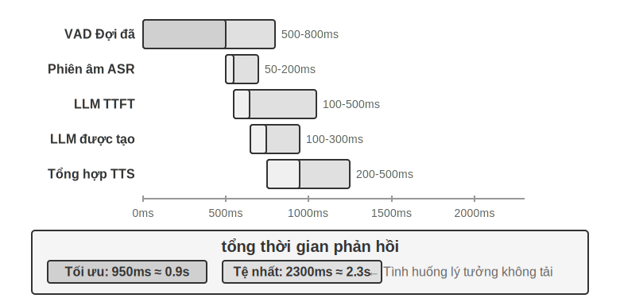


Khi đã được đưa vào sản xuất, sự chậm trễ trong việc xếp hàng có thể khiến tình hình trở nên tồi tệ hơn. Điều này cũng giống như việc xếp hàng trong nhà hàng: nhà bếp càng bận rộn thì thời gian chờ đợi càng lâu và nó không tăng tuyến tính mà tăng vọt (Hình 9-3). Khi máy chủ không có bất kỳ hàng đợi chờ nào (tức là "không hoạt động"), thời gian cần thiết để xử lý yêu cầu được gọi là độ trễ không hoạt động. Nhưng khi có nhiều yêu cầu đến cùng lúc, các yêu cầu sau đó phải xếp hàng chờ.

Theo trực giác, mức sử dụng càng cao thì thời gian chờ đợi sẽ tăng đột biến một cách phi tuyến tính. Mối quan hệ toán học cụ thể có thể được đưa ra bằng lý thuyết xếp hàng (ở đây nó chỉ được hiểu bằng trực giác và không yêu cầu đạo hàm chặt chẽ): tổng độ trễ ≈ độ trễ không tải × 1/(1-sử dụng). Việc sử dụng đề cập đến tỷ lệ thời gian máy chủ bận. Ví dụ: tỷ lệ sử dụng 50% có nghĩa là máy chủ đang xử lý các yêu cầu một nửa thời gian và một nửa thời gian không hoạt động. Độ trễ tăng gấp 2 lần khi không tải khi sử dụng 50% và gấp 5 lần khi sử dụng 80% - đây là lý do tại sao máy chủ không thể chạy ở mức tải cao trong thời gian dài.


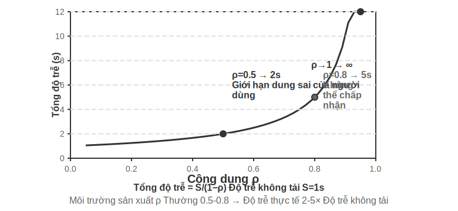


> **Thử nghiệm 9-1 ★: Xây dựng lời nói truyền thống Agent**
>
> Thử nghiệm này xây dựng một hệ thống hội thoại bằng giọng nói hoàn chỉnh theo thời gian thực hỗ trợ người dùng tương tác với giọng nói AI thông qua micrô. Hệ thống áp dụng kiến trúc phân tách front-end và back-end và giao tiếp trong thời gian thực thông qua WebSocket.
>
> Quy trình cốt lõi tuân theo một mẫu nối tiếp nghiêm ngặt: giao diện người dùng ghi lại đầu vào micrô và gửi nó đến giao diện phụ trợ trong thời gian thực thông qua WebSocket. Phần phụ trợ chạy mô hình Silero VAD để phát hiện hoạt động giọng nói. So với các phương pháp phát hiện âm lượng truyền thống, nó có độ chính xác cao hơn và khả năng chống ồn mạnh hơn. Sau khi phát hiện khoảng 500ms im lặng liên tục, các đoạn âm thanh sẽ được trích xuất để xử lý tiếp theo.
>
> ASR, LLM và TTS hỗ trợ chuyển đổi linh hoạt giữa nhiều nhà cung cấp ở từng giai đoạn. Các nhà phát triển có thể chọn sự kết hợp tối ưu dựa trên độ trễ, độ chính xác và điều kiện mạng khu vực.
>
> **9-2 thử nghiệm ★: Build điện thoại Agent sử dụng PineClaw Voice API**
>
> Thử nghiệm 9-1 đã xây dựng hệ thống đối thoại bằng giọng nói trên trình duyệt, nhưng nhiều tác vụ Agent trong thế giới thực yêu cầu thực hiện các cuộc gọi điện thoại thực - liên hệ với bộ phận dịch vụ khách hàng để thương lượng hóa đơn, đặt chỗ nhà hàng và xác nhận đơn hàng. Chương 4 cho thấy cách kiến trúc hướng sự kiện có thể giảm độ trễ phản hồi của thông báo qua điện thoại từ vài phút xuống vài giây thông qua cơ chế Kênh của PineClaw; thí nghiệm này tập trung vào việc xây dựng chính cuộc gọi thoại. Lấy [PineClaw Voice API](https://pineclaw.com/) (do nhóm tác giả phát triển) làm ví dụ, loại giọng nói điện thoại cấp sản xuất này API thường gói gọn toàn bộ quá trình quay số, điều hướng IVR (tức là "Vui lòng nhấn 1 để hỏi, vui lòng nhấn 0 để chuyển thủ công"), hội thoại và phiên âm: Sau khi Agent cung cấp số điện thoại, mục tiêu và thông tin theo ngữ cảnh, giọng nói sẽ được lấy Agent Hoàn thành toàn bộ cuộc gọi và trả về bản ghi cuộc gọi có cấu trúc.
>
> **Mục tiêu của phòng thí nghiệm**: Xây dựng Agent thực hiện các tác vụ qua cuộc gọi điện thoại thực, tích hợp PineClaw Voice làm công cụ vào vòng lặp ReAct.
>
> **Giải pháp kỹ thuật**: Sử dụng PineClaw Voice Python SDK (`pine-voice`) để trang bị cho Agent các công cụ `make_phone_call`. Agent nhận mô tả nhiệm vụ của người dùng (chẳng hạn như “giúp tôi đặt lịch khám răng vào 3 giờ chiều ngày mai”) và sử dụng ReAct để suy nghĩ và quyết định: (1) số điện thoại nào cần gọi; (2) mục tiêu và thông tin chính của cuộc gọi; (3) cách báo cáo kết quả cho người dùng sau cuộc gọi.
>
> Quy trình làm việc của Agent: Người dùng nói "Gọi cho phòng khám để tôi đặt lịch khám ngày mai" → Agent nghĩ xem cần thông tin gì (số điện thoại phòng khám, thời gian hẹn, tên bệnh nhân) → làm rõ cho người dùng nếu thông tin chưa đầy đủ → gọi công cụ `make_phone_call` → PineClaw thực hiện cuộc gọi, nói chuyện với bên kia, hoàn tất cuộc hẹn → Agent nhận tóm tắt và phiên âm cuộc gọi → Báo cáo kết quả cho người dùng.
>
> **Tiêu chí chấp nhận**: Thực hiện cuộc gọi thử thành công (trước tiên bạn có thể gọi đến số điện thoại di động của mình để xác minh kết nối). Agent có thể xác định độc lập các tham số cuộc gọi theo mô tả nhiệm vụ và trích xuất chính xác thông tin chính (thời gian hẹn, số xác nhận, v.v.) sau khi cuộc gọi hoàn tất và báo cáo cho người dùng. So sánh sự khác biệt giữa việc sử dụng trực tiếp API và gọi qua vòng lặp Agent ReAct - vòng lặp sau có thể xử lý tình huống thông tin không đầy đủ (chẳng hạn như tìm kiếm trước khi người dùng không cung cấp số điện thoại).
>
> Thử nghiệm này thể hiện một hướng ứng dụng quan trọng của giọng nói Agent: **Agent không chỉ có thể trò chuyện bằng giọng nói với người dùng mà còn thay mặt người dùng thực hiện các tương tác qua điện thoại với thế giới bên ngoài**. Giọng nói Agent của PineClaw được đào tạo đặc biệt để giải quyết tình trạng chờ đợi kéo dài hàng giờ, điều hướng menu điện thoại và các cuộc đàm phán phức tạp—hãy tưởng tượng việc AI gọi đến số dịch vụ khách hàng của nhà cung cấp dịch vụ của bạn trong khi chờ chuyển sang con người—các tình huống mà đường dẫn thoại nối tiếp truyền thống gặp khó khăn.

### Truyền phát liên kết đầy đủ các đường ống xếp tầng

Một sự hiểu lầm phổ biến cần được làm rõ: tài khoản độ trễ 0,9-2 giây ở trên được tính trong tình huống **hoàn thành nối tiếp** là "mọi liên kết đều được hoàn thành trước khi bàn giao". Nhưng các hệ thống sản xuất vào năm 2025 không còn làm được điều này nữa. Cách tiếp cận chủ đạo không phải là từ bỏ tính mô-đun mà là duy trì sự phân công lao động VAD-ASR-LLM-TTS, đồng thời làm cho mỗi cấp độ trở thành **phát trực tuyến**, để các liên kết liền kề chồng chéo lên nhau theo thời gian:

- **ASR Nghe và chép lời**: Sử dụng tính năng nhận dạng phát trực tuyến, văn bản tiếp tục được tạo ra trong khi người dùng vẫn đang nói và không cần phải đợi VAD xác định rằng câu đã kết thúc trước khi bắt đầu chép lời;
- **LLM Đầu ra phân đoạn theo câu**: Khi tạo, mô hình sẽ cắt câu trả lời thành các câu nhỏ theo dấu câu hoặc ngữ nghĩa. Câu đầu tiên được gửi xuôi dòng ngay khi nó được hình thành, thay vì đợi viết toàn bộ câu trả lời;
- **TTS Tổng hợp phát trực tuyến ở cấp độ câu**: Quá trình tổng hợp và phát lại bắt đầu ngay khi nhận được câu đầu tiên và các câu tiếp theo sẽ được thêm vào khi chúng được tạo. Người dùng nghe thấy âm tiết đầu tiên sớm hơn nhiều.

Bằng cách này, ba cấp độ ASR, LLM và TTS không còn có mối quan hệ tuần tự giống như dùi cui mà giống như ba máy trạm khởi động cùng lúc trên một dây chuyền lắp ráp. Các khung nguồn mở như LiveKit Agents và Pipecat, cũng như các hệ thống gọi đi thương mại chính thống, đều đi theo lộ trình này. Sau khi truyền phát liên kết đầy đủ, độ trễ từ đầu đến cuối thường có thể giảm xuống 600-800ms, tốt hơn đáng kể so với 0,9-2 giây của chuỗi đầy đủ.

Nhưng phát trực tuyến chỉ có thể nén ba phép tính chồng chéo là "phiên âm, suy nghĩ và tổng hợp". Có một độ trễ không thể nén được: **Sự chờ đợi im lặng của VAD và chính vòng phán xét**. Hệ thống vẫn dựa vào ngưỡng tắt tiếng của 500-800ms để đoán "người dùng đã nói xong chưa". Khoảng thời gian chờ đợi này là điều kiện tiên quyết để bắt đầu quy trình và không thể loại bỏ bằng cách chồng chéo. Để nén độ trễ này, chúng ta không thể tập trung vào việc “chồng chéo tất cả các cấp độ” nữa mà phải chuyển sang chính liên kết cảm biến front-end.

### Nhận thức về giọng nói trực tuyến: Thay thế VAD + ASR

Giao diện người dùng nhận thức này bao gồm hai giai đoạn - VAD xác định xem người dùng đã nói xong hay chưa và ASR chuyển âm thanh thành văn bản - cùng nhau xác định thời điểm toàn bộ quy trình bắt đầu và nội dung đầu vào nào được nhận. Có ba vấn đề cơ bản với tầng VAD + ASR truyền thống:

1. **Tích lũy độ trễ**: VAD phải đợi cho đến khi 500-800ms tắt tiếng để xác nhận rằng người dùng đã nói xong, vì nó không thể dự đoán tương lai và chỉ có thể dựa vào "chờ một lát" để phân biệt giữa "thực sự đã hoàn thành" và "chỉ tạm dừng để suy nghĩ"
2. **Mất thông tin**: VAD chỉ xuất ra các tín hiệu nhị phân như "âm thanh/im lặng" và các chi tiết âm thanh như thay đổi cảm xúc, dao động âm sắc, ngập ngừng và tạm dừng cũng như môi trường nền đều bị mất. Vấn đề phán đoán sai đặc biệt nổi bật trong môi trường phức tạp - nếu người dùng tạm dừng lâu sẽ bị đánh giá sai là đã nói xong, khiến câu bị cắt ngắn. Tiếng ồn nền sẽ được kích hoạt nhầm khiến hệ thống bắt đầu xử lý khi không có ai nói. Không thể đánh giá liệu người dùng muốn ngắt lời hay bày tỏ sự đồng tình khi anh ta lặp lại "ừm".
3. **Tỷ lệ chính xác giảm**: VAD cắt âm thanh liên tục thành các đoạn độc lập và gửi chúng đến ASR để nhận dạng tương ứng, phá hủy tính liên tục của ngữ cảnh. Tỷ lệ lỗi của nội dung yêu cầu xác định chính xác ngữ cảnh (địa chỉ email, tên thương hiệu, tên cá nhân, danh từ riêng) đã tăng đáng kể - ví dụ: một người dùng đã báo cáo địa chỉ email là "john dot smith tại gmail dot com". Nếu "john" và "smith" được chia thành các phần khác nhau, "smith" có thể bị hiểu nhầm là "miss" do thiếu ngữ cảnh.

**Mô hình nhận thức giọng nói truyền phát** cung cấp giải pháp cơ bản. Trước tiên, hãy làm rõ ý nghĩa kỹ thuật của "truyền phát": việc mô hình giọng nói có thể được truyền phát hay không phụ thuộc vào việc bộ mã hóa là nhân quả hay phân đoạn (chỉ dựa vào âm thanh đã đến mà không xem toàn bộ bản ghi) và liệu quá trình giải mã có tăng dần hay không (xuất ra một phần kết quả mỗi khi nhận được một đoạn âm thanh nhỏ). Whisper không phát trực tuyến, không phải do cách nó giải mã—việc giải mã của nó vốn có tính tự hồi quy—mà vì bộ mã hóa của nó yêu cầu một phân đoạn âm thanh đầy đủ (cố định 30 giây, đệm nếu không đủ) trước khi nó có thể bắt đầu hoạt động. Cũng cần lưu ý rằng bản thân nhận dạng phát trực tuyến không phải là một công nghệ mới: ASR phát trực tuyến truyền thống được đại diện bởi RNN-T và Conformer phát trực tuyến đã được triển khai trên quy mô lớn trong ngành - phụ đề thời gian thực trên điện thoại di động và đầu vào bằng giọng nói trong các phương thức nhập liệu đều sử dụng loại mô hình này - chúng không liên quan gì đến LLM.

Phần này tập trung vào một lộ trình mới: **Truyền tải nhận thức thính giác dựa trên LLM** - sử dụng LLM nguồn mở làm xương sống cho quá trình post-training, cho phép mô hình xuất trực tiếp các phản hồi ở cấp độ ngữ nghĩa từ luồng âm thanh liên tục, hợp nhất "nhận dạng" và "hiểu" vào cùng một mô hình. Đây là bản nâng cấp của tính năng phát trực tuyến truyền thống ASR, chứ không phải là một phát minh về công nghệ phát trực tuyến: độ trễ nhận dạng tăng dần cũng được duy trì ở mức thời gian suy luận một bước (hàng chục đến một hoặc hai trăm mili giây), nhưng mô hình không còn nhìn thấy các đoạn riêng biệt được VAD cắt nhỏ mà là một luồng âm thanh liên tục từ đầu cuộc trò chuyện đến thời điểm hiện tại, có thể thực hiện In-Context Learning (học trong ngữ cảnh) dựa trên ngữ cảnh hoàn chỉnh (In-Context Learning), độ chính xác nhận dạng thông tin cá nhân, danh từ chuyên nghiệp và thói quen phát âm của người dùng đã được cải thiện đáng kể.

Một ưu điểm quan trọng khác của tuyến đường này là nó kế thừa kiến thức thế giới và khả năng suy luận thông thường của LLM - xét cho cùng, mô hình xương sống đã xem được lượng văn bản khổng lồ. Ví dụ: người mẫu biết rằng "Apple" theo sau là "họp báo" rất có thể ám chỉ Apple chứ không phải trái cây. Việc nâng cao kiến thức này cho phép độ chính xác nhận dạng của thông tin có giá trị cao như số lượng, tên địa điểm và tên thương hiệu cao hơn nhiều so với ASR truyền thống. Đã có các mô hình có thể triển khai trên tuyến đường này, chẳng hạn như Ultravox của Fixie - gửi âm thanh trực tiếp đến đường trục LLM, xuất văn bản và mã thông báo ngữ nghĩa; Qwen2-Audio và Qwen2.5-Omni của Alibaba được sử dụng trong các thử nghiệm trong phần này cũng thuộc cùng loại mô hình âm thanh gốc.

Tuy nhiên, việc thay thế VAD không nhất thiết phải có một model âm thanh hoàn chỉnh. Nếu bạn chỉ muốn giải quyết vấn đề đầu tiên - **xác định xem người dùng đã nói xong chưa**, có một cách dễ dàng hơn: cắm trực tiếp "phán đoán vòng" này vào chính bộ nhận dạng [^ch9-11]. Phương pháp là thêm LoRA vào một mô hình nhận dạng phát trực tuyến nguồn mở nhỏ và để nó phiên âm trong khi **ngữ nghĩa toàn diện và sự im lặng** để xác định "liệu câu này đã diễn đạt được ý nghĩa hoàn chỉnh hay chưa" - vì khoảng dừng trong vòng (tạm dừng khi báo số điện thoại) thường dài hơn khoảng thời gian giữa các vòng, chỉ dựa vào ngưỡng im lặng chắc chắn sẽ không làm hài lòng cả hai đầu. Kết luận thú vị hơn là: mô hình luôn xoay quanh "có nên đóng hay không", và nguyên nhân sâu xa thường không nằm ở cấu trúc mô hình mà ở **nhãn đào tạo được đánh dấu bằng "Góc nhìn của Chúa"** - âm thanh xuất hiện sau điểm quyết định được dùng để gắn nhãn, trong khi mô hình trực tuyến hoàn toàn không thể nhìn thấy tương lai; thay đổi từng nhãn thành "chỉ sử dụng thông tin có sẵn tại thời điểm đưa ra quyết định" thành nhãn và cú xoay sai lầm này sẽ biến mất. Điều này cũng lặp lại nhận định được đưa ra sau khi đào tạo ở Chương 7: Trong nhiều trường hợp, dữ liệu còn quan trọng hơn kiến trúc. Tuyến đường nhẹ hơn này cũng đã được triển khai ở cấp độ sản xuất: Flux của Deepgram và Universal-Streaming của AssemblyAI nhúng trực tiếp các điểm cuối và phán đoán vòng vào mô hình nhận dạng luồng, được thiết kế đặc biệt cho lời nói Agent; về phía nguồn mở, có các mô hình phát hiện vòng ngữ nghĩa do LiveKit và Pipecat cung cấp.

[^ch9-11]: Xây dựng phán đoán tròn về người nhận dạng và chẩn đoán "Cái nhìn của Chúa về nhãn" xem Li, Bojie và Noah Shi.

Mô hình không chỉ xuất ra văn bản mà còn xuất ra một loạt mã thông báo đặc biệt của các sự kiện âm thanh - chúng là các mã thông báo đặc biệt được giới thiệu trong quá trình đào tạo mô hình và mô hình sẽ học cách tự động xuất ra khi phát hiện sự kiện âm thanh tương ứng. Các loại phổ biến như sau:

- `<speak_start/end>`: Xác định phần bắt đầu và kết thúc lời nói dựa trên đánh giá toàn diện về ngữ nghĩa và âm học, thay vì phát hiện sự im lặng đơn giản
- `<interrupt>`: Phân biệt xem người dùng có thực sự muốn ngắt lời hay chỉ đang xen vào hoặc bị phân tâm bởi tiếng ồn xung quanh
- `<emotion:happy/frustrated>`: Thẻ cảm xúc
- `<laugh>`/`<sigh>`: Tín hiệu ngôn ngữ như tiếng cười, tiếng thở dài
- `<music>`/`<noise>`: Âm thanh xung quanh

Các dấu hiệu và mã thông báo văn bản này tạo thành một luồng sự kiện thống nhất và được gửi cùng nhau đến lớp tư duy.

```
Input audio: "Um, actually I think... no wait, let me reconsider."
Model output stream:
  <speak_start> Um, <emotion:hesitant> actually I think...
  <silence:500ms> no wait, <emotion:confident> let me reconsider <speak_end>
```

Lưu ý rằng mô hình không chỉ xuất ra bản phiên âm văn bản mà còn xuất ra các điểm đánh dấu sự kiện giọng nói (bắt đầu/kết thúc nói, thay đổi tâm trạng, khoảng im lặng). Khung Agent có thể tận dụng các thẻ này để cho phép tương tác tự nhiên hơn—chẳng hạn như chủ động đưa ra các tùy chọn khi phát hiện sự do dự của người dùng.

> **Thử nghiệm 9-3 ★: Mô phỏng khả năng nhận biết giọng nói trực tuyến bằng Qwen2-Audio**
>
> Thiết kế thử nghiệm cần được giải thích trước: Bản thân Qwen2-Audio là một mô hình không phát trực tuyến với toàn bộ đầu vào. Thử nghiệm này sử dụng **đầu vào được chia nhỏ để mô phỏng quá trình xử lý phát trực tuyến** - luồng âm thanh liên tục được cắt thành các khối nhỏ có độ dài cố định và mỗi khối được gửi đến mô hình cùng với ngữ cảnh âm thanh đã tích lũy trước đó. Mô hình dần dần tạo ra các mã thông báo sự kiện âm thanh và văn bản (chẳng hạn như tiếng cười, tạm dừng và các tín hiệu phi ngôn ngữ khác) đồng thời đo độ trễ từ văn bản đầu vào đến văn bản đầu ra cho mỗi khối. Có một mức giá quan trọng ở đây: bộ mã hóa của Qwen2-Audio không tăng dần. Mỗi khi một khối mới được xử lý, tất cả âm thanh tích lũy trước đó phải được mã hóa lại từ đầu. Do đó, cuộc trò chuyện càng dài và âm thanh tích lũy càng nhiều thì độ trễ mã hóa của một khối càng cao. Đây là điểm khác biệt cơ bản giữa "phát trực tuyến mô phỏng" và "phát trực tuyến thực sự" (sử dụng bộ mã hóa tăng dần hoặc nhân quả, chỉ mã hóa tăng dần một đoạn âm thanh nhỏ mới đến). Thiết kế này có thể chứng minh độ chính xác đạt được nhờ "nhận thức liên tục với ngữ cảnh hoàn chỉnh được bảo toàn", nhưng số độ trễ chỉ phản ánh mức độ chi tiết và tốc độ suy luận của phân khối và không bằng độ trễ gói đầu tiên của mô hình được thiết kế theo luồng thực sự (chẳng hạn như Qwen3-Omni sử dụng mã hóa phân khối); độc giả quan tâm có thể làm lại thí nghiệm này bằng cách sử dụng thí nghiệm sau. Giải pháp so sánh là đường ống VAD + Whisper ASR truyền thống. Ba loại tình huống được thử nghiệm: hội thoại bình thường, câu dài có ngắt quãng và hội thoại có tiếng ồn xung quanh.
>
> Kết quả: Độ trễ nhận dạng tăng dần của sơ đồ mô phỏng khối có thể được kiểm soát theo thứ tự từ một đến hai trăm mili giây (tùy thuộc vào độ dài khối và phần cứng), trong khi sơ đồ truyền thống cần đợi xác nhận VAD hoàn tất (600 mili giây) cộng với suy luận Whisper (khoảng 200-500ms trong cấu hình thử nghiệm này), tổng cộng là 800-1100ms. Ở cảnh có đoạn tạm dừng, VAD đã đánh giá sai rằng nó đã kết thúc ở khoảng dừng dài đầu tiên và cắt câu thành hai đoạn để nhận dạng. "Khoảng hai giờ" bị hiểu nhầm là "khoảng 0 giờ" do thiếu ngữ cảnh; trong khi sơ đồ phân đoạn duy trì ngữ cảnh hoàn chỉnh và nhận dạng chính xác toàn bộ câu. Trong cảnh có nhiễu nền, Qwen2-Audio xuất mã thông báo `<|noise|>` để đánh dấu sự hiện diện của nhiễu nhưng không làm gián đoạn quá trình nhận dạng. VAD truyền thống bị kích hoạt nhầm do tiếng ồn, khiến quá trình nhận dạng bắt đầu sớm.

## Mô hình 2 · Mô hình full-modal end-to-end (Omni)

Nhìn lại toàn bộ quy trình phân tầng: ngay cả khi giao diện người dùng nhận thức đã được thay thế bằng nhận thức giọng nói truyền phát, nó vẫn sẽ chỉ định "nghe, suy nghĩ và nói" cho ba mô hình độc lập, được kết nối với nhau bằng một giao diện riêng biệt. Cho dù giao diện này có rộng đến đâu thì nó cũng chẳng qua là một vài mã thông báo ngữ nghĩa và các điểm đánh dấu âm thanh rời rạc - tâm trạng, giai điệu, ngữ điệu hiện tại của người nói cũng như âm thanh xung quanh và nhạc nền. Hầu hết chúng đều bị thất lạc trong quá trình bàn giao; Chưa kể 3 phần này được train và tối ưu riêng biệt nên khó phối hợp với nhau. Mô hình toàn phương thức từ đầu đến cuối (Omni) có một cách tiếp cận khác - sử dụng một mô hình duy nhất để trực tiếp "nghe" âm thanh, "suy nghĩ" để trả lời và "nói" ra, kết hợp ba phân đoạn thành một (Hình 9-4). Miễn là đủ dữ liệu huấn luyện, không gian tiềm ẩn bên trong mô hình có thể truyền trực tiếp những thông tin cận ngôn ngữ này đến đầu thế hệ bên ngoài văn bản: độ trễ thấp hơn và nhịp điệu và cảm xúc được giữ nguyên. Sự cân bằng là: **Các mô-đun đường ống phân tầng** rõ ràng, mỗi phân đoạn có thể được điều chỉnh độc lập và có khả năng diễn giải tốt; **Mô hình đầu cuối** có độ trễ thấp hơn và có thể lưu giữ thông tin phi văn bản, nhưng lại phải trả giá bằng yêu cầu dữ liệu đào tạo lớn hơn và khả năng diễn giải kém hơn.

Cũng cần phải thêm một khía cạnh thường bị bỏ qua: lợi thế của end-to-end chủ yếu được phản ánh ở **độ trễ** và không nhất thiết phải chiếm ưu thế ở khía cạnh **độ chính xác**. Một giải pháp đáng so sánh là **tự xếp tầng**(self-cascade) - cùng một mô hình trước tiên chuyển âm thanh thành văn bản có cấu trúc, sau đó đưa ra suy luận dựa trên văn bản; so với câu trả lời từ đầu đến cuối một lần, câu trả lời nào có độ chính xác cao hơn tùy thuộc vào nhiệm vụ cụ thể. Quy tắc có thể được tóm tắt như sau: khi câu trả lời chủ yếu được xác định bởi nội dung ngữ nghĩa (tức là "những gì đã nói") và văn bản trung gian đủ để mang đầy đủ thông tin liên quan đến nhiệm vụ, thì độ chính xác của phương pháp tự xếp tầng tương đương hoặc thậm chí tốt hơn so với phương pháp đầu cuối. Ưu điểm này đặc biệt có ý nghĩa ở những mô hình có khả năng nhận thức yếu; ngược lại, khi câu trả lời phụ thuộc nhiều vào những manh mối phi ngôn ngữ (giọng điệu, cảm xúc, âm thanh môi trường) khó thể hiện trong văn bản thì phương pháp end-to-end lại cho thấy những ưu điểm rõ ràng. Quan trọng hơn, ưu và nhược điểm của cả hai có thể được xác định trước dựa trên tính chất của nhiệm vụ, thay vì chỉ đơn giản là do "từ đầu đến cuối tiến bộ hơn". Từ đó, có thể rút ra một nguyên tắc thiết kế sâu hơn: chìa khóa để xác định hiệu suất thường không phải là **nút thắt** về việc có nên giới thiệu cách biểu đạt trung gian hay không, mà là thông tin do nút cổ chai mang theo - nếu văn bản trung gian được nâng cấp từ một phiên âm đơn giản lên một dấu hiệu cận ngôn ngữ kèm theo (biểu đạt cảm xúc) (cảm xúc, tốc độ nói, âm thanh môi trường) thì lợi thế về độ chính xác từ đầu đến cuối ban đầu thường bị thu hẹp. Điều này phù hợp với "lớp nhận thức không chỉ xuất ra văn bản thuần túy" được ủng hộ trong bài viết trước "Nhận thức giọng nói truyền phát" [^ch9-13].

Nhưng dù Omni có mạnh đến đâu thì về cơ bản nó cũng chỉ kết hợp ba mô hình thành một. Nó không hủy bỏ giả định "thay phiên nhau nói": nó vẫn dựa vào VAD để phân chia quyền phát biểu - nó dừng khi phát hiện người dùng đang nói và nói ngay khi người dùng tắt tiếng. Sau đó, vấn đề quen thuộc lại nổi lên: người dùng báo một dãy số, tạm dừng một lát, Omni đánh giá đối phương đã nói xong liền cưỡng ép cắt ngang. Khả năng nhận biết giọng nói truyền phát nói trên có thể nâng cấp khả năng phán đoán lần lượt từ khoảng thời gian im lặng lên cấp độ ngữ nghĩa, giúp giảm bớt đáng kể kiểu phán đoán sai lầm này. Tuy nhiên, đây chỉ là sửa chữa một phần trong khuôn khổ "lượt rẽ" và không tự hủy lượt quay. Để **về cơ bản** thoát khỏi tình thế tiến thoái lưỡng nan này, chúng ta không thể mày mò trong khuôn khổ "xoay chuyển" được nữa. Thay vào đó, chúng ta phải để người mẫu nghe và nói cùng lúc, đồng thời quyết định độc lập khi nào nên nói. Không còn sự chuyển đổi khó khăn giữa "ai nên nói".

[^ch9-13]: Khi nào sự khác biệt về độ chính xác giữa phân tầng và từ đầu đến cuối bị đảo ngược và cách dự đoán hướng của nó dựa trên tính chất của nhiệm vụ (liệu biểu diễn trung gian có thể mang đầy đủ thông tin liên quan đến nhiệm vụ hay không). Để biết các phép đo đa phương thức hoàn chỉnh, xem Li, Bojie và Noah Shi. *Khoảng cách Cascade: Khi nào và tại sao Self-Cascades Trợ giúp đa phương thức Agents.* 2026 (sẽ được xuất bản).


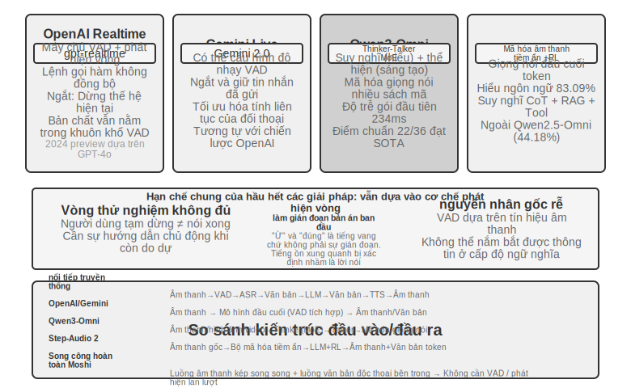


**OpenAI API thời gian thực** gần như hoàn thiện ở cấp mô hình (mô hình xử lý âm thanh nguyên bản), nhưng vẫn dựa trên VAD truyền thống ở cấp độ kiểm soát tương tác, đây là giải pháp trung gian để chuyển đổi sang hoàn thiện từ đầu đến cuối. Ban đầu, nó (được xem trước vào năm 2024) chạy trên GPT-4o và sau khi được phát hành chính thức dưới dạng GA vào năm 2025, nó đã chuyển sang một mô hình dành riêng cho giọng nói độc lập **gpt-realtime**(không còn là chế độ của GPT-4o mà là một mô hình được tối ưu hóa cho giọng nói thời gian thực). API Máy chủ VAD được bật theo mặc định và tự động xác định khi nào người dùng bắt đầu và kết thúc nói chuyện. Hỗ trợ ngắt quãng trong cuộc trò chuyện - ngay lập tức dừng việc tạo giọng nói hiện tại khi phát hiện người dùng đang nói, giống như khi hai người đang trò chuyện trực tiếp thì một bên ngắt lời và bên kia tự nhiên dừng lại. gpt-realtime cũng giới thiệu các lệnh gọi hàm không đồng bộ: mô hình có thể đợi công cụ trả về kết quả trong khi tiếp tục nói chuyện với người dùng, ẩn độ trễ của công cụ trong quá trình hội thoại. Những điều này đã cải thiện trải nghiệm nhưng bản chất vẫn được tối ưu hóa theo khung VAD. **Gemini Live API** có ý tưởng tương tự, hỗ trợ cấu hình độ nhạy VAD và giữ lại thông tin đã gửi khi bị gián đoạn để đảm bảo cuộc trò chuyện diễn ra liên tục.

**Qwen3-Omni** áp dụng kiến trúc Thinker-Talker: chia suy nghĩ (hiểu và lý luận) và diễn đạt (tạo lời nói) thành hai mô-đun chuyên biệt, thống nhất nhận thức và tạo ra văn bản, hình ảnh, âm thanh và video.

Để kiểm soát chi phí tính toán trong khi vẫn duy trì khả năng cao, Qwen3-Omni áp dụng kiến trúc MoE (Hỗn hợp các chuyên gia) - có thể hiểu là "gọi một nhóm chuyên gia theo yêu cầu": nó chứa nhiều mạng chuyên gia nhỏ trong nội bộ và chỉ một số mạng trong số đó phù hợp nhất với nhiệm vụ hiện tại được kích hoạt cho mỗi suy luận và phần còn lại không tham gia tính toán. Ví dụ: khi xử lý lời nói, các chuyên gia liên quan đến giọng nói chủ yếu được kích hoạt và khi xử lý hình ảnh, các chuyên gia liên quan đến thị giác chủ yếu được kích hoạt. Bằng cách này, mô hình không chỉ có tổng số tham số lớn (đảm bảo giới hạn khả năng trên) mà còn kiểm soát lượng tính toán thực tế của một mã thông báo ở mức nhỏ, từ đó cải thiện thông lượng suy luận và giảm độ trễ xếp hàng khi tải cao.

Điều cần phân biệt là MoE giải quyết vấn đề thông lượng "có thể phục vụ bao nhiêu yêu cầu trên mỗi đơn vị sức mạnh tính toán". Nó không trực tiếp xác định "liệu gói âm thanh đầu tiên có thể được phát ra sớm nhất có thể hay không" - độ trễ của gói đầu tiên phụ thuộc vào kiến trúc của đầu tạo. Gói cấp thấp của Qwen3-Omni xuất phát từ thiết kế của mô-đun Talker: nó dần dần tạo ra các mã thông báo âm thanh theo cách tự động hồi quy nhiều sổ mã và hợp tác với codec nhân quả để giải mã dần dần các mã thông báo này thành dạng sóng. Do đó, ngay khi mô-đun tư duy xuất ra văn bản, Người nói có thể tiếp tục truyền phát giọng nói tổng hợp mà không cần đợi toàn bộ câu trả lời được tạo ra. Theo báo cáo chính thức, độ trễ gói đầu tiên về mặt lý thuyết khởi động nguội của nó thấp khoảng 234 mili giây, hỗ trợ 19 hiểu ngôn ngữ và tạo 10 ngôn ngữ, đồng thời dẫn đầu 22 trong số 36 điểm chuẩn âm thanh và video.

**Step-Audio 2** đi theo một lộ trình khác: xử lý trực tiếp âm thanh thô đầu vào và đầu ra văn bản cũng như âm thanh để đạt được cuộc đối thoại bằng giọng nói đầu cuối thực sự. Nó không chỉ có thể hiểu những gì đã được nói (thông tin ngữ nghĩa) mà còn có thể hiểu nó được nói như thế nào - thông tin cận ngôn ngữ (Thông tin song ngữ), chẳng hạn như tâm trạng của người nói là vui hay tức giận, tốc độ nói nhanh hay ngập ngừng, giọng nói đang lên hay xuống - cũng như âm thanh xung quanh và nhạc nền. Nó tạo ra các phản hồi biểu cảm thông qua học tập phản ánh và củng cố, đồng thời tích hợp cơ chế RAG và các công cụ bên ngoài (tìm kiếm trên web, tìm kiếm âm thanh). Theo báo cáo giấy Step-Audio 2, trên tiêu chuẩn hiểu ngôn ngữ StepEval-Audio-Paralinguistic do nó đề xuất, độ chính xác của Step-Audio 2 đạt 83,09%, vượt xa mô hình full-modal nguồn mở Qwen2.5-Omni (44,18%) trong cùng thời kỳ và cũng cao hơn so với Âm thanh GPT-4o (43,45%) và Kimi-Audio (49,64%).

Step-Audio R1 là sản phẩm tiếp theo của dòng Step-Audio. Dựa trên kiến trúc hội thoại bằng giọng nói từ đầu đến cuối của Step-Audio 2, nó tiếp tục nội hóa khả năng tư duy trực tiếp vào mô hình âm thanh. Cả hai đại diện cho sự phát triển tiến bộ của cùng một lộ trình kỹ thuật.
## Mô hình 3 · Mô hình tương tác song công hoàn toàn (Full-Duplex / Interactive)

Mô hình 2 kết hợp ba mô hình thành một, nhưng vẫn tuân thủ giả định "nói lần lượt" - người dùng nói hoặc mô hình nói và điểm chuyển đổi được đoán bởi VAD hoặc ngữ nghĩa. Nhưng một số cảnh đơn giản là không thể đáp ứng được sự luân phiên của "bạn nói một đằng, tôi nói một nẻo". **Dịch song song** là một ví dụ: người phiên dịch không đợi người nói nói hết câu rồi mới nói mà lắng nghe và sắp xếp trong đầu. Ý nghĩa của một nhóm ý nghĩa gần như đầy đủ rồi mới được dịch ra. Nghe và dịch luôn chồng chéo nhau. Trò chơi nhịp điệu **đập trống theo nhạc** thậm chí còn cực đoan hơn - thính giác của bạn phải liên tục theo dõi dòng nhạc không bị gián đoạn, tay bạn phải đánh nhịp theo thời gian thực và bạn phải dự đoán nhịp tiếp theo. Ở đây thậm chí không có một "vòng", đầu vào là một dòng chảy liên tục không bao giờ dừng lại. Những nhiệm vụ như vậy đặt ra thách thức cơ bản đối với mô hình turn-by-turn: chúng yêu cầu thực hiện đồng thời việc lắng nghe, suy nghĩ và hành động và tiền đề của mô hình theo lượt chính xác là đặt ba nhiệm vụ này vào các khoảng thời gian khác nhau. Mô hình song công hoàn toàn đưa con đường "loại bỏ VAD" đến điểm cuối hợp lý - chỉ cần hủy bỏ giả định về "lượt" và cho phép mô hình nghe và nói liên tục cùng một lúc.

Tiền thân của nghiên cứu là **Moshi**(2024) của Kyutai. Nó mô phỏng song song hai luồng âm thanh (giọng nói của người dùng và giọng nói của chính người mẫu), được bổ sung bởi luồng văn bản "độc thoại nội tâm" để cải thiện chất lượng ngôn ngữ của giọng nói được tạo ra. Vì bạn luôn lắng nghe nên việc nói chồng chéo và ngắt lời bất cứ lúc nào đã trở thành hành vi tự nhiên. Không cần bất kỳ logic phát hiện gián đoạn rõ ràng nào. Độ trễ từ đầu đến cuối là khoảng 200ms, gần với nhịp điệu tự nhiên trong cuộc trò chuyện của con người.

Vào năm 2026, **Phòng thí nghiệm máy tư duy** do Mira Murati thành lập đã xem trước một danh mục mới mà họ gọi là **Mô hình tương tác**[^ch9-14] và làm rõ ý tưởng đằng sau chế độ song công hoàn toàn: tính tương tác không nên được thể hiện bằng các khai thác trình cắm như VAD Xung quanh mô hình mà phải được tích hợp vào chính mô hình - theo lời ban đầu của anh ấy, "Để khả năng tương tác mở rộng bằng trí thông minh, tính tương tác phải trở thành một phần của bản thân mô hình." Nằm trong kiến trúc là **Micro-rounds (micro-turn)**: Mô hình không đợi toàn bộ vòng hoàn thành mà sử dụng khoảng 200 mili giây làm một khoảng thời gian, liên tục "đọc 200 mili giây, tạo 200 mili giây", cho phép các luồng âm thanh, video và văn bản xen kẽ và nâng cao. Mức độ chi tiết này là sự thỏa hiệp có chủ ý—đủ tốt để sự im lặng, sự chồng chéo và sự gián đoạn được giữ lại dưới dạng các luồng liên tục trong ngữ cảnh của mô hình và không có ranh giới vòng tròn nhân tạo nào cần điều chỉnh; nhưng vẫn đủ thô để cho phép nhiều phương thức được xử lý đồng thời theo khối, giữ độ trễ trong phạm vi thời gian thực có thể nhận biết được. Do sự tương tác được tích hợp vào mô hình nên các hành vi như "nghe và nói" và "xem và xen vào" trước đây cần có dây đai đặc biệt giờ đây đã trở thành một phần của mô hình và sẽ trở nên mạnh mẽ hơn cùng với mô hình: mô hình đầu tiên TML-Interaction-Small đã đào tạo ba luồng lại với nhau từ đầu. Khi phát hiện người dùng đang viết một đoạn mã có lỗi hoặc ai đó bước vào màn hình, nó có thể chủ động nói.

Cách tiếp cận "tư duy chậm" của nó cũng khá mang tính đại diện. Bản thân mô hình tương tác chỉ chịu trách nhiệm duy trì cuộc trò chuyện trực tuyến. Khi gặp một vấn đề yêu cầu suy luận chuyên sâu hoặc gọi công cụ, nó sẽ được giao cho một mô hình lý luận mạnh hơn ở chế độ nền - nội dung được chuyển giao không phải là một truy vấn riêng lẻ mà là ngữ cảnh của toàn bộ cuộc trò chuyện. Mô hình nền đưa ra các suy luận trong khi truyền lại kết quả. Sau đó, mô hình tương tác sẽ chọn một cơ hội không làm gián đoạn người dùng và đưa cơ hội đó vào cuộc trò chuyện một cách tự nhiên, trong đó mô hình sẽ trả lời cuộc trò chuyện, trả lời câu hỏi và tiếp tục nói chuyện như bình thường. Bằng cách này, "độ trễ của mô hình không suy nghĩ" được sử dụng để hiện thực hóa "khả năng lập kế hoạch, công cụ và tác nhân của mô hình lý luận". Theo báo cáo chính thức, độ trễ chuyển đổi vòng của TML-Interaction-Small (tham số 276B MoE, kích hoạt 12B) thấp nhất là khoảng 0,40 giây (GPT-realtime-2.0 là khoảng 1,18 giây), vượt xa đáng kể so với các sản phẩm cạnh tranh có điểm gần như bằng 0 trên tiêu chuẩn sáng kiến trực quan; khi viết, nó vẫn đang trong giai đoạn xem trước nghiên cứu.

[^ch9-14]: Thinking Machines Lab, “Interaction Models: A Scalable Approach to Human-AI Collaboration,” 2026-05. https://thinkingmachines.ai/blog/interaction-models/

Trong cùng năm đó, **GPT-Live** của OpenAI đã đưa tính năng song công hoàn toàn lên quy mô sản xuất và được triển khai trên toàn cầu dưới dạng mô hình mặc định mới cho giọng nói ChatGPT. Nó không còn coi các cuộc hội thoại như một chuỗi các vòng tin nhắn rời rạc mà tiếp tục xử lý đầu vào trong khi tiếp tục tạo đầu ra, do đó, nó có thể đưa ra nhiều quyết định tương tác mỗi giây: nên nói, tiếp tục nghe, tạm dừng, ngắt quãng hay gọi một công cụ. Hiệu suất như sau: khi người dùng đang suy nghĩ, nó sẽ im lặng chờ đợi thay vì chộp lấy các từ và sẽ sử dụng các tiếng vang như "ừm" và "đúng" để biểu thị rằng nó đang lắng nghe. Nó cũng có khả năng thực hiện các nhiệm vụ như dịch thuật thời gian thực yêu cầu nghe và nói cùng một lúc.

GPT-Live cũng đã đi theo con đường phân công lao động nhanh và chậm tương tự - **tách "tương tác thời gian thực" khỏi "suy nghĩ sâu"**: Khi nói đến tìm kiếm, lý luận hoặc các hoạt động tác nhân phức tạp hơn, GPT-Live, người chịu trách nhiệm tương tác, giao nhiệm vụ cho mô hình tiên tiến ở chế độ nền (GPT-5.5 tại thời điểm phát hành), tiếp tục duy trì luồng cuộc trò chuyện và đưa nó trở lại cuộc trò chuyện sau khi có kết quả ở chế độ nền. GPT-Live-1 và các phiên bản mini sử dụng GPT-5.5 Instant ở chế độ nền, còn các bánh răng Trung bình và Cao gọi GPT-5.5 chu đáo, cho phép người dùng lựa chọn giữa "nhanh" và "sâu" nếu cần. “Sự phân công lao động giữa tốc độ và chậm” này là chủ đề sẽ được phát triển trong phần tiếp theo “Tư duy lựa chọn kiến trúc”.

Xem lại chuỗi tường thuật “thay thế VAD” trong chương này: VAD dựa vào ngưỡng im lặng để đoán việc chuyển đổi quyền phát biểu. Nhận thức truyền phát (xem phần "Nhận thức giọng nói truyền phát" của mô hình trước) nâng cấp phán đoán chuyển đổi lên lớp ngữ nghĩa và mô hình song công hoàn toàn loại bỏ hoàn toàn chính "chuyển đổi" - nó luôn lắng nghe và "gián đoạn" không còn là một sự kiện cần được xử lý đặc biệt, barge-in Do đó, chuỗi xử lý đã bị loại bỏ về mặt kiến trúc khỏi hầu hết các liên kết. Đây là phần cuối của dòng tường thuật "thay thế VAD" tính đến thời điểm viết bài này.

## Nghĩ về sự đánh đổi kiến trúc: từ tách biệt đến thống nhất

Điều thực sự cần giải quyết là mâu thuẫn giữa phản ứng theo thời gian thực và tư duy chuyên sâu: người dùng mong đợi phản hồi ở mức mili giây và các vấn đề phức tạp đòi hỏi thời gian suy nghĩ ở cấp độ giây. Làm thế nào để mô hình có thể suy nghĩ đủ sâu mà vẫn duy trì được độ trễ thấp? Sự mâu thuẫn này không chỉ xảy ra đối với kiến trúc end-to-end và không thể tránh khỏi các đường ống xếp tầng.

Ba giải pháp sau đây không phải là sự lặp lại kỹ thuật tuyến tính - chúng là sự cân bằng trong thiết kế dựa trên các ràng buộc khác nhau và cùng tồn tại trong thực tế. Việc lựa chọn cái nào phụ thuộc vào độ trễ và yêu cầu suy nghĩ sâu sắc của kịch bản ứng dụng. Trước tiên cần làm rõ sự khác biệt giữa ba phương án: Phương án 1 và Phương án 2 về cơ bản là sự phân chia tốc độ và chậm rãi của “hai mô hình độc lập đồng thời” và không dựa vào end-to-end, thậm chí có thể áp dụng cho đường ống phân tầng; chỉ có Kế hoạch 3 mới thực sự đưa tư duy vào mô hình toàn diện.

Điều đáng chú ý là đến năm 2026, con đường “tách nhanh chậm” đã trở thành lựa chọn chủ đạo cho các sản phẩm thoại tiên tiến và có tên gọi riêng. Phòng thí nghiệm Máy Tư duy gọi nó là "Mô hình tương tác" - mô hình tương tác thời gian thực kết hợp với mô hình lý luận nền tảng không đồng bộ; Giọng nói Grok "Think Fast" của xAI, giọng nói Agent của Pine AI và "phái đoàn" GPT-Live ở phần trước đều đi theo cùng một lộ trình "nhanh ở phía trước để duy trì hội thoại, chậm ở phía sau để suy luận sâu". Có một lý do thực tế đằng sau việc chọn tách riêng thay vì "đào tạo một mô hình đa mục đích": các mô hình suy luận tiên tiến được lặp lại vài tháng một lần và khả năng tương tác thời gian thực yêu cầu dữ liệu chuyên biệt và mục tiêu đào tạo. Nhét cả hai vào cùng một mô hình tương đương với việc để nó đuổi theo một mục tiêu đang chuyển động liên tục và cũng có thể làm suy giảm khả năng suy luận có giá trị nhất [^ch9-8]. Ngược lại, miễn là mô hình suy luận mạnh nhất được giữ nguyên ở nền và chỉ có mô hình tương tác nhẹ được huấn luyện ở nền trước thì "bộ não" mạnh nhất luôn có thể được sử dụng. Đây là lý do tại sao GPT-Live nhấn mạnh "chuyển đổi bền vững sang các mẫu tiên tiến mới nhất". Hãy xem xét ba phương án theo thứ tự “cơ chế phối hợp từ yếu đến mạnh”.

### Phương án 1: Nghĩ nhanh để đối phó, chậm để suy nghĩ và trả lời

Tư duy nhanh và chậm được thực hiện song song (Hình 9-5): Tư duy nhanh đưa ra câu trả lời đối phó ngắn trong vòng 500 mili giây (tương tự như một người nói "để tôi suy nghĩ" trước) và tư duy chậm dành 5-10 giây ở chế độ nền để đưa ra câu trả lời hoàn chỉnh sau khi suy nghĩ sâu. Công nghệ mà Slow Thought sử dụng được gọi là "tỷ lệ tính toán trong quá trình suy luận" (test-time Scaling) - theo cách nói thông thường, nó cho phép mô hình "suy nghĩ nhiều hơn một lúc" khi trả lời câu hỏi: thay vì đưa ra câu trả lời trong một bước, nó giống như con người giải các bài toán, lần đầu tiên liệt kê các ý tưởng, rút ra dần dần, kiểm tra kết quả và sử dụng nhiều bước tính toán hơn để đổi lấy câu trả lời chất lượng cao hơn.


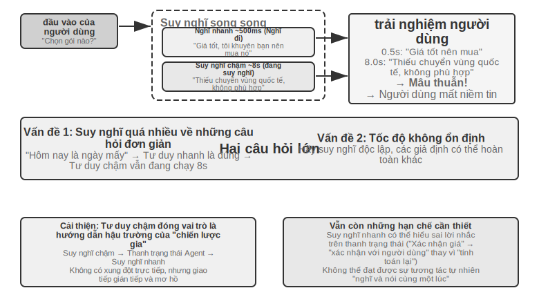


**Vấn đề 1: Suy nghĩ quá nhiều về những câu hỏi đơn giản**. Người dùng hỏi "Hôm nay là ngày gì?" Tư duy nhanh đã trả lời chính xác "Thứ Tư" trong vòng 500 mili giây, nhưng Tư duy chậm vẫn chạy đủ 10 giây suy nghĩ trước khi lặp lại "Thứ Tư". Điều này không chỉ lãng phí tài nguyên máy tính mà còn phá hủy nghiêm trọng nhịp điệu của cuộc trò chuyện - người dùng đã nhận được câu trả lời và sẵn sàng nói về chủ đề tiếp theo, nhưng bị gián đoạn bởi một câu trả lời lặp đi lặp lại. **Vấn đề 2: Tốc độ không nhất quán**. Cả hai làm việc độc lập và song song. Mặc dù họ nhìn thấy cùng một ngữ cảnh nhưng đường lối suy nghĩ của họ có thể hoàn toàn khác nhau - tư duy nhanh đưa ra câu trả lời sơ bộ dựa trên một giả định nào đó, nhưng tư duy chậm lại nhận thấy giả định đó không có giá trị và đưa ra kết luận ngược lại. Người dùng nghe thấy những câu trả lời trái ngược nhau trong vòng vài giây và niềm tin của họ ngay lập tức sụp đổ. Nguyên nhân cơ bản là kế hoạch chia đối thoại thành hai quá trình tư duy độc lập thay vì một hoạt động nhận thức mạch lạc, thiếu cơ chế phối hợp giữa tốc độ và chậm.

```
<user>Gói này có phù hợp với tôi không?</user>
<!-- Suy nghĩ nhanh sau 0,5 giây -->
<trợ lý (suy nghĩ nhanh)>Giá gói này rất tốt, khuyên bạn nên mua. </trợ lý>
<user>Được rồi, vậy tôi...</user>
<!-- Suy nghĩ chậm sẽ hoàn thành sau 8 giây -->
<trợ lý (suy nghĩ chậm)>Chờ một chút, tôi thấy gói này thiếu tính năng chuyển vùng quốc tế mà bạn cần và có thể không phù hợp. </trợ lý>
<user>(Tức giận) Bạn có khuyên tôi nên mua nó hay không?!</user>
```

### Phương án 2: Nghĩ nhanh để tương tác, nghĩ chậm để nhắc nhở

Tùy chọn 2 cho phép Tư duy chậm xem đầu ra của Tư duy nhanh và đưa ra đề xuất cho Tư duy nhanh thông qua thanh trạng thái Agent (cơ chế tiêm siêu thông tin động được giới thiệu trong Chương 2) thay vì nói trực tiếp với người dùng. So với giải pháp đầu tiên, có hai cải tiến: Tư duy chậm chạy không đồng bộ trong nền, tận dụng khoảng trống giữa các cuộc hội thoại để tiếp tục suy nghĩ; Bởi vì bạn có thể nhìn thấy đầu ra của Tư duy nhanh nên sẽ không có xung đột trực tiếp mà bạn sẽ rút lui vào hậu trường để đóng vai trò là một “chiến lược gia”. Đoàn GPT-Live nói trên và giọng nói Pine AI Agent đều là ví dụ về giải pháp hai trong sản xuất - mô hình lý luận nền truyền kết luận trở lại mô hình tương tác giao diện người dùng thông qua kênh văn bản được sắp xếp hợp lý và giao diện người dùng sẽ quyết định thời điểm và cách diễn đạt để nói chuyện với người dùng.

Nhưng giải pháp này vẫn còn những hạn chế cơ bản. **Suy nghĩ nhanh có thể không tuân theo hướng dẫn** - Giao tiếp giữa hai trường hợp suy nghĩ độc lập là gián tiếp và mơ hồ. Sau khi nhận được thanh trạng thái Agent, Kuaisi Thought có thể đã hiểu nhầm. Ví dụ: nó hiểu sai "giá cần được xác nhận lại" thành "hỏi người dùng xem họ có thể chấp nhận giá không" thay vì "giá sai và cần phải tính toán lại". **Không thể biết được kết quả tư duy trung gian** - Tư duy chậm đã tạo ra một lượng lớn kết luận trung gian có giá trị trong 10 giây suy nghĩ. Suy nghĩ nhanh hoàn toàn không thể nhìn thấy chúng và chỉ có thể đợi thanh trạng thái Agent cuối cùng. Nếu người dùng hỏi một câu hỏi khác hoặc ngắt lời trước khi Tư duy chậm hoàn thành, Tư duy nhanh chỉ có thể dựa vào hiểu biết hạn hẹp của mình để trả lời. Giống như hai người cùng nhau giải quyết một vấn đề nhưng chỉ có thể giao tiếp bằng cách chuyển những ghi chú và không thể nhìn thấy giấy nháp của nhau.

Phương án 2 cũng gặp phải một vấn đề cơ bản về mặt lý thuyết: **không thể đạt được “nghĩ và nói cùng một lúc”**. Khi con người đối mặt với những vấn đề phức tạp, họ không nghĩ ra một câu trả lời hoàn chỉnh trong đầu rồi nói ra ngay lập tức. Thay vào đó, họ nghĩ về nó từng đoạn một - "Câu hỏi này rất thú vị... (tạm dừng và suy nghĩ) trước tiên chúng ta cần xem xét... (tiếp tục suy nghĩ) thứ hai...". Tư duy nhanh ở phương án thứ hai chỉ có thể lấp chỗ trống và chờ tư duy chậm tạo ra kết quả, và quá trình tư duy không thể xen kẽ một cách tự nhiên trong cuộc trò chuyện.

### Phương án 3: Thống nhất tư duy và cách diễn đạt từ đầu đến cuối (lấy Step-Audio R1 làm ví dụ)

Mặc dù phương án thứ hai giải quyết được vấn đề chờ đợi của tư duy chậm nhưng về mặt cấu trúc vẫn là “nghĩ trước nói sau” - suy nghĩ và biểu hiện vẫn là hai quá trình riêng biệt, không thể vừa suy nghĩ vừa nói như con người. Để vượt qua hạn chế cơ bản này, khả năng tư duy cần được đưa trực tiếp vào mô hình.

Step-Audio R1 đề xuất một giải pháp khác biệt cơ bản theo hướng này: trực tiếp nội hóa khả năng tư duy vào mô hình ngôn ngữ âm thanh đầu cuối và đạt được khả năng "suy nghĩ và nói" thực sự thông qua kiến trúc bộ não kép. Trên thực tế, nó bao gồm hai cơ chế bổ sung, giải quyết hai vấn đề khác nhau tương ứng: **Chưng cất tư duy neo theo phương thức (MGRD)** trước tiên giải quyết "liệu suy nghĩ đó có đúng hay không" - cho phép mô hình suy nghĩ thực sự dựa trên các đặc điểm âm thanh thay vì phiên âm văn bản; **Kiến trúc bộ não kép MPS** sau đó giải quyết vấn đề "không thể nói kịp thời" - cho phép suy nghĩ và biểu đạt diễn ra song song, đạt được khả năng suy nghĩ và nói có độ trễ thấp. Cái trước là tiền đề của cái sau: chỉ khi bản thân suy nghĩ bắt nguồn từ âm thanh, và vừa nói vừa suy nghĩ mới thực sự có giá trị. Mở rộng bên dưới.

**Câu hỏi về suy nghĩ của tác nhân văn bản**. Lý tưởng nhất là các mô hình giọng nói nên phân tích trực tiếp các đặc điểm giọng nói (chẳng hạn như cao độ, nhịp điệu, ngữ điệu) để hiểu được cảm xúc hoặc ý định của người nói. Nhưng trên thực tế, nhiều mô hình đi tắt: có hiện tượng phản trực giác trong các mô hình ngôn ngữ âm thanh hiện có. Chuỗi suy nghĩ càng dài thì hiệu suất càng kém. Nhóm Step-Audio R1 nhận thấy nguyên nhân sâu xa là "Lý luận thay thế văn bản" (nghĩa là sử dụng thông tin văn bản để "thay thế" thông tin âm thanh để phân tích): Khi mô hình đang "suy nghĩ", nó thực sự đang suy nghĩ ở cấp độ ngữ nghĩa dựa trên phiên âm văn bản, thay vì thực sự phân tích các đặc điểm âm thanh. Ví dụ: khi mô hình được yêu cầu xác định tâm trạng của một bài hát, nó sẽ phân tích "lời bài hát đề cập đến nỗi buồn" thay vì "giai điệu thứ cộng với đường viền cao độ giảm dần truyền tải cảm giác buồn". Sự sai lệch về phương thức này bắt nguồn từ dữ liệu huấn luyện: dữ liệu CoT (Chain-of-Thought, chuỗi suy nghĩ) của hầu hết các mô hình âm thanh được tạo bởi các mô hình văn bản và kế thừa một cách tự nhiên chế độ suy nghĩ của văn bản thuần túy.

**Chưng cất tư duy neo theo phương thức**(MGRD, Modality-Grounded Chưng cất lý luận) giải quyết vấn đề này thông qua quá trình tự cải thiện lặp đi lặp lại (Hình 9-6). Mặc dù cái tên rất hay nhưng ý tưởng cốt lõi thực sự rất trực quan: lọc ra quá trình tư duy "thực sự nghe âm thanh", sử dụng chúng để huấn luyện mô hình và để mô hình học cách phân tích bằng tai như một giáo viên dạy nhạc, thay vì chỉ nhìn vào lời bài hát như một trình soạn thảo văn bản. Cụ thể chia làm 3 bước:

1. Hãy để mô hình hiện tại tạo ra nhiều quy trình suy nghĩ khác nhau cho cùng một đoạn âm thanh, sau đó lọc ra những quy trình thực sự dựa trên các đặc điểm âm thanh. Làm thế nào để lọc? Xem có thông số âm thanh cụ thể nào được đề cập trong nội dung tư duy không. Ví dụ: đối với đầu vào bằng giọng nói tức giận, suy nghĩ dựa trên văn bản là "người dùng đã nói những từ tiêu cực như 'quá tệ' nên phán đoán là tức giận" - đây chỉ là phân tích nội dung văn bản; trong khi tư duy dựa trên tính năng âm thanh là "tốc độ nói nhanh hơn 40% so với bình thường, âm lượng tăng lên đáng kể và âm sắc sắc nét hơn" - đây thực sự là "lắng nghe" âm thanh. MGRD lọc cái sau
2. Sử dụng dữ liệu tư duy chất lượng cao này để đào tạo lại mô hình và tăng cường khả năng "nghĩ bằng tai"
3. Tối ưu hóa hơn nữa thông qua học tăng cường để ngăn mô hình lười biếng và bỏ qua suy nghĩ để đoán trực tiếp câu trả lời.

Sau nhiều lần lặp lại, cơ sở suy nghĩ dần dần chuyển từ trừu tượng văn bản sang phân tích âm thanh - mô hình bắt đầu tập trung vào "đường viền cao độ giảm mạnh ở mức 1,2 giây" thay vì nói chung là "người nói có vẻ không hài lòng".

**Kiến trúc bộ não kép MPS**(Mind-Paced Talking, dịch theo nghĩa đen là "nói theo nhịp điệu suy nghĩ") giải quyết mâu thuẫn về độ trễ giữa suy nghĩ và đầu ra lời nói (Hình 9-6). Nó được lấy cảm hứng từ sự phân công lao động trong não người: vùng chịu trách nhiệm suy nghĩ và vùng chịu trách nhiệm tổ chức ngôn ngữ tách biệt và có thể hoạt động song song - trong khi bạn đang nghĩ về câu tiếp theo, miệng bạn vẫn đang nói câu trước đó. MPS sử dụng hai mô hình để mô phỏng sự phân công lao động này: **Bộ não hình thành** chịu trách nhiệm suy nghĩ liên tục và tạo ra các kết quả tư duy; **Bộ não biểu hiện**(Bộ não phát âm) nhận được một phần kết quả suy nghĩ mới, kết hợp suy nghĩ trước đó với các câu trả lời hiện có và chuyển nó thành một câu trả lời bằng giọng nói.

Cả hai hoạt động song song - bộ não sáng tạo không cần phải suy nghĩ thấu đáo mọi thứ trước khi bộ não biểu cảm bắt đầu nói. Ví dụ: tại thời điểm t=0ms, bộ não hình thành ý tưởng bắt đầu phân tích câu hỏi của người dùng và đưa ra kết quả suy nghĩ đầu tiên (chuỗi mã thông báo văn bản) tại thời điểm t=200ms; sau khi bộ não biểu hiện nhận được kết quả này ở tốc độ t=200 mili giây, nó kết hợp ngữ cảnh trả lời được tạo và bắt đầu xuất mã thông báo giọng nói tương ứng ở tốc độ t=350 mili giây. Hai mô-đun hoạt động song song theo kiểu đường ống và người dùng có thể nghe thấy âm tiết đầu tiên ở thời điểm t=350ms.


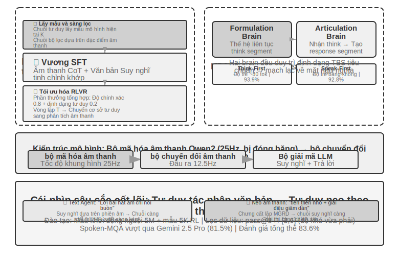


> **Thử nghiệm 9-4 ★★★: Triển khai tư duy giọng nói toàn diện bằng Step-Audio R1**
>
> Thử nghiệm này sử dụng mô hình Step-Audio R1 để so sánh hiệu suất của các cấu hình khác nhau trong các nhiệm vụ đối thoại và tư duy lời nói. Step-Audio R1 bao gồm bộ mã hóa âm thanh, bộ chuyển đổi âm thanh và bộ giải mã Qwen2.5 32B và yêu cầu triển khai GPU nhiều thẻ.
>
> Thử nghiệm này được đánh giá dựa trên hai nhiệm vụ: **Spoken-MQA**(câu hỏi toán học lời nói) kiểm tra xem liệu mô hình có thể thực hiện lý luận toán học nhiều bước sau khi nghe các câu hỏi nói hay không; **URO-Bench**(chuẩn mực đối thoại bằng tiếng Trung) kiểm tra chất lượng của đối thoại mở.
>
> Cấu hình thử nghiệm được chia thành hai chiều. Đầu tiên là **thời gian suy nghĩ**: **TBS** hoàn chỉnh (Think-Before-Speak, hãy suy nghĩ trước khi nói, làm cơ sở kiểm soát không có ràng buộc về độ trễ) trước tiên sẽ tạo ra tất cả suy nghĩ trước khi nói; Để giảm độ trễ, MPS cung cấp hai biến thể "suy nghĩ trong khi nói" - **Speak-First**(còn được gọi là spkfirst, không có độ trễ, nói và suy nghĩ bắt đầu cùng lúc) và **Think-First**(còn được gọi là thkfirst, đợi cho đến khi đoạn đầu tiên của não suy nghĩ được tạo ra trước khi nói, độ trễ là khoảng 80 mã thông báo). Thứ hai là **kiến trúc**: MPS song song não kép so với TBS mô hình đơn truyền thống.
>
> Kết quả được thể hiện trong Bảng 9-1, được sử dụng để so sánh hiệu suất của các cấu hình kiến trúc và thời gian suy nghĩ khác nhau về độ chính xác toán học và điểm đối thoại.
>
> Bảng 9-1 So sánh các cấu hình tư duy giọng nói khác nhau của Step-Audio R1
>
> | Cấu hình | Spoken-MQA | URO-Bench |
> |------|-----------|-----------|
> | Trả lời trực tiếp không cần suy nghĩ (cơ bản) | 70,6% | 77,4 |
> | MPS Speak-First (Độ trễ bằng 0) | 92,8% | 82,5 |
> | MPS Think-First (độ trễ ~ 80 tok) | 93,9% | 84,8 |
> | TBS đầy đủ (không có giới hạn về độ trễ) | 93,0% | — |
>
> Một phát hiện thú vị: Speak-First có tác động tối thiểu đến nhiệm vụ tư duy (92,8%, gần 93,0% đối với TBS đầy đủ). Nguyên nhân là do phần mở đầu của **CoT**(Chain-of-Thought, chuỗi tư duy) thường chỉ là phát biểu lại nội dung bài toán, chưa đi vào lý luận thực sự. Vì vậy, ngay cả khi mô hình bắt đầu suy nghĩ cùng lúc ngay khi mở ra thì độ chính xác cuối cùng sẽ khó bị mất đi. Một chi tiết đáng chú ý khác là: Think-First (93,9%) thậm chí còn cao hơn một chút so với TBS hoàn chỉnh không có giới hạn độ trễ (93,0%). Một lời giải thích có thể là tư duy được hình thành theo từng phân đoạn và được chuyển thành các biểu hiện theo từng phân đoạn, đóng vai trò tích cực tương tự như giám sát từng bước; tất nhiên, sự khác biệt giữa hai điều này cũng nằm trong phạm vi lỗi đánh giá và không nên diễn giải quá mức.
>

Phương án thứ ba “nội hóa” tư duy thành một mô hình duy nhất, đạt được “tư duy và nói” một cách tao nhã nhất, nhưng cái giá phải trả là “mục tiêu di động” được đề cập ở đầu phần này: mô hình này phải vừa là nhà lý luận mạnh nhất, vừa là người nói theo thời gian thực, cả hai khả năng đều đang phát triển nhanh chóng và lộ trình thống nhất phải được đào tạo lại nhiều lần để theo kịp. Điều này cũng giải thích sự phân chia ngành tại thời điểm viết bài - các sản phẩm tiên tiến (GPT-Live, Grok Voice, Pine AI) theo đuổi "khả năng chuyển sang bộ não mới nhất bất cứ lúc nào" chủ yếu tập trung vào lộ trình tách rời của tùy chọn hai, trong khi tùy chọn ba phù hợp hơn cho các tình huống theo đuổi sự tự nhiên tột độ và sẵn sàng chịu chi phí đào tạo chuyên môn. Cả hai không phải là cái này thay thế cái kia, mà là sự đánh đổi giữa "bộ não có thể thay thế" và "suy nghĩ và nói chặt chẽ hơn cùng một lúc".

### Giao diện giữa nhanh và chậm: ngoài văn bản còn có thể truyền được gì nữa

(Mẹo: Đây là cuộc thảo luận có giao diện đa kịch bản, tạm thời rời khỏi dòng chính.) Nhìn lại Kế hoạch 2, bạn sẽ thấy một khía cạnh thiết kế bị bỏ qua: Tư duy chậm "chuyển từ" sang Tư duy nhanh, sử dụng kênh **văn bản**(chuyển gợi ý qua thanh trạng thái). Văn bản dễ hiểu và dễ gỡ lỗi, nhưng nó là cọng rơm mỏng manh cho việc chậm rãi suy nghĩ về những gì trong đầu tôi - trạng thái trung gian thực sự phong phú, được nén lại trong một vài câu. Vì vậy, liệu ranh giới giữa tốc độ và sự chậm chạp này có thể không sử dụng từ ngữ?

Trong các trò chơi thời gian thực, vốn là những kịch bản đòi hỏi nhịp điệu cao nhất, con đường này khả thi (có thể gọi là cầu nối tiềm ẩn) [^ch9-8]: Để một mô hình nhỏ chịu trách nhiệm phản ứng nhanh (hơn một chục hành động mỗi giây) và một mô hình chậm chịu trách nhiệm lý luận (suy nghĩ một lần mỗi giây) bị đóng băng, chỉ đào tạo một "cầu nối" nhỏ với hàng chục triệu tham số giữa chúng và trực tiếp chiếu các kết luận lớp ẩn của mô hình chậm thành một số mô hình "tiềm ẩn". "Mã thông báo" được đánh vần vào đầu vào của mô hình nhanh giống như một mô hình đa phương thức cắm mã thông báo trực quan vào đó - bỏ qua hành trình vòng quanh "ý tưởng → văn bản → sau đó hiểu". Kết quả là, trên nhiều trò chơi Atari, kênh không gian tiềm ẩn này cao hơn nhiều so với kênh văn bản truyền thống (một số trò chơi từ +26% đến +82%) và mỗi bước chỉ mất thêm khoảng 5 mili giây, vẫn theo kịp nhịp thời gian thực.

Nó cũng đưa ra một ranh giới trung thực: **Việc cộng tác nhanh và chậm có hữu ích hay không tùy thuộc vào nút thắt của nhiệm vụ là "bạn muốn hay không" hay "không đủ thời gian để phản ứng"** - cầu nối này chỉ có thể hữu ích khi suy nghĩ chậm vốn đã tốt hơn phản ứng nhanh (mối tương quan này cao tới r≈0,9 trên các trò chơi); ngược lại, nếu nhiệm vụ chỉ thuần túy về tốc độ phản ứng thì cầu có tốt đến đâu cũng không giúp ích được gì. Nhận định này không chỉ đúng với trò chơi, nó còn dự đoán vấn đề tương tự mà Computer Use sẽ gặp phải ở phần sau của chương này: khi nào nên thuê một "chiến lược gia chậm chạp" và khi nào thì chỉ cần thêm sự chậm trễ.

[^ch9-8]: Phân tích đầy đủ về việc chỉ đào tạo cầu nối không gian tiềm ẩn giữa hai mô hình bị đóng băng và "khi nào nên thuê một nhà tư vấn chậm". *Cầu nối tiềm ẩn: Kênh Slow-Fast liên tục dành cho trò chơi Real-Time Agents.* arXiv:2606.24470, 2026.

Cho dù là end-to-end hay mô-đun, chất lượng tương ứng của các lớp nhận thức và thực thi vẫn rất quan trọng. Mô hình đầu cuối giải quyết vấn đề độ trễ ở cấp độ kiến trúc, nhưng hai chức năng cơ bản là "nghe chính xác" và "nói như" sẽ không được giải quyết tự động do những thay đổi trong kiến trúc. Nhận thức truyền phát giọng nói tương ứng với "nghe chính xác" đã được thảo luận trong Mô hình 1. Ở đây chúng ta xem xét lớp thực thi "nói như": tổng hợp giọng nói giống con người hơn.

## Tổng hợp giọng nói giống con người hơn

Sự "hoàn hảo" của TTS truyền thống chính là vấn đề: quá mượt, không có điểm dừng và không có từ đệm khiến người ta biết rằng đó là một cỗ máy. Những “điểm không hoàn hảo” đó trong lời nói của con người không phải là những sai sót—những khoảng dừng, những từ lấp chỗ trống (“ừm,” “uh,” “cái đó”), sự lặp lại không thường xuyên—mà là những biểu hiện tự nhiên của quá trình suy nghĩ, gửi những tín hiệu quan trọng đến người nghe chẳng hạn như “Tôi đang nghĩ,” “Tôi không chắc,” v.v. Tuy nhiên, tốc độ tư duy của AI nhanh hơn nhiều so với phát lại giọng nói và đầu ra mượt mà và đầy đủ một cách tự nhiên. Tổng hợp trực tiếp sẽ tiết lộ danh tính của máy.

**Giải pháp**: Trao quyền quyết định "tạm dừng ở đâu và sử dụng âm nào" cho LLM chính. LLM không chỉ xuất ra văn bản mà còn xuất ra các thẻ điều khiển: `[THINKING]` có nghĩa là chèn 1-2 giây tạm dừng suy nghĩ và âm thanh phụ ("um..."); `[SEARCHING]` tạo ra các khoảng dừng ngắn hơn và tìm kiếm các từ bổ sung ("that..." "cách nói"); `[EMO:happy]`, v.v. để điều chỉnh âm sắc và nhịp điệu; `[SPEED:0.8x]` kiểm soát tốc độ nói. Chỉ LLM mới biết liệu bạn có cần tạm dừng để trả lời một câu hỏi phức tạp hay không, liệu người dùng có thiếu kiên nhẫn và nên nói nhanh hơn hay liệu cuộc trò chuyện có nên sôi nổi hơn hay không.

TTS đóng vai trò là bộ tạo đa phương thức trong giải pháp này, nhập văn bản + thẻ điều khiển và xuất âm thanh. Khi gặp văn bản thông thường, nó sẽ tổng hợp giọng nói một cách bình thường và khi gặp dấu điều khiển, nó sẽ tạo ra âm thanh phi ngôn ngữ tương ứng: `[THINKING]` tạo ra tiếng kéo dài "ừm...", `[SIGH]` tạo ra tiếng thở dài, `[LAUGH:small]` tạo ra tiếng cười khúc khích và `[BREATH]` tạo ra tiếng hít vào.

Có hai cách triển khai: một là tự phát triển các thẻ điều khiển hỗ trợ TTS (độ linh hoạt cao nhất nhưng cần có đội ngũ chuyên nghiệp); cách thứ hai là sử dụng nhân bản giọng nói để chuẩn bị hàng tá giọng nói tham chiếu với những cảm xúc, tốc độ nói và phong cách khác nhau cho cùng một người ảo và chọn giọng nói tham chiếu phù hợp nhất theo thẻ điều khiển để gọi TTS API (chẳng hạn như ElevenLabs, Fish Audio) và quá trình triển khai có thể hoàn tất trong vòng vài tuần.

> **9-5 thử nghiệm ★★: Trình điều khiển điểm đánh dấu điều khiển dựa trên âm thanh cá TTS**
>
> Sử dụng khả năng sao chép âm thanh của Fish Audio S1 (chỉ mất 3-10 giây lời nói tham chiếu để sao chép cùng một âm thanh không có mẫu). Xây dựng 24 thư viện giọng nói tham khảo, bao gồm các cảm xúc (trung tính/vui vẻ/thất vọng/suy nghĩ) x tốc độ nói (bình thường/nhanh/chậm) x phong cách (trang trọng/thư giãn), mỗi thư viện khoảng 5 giây.
>
> LLM Ví dụ đầu ra: `[EMO:hạnh phúc][TỐC ĐỘ:nhanh]Tuyệt vời! Đơn đặt hàng của bạn đã được xác nhận. [SUY NGHĨ] Thôi để mình kiểm tra thời gian vận chuyển...[EMO:trung tính][TỐC ĐỘ:bình thường] Dự kiến chiều mai sẽ giao hàng. `
>
> Lớp thực thi phân tích các thẻ và ánh xạ chúng tới các giọng tham chiếu tương ứng: `[EMO:happy][SPEED:fast]` tương ứng với giọng tham chiếu "vui vẻ + nhanh + thoải mái", `[THINKING]` tương ứng với giọng tham chiếu "suy nghĩ + chậm + trang trọng" (có nhịp tạm dừng và giọng do dự), `[EMO:neutral][SPEED:normal]` tương ứng với giọng tham chiếu "trung tính + bình thường + trang trọng". Fish Audio sẽ đảm bảo rằng âm sắc của các giọng tham chiếu khác nhau là nhất quán, chỉ có những thay đổi về nhịp điệu và cảm xúc.
>
> So sánh ba cấu hình: không có dấu kiểm soát (mượt mà nhưng máy móc, thoạt nhìn có vẻ giống AI), giọng tham chiếu đơn (tự nhiên nhưng đơn điệu về mặt cảm xúc) và nhiều thư viện giọng nói tham chiếu (vui vẻ và nhanh chóng khi xác nhận thông tin, có khoảng dừng tự nhiên trước khi giải thích và biểu cảm tổng thể gần với biểu hiện của một dịch vụ khách hàng thực sự).

## Computer Use: GUI Tự động hóa Agent

Khi đọc điều này, bạn có thể nhận thấy rằng chương này dành nhiều không gian cho giọng nói hơn đáng kể so với hai cảnh cuối - điều này là có chủ ý. Trên tiến trình phát triển của đa phương thức thời gian thực, giọng nói là thứ hoàn thiện nhất và đáng được sử dụng làm hệ thống tham chiếu nhất: bắt đầu từ vấn đề "độ trễ đường ống nối tiếp quá cao", thông qua một loạt các giải pháp như end-to-end, full-duplex, suy nghĩ và nói chuyện, v.v., cho đến phần cuối tương đối hình thành ngày nay, toàn bộ quá trình của vấn đề → giải pháp → kết thúc đã được hoàn thành. Vì vậy, hãy giải thích nó kỹ lưỡng. Hai cảnh tiếp theo của Computer Use và robot có thể được xem trong ngữ cảnh giọng nói - chúng đã đạt đến giai đoạn nào của đường tiến hóa này và chúng đang bị mắc kẹt ở đâu.

Ba kịch bản này có vẻ khác nhau nhưng chúng phải đối mặt với những thách thức cốt lõi giống nhau: nhận thức theo thời gian thực, ra quyết định có độ trễ thấp và tương tác liên tục. Hãy xem cách các chủ đề kỹ thuật này được tái tạo trong tương tác trực quan (Computer Use) và tương tác vật lý (robot) – trước tiên bằng cách mở rộng góc nhìn từ phương thức thính giác sang phương thức thị giác: Điều gì sẽ xảy ra nếu Agent không chỉ hiểu được lời nói mà còn có thể “đọc” màn hình và vận hành giao diện đồ họa?

Computer Use (còn gọi là GUI Automation Agent) cho phép AI sử dụng phần mềm giống con người bằng cách quan sát màn hình và thao tác chuột, bàn phím - chẳng hạn như mở trình duyệt để tìm kiếm thông tin, điền dữ liệu vào phần mềm bảng tính hoặc điều chỉnh cấu hình trong cài đặt hệ thống. Cốt lõi của nó là một chu trình nhận thức-suy nghĩ-hành động (Hình 9-7):

1. Agent chụp ảnh màn hình hiện tại
2. Mô hình đa phương thức nhận ảnh chụp màn hình và hướng dẫn nhiệm vụ, đồng thời đưa ra suy nghĩ và hành động cụ thể.
3. Lớp thực thi thực hiện hành động trong môi trường thực (di chuyển chuột, nhấp chuột, nhập văn bản, v.v.)
4. Đợi giao diện phản hồi rồi chụp ảnh màn hình lại để vào chu kỳ tiếp theo.


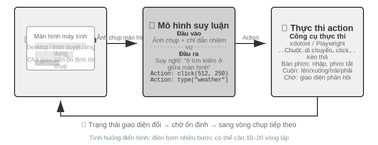


Có ba chiều thiết kế chính trong chu trình này: **không gian hành động**(những thao tác mà Agent có thể thực hiện), **định vị trực quan**(cách tìm phần tử mục tiêu trong ảnh chụp màn hình) và **kiến trúc mô hình**(cách tạo hành động chính xác từ ảnh chụp màn hình).

### Thiết kế không gian hành động

Anthropic xác định ba loại công cụ để hình thành khả năng tương tác hoàn chỉnh (Hình 9-8):


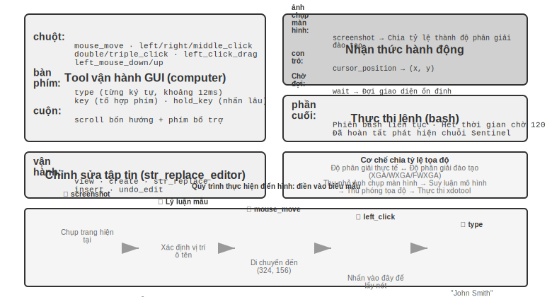


**GUI Operation Tool**(công cụ máy tính): Thao tác chuột bao gồm di chuyển (mouse_move), nhấp chuột trái/phải/giữa, nhấp đúp/ba lần, kéo (left_click_drag) và nhấn/nhả chi tiết hơn (left_mouse_down/up). Cuộn hỗ trợ bốn hướng và có thể được sử dụng với các phím bổ trợ. Thao tác trên bàn phím bao gồm nhập từng từ (loại, mỗi ký tự cách nhau 12 mili giây để mô phỏng thao tác gõ thực), tổ hợp phím (phím, chẳng hạn như Ctrl+C) và nhấn và giữ (hold_key). Các hành động được nhận biết: ảnh chụp màn hình (ảnh chụp màn hình), lấy vị trí con trỏ (cursor_position), chờ (wait).

**Công cụ thực thi lệnh**(công cụ bash): Cung cấp phiên cuối bash liên tục, thời gian chờ 120 giây, phát hiện xem lệnh có được thực thi thông qua chuỗi trọng điểm hay không và duy trì trạng thái môi trường giữa nhiều lệnh gọi (ví dụ: sau khi cd vào một thư mục, lệnh gọi tiếp theo sẽ vẫn ở trong thư mục đó).

**Công cụ chỉnh sửa tệp**(str_replace_editor): Chỉnh sửa an toàn đạt được thông qua khớp chuỗi. Nó hỗ trợ các hoạt động xem, tạo, thay thế, chèn và hoàn tác. Nó chính xác hơn việc ghi đè trực tiếp toàn bộ tập tin và ít có khả năng vô tình làm thay đổi nội dung khác.

> **Thử nghiệm 9-6 ★: Chạy bản demo Anthropic Computer Use**
>
> Bộ chứa đóng gói một môi trường máy tính để bàn Ubuntu hoàn chỉnh (bao gồm các công cụ phổ biến như trình duyệt và thiết bị đầu cuối). Giao diện người dùng nhận hướng dẫn tác vụ, giao diện sau gửi hướng dẫn và ảnh chụp màn hình tới Claude, mô hình trả về hướng dẫn thao tác (di chuyển chuột, nhấp chuột, nhập văn bản, v.v.) và lớp thực thi được thực thi trong màn hình ảo.
>
> Quan sát chính: Khoảng thời gian giữa mỗi hành động là 2-5 giây (chậm hơn đáng kể so với con người), nhưng nó cho thấy khả năng lập kế hoạch tốt cho các nhiệm vụ thông thường và có thể tự động chia nhỏ thành các chuỗi hoạt động hợp lý.
>

### Định vị trực quan (Nối đất)

Trong mỗi vòng lặp, mô hình cần xác định chính xác phần tử mục tiêu trong ảnh chụp màn hình - "Hộp tìm kiếm ở đâu?" "Tọa độ của nút gửi là gì?" Đây là vấn đề định vị trực quan (Nối đất). Hiện tại có hai ý tưởng chính: một là biến định vị thành câu hỏi trắc nghiệm - đầu tiên đánh dấu các thành phần giao diện bằng số và mô hình chỉ cần chọn một trong số đó; cái còn lại là **dự đoán tọa độ thuần túy** - để mô hình trực tiếp "nhìn" vào ảnh chụp màn hình và báo cáo tọa độ như con người. Có hai cách để triển khai ý tưởng câu hỏi trắc nghiệm: **Chú thích trực quan thuần tuý**(Set-of-Mark gốc, sử dụng mô hình phân đoạn để cắt bỏ các vùng ứng cử viên trên pixel) và **Chỉ mục thành phần cấu trúc**(Cây DOM/Accessibility, đọc trực tiếp cấu trúc đi kèm với giao diện). Ưu điểm chung của ý tưởng câu hỏi trắc nghiệm là chuyển đổi câu hỏi mở "tìm nút trong ảnh chụp màn hình và dự đoán tọa độ" thành câu hỏi đóng "chọn một trong các yếu tố được đánh dấu" - giống như các câu hỏi trắc nghiệm trong bài thi dễ trả lời chính xác hơn các câu hỏi điền vào chỗ trống. Người mẫu chỉ cần nói "nhấp [123]" thay vì "nhấp vào nút màu xanh lam cách khoảng 200 pixel ở bên phải góc trên bên trái của màn hình."

**Set-of-Mark: Phương pháp chú thích trực quan.**

Set-of-Mark (SoM) ban đầu được Microsoft Research đề xuất vào năm 2023, ban đầu nhằm phát huy khả năng định vị trực quan của GPT-4V. Đây là một phương pháp **hoàn toàn trực quan**: sử dụng mô hình phân đoạn hình ảnh (SAM, SEEM, v.v.) để tự động cắt các vùng ứng cử viên trên ảnh chụp màn hình và chồng các điểm đánh dấu được đánh số lên từng vùng. Những gì mô hình nhìn thấy là một hình ảnh được đánh số, chỉ cần báo số, hệ thống sẽ chuyển đổi thành tọa độ trung tâm của khu vực tương ứng. Toàn bộ quá trình không yêu cầu DOM hoặc bất kỳ cấu trúc giao diện nội bộ nào, do đó, giao diện trò chơi và phần mềm máy tính để bàn gốc cũng có thể được áp dụng - miễn là mô hình phân khúc có thể loại bỏ các khu vực ứng cử viên.

**Chỉ mục phần tử có cấu trúc: Triển khai có cấu trúc các ý tưởng SoM trên Web.**

Chú thích có thể được thực hiện chính xác hơn khi chính giao diện cung cấp thông tin có cấu trúc. Các trang web hiện đại có cấu trúc thành phần hoàn chỉnh (cây DOM) và các vai trò ngữ nghĩa (là nút, là hộp nhập liệu) được xác định trước khi hiển thị. Cây trợ năng cung cấp thông tin tương tự cho nhiều ứng dụng trên máy tính để bàn. Thay vì yêu cầu mô hình phân đoạn đoán "nút là khu vực nào" trong pixel, tốt hơn là bạn nên hỏi trực tiếp chính giao diện "bạn có những yếu tố nào có thể nhấp vào được?". Giải pháp Web Agent do dự án browser-use đại diện thực hiện chính xác điều này: liệt kê và đánh số các phần tử tương tác từ DOM, có thể được coi là triển khai có cấu trúc các ý tưởng SoM trên Web (Hình 9-9). Quá trình này được chia thành bốn bước:

1. Lấy biểu diễn có cấu trúc (DOM tree) và thông tin truy cập của trang web thông qua giao diện gỡ lỗi trình duyệt (CDP, Chrome DevTools Protocol)
2. Tự động phát hiện những thành phần nào có thể tương tác (nút, hộp nhập liệu, liên kết, v.v.)
3. Gắn nhãn cho mỗi phần tử có thể tương tác bằng một ID duy nhất và vẽ hộp giới hạn trên ảnh chụp màn hình
4. Đồng thời, tạo ra một danh sách văn bản để mô tả các thành phần tương ứng với mỗi ID.

```
Ảnh chụp màn hình: [Các thành phần chính trong ảnh được đánh dấu bằng ID như [1], [2], [3], [4], v.v.]

Elements:
[1] <input type="text" placeholder="Search" aria-label="Search" />
[2] <button id="submit-btn" aria-label="Submit form" />
[3] <input type="text" placeholder="Enter your name" value="" />
[4] <a href="/docs" aria-label="Documentation" />
```

Mô hình chỉ cần xuất số ID và hệ thống sẽ tự động sử dụng tọa độ trung tâm của phần tử để thực hiện nhấp chuột. Loại giải pháp này không lưu mã thông báo (vì tất cả thông tin chú thích phải được gửi đến mô hình), nhưng định vị chính xác và ổn định, đồng thời tránh được các phát hiện bị bỏ sót và phát hiện sai có thể do mô hình phân đoạn đưa ra.


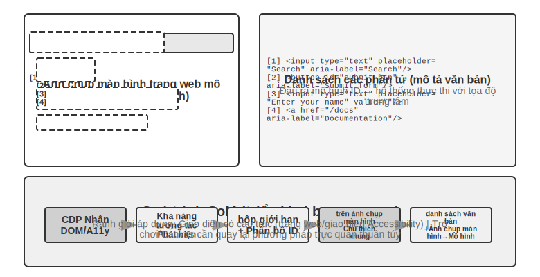

**Dự đoán tọa độ thuần túy.**

Tuyến thứ ba không thực hiện bất kỳ chú thích nào và trực tiếp cho phép mô hình xuất tọa độ. Lấy việc sử dụng **SeeClick** và Claude của máy tính làm ví dụ: đào tạo mô hình trực quan dựa trên dữ liệu được ghép nối của các ảnh chụp màn hình và vị trí phần tử GUI khổng lồ, đồng thời cho phép mô hình học cách ánh xạ các mô tả ngôn ngữ tự nhiên (chẳng hạn như "nhấp vào nút gửi") trực tiếp tới tọa độ chính xác trong ảnh chụp màn hình - giống như người dùng con người, hoàn toàn dựa vào "tìm kiếm" để tìm vị trí cần nhấp.

Trong sơ đồ dự đoán tọa độ, sự hiểu biết của mô hình về tọa độ phụ thuộc nhiều vào độ phân giải được sử dụng trong quá trình huấn luyện (Hình 9-10). Claude được đào tạo bằng XGA (1024x768), WXGA (1280x800) và FWXGA (1366x768). Nếu độ phân giải ảnh chụp màn hình đầu vào không khớp, tọa độ mà mô hình dự đoán sẽ được bù một cách có hệ thống - giống như đo khoảng cách trên bản đồ nhỏ và sau đó sử dụng trực tiếp trên bản đồ lớn. Do đó, cần triển khai cơ chế chia tỷ lệ tọa độ hai chiều trên lớp công cụ và chọn độ phân giải mục tiêu theo tỷ lệ khung hình để tránh kéo dài không đẳng cự làm biến dạng hình ảnh và làm sai lệch phán đoán tọa độ. Ví dụ: nếu độ phân giải màn hình thực là 2560×1440 (16:9), bạn nên chọn một trong ba mức được Claude hỗ trợ với tỷ lệ khung hình cũng gần 16:9 – FWXGA (1366×768) là phù hợp nhất. Khi chụp ảnh màn hình, hãy chia tỷ lệ màn hình thành 1366×768 và gửi cho người mẫu; sau khi mô hình xuất ra tọa độ nhấp chuột (683, 384), nó sẽ được ánh xạ ngược sang tọa độ thực (683×2560/1366, 384×1440/768) ≈ (1280, 720). Ngược lại, nếu bạn kéo căng mạnh 16:9 thành 4:3 1024×768, màn hình sẽ bị nén theo chiều ngang và tọa độ mà mô hình dự đoán sẽ bị dịch chuyển một cách có hệ thống.


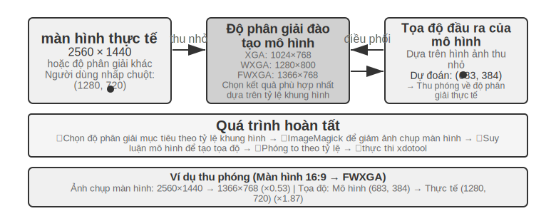


Logic lựa chọn của ba tuyến đường có thể được tóm tắt như sau: **Khi có sẵn thông tin có cấu trúc, chỉ mục Cây DOM/Accessibility** được sử dụng đầu tiên và vị trí là chính xác và ổn định nhất; **Khi không có sẵn**(phần mềm máy tính gốc như Photoshop, giao diện kết xuất Canvas/WebGL, trò chơi), **Bạn có thể sử dụng chú thích trực quan (tuyến SoM gốc) hoặc dự đoán tọa độ**. Chú thích trực quan biến việc định vị thành một câu hỏi trắc nghiệm, thân thiện hơn với các mô hình tổng quát chưa được đào tạo đặc biệt; dự đoán tọa độ loại bỏ bước chú thích và trực tiếp hơn đối với các mô hình đã trải qua khóa đào tạo định vị GUI. Vẫn còn khoảng cách về độ chính xác giữa hai yếu tố này trên các phần tử nhỏ và giao diện dày đặc.

> **Thử nghiệm 9-7 ★: Sử dụng browser-use để đạt được hoạt động trình duyệt tự động**
>
> Dựa trên khung tự động hóa trình duyệt Playwright (thư viện công cụ để điều khiển trình duyệt bằng mã), kết hợp với các mô hình lớn đa phương thức để đạt được các hoạt động trình duyệt dựa trên ngôn ngữ tự nhiên. Bật chế độ trực quan hóa SoM và lưu ảnh chụp màn hình kèm theo các hộp chú thích trước mỗi quyết định.
>
> Nhiệm vụ kiểm tra "Mở Google để truy vấn thời tiết ở San Francisco": Sau khi hệ thống khởi động, ảnh chụp màn hình hiển thị trang tìm kiếm Google. Tất cả các yếu tố tương tác được đánh dấu bằng hộp giới hạn màu đỏ và số ID (thanh địa chỉ `[1]`, hộp tìm kiếm `[2]`, nút tìm kiếm `[3]`, nút "Tôi cảm thấy may mắn" `[4]`, v.v.) → nhấp vào sau khi phân tích mô hình `[2]` (hộp tìm kiếm) → Sau khi hộp tìm kiếm lấy được tiêu điểm, hãy nhập "Thời tiết San Francisco hôm nay" → Nhấp vào `[3]` (nút tìm kiếm) → Trang chuyển đến kết quả tìm kiếm. Ảnh chụp màn hình mới đánh dấu các thành phần trong thẻ thời tiết. Mô hình nhận biết và trích xuất thông tin như nhiệt độ và điều kiện thời tiết. Toàn bộ quá trình gồm 5 bước và mất khoảng 20 giây để hoàn thành.

### Có thể xem hoạt hình và nghe âm thanh Computer Use Agent

Cho đến nay, nhận thức về Computer Use dựa trên một giả định ngầm: **Màn hình tĩnh**—chụp ảnh, suy nghĩ về một bước, nhấp chuột rồi chụp ảnh. Nhưng trên thực tế, màn hình sẽ phát video, các thông báo thoáng qua sẽ bật lên và giọng nói trong cuộc họp sẽ được phát. Agent, chỉ mở mắt sau mỗi 3–5 giây và hoàn toàn không có tai, không thể nhìn hay nghe thấy "những điều xảy ra giữa các khung hình" này. Xem các bản ghi màn hình, theo dõi các cuộc họp, nghe lời nhắc bằng giọng nói và xử lý các hộp thoại thoáng qua—toàn bộ danh mục hoạt động máy tính hàng ngày này gần như bị giới hạn đối với Computer Use Agent ngày nay.

Thứ thực sự cần được thiết kế lại ở đây không phải là "giao diện hành động", mà là " **giao diện quan sát**" [^ch9-9]. Ý tưởng cốt lõi là tách **quan sát**(liên tục, thích ứng, đa phương thức) khỏi **hành động**(rời rạc) và tạo một lớp phần mềm trung gian nhận thức (có thể gọi là Agent-Giao diện quan sát máy tính, AOI) được chèn giữa môi trường và bất kỳ mô hình Computer Use nào được tạo sẵn mà không cần đào tạo lại. Nó có ba thành phần "cổng theo yêu cầu": Đầu tiên, **Chụp khung hình chính giữa các khung** - đầu tiên sử dụng cổng pixel cực rẻ để bỏ qua hình ảnh gần như không thay đổi, sau đó sử dụng một mô hình nhỏ để xác định xem hình ảnh có những thay đổi có ý nghĩa hay không và chỉ chặn một khung hình khi có thay đổi, chi phí gần như bằng 0 đối với ảnh tĩnh; thứ hai, **Phiên âm giọng nói có kiểm soát âm lượng** - chỉ nhận dạng giọng nói khi có âm thanh, hãy để Agent Lần đầu tiên "mọc tai"; thứ ba, và quan trọng nhất, **tường thuật bức ảnh thành văn bản lâu dài** - hãy để mô hình mô tả khung hình đã chụp thành một câu ("Lời nhắc vừa xuất hiện cho biết ngày phát hành đã được thay đổi thành ngày 28 tháng 4") và **ngay cả khi hình ảnh gốc sau đó bị xóa khỏi ngữ cảnh, văn bản này vẫn còn trong bộ nhớ**, mang thông tin động xuống dưới dạng văn bản.

Một khám phá phản trực giác là điều thực sự quan trọng không phải là "nên chọn khung nào" mà là " **tường thuật các khung thành văn bản có thể được giữ lại trong thời gian dài**" - văn bản là phương thức mà LLM Agent xử lý tốt nhất. Trên tám mô hình từ quy mô 7B đến quy mô tiên tiến, lớp phần mềm trung gian này mang lại sự cải thiện từ +17 đến +48 điểm phần trăm mà không cần đào tạo lại. Trong số đó, khoảng cách là khác biệt nhất đối với các tác vụ lời nói: với việc bổ sung lớp nhận thức này, Agent có thể thực hiện tất cả các tác vụ lời nói mà ban đầu "nghe được nhưng không thể di chuyển". Nhưng không phải cấu hình cố định có thể chinh phục thế giới - trên một số mẫu máy mới hơn, việc nhồi quá nhiều mã thông báo hình ảnh sẽ lấn át khả năng lý luận và kéo giảm hiệu suất, vì vậy các thành phần này cần phải được chọn từng thành phần một theo mô hình, thay vì sử dụng tất cả cùng một lúc. Điều này giống như lựa chọn trước đây giữa Set-of-Mark và dự đoán tọa độ: không có viên đạn bạc trong sơ đồ nhận thức và nó phải được khớp theo đặc điểm của mô hình.

[^ch9-9]: Ba thành phần của khung hình chính, phiên âm theo yêu cầu và khung tường thuật thành văn bản cố định. Cơ chế hoàn chỉnh và sự cắt bỏ theo từng mô hình được tìm thấy ở Li, Bojie và Noah Shi. *Agent-Giao diện quan sát trên máy tính kích hoạt Computer Use động.* arXiv:2606.29472, 2026.

### Di động: Rào cản sinh thái còn khó hơn công nghệ

Computer Use cũng đang mở rộng sang thiết bị đầu cuối di động. Thực sự có sự khác biệt về mặt kỹ thuật giữa thiết bị đầu cuối di động và máy tính để bàn: không gian hành động thường không còn là "tọa độ chuột + bàn phím" mà truy cập vào dịch vụ trợ năng API của hệ thống (chẳng hạn như AccessibilityService của Android) để đọc các thành phần giao diện, thực hiện nhấp chuột và nhập văn bản; phương thức tương tác cũng thay đổi từ con trỏ chuột sang cử chỉ chạm và ngữ nghĩa của tọa độ thay đổi tương ứng - giống nhau (x, y) Cho dù đó là nhấp ngón tay, nhấn lâu hay điểm bắt đầu của cử chỉ trượt đều yêu cầu các loại cử chỉ bổ sung để xác định. Các điểm chuẩn dành cho thiết bị di động như AndroidWorld được giới thiệu trong Chương 6 được sử dụng để đánh giá khả năng của Agent trong việc hoàn thành các tác vụ Ứng dụng thực trong không gian hành động như vậy.

Nhưng điều thực sự cản trở thiết bị đầu cuối di động thường không phải là những khác biệt về mặt kỹ thuật mà là những rào cản về sinh thái. Một số nhà sản xuất điện thoại di động đã cố gắng tích hợp trợ lý AI vào điện thoại di động dành cho người tiêu dùng để cho phép chúng tự động vận hành các ứng dụng hàng ngày như WeChat, Taobao và Alipay, nhưng họ sớm gặp phải những hạn chế về nền tảng.

Điều này cho thấy một thách thức đặc biệt mà Computer Use phải đối mặt: **rào cản sinh thái**. Lý do cơ bản đằng sau lệnh cấm là xung đột mô hình kinh doanh. Logic kiếm tiền cốt lõi của các ứng dụng Internet truyền thống là **lưu lượng truy cập và sự chú ý**: người dùng xem quảng cáo khi duyệt các luồng thông tin, làm theo hướng dẫn của thuật toán đề xuất khi tìm kiếm sản phẩm và mua hàng tùy hứng khi duyệt các trang. Khi Agent hoạt động thay mặt người dùng, liên kết kiếm tiền này hoàn toàn bị bỏ qua: AI sẽ không chú ý đến quảng cáo cũng như không thực hiện các giao dịch mua hàng bốc đồng, nó sẽ đi thẳng đến mục tiêu và hoàn thành nhiệm vụ. Đối với một nền tảng dựa vào quảng cáo và lưu lượng truy cập để kiếm tiền, mọi hoạt động của Agent đều làm xói mòn nền tảng mô hình kinh doanh của nó.

Điều này có nghĩa là Computer Use không chỉ phải đối mặt với sự đối đầu về mặt kỹ thuật như CAPTCHA (mã xác minh) mà còn phải đối mặt với xung đột lợi ích về mặt cấu trúc. Khó có thể giải quyết mâu thuẫn này trong thời gian ngắn và việc triển khai Computer Use trong các tình huống tiêu dùng phải đối mặt với nhiều thách thức khó khăn hơn so với các vấn đề kỹ thuật thuần túy.

### Thời gian thực: Một thách thức cốt lõi vẫn chưa được giải quyết

**OSWorld**(phương pháp đánh giá của nó được trình bày chi tiết trong Chương 6) là điểm chuẩn đánh giá Computer Use được sử dụng rộng rãi để kiểm tra khả năng của Agent trong việc hoàn thành các tác vụ ứng dụng chéo trong môi trường Ubuntu/Windows/macOS thực. Tỷ lệ thành công của các mô hình chung ban đầu trên tiêu chuẩn này chỉ khoảng 20%. Các mô hình đặc biệt tiếp theo và các mô hình chung mạnh mẽ hơn tiếp tục đẩy tỷ lệ chính xác lên cao hơn và tính đến thời điểm viết bài, nó đã dần tiệm cận đến trình độ của con người. Nhưng độ chính xác còn lâu mới kết thúc - nút thắt thực sự đã chuyển từ “liệu nó có thể được thực hiện đúng không” sang “liệu nó có thể được thực hiện nhanh chóng” hay không.

**OSWorld-Human** Nghiên cứu về hiệu quả đã tiết lộ một sự thật đau lòng: Ngay cả khi nhiệm vụ cuối cùng thành công, Agent vẫn cần nhiều bước hơn đáng kể so với con người để hoàn thành cùng một nhiệm vụ và độ trễ lý do ở mỗi bước sẽ tiếp tục tăng lên khi nhiệm vụ tiến triển - ngữ cảnh càng dài, quá trình ra quyết định của mô hình càng chậm và các bước sau thường mất nhiều thời gian hơn so với các bước đầu. Việc điều chỉnh định dạng tài liệu mà con người có thể hoàn thành trong hàng chục giây có thể khiến Agent mất vài phút để hoàn thành. **Độ chính xác ở cấp độ con người không bằng tính thực tế—hiệu quả là điểm nghẽn thực sự.**

Nguyên nhân cốt lõi của vấn đề hiệu quả cũng tương tự như cảnh lồng tiếng: trong chu trình "chụp ảnh màn hình-nghĩ-nhấp chuột" nối tiếp, ngay cả khi mỗi liên kết được tối ưu hóa đến mức tối đa, độ trễ tích lũy từng bước vẫn không thể chấp nhận được. Vấn đề sâu xa hơn là: Computer Use hiện tại không hề "suy nghĩ trước" chút nào. Nếu Agent có thể dự đoán điều cần làm tiếp theo trong khi thực hiện hành động hiện tại - ví dụ: suy nghĩ về việc cần làm tiếp theo trong khi chờ tải trang - thì thời gian suy nghĩ và thực hiện có thể trùng lặp, giúp giảm đáng kể tổng độ trễ (điều này giống hệt với sự hấp dẫn của "suy nghĩ và nói" trong cảnh giọng nói trước đó trong chương này và Agent không đồng bộ "suy nghĩ liên tục" trong Chương 4, nhưng ở đây nó được thay thế bằng "suy nghĩ và vận hành").

Khác với trường giọng nói, bản chất thời gian thực của Computer Use - làm cho chu kỳ "nhấn ảnh chụp màn hình-nghĩ-nhấn" nhanh hơn - hiện tại chưa có giải pháp mang tính hệ thống nào và nó vẫn bị mắc kẹt trong chu kỳ rời rạc của ảnh chụp màn hình theo từng khung hình. Nhưng có một cách để vượt qua nó, đó là sử dụng khả năng tách tốc độ chậm xuất hiện nhiều lần trong chương này: Vì rất khó để làm cho một máy tính chậm vận hành Agent nhanh hơn, nên đừng để người dùng chờ đợi. Chia "nói" và "vận hành máy tính" thành hai bộ mô hình nhanh và chậm để chạy đồng thời [^ch9-10] - một mô hình nhỏ (nhanh) chịu trách nhiệm đối thoại bằng giọng nói theo thời gian thực và một VLM tiên tiến (chậm) hoạt động từng bước trong trình duyệt. Cả hai chỉ giao tiếp bằng một "hợp đồng văn bản thuần túy" tối giản: Agent chậm Mỗi thao tác đều đi kèm với một bản tóm tắt trạng thái cập nhật luân phiên ("Điền vào biểu mẫu và ngày sinh của bạn cũng được yêu cầu"), Agent nhanh sẽ phản hồi cho người dùng theo thời gian thực và truyền tải thông tin mới bằng lời nói do người dùng cung cấp tới Agent chậm và **Agent nhanh thì không bao giờ được phép nói "xong"** trước khi hoàn tất xác nhận tóm tắt trạng thái **. Đây chính xác là tình huống “nói chuyện điện thoại và để máy tính tự vận hành”. Trong thử nghiệm, bộ tách rời này giúp phản hồi bằng giọng nói nhanh hơn khoảng 15 lần so với "một mô hình nói trong khi vận hành" (độ trễ trung bình là 0,58 giây so với 8,64 giây), trong khi tỷ lệ thành công của nhiệm vụ không giảm; Một khi kênh văn bản giữa tốc độ và độ chậm bị xóa, tỷ lệ thành công ngay lập tức giảm xuống 0 - vì thông tin chính do người dùng cung cấp bằng lời nói không thể truyền tới trình duyệt được nữa. Đây là ý tưởng tương tự như Cầu tiềm ẩn trước đó và "suy nghĩ và nói" trong cảnh thoại: khi một liên kết chậm tự nhiên, hãy để một liên kết nhanh khác lấp đầy sự chờ đợi của người dùng - nhưng "hợp đồng văn bản thuần túy" đó về cơ bản là thanh trạng thái Agent từ Chương 2 của cuốn sách này đến nay. Computer Use Bản thân việc tăng tốc vòng lặp có thể vẫn là hướng nghiên cứu quan trọng tiếp theo, nhưng "sử dụng khả năng tách rời nhanh và chậm để ẩn 'chậm'" đã là một câu trả lời có sẵn.

[^ch9-10]: Bạn có thể tìm thấy thiết kế hoàn chỉnh về khả năng tách tốc độ hoạt động bằng giọng nói và "hợp đồng văn bản thuần túy" ở Li, Bojie và Noah Shi. *Nói chuyện trong khi diễn xuất: Real-Time Giọng nói chậm Computer-Use Agents.* 2026 (sẽ được xuất bản).

## Vận hành robot: từ điều khiển thời gian thực đến huấn luyện và khái quát hóa

> **Mẹo đọc**: Phần này thảo luận về việc điều khiển robot. Thử nghiệm 9-10 cho thấy phương pháp di chuyển từ mô phỏng sang thực tế - phần đào tạo mô phỏng (bước 3-4) có thể được hoàn thành trên máy chủ GPU thuần túy không cần phần cứng; nhưng để tái tạo toàn bộ quy trình từ đầu đến cuối (bao gồm các bước triển khai thực tế), cần có phần cứng thực sự như cánh tay robot SO100. Nếu bạn tạm thời không quan tâm đến lĩnh vực robot, bạn có thể bỏ qua phần này mà không ảnh hưởng đến việc đọc các chương khác.

Lời nói Agent phải đối mặt với độ trễ trong phương thức thính giác, Computer Use phải đối mặt với độ trễ trong phương thức hình ảnh, đồng thời độ trễ và các thách thức đa phương thức càng được khuếch đại hơn khi Agent cần điều khiển rô-bốt trong thế giới vật lý—hậu quả của các hành động là không thể khắc phục được và một va chạm duy nhất có thể làm hỏng vật thể hoặc chính rô-bốt. Phần này trước tiên xem xét cách robot sử dụng kiến trúc hai lớp và phân đoạn hành động để ngăn chặn các vấn đề kiểm soát thời gian thực, sau đó chuyển sang phần cứng hơn hiện tại của nó - đào tạo và khái quát hóa: dữ liệu đến từ đâu và cách mô hình được chuyển qua các nhiệm vụ và nền tảng.

### Phần cứng không phải là nút thắt cổ chai, chính là thuật toán

Robot chưa được sử dụng rộng rãi trong các kịch bản mở chung. Nút cổ chai nằm ở phần cứng hay thuật toán? Dự án XLeRobot cung cấp bằng chứng phản bác mạnh mẽ: một robot có bánh xe hai tay có giá dưới 1.000 USD có thể hoàn thành một cách suôn sẻ một số lượng lớn công việc gia đình khi con người điều khiển nó từ xa thông qua tai nghe VR (điều khiển từ xa). Những công việc gia đình phức tạp hơn đòi hỏi đôi tay khéo léo có thể được robot của Yushu hoàn thành một cách suôn sẻ dưới sự điều khiển từ xa của con người. Độ trễ vận hành từ xa xấp xỉ 100-200ms, gần với yêu cầu đáp ứng của tương tác vật lý. Độ phân giải của cảm biến, độ chính xác của bộ truyền động và tần số điều khiển (số lần robot cập nhật hướng dẫn hành động trong một giây, tần số càng thấp, chuyển động càng kém mượt mà và càng dễ bị giật hoặc lệch khỏi trajectory mục tiêu) là đủ để hỗ trợ các tác vụ thực tế trên nền tảng chi phí thấp hiện nay.

Cần phải vạch ra ranh giới rõ ràng cho khẳng định này: Bằng chứng phản bác về hoạt động từ xa thực sự có thể minh họa là “phần cứng giá rẻ hiện có cộng với trí thông minh của con người là đủ để hoàn thành các nhiệm vụ vận hành tại nhà như phản hồi trực quan”. Điều đó không có nghĩa là phần cứng vượt qua bài kiểm tra ở mọi khía cạnh - việc thiếu cảm biến xúc giác, độ tin cậy và giá thành của những bàn tay khéo léo vẫn là những thiếu sót được thừa nhận của phần cứng; một khi nhiệm vụ phụ thuộc nhiều vào khả năng kiểm soát lực tốt và phản hồi xúc giác, phần cứng có thể không còn là trở ngại. Do đó, "phần cứng không phải là nút thắt cổ chai" sau đây chỉ giới hạn ở các nhiệm vụ được thảo luận trong phần này.

Đối với loại nhiệm vụ này, khoảng cách thực sự nằm ở cấp độ thuật toán, điều này sẽ được thảo luận trong hai phần phụ sau.

> **Thử nghiệm 9-8 ★: Trải nghiệm vận hành từ xa XLeRobot**
>
> XLeRobot hỗ trợ nhiều phương pháp điều khiển từ xa như bàn phím, bộ điều khiển Xbox, Switch Joycon và tai nghe VR. Bằng cách đích thân điều khiển robot để hoàn thành các nhiệm vụ như nhặt, đặt và lau đồ vật, quan sát độ trễ phản hồi, độ chính xác của chuyển động và chất lượng hoàn thành nhiệm vụ, đồng thời thiết lập sự hiểu biết trực quan về ranh giới của khả năng phần cứng. Sau trải nghiệm cá nhân, bạn sẽ thấy rằng robot có thể làm mọi thứ khi được con người điều khiển, cho thấy điểm nghẽn hiện tại thực sự là ở thuật toán chứ không phải ở phần cứng. [^ch9-1]
>
> [^ch9-1]: XLeRobot, “Tài liệu Teleop” . https://xlerobot.readthedocs.io/en/latest/software/getting_started/XLeRobot_teleop.html

### Kiến trúc hai tầng: tách biệt giữa lập kế hoạch và kiểm soát

Robot hoàn thành các nhiệm vụ gia đình phức tạp đòi hỏi phải đưa ra quyết định trên hai thang thời gian khác nhau. Cấp độ đầu tiên chậm hơn **lập kế hoạch dài hạn**(lập kế hoạch long-horizon): chia nhỏ các hướng dẫn cấp cao như "dọn dẹp nhà bếp" thành các chuỗi mục tiêu phụ (làm sạch mặt bàn, xếp đồ vào máy rửa chén, lau bề mặt), yêu cầu hiểu ngữ nghĩa của môi trường, suy luận về sự phụ thuộc của nhiệm vụ và lập kế hoạch hành động gồm nhiều bước - giống như mọi người nghĩ về "việc cần làm trước và việc cần làm tiếp theo" trước khi hành động. Lớp thứ hai là **điều khiển VLA** nhanh hơn (Vision-Language-Action, mô hình hành động ngôn ngữ thị giác): thực hiện từng thao tác cụ thể ("đi đến bồn rửa", "nhặt giẻ lau", "lau mặt bàn") và liên tục xuất ra các tín hiệu điều khiển dựa trên hình ảnh hiện tại và hướng dẫn ngôn ngữ để giúp chuyển động của rô-bốt trơn tru và mạch lạc.

Kiến trúc hai tầng này phân tách sự phức tạp một cách hiệu quả: lập kế hoạch dài hạn chịu trách nhiệm về "cái gì" và kiểm soát VLA chịu trách nhiệm về "như thế nào". Kiến trúc hai lớp "ra quyết định chậm ở trên cùng + thực hiện nhanh ở dưới cùng" này có cấu trúc rất giống với "tư duy nhanh và chậm" trong kịch bản giọng nói trước đó - cả hai đều tách rời tư duy phức tạp và phản hồi theo thời gian thực thành các mô-đun khác nhau. Cần lưu ý rằng việc "lập kế hoạch/kiểm soát" ở đây tương ứng với việc tách rời chiều hướng "suy nghĩ sâu chậm/phản ứng nhanh theo thời gian thực" trong tư duy nhanh và chậm, chứ không phải là việc tách rời "suy nghĩ/biểu hiện" của "não thụ thai/não biểu hiện" của sơ đồ MPS thứ ba - cái sau tách biệt "suy nghĩ" và "nói", và cái trước tách biệt "lập kế hoạch cho tình huống tổng thể" và "thực thi theo thời gian thực". Kích thước của hai "kiến trúc X kép" không giống nhau.

Tuy nhiên, hiệu suất thời gian thực không biến mất đột ngột mà bị đẩy xuống lớp điều khiển VLA, lớp này bị pha loãng bởi Action Chunking (xem phần "Điều khiển VLA" bên dưới): mô hình suy luận một lần để tạo ra một chuỗi ngắn các hành động trong tương lai và luồng điều khiển phát lại chuỗi đó ở tần số cao, dàn trải độ trễ của một suy luận duy nhất thành thời gian thực hiện của toàn bộ hành động. Nhưng có một sự đánh đổi không thể tránh khỏi ở đây - chặn là đánh đổi khả năng phản ứng để lấy sự mượt mà: khối càng dài, độ trễ của mỗi suy luận được lan truyền càng mỏng, chuyển động càng mạch lạc, nhưng mô hình "không thể nhìn thấy" hình ảnh mới trong khoảng thời gian này và càng chậm trước những thay đổi đột ngột (vật thể được di chuyển, có người đưa tay ra chặn). Sự đánh đổi giữa thời gian thực và độ mượt mà là điều mà kiến trúc hai tầng không loại bỏ mà chỉ di chuyển.

Cũng cần phải giải thích sự thay đổi trong dòng chính của chương này: trong ngữ cảnh robot, mâu thuẫn thời gian thực đã được giảm bớt một phần bằng cách tách hai lớp và chặn hành động. Mâu thuẫn chính hiện tại đã được chuyển sang **đào tạo và khái quát hóa** - làm thế nào để có đủ dữ liệu trình diễn và cách khái quát hóa mô hình trên các nhiệm vụ và nền tảng. Một số phần tiếp theo tập trung vào mâu thuẫn mới này, đây cũng là phần mở rộng của các chủ đề của Chương 6 Môi trường mô phỏng và Chương 7 Học tập tăng cường trong thế giới vật chất.

Mâu thuẫn mới này chủ yếu nằm ở lớp điều khiển VLA. VLA có thể được coi là "VLM + đầu ra hành động": **VLM**(Vision-Language Model, mô hình ngôn ngữ hình ảnh - một mô hình lớn có thể hiểu hình ảnh và văn bản cùng lúc) chịu trách nhiệm "hiểu" và "suy nghĩ rõ ràng". Trên cơ sở đó, VLA cũng cần phải “vào tay”. Thử thách thực sự nằm ở mức độ “thực hành”. Lớp điều khiển VLA hiện tại chủ yếu được đào tạo thông qua học bắt chước (nhân bản hành vi) - học trực tiếp từ một số lượng lớn các cuộc biểu tình của con người để "làm những gì bạn thấy" (OpenVLA, RT-2, π₀, v.v. đều thuộc loại này); học tăng cường là một phương pháp bổ sung được ưu tiên hàng đầu trong những năm gần đây. Mặc dù VLA được đào tạo bằng học tăng cường có thể thực hiện tốt một nhiệm vụ, nhưng nó thường không có đủ khả năng khái quát hóa: ngay cả khi SimpleVLA-RL trong Chương 7 báo cáo kết quả một nhiệm vụ cao trên LIBERO, RL được đào tạo riêng cho từng nhiệm vụ, thay vì một mô hình thống nhất tổng quát hóa cho tất cả các nhiệm vụ không có mẫu. Mô hình "đào tạo một lần cho một nhiệm vụ" này có nghĩa là mỗi khi gặp một nhiệm vụ mới, dữ liệu phải được thu thập và đào tạo lại.

Hai phần sau đây thảo luận sâu hơn về các giải pháp kỹ thuật cụ thể để lập kế hoạch dài hạn và kiểm soát VLA.

### Lập kế hoạch dài hạn: từ VLM đến các mô hình tư duy thể hiện chuyên dụng

VLM nói chung đã có khả năng tư duy thể hiện tốt. **Gemini Robotics-ER 1.5** của Google DeepMind được tối ưu hóa đặc biệt cho Lý luận thể hiện (hiểu vị trí, chuyển động và quan hệ nhân quả của các vật thể trong thế giới vật chất), đạt trung bình 62,8% trên 15 điểm chuẩn học thuật (Point-Bench, RefSpatial, RoboSpatial, BLINK, v.v.), vượt quá GPT-4o (60,6%) và Gemini 2.5 Pro (59,3%). Các điểm mạnh cốt lõi bao gồm: hiểu biết không gian nâng cao và định vị đối tượng, lý luận theo thời gian (dự đoán nguyên nhân và kết quả của các hành động như "điều gì sẽ xảy ra nếu bạn làm đổ chiếc cốc này"), điều phối nhiệm vụ (phân tách các hướng dẫn cấp cao thành các bước nhỏ) và hỗ trợ nguyên gốc cho các cơ chế tư duy và gọi công cụ. [^ch9-2]

[^ch9-2]: Google DeepMind, “Gemini Robotics-ER 1.5” . https://deepmind.google/models/gemini-robotics/gemini-robotics-er/

> **Thử nghiệm 9-9 ★★: Sử dụng trình điều khiển Gemini Robotics-ER 1.5 điều hướng tự động XLeRobot**
>
> Sử dụng Gemini Robotics-ER 1.5 làm mô hình lập kế hoạch tầm xa thông qua thư viện RoboCrew và hình ảnh camera được xếp chồng lên nhau với các chú thích tỷ lệ góc. Hệ thống chỉ cung cấp ba công cụ đơn giản: tiến, rẽ trái và rẽ phải. Được giao nhiệm vụ "tìm bếp và đi đến đó", mô hình đưa ra quyết định với tần suất 0.5-1Hz: xác định các đặc điểm trực quan như hành lang, cửa ra vào, đồ nội thất, v.v., thực hiện rẽ trái khi đánh giá "nhà bếp có thể ở bên trái" và tiếp tục tiến về phía trước khi thấy "có tủ lạnh phía trước". Cũng có thể mở rộng sang chế độ điều khiển bằng giọng nói (kích hoạt các tác vụ mới bằng từ đánh thức). Thử nghiệm này cho thấy ranh giới về khả năng của VLM ở lớp lập kế hoạch tầm xa: lý luận không gian và phân tách nhiệm vụ đã được thực hiện tốt, nhưng vẫn còn chỗ để cải thiện độ mạnh mẽ và tính nhất quán của lý luận nhiều bước trong môi trường phức tạp. [^ch9-3]
>
> [^ch9-3]: XLeRobot, "Điều khiển LLM Agent" . https://xlerobot.readthedocs.io/en/latest/software/getting_started/LLM_agent.html

### Kiểm soát VLA: Từ dữ liệu trình diễn đến khái quát hóa chéo

Ở lớp thực thi của kiến trúc hai lớp, ba mô hình đại diện, RT-2, OpenVLA và π₀, tất cả đều tập trung vào điều khiển VLA—nghĩa là đầu ra các hành động của robot theo thời gian thực dựa trên hình ảnh camera và hướng dẫn ngôn ngữ (Hình 9-11). Chúng thuộc hai tuyến trong biểu diễn hành động: mã thông báo hành động rời rạc và tạo trajectory liên tục.


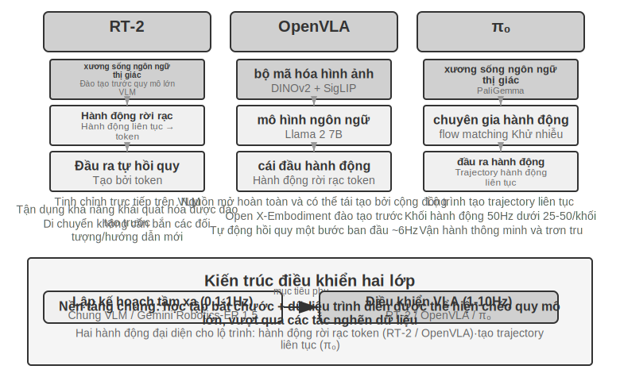


**RT-2 với OpenVLA: Định tuyến mã thông báo hành động riêng biệt.**

**RT-2** pioneered this route: fine-tuning directly on the large-scale visual-language model, discretizing the robot's continuous actions into tokens, outputting autoregressive output one by one like generating text, and using the generalization ability of the pre-trained model to improve the zero-sample transfer effect for new objects and new instructions. **OpenVLA** tuân theo sơ đồ biểu diễn hành động của RT-2, hợp nhất mô hình ngôn ngữ và bộ mã hóa hình ảnh trong một kiến trúc duy nhất, nhập hình ảnh và hướng dẫn văn bản cũng như xuất mã thông báo hành động. Quá trình đào tạo được chia thành hai giai đoạn: đầu tiên là đào tạo trước về bộ dữ liệu đa nền tảng quy mô lớn Open X-Embodiment (bao gồm các minh họa hoạt động thực tế của hơn 20 nền tảng robot), tìm hiểu kiến thức vận hành chung (các chế độ hành động như "lấy" và "đặt" giống nhau giữa các robot khác nhau), sau đó tinh chỉnh với một lượng nhỏ dữ liệu cho các nền tảng cụ thể. Vì cách trình bày hành động về cơ bản là giống nhau nên sự khác biệt thực sự giữa cả hai nằm ở tính mở và các lựa chọn kỹ thuật: RT-2 và dữ liệu đào tạo của nó là nội bộ của Google, trong khi OpenVLA hoàn toàn là nguồn mở - mô hình đường trục nguồn mở (Llama 2 cộng với bộ mã hóa trực quan) với các bộ dữ liệu công khai, cho phép toàn bộ cộng đồng tái tạo và cải thiện nó lần đầu tiên.

**Chặn hành động: Công nghệ bù tần số phổ biến trong lĩnh vực VLA.**

Do độ trễ trong suy luận LLM nên tần số điều khiển của VLA thấp hơn nhiều so với yêu cầu điều khiển robot truyền thống (điều khiển robot truyền thống thường yêu cầu tần số điều khiển là 50-1000Hz, trong khi suy luận đơn của VLA chỉ khoảng 1-10Hz - chênh lệch lên tới hai bậc độ lớn). OpenVLA ban đầu là một đại diện điển hình cho vấn đề này: nó chỉ đưa ra một hành động cho mỗi suy luận (dự đoán tự hồi quy một bước ở khoảng 6Hz) và độ trễ hành động chính xác là thiếu sót chính mà nó đã bị chỉ trích. **Phân đoạn hành động**(Action Chunking) là một công nghệ chung được sinh ra để thu hẹp khoảng cách này - lần đầu tiên được đề xuất bởi ACT (Zhao và cộng sự, 2023), sau đó được áp dụng rộng rãi bởi π₀, OpenVLA-OFT, v.v.: mô hình không chỉ đưa ra một hành động cho mỗi suy luận mà còn tạo ra một chuỗi hành động trong một khoảng thời gian ngắn trong tương lai chỉ trong một hơi thở (lấy cấu hình điển hình của π₀ làm ví dụ, nó tạo ra khoảng 0.5-1 tại khối hành động thứ hai tại thời điểm, ở tần số điều khiển 50Hz (tức là các hành động 25-50), luồng điều khiển được thực thi tuần tự ở tần số cao, trong khi mô hình tạo ra lô tiếp theo không đồng bộ trong nền Miễn là thời gian suy luận của mô hình nhỏ hơn thời gian thực hiện của loạt hành động này, thì rô-bốt có thể duy trì chuyển động liên tục và mượt mà - giống như đệm video, nội dung tiếp theo sẽ được tải trước và nội dung tiếp theo sẽ được tải trước. phát lại sẽ không bị treo.

**π₀: Lộ trình tạo trajectory liên tục.**

Sự khác biệt thực sự giữa biểu diễn hành động không phải là giữa RT-2 và OpenVLA, mà là giữa các mã thông báo rời rạc và việc tạo trajectory liên tục. **π₀** đại diện cho lộ trình thứ hai: thay vì dự đoán từng mã thông báo hành động rời rạc, việc khớp luồng (một phương pháp tạo liên tục tương tự với mô hình khuếch tán) được sử dụng để trực tiếp tạo ra một trajectory hành động trơn tru và liên tục bắt đầu từ nhiễu ngẫu nhiên và "khử nhiễu" thông qua các lần lặp nhiều bước. Kiểu biểu diễn này được kết hợp một cách tự nhiên với phân đoạn hành động và thực hiện tốt hơn các nhiệm vụ đòi hỏi độ chính xác và tính trôi chảy của hành động cao, chẳng hạn như các thao tác khéo léo. Ví dụ: lộ trình mã thông báo rời rạc giống như chọn dần dần "5 độ sang trái" và "tiến lên 3 cm" từ menu và lộ trình trajectory liên tục giống như một họa sĩ đầu tiên phác thảo toàn bộ đường cong và sau đó sửa từng bước.

### Sim2Real Transfer: Khoảng cách từ mô phỏng đến thực tế

Phần môi trường mô phỏng của Chương 6 đã giải thích nguồn gốc của khoảng cách sim-to-real (khoảng cách thực tế) và nguyên tắc ngẫu nhiên hóa miền để giải quyết nó. Tôi sẽ không lặp lại ở đây - trong một câu: mô phỏng không thể khôi phục hoàn toàn các đặc điểm vật lý, hình ảnh và phần cứng thực sự. Trong quá trình huấn luyện, các tham số này bị gián đoạn ngẫu nhiên trên quy mô lớn, buộc chiến lược phải học một tập hợp các biểu diễn phổ quát ổn định trước các thay đổi khác nhau (Hình 9-12). Chúng ta hãy xem cách thực hiện bộ nguyên tắc này trên một cánh tay robot thực sự.


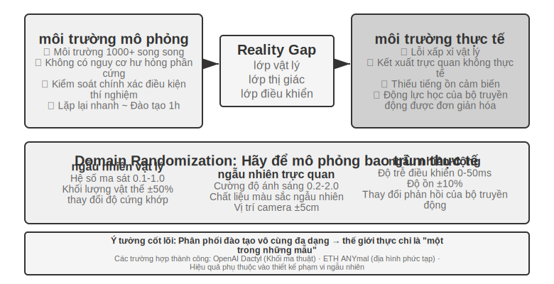


Có nhiều trường hợp thành công trên lộ trình này: hoạt động khéo léo của bàn tay robot OpenAI (dự án Dactyl nhận ra sự chuyển hướng của khối lập phương trong tay và công việc tiếp theo của nó đã thực hiện việc giải khối Rubik bằng một tay với sự trợ giúp của miền ngẫu nhiên ADR tự động) và ANYmal của ETH Zurich (robot bốn chân có thể bước đi mạnh mẽ trên các địa hình hoang dã phức tạp như tuyết và sỏi). Cả hai đều thuộc thể loại này.

Điều mà chương này thực sự muốn đề cập đến là hai liên kết kỹ thuật không thể tránh khỏi khi triển khai ngẫu nhiên miền vào máy thực. Đầu tiên là **hiệu chỉnh phạm vi ngẫu nhiên**: không thể xác định phạm vi trên đầu. Nếu quá hẹp sẽ không bao quát được những thay đổi thực sự. Nếu quá rộng, nó sẽ tăng độ khó trong quá trình luyện tập và học được chiến lược chưa tối ưu là “có thể xử lý mọi việc nhưng không giỏi việc gì”. Trong thực tế, việc phân phối các tham số chính (chẳng hạn như hệ số ma sát, phân bố thực của độ trễ phản ứng của động cơ) trong dữ liệu môi trường thực thường được đo và hiệu chỉnh trước tiên, đồng thời thực hiện lấy mẫu trong phạm vi này; nếu chiến lược đào tạo mô phỏng rõ ràng bị loại bỏ trên máy thật, thì phạm vi ngẫu nhiên sẽ dần được mở rộng cho đến khi khoảng cách sim-to-real hội tụ đến mức có thể chấp nhận được. Thứ hai là **Căn chỉnh hình ảnh**: Hiệu chỉnh chính xác mô phỏng và tư thế máy ảnh thật (căn chỉnh môi trường) và thay thế ngẫu nhiên nền chụp thực vào kết xuất mô phỏng (thay thế nền màn hình xanh), sao cho hình ảnh mô phỏng càng gần nhất có thể với những gì nhìn thấy trên máy thật - hai bước này của thử nghiệm 9-10 sẽ được trình bày chi tiết.

> **Thử nghiệm 9-10 ★★★: Lấy cánh tay robot Sim2Real không mẫu dựa trên RGB**
>
> Sử dụng trình mô phỏng LeRobot + ManiSkill để huấn luyện chỉ với hình ảnh camera RGB (không dựa vào cảm biến độ sâu hoặc cảm biến lực), sau đó triển khai trực tiếp lên cánh tay robot SO100 thực mà không cần bất kỳ mẫu nào (không cần bất kỳ điều chỉnh bổ sung nào). Quy trình năm bước:
>
> 1. **Căn chỉnh môi trường**: Điều chỉnh vị trí camera trong môi trường mô phỏng và thực tế, đồng thời xác minh rằng hình ảnh ở cả hai bên có thể được căn chỉnh thông qua lớp phủ trực quan
> 2. **Thay thế nền**(màn hình xanh): Cắt ngẫu nhiên hình nền được chụp trong môi trường thực và chồng nó vào kết xuất mô phỏng, làm cho nền của hình ảnh mô phỏng gần với thực tế hơn.
> 3. **Ngẫu nhiên hóa miền**: Chọn ngẫu nhiên các thông số như màu sắc của robot, kết cấu đối tượng, điều kiện ánh sáng, trường nhìn của camera, v.v.
> 4. **Đào tạo RL**: Sử dụng thuật toán PPO để huấn luyện trong môi trường mô phỏng song song quy mô lớn cho đến khi tỷ lệ mô phỏng thành công >90%
> 5. **Triển khai thực tế**: Hoàn thành nhiệm vụ thu thập dữ liệu trực tiếp và thành công trên robot thực sự mà không cần lấy mẫu
>
> Các yếu tố chính để thành công: căn chỉnh môi trường chính xác + ngẫu nhiên miền trực quan + ngẫu nhiên hóa tham số vật lý, cả ba đều không thể thiếu. Hạn chế: Khi hình dạng, kích thước hoặc chất liệu của vật thể thật nằm ngoài phạm vi phân bổ huấn luyện, tỷ lệ thành công sẽ giảm đáng kể. [^ch9-6]
>
> [^ch9-6]: LeRobot, “Hướng dẫn về Sim2Real” . https://github.com/StoneT2000/lerobot-sim2real/blob/main/docs/zero_shot_rgb_sim2real.md
>
>
> 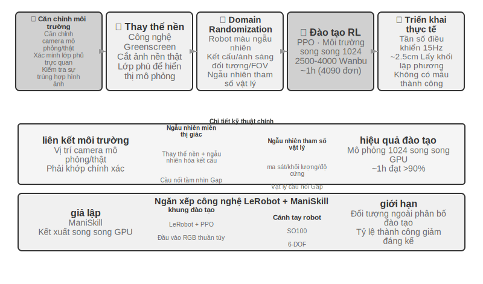
>

## Tóm tắt chương này

Ba cảnh nhìn bề ngoài rất khác nhau, nhưng hai trở ngại về sự chậm trễ và đa phương thức luôn song hành với nhau. Voice đã bắt đầu một con đường phát triển từ đường dẫn nối tiếp đến đầu cuối và song công hoàn toàn, từ tư duy nhanh và chậm tách biệt sang "suy nghĩ và nói"; Độ chính xác của Computer Use trên các điểm chuẩn như OSWorld gần bằng mức con người, nhưng có nhiều bước vận hành hơn đáng kể so với con người và mức tiêu thụ thời gian của từng bước tăng theo tiến độ của nhiệm vụ. Không có giải pháp mang tính hệ thống cho khoảng cách hiệu quả; đối với robot, trong các tác vụ vận hành dựa trên phản hồi trực quan, nút cổ chai đã chuyển từ phần cứng sang khả năng khái quát hóa chéo tác vụ của lớp điều khiển VLA (cảm ứng, khéo léo, v.v. vẫn là những thiếu sót về phần cứng chưa được khắc phục). Chương tiếp theo sẽ tập trung vào sự cộng tác giữa nhiều Agent, đây là một thách thức ở một khía cạnh khác.

## Câu hỏi tư duy

1. ★★ Mô hình giọng nói đầu cuối Agent hợp nhất ASR-LLM-TTS thành một mô hình duy nhất, giảm độ trễ nhưng mất tính mô-đun. Nếu mô hình đầu cuối bị lỗi ở một số điểm (chẳng hạn như nhận dạng giọng nói), việc gỡ lỗi và sửa nó sẽ khó khăn hơn nhiều so với đường ống nối tiếp. Bạn sẽ thiết kế hệ thống quan sát giọng nói Agent giọng nói đầu cuối như thế nào?
2. ★ Step-Audio R1 thực hiện “nghĩ và nói” thông qua kiến trúc bộ não kép MPS. Nhưng khi con người đang “suy nghĩ và nói chuyện”, họ thường nói những điều chưa được suy nghĩ kỹ, tự sửa hoặc sử dụng những từ lấp chỗ trống. “Suy nghĩ và lời nói” của Agent có nên bắt chước những đặc điểm này của con người không?
3. ★★ SoM (Set-of-Mark) và biến thể có cấu trúc của nó (chỉ mục phần tử DOM) chuyển bản địa hóa trực quan của Computer Use từ dự đoán tọa độ mở sang lựa chọn ID đóng, nhưng cả hai đều yêu cầu các thành phần giao diện phải được phát hiện và chú thích trước - bằng mô hình phân đoạn hoặc DOM. Nếu giao diện chứa các điều khiển không chuẩn hoặc các phần tử thay đổi linh hoạt, việc ghi nhãn có thể không đầy đủ hoặc không chính xác. Chúng ta có nên quay lại việc phối hợp dự đoán trong trường hợp này không?
4. ★★ Các nền tảng robot trị giá hàng nghìn đô la như XLeRobot giúp việc thu thập dữ liệu từ xa trở nên rẻ hơn. Tuy nhiên, chất lượng của dữ liệu viễn thông phụ thuộc nhiều vào kỹ năng của người vận hành. Dữ liệu do người vận hành không có kỹ năng cung cấp ảnh hưởng như thế nào đến việc đào tạo mô hình VLA? Làm cách nào để tự động lọc dữ liệu chất lượng thấp trong giai đoạn thu thập dữ liệu?
5. ★★★ Chương này bao gồm ba hình thức tương tác: giọng nói, Computer Use và robot. Xu hướng chung giữa ba hình thức này là sự phát triển từ các đường ống nối tiếp sang các mô hình đầu cuối. Nếu xu hướng này tiếp tục, lớp tương tác Agent sẽ trông như thế nào sau 5 năm nữa?
6. ★★★ Hiện tại Computer Use hoạt động theo chu trình riêng biệt “Ảnh chụp màn hình → Hành động → Ảnh chụp màn hình” và mỗi quan sát là một khung tĩnh. Nhưng nhận thức của con người về màn hình là liên tục - chúng ta có thể thấy hoạt ảnh đang phát, quan sát tiến trình tải và hiểu nội dung video. Điều này có nghĩa là Computer Use ngày nay đơn giản là không thể xử lý các tác vụ đòi hỏi sự hiểu biết trực quan theo thời gian. Làm thế nào lớp nhận thức có thể được thiết kế lại để hỗ trợ việc hiểu luồng hình ảnh liên tục?
7. ★★ Lập chỉ mục phần tử cây DOM/Accessibility có hiệu quả trong các ứng dụng web tiêu chuẩn, nhưng ngày càng có nhiều giao diện phần mềm (hiển thị Canvas/WebGL, điều khiển tự vẽ đa nền tảng) không cung cấp thông tin có cấu trúc có thể truy cập được và chỉ có thể dựa vào chú thích trực quan hoặc dự đoán tọa độ. Bạn nghĩ Computer Use nên đặt cược vào tuyến đường hoàn toàn trực quan hay duy trì cả tuyến đường có cấu trúc và trực quan? Chi phí và lợi ích của việc duy trì hai con đường là gì?
8. ★★ Mô hình VLA sử dụng phân đoạn hành động - như đã đề cập trong văn bản, cấu hình điển hình của π₀ là tạo ra các hành động trong tương lai 25-50 ở tần số 50Hz - ẩn độ trễ suy luận trong thời gian thực hiện. Tuy nhiên, nếu môi trường thay đổi đột ngột trong quá trình thực thi (chẳng hạn như một đối tượng bị xóa), chuỗi hành động được tạo trước sẽ trở nên không hợp lệ. Làm thế nào để đạt được sự cân bằng giữa lợi ích hiệu quả của việc phân chia hành động và tốc độ phản ứng với những thay đổi của môi trường?
9. ★★★ Ba kịch bản trong chương này (giọng nói, Computer Use, robot) đều gặp phải vấn đề độ trễ của chu trình "nhận thức-suy nghĩ-hành động" và chúng đều phát triển theo hướng song song hóa tư duy nhanh và chậm. Trong cảnh lồng tiếng, điều này thể hiện là "sửa lỗi sau khi bạn mắc lỗi"; trong cảnh Computer Use, điều này biểu hiện dưới dạng "nhấp vào trước rồi nhìn"; trong cảnh người máy, điều này thể hiện là "bước một bước và nhìn bước kia". Làm thế nào để đảm bảo rằng những hành động dựa trên tư duy nhanh nhạy này sẽ không dẫn đến những hậu quả không thể khắc phục được?
