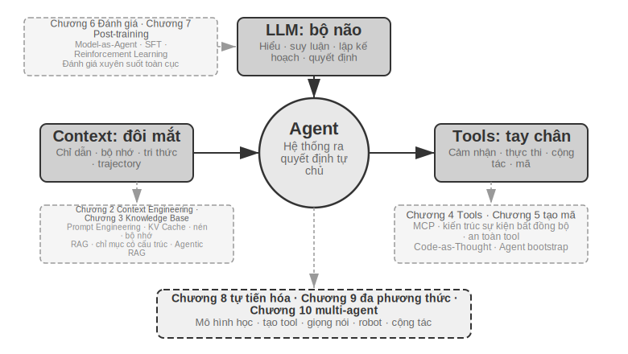
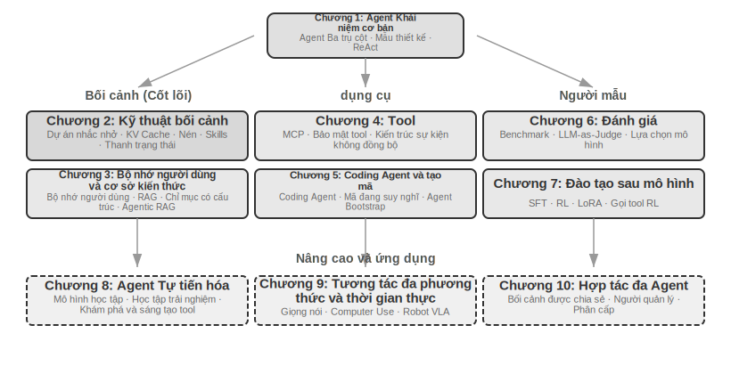

# Giới thiệu {.unnumbered}

Từ tháng 8 đến tháng 10 năm 2025, tôi đã giảng một loạt bài giảng kỹ thuật tại "Trại thực hành AI Agent" của Turing. Mục đích ban đầu của bài giảng rất đơn giản: thay đổi thiết kế của AI Agent từ "dựa trên cảm giác" sang "dựa trên nguyên tắc": không chỉ để dạy mọi người cách chạy qua bản demo mà còn để hiểu sâu sắc lý do tại sao Agent được thiết kế theo cách này và sự đánh đổi đằng sau mỗi quyết định kiến trúc là gì. Cuốn sách này được biên soạn và mở rộng từ các bài giảng và thí nghiệm của các bài giảng đó.

Điều đáng nói là từ ý tưởng ban đầu cho đến cuốn sách cuối cùng, bản thân cuốn sách này đã được thực hiện bằng một phương pháp có thể gọi là **vibe coding**(cộng tác bằng miệng) - và thứ tôi sử dụng để đọc chính tả là giọng nói của chính Pine của chúng tôi Agent. Mỗi khi tôi chuẩn bị một bài giảng, trước tiên tôi sẽ viết một dàn ý sơ bộ, yêu cầu nó làm một cuộc khảo sát, sau đó nó sẽ biên soạn bản thảo đầu tiên. Sau bài giảng, tôi sẽ tổng hợp phản hồi từ các sinh viên trong trại thực hành AI Agent và liên tục thảo luận, trau chuốt nó. Qua nhiều lần lặp đi lặp lại như vậy, cuối cùng tôi đã mở rộng và sắp xếp những bài giảng này thành cuốn sách ngày hôm nay. Trong toàn bộ quá trình, tôi hầu như không gõ phím mà chỉ truyền đạt suy nghĩ của mình - băng thông của lời nói cao hơn nhiều so với khi gõ (tốc độ nói bình thường gấp khoảng bốn lần tốc độ gõ), do đó chu kỳ "đọc chính tả-nghiên cứu-thảo luận-sửa đổi" quay rất nhanh. Theo một nghĩa nào đó, cuốn sách này không chỉ nói về Agent mà còn là một tác phẩm được thực hiện với sự tham gia của Agent.

Kể từ khi phát hành DeepSeek R1 vào đầu năm 2025, lĩnh vực AI đã phát triển từ mô hình cơ sở đơn giản (tức là cơ sở mô hình ngôn ngữ lớn phổ quát) sang lĩnh vực triển khai kỹ thuật ở vùng nước sâu. Tiến trình của lớp mô hình có thể được nhìn thấy từ hai hướng: Một mặt, mô hình rèn luyện khả năng gọi công cụ vào các tham số mô hình thông qua học tăng cường (Agentic Reinforcement Learning) trong môi trường tác nhân, để mô hình làm chủ các khả năng chung về lập trình (mã hóa), toán học, vận hành giao diện đồ họa (sử dụng máy tính) và các lĩnh vực khác. Tốc độ lặp lại của mô hình cũng ngày càng nhanh hơn. Từ GPT-5.2 đến GPT-5.5 và Claude Opus 4.5 đến 4.8, chỉ mất nửa năm. Lớp sản phẩm bao gồm Manus, Claude Code, OpenClaw và các ứng dụng chung khác. Agent xác định lại cách tương tác giữa con người và máy tính và đưa mô hình kiến trúc "tạo mã + hệ thống tệp" trở thành xu hướng phổ biến.

Khi nhìn lại những nguyên tắc thiết kế kiến trúc Agent được tóm tắt trong khóa học gần một năm trước, tôi tìm thấy một khám phá khiến tôi vừa hài lòng vừa ngạc nhiên: **Những nguyên tắc này không hề lỗi thời mà ngày càng trở nên cổ điển hơn.** Mặc dù các thuật ngữ mới của Agent như kỹ năng, dây nịt và kỹ thuật vòng lặp đã xuất hiện trong ngành sau này, nhưng trật tự thực tế lại hoàn toàn ngược lại: không phải các công ty Anthropic đã phát minh ra những khái niệm này trước tiên và nhiều Agent đã làm theo; ngược lại, một số lượng lớn Agent đã làm việc này từ lâu, Anthropic Chỉ khi đó chúng mới được chắt lọc và tổng hợp thành các nguyên tắc thiết kế kiến trúc. Thực hành trước, đặt tên sau.

Độ tin cậy của các nguyên tắc này đến từ việc triển khai thực tế Agent trong các tình huống có quy trình dài và rủi ro cao. Với tư cách là Nhà khoa học trưởng tại Pine AI, tôi và nhóm của mình đã xây dựng Pine. Theo những gì tôi biết, đây là Agent có mục đích chung đầu tiên có thể tự động tương tác với người thật và xử lý các nhiệm vụ nhạy cảm, phức tạp và đường dài liên quan đến tiền bạc một cách đáng tin cậy: nó kêu gọi người dùng thương lượng hóa đơn với nhà điều hành, thương lượng hoàn tiền và khiếu nại với người bán cũng như hủy đăng ký, tất cả đều không cần sự can thiệp của con người. Những nhiệm vụ như vậy thường liên quan đến hàng chục vòng đàm phán và bất kỳ sai sót nào cũng sẽ dẫn đến việc mất tiền thật. Chính yêu cầu khắt khe nhất về độ tin cậy này đã buộc các nguyên tắc kiến trúc được nhấn mạnh nhiều lần trong cuốn sách này phải lần lượt được đưa ra. Các ví dụ sau đây đến từ thực tiễn này.

- Rất lâu trước khi khái niệm Kỹ năng trở nên phổ biến, chúng tôi đã sử dụng phương pháp tải động các từ nhắc để giải quyết vấn đề mở rộng vô hạn các từ nhắc, sử dụng công cụ thực thi dòng lệnh để giải quyết vấn đề mở rộng vô hạn danh sách công cụ và sử dụng công nghệ thanh trạng thái hệ thống để giải quyết vấn đề Agent không nhận thức được môi trường thực thi, thời gian của người dùng và trạng thái làm việc.
- Rất lâu trước khi khái niệm dây nịt trở nên phổ biến, chúng tôi đã sử dụng các phương pháp tương tự như Claude Code để giải quyết các vấn đề như mất ổn định, ảo giác, vận hành nguy hiểm, vận hành trái phép và không tuân thủ hướng dẫn khi gọi các công cụ mô hình.
- Rất lâu trước khi khái niệm kỹ thuật vòng lặp trở nên phổ biến, chúng tôi đã sử dụng một phương pháp có tên là người đề xuất-người đánh giá (proposer-reviewer) trong cuốn sách này để giải quyết vấn đề mô hình nghĩ sớm rằng nhiệm vụ đã hoàn thành, cho phép Agent tự mình xem xét đầu ra của các sản phẩm bàn giao (tạo tác) và thực hiện các cải tiến lặp đi lặp lại.

Và đây không phải là phát minh độc quyền của chúng tôi, theo như tôi biết, hầu hết các mẫu đầu và công ty Agent đều đã tự tìm ra các phương pháp tương tự. Đây là lý do tại sao tôi sẽ mở khóa học "Trại thực hành AI Agent" ở Turing vào tháng 8 năm 2025 và khóa thực hành AI Agent tại Đại học Khoa học và Công nghệ Quốc gia ở 2024-2026. Tôi đã chọn phát hành cuốn sách này dưới dạng nguồn mở thay vì đóng cửa để thu tiền bản quyền và tôi cũng hy vọng rằng kiến thức này có thể được phổ biến đến nhiều học viên hơn.

**Thực hành trước, đặt tên cuối cùng**, thứ tự này có ý nghĩa rất thiết thực đối với việc phát triển Agent cấp doanh nghiệp: **Nếu bạn phải đợi cho đến khi một thuật ngữ Agent nhất định mỗi lần trở nên phổ biến trong ngành trước khi thực hành nó, thì bạn sẽ chậm hơn một bước.** Khi thuật ngữ này trở nên phổ biến, các công ty hàng đầu thường đã xem xét kỹ các vấn đề tương ứng. Vì vậy, làm thế nào để bạn biết phải làm gì trước khi một thuật ngữ trở nên phổ biến? Tôi nghĩ có hai điểm quan trọng nhất.

**Đầu tiên, hãy có một doanh nghiệp thực sự có yêu cầu cực kỳ cao về giới hạn trên của khả năng Agent và có thể liên tục nhận được phản hồi kinh doanh thực tế.** Lấy Pine làm ví dụ, thường phải mất hàng giờ hoặc thậm chí hàng tuần để xử lý một việc và quá trình này có thể yêu cầu liên lạc nhiều lần với nhiều bên liên quan: Trong giai đoạn này, có thể mất vài giờ gọi điện, làm việc trên máy tính và điền vào nhiều trang biểu mẫu phức tạp cũng như gửi đi gửi lại nhiều email. Toàn bộ quá trình không được mắc sai sót về số lượng nhưng cũng phải luôn thận trọng trong giao tiếp để bảo vệ quyền lợi của người dùng. Chỉ khi bạn tiếp xúc với một kịch bản đủ phức tạp như vậy, thực tiễn sẽ tự nhiên buộc bạn phải xây dựng một dây nịt để giải quyết những điều mà bản thân mô hình hiện tại chưa làm được mà phải hoàn thiện trong kinh doanh. Mặt khác, nếu doanh nghiệp không có yêu cầu cao về giới hạn trên của năng lực và chỉ nâng cấp nhẹ về mô hình là đủ thì bạn sẽ không có động lực để trau chuốt những nguyên tắc kiến trúc này.

**Thứ hai, phải thiết lập cơ chế đánh giá (Evaluation).** Đây cũng là điểm được nhấn mạnh nhiều lần trong cuốn sách này: không có đánh giá thì không có tiến bộ. Việc đánh giá cho phép bạn biết liệu một thay đổi có thực sự tốt hay chỉ là may mắn, do đó hướng lặp lại của Agent không còn phụ thuộc vào trực giác nữa. Trong phân tích cuối cùng, điều chúng tôi chủ trương là sử dụng phương pháp khoa học để thực hiện các dự án và thực hiện Agent, và đánh giá là nền tảng của phương pháp này. Chương 6 sẽ mở rộng cụ thể về phương pháp này.

Cho dù mô hình cơ bản được nâng cấp như thế nào, cho dù hình thức sản phẩm có đổi mới đến đâu, hầu hết tất cả các hệ thống Agent thành công đều tuân theo cùng một mô hình kiến trúc. Đây không phải là sự trùng hợp ngẫu nhiên: các nguyên tắc thiết kế tốt nhất phải tuân theo chu trình lặp lại của mô hình **, bởi vì chúng mô tả không phải việc sử dụng một mô hình nhất định mà là phương thức tương tác cơ bản giữa các hệ thống thông minh và thế giới.

Richard Sutton, người đoạt giải Turing và là cha đẻ của học tập tăng cường, từng nói rằng quá trình tiến hóa của vũ trụ trải qua bốn giai đoạn: từ bụi đến sao, từ sao đến sự sống và từ sự sống đến thực thể thông minh (thực thể được thiết kế ban đầu). Sự tiến hóa sinh học là mù quáng: đột biến ngẫu nhiên, chọn lọc tự nhiên. Hầu hết các sinh vật sống không hiểu cách chúng hoạt động và chúng không thể thiết kế và sửa đổi các sinh vật một cách độc lập. Tác nhân thông minh (Agent) là một sự tồn tại hoàn toàn mới trong lịch sử tiến hóa vũ trụ: nó có thể đạt được bootstrap và tự tiến hóa bằng cách tạo mã, giống như một lập trình viên viết một lập trình viên khác, và sau đó lập trình viên mới có thể tiếp tục viết chương trình tiếp theo. Nói cách khác, Agent có thể hiểu cơ chế hoạt động của chính mình, tạo ra các tác nhân thông minh mới theo mục tiêu của mình và thậm chí tự cải thiện. Sứ mệnh của cuốn sách này là giúp bạn hiểu và nắm vững nguyên tắc sáng tạo này.

Công thức cốt lõi của cuốn sách này chỉ có một câu: **Agent = LLM + context + tools**. Cả ba đều không thể thiếu.

Nói một cách trực quan hơn thì đó là **não + mắt + tay chân**. Bộ não (LLM) chịu trách nhiệm suy nghĩ và ra quyết định, đôi mắt (ngữ cảnh) xác định thông tin nào Agent có thể nhìn thấy và bàn tay và bàn chân (công cụ) xác định những gì Agent có thể làm. (Nói đúng ra, "đôi mắt" chỉ là một sự tương tự thô: ngữ cảnh không chỉ bao gồm thông tin môi trường và lịch sử hội thoại mà còn cả định nghĩa công cụ, v.v. Nói cách khác, thông tin mà Agent "nhìn thấy" cũng bao gồm "những gì tay và chân có sẵn". Phép ẩn dụ này nhằm truyền đạt trực giác cốt lõi: ngữ cảnh là tất cả thông tin mà mô hình có thể nhận thức được.)

Đối với những độc giả quen với việc học tăng cường, ba điều này cũng có thể được ánh xạ tới ngôn ngữ chính thức của RL. Cụ thể, LLM tương ứng với Chính sách, ngữ cảnh tương ứng với Observation Space và công cụ tương ứng với Action Space. Ba câu lệnh tương ứng với cùng một đối tượng nhưng có mức độ biểu đạt khác nhau.

Tuy nhiên, ý nghĩa của mỗi từ trong số ba từ này phong phú hơn nhiều so với nghĩa đen. Chương đầu tiên sẽ chia nhỏ từng vấn đề một dựa trên thực tiễn và thiết lập một bản đồ hoàn chỉnh từ sự hiểu biết trực quan đến các khái niệm học thuật.

## Cấu trúc của cuốn sách {.unnumbered}

Cuốn sách này có mười chương, được chia thành ba phần (Hình 0-1, Hình 0-2): Chương 1 là nền tảng, thiết lập sự hiểu biết tổng thể về Agent; Các Chương 2 đến 7 lần lượt trình bày ba trụ cột: ngữ cảnh (Chương 2 đến 3), công cụ (Chương 4 đến 5) và mô hình (Chương 6 đến 7, đánh giá và post-training); Các chương từ 8 đến 10 là sự tiến bộ và ứng dụng, thể hiện Agent Khả năng tự phát triển, tương tác đa phương thức và thời gian thực cũng như cộng tác đa Agent.

- **Chương 1 (Kiến thức cơ bản về Agent)** sử dụng nhiều sản phẩm Agent thực tế làm hướng dẫn để thiết lập sự hiểu biết trực quan về Agent. Phân tích chuyên sâu về công thức cốt lõi của Agent: từ LLM + ngữ cảnh + công cụ ở cấp độ triển khai, đến não + mắt + tay chân ở cấp độ trực quan, đến chính sách, không gian quan sát và không gian hành động ở cấp độ học thuật. Đồng thời, cơ chế hoạt động của chu trình ReAct được phân tích thông qua các thử nghiệm, là quá trình lặp "suy nghĩ → hành động → quan sát" và giới thiệu ba mô hình học tập của Agent: post-training (Post-training), In-Context Learning (học trong ngữ cảnh) (In-Context Learning) và External Learning (học bên ngoài tham số mô hình). Cuối cùng, mẫu thiết kế điều phối từ quy trình làm việc đến quyền tự chủ Agent sẽ được thảo luận để thiết lập khung khái niệm thống nhất cho các chương tiếp theo.
- **Chương 2 (Context Engineering (kỹ thuật ngữ cảnh))** là chương quan trọng nhất trong cuốn sách. Nó giải thích một cách có hệ thống ngữ cảnh, đó là "đôi mắt" của Agent. Chương này bắt đầu với cấu trúc thông báo API và vòng lặp cốt lõi Agent, thiết lập nền tảng của "ngữ cảnh là danh sách thông báo", sau đó đi sâu vào các nguyên tắc cơ bản của KV Cache (một cơ chế sử dụng lại kết quả tính toán lịch sử trong quá trình suy luận mô hình lớn), sau đó tiến hành theo trình tự: Prompt Engineering (kỹ thuật prompt) (bao gồm thiết kế quy trình, mô tả công cụ, sàng lọc quy tắc kinh doanh) và tấn công và phòng thủ prompt injection (Prompt injection nhở), Cơ chế tải theo yêu cầu của Kỹ năng Agent, công nghệ thanh trạng thái Agent và chiến lược Nén ngữ cảnh. Định nghĩa đầy đủ của mỗi thuật ngữ được đưa ra ở lần xuất hiện đầu tiên trong văn bản.
- **Chương 3 (Bộ nhớ người dùng và Cơ sở kiến thức)** mở rộng quản lý ngữ cảnh sang hệ thống kiến thức liên tục giữa các phiên, cho phép Agent không chỉ ghi nhớ nội dung của cuộc trò chuyện hiện tại mà còn tích lũy và nhớ lại kiến thức giữa nhiều cuộc trò chuyện. Bao gồm bốn chiến lược nâng cao cho bộ nhớ người dùng, nhóm công nghệ hoàn chỉnh của RAG (thế hệ tăng cường truy xuất, truy xuất các tài liệu có liên quan trước rồi cho phép mô hình tạo câu trả lời) (bao gồm các phương pháp tìm kiếm văn bản khác nhau và tối ưu hóa xếp hạng kết quả tìm kiếm), trích xuất thông tin đa phương thức, các phương pháp tổ chức kiến thức nâng cao hơn và tác nhân RAG (Agentic RAG, hãy để Agent quyết định độc lập khi nào cần tìm kiếm và tìm kiếm cái gì).
- **Chương 4 (Công cụ)** thảo luận về cầu nối giữa Agent và thế giới bên ngoài: các công cụ giống như "tay và chân" của Agent, cho phép nó tìm kiếm các trang web, gọi API, vận hành cơ sở dữ liệu, v.v. Giới thiệu tiêu chuẩn khả năng tương tác của công cụ MCP và nguyên tắc thiết kế của năm loại công cụ (nhận thức, thực thi, cộng tác, kích hoạt sự kiện, giao tiếp với người dùng), tập trung vào cơ chế bảo mật của các công cụ thực thi và kiến trúc Agent không đồng bộ theo hướng sự kiện.
- **Chương 5 (Coding Agent và tạo mã)** chứng minh rằng Coding Agent cộng với hệ thống tệp là nền tảng kỹ thuật cốt lõi của tất cả Agent chung. Lấy kiến trúc OpenClaw làm dòng chính, chúng tôi phân tích quy trình làm việc và kỹ thuật triển khai của Coding Agent, đồng thời chứng minh giá trị sâu rộng của việc tạo mã ngoài lập trình: từ hỗ trợ tư duy, xây dựng cơ sở kiến thức, đến tạo động các công cụ mới và khởi động Agent.
- **Chương 6 (Đánh giá Agent)** Xây dựng phương pháp đánh giá khoa học. Bao gồm môi trường đánh giá (hai mô hình cốt lõi của việc gọi công cụ và tương tác giữa con người với máy tính, cũng như môi trường mô phỏng được thảo luận riêng ở cuối chương), nguyên tắc thiết kế của tập dữ liệu, phương pháp đánh giá tự động LLM-as-a-Judge, lựa chọn mô hình dựa trên đánh giá và vòng lặp khép kín hoàn chỉnh giúp chuyển đổi kết quả đánh giá thành cải tiến hệ thống.
- **Chương 7 (Post-training mô hình)** Nghiên cứu chuyên sâu về hai kỹ thuật post-training SFT (tinh chỉnh có giám sát, sử dụng dữ liệu chú thích để dạy mô hình "học như bình thường") và RL (học tăng cường, cho phép mô hình cải thiện độc lập thông qua thử, sai và khen thưởng phản hồi). Lấy "bộ nhớ SFT, khái quát hóa RL" và "dữ liệu và môi trường quan trọng hơn thuật toán" làm đối số cốt lõi, bao gồm đào tạo trước/SFT/RL toàn cảnh ba giai đoạn, Lý thuyết RL cổ điển, thiết kế tín hiệu phần thưởng (từ phần thưởng nhị phân đến phần thưởng xử lý, đến hình phạt đường dẫn xác minh của "kết quả phần thưởng, ràng buộc" Process"), các thuật toán học tăng cường một vòng và nhiều vòng cũng như tối ưu hóa hiệu quả mẫu và các khám phá tiên tiến khác.
- **Chương 8 (Sự tự tiến hóa của Agent)** thảo luận về cách làm cho Agent tiếp tục trở nên mạnh hơn mà không cần sửa đổi trọng lượng của mô hình. Hai con đường tiến hóa chính là: học hỏi từ kinh nghiệm (tóm tắt chiến lược, ghi lại quy trình làm việc, tối ưu hóa tự động các từ nhắc nhở của hệ thống, đưa kiến thức về Kỹ năng ra bên ngoài) và tích cực khám phá và tạo ra các công cụ (MCP-Zero, tích hợp công cụ nguồn mở, tạo ra các công cụ mới bằng mã).
- **Chương 9 (Tương tác đa phương thức và thời gian thực)** Outlook Agent Từ thế giới văn bản đến thế giới vật lý. Bài phát biểu bao gồm Agent (từ đường dẫn nối tiếp đến mô hình đầu cuối), Computer Use (làm cho Agent vận hành giao diện đồ họa giống như con người) và vận hành robot (điều khiển VLA (Mô hình hành động ngôn ngữ trực quan) với di chuyển Sim2Real), tiết lộ những thách thức kiến trúc phổ biến được đưa ra bởi đa phương thức và thời gian thực.
- **Chương 10 (Hợp tác nhiều Agent)** thảo luận về hình thức cuối cùng của hệ thống AI Agent: nhiều Agent phân chia lao động và hợp tác như thế nào. Giải thích một cách có hệ thống khung phân loại của cộng tác đa Agent (chia sẻ ngữ cảnh/độc lập × ngang hàng/người quản lý/phân cấp), thể hiện phương pháp thiết kế kiến trúc cộng tác thông qua các trường hợp như dịch thuật Agent, điện thoại + máy tính Agent và mong chờ hướng đi tiên tiến của xã hội Agent và Agent kinh tế.

## Cách đọc cuốn sách này {.unnumbered}

Mỗi chương của cuốn sách này tương đối độc lập. Bạn có thể chọn các đường dẫn đọc khác nhau tùy theo nhu cầu của riêng mình:

- **Nếu bạn là nhà phát triển Agent**, bạn nên đọc toàn bộ cuốn sách theo thứ tự. Chương 1 đến Chương 5 là hệ thống kiến thức cốt lõi và không thể bỏ qua phương pháp đánh giá ở Chương 6. Chương 7 dành cho độc giả cần tùy chỉnh mô hình, trong khi Chương 8 đến Chương 10 hướng dẫn nâng cao.
- **Nếu bạn có thời gian hạn chế**, hãy ưu tiên đọc Chương 1 (thiết lập nhận thức toàn cầu) và Chương 2 (nắm vững Context Engineering (kỹ thuật ngữ cảnh) quan trọng nhất). Các nguyên tắc cơ bản của KV Cache trong Chương 2 mang tính kỹ thuật tương đối. Khi đọc lần đầu, bạn có thể bỏ qua phần nguyên tắc và chỉ nhớ ba kết luận cốt lõi được đưa ra ở đầu, điều này sẽ không ảnh hưởng đến việc hiểu sau này.
- **Nếu bạn lo lắng về việc đào tạo người mẫu**, bạn có thể đọc trực tiếp Chương 7 (Post-training mô hình); phương pháp đánh giá (Chương 6) là điều kiện tiên quyết cho đào tạo. Nên đọc cùng nhau và đọc Chương 1 và 2 trước để hiểu tổng thể.

Mỗi chương chứa một số lượng lớn **thí nghiệm** và **câu hỏi tư duy** và định dạng đánh số là "Thử nghiệm X-Y" (X là số chương, Y là số sê-ri trong chương). Tiêu đề của các thí nghiệm và câu hỏi tư duy được đánh dấu sao để biểu thị độ khó: ★ biểu thị mức độ đầu vào, phù hợp với mọi độc giả; ★★ biểu thị độ khó trung bình, đòi hỏi nền tảng nhất định về thực hành kỹ thuật; ★★★ biểu thị những thách thức nâng cao, thường liên quan đến các vấn đề mở hoặc thiết kế hệ thống phức tạp. Hầu hết các thử nghiệm đều được trang bị mã có thể chạy hoàn chỉnh, được tổ chức để hỗ trợ các kho lưu trữ nguồn mở:

> **Kho mã hỗ trợ**: [https://github.com/bojieli/ai-agent-book](https://github.com/bojieli/ai-agent-book)

Tên dự án trong kho tương ứng với các thử nghiệm trong sách và mỗi dự án đều chứa các hướng dẫn chạy hoàn chỉnh và cấu hình phụ thuộc. Tôi thực sự khuyên bạn nên tự mình thực hiện những thử nghiệm này. AI Agent là một lĩnh vực rất thực tế và nhiều trực giác thiết kế cần được thiết lập thực sự trong quá trình gỡ lỗi thực hành.

**Quy ước về thuật ngữ**: Một số từ kỹ thuật tiếng Anh có thể gây ra sự mơ hồ khi dịch trực tiếp sang tiếng Trung. Cuốn sách này tạo ra sự khác biệt đặc biệt giữa hai từ được sử dụng nhiều: lý luận (quá trình suy luận và "suy nghĩ" trong quá trình mở rộng mô hình) được dịch thống nhất là "suy nghĩ" và suy luận (hoạt động tính toán và triển khai tiếp theo của mô hình) được dịch thống nhất là "lý luận". Mục đích của việc sử dụng hai từ tiếng Trung khác nhau là để ngăn từ “lý luận” mang hai khái niệm cùng một lúc và khiến người đọc không thể phân biệt được. Do đó, cuốn sách này sử dụng "tư duy" ở bất cứ nơi nào nó đề cập đến chuỗi tư duy mô hình (Chain-of-Thought), các mô hình tư duy (chẳng hạn như dòng OpenAI o, DeepSeek-R1, được gọi là "mô hình tư duy" và "nhà tư tưởng" trong cuốn sách này), mã thông báo tư duy và quy trình tư duy; bất cứ khi nào nó đề cập đến hoạt động và triển khai mô hình (thời gian suy luận, chi phí suy luận, ngăn xếp suy luận, mở rộng thời gian suy luận, v.v.), "suy luận" đều được sử dụng. Một ngoại lệ là một số từ ghép đã được cô đọng trong tiếng Trung: **lý luận logic, lý luận nhiều bước, lý luận không gian, lý luận thời gian** và cách sử dụng hàng ngày như "trò chơi suy luận". Cuốn sách này theo cách dịch thông thường để giữ lại từ "lý luận". Người đọc được yêu cầu hiểu theo ngữ cảnh. Chúng đề cập đến ý nghĩa chung của suy luận suy diễn, hơn là ý nghĩa kỹ thuật của suy luận đã đề cập ở trên. Đối với các thuật ngữ chính khác, văn bản sẽ cung cấp phần so sánh tiếng Trung và tiếng Anh ở nơi chúng xuất hiện lần đầu.

## Kiến thức tiên quyết {.unnumbered}

Cuốn sách này dành cho những độc giả có nền tảng kỹ thuật nhất định nhưng nó không yêu cầu bạn phải là chuyên gia trong một lĩnh vực cụ thể. Phần sau đây liệt kê kiến thức tiên quyết ở hai cấp độ: "bắt buộc" và "được khuyến nghị" để giúp bạn đánh giá mức độ sẵn sàng của mình.

**Bắt buộc: Kiến thức cơ bản về đọc toàn bộ cuốn sách**

- **Lập trình Python**: Hầu hết tất cả các thử nghiệm trong sách đều dựa trên Python. Bạn cần làm quen với cú pháp cơ bản của Python, cấu trúc dữ liệu phổ biến, quản lý gói (pip) và các khái niệm cơ bản khác. Không yêu cầu trình độ thành thạo nhưng người ta phải có thể đọc và sửa đổi mã Python phức tạp vừa phải.
- **Kinh nghiệm cơ bản khi sử dụng LLM**: Bạn nên sử dụng ChatGPT, Claude hoặc các sản phẩm tương tự và hiểu chế độ tương tác cơ bản của "Nhắc nhở → Trả lời mẫu".
- **Công cụ lập trình hỗ trợ AI**: Nên cài đặt và làm quen với ít nhất một công cụ lập trình hỗ trợ AI, chẳng hạn như Claude Code, Codex, Cursor, Trae, v.v. Một mặt, những công cụ này có thể cải thiện đáng kể hiệu quả phát triển của các thử nghiệm. Các thử nghiệm trong cuốn sách liên quan đến việc viết và gỡ lỗi rất nhiều mã. Mặt khác, bản thân các công cụ lập trình này đã là Coding Agent trưởng thành. Khi sử dụng chúng, bạn sẽ trải nghiệm trực quan các cơ chế cốt lõi được thảo luận nhiều lần trong sách, chẳng hạn như vòng lặp ReAct, lệnh gọi công cụ và quản lý ngữ cảnh. Trải nghiệm trực tiếp này cực kỳ có giá trị để hiểu các nguyên tắc thiết kế của Agent.
- **Kiến thức chung về kỹ thuật phần mềm**: Quen thuộc với các khái niệm cơ bản như thao tác dòng lệnh, kiểm soát phiên bản Git, định dạng dữ liệu JSON, REST API, v.v. Đây là cơ sở để chạy thử nghiệm và hiểu cơ chế gọi công cụ Agent.

**Khuyến nghị: Cải thiện trải nghiệm đọc các chương cụ thể**

- **Khái niệm cơ bản về Machine Learning**(Chương 7): Hiểu các khái niệm cơ bản như đào tạo và suy luận, hàm mất mát, giảm độ dốc, trang bị quá mức, v.v. sẽ giúp bạn hiểu được quá trình post-training mô hình.
- **Toán học cơ bản**(Chương 2-3, Chương 7): Hiểu biết trực quan về đại số tuyến tính (ví dụ: biết rằng vectơ có thể biểu thị hướng và kích thước cũng như ma trận có thể thực hiện các phép toán hàng loạt) giúp hiểu được cơ chế nhúng và chú ý; kiến thức cơ bản về xác suất và thống kê giúp hiểu các số liệu đánh giá và phần thưởng mong đợi trong học tập củng cố. Toán học trong cuốn sách không liên quan đến đạo hàm phức tạp mà tập trung vào các giải thích trực quan.
- **Khái niệm cơ bản về phát triển web**(Chương 4, 9): Hiểu các khái niệm như HTTP, WebSocket cũng như kiến trúc phân tách front-end và back-end sẽ giúp bạn hiểu kiến trúc Agent không đồng bộ theo hướng sự kiện và các thí nghiệm giao tiếp thời gian thực bằng giọng nói Agent.
- **Hiểu cơ bản về kiến trúc Transformer**(Chương 2, 7): Transformer là kiến trúc cơ bản của hầu hết các mô hình ngôn ngữ lớn hiện nay. Đối với độc giả muốn bổ sung một cách có hệ thống những kiến thức cơ bản về mô hình lớn, nên đọc “Các mô hình lớn minh họa” (Nhà xuất bản Turing). Cuốn sách này giải thích các khái niệm cốt lõi như kiến trúc Máy biến áp, đào tạo trước và tinh chỉnh theo cách đồ họa trực quan, là sự bổ sung tốt cho quan điểm kỹ thuật Agent của cuốn sách.

Nếu bạn đang thiếu một số kiến thức tiên quyết, đừng để điều đó ngăn cản bạn. Giá trị cốt lõi của cuốn sách này nằm ở các nguyên tắc thiết kế kiến trúc và các phương pháp thực hành kỹ thuật, chứ không phải là một thuật toán hay kỹ thuật cụ thể. Ngoại trừ phần post-training ở Chương 7, các yêu cầu về toán học và học máy trong toàn bộ cuốn sách là rất thấp và có thể dùng nó làm điểm khởi đầu.

Công nghệ Agent vẫn đang phát triển nhanh chóng, nhưng những nguyên tắc thiết kế kiến trúc tốt nhất có sức mạnh vượt thời gian **. Bằng cách nắm vững "tại sao nó được thiết kế theo cách này", bạn sẽ có thể duy trì khả năng phán đoán rõ ràng trước các làn sóng công nghệ đang thay đổi. Tôi hy vọng cuốn sách này có thể là hướng dẫn đáng tin cậy để bạn xây dựng AI Agent.

## Lời cảm ơn {.unnumbered}

Cảm ơn ông Meng Ge và ông Liu Meiying từ Turing vì đã làm việc chăm chỉ trong việc biên tập cũng như nỗ lực tổ chức khóa học “Trại thực hành AI Agent” của Turing; cảm ơn ông Liu Junming đã thiết lập khóa học thực hành AI Agent tại Đại học Khoa học và Công nghệ Quốc gia. Tôi cũng xin gửi lời cảm ơn đặc biệt đến tất cả các sinh viên trong “Trại thực hành AI Agent” của Turing và tất cả các sinh viên trong Khóa thực hành AI Agent tại Đại học Khoa học và Công nghệ Quốc gia - trong quá trình giảng dạy các khóa học này, mọi người đã cho tôi rất nhiều phản hồi và đề xuất quý giá, đồng thời cũng giúp tôi hiểu rõ hơn về bản thân các khái niệm.

Cảm ơn tất cả các đồng nghiệp của tôi tại Pine AI. Nếu không có một sản phẩm xuất sắc như Pine AI và những thách thức khác nhau mà nó mang lại, tôi sẽ không thể có được sự hiểu biết và thực hành sâu sắc như vậy trong lĩnh vực Agent; trong những va chạm về ý tưởng, đồng nghiệp cũng đóng góp nhiều ý kiến đóng góp có giá trị.

Tôi cũng xin gửi lời cảm ơn đến nhiều người bạn trong ngành AI (không nêu tên ở đây). Trong các cuộc thảo luận khác nhau trong ngành, mọi người đã đưa ra phản hồi thẳng thắn về quan điểm của tôi, sửa chữa nhiều nhận định sai lầm của tôi và nâng cao hiểu biết của tôi về mô hình và Agent.

Điều biết ơn nhất là gia đình tôi, đặc biệt là vợ tôi Mạnh Gia Anh. Cô luôn hỗ trợ tôi hoàn thành việc viết cuốn sách này và đưa ra nhiều ý kiến đóng góp quý báu cho cuốn sách này.
